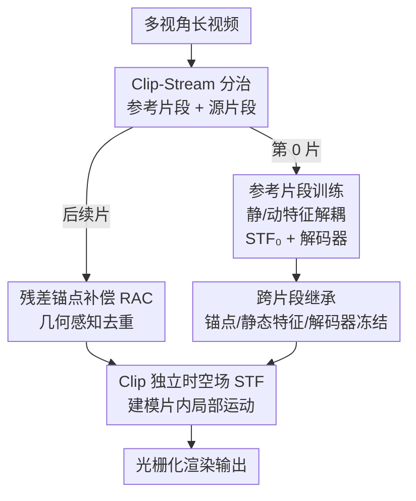

# ClipGStream: Clip-Stream Gaussian Splatting for Any Length and Any Motion Multi-View Dynamic Scene Reconstruction

**会议**: CVPR2026  
**arXiv**: [2604.13746](https://arxiv.org/abs/2604.13746)  
**代码**: 项目主页 https://liangjie1999.github.io/ClipGStreamWeb/ (有)  
**领域**: 3D视觉 / 动态高斯泼溅  
**关键词**: 动态场景重建, 高斯泼溅, 长序列, 大幅运动, 时序一致性

## 一句话总结
ClipGStream 把动态视频切成若干片段，用「参考片段建底座、源片段在底座上增量训练」的 Clip-Stream 混合范式，既保留 Clip 方法的片内时序稳定，又借鉴 Frame-Stream 的可扩展性，在 1400 帧大幅运动场景上做到无闪烁、低显存、SOTA 的动态高斯重建。

## 研究背景与动机
**领域现状**：多视角动态场景重建（用于 VR/MR/XR 的体积视频）目前主流基于动态高斯，分两大流派：Frame-Stream 逐帧优化（如 3DGStream 用 Neural Transformation Cache 建模帧间运动），Clip 方法把一段约 300 帧的片段当成整体联合优化（如 4DGS、SpaceTimeGS）。

**现有痛点**：Frame-Stream 可扩展到超长序列，但逐帧独立优化会累积误差、产生帧间抖动；Clip 方法片内时序一致，但「一次性优化所有帧」显存和算力开销巨大，序列长度受限——而且两类方法都只擅长细微运动，遇到篮球比赛这种大幅、快速运动就崩。

**核心矛盾**：可扩展性（逐帧/流式）与时序一致性（整段联合）之间存在 trade-off，且现有 Clip 方法隐含一个硬约束 $M=N$（片长必须等于全序列长度），一旦强行切成多个 $M<N$ 的小片，片与片之间就出现明显的边界闪烁。

**本文目标**：在不牺牲时序一致性的前提下，把动态重建扩展到任意长度、任意运动幅度的序列，并压低显存。

**切入角度**：作者观察到——时序一致性其实只需要在「片内」保证，而「跨片」的一致性可以靠共享并冻结一套稳定的静态结构（锚点、静态特征、解码器）来锚定；运动这种局部、剧烈变化的量则应该让每个片段独立去拟合。

**核心 idea**：用「片级流式」（Clip-Stream）替代「帧级流式」——第一个片段（Reference Clip）充分优化出稳定底座，后续片段（Source Clips）在这个冻结底座上只学残差锚点与片内独立运动场，从而把 Clip 的稳定性和 Stream 的可扩展性合二为一。

## 方法详解

### 整体框架
ClipGStream 把长视频均匀切成 $N$ 个片段，每片含 $M$ 帧多视角图像。第 0 片是 **Reference Clip**，其余 $\text{Clip}_{n\in[1,N-1]}$ 是 **Source Clip**。整体分两阶段：参考片段阶段把场景表示为一组 ScaffoldGS 风格的锚点，每个锚点带一个静态特征 $f_s\in\mathbb{R}^{64}$ 和一个由时空场 STF 产出的动态特征 $f_d\in\mathbb{R}^{64}$，二者拼接后送进解码器 $d(\cdot)$ 解码成 Temporal Gaussians 并光栅化；源片段阶段则继承并冻结参考片段的锚点、静态特征和解码器，只通过「残差锚点补偿」补上新出现/位移的结构，并为该片单独训练一个独立 STF 来建模局部运动。

静态/动态特征的解耦是整个继承策略能成立的前提：实验（Fig.3）显示 $f_s$ 学到了片内全部背景信息（所以跨片共享能保证时序一致），$f_d$ 学的是控制动态内容可见性的残差信息（所以必须片间独立）。

### 关键设计

**1. Clip-Stream 混合范式：用参考片段建底座、源片段做增量**

针对「可扩展性 vs 时序一致性」的根本 trade-off，作者不再逐帧流式，而是逐片流式。序列切成 $N$ 个片段后，$\text{Clip}_0$ 被完整优化成一个稳定的时空底座，其后每个 $\text{Clip}_n$ 都建立在已训练好的参考表示之上增量训练。这样片内享受 Clip 方法的联合优化稳定性，片间又像 Frame-Stream 一样可以一片接一片地持续扩展，从而支持任意长度序列。关键之处在于它打破了旧 Clip 方法 $M=N$ 的隐含约束：现在 $M$（片长）可以远小于 $N$（总帧数），而跨片一致性由后面的继承策略保证，不会像 LocalDyGS 那样一旦 $M<N$ 就片界闪烁

**2. 残差锚点补偿 RAC：几何感知去重，只补真正新增的结构**

大幅运动会让场景里出现新物体或锚点发生大位移，单靠形变场（deformation）无法准确捕捉。如果直接把当前片段 COLMAP 重建出的全部锚点 $A^c_n$ 加进来，又会和参考片段已有锚点 $A_0$ 严重冗余。RAC 的做法是计算两者的残差：$A_n = A_0 \cup \text{Dedup}(A^c_n, A_0)$。去重靠「几何感知」——把每个 $A_0$ 中的锚点 $p$ 表示成一个球，半径取它到三个最近邻的平均欧氏距离 $r=\frac{1}{3}\sum_{i=1}^{3}\lVert p_i - p\rVert_2$，所有球构成一个「覆盖场」描述已被表示的区域；再对每个候选锚点 $q\in A^c_n$ 算它到覆盖面的有符号距离，$\text{SDF}(q)>0$（落在覆盖球外、确实是新结构）才保留为残差锚点，否则丢弃。这样既补上了快速运动带来的新结构，又避免锚点无脑膨胀，同时去掉源片段里冗余的静态锚点以抑制闪烁

**3. Clip 独立时空场 STF：每片一套运动场，避免后片覆盖前片**

动态特征 $f_{d}$ 在不同片段之间差异很大，若所有片段共享同一个 $\text{STF}_0$，后面的片段会把前面已学到的运动「写花」。因此作者给每个片段分配一个独立时空场 $\text{STF}_1,\dots,\text{STF}_{N-1}$，实现为一个 4D hash grid $h_n$ 接一个 fully-fused MLP，对锚点 $\mu_n$ 在时刻 $t$ 产出动态特征 $f_{d,n}=\phi_n(h_n(\mu_n, t))$。这种片专属设计让运动建模局部化，既不互相干扰又能在长序列上保持连贯。消融（Tab.6）显示这一点至关重要：完全独立训练（连静态都不共享）PSNR 只有 21.85、共享单一 STF 为 23.11，而「片独立 STF + 静态继承」达到 24.54

**4. Inter-clip 继承：冻结锚点、静态特征与解码器，锁死跨片一致性**

如果每个源片段都重新初始化锚点和解码器，跨片表示会不一致，导致静态区域剧烈闪烁、动态区域渲染退化。作者提出静态继承策略：源片段直接继承参考片段的锚点 $A_0$、静态特征 $f_{s,0}$ 和解码器 $d$，并在整个后续训练中保持**冻结**。新片段的静态特征只追加一个与残差锚点 $A^r_n$ 关联的可学习残差分量 $f_{s,n}=[f_{s,0}; f^r_{s,n}]$；解码器复用同一个 $d$ 保证几何与外观属性在所有片段上被一致地解码。它由两个模块组成——锚点继承（AI）冻结静态锚点防止局部重优化，解码器继承（DI）保证跨片解码一致——消融显示去掉任一个都会让相邻片残差热图在静态区域强烈响应（即闪烁）

### 损失函数 / 训练策略
训练目标在 3DGS 的 $L_1$ 和结构相似度 $L_{\text{SIM}}$ 基础上，加一个轻量体积正则 $L_v=\sum_{i=1}^{M}\text{Prod}(s^i_t)$（约束每个 Temporal Gaussian 只表示局部区域、$s^i_t$ 为第 $i$ 个高斯在时刻 $t$ 的尺度），总损失为

$$L = (1-\lambda_{\text{SIM}})L_1 + \lambda_{\text{SIM}}L_{\text{SIM}} + \lambda_v L_v$$

所有 MLP 为两层 ReLU，动/静态特征维度均为 64，用 Adam 优化。一个实现细节：每个片段开始训练时**重新初始化**学习率调度器，而非继承参考片段的状态，否则学习率会越训越小、妨碍后续片段有效优化。

## 实验关键数据

### 主实验
Long 360（1400 帧、36 相机 4K 篮球场景，静态方法仅在第 0 帧测试）：

| 类别 | 方法 | PSNR↑ | DSSIM₁↓ | DSSIM₂↓ | LPIPS↓ |
|------|------|-------|---------|---------|--------|
| 静态 | 3DGS | 24.13 | 0.087 | 0.040 | 0.159 |
| Frame-Stream | 3DGStream | 21.94 | 0.105 | 0.053 | 0.200 |
| Clip | LocalDyGS | 23.11 | 0.093 | 0.046 | 0.178 |
| Clip-Stream | **ClipGStream** | **24.54** | **0.079** | **0.036** | **0.146** |

ClipGStream 是唯一在动态序列上超过静态 3DGS（24.13）的方法，相比最好的 Clip 方法 LocalDyGS（23.11）高出 1.43 dB。

N3DV（五个 300 帧场景）兼顾质量与效率：

| 方法 | PSNR↑ | FPS↑ | 训练时间↓ | 模型大小↓ |
|------|-------|------|-----------|-----------|
| 3DGStream | 31.67 | 215 | 1.0h | 1230MB |
| SpaceTimeGS | 32.05 | 140 | >5h | 200MB |
| LocalDyGS | 32.28 | 105 | 0.58h | 100MB |
| **ClipGStream** | **32.53** | 106 | **0.5h** | **98MB** |

PSNR 最高（32.53）的同时训练时间最短（0.5h）、模型最小（98MB）。在 flame salmon（1200 帧）上 PSNR 29.40 / LPIPS 0.144，也超过 4DGaussian（28.89 / 0.196）。

### 消融实验
Long 360 上拆模块（PSNR / LPIPS）：

| 配置 | PSNR↑ | LPIPS↓ | 说明 |
|------|-------|--------|------|
| ours（完整） | 24.54 | 0.146 | 完整模型 |
| w/o DI（解码器继承） | 24.34 | 0.152 | 去掉后动态区域变模糊 |
| w/o RAC（残差锚点补偿） | 23.62 | 0.160 | 掉点最多，大幅运动建模失效 |

两种切片训练策略对比：

| 配置 | PSNR↑ | DSSIM₁↓ | LPIPS↓ |
|------|-------|---------|--------|
| 完全独立训练 | 21.85 | 0.142 | 0.316 |
| 共享单一 STF | 23.11 | 0.093 | 0.178 |
| ours | **24.54** | **0.079** | **0.146** |

### 关键发现
- **RAC 贡献最大**：去掉 RAC 后 PSNR 从 24.54 跌到 23.62（-0.92 dB），说明残差锚点补偿是处理大幅运动、补回新增结构的核心。
- **切片策略本身比单模块更关键**：完全独立训练（不继承任何静态）PSNR 仅 21.85，比完整模型低 2.69 dB——印证「静态继承 + 片独立运动场」的解耦是整套方法的基石。
- **打破 $M=N$ 约束**：Fig.9 显示 LocalDyGS 把 1400 帧硬切成 140 个片段就会出现明显片界不一致甚至训不动，而 ClipGStream 在 $M<N$ 时仍无闪烁，这是它能扩展到任意长序列的直接证据。
- **效率不靠牺牲质量换**：在 N3DV 上做到 PSNR、训练时间、模型大小三项同时最优，得益于冻结底座只训残差/局部运动，显存与计算都被压低。

## 亮点与洞察
- **「片级流式」这个抽象本身很巧**：它把时序一致性的责任精准切分——片内交给联合优化，片间交给「冻结一套稳定静态底座」，绕开了逐帧累积误差和整段联合优化显存爆炸两个极端，是 Frame-Stream 与 Clip 的真正融合而非简单拼接。
- **静/动特征解耦驱动继承策略**：先用消融可视化证明 $f_s$ 装背景、$f_d$ 装动态残差，再据此决定「静态共享冻结、动态片间独立」，设计动机有实证支撑而非拍脑袋，这种「先观察再设计」的链路值得借鉴。
- **几何感知去重可迁移**：用「最近邻平均距离当半径的球覆盖场 + SDF 符号」判断一个候选点是不是新结构，是一个轻量、无需学习的几何过滤器，可以迁移到任何「增量加点又怕冗余」的点云/高斯场景（如增量式 SLAM 建图、流式重建去重）。
- **重置学习率调度器的小细节**：每片重新初始化 LR scheduler 避免学习率衰减到训不动，是流式/分段训练里容易踩的坑，提醒做增量训练时别盲目继承优化器状态。

## 局限与展望
- **依赖 COLMAP 位姿**：作者承认在图像重叠低或大面积无纹理区域，COLMAP 标定不准会直接拖累重建质量；未来计划接更鲁棒的位姿估计。
- **切片粒度 $M$ 是超参**：论文虽证明 $M<N$ 可行，但 $M$ 取多大才在「片内运动可建模」与「片数过多累积漂移」间最优，缺乏系统性的自动选择策略，目前像是手工设定。
- **参考片段是单点依赖**：所有源片段都冻结继承第 0 片的静态底座，若参考片段本身重建质量差（如开头几帧标定不佳），误差会被锁进整段序列，缺乏对参考片段的更新/纠错机制。
- **仅多视角设置**：方法面向同步多相机采集，单目动态场景（视角受限、几何约束不足）能否套用未讨论。

## 相关工作与启发
- **vs Frame-Stream（3DGStream / iFVC）**：他们逐帧用 NTC 等缓存建模帧间运动、可扩展但累积抖动；本文把流式粒度从帧提升到片，片内联合优化消除抖动，片间继承冻结底座保持一致，在 Long 360 上 PSNR 比 3DGStream 高 2.6 dB。
- **vs Clip 方法（4DGS / SpaceTimeGS / LocalDyGS）**：他们对整段联合优化、片内一致但隐含 $M=N$、显存大且扩不长；本文允许 $M<N$ 并用 Inter-clip 继承补回跨片一致，从而在质量超过 LocalDyGS（24.54 vs 23.11）的同时把模型压到 98MB、训练 0.5h。
- **vs ScaffoldGS**：本文沿用其「锚点组织高斯」的思路，但把锚点特征重新拆成 64 维静态 + 64 维动态（STF 产出），使「静态继承、动态独立」的分治成为可能，这是从静态场景表示向动态长序列的关键改造。

## 评分
- 新颖性: ⭐⭐⭐⭐⭐ 首个 Clip-Stream 混合范式，打破 Clip 方法 $M=N$ 约束的思路清晰且有效
- 实验充分度: ⭐⭐⭐⭐ 三个数据集（含自建 Long 360 1400 帧）+ 多组消融，但缺 $M/N$ 取值的系统扫描
- 写作质量: ⭐⭐⭐⭐ 动机推导和两阶段策略讲得清楚，公式与图配合到位
- 价值: ⭐⭐⭐⭐⭐ 直击长序列大幅运动这一实际痛点，效率与质量双优，对体积视频/沉浸式媒体落地有实用价值

<!-- RELATED:START -->

## 相关论文

- [\[CVPR 2026\] Any Resolution Any Geometry: From Multi-View To Multi-Patch](any_resolution_any_geometry_from_multi-view_to_multi-patch.md)
- [\[CVPR 2026\] BRepGaussian: CAD Reconstruction from Multi-View Images with Gaussian Splatting](brepgaussian_cad_reconstruction_from_multi-view_images_with_gaussian_splatting.md)
- [\[CVPR 2026\] AeroGS: Scale-Aware Gaussian Splatting for Pose-Free Dynamic UAV Scene Reconstruction](aerogs_scale-aware_gaussian_splatting_for_pose-free_dynamic_uav_scene_reconstruc.md)
- [\[CVPR 2026\] Generalizable Human Gaussian Splatting via Multi-view Semantic Consistency](generalizable_human_gaussian_splatting_via_multi-view_semantic_consistency.md)
- [\[CVPR 2026\] MotionScale: Reconstructing Appearance, Geometry, and Motion of Dynamic Scenes with Scalable 4D Gaussian Splatting](motionscale_reconstructing_appearance_geometry_and_motion_of_dynamic_scenes_with.md)

<!-- RELATED:END -->
