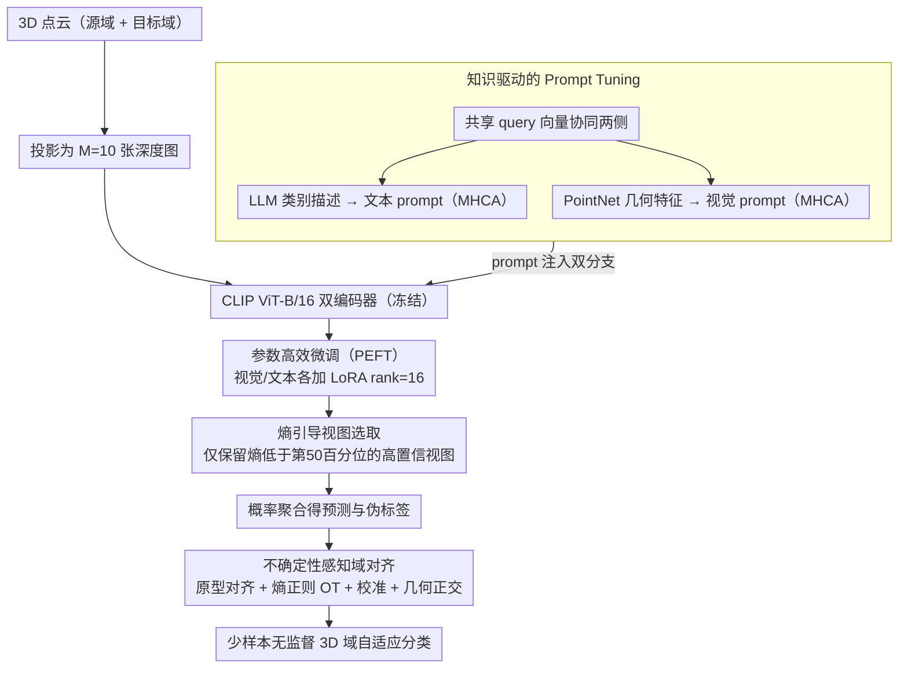

# CLIPoint3D: Language-Grounded Few-Shot Unsupervised 3D Point Cloud Domain Adaptation

**会议**: CVPR2026  
**arXiv**: [2602.20409](https://arxiv.org/abs/2602.20409)  
**代码**: [SarthakM320/CLIPoint3D](https://github.com/SarthakM320/CLIPoint3D)  
**领域**: 3D视觉  
**关键词**: 3D点云域自适应, CLIP, 视觉-语言模型, 少样本学习, 无监督域自适应, 最优传输, 参数高效微调

## 一句话总结

首个基于 CLIP 的少样本无监督 3D 点云域自适应框架，通过知识驱动的 prompt tuning、参数高效微调、熵引导视图选取和不确定性感知对齐损失，在 PointDA-10 和 GraspNetPC-10 上以仅 ~11M 可训练参数取得 3-16% 的一致性精度提升。

## 研究背景与动机

**3D 点云域偏移严重**：不同传感器采集的点云在密度、采样模式、遮挡和背景杂波上差异巨大，深度 3D 模型在跨域场景下性能骤降，尤其是合成→真实的迁移。

**传统 3D UDA 方法计算开销大**：对抗对齐（PointDAN）、自监督（DefRec）、伪标签（GAST/MLSP）等方法依赖重型 3D 编码器，精度尚可但效率低，且缺乏语义先验。

**CLIP 在 3D 上的局限**：已有的 CLIP-3D 扩展（PointCLIP/v2）将点云投影为深度图由 CLIP 处理，但存在：(a) 模态差距——CLIP 在 RGB 图像上预训练，无法充分捕获稀疏无纹理的深度特征；(b) 域差距——缺少跨域对齐机制，零样本迁移能力弱。

**少样本标注需求**：3D 标注成本高昂且易出错，需要在极少标注下实现有效域迁移。

**多视图融合不稳定**：均匀聚合所有投影视图时，遮挡或稀疏视图引入噪声，降低预测质量。

**语义与分布对齐的联合需求**：仅做统计对齐（MMD/对抗）或仅做语义对齐（伪标签）均不足，需同时保证类级一致性和全局分布匹配。

## 方法详解

### 整体框架

CLIPoint3D 要解决的是 3D 点云跨域分类时既缺标注又有严重域偏移的难题，且希望尽量复用 CLIP 的语义先验而不训练重型 3D 编码器。框架建在冻结的 CLIP（ViT-B/16）之上：每个 3D 点云先投影成 M=10 张深度图，送入 CLIP 视觉编码器提特征；在此之上叠加四个模块协同工作——知识驱动的 prompt tuning 注入语义与几何先验、PEFT 用 LoRA 低成本适配 CLIP 双分支、熵引导视图选取过滤噪声视图、不确定性感知域对齐把源域知识迁到目标域，最终以仅 ~11M 可训练参数完成少样本无监督域自适应。

### 关键设计

**1. 知识驱动的 Prompt Tuning：给 CLIP 注入 3D 语义与几何先验**

CLIP 在 RGB 图上预训练，面对稀疏无纹理的深度图存在模态差距。这一模块从文本和视觉两侧同时补先验：文本侧用 LLM（GPT-5）为每个类别生成描述性文本（如 "a 3D point cloud object of a [CLS] with [attributes]"），经冻结 CLIP 文本编码器得到 $\mathbf{T}^{llm}$，再通过多头交叉注意力（MHCA）与一组共享 query 向量 $\mathbf{q}$ 交互，生成语义感知的文本 prompt $\mathbf{P}_t$；视觉侧用轻量 PointNet 提取点云结构特征 $\mathbf{I}_{3D}$，同样经 MHCA 与共享 $\mathbf{q}$ 生成几何感知的视觉 prompt $\mathbf{P}_v$ 注入视觉编码器。关键在于这条共享 query（长度 4、维度 512）让文本与视觉 prompt 在统一语义参考下协同演化，同时各自保留模态特异性，比朴素多模态拼接（MaPLe）更稳。

**2. 参数高效微调（PEFT）：低秩适配保住 CLIP 的零样本能力**

全参微调会破坏 CLIP 预训练得到的零样本能力，又昂贵。这里对 CLIP 视觉与文本编码器都施加 LoRA（rank=16, dropout=0.1），只更新低秩适配器：视觉侧 LoRA 专门捕获曲率、表面连续性、深度过渡这些 3D 特有的残差线索，文本侧 LoRA 则把 LLM 增强的 prompt 对齐到 3D 结构属性。消融显示 LoRA 双分支联合微调显著优于 LayerNorm/BitFit，低秩适配更擅长抓域特定线索。

**3. 熵引导视图选取：只信高置信视图，丢掉遮挡噪声**

把 M=10 张投影视图均匀聚合时，遮挡或稀疏视图会引入噪声拉低预测。模块对每张深度图 $x_{i,m}$ 计算预测熵 $H_{i,m}$，只保留熵低于第 50 百分位阈值的高置信视图子集 $\mathcal{M}_i^*$ 参与概率聚合。这一步不引入任何额外参数，训练和推理都用，相当于一个免费的视图级降噪开关，消融中优于均匀平均、加权平均、最大相似度和随机选取。

**4. 不确定性感知域对齐：语义对齐与分布对齐两手抓**

只做统计对齐或只做语义对齐都不够，这一模块用四项损失联合收紧：熵加权原型对齐 $\mathbf{L}_{proto}$ 用熵权重算各类源域原型 $\mathbf{U}_c$，对目标域伪标签样本做置信度加权的对比学习，让高置信样本主导语义对齐；熵正则化最优传输 $\mathbf{L}_{OT}$ 在点云级嵌入上用 Sinkhorn 解最优传输并加熵正则避免耦合过尖锐；辅助校准损失 $\mathbf{L}_{conf}$ 最小化两域预测熵，使源域原型更干净、目标域聚类更紧；几何正则 $\mathbf{L}_{ortho}$ 对 3D 编码器特征做正交约束强制局部特征去相关。这组设计有理论支撑——OT 损失对应域自适应泛化界里的 $d_{\mathcal{H}\Delta\mathcal{H}}$ 项，原型对齐则降低理想联合误差 $\lambda^*$。

### 损失函数

四项对齐损失与交叉熵联合优化：

$$\mathbf{L}_{total} = \mathbf{L}_{ce} + \alpha(\mathbf{L}_{ortho} + \mathbf{L}_{proto} + \mathbf{L}_{OT} + \mathbf{L}_{conf}), \quad \alpha=1$$

## 实验

### 主实验结果

**PointDA-10 基准**（ModelNet/ShapeNet/ScanNet，10 类共 6 个迁移方向）：

| 方法 | M→S | M→S* | S→M | S→S* | S*→M | S*→S | Avg |
|:--|:--:|:--:|:--:|:--:|:--:|:--:|:--:|
| 3DeNet (SOTA encoder) | 84.5 | 57.1 | 78.8 | 57.2 | 77.5 | 78.1 | 72.2 |
| PointCLIP | 50.8 | 20.9 | 50.1 | 20.9 | 50.1 | 50.8 | 40.6 |
| **CLIPoint3D-V** | **84.6** | **53.5** | **91.6** | **55.3** | **87.9** | **81.3** | **75.7** |

平均精度 75.7%，超过最佳 encoder-based 方法 3.5%。

**GraspNetPC-10 基准**（Synthetic/Kinect/RealSense，4 个迁移方向）：

| 方法 | Syn→Kin | Syn→RS | Kin→RS | RS→Kin | Avg |
|:--|:--:|:--:|:--:|:--:|:--:|
| GAI (SOTA encoder) | 81.2 | 73.1 | 66.4 | 82.6 | 75.8 |
| PointCLIP | 30.7 | 24.3 | 24.3 | 30.7 | 27.5 |
| **CLIPoint3D-B** | **96.5** | **89.3** | **86.8** | **96.2** | **92.2** |

平均精度 92.2%，超过最佳 baseline **16.4%**，在所有方向均大幅领先。

### 消融实验

- **PEFT 策略**：LoRA（Both）+PT 最优 92.2%；单独 LoRA（Both）90.5%；LayerNorm/BitFit 效果明显弱于 LoRA。
- **损失分解**：仅 $L_{ce}$ 为 64.3%（GraspNetPC-10）；逐步加入 $L_{ortho}$ (+10.6%), $L_{OT}$ (+10.1%), $L_{proto}$, $L_{conf}$ 均有增益，全部联合达 92.2%。
- **Prompt 策略**：LLM 文本 prompt + 3D 视觉 prompt 联合最优（75.7%），显著优于朴素多模态拼接（MaPLe 72.4%）和单模态 prompt。
- **视图数量**：M=10 达峰值，更多视图仅增加冗余。
- **视图选取策略**：熵引导 > 均匀平均 > 加权平均 > 最大相似度 > 随机选取。
- **Few-shot 敏感性**：8 到 64 shot 精度快速上升，64 shot 后基本饱和。

### 关键发现

- 零样本 CLIP 方法（PointCLIP/v2, ZS-CLIP）在 3D 域自适应中表现远弱于 encoder-based 方法，直接跨域迁移不可行。
- LoRA 在 CLIP 双分支上的联合微调比 LayerNorm/BitFit 显著更优，低秩适配更擅长捕获域特定线索。
- t-SNE 可视化显示适应后 Fréchet Distance 从 0.19 降至 0.0009，MMD 从 1.08 降至 0.12。

## 亮点

- **首创性**：首个将 CLIP 用于 3D 点云无监督域自适应的框架，填补研究空白。
- **高效**：仅 ~11M 可训练参数（vs. GAST 161M），计算友好且大幅超越全参微调方法。
- **理论支撑**：基于域自适应泛化界推导出代理 bound，OT 损失对应 $d_{\mathcal{H}\Delta\mathcal{H}}$ 而原型对齐降低 $\lambda^*$，设计有理论依据。
- **模块化设计**：四个模块可独立启用，消融清晰地展示了各组件的边际贡献。

## 局限性

- ScanNet 相关的迁移方向（M→S\*, S→S\*）上精度反而略低于部分 encoder-based 方法，对真实扫描场景的适应仍有不足。
- 依赖 LLM 生成类别描述，增加推理管线复杂度和对外部服务的依赖。
- 实验仅在 10 类分类任务上验证，未涉及更大规模数据集或分割/检测等下游任务。
- 3D→2D 投影本身丢失拓扑信息，框架受限于投影质量。
- 伪标签的噪声累积问题虽通过熵加权缓解但未根本解决，未来可引入自精炼管线。

## 相关工作

- **3D UDA encoder-based**：PointDAN、GAST、MLSP、3DeNet——基于重型 3D 编码器的对抗/自监督/伪标签对齐。
- **CLIP-3D 扩展**：PointCLIP/v2、DiffCLIP、CG3D——点云多视图投影 + CLIP 推理，但无域自适应设计。
- **CLIP-2D UDA**：DAPL、AD-CLIP、PADCLIP——2D 图像域自适应中的 CLIP prompt 学习，不适用于 3D。
- **Prompt Tuning**：CoOp、VPT、MaPLe——通用 prompt 学习方法，本文在此基础上引入 LLM 语义和 3D 几何的知识注入。

## 评分

- 新颖性: ⭐⭐⭐⭐ （首个 CLIP-based 3D UDA 框架，知识驱动 prompt + UA-OT 对齐设计有创意）
- 实验充分度: ⭐⭐⭐⭐ （两个基准、8 项消融、效率分析和可视化，但数据集规模和任务类型有限）
- 写作质量: ⭐⭐⭐⭐ （结构清晰，理论与实验衔接好）
- 价值: ⭐⭐⭐⭐ （为 3D 域自适应开辟了轻量化的 VLM 路线）

<!-- RELATED:START -->

## 相关论文

- [\[AAAI 2026\] Multi-Modal Assistance for Unsupervised Domain Adaptation on Point Cloud 3D Object Detection](../../AAAI2026/3d_vision/multi-modal_assistance_for_unsupervised_domain_adaptation_on_point_cloud_3d_obje.md)
- [\[ECCV 2024\] Progressive Classifier and Feature Extractor Adaptation for Unsupervised Domain Adaptation on Point Clouds](../../ECCV2024/3d_vision/progressive_classifier_and_feature_extractor_adaptation_for_unsupervised_domain_.md)
- [\[CVPR 2026\] QD-PCQA: Quality-Aware Domain Adaptation for Point Cloud Quality Assessment](qd-pcqa_quality-aware_domain_adaptation_for_point_cloud_quality_assessment.md)
- [\[AAAI 2026\] EPSegFZ: Efficient Point Cloud Semantic Segmentation for Few- and Zero-Shot Scenarios](../../AAAI2026/3d_vision/epsegfz_efficient_point_cloud_semantic_segmentation_for_few-_and_zero-shot_scena.md)
- [\[CVPR 2026\] PP-Brep: Few-Shot B-rep Classification with Hybrid Graph Representation](pp-brep_few-shot_b-rep_classification_with_hybrid_graph_representation.md)

<!-- RELATED:END -->
