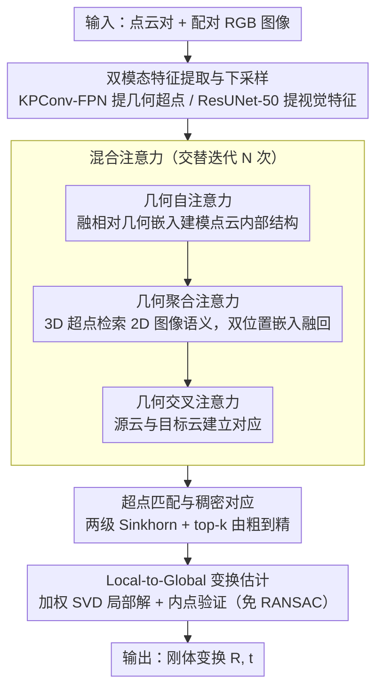

<!-- 由 src/gen_stubs.py 自动生成 -->
# CMHANet: A Cross-Modal Hybrid Attention Network for Point Cloud Registration

**会议**: CVPR2026  
**arXiv**: [2603.12721](https://arxiv.org/abs/2603.12721)  
**代码**: [DongXu-Zhang/CMHANet](https://github.com/DongXu-Zhang/CMHANet)  
**领域**: 3D视觉  
**关键词**: 点云配准, 跨模态融合, 混合注意力, 对比学习, 多模态特征

## 一句话总结

提出 CMHANet，通过跨模态混合注意力机制将 2D 图像纹理语义特征与 3D 点云几何特征深度融合，结合对比学习优化函数，在 3DMatch/3DLoMatch 上实现 SOTA 点云配准性能。

## 背景与动机

1. **点云配准是 3D 视觉基础任务**：广泛应用于大规模三维重建、增强现实、场景理解等，但真实场景中噪声、稀疏、低重叠率等问题严重制约配准精度
2. **传统方法仅依赖几何信息**：ICP 及其变体对初始对齐敏感，易陷入局部最优；基于深度学习的方法虽有进步但大多仍只使用单一 3D 几何模态
3. **2D 图像与 3D 点云具有天然互补性**：点云提供精确几何但缺乏纹理描述，2D 图像提供稠密纹理语义但缺乏显式 3D 信息，融合两者可获得更全面的场景理解
4. **RGB-D 传感器普及**：深度相机+RGB 相机的配对采集设备已十分常见，多模态数据易于获取
5. **现有多模态融合方法不够精细**：IMFNet、CMIGNet 等虽尝试融合但采用通用融合策略，缺乏对 2D/3D 特征交互的精细建模
6. **注意力机制在捕捉长程依赖方面优势显著**：Transformer 架构能建模全局上下文，但如何在跨模态场景下充分发挥其优势仍是开放问题

## 方法详解

### 整体框架

CMHANet 要解决的是低重叠、噪声、稀疏点云配准时纯几何信息不够用的问题，思路是把 2D 图像的纹理语义特征深度融进 3D 点云几何特征。整条管线分四步走：先用双骨干分别从点云和配对图像提特征并下采样成超点，再用混合注意力让几何特征与图像特征反复交互精炼，接着在超点层和稠密点层两级做匹配求对应，最后用一个免 RANSAC 的 Local-to-Global 策略估计刚体变换。

### 关键设计

**1. 双模态特征提取与下采样：几何和纹理各取所长**

点云有精确几何但缺纹理，图像有稠密纹理语义但缺显式 3D 信息，所以两路分开提特征。点云侧用 KPConv-FPN 骨干提几何特征并下采样成超点 $S^P, S^Q$，同时用最近超点聚合（Nearest-Superpoint Aggregation）把原始稠密点和超点关联起来；图像侧用 ResUNet-50 从配对 2D 图像提视觉特征 $\hat{F}^n, \hat{F}^m$。这一步为后面的跨模态融合准备好两种互补表示。

**2. 混合注意力：三种注意力交替把图像语义缝进几何特征**

这是把"纹理补几何"真正落地的核心模块，三种注意力交替迭代 $N$ 次逐步精炼特征。几何自注意力在单个点云内部建模全局结构，Key 里融了相对几何嵌入（距离嵌入 + 三角角度嵌入）使注意力具备空间感知；几何聚合注意力是跨模态融合的关键，让 3D 超点作为 Query 去 2D 图像面上检索相关视觉上下文，Query/Key 中同时注入 3D 坐标位置嵌入和 2D 像素位置嵌入强制跨模态几何一致，再用残差连接把聚合到的图像特征融回点云特征；几何交叉注意力让源点云与目标点云交互，源云出 Query、目标云出 Key/Value，建立两片点云间的一致性对应。相比 IMFNet、CMIGNet 那种通用拼接式融合，这里靠双位置嵌入实现的是几何感知的精细检索。

**3. 超点匹配与稠密对应：两级 Sinkhorn 由粗到精**

配准要在欠重叠下找到可靠对应。先在超点层基于融合特征算相似度矩阵，引入可学习 dustbin 参数吸收非重叠的 outlier 点，用 Sinkhorn 算法（50 次迭代）做双归一化后 top-k 选出超点匹配对；再在每个匹配超点对内部算点级相似度，又一次 Sinkhorn + top-k 提取精细的点对点对应。两级 coarse-to-fine 结构和 CoFiNet 一脉相承，但靠跨模态信息在低重叠时更稳。

**4. Local-to-Global 变换估计：免 RANSAC 的可微估计**

RANSAC 不可微、拖慢端到端训练。局部阶段对每个超点对用加权 SVD 算局部刚体变换（可微闭式解）；全局阶段用 Local-to-Global 验证策略，在全部对应集上统计每个候选变换的空间内点数（阈值 $\tau_a = 5$ cm），选内点最多的作为最终变换。这套替代 RANSAC 的做法既可微又快上百倍。

### 损失函数

三部分联合优化：$\mathcal{L} = \mathcal{L}_c + \mathcal{L}_f + \lambda \mathcal{L}_{cmc}$（$\lambda = 0.5$）。粗匹配损失 $\mathcal{L}_c$ 用 overlap-aware circle loss 做度量学习，重叠率 >10% 算正样本对、以重叠率平方根加权；细匹配损失 $\mathcal{L}_f$ 最小化匹配超点对内稠密点对应的对齐误差；跨模态对比损失 $\mathcal{L}_{cmc}$ 在超点级构造几何特征与图像特征的对比学习，对角线为正、非对角线为负，即使 batch size=1 也有效。

## 实验关键数据

### 主要结果

在 3DMatch 和 3DLoMatch 基准上的 Registration Recall（%）：

| 方法 | 3DMatch (5000) | 3DLoMatch (5000) |
|------|---------------|-----------------|
| Predator | 89.0 | 61.2 |
| CoFiNet | 89.3 | 67.5 |
| GeoTransformer | - | - |
| OIF-PCR | - | - |
| **CMHANet** | **92.4** | **75.5** |

配准精度（RANSAC-free）：RRE 1.764°、RTE 0.060m（3DMatch），RRE 2.839°、RTE 0.084m（3DLoMatch），均为最优。

### 零样本泛化（TUM RGB-D）

在 3DMatch 上训练，直接测试 TUM 8 个序列，平均 RMSE 0.76（×10⁻²），大幅优于 Robust ICP（1.69）和 DGR（1.44）。

### 消融实验

| 配置 | 3DMatch RR | 3DLoMatch RR |
|------|-----------|-------------|
| 仅 Loss（无 HA、无 IM） | 89.9 | 71.9 |
| 无 HA（有 Loss+IM） | 90.5 | 72.4 |
| 无 Aggre-Att | 91.3 | 73.6 |
| **完整 CMHANet** | **92.4** | **75.5** |

- 移除混合注意力：3DLoMatch RR 下降 3.1%
- 移除聚合注意力（跨模态融合核心）：3DLoMatch RR 下降 1.9%
- 移除图像模块（仅用几何）：3DMatch RR 降至 89.9%

图像编码器对比：ResNet-34 < ResUNet-50 ≈ ResNet-101，ResUNet-50 在精度与效率间取得最佳平衡。

## 亮点

- **跨模态融合设计精细**：聚合注意力将 3D 坐标嵌入和 2D 像素嵌入注入 Query/Key，实现几何感知的跨模态检索，超越简单 concatenation
- **无需 RANSAC 的端到端配准**：Local-to-Global 策略替代 RANSAC，可微且速度快 100 倍以上
- **强泛化能力**：在 TUM RGB-D 上零样本测试以大幅优势超越所有对比方法
- **对比损失设计巧妙**：超点级跨模态对比学习在 batch size=1 时仍有效，无需大 batch

## 局限与展望

- **极低重叠率场景**（<10%）或完全无纹理平面表面时配准质量下降
- **推理开销增加**：跨模态编码和融合导致特征提取时间比单模态方法更长
- **依赖 RGB-D 配对数据**：需要点云与图像的外参标定对应，限制了纯 LiDAR 场景的适用性
- **未解耦旋转与平移**：作者在 future work 中提出解耦 R 和 t 的计算可能进一步提升对齐精度
- **室外大场景未验证**：仅在室内数据集上测试，未涉及 KITTI 等室外场景

## 与相关工作的对比

- **vs GeoTransformer**：GeoTransformer 仅用几何自注意力+交叉注意力，CMHANet 额外引入图像聚合注意力，RRE 更低（1.764° vs 1.772°）
- **vs IMFNet / PCR-CG**：同为多模态方法，CMHANet 在 3DLoMatch RR 上领先 PCR-CG 9.2%、领先 IMFNet 27.1%，验证了混合注意力融合的优越性
- **vs CoFiNet**：均采用 coarse-to-fine 策略，但 CMHANet 通过跨模态信息在低重叠情况下优势显著（75.5% vs 67.5%）
- **vs 传统 ICP 系列**：在 TUM 零样本测试中 CMHANet 平均 RMSE 仅 0.76，Robust ICP 为 1.69

## 评分

- 新颖性: ⭐⭐⭐⭐ — 混合注意力中聚合注意力的跨模态位置嵌入设计有新意，对比损失在超点级构造正负样本的方式简洁有效
- 实验充分度: ⭐⭐⭐⭐ — 覆盖 3DMatch/3DLoMatch/TUM 三个数据集，消融实验完整（模块/骨干/估计器），定量+定性分析齐全
- 写作质量: ⭐⭐⭐⭐ — 结构清晰，公式符号一致，图表丰富
- 价值: ⭐⭐⭐⭐ — 多模态点云配准的实用方向，SOTA 结果+代码开源，对后续工作有参考价值

<!-- RELATED:START -->

## 相关论文

- [\[ECCV 2024\] Explicitly Guided Information Interaction Network for Cross-modal Point Cloud Completion](../../ECCV2024/3d_vision/explicitly_guided_information_interaction_network_for_cross-modal_point_cloud_co.md)
- [\[ECCV 2024\] Equi-GSPR: Equivariant SE(3) Graph Network Model for Sparse Point Cloud Registration](../../ECCV2024/3d_vision/equi-gspr_equivariant_se3_graph_network_model_for_sparse_point_cloud_registratio.md)
- [\[CVPR 2025\] UniPre3D: Unified Pre-training of 3D Point Cloud Models with Cross-Modal Gaussian Splatting](../../CVPR2025/3d_vision/unipre3d_unified_pre-training_of_3d_point_cloud_models_with_cross-modal_gaussian.md)
- [\[CVPR 2026\] Hg-I2P: Bridging Modalities for Generalizable Image-to-Point-Cloud Registration via Heterogeneous Graphs](hg-i2p_bridging_modalities_for_generalizable_image-to-point-cloud_registration_v.md)
- [\[CVPR 2026\] AffordGrasp: Cross-Modal Diffusion for Affordance-Aware Grasp Synthesis](affordgrasp_cross-modal_diffusion_for_affordance-aware_grasp_synthesis.md)

<!-- RELATED:END -->
