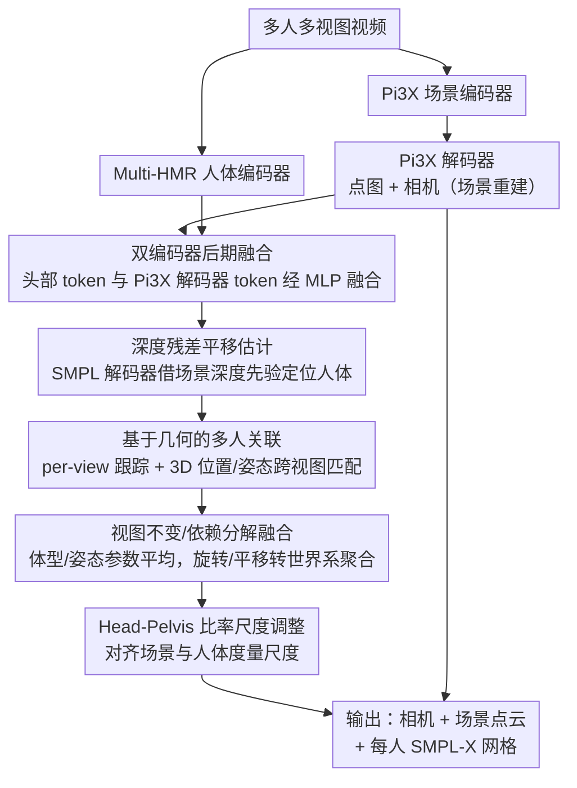

# Coherent Human-Scene Reconstruction from Multi-Person Multi-View Video in a Single Pass

**会议**: CVPR 2026  
**arXiv**: [2603.12789](https://arxiv.org/abs/2603.12789)  
**代码**: [项目页面](https://nstar1125.github.io/chromm)  
**领域**: 3D视觉 / 人体-场景联合重建  
**关键词**: 多视图人体重建, 多人场景, SMPL-X, 3D基础模型, 尺度对齐

## 一句话总结

提出CHROMM统一框架，整合Pi3X几何先验和Multi-HMR人体先验到单一前馈网络，从多人多视图视频中一次性联合重建相机、场景点云和SMPL-X人体网格，无需外部模块、预处理或迭代优化，RICH上多视图WA-MPJPE达53.1mm且比HAMSt3R快8倍以上。

## 研究背景与动机

**领域现状**：3D人体-场景联合重建是计算机视觉核心问题，应用于机器人、自动驾驶和AR/VR。近年3D基础模型（DUSt3R、VGGT、Pi3X）推动了场景重建，Multi-HMR实现了多人人体网格恢复。

**现有痛点**：

1. UniSH、Human3R等单目方法无法利用多视图信息，精度受限
2. HSfM、HAMSt3R等多视图方法依赖额外模块（2D关键点检测器、跨视图ReID模块）或需迭代优化，系统复杂度高
3. 基于外观的Re-ID方法在视觉相似场景（穿制服等）失败
4. Pi3X输出的近度量尺度与SMPL真实度量尺度存在差异——人体穿透地面或漂浮

**核心矛盾**：需同时重建场景和多人人体，但两者尺度不一致、多人跨视图关联困难、且不想依赖外部预处理。

**本文目标** 构建不依赖外部模块和预处理数据的统一前馈框架，一次性完成多人多视图人体-场景联合重建。

**切入角度**：融合Pi3X(场景)和Multi-HMR(人体)两大先验，设计尺度调整模块桥接二者，用几何线索替代外观匹配做跨视图关联。

**核心 idea**：双编码器后期融合 + head-pelvis比率尺度调整 + 视图不变/依赖分解融合 + 几何驱动多人关联。

## 方法详解

### 整体框架

CHROMM 要解决的是从多人、多视图视频里一次性联合重建相机、场景点云和每个人的 SMPL-X 网格，且不依赖任何外部模块（关键点检测、ReID）或迭代优化。它把两大现成先验拼进一个前馈网络：Pi3X 编码器负责场景几何、Multi-HMR 编码器负责人体表示。两路编码后，Pi3X 解码器重建点图和相机，头部检测提取的人体 token 再与 Pi3X 解码器 token 融合，送进 SMPL 解码器回归每个人的姿态、体型和平移。测试时不做优化，靠 per-view 跟踪、几何驱动的跨视图多人关联、视图不变/依赖分解融合，最后用尺度调整模块把场景和人体对齐到同一度量尺度。

### 关键设计

**1. 双编码器后期融合：人体先验不能污染场景重建**

场景和人体两种表示如果在编码端早早混在一起，人体 token 会破坏 Pi3X 的输入分布、损害场景重建。CHROMM 因此坚持后期融合：Pi3X 编码器抓全局 3D 几何，Multi-HMR 编码器专攻人体，人体 token 只在解码之后才与场景 token 通过 MLP 融合，$H_n = \text{MLP}_{\text{fuse}}([Z_n^{\text{scene}} | Z_n^{\text{human}}])$，从而两个先验各司其职、互不干扰。

**2. 深度残差平移估计：借场景深度先验定位人体，而非硬回归**

直接回归 3D 头部平移很不准。这里改成利用 Pi3X 点图提供的深度先验，只预测相对场景深度图的残差 $d_n^m = d_{n,m}^{\text{coarse}} + \Delta d_n^m$，再结合 2D 头部关键点和相机内参反投影成 3D 位置。消融印证了这条路线的价值：深度残差 WA-MPJPE 107.5，直接深度 133.8，直接平移回归则差到 196.4。

**3. 基于几何的多人关联：用 3D 位置而非外观避开制服场景失配**

穿制服等视觉相似场景会让基于外观的 ReID 彻底失败。CHROMM 改用几何线索：per-view 用头部 token 的 L2 距离做帧间匹配，Sinkhorn 最优传输处理未匹配检测；跨视图关联用代价 $\mathcal{C}(a,b) = 0.8 \cdot \|3D位置差\| + 0.2 \cdot \|规范姿态差\|$，再用匈牙利算法做一对一匹配。消融显示只用位置已有 91.1% precision，只用姿态仅 70.6%，组合后 91.3%——位置才是关联的主力。

**4. 视图不变/依赖分解融合：按物理量性质分别聚合，不靠隐式 token 池化**

关联好身份后，同一个人在各视图下的估计要合并成一份。多视图信息怎么合并取决于量的性质：视图不变量（体型 $\beta$、姿态 $\theta$）直接做参数平均，优于隐式 token max-pooling；视图依赖量（旋转 $R$、平移 $\tau$）先转到世界坐标系，再分别用四元数平均和多视图射线三角化。消融排序印证了这种显式分解的优势：Avg+Tri 53.1 > MaxPool+Tri 63.2 > Only Avg 69.3。

**5. Head-Pelvis 比率尺度调整：用人体解剖比例桥接场景与人体的尺度差**

Pi3X 输出的是近度量尺度 $s$，可能偏小让人穿进地面、或偏大让人浮在空中。作为整条测试时管线的收尾，CHROMM 用一个解剖学上稳定的比例来校正：计算图像里 2D 头-骨盆距离 $\ell^{\text{img}}$ 与投影 SMPL 头-骨盆距离 $\ell^{\text{smpl}}$ 的比值，跨所有帧和所有人取平均得到全局调整因子 $r = \frac{1}{|\mathcal{S}|}\sum \frac{\ell^{\text{smpl}}}{\ell^{\text{img}}}$，最终 $s^* = r\cdot s$；骨盆定位走粗到精——头部 token 先估粗位置，对应 patch 回归偏移，骨盆出界就退回粗位置。这是全 pipeline 最关键的一环，去掉它 WA-MPJPE 会从 102.6 暴涨到 169.7。

### 损失函数 / 训练策略

- **两阶段训练**：Stage 1冻结Pi3X+Multi-HMR编码器，训练SMPL解码器等新模块(20 epoch, BEDLAM, lr=5e-5, 前10 epoch不启用尺度调整)
- Stage 2仅解冻骨盆检测MLP(10 epoch, 混合3DPW+MPII+COCO+BEDLAM, lr=1e-4)
- Stage 1损失：3D顶点/关节L1(λ=5.0) + 2D重投影L1 + SMPL参数L1 + 检测BCE + 骨盆BCE
- Stage 2新增：Chamfer距离（可见SMPL顶点 vs 预测深度图）
- 训练设备：4×A100约2天

## 实验关键数据

### 主实验（全局人体运动估计）

| 方法 | 多视图 | 无外部模块 | EMDB-2 WA-MPJPE↓mm | RICH WA-MPJPE↓mm | RICH W-MPJPE↓mm |
|------|--------|-----------|---------------------|-------------------|-----------------|
| JOSH3R | ✗ | ✗ | 220.0 | - | - |
| UniSH | ✗ | ✗ | 118.5 | 118.1 | 183.2 |
| Human3R | ✗ | ✓ | 112.2 | 110.0 | 184.9 |
| CHROMM-mono | ✗ | ✓ | **102.6** | 87.5 | 138.3 |
| CHROMM-multi | ✓ | ✓ | - | **53.1** | **79.0** |

### 多视图姿态估计

| 方法 | 无ReID | 无优化 | EgoHumans W-MPJPE↓(m) | EgoHumans GA-MPJPE↓(m) | EgoExo4D W-MPJPE↓(m) |
|------|--------|--------|----------------------|----------------------|---------------------|
| HSfM | ✗ | ✗ | 1.04 | 0.21 | 0.56 |
| HAMSt3R | ✓ | △ | 3.80 | 0.42 | 0.51 |
| **CHROMM** | ✓ | ✓ | **0.51** | **0.15** | **0.26** |

### 运行时间

| 方法 | 单帧推理时间(3人4视图) |
|------|---------------------|
| HSfM | ~118s |
| HAMSt3R | ~32s |
| **CHROMM** | **~4s** (8×+加速) |

### 关键发现

- 多视图融合大幅提升：RICH WA-MPJPE从87.5(单目)降至53.1(多视图)，提升39.3%
- 尺度调整是最关键模块：去除后WA-MPJPE从102.6升至169.7(+65.5%)
- 深度残差策略比直接平移回归好89mm(107.5 vs 196.4)
- 几何关联(91.3% accuracy)远优于仅用姿态(70.6%)
- CHROMM比HSfM快29倍、比HAMSt3R快8倍，同时无需ReID

## 亮点与洞察

- **首个端到端多人多视图人体-场景联合重建框架**：不依赖任何外部模块、预处理或优化
- **Head-Pelvis比率尺度调整**：用人体解剖学比例桥接场景与人体的尺度差异，设计简洁有效
- **视图不变/依赖分解融合**：显式参数平均+三角化优于隐式token聚合
- **几何驱动跨视图关联**：避免外观匹配在制服场景的失败，3D位置+规范姿态组合设计精巧

## 局限与展望

- 严重依赖头部token进行人体检测——头部遮挡或不可见时性能下降
- 双编码器未整合为统一编码器——场景和人体的交互建模仍有提升空间
- 极端近景（头部占满图像）或近距离人际交互是典型失败案例
- 尺度调整依赖骨盆可见性——全身遮挡时退化

## 相关工作与启发

- **vs Human3R**：CHROMM扩展到多视图且无需外部模块，EMDB-2好9.6mm，RICH好57mm
- **vs HSfM**：CHROMM快29倍，EgoHumans W-MPJPE 0.51m vs 1.04m(好50%)
- **vs HAMSt3R**：CHROMM快8倍，支持多人关联无需外部ReID
- 启发：3D基础模型与人体先验融合是趋势，尺度对齐是核心工程问题；视图不变/依赖分解可推广到其他多视图估计任务

## 评分

- 新颖性: ⭐⭐⭐⭐ 首个无外部依赖的多人多视图统一框架，尺度调整和几何关联有新意
- 实验充分度: ⭐⭐⭐⭐⭐ 4个数据集、单目/多视图、详尽消融、运行时分析齐全
- 写作质量: ⭐⭐⭐⭐ 贡献清晰，每个设计决策都有实验验证
- 价值: ⭐⭐⭐⭐ 快速推理+无需预处理对实际部署有意义

<!-- RELATED:START -->

## 相关论文

- [\[CVPR 2026\] UniSH: Unifying Scene and Human Reconstruction in a Feed-Forward Pass](unish_unifying_scene_and_human_reconstruction_in_a_feed-forward_pass.md)
- [\[CVPR 2026\] FISHuman: Fine-grained Single-image 3D Human Reconstruction via Multi-view 4D Remeshing](fishuman_fine-grained_single-image_3d_human_reconstruction_via_multi-view_4d_rem.md)
- [\[ECCV 2024\] Multi-HMR: Multi-Person Whole-Body Human Mesh Recovery in a Single Shot](../../ECCV2024/3d_vision/multi-hmr_multi-person_whole-body_human_mesh_recovery_in_a_single_shot.md)
- [\[CVPR 2026\] Illumination-Consistent Human-Scene Reconstruction from Monocular Video](illumination-consistent_human-scene_reconstruction_from_monocular_video.md)
- [\[CVPR 2026\] SMVRT: Implicit Human 3D Modeling Using Sparse Multi-View Volumetric Reconstruction with Transformer Fusion](smvrt_implicit_human_3d_modeling.md)

<!-- RELATED:END -->
