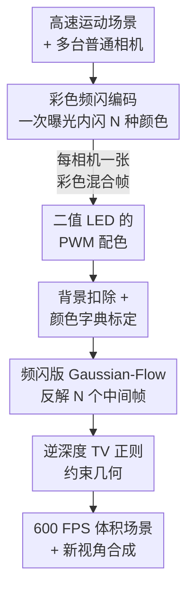

# Color-Encoded Illumination for High-Speed Volumetric Scene Reconstruction

**会议**: CVPR 2026  
**arXiv**: [2604.26920](https://arxiv.org/abs/2604.26920)  
**代码**: https://davidnovikov.github.io/color-encoded-illumination-website/ (项目主页，含视频结果)  
**领域**: 3D视觉 / 计算成像 / 动态高斯泼溅  
**关键词**: 高速成像, 体积重建, 彩色频闪照明, 动态高斯泼溅, 压缩视频

## 一句话总结
用一组高频切换的彩色 LED 频闪照亮场景，把高速运动的"时间戳"编码进多台普通 60 FPS 相机所拍图像的颜色与强度里，再用改造过的动态高斯泼溅（Gaussian-Flow）从这些颜色混合帧中解码出 600 FPS 的体积化动态场景，首次实现了「不改相机硬件」的高速三维重建。

## 研究背景与动机
**领域现状**：从 2D 多视角图像重建 3D 动态场景（NeRF / 3DGS 系）近年很火，但普通相机受读出带宽限制只能跑 30–60 FPS，因此这些方法只能处理静态或缓慢演化的场景。要拍真正的高速运动，要么上昂贵的专用高速相机（且高速相机的"时间动态范围"很差，往往只能连拍 256 帧），要么走计算成像的路子。

**现有痛点**：计算成像里"从低速相机榨出高帧率"主要有两条路——① 把整帧编码进相机的一部分像素；② 把多个高速帧复用（multiplex）进一张低速帧再算法解出来。但无论哪条，绝大多数工作都需要改造相机光学（编码孔径、逐像素可控的新型传感器、衍射光栅、扩散片等）或加机械运动部件，这就把它们锁死在**单视角**采集上。

**核心矛盾**：高速信息的编码被绑在了"相机这一侧"。一旦想做多视角（体积重建必需），就得把整套复杂的专用成像系统复制 N 份、逐台标定、还要做精确的时间同步——代价高到不现实。所以"高速"和"多视角体积重建"两件事一直没能凑到一起。

**本文目标**：用一批**未经改装的低速彩色相机**，重建出高速场景的体积表示，并支持任意新视角的高帧率渲染。

**切入角度**：既然改相机这一侧很难复制到多视角，那就把编码搬到**场景这一侧**——用一个频闪光源去"染"运动物体。时间戳信息一旦写进了场景本身的颜色里，它就与相机光学/型号无关，天然可以被任意多台普通相机同时拍到。

**核心 idea**：在一次曝光内用一串预定义的彩色频闪序列照亮场景，让每张低速帧变成"不同时刻、不同颜色物体的线性叠加"，再用动态高斯泼溅把这个颜色混合反解成多个高速 interframe（中间帧），从而把单台相机的编码方案直接升级成多视角体积重建。

## 方法详解

### 整体框架
方法分两大块：**采集侧**用彩色频闪把时间编码进图像，**重建侧**用改造的 Gaussian-Flow 把时间解码成 3D 高速运动。具体地，一个共置（co-located）的 R/G/B 三色 LED 光源在每个低速曝光周期内依次频闪 $N$ 种不同颜色（论文取 $N{=}10$）；运动物体在每种颜色下处于一个不同的瞬时位置，于是 8 台 60 FPS 普通相机各自拍到的单帧，就是这 $N$ 个中间帧"各染一种颜色后叠加"的结果（恒定光照下它只会糊成一团运动模糊）。重建时，把每台相机这一张彩色混合帧作为约束，优化一个动态高斯泼溅模型，使其在 $N$ 个时间戳上渲染出的单通道中间帧、按已知颜色字典线性组合后能复现出实拍的彩色帧；优化完成后即可在 600 FPS 下渲染任意新视角。

### 关键设计

**1. 彩色频闪：把时间戳编码进场景而非相机**

痛点在于以往所有"压缩高速成像"都把编码塞进相机光学，导致无法廉价地扩展到多视角。本文反其道而行：场景被一组近似共置的 R/G/B 直射 LED 照亮，在一次曝光 $T^{\rm exp}$ 内依次频闪 $N$ 段不同颜色。在"每段频闪时长 $T^{\rm strobe}$ 远短于物体运动"的假设下，物体在每段频闪内近似静止，于是相机第 $c$ 通道拍到的图像可写成各中间帧的线性混合：

$$I^{\rm rgb}({\bf x},c)=\sum_{n=1}^{N}{\bm c}_{\rm RGB}^{n}(c)\,I^{\rm int}({\bf x},t_n)$$

其中 ${\bm c}_{\rm RGB}^{n}(c)$ 是第 $n$ 段频闪的物体颜色（封装了 LED 光谱、物体反射率、相机响应三者），$I^{\rm int}({\bf x},t_n)$ 是 $t_n$ 时刻的瞬时强度中间帧。关键在于：颜色这把"时间标尺"是刻在场景上的，与相机光学和型号无关，因此**同一个频闪光源可以被任意多台未改装相机同时拍到**——这正是把单视角方案升级成多视角体积重建的根本前提

**2. 频闪版 Gaussian-Flow：用线性混合先验反解中间帧**

有了彩色混合帧，怎么从一张图里解出 $N$ 个时刻的 3D 场景？本文以 Gaussian-Flow 为骨架（每个高斯参数随时间演化 $g(t)=g(0)+d(t)$，形变 $d(t)$ 用多项式+傅里叶级数的 DDDM 建模，参数少、训练快），对它做两处改造。其一，由于目标物体假设为均匀光谱反射率，把渲染函数 $\mathcal R(G,\phi)$ 改成只输出**单通道强度图**（每个高斯只分配一个颜色通道）。其二，重写优化目标：把已知颜色字典 ${\bm c}_{\rm RGB}^{n}(c)$ 与模型在各时间戳渲染出的中间帧 $R_n(\phi_m)$ 线性组合，得到对实拍彩色帧的估计

$$\hat I^{\rm rgb}(c,\phi_m)\approx\sum_{n=1}^{N}{\bm c}_{\rm RGB}^{n}(c)\cdot R_n(\phi_m)$$

再用 $\mathcal L_1=\sum_m\sum_{c\in\{R,G,B\}}|\hat I^{\rm rgb}(c,\phi_m)-I^{\rm rgb}(c,\phi_m)|$ 监督优化 $G(0),D(t)$。单帧反解本是欠定的病态问题，但**多视角几何（极线约束）被优化器隐式利用**，让解收敛得更稳——这也是"为什么必须是体积/多视角"的价值所在。此外加一项逆深度的总变差正则 $\mathcal L_{\text{TV-depth}}$ 抑制几何噪声，总损失 $\mathcal L=\mathcal L_1+\lambda_{\text{depth}}\mathcal L_{\text{TV-depth}}$

**3. 二值 LED 的 PWM 配色：硬件只会开关也能调出 175 种颜色**

实际原型用 Arduino PWM 驱动 LED，但电路只能让 LED **开/关**，不能连续调强度，怎么造出 $N$ 种精确颜色？作者利用"频闪段内物体近似静止"这条假设，把每个颜色通道的强度拆成多个等长的微脉冲：每段强度区间约 $16.7\,\mu s$，允许 0–5 共六档离散强度，于是三色组合出 $6^3{=}216$ 种，去掉互为标量倍与全黑后得到 **175 种可用颜色**。配色策略上，作者实验发现把 $\{\alpha_n,\beta_n,\gamma_n\}$ 在 $\alpha\beta\gamma$ 空间的圆上均匀采样（等价于三路相差 120° 的正弦波）效果最好——这样得到的颜色在相机 RGB 空间里张得最开，反解时抗噪性最强

### 损失函数 / 训练策略
总损失为单通道 L1 数据项 $\mathcal L_1$（式 8，跨 $M$ 视角与 R/G/B 三通道）加逆深度总变差正则 $\mathcal L_{\text{TV-depth}}$（权重 $\lambda_{\text{depth}}$）。每个低速帧 $t_k$ 独立优化（不跨低速帧建模），点云用 COLMAP 在频闪前景图上初始化即足够；相机位姿亦由 COLMAP 在无频闪标定图上求得。背景在运动前/后单独拍摄并扣除，只对前景跑模型；可视化时再用一个静态 3DGS 背景模型叠回。

## 实验关键数据

### 主实验（真实原型）
原型：8 台 IDS UI-3240CP 全局快门相机（1280×1024，60 FPS）+ MOBL-300×150-RGBW 三色光源 + Arduino 同步。频闪 $N{=}10$ 色，把时间分辨率从 60 提升到 600 FPS。

| 实验场景 | 任务 | 结果 |
|---------|------|------|
| 旋转圆盘（白/黄贴纸） | 8 相机重建快转盘 | 单张低速帧→体积高速表示，新视角伪影少；黄贴纸验证非白反照率也可 |
| NERF 飞镖撞墙反弹 | 运动捕捉式高速轨迹 | 解出飞镖撞击与回弹，原视角/新视角均可渲染 |
| 抛飞的象棋子 | 多个较大且会重叠的物体 | 成功重建多物体的高速运动 |
| 恒定光照对照 | 同曝光不频闪 | 严重运动模糊、无法恢复运动，反衬频闪编码的作用 |

由于无相机改装，本文是已知首个把**体积渲染与压缩高速成像**绑到一起、做出多视角高速体积重建的工作。

### 仿真消融（MAE，以新视角为真值）
| 变量 | 趋势 / 关键拐点 | 说明 |
|------|----------------|------|
| 中间帧数 $N$ | $N{\approx}28$ 附近性能明显退化 | $N$ 越多颜色越挤、重叠越大，颜色在 RGB 空间余弦距离变小，更怕噪声 |
| 环境光强度 | 重建误差随环境光近似**线性上升** | 环境光降低 ${\bm c}_{\rm RGB}^{n}$ 对比度、长曝光易饱和 |
| 物体反照率（白→红混合） | 宽谱（接近灰白）好，单一光谱差 | 某些波段反射弱会缩小 RGB 空间的颜色间隔 |
| 相机数 $M$ | **≥6 台**即可可靠合成未见视角 | 多视角几何是反解病态问题的关键约束 |
| 运动复杂度 | 高方差运动会"丢"若干中间帧 | 大位移下高斯梯度消失（vanishing gradient） |

### 关键发现
- **多视角是解病态的关键**：单帧颜色反解本身欠定，正是多相机的极线几何把解约束住了；仿真显示 6 台相机就足够可靠。
- **$N$ 不是越大越好**：中间帧越多颜色越难区分，$N{\approx}28$ 是经验上限；要更高倍率需要更纯净的颜色或更白的物体。
- **同步几乎零风险**：每相机触发可漂移的余量 $T^{\rm marg}{=}T^{\rm exp}/(2N){=}0.83$ ms，约为硬件触发抖动（$30\,\mu s$）的 27 倍，彻底消除帧-频闪错位。

## 亮点与洞察
- **把编码从"相机域"搬到"场景域"**：一句话的视角转换，却直接解锁了多视角扩展性——光源只有一个、相机可以随便加，这是单视角压缩成像方法做不到的，最"啊哈"的地方。
- **用二值 LED+PWM 凑出 175 色**：在不能调光的廉价硬件上，靠"频闪段内静止"这条假设把强度拆成微脉冲累加，是很实用、可复现的工程 trick。
- **颜色字典 + 线性混合先验嵌进 3DGS 目标**：把物理成像模型（式 4）直接写进可微渲染的损失里，让高速解码变成一个标准的可微优化问题，思路可迁移到其它"编码曝光 + 体积渲染"的组合。
- **圆上均匀采样选色**：把"颜色要在 RGB 空间张得最开"这个抗噪诉求，转成 $\alpha\beta\gamma$ 空间圆上采样（120° 相位正弦），简洁且有几何直觉。

## 局限与展望
- **均匀反照率假设**：当前只适用于近似单色、均匀反照率且带空间变化阴影的物体；彩色/多色物体会失真（目标是单通道中间帧，丢了 Gaussian-Flow 原本靠球谐建模的颜色鲁棒性）。作者设想用"同一表面在不同频闪下出现在不同像素"的观测来联合恢复运动与外观。
- **需要黑背景 + 怕环境光**：实验要求暗背景，环境光会线性抬高误差；仿真显示非暗背景有希望但未在真实系统验证。
- **倍率受颜色可分性限制**：$N$ 增大颜色趋同、非白反照率进一步恶化，温和地说约 28 帧是当前上限；提升倍率依赖更好的配色/更白的物体。
- **高方差运动会掉帧**：大位移下高斯梯度消失导致丢中间帧，复杂非平滑运动是软肋。
- **每帧独立优化**：不跨低速帧建模，未利用相邻低速帧间的时序连续性，可能有进一步提升空间。

## 相关工作与启发
- **vs SpinCam (Chan et al. 2023)**：同样用颜色把多个 interframe 编进一次曝光，但 SpinCam 靠旋转衍射光栅在**传感器域**调制（时变 PSF），有机械运动部件且锁死单视角；本文改的是**场景物体颜色**，无机械件、无专用光学，天然支持多相机多视角体积重建。
- **vs Sheinin et al. (衍射编码位置)**：他们用进入相机的衍射光编码物体稀疏位置，属相机侧专用光学；本文无任何相机改装，可平凡地接任意数量相机。
- **vs Jaques et al. (RGB 三通道升采样)**：用 R/G/B 三通道把时间分辨率升 3 倍；本文用 $N{=}10$ 色实现 >3 倍（60→600 FPS）的升采样，且是多视角体积。
- **vs Veeraraghavan et al. (彩色频闪测周期场景)**：他们的彩色频闪针对**周期性**场景；本文面向一般非周期运动。
- **vs Gaussian-Flow (Lin et al. 2024)**：直接以其 DDDM 形变模型为骨架，改成单通道渲染 + 线性混合估计目标，使其能从编码低速帧重建高速 3D，是首个这样做的工作。

## 评分
- 新颖性: ⭐⭐⭐⭐⭐ "编码搬到场景侧"打通了高速压缩成像与多视角体积重建，首创性强。
- 实验充分度: ⭐⭐⭐⭐ 真实原型有 4 类场景 + 仿真把 5 个关键因素逐一扫了 MAE，缺少与 SOTA 的定量对比（多为定性）。
- 写作质量: ⭐⭐⭐⭐⭐ 成像模型推导清楚，硬件/标定/同步细节交代充分。
- 价值: ⭐⭐⭐⭐ 为"普通相机拍高速 3D"开了新范式，但受均匀反照率/暗背景假设约束，当前偏专用场景。

<!-- RELATED:START -->

## 相关论文

- [\[CVPR 2026\] Illumination-Consistent Human-Scene Reconstruction from Monocular Video](illumination-consistent_human-scene_reconstruction_from_monocular_video.md)
- [\[CVPR 2026\] Radiance Meshes for Volumetric Reconstruction](radiance_meshes_for_volumetric_reconstruction.md)
- [\[CVPR 2026\] CoLoR: The Devil is in Scene Coordinate Regression for Large-Scale Visual Localization](color_the_devil_is_in_scene_coordinate_regression_for_large-scale_visual_localiz.md)
- [\[CVPR 2026\] Volumetric Functional Maps](volumetric_functional_maps.md)
- [\[CVPR 2026\] IR-HGP: Physically-Aware Gaussian Inverse Rendering for High-Illumination Scenes via Generative Priors](ir-hgp_physically-aware_gaussian_inverse_rendering_for_high-illumination_scenes_.md)

<!-- RELATED:END -->
