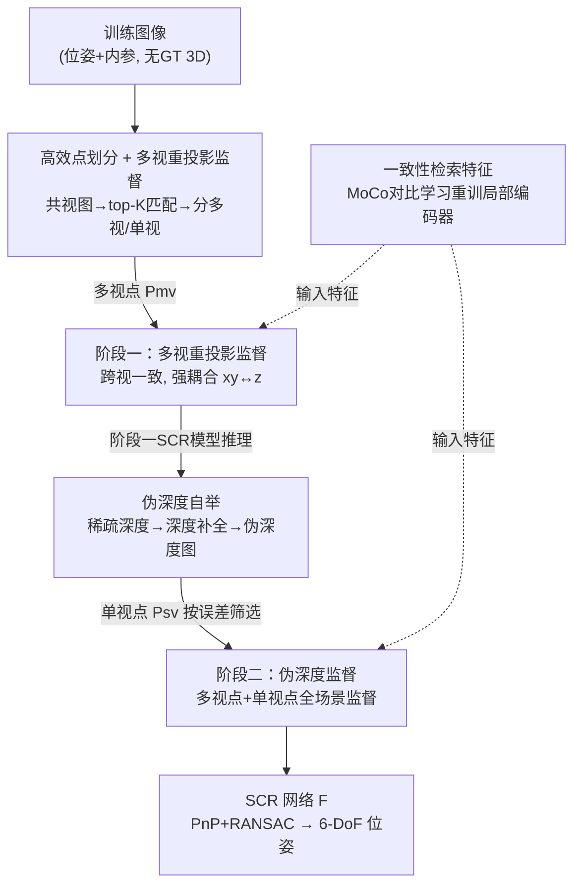

# CoLoR: The Devil is in Scene Coordinate Regression for Large-Scale Visual Localization

**会议**: CVPR 2026  
**论文**: [CVF Open Access](https://openaccess.thecvf.com/content/CVPR2026/html/Mao_CoLoR_The_Devil_is_in_Scene_Coordinate_Regression_for_Large-Scale_CVPR_2026_paper.html)  
**代码**: 无（论文未公开）  
**领域**: 3D视觉  
**关键词**: 视觉定位, 场景坐标回归, 多视/单视点划分, 伪深度自举, 检索特征一致性  

## 一句话总结
CoLoR 把大规模场景坐标回归（SCR）失败的"罪魁"诊断为单视点无监督和全局/局部特征不一致，用"多视/单视点显式划分 + 两阶段强监督（多视重投影 + 伪深度自举）"给场景里**每一个点**都补上监督、再用 MoCo 对比学习把局部特征重训成像素级检索特征，在 Aachen 和现代百货大楼等大规模数据集上把 SCR 推到 SOTA，并以几十 MB 的地图把和特征匹配（FM）方法的精度差距大幅缩小。

## 研究背景与动机
**领域现状**：视觉定位要从一张查询图估出 6-DoF 相机位姿。经典的特征匹配（FM）方法精度高、鲁棒，但要存大量描述子，地图动辄几百 MB 到几 GB（如 HLoc+SPSG 在 Aachen 上是 7.82GB）。场景坐标回归（SCR）则把场景几何**隐式编码进神经网络权重**，直接从 2D 像素回归出 3D 场景坐标，再用 PnP+RANSAC 解位姿，地图只有几十 MB，内存优势巨大。

**现有痛点**：SCR 在小场景能打平 FM，但一放大到城市级/大商场就持续掉点。当前主流的"无 3D 模型"大规模 SCR（如 GLACE、R-SCoRe）继承自 ACE 框架——随机采样像素特征 + 靠**隐式三角化**最小化重投影误差来学几何，并把检索用的全局特征和匹配用的局部特征拼接起来喂给网络。

**核心矛盾**：作者从"点被共视的频次"这个新角度重新拆解场景，发现两个被忽视的根本缺陷。其一是**稀疏共视**：把点分成"只被看到一次"的单视点和"被看到多次"的多视点后会发现，场景越大单视点占比越高，而隐式三角化**只能监督多视点、对单视点完全无能为力**，于是大量模型容量被浪费在采到却学不动的单视点上（它们反而成了噪声）；同时多视点的隐式监督强度随共视频次下降而急剧变弱。其二是**局部外观歧义**：大场景里大量重复纹理让"长得一样但来自不同 3D 位置"的局部 patch 难以区分；而拼接全局+局部特征看似能补救，作者却测出这俩特征**内在属性不一致**反而拖累判别力（PR 曲线上 AP 从单用全局的 0.924 掉到拼接后的 0.816）。

**本文目标**：① 给场景里**所有点**（含单视点）都提供强监督；② 消除全局/局部特征的不一致，得到跨尺度统一的判别表征。

**核心 idea**：与其在隐式三角化这条死路上修补，不如**显式把点划成多视/单视两类、各给一套强监督**（多视用重投影、单视用自举来的伪深度），再把"全局+局部"重新理解为"图像级+像素级的统一检索特征"，用对比学习把局部特征重训对齐。

## 方法详解

### 整体框架
CoLoR 的输入是一组带位姿/内参的训练图（**不假设有任何 GT 3D 坐标**），输出是一个能从像素回归 3D 场景坐标的 SCR 网络 $F_\theta$，测试时配 PnP+RANSAC 出位姿。整条管线围绕一句话展开：先用一次轻量特征匹配把场景点**划成多视点 $P_{mv}$ 和单视点 $P_{sv}$**，再分两阶段给它们各上一套强监督——第一阶段（前 70k 步）只训多视点、用多视重投影损失；第二阶段（后 30k 步）用第一阶段模型自举出"伪深度"，把单视点也拉进来训。与此并行的是一条特征支线：把 SCR 输入里的局部编码器用 MoCo 风格对比学习**重训成像素级检索特征**，使其与图像级全局特征在"做检索"这件事上目标一致。

### 关键设计

**1. 高效点划分 + 多视重投影监督：用显式跨视约束替掉孱弱的隐式三角化**

ACE 范式的第一个病根是"只靠多视点的隐式三角化"。要对症就得先把点**显式分类**：但对 $N$ 张图做两两穷举匹配是 $O(N^2)$ 不可行。CoLoR 借共视分数 $S(I_i,I_j)$（基于视锥 IoU）为每张图只挑 top-K 个最共视的邻居 $N_K(I_i)=\arg\mathrm{topk}_{I_j}\,S(I_i,I_j)$ 做匹配，再用对极误差滤掉错配、靠传递一致性补充对应，把匹配量从 $O(N^2)$ 压到 $O(N)$（Aachen 上仅 3 分钟、约占 4 小时训练的 1%）。匹配得到对应集 $C$ 后，一个 3D 点 $P_k$ 只要存在对应就归为多视点，否则是单视点：$P_{mv}=\{P_k\mid \mathrm{corr}(P_k)\neq\varnothing\}$，$P_{sv}=P\setminus P_{mv}$。

划分本身就顺带给出了多视点的对应关系，于是直接上**多视重投影损失**：

$$L_{mv}(P_k)=\sum_{p_j\in O(P_k)}\lVert \pi_j(P_k)-p_j\rVert_2^2$$

其中 $O(P_k)$ 是 $P_k$ 的所有 2D 观测、$\pi_j(P_k)$ 是把预测坐标投到第 $j$ 张图的位置。它对所有可见视图等权，**强制同一 3D 点在多视下几何一致**——而这种跨视一致性会在横向 $xy$ 和深度 $z$ 之间建立强耦合：$z$ 上的误差一定会在某个视图里造成 $xy$ 的重投影误差。这正是单视重投影给不了的性质，也为第二阶段埋下伏笔。消融显示：哪怕只是把训练**隔离到多视点**（单视点先用普通单视重投影），就已显著超过 baseline；再把弱隐式监督换成这个强显式目标又解锁一档（Dept.4F 从 60.2 → 70.2 → 75.8）。

**2. 伪深度自举：给三角化完全够不着的单视点造出度量级监督**

单视点天生没有多视对应，三角化无从谈起。单目深度虽常用但**缺真实度量尺度**，退而求其次的序数深度损失又是另一种弱隐式监督，跟原 ACE 的单视重投影半斤八两。CoLoR 的巧处在于：**第一阶段建立的 $xy$–$z$ 强耦合恰好是深度可信度的天然指标**——重投影误差小的点，其深度也大概率准。于是用第一阶段最新 SCR 模型对所有训练图推理，得到坐标图 $M_i$、深度图 $D_i$ 和重投影误差图 $E_i$，再按阈值 $\tau$（实验取 5 像素）筛出高置信点构成稀疏深度图：

$$D_{sparse,i}(u)=\begin{cases} D_i(u) & E_i(u)<\tau\\ \text{invalid} & \text{otherwise}\end{cases}$$

把这张稀疏深度喂给一个深度补全模型稠密化，得到**度量级但可能带噪的"伪深度图" $\tilde d$**，对预测坐标的深度分量 $d$ 施加伪深度监督 $\ell_{depth}=\lVert \tilde d - d\rVert_2$。并非所有点都对定位有益，作者再用重投影误差图和（SCR 深度 vs 伪深度的）深度误差图联合筛掉低质量点，第二阶段只采"重投影+深度误差最低"的那批单视点加入训练。这样多视点继续吃重投影监督、单视点吃伪深度监督，**首次实现对全场景所有点的完整强监督**。

**3. 一致性检索特征：把"全局+局部拼接"重构成统一的多粒度检索表征**

SCR 理想的输入特征应能把一个 3D 点和场景里其它所有点区分开——本质就是**3D 点的检索特征**。但旧法把"为大规模检索优化的全局特征"和"为局部区域匹配优化的局部特征"直接拼接，作者用 PR 曲线证明这是个悖论：全局特征单独做共视分类 AP 高达 0.924，一旦拼上传统局部特征反而掉到 0.816，根源是两类特征**优化目标不一致**。CoLoR 提出新视角：别把它们当"检索特征+匹配特征"的混合，而是**同一检索表征的两个粒度——图像级和像素级**，于是把局部编码器用检索式目标重训，对齐后组合特征 AP 回升到 0.926。

具体训练像素级检索编码器时用对比学习：采一对同区域图 $I_A,I_B$，对锚点描述子 $F_i^A$，其 GT 匹配 $F_i^B$ 为正样本，同图其余特征为负，温度缩放余弦相似度 $s(u,v)=u\!\cdot\!v/\tau$，损失为

$$L_i=-\log\frac{\exp(s(F_i^A,F_i^B))}{\sum_{F_j\in \mathcal F_{aug}}\exp(s(F_i^A,F_j))}$$

关键是把分母候选集扩成 $\mathcal F_{aug}=\mathcal F_B\cup\mathcal F_{neg}$，额外塞入**来自不同区域的负样本**——这正是传统局部特征欠缺的"跨区域见过世面"的能力。直接用海量跨区域负样本太贵，于是引入 **MoCo**：用梯度编码器 + 动量编码器（EMA 更新 $\theta_m\leftarrow\lambda\theta_m+(1-\lambda)\theta_g$）+ 一个存历史描述子及其场景编号的队列，把负样本数和 batch size 解耦。实测每次只采 2 张共视图 + 64 张负样本图，相比朴素地前向 66 张只回传 2 张，只需前向 2 张共视图，计算降到 1/33。

### 损失函数 / 训练策略
总训练 100k 步、batch 81,920/GPU，按阶段一 70k + 阶段二 30k 切分。阶段一只用 $L_{mv}$；阶段二在多视重投影监督外加 $\ell_{depth}$ 伪深度监督。共视对沿用 R-SCoRe：每图取 top-10 共视邻居，对极误差 > 1 的匹配滤掉，传递一致性补充对应时用 NMS（阈值 1）抑制坏环。检索编码器沿用 DeDoDe 架构，冻结检测器、从头训描述子，在 MegaDepth 上训：每图取 5,000 关键点，队列存过去 64 张共 320,000 个特征，softmax 只取与锚点相关性最高的 top-2,000 负样本以稳数值。

## 实验关键数据

### 主实验
在城市级室外 Aachen Day-Night（约 6 km²）与大规模室内现代百货（约 10,000 m²，B1/1F/4F 三层）上评测。地图尺寸是 SCR 的核心卖点，下表对比 SCR 与 FM 两类方法的精度与地图大小。

| 数据集 | 指标(阈值) | CoLoR | R-SCoRe(SCR SOTA) | 重型FM参考 | 地图 |
|--------|-----------|-------|-------------------|-----------|------|
| Aachen Day | (0.25m,2°) | **78.6** | 74.8 | HLoc+SPSG 89.6 | 47MB |
| Aachen Night | (0.25m,2°) | **67.3** | 64.3 | HLoc+SPSG 86.7 | 47MB |
| Dept. 1F | (0.1m,1°) | **75.2** | 61.4 | HLoc+R2D2 80.6 | 127MB |
| Dept. 4F | (0.1m,1°) | **80.9** | 60.2 | HLoc+R2D2 85.3 | 50MB |
| Dept. B1 | (0.1m,1°) | **66.6** | 60.1 | HLoc+R2D2 75.2 | 130MB |

要点：CoLoR 在同等紧凑地图（如 4F 仅 50MB，对比 HLoc+R2D2 的 76GB）下全面超越前 SCR SOTA R-SCoRe——室内最严阈值下 1F 提升 13.8%、4F 提升 20.7%；Aachen 夜间除了 7.82GB 的重型 HLoc+SPSG 外击败所有对手。值得注意的是 ACE(×50)、GLACE 这类隐式三角化方法在大场景几乎崩溃（Aachen Day (0.25m,2°) 仅 6.9 / 8.6），印证了作者对"单视点失监督"的诊断。

### 消融实验（Dept. 4F，三阈值 0.1m/0.25m/1m）

| 配置 | (0.1m,1°) | (0.25m,2°) | (1m,5°) | 说明 |
|------|-----------|-----------|---------|------|
| baseline | 60.2 | 79.3 | 87.9 | R-SCoRe 起点 |
| + 像素划分 | 70.2 | 83.9 | 88.8 | 只训多视点，去掉单视点噪声 |
| + 多视重投影监督 | 75.8 | 86.7 | 90.1 | 弱隐式→强显式约束 |
| + 伪深度监督 | 76.6 | 86.7 | 90.3 | 单视点纳入训练 |
| + 像素级检索特征(完整) | **80.9** | **89.6** | **93.1** | 特征一致性 |

### 关键发现
- **贡献最大的两步是"像素划分"和"多视重投影监督"**：仅把训练限制到多视点就把 (0.1m,1°) 从 60.2 拉到 70.2，再换成强显式多视重投影又升到 75.8——证实"单视点学不动、反成噪声"和"隐式监督太弱"两个诊断都成立。
- **伪深度监督数值增益温和（75.8→76.6）但意义重大**：它把"baseline 框架完全够不着的那部分场景"解锁出来，是覆盖度而非单纯精度的突破。
- **特征一致性收尾贡献显著（76.6→80.9）**：印证全局/局部特征对齐到同一检索目标后判别力的提升（PR 曲线 AP 0.816→0.926）。

## 亮点与洞察
- **"按共视频次重审场景"这个诊断角度本身就很漂亮**：把"为什么大场景 SCR 不行"翻译成"单视点占比飙升 + 它们拿不到监督"，让问题一下变得可操作，后续所有设计都顺着这个划分长出来。
- **用第一阶段的几何耦合当深度可信度筛选器**，再喂深度补全造伪深度——这是个很聪明的自举闭环：不引入外部 GT，却把单目深度的尺度缺陷绕过去了。
- **"全局+局部不是两类特征，而是同一检索表征的两个粒度"的重构**很有迁移价值：凡是拼接异构特征却互相拖后腿的场景，都可以问一句"它们真正该对齐的共同目标是什么"。
- MoCo 把跨区域负样本从 66 张前向降到 2 张（1/33）的工程取舍，是把对比学习塞进定位训练的实用 trick。

## 局限与展望
- 整条管线**依赖一个外部深度补全模型**生成伪深度，其质量直接决定单视点监督强度；论文也承认伪深度"度量但可能带噪"，对补全模型失效的弱纹理/反光区如何兜底未深入讨论。⚠️
- 伪深度监督的**数值增益偏小**（4F 仅 +0.8），在某些场景单视点的边际收益有限，是否所有大场景都值得这第二阶段成本值得进一步验证。
- 与 FM 顶配（HLoc+SPSG）仍有可见差距（Aachen Day 78.6 vs 89.6），SCR 的精度天花板尚未触及 FM。
- 论文**未公开代码**，且多处依赖 R-SCoRe 的训练配置与架构改造（"更深更窄"变体细节在附录），完整复现门槛较高。⚠️

## 相关工作与启发
- **vs R-SCoRe / GLACE（隐式三角化大规模 SCR）**：它们靠单模型 + 全局/局部拼接 + 隐式三角化，对单视点失监督、特征还互相打架；CoLoR 显式划分点 + 两阶段强监督 + 检索特征对齐，在同等地图下大幅超越，是直接的"诊断—对症"升级。
- **vs ACE（高效 SCR 训练范式）**：CoLoR 继承其梯度去相关式的高效采样训练，但把"随机采样 + 隐式三角化"这一核心假设判为大场景病根并替换掉。
- **vs FM 方法（HLoc+SPSG/R2D2/D2-Net）**：FM 精度更高但地图大几个数量级（GB 级 vs 几十 MB）；CoLoR 守住 SCR 的内存优势同时把精度差距收窄，强调的是"精度/地图大小"这条 trade-off 曲线上的位置。
- **vs DeDoDe / MoCo**：复用 DeDoDe 的检测器+描述子架构和 MoCo 的动量队列对比学习，把它们改造成"像素级 3D 点检索"的训练目标，是跨领域 trick 的有效嫁接。

## 评分
- 新颖性: ⭐⭐⭐⭐⭐ 把大规模 SCR 失败精准诊断为"单视点失监督+特征不一致"，并给出显式划分+两阶段自举+检索特征对齐的系统解法，视角独到
- 实验充分度: ⭐⭐⭐⭐ 室内外多数据集 + 逐组件消融充分，但缺代码与跨深度补全模型的鲁棒性分析
- 写作质量: ⭐⭐⭐⭐⭐ "从共视频次重审场景"的叙事把动机—诊断—方法串得极清晰，公式与消融环环相扣
- 价值: ⭐⭐⭐⭐⭐ 把 SCR 与 FM 的长期精度鸿沟显著收窄、又守住几十 MB 地图，对内存受限的大规模定位很有实用价值

<!-- RELATED:START -->

## 相关论文

- [\[CVPR 2026\] Sparse-View Localization via Online Neural 3D Regression](sparse-view_localization_via_online_neural_3d_regression.md)
- [\[CVPR 2026\] SCE-SLAM: Scale-Consistent Monocular SLAM via Scene Coordinate Embeddings](sce-slam_scale-consistent_monocular_slam_via_scene_coordinate_embeddings.md)
- [\[CVPR 2026\] AsymLoc: Towards Asymmetric Feature Matching for Efficient Visual Localization](asymloc_towards_asymmetric_feature_matching_for_efficient_visual_localization.md)
- [\[CVPR 2026\] MERG3R: A Divide-and-Conquer Approach to Large-Scale Neural Visual Geometry](merg3r_a_divide-and-conquer_approach_to_large-scale_neural_visual_geometry.md)
- [\[CVPR 2026\] Learning Scene Coordinate Reconstruction from Unposed Images via Pose Graph Optimization](learning_scene_coordinate_reconstruction_from_unposed_images_via_pose_graph_opti.md)

<!-- RELATED:END -->
