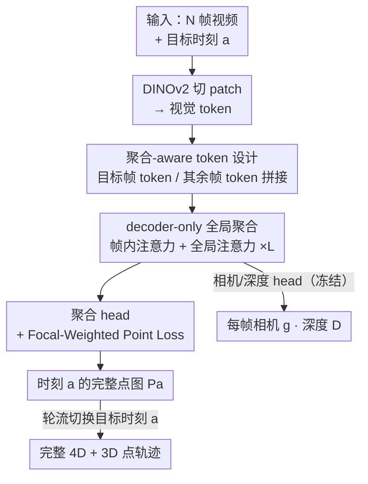

# Complet4R: Geometric Complete 4D Reconstruction

**会议**: CVPR 2026  
**论文**: [CVF Open Access](https://openaccess.thecvf.com/content/CVPR2026/html/Wang_Complet4R_Geometric_Complete_4D_Reconstruction_CVPR_2026_paper.html)  
**代码**: 待开源（作者承诺 release）  
**领域**: 3D视觉  
**关键词**: 4D重建, 动态场景, 几何补全, 3D点追踪, decoder-only transformer  

## 一句话总结
Complet4R 把"动态场景 4D 重建"重新定义成"对每一个目标时刻，把整段视频里所有帧观测到的几何（包括该帧被遮挡、但别的帧看得到的部分）聚合过来补成完整几何"，用一个 decoder-only transformer 加一组可切换目标时刻的聚合 token 端到端实现，在自建 4D 完整重建 benchmark 和 3D 点追踪上都拿到 SOTA。

## 研究背景与动机

**领域现状**：从单目视频重建动态 3D 场景（"4D 重建"）目前主流是把运动分析从 2D 像素平面抬到 3D 点空间——估计稠密点图（pointmap）+ 帧间对应。代表作 DUSt3R/MonST3R/St4RTrack 这条线，把动态场景表示成"时序连贯的 3D 视频"，St4RTrack 还用双分支同时做重建和追踪。

**现有痛点**：这些方法的主导范式是**成对（pairwise）**的——每一步只在两帧之间推理。这带来三个连锁问题：(1) 误差沿序列累积、漂移没法靠全局正则压住；(2) 中间表示（点图 / 3D flow）是**以帧为中心**的，每帧只重建当前帧**可见**的几何；(3) 因此当物体某部分在当前帧被遮挡、却在别的帧看得到时，这部分几何就丢了——重建结果在空间和时间上都是**残缺**的。

**核心矛盾**：动态物体在任一单帧里都只露出一部分，而"完整几何"天然需要跨时间把多帧观测拼起来；但 pairwise 范式既不跨长程聚合、又只回归可见几何，结构上就做不出"对某一时刻的完整 4D 表示"。

**本文目标**：对序列里**每一个时刻** $a$，重建该时刻**完整**的 3D 几何 $P_a$——既含该帧本身可见的，也含其他帧才看得到、需要推断运动才能对齐过来的被遮挡部分。

**切入角度**：作者把"重建"和"补全"统一成一件事——**直接把全序列上下文累加到每一帧上**。一旦每帧几何都是从所有观测补全出来的，时空一致性就是"从一开始就 baked in"，而不是事后再去缝合 pairwise 结果。

**核心 idea**：用一个 decoder-only transformer 全局看完整段视频，配一组"聚合 token"指定当前要补到哪个目标时刻，让模型把其它帧的几何线索对齐、搬运到目标时刻，输出该时刻的完整点图；切换目标时刻就能扫出完整且一致的 4D，顺带产出 3D 点轨迹。

## 方法详解

### 整体框架

Complet4R 是个端到端的前馈框架，输入是 $N$ 帧连续 RGB 视频 $\{I_i\}_{i=0}^{N-1}$ 加一个目标（聚合）时刻 $a$，输出是把所有帧搬运/对齐到时刻 $a$ 的聚合点图 $P_a^i$、每帧相机参数 $g_i\in\mathbb{R}^9$ 和深度图 $D_i$，写成一个映射 $f\big((I_i)_{i=0}^{N-1},a\big)=(P_a^i,g_i,D_i)_{i=0}^{N-1}$。

具体流程：每帧先用 DINOv2 切 patch 编码成视觉 token；然后拼上几组特殊 token——区分"目标帧 / 其余帧"的**聚合 token**、相机 token、对齐到统一坐标系的 registration token；这串 token 进 $L$ 层 transformer，每层交替做**帧内注意力（frame attention）**和**全局注意力（global attention）**，让目标帧的聚合 token 和其余帧的聚合 token 通过 self-attention 不断交换时序信息、把各帧特征逐步对齐到目标帧；最后三个 head（相机 / 深度 / 聚合）解码出结果。其中**聚合 head** 是本文新加的，它吃每帧特征、预测出对齐到目标时刻的 3D 表示，把各帧的聚合输出拼起来就是从目标帧视角看到的完整一致点图。把每一帧轮流当作目标时刻 $a$ 跑一遍，就得到完整 4D；这些重建之间累积的时序一致性又直接给出每个点的连续 3D 轨迹（即 3D 追踪是重建的副产品）。

### 关键设计

**1. 几何完整 4D 重建：把"重建"重述成"向目标时刻的几何聚合补全"**

这是本文真正的根。以往方法（如 MonST3R）对每个时刻只回归该帧**可见**的点图，结果是时空残缺的几何。本文重新定义任务：给定目标时刻 $a$，模型要从**所有其它帧** $\{I_i\}_{i\neq a}$（静态背景 + 运动物体都算）聚合几何线索，推断出时刻 $a$ 的**完整**点图 $P_a$，显式重建出运动物体在 $a$ 帧被遮挡、却在别帧可见的部分。这一步之所以关键，是因为"补全被遮挡部分"逼着模型**隐式做跨时间的运动因果推理**：要把别帧的点搬到目标时刻的正确位置，就必须知道这些点在两个时刻之间怎么动了。任务定义本身就把"时序一致性"写进了目标里，而不是事后缝合。它还自然蕴含 3D 追踪——把每帧轮流当目标时刻重建，累积的时序对齐就等价于每个点的连续轨迹，所以追踪是重建的免费副产品，无需单独训练。

**2. 聚合-aware token 设计：让模型知道"这次要补到哪一帧"**

要做"可切换目标时刻"的聚合，模型得有个开关告诉它当前目标是谁。作者引入聚合 token $t^D$：初始化**两组**，一组 $t^D_a$ 给目标时刻，另一组 $t^D_{/a}$ 被其余所有时刻共享；把它们拼接（concatenate）到每帧视觉 token 上，模型就能显式辨认聚合目标。改变 $a$，Complet4R 就学会把其它帧的几何线索往 $a$ 收。配套还沿用 VGGT 的相机 token 和 registration token，且 registration token 也分两组——$t^R_1$ 给第一帧、$t^R_{2:N}$ 给其余帧，使模型在**第一帧坐标系**下学统一表示。消融显示用 concatenate 比直接相加（add）更好（见 Table 3），作者的解释是拼接保留了聚合 token 独立的语义通道、不会和图像 patch 特征互相污染。

**3. decoder-only 全局聚合：用帧内 + 全局两级注意力把别帧几何搬到目标帧**

针对 pairwise 范式"只看两帧、误差累积、没法全局正则"的痛点，Complet4R 用一个 decoder-only transformer 一次性**全局**消化整段视频。在每一层里交替走两种注意力：**帧内注意力**让单帧内部 token 交互，**全局注意力**让所有帧的 token（尤其是目标帧与其余帧的聚合 token）跨帧 self-attention 交换时序信息。这个过程把所有帧的特征**逐步对齐到目标帧**，融合来自过去和未来帧的观测，从而合成出单帧看不到的互补视角，重建出整体一致的 3D。架构整体建在 VGGT 上：相机 head 和深度 head 直接继承并**冻结**，仅把原 point head 换成新的聚合 head（继承其参数后微调），聚合 head 用 DPT 风格 decoder 输出对齐到目标时刻的 3D 点。这样既复用了 VGGT 的强几何先验，又只为"4D 补全"这件新事训练最少的参数。

**4. Focal-Weighted Point Loss：把监督力气压到对不齐的难样本上**

4D 补全里最难监督的是动态、且对齐误差大的区域——这些点正是被遮挡后搬运过来、最容易错的地方，但它们在点云里占比小，普通 loss 会被海量好点淹没。作者设计了 focal 风格的点权重 $w_i^a=|\beta e_i^a|^\gamma$，其中 $e_i^a=\hat{P}_i^a-P_i^a$ 是预测点与真值的对齐误差，误差越大权重越高，从而把监督自适应地集中到难区域。完整点损失为

$$L_{point}=\sum_{i=1}^{N}\Big(\|\hat{\Sigma}_{i,a}^P\odot w_i^a\odot(\hat{P}_i^a-P_i^a)\|+\|\hat{\Sigma}_{i,a}^P\odot(\nabla\hat{P}_i^a-\nabla P_i^a)\|-\alpha\log\hat{\Sigma}_{i,a}^P\Big),$$

其中 $\hat{\Sigma}_{i,a}^P$ 是沿用 VGGT 的预测不确定度图（做 aleatoric 加权），第二项是梯度（法向）一致性项，第三项是不确定度正则；$\odot$ 是通道广播乘。消融里它对应 "Focal" 配置，比单纯给动态点乘大系数的 "Dynamic" 加权更稳（见 Table 3）。总损失为多任务形式 $L=\lambda L_{point}+L_{camera}+L_{depth}$，相机和深度沿用 VGGT 的损失。

### 损失函数 / 训练策略
模型从 VGGT 初始化，相机/深度 head 冻结，仅训练聚合 head（占用原 point head 的位置并继承参数）。AdamW 训 10 epoch，cosine 调度峰值学习率 $1\text{e}{-5}$、0.5-iteration warmup；输入帧/深度/点图长边缩到 ≤518，宽高比在 0.5–3.4 随机采，配 color jitter / 高斯模糊 / 灰度等增强。8 张 A100 训 23 小时。训练数据用三个动态数据集：Point Odyssey（109 序列）、Dynamic Replica（483 序列）、SAIL-VOS 3D（约 704 序列，提供全时刻 mesh，用重心坐标 + 顶点对应生成 3D 轨迹，并按深度突变切成短 clip）。

## 实验关键数据

### 主实验

4D 完整重建（SAIL-VOS 3D-test，44 序列）。指标：Accuracy↓、Completion↓、Normal Consistency↑（均报 Mean/Median）。由于是全新任务，唯一可比的是把 St4RTrack 的 pairwise 结果逐帧锚定后聚合得到的两个 checkpoint。

| 方法 | Acc.↓ (Mean/Med) | Complet.↓ (Mean/Med) | N.C.↑ (Mean/Med) |
|------|------|------|------|
| St4RTrack-seq | 0.92 / 0.71 | 3.10 / 0.17 | 0.48 / 0.47 |
| St4RTrack-pairs | 0.94 / 0.77 | 2.67 / 0.14 | 0.46 / 0.44 |
| **Complet4R (Ours)** | **0.50 / 0.37** | **0.26 / 0.11** | **0.49 / 0.49** |

Accuracy mean 从 0.92→0.50（约 46% 相对提升），Completion mean 从 3.10→0.26（约一个数量级提升）——后者印证了"完整补全被遮挡几何"这个任务定义的价值。

3D 点追踪（St4RTrack 的 WorldTrack，world 坐标系动态点）。指标：APD↑、EPE↓。Complet4R 没专门为追踪训练，靠逐帧重建 + 时序聚合出轨迹。

| 方法 | PO APD↑/EPE↓ | DR APD↑/EPE↓ | ADT APD↑/EPE↓ | PStudio APD↑/EPE↓ |
|------|------|------|------|------|
| SpaTracker | 51.20 / 46.95 | 58.65 / 108.28 | 67.65 / 16.28 | 62.59 / 30.94 |
| MonST3R | 39.36 / 64.52 | 51.86 / 53.13 | 67.92 / 15.78 | 51.32 / 45.68 |
| St4RTrack | 68.72 / 29.70 | 68.13 / 29.61 | 75.34 / 12.12 | 69.67 / 26.37 |
| **Complet4R (Ours)** | **80.17 / 16.07** | **80.65 / 15.99** | **77.34 / 9.72** | **76.88 / 18.52** |

四个数据集 APD/EPE 全面领先，PO/DR 上 APD 比 St4RTrack 高 ~12 分、EPE 几乎砍半——说明"完整重建"反过来也让追踪更准。

### 消融实验

三个设计轴：训练 loss、聚合表示（绝对 endpoint vs 相对 offset）、聚合 token 融合方式（concat vs add）。在 SAIL-VOS 3D-test 上。

| 配置 | Loss | Agg. 表示 | Agg. token | Acc.↓ (Mean) | Complet.↓ (Mean) | N.C.↑ (Mean) |
|------|------|------|------|------|------|------|
| (1) | Dynamic | Endpoint | Concat | 0.50 | 0.26 | 0.48 |
| (2) | Focal | Offset | Concat | 0.63 | 0.50 | 0.44 |
| (3) | Focal | Endpoint | Add | 0.57 | 0.32 | 0.50 |
| **Full** | **Focal** | **Endpoint** | **Concat** | **0.50** | **0.26** | **0.49** |

> ⚠️ 原文 Table 3 用 "-" 表示"与 Full 相同的默认设置"，上表按其语义把每行被改动的单一组件还原标出，以原文为准。

### 关键发现
- **Completion 提升最夸张**（mean 3.10→0.26，近一个数量级），说明 baseline 真正缺的不是精度而是"把被遮挡部分补出来"的能力——这正是本文任务定义瞄准的点。
- **聚合表示 Endpoint > Offset**：监督目标时刻的绝对坐标比监督相对参考帧的位移更稳（行(2) Complet. mean 0.50 明显劣于 0.26）；作者推测 offset 把误差耦合进参考帧，长程下漂移更重。
- **聚合 token 拼接 > 相加**：concat 保留独立语义通道，add 会把聚合信号和图像特征混在一起（行(3) Acc. 0.57 vs 0.50）。
- **Focal > Dynamic 加权**：自适应按对齐误差加权，比死板地给动态点乘大系数更能盯住真正难的点。

## 亮点与洞察
- **把"重建"和"追踪"统一进一个 task 定义**：一旦把目标设成"向任意时刻聚合完整几何"，时序一致性是结构性内建的，3D 追踪直接当副产品掉出来——一个 forward 同时解两个传统上分开的问题，这是最"啊哈"的地方。
- **可切换目标时刻的聚合 token**：用一对 token（目标帧 / 其余帧）+ 切换 $a$ 实现"对哪一帧补全"的可控性，是个很轻、很可迁移的条件化机制，本质上是把"目标视角"做成可寻址的 query。
- **站在 VGGT 肩膀上只动最小参数**：冻结相机/深度 head、只把 point head 换成聚合 head 微调，既蹭到大规模静态几何先验，又把新增训练成本压到 8×A100 / 23 小时，工程上很务实，可复用到其它"给前馈几何 backbone 加新任务 head"的场景。

## 局限与展望
- **被遮挡几何来自"别帧可见"**：如果某区域在**整段视频里始终没被任何帧看到**，本框架无从补全——它做的是跨帧聚合，不是生成式幻想，超出观测覆盖的部分仍是盲区。⚠️ 这是方法定义的内在边界，原文未展开讨论。
- **训练数据偏合成/受限域**：SAIL-VOS 3D / Point Odyssey / Dynamic Replica 多为合成或带剧情的特定场景，真实开放世界（剧烈光照、纹理缺失、极端运动）下的泛化文中没充分验证。
- **评测是自建 benchmark**：4D 完整重建任务全新、无现成 baseline，只能拿 St4RTrack 改造对比，横向 SOTA 的说服力受"对比对象单一"限制；后续需要更多独立方法在该 benchmark 上复现。
- **序列长度与显存**：decoder-only 全局注意力随帧数增长，长视频的算力/显存扩展性文中未 report，点也要随机下采样评测。

## 相关工作与启发
- **vs St4RTrack**：它用双分支 pairwise 对应做重建 + 追踪，要做完整 4D 得逐帧锚定再聚合，长程受限且误差累积；本文是单一前馈全局聚合，结构上就避开 pairwise，重建和追踪指标都大幅反超。
- **vs MonST3R**：MonST3R 每帧只回归可见点图（时空残缺），本文显式补全被遮挡几何并把时序一致性写进任务定义，因此 Completion 有数量级差距。
- **vs VGGT**：VGGT 是静态多视图前馈几何 backbone；Complet4R 把它扩到动态——加聚合 token + 聚合 head，让"静态多视图聚合"升级成"跨时间的动态聚合补全"。
- **vs SpatialTracker / MVTracker 等 3D 追踪线**：它们多依赖预标定相机参数或真值深度、且是稀疏点追踪，本文不需要这些前提、能稠密逐像素，且追踪只是重建的副产品。

## 评分
- 新颖性: ⭐⭐⭐⭐⭐ 重新定义了一个"几何完整 4D 重建"任务，并把重建与追踪统一进同一前馈框架，概念层面有真创新。
- 实验充分度: ⭐⭐⭐⭐ 两任务四数据集 + 三轴消融较扎实，但自建 benchmark、对比 baseline 偏单一、长程扩展性缺验证。
- 写作质量: ⭐⭐⭐⭐ 任务动机和架构讲得清楚，部分公式符号（如 $w_i^a$ 中 $\beta,\gamma$ 取值）和消融 "-" 表示略需对照原文。
- 价值: ⭐⭐⭐⭐⭐ 完整一致的 4D 表示是 world model / 物理推理的基础设施，方法务实可复现，影响面大。

<!-- RELATED:START -->

## 相关论文

- [\[CVPR 2026\] 4D Primitive-Mâché: Glueing Primitives for Persistent 4D Scene Reconstruction](4d_primitive-mache_glueing_primitives_for_persistent_4d_scene_reconstruction.md)
- [\[CVPR 2026\] MoRe: Motion-aware Feed-forward 4D Reconstruction Transformer](more_motion-aware_feed-forward_4d_reconstruction_transformer.md)
- [\[CVPR 2026\] RnG: A Unified Transformer for Complete 3D Modeling from Partial Observations](rng_a_unified_transformer_for_complete_3d_modeling_from_partial_observations.md)
- [\[ICCV 2025\] Geo4D: Leveraging Video Generators for Geometric 4D Scene Reconstruction](../../ICCV2025/3d_vision/geo4d_leveraging_video_generators_for_geometric_4d_scene_reconstruction.md)
- [\[CVPR 2026\] Motion 3-to-4: 3D Motion Reconstruction for 4D Synthesis](motion_3-to-4_3d_motion_reconstruction_for_4d_synthesis.md)

<!-- RELATED:END -->
