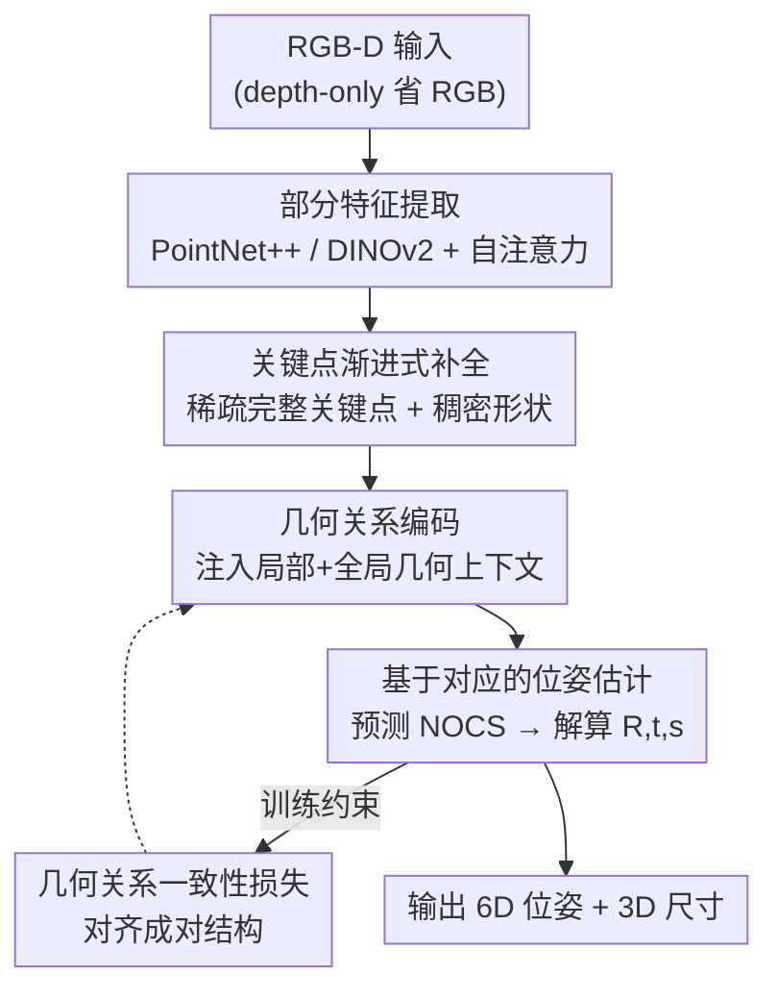

# ComPose: A Unified Completion-Pose Framework for Robust Category-Level Object Pose Estimation

**会议**: CVPR2026  
**arXiv**: [2605.25553](https://arxiv.org/abs/2605.25553)  
**代码**: https://renhuan1999.github.io/ComPose （项目主页）  
**领域**: 3D视觉 / 类别级6D位姿估计  
**关键词**: 类别级位姿估计、点云补全、关键点、NOCS、几何关系一致性

## 一句话总结
ComPose 把"点云补全"作为一个任务驱动的内部模块塞进类别级 6D 位姿估计网络，用基于关键点的渐进式补全在观测空间直接恢复完整物体几何，配合几何关系编码与几何关系一致性损失，在不依赖类别形状先验的前提下把 REAL275 depth-only 的 $10°2\text{cm}$ 精度从 68.5% 提到 77.8%，且推理速度反而更快（38.4 FPS）。

## 研究背景与动机
**领域现状**：类别级物体位姿估计要在不依赖实例级 CAD 模型的前提下，预测某个预定义类别（相机、杯子、笔记本等）里任意物体的 6D 位姿（旋转 $\bm{R}$、平移 $\bm{t}$）和 3D 尺寸 $\bm{s}$。主流做法是先从深度图反投影出的部分点云里抽几何特征，再要么直接回归位姿，要么预测 NOCS（Normalized Object Coordinate Space）坐标作为中间表示、用 Umeyama 之类算法拟合位姿。

**现有痛点**：深度相机受自遮挡限制，拍不到物体背面，反投影得到的点云天然是"残缺"的。直接在残缺点云上编码几何，网络根本看不到完整形状，位姿推理因此不稳。一类工作引入类别级形状先验（SPD 这类）在特征层补全形状语义，但它们仍然在残缺的观测空间上操作，没真正解决几何缺失；而且采集先验要收集大量 CAD 模型、额外训练一个 autoencoder，费时费钱。

**核心矛盾**：补全完整几何确实有用——作者做了个 oracle 实验，把 AG-Pose（depth-only）的部分点云输入换成真值完整点云，$10°2\text{cm}$ 精度从 68.5% 飙到 91.7%，上限巨大。但天真地把"补全"当成一个独立预处理步骤串在位姿估计前面（two-stage），会带来误差累积和额外计算开销：即便端到端联合训练，$10°2\text{cm}$ 也只从 68.5% 微涨到 71.0%，而推理速度却从 33.5 FPS 掉到 21.5 FPS。补全的潜力没被吃干，效率还赔进去了。

**本文目标**：怎样才能既有效又高效地把补全恢复出的完整几何线索，用来增强位姿估计？

**切入角度**：不要把补全当"前置预处理"，而是把它当成位姿网络内部的、任务驱动的一个组件，让补全直接服务于位姿推理所需的关键点。

**核心 idea**：用"基于关键点的渐进式补全"——先预测一组稀疏的完整关键点、再展开它们周围的稠密点集——把补全和位姿估计统一进一张网络，让关键点本身就携带完整几何，从而既补全了形状又省掉了级联开销。

## 方法详解

### 整体框架
输入是单张 RGB-D 图（depth-only 时省掉 RGB 分支）。先用 Mask R-CNN 拿到实例掩码，裁出 RGB 图与分割深度，把深度反投影下采样成部分点云 $\bm{P}^{\mathrm{part}}\in\mathbb{R}^{N^{\mathrm{part}}\times 3}$。整条管线分四步：**部分特征提取**（PointNet++ 几何特征 + 可选 DINOv2 语义特征，过自注意力得 $\bm{F}^{\mathrm{part}}$）→ **基于关键点的渐进式补全**（从残缺观测里恢复出稀疏完整关键点 $\bm{P}^{\mathrm{kpt}}$ 与稠密形状 $\bm{P}^{\mathrm{com}}$）→ **几何关系编码**（给关键点特征注入局部+全局几何上下文）→ **基于对应的位姿估计**（MLP 预测关键点的 NOCS 坐标，再从 $\bm{P}^{\mathrm{kpt}}$↔$\bm{O}^{\mathrm{kpt}}$ 对应关系解算位姿）。训练时额外用"几何关系一致性损失"约束观测关键点与其 NOCS 预测之间的成对结构一致。关键巧思在于：ComPose 不是在 AG-Pose 前面接一个补全网络，而是直接用"关键点补全模块"替换掉 AG-Pose 原来的关键点检测模块——补全和关键点检测是同一件事，所以零额外延迟。

### 关键设计

**1. 统一的补全-位姿框架：把补全做成内部组件而非前置预处理**

针对"two-stage 级联误差累积 + 效率赔本"的痛点，ComPose 不在位姿网络外面接补全网络，而是把补全嵌进网络内部、与位姿估计共享同一套特征。具体做法是用关键点补全模块**替换** AG-Pose 原本的关键点检测模块——既然补全要预测的就是一组完整关键点，那它天然可以充当位姿估计所需的关键点，二者合一就不引入额外推理时间。配合把关键点数从 96 降到 64、去掉 NOCS 预测里的自注意力、用 Umeyama 算法而非深度估计器做位姿拟合，ComPose 在 depth-only 下反而跑到 38.4 FPS（原始 AG-Pose 33.5 FPS），实现了"补全带来精度、统一带来效率"的双赢，这正是天真级联（21.5 FPS、精度只到 71.0%）做不到的

**2. 基于关键点的渐进式补全：在任意位姿的观测空间里恢复完整几何**

经典补全方法（FoldingNet、PCN）假设物体已对齐到规范空间，但这里物体处于任意未知位姿，难度大得多。ComPose 的渐进式做法分两步。先做**粗关键点生成**：对 $\bm{F}^{\mathrm{part}}$ 全局池化得 $\bm{f}^{\mathrm{global}}$，过 MLP 预测一组指示"缺失区域"的候选关键点 $\bm{C}^{\mathrm{miss}}$；同时对部分点云做最远点采样得到"可见区域"候选 $\bm{C}^{\mathrm{vis}}$。两组拼成候选集 $\bm{C}^{\mathrm{cand}}$，再过一个打分 MLP 给每个候选打分 $\bm{r}$，取 top-$N^{\mathrm{kpt}}$ 作为初始粗关键点 $\bm{C}^{\mathrm{kpt}}$——这种**自适应选择**让缺失/可见关键点的比例随每个观测的残缺程度动态调整，比固定比例灵活。然后做**渐进式形状补全**：用 $\bm{C}^{\mathrm{kpt}}$ 的位置嵌入与全局特征构造关键点查询 $\bm{Q}^{\mathrm{kpt}}=\operatorname{Repeat}(\bm{f}^{\mathrm{global}})+\operatorname{PE}(\bm{C}^{\mathrm{kpt}})$，经 Cross-Attention/Self-Attention 解码器与 $\bm{F}^{\mathrm{part}}$ 交互，精化出关键点特征 $\bm{F}^{\mathrm{kpt}}$ 和坐标 $\bm{P}^{\mathrm{kpt}}$；最后把每个关键点特征与其坐标拼接、过 MLP 折叠出周围 $N^{\mathrm{fold}}$ 个局部点，聚合成稠密完整点云 $\bm{P}^{\mathrm{com}}$（$N^{\mathrm{com}}=N^{\mathrm{kpt}}N^{\mathrm{fold}}$）。这样关键点不再只看到可见局部，而是从整体视角携带完整几何，是后续位姿推理稳健的根本来源

**3. 几何关系编码：给关键点特征补上局部与全局几何上下文**

光有补全出的关键点坐标还不够，关键点特征要"懂"它在物体上的几何位置关系。沿用 AG-Pose 的思路，对第 $n$ 个关键点 $\bm{P}^{\mathrm{kpt}}_n$，从 $\bm{P}^{\mathrm{part}}$ 里取 $N^{\mathrm{knn}}$ 个最近邻并取其特征，计算两类几何关系嵌入：局部 $\bm{E}^{\mathrm{l}}_n=\operatorname{MLP}(\operatorname{Repeat}(\bm{P}^{\mathrm{kpt}}_n)-\bm{P}^{\mathrm{knn}}_n)$（关键点到邻居的相对位移）和全局 $\bm{E}^{\mathrm{g}}_n=\operatorname{MLP}(\operatorname{Repeat}(\bm{P}^{\mathrm{kpt}}_n)-\bm{P}^{\mathrm{kpt}})$（关键点之间的相对位移）。再通过交叉注意力与池化交替地把局部、全局上下文注入 $\bm{F}^{\mathrm{kpt}}$，得到几何感知特征 $\bm{F}^{\mathrm{geo}}$，供下游逐关键点预测 NOCS 坐标。消融显示这一编码单独就带来 $5°2\text{cm}$ 上 4.3% 的提升，是把"位置"翻译成"可判别几何语义"的关键一步

**4. 几何关系一致性损失：用成对结构约束替代逐点坐标回归**

以往监督 NOCS 坐标用的是逐点 L2/Smooth-L1 回归，只惩罚每个点的坐标偏差。问题在于：两组 NOCS 坐标可能逐点平均误差相近，整体形状却差很多——逐点损失抓不住这种"整体结构错位"，导致从对应关系解算刚体变换时不稳。本文提出几何关系一致性损失：对缩放后的关键点坐标 $\bm{P}^{\mathrm{kpt}}/\|\bm{s}^{\mathrm{gt}}\|_2$ 计算两两 L2 距离构成参考关系矩阵 $\bm{G}^{\mathrm{kpt}}$，对预测 NOCS 坐标 $\bm{O}^{\mathrm{kpt}}$ 同样构成 $\bm{G}^{\mathrm{nocs}}$，约束二者一致：

$$\mathcal{L}^{\mathrm{geo}}=\frac{1}{N^{\mathrm{kpt}}\times N^{\mathrm{kpt}}}\sum\nolimits_{n,m}(\bm{G}^{\mathrm{kpt}}_{n,m}-\bm{G}^{\mathrm{nocs}}_{n,m})^2.$$

这种成对距离约束捕捉的是高阶结构线索，强制预测坐标与观测几何的整体关系对齐，从而解算出更全局一致的位姿。消融里它在编码基础上再加 1.8%（$5°2\text{cm}$）

### 损失函数 / 训练策略
总损失为四项加权：$\mathcal{L}^{\mathrm{all}}=\lambda^{\mathrm{com}}\mathcal{L}^{\mathrm{com}}+\lambda^{\mathrm{score}}\mathcal{L}^{\mathrm{score}}+\lambda^{\mathrm{corr}}\mathcal{L}^{\mathrm{corr}}+\lambda^{\mathrm{geo}}\mathcal{L}^{\mathrm{geo}}$。其中 $\mathcal{L}^{\mathrm{com}}$ 是补全损失，把 CAD 模型按真值位姿变换到观测空间得 $\bm{M}^{\mathrm{obs}}$，对 $\{\bm{C}^{\mathrm{miss}},\bm{P}^{\mathrm{kpt}},\bm{P}^{\mathrm{com}}\}$ 各算 Chamfer Distance；$\mathcal{L}^{\mathrm{score}}$ 监督候选打分，真值分数 $\bm{r}^{\mathrm{gt}}_n=\exp(-\bm{d}_n/\tau)$（$\bm{d}_n$ 为候选到 $\bm{M}^{\mathrm{obs}}$ 的最近距离，$\tau=0.05$），靠近真值形状的候选得高分、离群点被过滤；$\mathcal{L}^{\mathrm{corr}}$ 是 NOCS 逐点回归；$\mathcal{L}^{\mathrm{geo}}$ 即上面的关系一致性。权重 $\lambda^{\mathrm{com}}=15,\lambda^{\mathrm{score}}=1,\lambda^{\mathrm{corr}}=2,\lambda^{\mathrm{geo}}=1$。关键超参：$N^{\mathrm{part}}=1024$，$N^{\mathrm{kpt}}=64$，$N^{\mathrm{com}}=1024$（$N^{\mathrm{fold}}=16$），$N^{\mathrm{miss}}=64,N^{\mathrm{vis}}=32$，特征维 $D$ 在 RGB-D 下 256、depth-only 下 128。Adam 优化、初始学习率 0.001、cosine 退火，单张 RTX3090Ti、batch 24、训练 200K 迭代。

## 实验关键数据

### 主实验
REAL275（depth-only 设置，mAP %）：ComPose 在所有 6D 位姿指标上大幅领先，且不用形状先验。

| 方法 | 先验 | IoU75 | 5°2cm | 5°5cm | 10°2cm | 10°5cm |
|------|------|-------|-------|-------|--------|--------|
| HS-Pose | × | 74.7 | 46.5 | 55.2 | 68.6 | 82.7 |
| Query6DoF | × | 76.1 | 49.0 | 58.9 | 68.7 | 83.0 |
| AG-Pose* | × | 75.6 | 48.8 | 58.8 | 68.5 | 80.8 |
| DR-Pose | ✓ | 68.2 | 41.7 | 46.0 | 67.7 | 76.3 |
| **ComPose** | × | **77.0** | **55.6** | **61.3** | **77.8** | **85.0** |

相对 keypoint 基线 AG-Pose*，$5°2\text{cm}$ +6.8%、$10°2\text{cm}$ +9.3%（论文摘要/引言处亦记为"9.1%"，⚠️ 以表格数字 9.3 为准）。RGB-D 设置下 ComPose 进一步达到 $5°2\text{cm}$ 62.1 / $10°2\text{cm}$ 81.8，全面超过 AG-Pose（57.0 / 75.1）等无先验方法。

HouseCat6D（更难、含遮挡，depth-only）：ComPose IoU50 65.1 vs AG-Pose* 59.9（+5.2），$5°2\text{cm}$ 11.8 vs 9.7（+2.1）；RGB-D 下 IoU50 80.6、$5°2\text{cm}$ 25.8，均为新 SOTA。

### 消融实验
均在 REAL275 depth-only 上进行（指标 $5°2\text{cm}$ / $10°5\text{cm}$）。

| 配置 | 5°2cm | 10°5cm | 说明 |
|------|-------|--------|------|
| Full model | 55.6 | 85.0 | 完整模型 |
| 仅补全可见部分（partial instance）| 49.6 | 82.0 | 换成 AG-Pose 式部分重建，掉 6.0% |
| 去掉稠密 $\bm{P}^{\mathrm{com}}$ | 54.9 | 83.3 | 稠密补全使 10°5cm +1.7% |
| Static Query（无粗关键点）| 51.6 | 82.0 | 渐进式补全 +4.0% |
| AdaPoinTr 式补全 | 53.4 | 83.8 | 渐进式 +2.2% |
| 去自适应选择（Nvis=0）| 53.8 | 84.0 | 自适应选择 +1.8% |
| 去几何关系编码+一致性 | 49.5 | 79.7 | 编码贡献 +4.3% |
| 仅编码、去一致性损失 | 53.8 | 83.5 | 一致性损失再 +1.8% |

### 关键发现
- **完整几何是性能上限的根本来源**：oracle 实验里把输入换成真值完整点云，$10°2\text{cm}$ 从 68.5% 直冲 91.7%，证明"补全"方向本身正确；而 ComPose 把这个潜力转化成 77.8%。
- **统一 > 级联**：天真两阶段联合训练只到 71.0% 且降速到 21.5 FPS，ComPose 反而提速到 38.4 FPS——补全做成内部模块既补精度又不赔效率。
- **渐进式补全里自适应关键点选择不可省**：固定/无选择策略（PoinTr、Static Query、Nvis=0）都明显掉点，灵活平衡缺失与可见区域才稳。
- **抗遮挡更强**：人为加 25% 遮挡掩码后，AG-Pose 在 $5°5\text{cm}$ 掉 16.5%，ComPose 只掉 12.6%，完整几何线索对外部遮挡也有效。
- **补全质量领先**：在 REAL275 相机类的观测空间补全上，ComPose（RGB-D）的单位尺度 Chamfer Distance 4.20（×10⁻³），优于依赖先验在规范空间重建的 SPD 8.89、SGPA 5.51、DR-Pose 5.26。

## 亮点与洞察
- **"补全即关键点检测"的合一观**最巧：作者意识到位姿估计本就需要一组完整关键点，而补全要预测的也正是完整关键点，于是用补全模块直接替换关键点检测模块，零额外延迟地把两件事变成一件事——这是统一框架省时的根本，而非简单地把两个网络拼起来端到端训练。
- **在任意位姿的观测空间直接补全**是反直觉但有价值的选择：经典补全都假设规范对齐，本文敢在未对齐的观测空间补全，反而避免了"先估位姿才能对齐、对齐了才能补全"的鸡生蛋循环，也彻底摆脱了形状先验的 CAD 采集成本。
- **几何关系一致性损失**给"逐点回归抓不住整体结构"这个老问题一个干净的答案：用成对距离矩阵约束高阶结构，可直接迁移到任何需要从关键点对应解算刚体变换的任务（配准、SLAM 回环、手物交互）。

## 局限与展望
- 仍依赖 Mask R-CNN 提供实例掩码，分割质量会传导到补全与位姿（论文用打分机制过滤部分离群点缓解，但未根除）。
- 补全监督需要训练时有 CAD 模型变换到观测空间作真值（$\bm{M}^{\mathrm{obs}}$），对没有 CAD 的类别/数据集如何扩展未讨论。
- 评测局限在 REAL275 / CAMERA25 / HouseCat6D 三个桌面级类别基准，对更大尺度、强反光/透明物体（HouseCat6D 已部分涉及但类别有限）的泛化未深入。
- 几何关系一致性损失是 $O(N^{\mathrm{kpt}2})$ 的成对矩阵，关键点数若放大会增成本；当前 $N^{\mathrm{kpt}}=64$ 尚可，更密集场景的可扩展性待验证。

## 相关工作与启发
- **vs AG-Pose**：同为 keypoint-based、共享几何关系编码思路，但 AG-Pose 只在残缺部分点云上检测关键点（partial instance 重建），ComPose 把它换成完整形状补全，并新增几何关系一致性损失；正是这两点带来 depth-only 上 $10°2\text{cm}$ +9.3%。
- **vs 形状先验类（SPD / SGPA / DPDN / GCE-Pose）**：先验方法在规范空间重建 CAD、间接提供形状语义，仍在残缺观测空间操作，且需采集 CAD + 训 autoencoder；ComPose 不用任何先验，直接在观测空间补全，补全 CD 还更低。
- **vs 补全后接位姿（DR-Pose）**：DR-Pose 用现成补全网络（PoinTr）恢复缺失部分，但补全结果只用于引导先验形变、与位姿推理解耦；ComPose 把补全做成位姿推理的内部组件、紧耦合，避免误差累积。
- **vs 通用点云补全（PoinTr / AdaPoinTr）**：它们假设规范对齐、不约束 $\bm{C}^{\mathrm{miss}}$、缺关键点选择监督；ComPose 在任意位姿下补全并显式监督候选打分，消融里比 AdaPoinTr 式策略高 2.2%。

## 评分
- 新颖性: ⭐⭐⭐⭐⭐ "补全即关键点检测"的统一视角 + 观测空间直接补全 + 几何关系一致性损失，三点都不落俗套
- 实验充分度: ⭐⭐⭐⭐⭐ 三基准 × RGB-D/depth-only × oracle/效率/抗遮挡/补全质量 + 4 张消融表，证据链完整
- 写作质量: ⭐⭐⭐⭐ 动机推导（oracle→two-stage 失败→统一）清晰有力，公式记号略密但自洽
- 价值: ⭐⭐⭐⭐⭐ 无需形状先验即达 SOTA 且更快，对机器人抓取等实时场景实用性强

<!-- RELATED:START -->

## 相关论文

- [\[CVPR 2026\] SE(3)-Equivariance with Geometric and Topological Guidance for Category-Level Object Pose Estimation](se3-equivariance_with_geometric_and_topological_guidance_for_category-level_obje.md)
- [\[CVPR 2026\] SCAPO: Self-Supervised Category-Level Articulated Pose Estimation from a Single 3D Observation](scapo_self-supervised_category-level_articulated_pose_estimation_from_a_single_3.md)
- [\[ICCV 2025\] Unified Category-Level Object Detection and Pose Estimation from RGB Images using 3D Prototypes](../../ICCV2025/3d_vision/unified_category-level_object_detection_and_pose_estimation_from_rgb_images_usin.md)
- [\[CVPR 2026\] DICArt: Advancing Category-level Articulated Object Pose Estimation in Discrete State-Spaces](dicart_advancing_category-level_articulated_object_pose_estimation_in_discrete_s.md)
- [\[CVPR 2026\] PoseMaster: A Unified 3D Native Framework for Stylized Pose Generation](posemaster_a_unified_3d_native_framework_for_stylized_pose_generation.md)

<!-- RELATED:END -->
