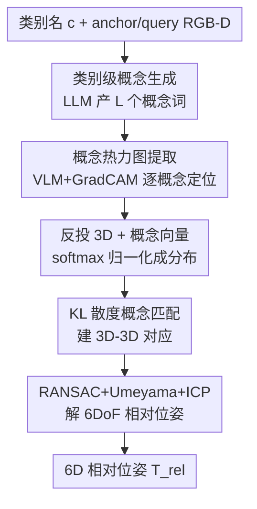

# ConceptPose: Training-Free Zero-Shot Object Pose Estimation using Concept Vectors

**会议**: CVPR 2026  
**论文**: [CVF Open Access](https://openaccess.thecvf.com/content/CVPR2026/html/Kuang_ConceptPose_Training-Free_Zero-Shot_Object_Pose_Estimation_using_Concept_Vectors_CVPR_2026_paper.html)  
**代码**: [项目主页 stevenlk.xyz/conceptpose](https://stevenlk.xyz/conceptpose)（论文给的是 project page，代码链接待确认 ⚠️）  
**领域**: 3D视觉  
**关键词**: 6D位姿估计, 零样本, 训练无关, 视觉语言模型, 概念向量  

## 一句话总结
ConceptPose 把"给物体的 6D 位姿"这件事彻底变成了语义匹配：用 LLM 给物体类别自动生成一串文字"概念"，再用 VLM 的可解释性热力图（GradCAM）把每个概念在两张图上定位、反投到 3D，得到每个点的"概念向量"，最后靠跨视角的概念向量匹配 + RANSAC 直接算相对位姿——全程**不训练、不需要 CAD 模型**，却在四个真实 RGB-D 基准上把最强 baseline 的 ADD(-S) 平均拉高了 **62.8%**。

## 研究背景与动机
**领域现状**：物体 6D 位姿估计是机器人抓取、AR、自主导航的底层能力。主流做法（FoundationPose、Oryon、Horyon 等）虽然开始借助视觉基础模型（DINO/DINOv2）当特征提取器，但仍然要在冻结的 backbone 上**额外训练一个 correspondence head / 位姿网络**，依赖大量带位姿真值的数据，有的还要 CAD 模型。

**现有痛点**：这种"冻结 backbone + 训练头"的范式有两个硬伤——① 真正的泛化被那个训练头卡住，换一个新物体或新场景就容易失效；② 想升级到更强的 VFM 很麻烦，因为头是和旧 backbone 绑死训练出来的，得重训。所谓的"训练无关"方法（如 Any6D）其实也偷偷依赖了在合成位姿数据上预训练的 FoundationPose，或者要先做 image-to-3D 重建。

**核心矛盾**：DINO 这类自监督特征虽然有语义涌现，但它给出的是稠密向量，要靠学一个匹配网络才能用；而 VLM 拥有更丰富的语义理解，却长期只被当成"特征提取器"，它真正能做的**语言驱动的空间推理**被浪费了。换句话说，纯几何/纯学习的匹配，丢掉了"语言"这个人类天然用来描述物体特征的媒介。

**切入角度**：作者从人类认知出发——人判断一个没见过的物体"转了多少"，是先注意到它的若干显著特征（刃口、手指环、金属质感……），换个视角再去找这些**同样的特征**建立对应。这个机制天生是 object-agnostic 的，而语言正是表达这些特征的自然媒介，可以抽象成"概念"（concept）：可以是语义部件、几何属性、可供性（affordance），任何"可视觉定位的性质"。

**核心 idea**：用"概念向量"替代"学出来的几何特征"做对应——LLM 生成概念词，VLM 用可解释性热力图把概念定位到像素并反投 3D，每个 3D 点带一个概念激活分布，靠分布相似度匹配，直接解 6DoF 相对位姿。这是据作者所知第一个**既训练无关、又模型无关**（无需 CAD）的零样本相对位姿方法。

## 方法详解

### 整体框架
问题设定是**单参考视角的相对位姿估计**：给定同一物体在两个不同视角的无位姿 RGB-D 观测——anchor 帧 $A=\{I_a,D_a,M_a,K_a\}$ 和 query 帧 $Q=\{I_q,D_q,M_q,K_q\}$（$I$ 是 RGB、$D$ 深度、$M$ 物体 mask、$K$ 内参），以及一个类别名 $c$（如 "cup"），目标是估出相机到相机的 6DoF 变换 $T_{rel}=(R_{rel},t_{rel})$，使得对应 3D 点满足 $P_q = R_{rel}\cdot P_a + t_{rel}$；推理时**不用任何数据集训练、CAD 模型或位姿真值**。

整条 pipeline 是一个清晰的串行流水线：类别名 →（LLM）一串概念词 →（VLM+GradCAM）每个概念在两帧上的稠密热力图 → 反投 3D 得到带概念向量的点云 → softmax 归一化成概念分布 → 跨帧 KL 相似度匹配出 3D-3D 对应 → RANSAC + Umeyama + ICP 解位姿。

### 关键设计

**1. 类别级概念生成：让语言来定义"看哪里"**

匹配要靠"特征"，但训练无关意味着不能学特征——作者干脆让 LLM 来"指定"特征。给定类别名 $c$，查询一个通用 LLM 生成 $L$ 个描述性概念标签 $\mathcal{L}=\{l_1,\dots,l_L\}$。关键在于概念**不局限于语义部件**：可以是几何（"curved surface"、"flat base"）、可供性（"graspable region"、"pourable opening"）、属性（"round"、"metal"）等任何可视觉定位的性质。prompt 被结构化约束为三条：跨实例可泛化、至少一个视角外部可见、语义正交（减少冗余）。概念**每个类别只生成一次**就复用到该类所有实例，所以这一步几乎零成本，却把"该用什么特征匹配"这个原本需要学习的问题，外包给了语言模型的先验。

**2. 概念热力图提取：把可解释性从"诊断"改造成"定位"**

有了概念词，怎么在图上找到它？语言分割（如 SAM 系）只能给出物体级二值 mask，表达不了"手柄曲线的顶端"这种细粒度、带属性/可供性的概念。作者转而借用 **VLM 可解释性**工具：对每个概念 $l_i$，把它作为文本 prompt "$l_i$." 喂给 VLM（实现用 SigLIP2-giant），在视觉编码器（post-layernorm 层）上跑 **GradCAM** [40]，按梯度对激活做加权求和，得到该概念的空间显著图。流程上先把 RGB 按物体 bbox 裁剪缩放到 VLM 输入尺寸，算完热力图再 resize 回 bbox、pad 回原图，得到一个 $(L,H,W)$ 的显著张量，每个通道高亮与概念 $l_i$ 语义对齐的区域。文本 embedding 跨帧缓存以加速。这一步的妙处是把原本用于"解释模型为什么这么判"的 GradCAM，重新用作"概念在哪"的稠密定位器——无需任何匹配网络。

**3. 概念向量 + KL 散度匹配：用分布相似度建 3D-3D 对应**

把 2D 显著图沿有效深度像素反投到 3D，每个 3D 点 $p$ 关联一个 $L$ 维概念向量 $c(p)\in\mathbb{R}^L$，得到 anchor 点云 $P_a\in\mathbb{R}^{N_a\times3}$ 与 query 点云 $P_q\in\mathbb{R}^{N_q\times3}$（先做两级统计滤波：kNN 局部离群 + 到点云中心距离的全局离群，丢弃超过 $\mu+2.5\sigma$ 的点）。每个概念向量用带温度 $\tau$ 的 softmax 归一化成概率分布：

$$c_i(\mathbf{p}) = \frac{\exp(s_i(\mathbf{p})/\tau)}{\sum_{j=1}^{L}\exp(s_j(\mathbf{p})/\tau)}$$

其中 $s(\mathbf{p})\in\mathbb{R}^L$ 是原始显著值。匹配时不再用欧氏/余弦距离，而是把每个点当成一个"概念分布"，用**前向 KL 散度**度量 query 点 $i$ 与 anchor 点 $j$ 的相似度：

$$S_{ij} = -D_{\mathrm{KL}}\big(c(\mathbf{p}_q^i)\,\|\,c(\mathbf{p}_a^j)\big) = -\sum_{k=1}^{L} c_k(\mathbf{p}_q^i)\log\frac{c_k(\mathbf{p}_q^i)}{c_k(\mathbf{p}_a^j)}$$

每个 query 点取相似度最大（即 KL 最小）的 anchor 点作为对应 $\mathbf{p}_a^{*(i)}=\arg\max_j S_{ij}$，得到一组候选 3D-3D 点对。用概念分布而非单一特征向量做匹配，让对应建立在"语义一致性"上，对纹理缺失、对称物体、大视角变化都更鲁棒——这正是纯几何匹配（SIFT、ObjectMatch）最容易失败的地方。

**4. RANSAC + Umeyama + ICP 鲁棒求解：从含噪对应到干净位姿**

概念匹配难免有外点，作者用 **RANSAC** [12] 做鲁棒估计：每次迭代采样最小对应集，用 **Umeyama** [47] 闭式解算相似变换 $(R,t)$，统计变换后距离小于阈值的内点数，选内点最多的变换；最后再用 **ICP** 基于几何最近邻做局部精修。默认跑 10 万次 RANSAC 迭代、阈值 0.01m、固定随机种子（seed=42）保证可复现。得到的变换直接就是 anchor→query 的相机运动 $T_{rel}$。这一步把"语义对应"落地成"几何一致的位姿"，是整条无学习管线能输出精确 6DoF 的收口。

> 此外有一个**可选的体素化模块**（设计 3 的工程加速项）：把稠密点云归一化到单位立方体 $[-0.5,0.5]^3$、离散成 $64^3$ 体素网格，每个占据体素内对概念向量做均值池化得到稀疏表示，再反归一化回相机系；启用时把最大对应数 10000→5000、RANSAC 迭代 10万→5万。它几乎不掉精度却能稳定提速（见消融），属于实用部署优化而非核心贡献。

### 损失函数 / 训练策略
**没有任何训练**——这正是论文的卖点。全程零参数更新：LLM（Gemini 2.5 Pro）只在每类生成一次概念，VLM（SigLIP2-giant-opt-patch16-384）只做前向 + GradCAM，匹配与求解是经典几何算法。实验全用 FP16，可在消费级 RTX 4060 Ti(16G) 上跑。唯一的"超参"是概念数 $L$、温度 $\tau$、RANSAC 阈值/迭代数，且作者强调无需逐物体调参。

## 实验关键数据

### 主实验
在 REAL275、Toyota-Light(TYOL)、YCB-Video(YCB-V)、LINEMOD(LM) 四个真实 RGB-D 基准上，按 Oryon 协议每个数据集采 2000 个 anchor-query 对，报告 ADD(-S) recall 与 BOP AR。TF 列表示是否训练无关。

| 方法 | TF | REAL275 ADD(-S) | TYOL ADD(-S) | YCB-V ADD(-S) | LM ADD(-S) | 平均 ADD(-S) | 平均 BOP AR |
|------|----|----|----|----|----|----|----|
| SIFT | ✗ | 21.6 | 16.5 | 13.9 | 10.8 | 15.7 | 27.3 |
| Oryon | ✗ | 34.9 | 22.9 | 12.8 | 20.4 | 22.8 | 31.3 |
| Horyon | ✗ | 51.6 | 25.1 | 22.6 | 27.6 | 31.7 | 38.5 |
| Any6D | ✗ | 53.5 | 32.2 | – | – | (42.9†) | (47.2†) |
| One2Any | ✗ | 41.0 | 34.6 | – | – | (37.8†) | (48.5†) |
| **ConceptPose** | ✓ | **71.5** | **55.0** | **41.2** | **38.6** | **51.6 (63.3†)** | **44.0 (56.0†)** |
| Δ vs 最强 baseline | | +33.6% | +59.0% | +82.3% | +39.9% | **+62.8%** | +14.3% |

（† 表示只在 REAL275+TYOL 上平均，以与 Any6D/One2Any 公平比较。）一个训练无关方法全面超过训练过的方法，REAL275 ADD(-S) 71.5 vs 53.5、YCB-V 41.2 vs 22.6 提升尤其夸张。唯一小输的是 LINEMOD 的 BOP AR（31.0 vs Horyon 34.4），作者归因于该集严重遮挡而 ConceptPose 没做任何遮挡专门处理。

### 消融实验

**Prompt 类型消融**（REAL275，$L=15$，R 表示是否给 LLM 渲染图作视觉上下文）：

| Prompt 类型 | R | ADD(-S) | BOP AR | 10°/5cm |
|------|---|----|----|----|
| default（部件名，纯文本） | ✗ | 71.5 | 60.4 | 47.2 |
| geometric（带拓扑/形状） | ✓ | 71.9 | 61.1 | 47.8 |
| affordance（功能可供性） | ✓ | 68.6 | 58.9 | 44.5 |
| adjective（2-3 词形容词） | ✓ | 71.2 | 60.6 | 46.3 |

**体素化消融**（节选 ADD(-S)/BOP AR 与单对耗时）：

| 数据集 | Voxel | 耗时(s) | ADD(-S) | BOP AR |
|------|------|----|----|----|
| REAL275 | ✗ / ✓ | 7.27 / 6.87 | 71.5 / 71.2 | 60.4 / 60.1 |
| TYOL | ✗ / ✓ | 7.29 / 6.75 | 55.0 / 53.5 | 51.6 / 50.2 |
| YCB-V | ✗ / ✓ | 8.82 / 6.81 | 41.2 / 40.8 | 32.8 / 32.4 |
| LINEMOD | ✗ / ✓ | 7.20 / 6.75 | 38.6 / 36.8 | 31.0 / 30.3 |

### 关键发现
- **对 prompt 设计鲁棒**：四种 prompt 风格性能差距很小（ADD(-S) 68.6~71.9），纯文本 default 就有竞争力——说明显式多模态输入并非必需；geometric 略优于 affordance，提示"空间拓扑描述"比"功能可供性"更利于建立视角不变的匹配。
- **概念数量边际递减**：在 TYOL 用贪心 oracle 前向选择发现，性能从 $L=1$ 到 $L=4$ 快速上升，多数类别在 $L=4\sim6$ 饱和；但因 LLM 生成不确定，作者统一取 $L=15$ 以最大概率覆盖到好概念、同时不爆消费级显存，无需逐类调参。
- **体素化几乎免费提速**：ADD(-S) 仅掉 0.3~1.8 点，BOP AR 掉 0.3~1.4 点，平均耗时 7.65s→6.80s（约 11% 提速）；YCB-V 提速最大（物体大、投影点多）。个别指标甚至因均值池化降噪而略升（REAL275 ADD-S 90.8→91.3）。
- **few-shot 跟踪也能打**：在 YCB-V 上用 2 张静态参考帧聚合概念模型，ADD-AUC 90.1 / ADD-S-AUC 95.4，**无训练**地超过 FoundationPose(87.4/94.3)，仅略低于做在线物体补全的 UA-Pose(92.8/96.5)。

## 亮点与洞察
- **把"该看哪个特征"外包给语言**：传统方法要学一个 head 才知道用什么特征匹配，ConceptPose 用 LLM 一句话生成概念词当"匹配锚点"，每类只生成一次，几乎零成本——这是"训练无关"能成立的关键。
- **GradCAM 跨界复用**：把本为"解释模型决策"设计的可解释性工具，反过来当"开放词汇概念定位器"用，绕过了语言分割只能输出粗 mask 的限制，能定位"刃口""手指环"这种细粒度概念。
- **用 KL 散度而非向量距离做匹配**：把每个 3D 点表示成"概念分布"，用分布散度衡量语义一致性，对纹理缺失/对称/大视角天然更稳——这个"点=分布"的思路可迁移到其他需要语义对应的任务（如开放词汇配准、跨域检索）。
- **最反直觉的结论**：语言驱动的语义推理竟然能在位姿这种纯几何任务上**超过学出来的几何特征**，且无需训练，说明 VLM 的空间推理能力被严重低估了。

## 局限与展望
- **作者承认**：单对耗时约 7s（体素化 6.8s），瓶颈在 VLM 推理，是所有稠密 VLM 方法的通病，期待随 VLM 提速；极端视角变化的高度非对称物体、严重遮挡场景会退化（LINEMOD BOP AR 小输于 Horyon 即此因）。
- **自己发现**：① 强依赖 ground-truth 物体 mask 来隔离目标（评测时直接用 GT mask），真实部署若无好 mask 性能未知；② 依赖外部 LLM(Gemini 2.5 Pro) 生成概念，概念质量与可复现性受 LLM 黑盒影响，$L=15$ 其实是为对冲生成不确定性的"冗余保险"；③ 仍需一张参考视图，不是真正的类别级直接估计。
- **改进思路**：作者提出最有前景的方向是扩展到**完全无参考视图的类别级训练无关位姿**——利用概念向量天生的类别级属性，直接从类别名估位姿，连"单参考"都省掉。

## 相关工作与启发
- **vs Oryon / Horyon**：它们也用 DINO 特征 + 物体名的文本 embedding，但只用"物体名"一个词、且要在上面**训练 correspondence 网络**；ConceptPose 用 LLM 生成一串细粒度概念、用 GradCAM 稠密定位、KL 匹配，全程无训练，泛化与可升级性更强。
- **vs Any6D**：Any6D 自称训练无关，实则先用 image-to-3D 生成模型重建 3D 物体、再依赖在合成位姿数据上预训练的 FoundationPose 出结果；ConceptPose 不重建、不依赖任何预训练位姿网络。
- **vs POPE**：POPE 用 DINOv2 特征直接做参考-查询图像间的特征匹配，缺乏语言语义；ConceptPose 引入语言驱动概念，能处理属性/可供性/几何这类 DINO 特征表达不了的人类自然描述。
- **vs SIFT / ObjectMatch**：经典几何匹配无需学习但缺语义理解，对纹理缺失物体和大视角变化很脆；概念向量靠语义分布匹配，正好补上这块。

## 评分
- 新颖性: ⭐⭐⭐⭐⭐ 首个训练无关+模型无关的零样本相对位姿方法，"概念向量+GradCAM 定位+KL 匹配"是真正新的范式
- 实验充分度: ⭐⭐⭐⭐⭐ 四个真实基准 + prompt/概念数/体素化/few-shot 跟踪多维消融，结论扎实
- 写作质量: ⭐⭐⭐⭐ 动机讲得清晰有画面（人类认知类比），公式与流程到位；个别工程细节（mask 依赖、LLM 复现性）可更突出
- 价值: ⭐⭐⭐⭐⭐ 把"位姿估计"重塑成语义匹配、训练无关却超过训练方法 62%，对具身/机器人零样本感知有很强启发

<!-- RELATED:START -->

## 相关论文

- [\[CVPR 2026\] VGGT-360: Geometry-Consistent Zero-Shot Panoramic Depth Estimation](vggt-360_geometry-consistent_zero-shot_panoramic_depth_estimation.md)
- [\[CVPR 2026\] Zero-Shot Depth Completion with Vision-Language Model](zero-shot_depth_completion_with_vision-language_model.md)
- [\[CVPR 2026\] Exploring 6D Object Pose Estimation with Deformation](exploring_6d_object_pose_estimation_with_deformation.md)
- [\[CVPR 2026\] Zoo3D: Zero-Shot 3D Object Detection at Scene Level](zoo3d_zero-shot_3d_object_detection_at_scene_level.md)
- [\[CVPR 2026\] SO(3)-Equivariant ViT-Adapter for Data-Efficient Zero-Shot Sim-to-Real Indoor Panoramic Depth Estimation](so3-equivariant_vit-adapter_for_data-efficient_zero-shot_sim-to-real_indoor_pano.md)

<!-- RELATED:END -->
