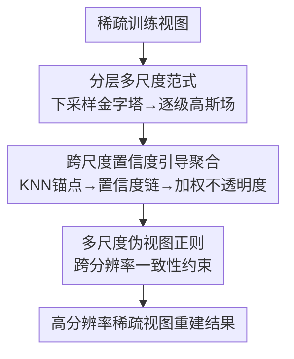

# Confidence-Guided Multi-Scale Aggregation for Sparse-View High-Resolution 3D Gaussian Splatting

**会议**: CVPR 2026  
**论文**: [CVF Open Access](https://openaccess.thecvf.com/content/CVPR2026/html/Zhou_Confidence-Guided_Multi-Scale_Aggregation_for_Sparse-View_High-Resolution_3D_Gaussian_Splatting_CVPR_2026_paper.html)  
**代码**: 未公开  
**领域**: 3D视觉  
**关键词**: 稀疏视图重建, 3D高斯泼溅, 多尺度聚合, 置信度引导, 高分辨率  

## 一句话总结
本文先用系统实验揭示稀疏视图 3DGS 下「低分辨率给稳结构、高分辨率给细节但带噪」的分辨率权衡，进而提出 CAGS：用低分辨率高斯场作锚、靠跨尺度置信度链给每个高分辨率高斯重加权不透明度、再配多尺度伪视图正则，从而在 3 视图等极稀疏条件下做出高分辨率重建，原分辨率 LLFF 上 PSNR 比 NexusGS 高 2.7dB。

## 研究背景与动机
**领域现状**：稀疏视图（few-shot）3D 重建主流是给 NeRF / 3DGS 加各种先验或正则——FSGS 的邻近高斯解池、DNGaussian/DepthRegGS 引入单目深度、CoR-GS 的协同正则、NexusGS 的极线深度先验等，都在「少图也别过拟合」上做文章。

**现有痛点**：这些方法几乎都默认在**大幅降采样**（如 8×）后的低分辨率图上跑，因为一旦上原始分辨率，稀疏视图约束下的稠密化会塞进大量噪声高斯，浮点（floaters）和重影（ghosting）成倍放大，重建质量反而崩。换句话说，现有 few-shot 方法的「好成绩」是在低分辨率舒适区里刷出来的，迁到高分辨率就失效。

**核心矛盾**：作者通过系统实验把这件事量化成一个**分辨率权衡**——低分辨率输入约束少、高斯点少，能收敛出稳健的全局几何，但丢高频细节、发糊；高分辨率输入细节丰富，但在欠约束区域噪声与重影暴涨，误差图里碎裂的红斑就是证据。两端各有所长、各有所短，且互补。

**本文目标**：在不降采样、保留原始高分辨率的前提下，把「低分辨率的稳结构」和「高分辨率的细节」融到一套重建里。

**切入角度**：既然两种分辨率是互补的，那就别二选一——用低分辨率场当「全局锚」去约束高分辨率场的高斯分布，保细节同时滤掉与稳结构不一致的噪声点。

**核心 idea**：构建多分辨率高斯场金字塔，coarse-to-fine 逐级精化，用**跨尺度置信度**衡量每个细尺度高斯与其粗尺度锚点的一致性，并以此自适应加权它的不透明度贡献，从而「投票式」聚合可靠结构、压制不稳定点。

## 方法详解

### 整体框架
CAGS 的输入是稀疏的几张训练视图，输出是一个能在原始高分辨率下渲染的 3D 高斯辐射场。整条管线分三步：先把输入图下采样成一串分辨率（如 1/16、1/8、1/4、1/2、原始），每个分辨率各自拟合出一个 3D 高斯场，构成从粗到细的金字塔（粗场给稳全局结构、细场给高频细节）；然后在相邻分辨率之间，给每个细尺度高斯找到最近的粗尺度锚点、算出几何与属性差异、映射成一个置信度，并沿跨尺度链传播，用这个置信度去重加权该高斯的不透明度；最后用多尺度伪视图正则强制各分辨率输出之间保持一致，精修细节而不放大噪声。

整个过程自底向上：先让最粗的场收敛到可靠全局表示，再逐级把更细的场并进来，每一级都拿更粗一级的稳几何当参考。三个模块各司其职——金字塔提供「料」，置信度聚合负责「筛」，多尺度正则负责「校」。

### 关键设计

**1. 分层多尺度范式：把分辨率权衡变成可融合的金字塔**

这一设计直接回应「高分辨率单独跑就崩、低分辨率单独跑发糊」的痛点。作者不是挑一个分辨率，而是把输入图下采样成多档（如 1/16、1/8、1/4、1/2、原始），每档各拟合一个 3D 高斯场，得到一串从粗到细的场。重建顺序刻意做成自底向上：先让最粗的场收敛成可靠的全局几何锚，再逐级把更细的场叠进来，每一级都以更粗一级的稳定几何为参照。这样高分辨率场不再是无约束地乱长高斯，而是在粗尺度锚点的指引下生长——保留有益的局部细节，同时让明显偏离稳结构的噪声点失去依托。为保证各尺度的高斯场空间对齐，相机内参随分辨率按比例缩放，使所有场落在同一世界坐标系里，后续跨尺度操作才有意义。

**2. 跨尺度置信度引导聚合：用一致性给不透明度投票，而非硬剪枝**

这是全文核心，针对的痛点是「稀疏视图稠密化会塞噪声高斯，但显式剪枝又会误删有用的细结构」。作者改用一个连续、可微的置信度机制。对每个细尺度高斯 $\theta_i^{(s+1)}$，先通过 KNN 匹配 $f(i)$ 找到它在相邻粗尺度的最近锚点 $\theta_{f(i)}^{(s)}$，再算三项差异——位置偏移 $d_i=\lVert \mu_i^{(s+1)}-\mu_{f(i)}^{(s)}\rVert$、不透明度差 $\Delta\alpha_i=\lvert \alpha_i^{(s+1)}-\alpha_{f(i)}^{(s)}\rvert$、尺度差 $\Delta s_i=\lvert \sigma_i^{(s+1)}-\sigma_{f(i)}^{(s)}\rvert$，分别刻画空间、不透明度、尺度上「这个细高斯有没有继承粗结构」。三项经一个带可学习标量的映射融成置信度：

$$c_i^{(s+1)} = \sigma\!\left(-\left(w_d\, d_i^2 + w_\alpha\, \Delta\alpha_i^2 + w_s\, \Delta s_i^2 + b\right)\right)$$

其中 $w_d, w_\alpha, w_s, b$ 都可学习，$\sigma$ 是 sigmoid，差异越小置信度越接近 1。这个置信度再沿层级链相乘传播：

$$c_i^{(s+1)} \leftarrow c_{f(i)}^{(s)} \cdot c_i^{(s+1)}$$

链式相乘的好处是：只有从粗到细一路都一致的高斯才能在各级都保持高响应，任何一级失稳都会被乘小。最终置信度直接调制不透明度做渲染：$\tilde{\alpha}_i^{(s)} = c_i^{(s)} \cdot \alpha_i^{(s)}$。于是与粗锚一致的高斯保持高可见度，不一致的被平滑压低——相当于跨尺度的「软投票」，全程可微、无需离散剪枝，既不误删细结构，又自然滤噪。

**3. 多尺度伪视图正则：让高分辨率输出向各尺度对齐，抑制过拟合**

聚合解决了「哪些高斯可信」，但稀疏视图下未见视角仍可能过拟合训练视图。作者在训练视图之外采伪视图：取欧氏空间里最近的两个训练相机，平均朝向、插值出一个虚拟相机 $P'=(t+\epsilon, q)$，$\epsilon\sim\mathcal{N}(0,\delta)$ 是位置扰动、$q$ 是插值四元数，用这些伪相机在多个尺度上渲染，降低过拟合风险。关键约束是**以最高分辨率输出为参考**、把它下采样到各尺度 $s$ 去监督对应尺度的渲染——即让高分辨率结果天然继承低分辨率的结构一致性。伪视图损失为各尺度上 L1 与 D-SSIM 的组合：

$$R^p_{color} = \sum_{s\in S}\left[\lambda L_1(I^p_s, I^{p\prime}_h) + (1-\lambda)L_{D\text{-}SSIM}(I^p_s, I^{p\prime}_h)\right]$$

$I^{p\prime}_h$ 是把最高分辨率伪视图输出下采样到尺度 $s$ 的版本。训练视图上则用对应尺度的真值 $I^*_s$（由高分真值下采样得到）同样监督。这一步在不放大噪声的前提下精修高频细节，与聚合互补：一个管「全局选可靠点」，一个管「局部跨尺度对齐」。

### 损失函数 / 训练策略
总损失是训练视图监督损失与伪视图多尺度正则之和：

$$L = L_{color} + R^p_{color}$$

其中训练视图损失 $L_{color}=\sum_{s\in S}[\lambda L_1(I_s, I^*_s)+(1-\lambda)L_{D\text{-}SSIM}(I_s, I^*_s)]$。整套重建按金字塔自底向上进行，最粗场先收敛再逐级精化。

## 实验关键数据

### 主实验
LLFF / DTU 用 3 视图、Mip-NeRF360 用 12/24 视图、Blender 用 8 视图，且**不做传统降采样**。与 FSGS、Binocular3DGS、DropGaussian、NexusGS 对比（LLFF / Mip-NeRF360，12 视图）：

| 数据集 | 分辨率 | 指标 | FSGS | NexusGS | 本文 CAGS |
|--------|--------|------|------|---------|-----------|
| LLFF | original | PSNR↑ | 15.48 | 16.12 | **18.85** |
| LLFF | original | SSIM↑ | 0.528 | 0.558 | **0.590** |
| LLFF | original | LPIPS↓ | 0.384 | 0.361 | **0.339** |
| LLFF | 1/2 | PSNR↑ | 17.25 | 17.83 | **19.59** |
| Mip-NeRF360 | original | PSNR↑ | 15.35 | 16.79 | **18.43** |
| Mip-NeRF360 | 1/2 | PSNR↑ | 16.26 | 17.72 | **18.85** |

提升在**原始高分辨率**最显著（LLFF original PSNR 比 NexusGS 高 2.73dB、比 FSGS 高 3.37dB），随着分辨率降到 1/4 差距收窄——印证方法专治高分辨率失稳。

### 即插即用增益（DTU，高分辨率）
CAGS 作为通用范式接到现有 3DGS 方法上：

| 方法 | 原分辨率 PSNR↑ | +CAGS | 1/2 PSNR↑ | +CAGS |
|------|------|------|------|------|
| DropGaussian | 17.45 | **19.13** | 18.19 | **19.95** |
| FSGS | 17.32 | **18.67** | 18.23 | **19.72** |
| CoR-GS | 17.51 | **19.25** | 18.17 | **20.03** |

三种 backbone 均稳定涨 1.3–1.8dB，验证范式的通用性。

### 消融实验
两大核心模块的逐项拆解（原分辨率 / 1/2）：

| 分层聚合 | 多尺度正则 | 原分辨率 PSNR↑ | 原分辨率 SSIM↑ | 1/2 PSNR↑ |
|:---:|:---:|------|------|------|
| × | × | 15.32 | 0.512 | 16.28 |
| ✓ | × | 18.45 | 0.615 | 19.10 |
| × | ✓ | 16.43 | 0.544 | 16.87 |
| ✓ | ✓ | **18.83** | **0.626** | **19.50** |

### 关键发现
- **分层置信度聚合是首要功臣**：单开聚合就把原分辨率 PSNR 从 15.32 拉到 18.45（+3.13dB），而单开正则只到 16.43（+1.11dB）——稠密化阶段的过拟合才是高分辨率崩坏的主因，聚合直击这一点。
- **两模块互补**：可视化里去掉聚合会留下杂乱噪声高斯，去掉正则则结构稳定性下降；二者全开才同时拿到稳结构与细节。
- **高分辨率才是主战场**：方法优势随分辨率升高而扩大，低分辨率下与 SOTA 接近，说明它补的正是现有 few-shot 方法回避的那块短板。

## 亮点与洞察
- **把「分辨率」第一次当成稀疏视图的关键变量来量化**：以往 few-shot 工作默认 8× 降采样，本文用误差图+高斯场可视化系统证明了多分辨率互补，这个 empirical study 本身就有诊断价值。
- **用连续可微置信度替代离散剪枝**，巧在「软投票」既不误删细结构、又能滤噪，且天衣无缝地嵌进可微渲染（只是乘到不透明度上），实现简单却切中要害。
- **置信度链式传播**是个可迁移的点子：任何多尺度/层级表示里，想表达「一路一致才可信」都能用这种相乘传播，比单层判别更鲁棒。
- **范式可插拔**：能直接套到 FSGS/CoR-GS/DropGaussian 上涨点，意味着它不是又一个孤立 baseline，而是一层正交的增强。

## 局限与展望
- 需要构建并优化多档分辨率的高斯场金字塔，训练/显存开销随尺度数增长，论文未给出与单尺度方法的效率/耗时对比 ⚠️ 以原文为准。
- 置信度只用了位置/不透明度/尺度三项几何属性差异，未纳入颜色或视角相关信息，在纹理高频但几何平坦区域是否够用存疑。
- KNN 跨尺度匹配在欠约束区域可能找到不可靠锚点，错锚会污染置信度链，论文未深入分析匹配失败的退化情形。
- 实验集中在 LLFF/Mip-NeRF360/DTU/Blender 这类前向或物体场景，对大尺度无界场景的高分辨率稀疏重建效果未知。

## 相关工作与启发
- **vs FSGS / NexusGS / DropGaussian**：它们靠深度先验、极线先验或随机丢弃在低分辨率上稳几何，本文不引外部先验，而是用**内部跨尺度一致性**当监督信号，且专门攻高分辨率；定性上 FSGS 易重影、DropGaussian 在高分辨率随机丢弃导致结构不稳、NexusGS 在高细节区有畸变，CAGS 更平衡。
- **vs CoR-GS**：CoR-GS 用双场协同正则抑制不可靠区，CAGS 把「协同」推广成多分辨率层级、并用置信度链显式量化可靠度；二者可叠加（CAGS+CoR-GS 进一步涨点）。
- **vs HiSplat / Octree-GS 等多尺度 3DGS**：那些多用于前馈泛化或 LoD 高效渲染，少有针对优化式 3DGS 在稀疏+高分辨率下的分辨率权衡做系统研究，本文填的正是这块空白。

## 评分
- 新颖性: ⭐⭐⭐⭐ 首次量化稀疏视图的分辨率权衡，置信度链式聚合替代剪枝的思路扎实但属组合式创新
- 实验充分度: ⭐⭐⭐⭐ 四数据集+三 backbone 可插拔验证+清晰消融，PSNR 涨幅显著；缺效率开销对比
- 写作质量: ⭐⭐⭐⭐ empirical study 引出动机的叙事清楚，公式与图示到位
- 价值: ⭐⭐⭐⭐ 把 few-shot 3DGS 从低分辨率舒适区推向高分辨率，且能即插即用增强现有方法

<!-- RELATED:START -->

## 相关论文

- [\[CVPR 2026\] SplatSuRe: Selective Super-Resolution for Multi-view Consistent 3D Gaussian Splatting](splatsure_selective_super-resolution_for_multi-view_consistent_3d_gaussian_splat.md)
- [\[CVPR 2026\] Turbo-GS: Accelerating 3D Gaussian Fitting for High-Resolution Radiance Fields](turbo-gs_accelerating_3d_gaussian_fitting_for_high-quality_radiance_fields.md)
- [\[CVPR 2026\] Intrinsic Geometry-Appearance Consistency Optimization for Sparse-View Gaussian Splatting](intrinsic_geometry-appearance_consistency_optimization_for_sparse-view_gaussian_.md)
- [\[CVPR 2026\] Any Resolution Any Geometry: From Multi-View To Multi-Patch](any_resolution_any_geometry_from_multi-view_to_multi-patch.md)
- [\[CVPR 2026\] TWINGS: Thin Plate Splines Warp-aligned Initialization for Sparse-View Gaussian Splatting](twings_thin_plate_splines_warp-aligned_initialization_for_sparse-view_gaussian_s.md)

<!-- RELATED:END -->
