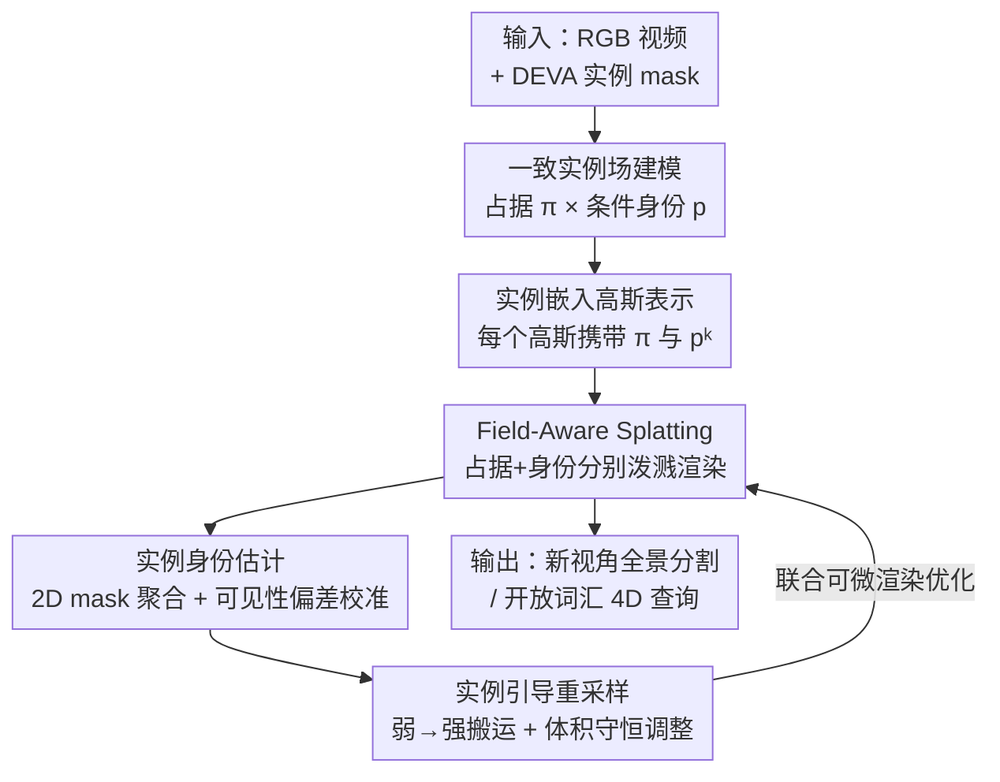

# Consistent Instance Field for Dynamic Scene Understanding

**会议**: CVPR 2026  
**论文**: [CVF Open Access](https://openaccess.thecvf.com/content/CVPR2026/html/Wu_Consistent_Instance_Field_for_Dynamic_Scene_Understanding_CVPR_2026_paper.html)  
**代码**: 未公开  
**领域**: 3D视觉  
**关键词**: 动态场景理解, 4D高斯泼溅, 实例分割, 占据概率场, 可见性偏差校准  

## 一句话总结
把动态场景建模成一个连续的概率「实例场」——每个时空点同时携带「占据概率」和「条件身份分布」，并用带实例语义的可变形 3D 高斯去逼近这个场，从而把物体身份和它在某个视角下是否可见解耦开，在新视角全景分割和开放词汇 4D 查询上大幅超越此前 SOTA（HyperNeRF mIoU +11.4、Neu3D +5.8）。

## 研究背景与动机

**领域现状**：动态场景理解的主流做法是先用可变形表示（NeRF 系或 3D 高斯系）重建几何与外观，再往里塞语义——要么注入视觉-语言特征做开放词汇查询，要么用 2D mask 监督学一个语义/实例场。3D 高斯泼溅（3DGS）因为显式、可实时渲染，近年成了这条线的主力载体。

**现有痛点**：这些方法的语义监督全都是「经由 RGB 渲染」间接施加的，因此天然是**视角相关**的。它们没有显式建模「物体在时空中持续存在」这件事，而是把身份绑死在辐射（radiance）上。论文把这个绑定带来的毛病归纳成三类（见 Figure 1）：跨视角实例监督不稳定导致身份漂移；把「颜色不透明度 opacity」误当成「物体占据 occupancy」；以及语义上有意义的区域被高斯容量稀疏地表达、欠拟合。

**核心矛盾**：根子在于把「身份」和「可见性」混为一谈。一个物体在某些视角被遮挡或外观变了，可见性会剧烈变化，但它的身份本该保持不变——可现有方法用渲染权重传播监督，可见区域天然主导梯度，遮挡区域被冷落，于是身份就跟着可见性一起抖。

**本文目标**：构造一个对形变和视角变化都鲁棒的、时间一致的实例表示，让「评估时空中任意一点」既能回答「这里有没有物体」，也能回答「是哪个物体」。

**切入角度**：把动态场景看成一个**以物体为中心**的连续 4D 场，而不是一堆随时间变化的外观。关键观察是：存在（matter exists）和身份（identity persists）是两件可以分开建模的事——前者描述物理占据的时空连续性，后者描述身份在形变中的稳定归属。

**核心 idea**：用「占据概率 × 条件身份分布」这个概率分解显式建模时空中的物体存在与身份，再用带实例嵌入的可变形高斯把这个连续场离散化落地，从而**用持久身份代替视角相关特征**来解决动态场景的语义不一致。

## 方法详解

### 整体框架
方法叫 Consistent Instance Field（CIF）。输入是动态场景的 RGB 视频帧 + 由 DEVA 跑出来的逐帧实例 mask，输出是一组「带实例语义的可变形高斯」，对它做可微渲染既能出新视角 RGB，也能出时间一致的实例分割图。整条管线可以理解成：先定义连续概率场（占据 + 身份）→ 用高斯表示去逼近它 → 用 Field-Aware Splatting 把每个高斯的占据和身份泼到像素上做监督 → 用 Instance Identity Estimation 把 2D mask 聚合成每个高斯的身份分布并校准可见性偏差 → 用 Instance-Guided Resampling 把高斯容量往语义活跃区搬。所有模块通过一个联合的可微渲染目标一起优化。

### 关键设计

**1. 一致实例场：把「存在」和「身份」拆成两个概率因子**

针对「身份被绑死在辐射上、跟着可见性抖」这个根本痛点，论文不再让语义寄生于颜色，而是直接为时空定义一个联合分布。设 $E\in\{0,1\}$ 表示 4D 位置 $(x,t)$ 是否被任何实体占据，$K\in\mathcal{K}$ 表示实例身份，场被定义为

$$\gamma(x,t,k) = P(E{=}1, K{=}k \mid x,t) = \underbrace{P(E{=}1\mid x,t)}_{\pi(x,t)}\;\underbrace{P(K{=}k\mid E{=}1, x,t)}_{p(x,t,k)}.$$

这个分解是全文的灵魂：$\pi(x,t)\in[0,1]$ 是「占据概率」，刻画物理存在的时空连续性；$p(x,t,k)$ 是「条件身份分布」（$\sum_k p=1$），刻画身份在形变与运动中的稳定归属。把存在从身份里剥出来之后，一个物体即便某视角被遮挡（可见性低），它的条件身份 $p$ 仍可保持不变——低熵区代表稳定归属，交互边界处的高熵区代表软共享。这正是它对视角/形变鲁棒的来源。

**2. 实例嵌入高斯表示 + Field-Aware Splatting：把连续场落到可微渲染上**

连续场没法直接优化，论文用一组可变形高斯去逼近它。每个高斯 $g_i=(x_i, R_i, s_i, c_i, \alpha_i, \pi_i, p_i^1,\dots,p_i^K)$ 在常规几何/辐射属性之外，额外携带占据 $\pi_i$ 和身份分布 $p_i^k$，并由一个时间条件 MLP 产生平滑轨迹、随时间调制参数——高斯随形变场移动时把身份一路带着走，维持局部一致。

关键在于渲染时**占据和不透明度走两套泼溅**。颜色还是标准 alpha 合成（透射率用 $\alpha$）；而实例图用的是另一套以 $\pi$ 为权的「实例透射率」：

$$M_k(u,v,t) = \sum_i T_i^{\text{inst}}(u,v,t)\,\pi_i\,P_i(u,v,t)\,p_i^k,\quad T_i^{\text{inst}}=\prod_{j<i}\big(1-\pi_j P_j\big).$$

这一步是「opacity vs occupancy 误区」的直接修法：$\pi_i$ 决定高斯在 4D 场里的空间支撑，$p_i^k$ 决定它属于哪个实例，二者都不再借用颜色 $\alpha$。渲染出的 $M_k$ 是每个像素对实例 $k$ 的软分配，由几何、占据、身份共同塑形，用交叉熵监督就能把高斯对齐到底层实例场。

**3. 实例身份估计：从 2D mask 反推高斯身份，并校准可见性偏差**

这是把外部 2D 监督灌进高斯表示的桥，专治「跨视角监督不稳定」。先用渲染权重 $w_i(u,v,t)=\frac{T_i\alpha_i P_i}{\sum_j T_j\alpha_j P_j}$（某像素颜色由 $g_i$ 解释的后验比例），把所有像素和时间上「高斯 $i$ 参与解释实例 $k$ 的频次」聚合、归一化，得到身份分布的初始化 $\hat p_i^k$（公式 6–7）。

但 $w_i$ 依赖光度透射率，频繁可见/光照好的区域会主导监督，遮挡/低对比区被严重低估——这就是可见性偏差。论文的修法是引入**可学习的校准因子** $m_i^k>0$ 来重标定：

$$p_i^k = \frac{\hat p_i^k\, m_i^k}{\sum_{k'}\hat p_i^{k'} m_i^{k'}}.$$

$m_i^k$ 和所有高斯参数一起通过实例场渲染（公式 4）联合优化，梯度同时流经占据 $\pi_i$ 和校准身份 $p_i^k$，把纯外观驱动的初始化逐步推向时间一致、几何感知的身份估计。消融里去掉它掉点最猛（mIoU 80.80→78.16、PSNR 还从 32 崩到 26.73），说明它确实在吸收可见性带来的残差偏差。

**4. 实例引导重采样：把高斯容量搬到语义活跃区**

有限个高斯离散化连续场时，容易出现「语义强的区域容量不够、背景却堆着冗余高斯」的错配，对应 Figure 1 的「语义稀疏」问题。论文定义每个高斯对实例 $k$ 的**实例响应** $\gamma_i^k=\pi_i p_i^k$（同时衡量占据与语义亲和），据此构造两个互补采样分布：

$$P_{\text{weak}}(i\mid k)\propto (\gamma_i^k)^{-1},\qquad P_{\text{strong}}(i\mid k)\propto \gamma_i^k.$$

在同一实例内采一对 (弱 $w$, 强 $s$)，把弱高斯 $g_w$ 在强高斯 $g_s$ 附近重新初始化、继承其几何与语义属性——相当于把表达容量从冗余处搬到语义活跃处。为防止复制导致局部过饱和（多个高斯叠加虚高光度/语义置信），再做**体积守恒调整**：对源高斯和它已产生的 $n$ 个副本，统一把不透明度和占据降为 $\alpha_{\text{new}}=1-(1-\alpha_{\text{src}})^{1/(n+1)}$、$\pi_{\text{new}}=1-(1-\pi_{\text{src}})^{1/(n+1)}$，使整簇的有效体积贡献在重分布后保持不变，避免语义漂移和辐射膨胀。

### 损失函数 / 训练策略
所有模块通过可微场渲染联合优化。总损失 $L = L_{\text{rgb}} + \lambda_{\text{inst}} L_{\text{inst}}$：光度项 $L_{\text{rgb}}=\|C_{\text{rendered}}-C_{\text{gt}}\|_1$ 用 $\ell_1$；语义项 $L_{\text{inst}}$ 是渲染实例图与 GT mask 的逐像素交叉熵 $-\sum_{u,v,t}\sum_k M_k^{\text{gt}}\log M_k^{\text{rendered}}$。每个场景先重建训 10,000 步、再做实例分割训 3,000 步（Adam，单张 A40）；占据与身份校准学习率 0.01，其余沿用 Deformable Gaussian Splatting 默认值。重采样采样率 HyperNeRF 取 1%、Neu3D 取 5%，$\lambda_{\text{inst}}$ 分别 0.01 / 0.005；mask 渲染用 argmax 取实例、不设置信度阈值。

## 实验关键数据

两个动态场景任务：新视角全景分割（同时考空间精度和时间一致性）、开放词汇 4D 查询（按文本检索时空中的实例）。数据集为单目的 HyperNeRF 和多视角的 Neu3D（多视角被当作「伪单目序列」处理，只保留所有视角可见的实例以避免 GT 跨视角不一致）。GT mask 均由 DEVA 生成。

### 主实验（新视角全景分割，数据集平均）

| 数据集 | 指标 | 本文 CIF | 次优 (VLGS) | 提升 |
|--------|------|----------|-------------|------|
| HyperNeRF | mAcc-pix | 96.40 | 94.31 | +2.09 |
| HyperNeRF | mAcc-inst | 85.69 | 73.91 | +11.78 |
| HyperNeRF | mIoU | 79.47 | 68.05 | **+11.42** |
| Neu3D | mAcc-pix | 94.97 | 90.25 | +4.72 |
| Neu3D | mAcc-inst | 93.19 | 90.69 | +2.50 |
| Neu3D | mIoU | 88.31 | 82.49 | **+5.82** |

> ⚠️ 次优列的具体数值是根据论文正文给出的「超过 VLGS +X」反推的（如 mIoU 79.47−11.42=68.05），与逐场景表的平均可能有舍入差异，以原文为准。最夸张的单场景是 HyperNeRF 的 "torchocolate"：mIoU 比 SA4D 高 +15.11、比 VLGS 高 +20.89。

### 消融实验（HyperNeRF "split-cookie" 场景）

| 配置 | mAcc-pix | mAcc-inst | mIoU | PSNR | 说明 |
|------|----------|-----------|------|------|------|
| (i) 常数占据 | 96.26 | 85.57 | 80.80 | 31.76 | $\pi$ 固定为 0.02，去掉空间自适应 |
| (ii) opacity 当占据 | 96.60 | 87.20 | 82.34 | 32.16 | 用 RGB 不透明度替占据，混淆存在与可见 |
| (iii) w/o 身份校准 | 95.99 | 82.65 | 78.16 | 26.73 | 去掉 $m_i^k$，可见性偏差直接传入 4D 身份 |
| (iv) w/o 重采样 | 96.78 | 87.98 | 82.82 | 32.34 | 高斯容量在背景冗余、活跃区不足 |
| (v) Full | **97.93** | **90.40** | **86.03** | **32.42** | 完整模型 |

### 关键发现
- **身份校准是单点贡献最大的模块**：去掉它 mIoU 从 86.03 掉到 78.16，且 PSNR 从 32.42 崩到 26.73——可见性偏差不仅毁语义，连重建质量都一起拖垮，印证「身份与可见性必须解耦」这个核心论点。
- **「opacity 当占据」虽保住粗几何但破坏实例一致性**：(ii) 的 PSNR 还有 32.16，但 mIoU 只有 82.34，说明把存在和可见混为一谈时，颜色还行、身份却散了，正好对应动机里点名的误区。
- **占据需要空间自适应**：(i) 把 $\pi$ 钉死成常数也掉点（mIoU 80.80），证明占据作为一个可学习的概率量、而非固定先验，是必要的。
- 透明/反光物体（玻璃杯、钢壶）上 CIF 边界明显更干净，4D LangSplat 和 SA4D 会出现边界泄漏或语义混淆。

## 亮点与洞察
- **「占据 vs 不透明度」的概念澄清很关键**：长期以来 3DGS 语义工作直接拿 $\alpha$ 当物体存在的代理，本文明确把二者拆成两套透射率（颜色用 $\alpha$、实例用 $\pi$），这个区分简单但解释力强，消融 (ii) 直接证明了它的价值。
- **可见性偏差用「可学习校准因子」吸收**很优雅：不是手工设计去偏规则，而是让 $m_i^k$ 随梯度自己学着补偿渲染权重的不均衡，思路可迁移到任何「2D 监督经渲染反传、但视角覆盖不均」的 3D/4D 表示学习。
- **弱-强配对重采样 + 体积守恒**把「往哪搬容量」和「搬完别炸」一起解决：用 $\gamma_i^k=\pi_i p_i^k$ 当语义信号驱动容量再分配，再用 $1-(1-\alpha)^{1/(n+1)}$ 这种闭式衰减守住有效体积，这套组合可借鉴到一般的高斯密度自适应（densification）里防过饱和。

## 局限与展望
- **依赖现成 2D 实例分割器（DEVA）**：身份估计的初始化质量受限于 DEVA 的跨帧一致性，GT mask 本身也是它生成的，这让评测在一定程度上「自证」——遇到 DEVA 失效的强遮挡/快速运动场景，CIF 的上限会被卡住。
- **多视角当伪单目 + 只保留全视角可见实例**：为回避 GT 跨视角不一致，Neu3D 上丢掉了被部分遮挡的实例，这其实回避了最难的遮挡推断问题；作者也承认这是 ill-posed 的，但意味着报告数字偏乐观。
- **缺开放词汇 4D 查询的定量基准**：该任务只给了定性对比，作者把「建标准化 4D 评测基准」列为未来工作，说明这块目前还无法量化复现。
- 代码未见公开，CUDA 实现的 Field-Aware Splatting 复现成本较高。

## 相关工作与启发
- **vs SA4D**: SA4D 用带 RGB 调制的视角相关特征做 4D 分割，本文指出这正是身份漂移、闪烁的来源；CIF 改用视角无关的占据-身份概率场，HyperNeRF mIoU 在 torchocolate 上直接高出 +15.11。
- **vs VLGS / Dr. Splat**: 这类把语义/语言特征注入 3DGS 的方法是本文最强的次优基线（VLGS 在 Neu3D 多场景上 mIoU 不俗），但它们的语义仍偏向可见区、遮挡下易碎；CIF 把语义锚定在「物理实体的持续存在」上，跨视角一致性更好。
- **vs 4D LangSplat**: 4D LangSplat 是动态场景开放词汇查询的近期 SOTA，但在透明/反光物体上边界泄漏；CIF 借助占据-身份解耦在这些困难材质上分割更锐利（仅定性对比）。

## 评分
- 新颖性: ⭐⭐⭐⭐⭐ 把动态场景理解重构成「占据 × 条件身份」概率场、并显式解耦可见性与身份，视角独到且自洽。
- 实验充分度: ⭐⭐⭐⭐ 两数据集两任务 + 消融到位，但开放词汇查询只有定性、且 GT 依赖 DEVA 并剔除遮挡实例。
- 写作质量: ⭐⭐⭐⭐⭐ 动机三类问题与方法三个模块一一对应，公式推导清晰，图文配合好读。
- 价值: ⭐⭐⭐⭐ 新视角全景分割提升幅度大（mIoU +11.4 / +5.8），且「occupancy≠opacity」「可学习去偏」等洞察可迁移到更广的 4D 表示学习。

<!-- RELATED:START -->

## 相关论文

- [\[CVPR 2026\] PointTPA: Dynamic Network Parameter Adaptation for 3D Scene Understanding](pointtpa_dynamic_network_parameter_adaptation_for_3d_scene_understanding.md)
- [\[CVPR 2026\] Towards Foundation Models for 3D Scene Understanding: Instance-Aware Self-Supervised Learning for Point Clouds](towards_foundation_models_for_3d_scene_understanding_instance-aware_self-supervi.md)
- [\[CVPR 2026\] I-Scene: 3D Instance Models are Implicit Generalizable Spatial Learners](i-scene_3d_instance_models_are_implicit_generalizable_spatial_learners.md)
- [\[CVPR 2026\] RISE: Single Static Radar-based Indoor Scene Understanding](rise_single_static_radar-based_indoor_scene_understanding.md)
- [\[CVPR 2026\] Real-Time Dynamic Scene Rendering with Controlled Compressibility and Contact Awareness](real-time_dynamic_scene_rendering_with_controlled_compressibility_and_contact_aw.md)

<!-- RELATED:END -->
