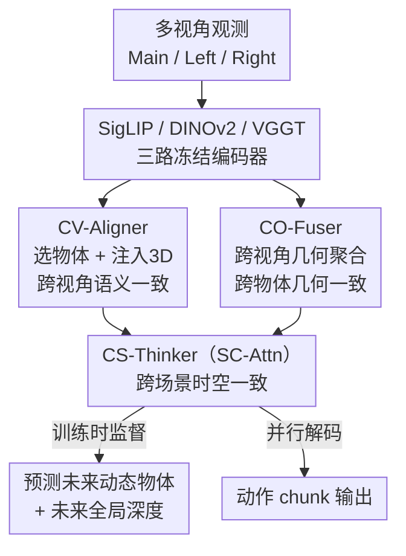

# ConsisVLA-4D: Advancing Spatiotemporal Consistency in Efficient 3D-Perception and 4D-Reasoning for Robotic Manipulation

**会议**: CVPR 2026  
**arXiv**: [2605.05126](https://arxiv.org/abs/2605.05126)  
**代码**: https://github.com/JiuTian-VL/ConsisVLA-4D (有)  
**领域**: 3D视觉 / 具身智能 / VLA  
**关键词**: 视觉-语言-动作模型, 时空一致性, 3D感知, 4D推理, 机器人操作

## 一句话总结
ConsisVLA-4D 用三个模块（CV-Aligner、CO-Fuser、CS-Thinker）把多视角 2D 观测压缩成约 1/8 的 token，同时在感知阶段保证「跨视角语义一致」和「跨物体几何一致」、在推理阶段把这种一致性延伸到「跨场景时空一致」，在 LIBERO 和真机上比 OpenVLA 分别提升 21.6% / 41.5% 成功率并加速 2.3× / 2.4×。

## 研究背景与动机
**领域现状**：当前 VLA（Vision-Language-Action）模型（RT-2、Octo、OpenVLA、$\pi$ 系列）主流做法是把 2D 视觉观测直接映射到动作，在很多 benchmark 上已取得不错效果。

**现有痛点**：这类模型在**空间感知**和**时间推理**两个维度都不够。一方面，要拿到 3D 空间理解，要么靠额外传感器（点云、深度图，如 PointVLA、GeoVLA、3D-VLA）带来巨大算力开销、限制平台通用性；要么靠纯 2D→3D 投影（SpatialVLA、Evo-0、GeoAware-VLA）但有投影偏差、几何不一致、遮挡误差。另一方面，做未来推理的世界模型类方法（WorldVLA、World4Omni、V-JEPA 2）大多只预测**未来帧图像**，而不是真正理解动态的 3D 空间。

**核心矛盾**：现有方法要么「为了 3D 精度付出算力代价」，要么「为了效率牺牲 3D/4D 一致性」。更深层的问题是——它们缺乏对当前空间状态的完整理解，也缺乏对场景如何随动作演变的知识，因此无法在「当前观测」与「预测的未来场景」之间建立一致的关联，导致视觉推理失真、动作不稳定。

**本文目标**：分解成两个子问题——(1) 如何在不引入过量算力的前提下从 2D 观测高效生成 3D 表征？(2) 如何通过 4D 视觉推理强化时空一致性来优化动作预测？

**切入角度**：作者从人类操作行为出发：人通过双目/移动在不同视角下保持一致的空间感知（物体位置与关系），并基于这种稳定感知预测未来空间状态，从而在整个任务执行中维持时间稳定性。VLA 模型应该继承这套「稳定空间感知 → 稳定未来推理」的机制。

**核心 idea**：把范式从「3D 感知」扩展到「4D 推理」，用三类一致性串起来——跨视角语义一致（CV-Aligner）→ 跨物体几何一致（CO-Fuser）→ 跨场景时空一致（CS-Thinker），且只用约 1/8 的视觉输入。

## 方法详解

### 整体框架
ConsisVLA-4D 是一个统一框架，分两个阶段。**高效 3D 感知阶段**：把 Main/Left/Right 三路（单臂为双路）多视角观测分别送进三个冻结编码器——SigLIP 出语义 token $\mathbf{z}^{\text{sem}}$、DINOv2 出几何 token $\mathbf{z}^{\text{geo}}$、VGGT 出含深度/点图先验的 3D token $\mathbf{z}^{\text{3D}}$；CV-Aligner 负责语义侧的「选物体 + 注入 3D」，CO-Fuser 负责几何侧的「跨视角聚合」。**高效 4D 推理阶段**：CS-Thinker 接住前两个模块输出的物体语义 token 和几何聚合 token，在一个共享上下文窗口里同时预测「未来动态物体」「未来全局深度」「动作 chunk」，把空间一致性延伸到时间维度。关键在于：动态/深度的预测只在**训练时**作为监督存在，推理时模型靠已学到的隐式知识直接出动作，这部分预训练知识在推理序列里占比不到 10%。

### 关键设计

**1. CV-Aligner：用指令做 Top-K 筛选 + 单帧融合，保证跨视角语义一致**

痛点是 SigLIP 出的每帧 256 个 token 里大量是和指令无关的背景冗余，且同一物体在不同视角下身份没对齐。CV-Aligner 分三步解决：先在 SigLIP 每层用 FiLM 调制 $\tilde{\mathbf{z}}_{i,l}^{\text{sem}}=(\mathbf{1}+\gamma(\mathbf{t}))\odot\text{Self-Attn}(\mathbf{z}_{i,l}^{\text{sem}})+\beta(\mathbf{t})$，把指令 $\mathbf{t}$ 的尺度/偏移注入视觉 token 以强化指令-观测对齐；再用余弦相似度 $s_{i,j}=\text{sim}(\mathbf{z}_i^{\text{sem},j},\mathbf{W_t}\cdot\mathbf{t})$ 给每个视觉 token 打分，只保留 Top-$K$（默认 $K=32$，即原始 256→32，恰好 1/8）最相关的物体 token；最后用 **Single-Fusion**——以物体 token $\mathbf{z}_i^{\text{obj}}$ 为 query、VGGT 的 3D token $\mathbf{z}_i^{\text{3D}}$ 为 key/value，过 4 层 cross-attention Transformer，把 VGGT 点跟踪（point tracking）能力带来的 3D 线索注入物体表征，得到 $\mathbf{z}_i^{\text{obj-3D}}$。之所以有效：它把「裁冗余」和「对齐物体身份」合二为一，每视角只剩 32 个 token 却同时带语义和 3D 身份，跨视角看同一物体能对上号

**2. CO-Fuser：块级因果注意力把多视角几何关系压进聚合 token，保证跨物体几何一致**

痛点是单视角深度估计有尺度歧义，物体之间的空间关系在一个视角里说不清。CO-Fuser 不去显式建点云，而是利用 VGGT 与 DINOv2 同源（VGGT 的 3D 预训练就建立在 DINOv2 上）的结构相似性，在两条编码流之间做**逐块密集融合**。每个 block 先做 **Group-Fusion**：$\mathbf{z}_l^{\text{geo-3D}}=(1-\alpha_l)\odot\mathbf{z}_l^{\text{geo}}+\alpha_l\odot\mathbf{z}_l^{\text{3D}}$，权重 $\alpha_l$ 随层深**余弦衰减**（$\alpha_0=\psi=0.2$ 到 $\alpha_{\mathcal{L}'}=\psi\cdot\delta=0.01$，$\mathcal{L}'=24$）——浅层强约束让模型先吸收 VGGT 几何先验，深层平滑退出先验、转向自学几何特征，导数在中间层最大正好对应特征抽象最密集的阶段。然后初始化 64 个可学习 **Aggregation Token** 与 $\mathbf{z}_l^{\text{geo-3D}}$ 拼接，经 **块级因果自注意力 BC-Attn**（geo-3D 与 agg-3D 之间用因果注意力、各自内部用双向注意力）逐块把多视角信息汇进聚合 token，最终只取最后一层 $\mathbf{z}_{\mathcal{L}'}^{\text{agg-3D}}$。这套隐式建模把几何关系压到原始 token 的 1/12–1/8，且不和语义 token 冗余

**3. CS-Thinker（SC-Attn）：训练时学隐式知识、推理时免显式生成，把一致性延伸到时空域**

痛点是动作展开时场景持续变化，单场景的空间一致性不够，需要扩展到跨场景的时空一致性，且不能为此在推理时付出生成未来图像的代价。CS-Thinker 用 **Spatiotemporal Consistency Attention (SC-Attn)** 在同一上下文窗口里同时干三件事：(a) 用三组动态 token（$3\times4=12$ 个）从 CV-Aligner 的物体 token 解码出「动作发生后某固定视角的动态物体」，监督来自 CoTracker，损失 $\mathcal{L}_{\text{dyn-4D}}=\|(\hat{\mathbf{z}}_{i^*}^{\text{dyn-4D}}\odot\mathbf{m})-(\mathbf{z}_{i^*}^{\text{dyn-4D}}\odot\mathbf{m})\|_2^2$（用 mask 只盯物体位置）；(b) 用一组深度 token（$1\times4$ 个）从 CO-Fuser 的几何聚合 token 解码出三视角「未来全局深度」，监督来自 Depth-Anything，损失 $\mathcal{L}_{\text{dep-4D}}=\sum_i\|\hat{\mathbf{z}}_i^{\text{dep-4D}}-\mathbf{z}_i^{\text{dep-4D}}\|_2^2$；(c) 把动作 token $\mathbf{0}^A$ 拼到序列末尾**并行解码**出动作。关键巧思在于：动态物体和全局深度的预测只在训练时作为「中间视觉推理」存在，推理时不再显式生成，模型直接调用已内化的隐式语义/几何知识出动作——这部分预学知识占推理序列不到 10%，所以又准又快

### 损失函数 / 训练策略
总损失 $\mathcal{L}_{\text{total}}=\mathcal{L}_{\text{action}}+\mathcal{L}_{\text{dyn-4D}}+\mathcal{L}_{\text{dep-4D}}$，动作用 L1 损失。骨干为 OpenVLA（7B），用 LoRA（rank 32、$\alpha=64$）微调，三个编码器 SigLIP/DINOv2/VGGT 冻结。单臂任务 action chunk $K=8$、batch 64、lr $5\times10^{-4}$、训 80K 步；双臂任务 $K=25$、batch 32、50K 步后 lr 衰减到 $5\times10^{-5}$。

## 实验关键数据

### 主实验

LIBERO 四个 suite 成功率（%），ConsisVLA-4D 在四项全部领先：

| 方法 | Spatial | Object | Goal | Long | Avg. |
|------|---------|--------|------|------|------|
| OpenVLA [CoRL'24] | 84.7 | 88.4 | 79.2 | 83.7 | 76.5 |
| OpenVLA-OFT [RSS'25] | 97.6 | 98.4 | 97.9 | 94.5 | 97.1 |
| $\pi_{0.5}$ [arXiv'25] | 98.8 | 98.2 | 98.0 | 92.4 | 96.9 |
| SpatialVLA [RSS'25] | 88.2 | 89.9 | 78.6 | 55.5 | 78.1 |
| **ConsisVLA-4D** | **98.8** | **99.8** | **98.0** | **95.6** | **98.1** |

相对 OpenVLA 平均成功率从 76.5 → 98.1，即约 +21.6%。ManiSkill2 上 PickCube/StackCube/PushCube 平均 94.3%，超过 CogACT(92.5%)、GeoVLA(90.0%)、OpenVLA-OFT†(88.7%)。

效率（Table 3，与同为 7B 的 OpenVLA / OpenVLA-OFT 同设置对比）：

| 场景 | 方法 | Latency↓ | T-put↑ | FLOPs↓ | Cost↓ |
|------|------|----------|--------|--------|-------|
| 仿真·单臂 | OpenVLA-OFT† | 0.137 s | 58.4 Hz | 8.45 T | 12.3 h |
| 仿真·单臂 | **ConsisVLA-4D** | **0.110 s** | **72.7 Hz** | **4.59 T** | **8.6 h** |
| 真机·双臂 | OpenVLA† | 0.552 s | 1.8 Hz | 16.30 T | 12.8 h |
| 真机·双臂 | **ConsisVLA-4D** | **0.231 s** | **108.2 Hz** | **9.68 T** | **10.1 h** |

相对 OpenVLA，真机延迟 0.552→0.231 s（约 2.4× 加速），仿真延迟 0.254→0.110 s（约 2.3×）；FLOPs 在仿真单臂几乎砍半（8.45T→4.59T）。

### 消融实验

| 配置 | 仿真 Latency↓ | T-put↑ | FLOPs↓ | 说明 |
|------|--------------|--------|--------|------|
| ConsisVLA-4D (full) | 0.110 s | 72.7 Hz | 4.59 T | 完整模型 |
| w/o E3D（去掉高效 3D 感知） | 0.204 s | 39.2 Hz | 16.83 T | 延迟近翻倍、FLOPs 暴涨 3.7× |

$\alpha_l$ 衰减方式消融（Table 8，验证余弦衰减的设计）：

| $\alpha_l$ 设计 | LIBERO SR↑ | Real-World SR↑ |
|------|------------|----------------|
| 余弦衰减（本文） | **98.1** | **78.3** |
| 线性衰减（斜率 1.0） | 94.4 (−3.7) | 73.3 (−5.0) |
| 线性衰减（斜率 0.1） | 95.9 (−2.2) | 75.0 (−3.3) |

### 关键发现
- **效率主要来自 E3D（高效 3D 感知）**：去掉它后延迟从 0.110 s 翻到 0.204 s、FLOPs 从 4.59T 涨到 16.83T，说明「先选 Top-K 物体 token + 隐式几何聚合」是把 3D/4D 能力做到比纯 2D 的 OpenVLA-OFT 还快的根本原因。
- **余弦衰减不是可有可无的调参**：换成线性衰减 LIBERO 掉 2.2–3.7、真机掉 3.3–5.0，验证「浅层强约束吸收先验、中间层快速过渡、深层平滑退出」的导数形状确实带来稳定优化。
- **长程任务收益最大**：LIBERO-Long 上 OpenVLA 83.7 → ConsisVLA-4D 95.6，长时序场景正是时空一致性最吃紧、本文设计最对症的地方。

## 亮点与洞察
- **「训练时显式监督、推理时隐式调用」的解耦很巧**：CS-Thinker 把动态物体/全局深度的预测当成训练期的中间监督信号，推理时直接丢掉这些生成步骤，既拿到了 4D 推理能力又不付推理算力——这是它能比纯 2D 模型还快的关键，思路可迁移到任何「想要世界模型能力但不想付推理代价」的任务。
- **用 VGGT 和 DINOv2 同源做密集融合**：CO-Fuser 不另起炉灶建 3D，而是看准 VGGT 的 3D 预训练本身就建立在 DINOv2 上、两者结构对齐，于是逐 block 融合两条编码流——这种「借力已有几何先验而非外接传感器」的做法是效率的来源。
- **Top-K=32 把效率和一致性绑在一起**：选物体既裁掉冗余（256→32）又顺手对齐了跨视角物体身份，一个机制服务两个目标，比「先全保留再对齐」省得多。

## 局限与展望
- 缓存正文未给出 CV-Aligner / CO-Fuser / CS-Thinker 三模块**逐个去除**的成功率消融（只有 w/o E3D 整体效率消融和 $\alpha_l$ 消融），各模块对最终成功率的独立贡献无法从现有数据精确拆分。⚠️ 以原文完整版/补充材料为准。
- 强依赖三个大型预训练编码器（SigLIP + DINOv2 + VGGT）和 OpenVLA 7B 骨干，虽然推理被压到 1/8 token，但显存/部署门槛仍不低；在更小骨干上能否保住一致性收益未验证。
- VGGT 的 3D 先验质量决定上限：若场景与 VGGT 预训练分布差异大（如强反光、透明、极端光照），注入的 3D 线索可能不准，论文未充分压力测试。
- 时空一致性的监督依赖 CoTracker（动态）和 Depth-Anything（深度）作为伪标签，这两个外部模型的误差会传导进训练，属于隐性假设。

## 相关工作与启发
- **vs 显式 3D 输入类（PointVLA / GeoVLA / 3D-VLA / 4D-VLA）**：它们用点云/深度图/历史帧拿 3D/4D 信息但要专用传感器、算力大、平台不灵活；本文只从 2D 多视角 + 冻结 VGGT 隐式拿 3D，优势是省传感器和算力，劣势是 3D 精度受限于 VGGT 先验。
- **vs 2D→3D 投影类（SpatialVLA / Evo-0 / GeoAware-VLA）**：它们直接从 2D 推 3D 结构但有投影偏差、几何不一致、遮挡误差；本文用 CO-Fuser 跨视角聚合 + 块级因果注意力消歧，LIBERO-Long 上对 SpatialVLA 大幅领先（95.6 vs 55.5）。
- **vs 世界模型类（WorldVLA / World4Omni / V-JEPA 2）**：它们预测未来图像帧，本质仍是 2D 生成、没真正建 3D；本文预测的是「动态物体 + 全局深度」这类 3D/4D 表征，且只在训练时生成、推理时隐式调用，效率和一致性都更好。

## 评分
- 新颖性: ⭐⭐⭐⭐⭐ 把 VLA 从 3D 感知系统性扩展到 4D 推理，三类一致性 + 训练/推理解耦的隐式知识设计有原创性
- 实验充分度: ⭐⭐⭐⭐ LIBERO/ManiSkill2/RoboTwin + 两套真机平台 + 效率全维度对比，但缺三模块独立成功率消融
- 写作质量: ⭐⭐⭐⭐ 「人类时空一致性」的动机贯穿全文、符号体系完整，但记号密集、初读门槛偏高
- 价值: ⭐⭐⭐⭐⭐ 在不加传感器前提下同时提升成功率和速度（真机 +41.5%、2.4× 加速），对资源受限的真机部署很实用

<!-- RELATED:START -->

## 相关论文

- [\[CVPR 2026\] HyperMVP: Hyperbolic Multiview Pretraining for Robotic Manipulation](hyperbolic_multiview_pretraining_for_robotic_manipulation.md)
- [\[CVPR 2026\] PE3R: Perception-Efficient 3D Reconstruction](pe3r_perception-efficient_3d_reconstruction.md)
- [\[AAAI 2026\] 4DSTR: Advancing Generative 4D Gaussians with Spatial-Temporal Rectification for High-Quality and Consistent 4D Generation](../../AAAI2026/3d_vision/4dstr_advancing_generative_4d_gaussians_with_spatial-tempora.md)
- [\[CVPR 2026\] MORE-STEM: Long-Short MemOry REcall and Spatio-TEmporal Consistency Model for Query-Driven 3D/4D Point Cloud Segmentation](more-stem_long-short_memory_recall_and_spatio-temporal_consistency_model_for_que.md)
- [\[CVPR 2026\] ESAM++: Efficient Online 3D Perception on the Edge](esam_efficient_online_3d_perception_on_the_edge.md)

<!-- RELATED:END -->
