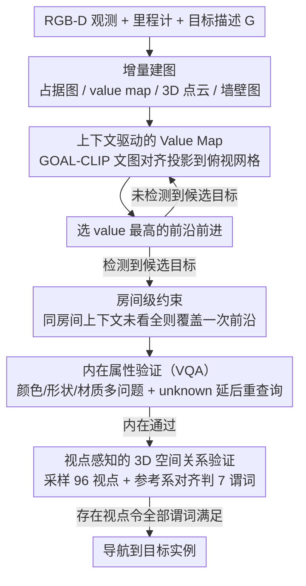

# Context-Nav: Context-Driven Exploration and Viewpoint-Aware 3D Spatial Reasoning for Instance Navigation

**会议**: CVPR 2026  
**arXiv**: [2603.09506](https://arxiv.org/abs/2603.09506)  
**领域**: 3D视觉  
**代码**: 无  
**关键词**: 实例导航, 空间推理, value map, 视点感知, 零样本

## 一句话总结

Context-Nav 将长文本描述的上下文信息从后验验证信号提升为前驱探索先验——通过上下文驱动的 value map 引导前沿选择，并在候选目标处执行视点感知的 3D 空间关系验证，在 InstanceNav 和 CoIN-Bench 上无需任何训练即取得 SOTA。

## 研究背景与动机

**领域现状**：文本目标实例导航（TGIN）要求 agent 根据自由文本描述在 3D 环境中定位特定物体实例，需要区分同类别的不同干扰物。现有方法分三类：RL 训练方法（数据贪婪、分布偏移脆弱）、零样本模块化方法（匹配操作有视角偏差）、交互式方法（依赖人工问答不现实）。

**现有痛点**：所有方法都**低估了文本描述的价值**——大多数系统将长描述简化为物体标签集或结构化表示，只在验证阶段用到局部线索。但描述中的环境上下文（如"在厨房里、靠近楼梯"）是强有力的约束信息，可以大幅缩小搜索空间。

**核心矛盾**：空间关系（如"左边"、"前面"）依赖于观察者的视角，但现有方法要么忽略视角依赖性，要么只使用视角无关的启发式规则来检查空间关系。

**本文目标**：(a) 如何利用完整的上下文描述来引导探索？(b) 如何处理空间关系中的视角歧义？

**切入角度**：将描述中的上下文信息从"匹配后验证"转变为"探索前驱动"——先探索与整个描述语义一致的区域，再用 3D 空间推理做精确验证。

**核心idea**：用 GOAL-CLIP 计算密集文本-图像对齐分数构建 value map 来选择前沿（探索先验），用视点采样+参考系对齐来验证任意空间关系谓词（几何验证）。

## 方法详解

### 整体框架

这篇论文要解决的是文本目标实例导航：agent 拿到一段自由文本描述（如"厨房里靠近楼梯的那把黑色椅子"），要在 3D 环境里走到那个特定实例，而不是随便一把同类椅子。整条 pipeline 围绕一个反转的直觉展开——**把描述里的环境上下文从"找到候选再验证"提前到"驱动该往哪走"**。

具体怎么转：agent 拿到 RGB-D 观测、里程计和目标描述 $G$，一边走一边增量维护四张地图——占据地图、上下文条件化的 value map、实例级 3D 点云地图、以及一张只保留墙壁的地图（用来切分房间）。探索阶段由 value map 决定走向；一旦点云地图里检测到疑似目标，就触发验证流程，先查内在属性（颜色/形状/材质），再查外在属性（与其他物体的空间关系），两关都过才算找到。

### 关键设计

**1. 上下文驱动的 Value Map：把整段描述变成"该往哪走"的空间先验**

现有方法的通病是把一段长描述压成一个物体标签，扔掉了"在厨房、靠近楼梯"这类上下文，等于浪费了最能缩小搜索范围的信息。本文用 GOAL-CLIP（把 CLIP 微调成支持长文本与图像局部对齐的模型）同时编码完整描述 $G$ 和每帧观测 $X_t$，算出逐像素的文图相似度，再借深度和位姿把这些相似度投影到一张俯视网格上，累积成密集的 value map $V_t$。探索时，agent 把所有前沿（已知与未知空间的边界）按 value 排序，直奔 value 最高的那个前沿。之所以要用 GOAL-CLIP 而非原版 CLIP，是因为标准 CLIP 处理长句几乎失效，而 GOAL-CLIP 靠局部图像-句子匹配和 token 级对应传播，能把长文本里的上下文线索落到具体空间位置——换成完整描述驱动的 value map，SR 比只用类别名高出 +6.6。

**2. 房间级约束：别让 agent 在全局最高分前沿和目标房间之间反复横跳**

光看全局 value 排序，agent 可能已经瞥见了目标实例，却因为别处某个前沿分数更高而跑开，来回浪费路程。为此本文额外维护一张"纯墙壁地图"：用 RANSAC 分割出垂直平面、过滤掉家具杂物只留墙体，再用连通分量分析把空间切成房间。当目标实例已被检测到、但它所在房间里还有上下文物体没看全时，就覆盖一次前沿选择，强制去同房间内最近的未探索前沿。这个覆盖只触发一次，之后仍交还给 value map 策略，不打乱整体探索节奏。

**3. 内在属性验证（VQA）：用多问题 + 自适应重查询压住 VLM 的脆弱性**

检测到候选后第一关查内在属性。颜色、形状、材质这类属性靠 VLM 判，但 VLM 对单个提示词很敏感，阴影、遮挡都会让它误判。本文让 LLM 先把描述解析成若干 yes/unknown/no 问题，VLM 对每个问题输出 $s \in \{0,\dots,15\}$ 的置信度分数并离散成三档。遇到"unknown"时不急着下结论，而是延后判断，在随后 5 帧里挑文图相似度最高的那帧重新提问——相当于等到一个看得更清的角度再回答。

**4. 视点感知的 3D 空间关系验证：把"左边"对谁而言这个哲学问题变成可计算的几何验证**

内在属性过关后第二关查外在空间关系。"在椅子左边"这种空间关系本质依赖观察者站在哪，现有方法要么忽略这点、要么只用视角无关的启发式硬判，结果对干扰物束手无策。本文把它拆成四步，核心是穷举观察视点、检验是否存在某个视角让所有关系同时成立。先做房间级过滤，要求目标和参考物体落在同一墙壁分隔的房间内（测地距离 ≤3m）；再以参考物体为锚点采样候选观察者位置，$N_\theta=24$ 个方位角 × 4 个半径 $r \in \{0.8, 1.2, 1.6, 2.0\}$ 组成候选集合 $\mathcal{V}$。对每个候选视点 $v$，构造一个让 $+\hat{x}$ 指向参考物体的局部参考系，偏航角取

$$\psi = \text{atan2}\big((c_r)_y - v_y,\ (c_r)_x - v_x\big)$$

把所有物体中心变换到这个视点对齐坐标系下。最后用 7 个带容差的二元谓词（left/right/front/behind/near/above/below）逐一判定，只要**存在一个视点** $v^* \in \mathcal{V}$ 让描述里所有关系谓词同时满足，就算验证通过。这样视角歧义不再是模糊地带，而是一个"存在可行视角"的可满足性判定。

### 一个完整示例

以"厨房里靠近冰箱、在餐桌左边的黑色椅子"为例走一遍。探索初期，GOAL-CLIP 把整段描述投到 value map 上，厨房方向因为"厨房/冰箱/餐桌"多个线索叠加而整片高亮，agent 直接朝厨房的高 value 前沿走，而不是盲目扫遍每个房间。进到厨房后点云地图里冒出两把黑椅子（候选 2 个），房间级约束发现餐桌还没看全，便覆盖一次前沿、补全同房间观测。接着进入验证：内在属性 VQA 先确认两把都是黑色（都过内在关）；再做视点感知验证——对"在餐桌左边"，围绕餐桌采样 96 个候选视点，椅子 A 存在某个视点让它同时满足"靠近冰箱 + 在餐桌左边"，椅子 B 无论从哪个视点看都进不了餐桌左侧，于是 A 被判为目标，agent 导航过去。整个过程候选从 2 收敛到 1，没有任何训练。

### 损失函数 / 训练策略

整条 pipeline 完全 training-free——value map 构建、空间推理、属性验证都不含任务特定训练。底层移动只复用现成的纯深度 point-goal 策略（在 HM3D 上训练的 Variable Experience Rollout），负责把 agent 安全送到选定前沿。

## 实验关键数据

### 主实验

InstanceNav 和 CoIN-Bench 基准结果：

| 方法 | 是否训练 | InstanceNav SR/SPL | CoIN Val Seen SR/SPL | CoIN Synonyms SR/SPL | CoIN Unseen SR/SPL |
|------|---------|---------|---------|---------|---------|
| PSL (RL训练) | 否 | 26.0/10.2 | 8.8/3.3 | 8.9/2.8 | 4.6/1.4 |
| GOAT (RL训练) | 否 | 17.0/8.8 | 6.6/3.1 | 13.1/6.5 | 0.2/0.1 |
| UniGoal (免训练) | 是 | 20.2/11.4 | 2.8/2.4 | 3.9/3.2 | 2.6/2.2 |
| AIUTA (交互式) | 是 | - | 7.4/2.9 | 14.4/8.0 | 6.7/2.3 |
| **Context-Nav** | **是** | **26.2/9.1** | **13.5/6.7** | **20.3/10.9** | **11.3/5.2** |

### 消融实验

**相似度骨干和提示词消融**（CoIN Val Seen Synonyms）：

| 骨干 | 提示词 | SR ↑ | SPL ↑ |
|------|--------|------|-------|
| BLIP-2 | 仅类别 | 15.9 | 7.3 |
| BLIP-2 | 完整文本 | 16.4 | 9.5 |
| GOAL-CLIP | 仅类别 | 13.7 | 7.6 |
| GOAL-CLIP | 仅内在属性 | 16.7 | 9.7 |
| **GOAL-CLIP** | **完整文本** | **20.3** | **10.9** |

**模块贡献消融**：

| 变体 | SR ↑ | SPL ↑ |
|------|------|-------|
| Full approach | 20.3 | 10.9 |
| 替换为最近前沿 | 10.6 (-9.7) | 4.6 (-6.3) |
| 去掉 VLM 类别验证 | 11.1 (-9.2) | 7.1 (-3.8) |
| 去掉属性验证 | 12.5 (-7.8) | 7.7 (-3.2) |
| 去掉空间关系验证 | 12.0 (-8.3) | 8.4 (-2.5) |

### 关键发现

- **GOAL-CLIP + 完整文本是最强组合**：完整上下文描述比仅类别名 SR 提升 +6.6，说明长文本的上下文信息被有效转化为空间先验。BLIP-2 对长文本的利用效率不如 GOAL-CLIP 的 token 级对齐。
- **每个模块贡献都很大**：去掉 value map 排序（SR -9.7）> 去掉 VLM 类别验证（SR -9.2）> 去掉空间关系验证（SR -8.3）> 去掉属性验证（SR -7.8），说明探索策略是最关键的。
- **免训练超越 RL 训练**：Context-Nav 无需任何 TGIN 特定训练即在 InstanceNav 上 SR 达到 26.2，超过 RL 训练的 PSL (26.0)，这证明了上下文驱动探索+几何推理的范式优势。

## 亮点与洞察

- **上下文从验证信号到探索先验的范式转换**：这是论文最核心的洞察——长文本描述不应只在找到候选后才用来验证，而应从一开始就驱动探索方向。Value map 将整个描述编码为空间概率分布，本质上回答了"我应该去哪里找"。
- **视点感知的空间推理精巧实用**：通过穷举采样观察者视点并检验空间关系谓词的可满足性，将一个哲学问题（"左边"对谁而言？）转化为可计算的几何验证。这个框架可以直接迁移到任何需要理解空间关系的任务。
- **纯墙壁地图的房间分割**：用 RANSAC 分割垂直面并只保留墙壁，避免家具干扰房间划分。简单但有效。

## 局限与展望

- 视点采样是离散的（24 方位 × 4 半径 = 96 个候选），可能遗漏某些合理视点
- 空间关系谓词使用固定容差（$\varepsilon_m=0.15$m, $\varepsilon_\theta=25°$），在不同尺度场景中可能需要自适应调整
- 依赖 GOAL-CLIP 的长文本对齐能力，如果描述非常抽象或隐喻性强，value map 质量会下降
- 计算延迟较高——每帧需要运行开放词汇检测器、SAM 分割、VLM 查询等多个模块
- SPL 指标相对于 SR 偏低（9.1 vs 26.2），说明探索效率还有优化空间

## 相关工作与启发

- **vs UniGoal**: 最接近的免训练 baseline。UniGoal 将描述分解为局部匹配，不利用完整上下文进行探索引导。Context-Nav 在 CoIN Synonyms 上 SR 是 UniGoal 的 5 倍 (20.3 vs 3.9)。
- **vs AIUTA**: 交互式方法，通过向用户提问来消歧。Context-Nav 证明不需要人工交互，仅利用描述本身的上下文就能更好地消歧（20.3 vs 14.4 on Synonyms）。
- **vs PSL**: RL 训练方法，Context-Nav 无需训练却取得相当甚至更高的 SR，展示了模块化几何推理的可扩展性优势。

## 评分

- 新颖性: ⭐⭐⭐⭐⭐ 将上下文从验证信号转为探索先验的范式创新，视点感知空间推理原创性强
- 实验充分度: ⭐⭐⭐⭐⭐ 两个互补基准，全面消融，定性分析充实
- 写作质量: ⭐⭐⭐⭐⭐ 逻辑清晰，插图直观，motivation 论证有力
- 价值: ⭐⭐⭐⭐ 对 embodied AI 的实例导航有重要贡献，但应用场景相对垂直

<!-- RELATED:START -->

## 相关论文

- [\[CVPR 2026\] Deformation-based In-Context Learning for Point Cloud Understanding](deformation-based_in-context_learning_for_point_cloud_understanding.md)
- [\[CVPR 2026\] Featurising Pixels from Dynamic 3D Scenes with Linear In-Context Learners](featurising_pixels_from_dynamic_3d_scenes_with_linear_in-context_learners.md)
- [\[CVPR 2026\] Mamba Learns in Context: Structure-Aware Domain Generalization for Multi-Task Point Cloud Understanding](mamba_learns_in_context_structure-aware_domain_generalization_for_multi-task_poi.md)
- [\[CVPR 2026\] tttLRM: Test-Time Training for Long Context and Autoregressive 3D Reconstruction](tttlrm_test-time_training_for_long_context_and_autoregressive_3d_reconstruction.md)
- [\[CVPR 2026\] Masking Matters: Unlocking the Spatial Reasoning Capabilities of LLMs for 3D Scene-Language Understanding](masking_matters_unlocking_the_spatial_reasoning_capabilities_of_llms_for_3d_scen.md)

<!-- RELATED:END -->
