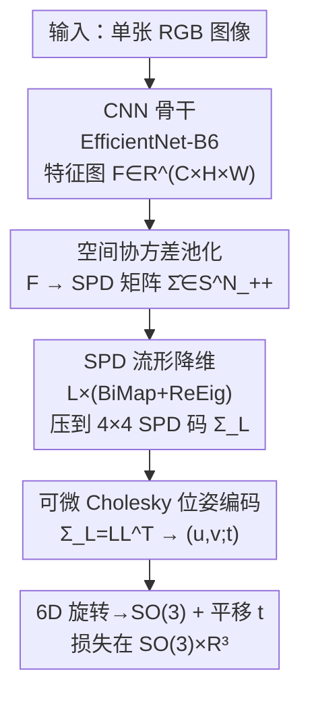

# Cov2Pose: Leveraging Spatial Covariance for Direct Manifold-aware 6-DoF Object Pose Estimation

**会议**: CVPR 2026  
**论文**: [CVF Open Access](https://openaccess.thecvf.com/content/CVPR2026/html/Ousalah_Cov2Pose_Leveraging_Spatial_Covariance_for_Direct_Manifold-aware_6-DoF_Object_Pose_CVPR_2026_paper.html)  
**代码**: 无（论文未提供）  
**领域**: 3D视觉  
**关键词**: 6-DoF位姿估计, 空间协方差, SPD流形, Cholesky分解, 直接位姿回归  

## 一句话总结
针对单张 RGB 图像的 6-DoF 物体位姿估计，本文提出 Cov2Pose：用**空间协方差池化**把骨干特征编码成对称正定（SPD）矩阵以保留二阶统计量，再经流形感知的 BiMap+ReEig 层压缩到紧凑 SPD 码，最后用**可微 Cholesky 分解**把该 SPD 矩阵一一映射成连续 6D 旋转 + 平移，端到端直接回归位姿，在 LM/LM-O/YCB-V 上取得直接回归方法的 SOTA。

## 研究背景与动机
**领域现状**：单张 RGB 估计物体 6-DoF 位姿主要有两条路线。间接法先预测 2D 关键点或稠密 2D–3D 对应，再用 PnP/RANSAC 求解位姿（PVNet、ZebraPose、CheckerPose），精度高但要迭代求解、CAD 渲染或离群点剔除，计算昂贵；直接法（PoseCNN、GDR-Net、EPro-PnP）用一个前向过程直接回归旋转与平移，速度快、适合实时，但精度通常落后于间接法。

**现有痛点**：直接回归头几乎都建立在**一阶统计量**上——把骨干特征做全局平均/最大池化后接 MLP。这一步把特征图拍扁成向量，丢掉了特征通道之间、空间位置之间的**二阶共激活（co-activation）信息**。此外，多数直接法回归的是欧拉角或四元数这类**非连续旋转表示**，在 $SO(3)$ 上存在表示不连续点，使旋转学习不稳定、鲁棒性差。

**核心矛盾**：位姿是一个随视角系统性变化的几何量，而平均/最大池化恰恰抹掉了"哪些空间区域一起变化"这种与视角强相关的信息。作者在 Fig.1 用实验验证了这一点：把图像对按 $SE(3)$ 真值测地距离分桶，桶内**空间协方差的 Log-Euclidean 距离随位姿距离单调增大**，而拍扁特征的余弦距离几乎不变——说明空间协方差比一阶特征更能编码位姿。

**本文目标**：(i) 让特征提取器显式保留二阶统计量；(ii) 让回归头输出连续位姿表示，且整条管线端到端可微。

**切入角度**：二阶池化得到的协方差矩阵天然是 SPD 矩阵，落在 SPD 流形 $\mathcal{S}^n_{++}$ 这个黎曼流形上；既有的 SPD 深度学习模块（BiMap、ReEig）可以在保持 SPD 结构的前提下做降维和非线性。作者把这套原本用于分类的工具首次搬到位姿**回归**上。

**核心 idea**：用"空间协方差（SPD）"代替"全局池化向量"作为位姿特征，并用"可微 Cholesky 分解"把 SPD 矩阵直接解码成连续 6D 旋转 + 平移，从而在直接法框架里同时拿回二阶信息和表示连续性。

## 方法详解

### 整体框架
Cov2Pose 是一条端到端可训练的管线，把"一张 RGB 图 → 一个 6-DoF 位姿"拆成两个复合映射：特征提取 $\Gamma: \mathcal{I}\to\mathcal{S}^n_{++}$ 和位姿解码 $\Psi: \mathcal{S}^n_{++}\to\mathcal{P}$。具体地，CNN 骨干（EfficientNet-B6）抽出特征图 $\mathbf{F}\in\mathbb{R}^{C\times H\times W}$；空间协方差池化把它编码成一个 $N\times N$（$N=H\times W$）的 SPD 矩阵 $\hat{\boldsymbol\Sigma}$；$L$ 层 BiMap+ReEig 在保持 SPD 几何的同时把它逐步压到一个紧凑的 $4\times4$ SPD 码 $\boldsymbol\Sigma_L\in\mathcal{S}^4_{++}$；最后可微 Cholesky 层把 $\boldsymbol\Sigma_L$ 分解成下三角矩阵，从其非零元素中读出 6D 旋转参数 $(\mathbf u,\mathbf v)$ 与平移 $\mathbf t$，经 Gram-Schmidt 正交化得到 $\mathbf R\in SO(3)$，损失在 $SO(3)\times\mathbb{R}^3$ 上计算。

### 关键设计

**1. 空间协方差池化：用二阶统计量代替全局池化向量**

直接回归法把特征图拍扁/平均，丢掉了空间区域之间的协同变化，而这恰恰与视角强相关。本文在骨干后接一个二阶池化层 $\Gamma_2:\mathbb{R}^{C\times H\times W}\to\mathcal{S}^N_{++}$，把 $\mathbf F$ 沿空间维展平成 $\mathbf X=\mathrm{vec}(\mathbf F)\in\mathbb{R}^{C\times N}$（$N=H\times W$），然后跨**通道**估计**空间位置之间**的协方差：

$$\hat{\boldsymbol\Sigma}=\mathrm{CovPool}(\mathbf X)=\frac{1}{C-1}\sum_{i=1}^{C}(\mathbf X_i-\boldsymbol\mu_{\mathbf X})^{\!\top}(\mathbf X_i-\boldsymbol\mu_{\mathbf X})$$

其中 $\mathbf X_i\in\mathbb{R}^N$ 是第 $i$ 个通道展平后的空间响应，$\boldsymbol\mu_{\mathbf X}$ 是通道均值。每个矩阵元 $\hat\Sigma_{jk}$ 度量"空间位置 $j$ 和 $k$ 如何一起变化"。这个量随视角系统性改变，因此比一阶特征更能编码位姿（Fig.1 验证：协方差距离随位姿距离上升，拍扁特征距离几乎不变）。实现中 $H=W=17$，故 $\hat{\boldsymbol\Sigma}$ 是 $289\times289$ 的 SPD 矩阵。

**2. SPD 流形降维：BiMap + ReEig 在保持正定性的前提下压缩协方差**

$289\times289$ 的协方差太大无法直接回归，而它又位于 SPD 流形上——直接套用标准全连接/卷积降维会破坏 SPD 结构（假定特征空间是欧氏的）。本文用 $L$ 层 BiMap（双线性映射）做几何保持的降维：以列正交（落在 Stiefel 流形 $V_n(\mathbb{R}^m)$ 上）的权重 $\mathbf W$ 对协方差做同余变换

$$\mathbf Y=\mathbf W\mathbf X\mathbf W^\top,\qquad \mathbf X\in\mathcal{S}^n_{++},\ \mathbf Y\in\mathcal{S}^m_{++},\ m<n$$

把维度从 $n$ 收到 $m$ 而仍保持 SPD。每层 BiMap 后接一个 ReEig（特征值整流），对特征分解 $\mathbf X=\mathbf U\boldsymbol\Sigma\mathbf U^\top$ 把过小的特征值抬到谱底 $\varepsilon$：$\mathrm{ReEig}_\varepsilon(\mathbf X)=\mathbf U\max(\boldsymbol\Sigma,\varepsilon\mathbf I)\mathbf U^\top$，既引入非线性（类比 ReLU）又防止小模态坍缩、避免奇异。堆叠记为 $\boldsymbol\Sigma_{l+1}=\mathrm{ReEig}_\varepsilon(\mathbf W_l^\top\mathbf X_l\mathbf W_l)$，$\boldsymbol\Sigma_0=\hat{\boldsymbol\Sigma}$，最终得到紧凑的 $\boldsymbol\Sigma_L\in\mathcal{S}^4_{++}$。实现用 4 层 BiMap 交替 4 层 ReEig，$\varepsilon=10^{-4}$。

**3. 可微 Cholesky 位姿编码：把 SPD 码一一映射成连续 6D 旋转 + 平移**

要把 SPD 码解码成位姿，作者需要一个**单射、连续、可微**的映射 $\Psi$，才能既保证一个 SPD 对应唯一位姿、相近 SPD 给相近位姿，又能端到端反传。Cholesky 分解恰好同时满足这三点（唯一、连续、可微），因此本文用它定义 $\Psi$：把 $\boldsymbol\Sigma_L=\mathbf L\mathbf L^\top\in\mathcal{S}^4_{++}$ 分解出下三角 $\mathbf L$，并把位姿参数**结构化地塞进** $\mathbf L$ 的元素里：

$$\mathbf L=\begin{bmatrix} e^{t_x} & 0 & 0 & 0\\ u_1 & e^{t_y} & 0 & 0\\ u_2 & v_1 & e^{t_z} & 0\\ u_3 & v_2 & v_3 & e^{-(t_x+t_y+t_z)} \end{bmatrix}$$

其中 $(\mathbf u,\mathbf v)\in\mathbb{R}^{3\times2}$ 是 6D 旋转表示的两个 3D 向量，$\mathbf t=(t_x,t_y,t_z)$ 是平移。之所以取 $n=4$，是因为要塞下 6（旋转）+ 3（平移）= 9 个自由量，需要一个非零元 $>9$ 的三角矩阵。对角线取指数保证正性（从而 $\mathbf L\mathbf L^\top$ 严格正定），第四个对角元取 $e^{-(t_x+t_y+t_z)}$ 使 $\prod_i L_{ii}=1$，于是 $\det(\boldsymbol\Sigma_L)=\det(\mathbf L)^2=1$——把 SPD 特征值的几何均值归一化为 1 而不损失位姿表达力。解码时从 $\mathbf L$ 读出 $\hat{\mathbf t}=(\log L_{11},\log L_{22},\log L_{33})^\top$、$\hat{\mathbf u}=(L_{21},L_{31},L_{41})^\top$、$\hat{\mathbf v}=(L_{32},L_{42},L_{43})^\top$，再用可微 Gram-Schmidt 把 $(\hat{\mathbf u},\hat{\mathbf v})$ 正交化、叉乘补基底得到 $\hat{\mathbf R}\in SO(3)$。这一映射在 $\mathbf u,\mathbf v$ 共线处之外处处连续，从而拿回了直接法普遍缺失的旋转连续性。

### 损失函数 / 训练策略
总损失在 $SO(3)\times\mathbb{R}^3$ 上计算：旋转用测地距离、平移用 $\ell_2$，再加两个正则项（正交惩罚 $\langle\hat{\mathbf u},\hat{\mathbf v}\rangle\to0$ 与单位范数惩罚防向量坍缩）：

$$\mathcal{L}_{\text{pose}}=\arccos\!\Big(\tfrac{\mathrm{tr}(\hat{\mathbf R}^\top\mathbf R_{\text{gt}})-1}{2}\Big)+\lVert\hat{\mathbf t}-\mathbf t_{\text{gt}}\rVert_2+\lambda\big[\langle\hat{\mathbf u},\hat{\mathbf v}\rangle^2+(\lVert\hat{\mathbf u}\rVert-1)^2+(\lVert\hat{\mathbf v}\rVert-1)^2\big]$$

$\lambda=10^{-3}$。训练用**混合几何优化器**：Stiefel 约束下的 BiMap 权重用黎曼步（梯度投影 + QR 回缩，初始 lr $10^{-2}$），骨干等欧氏参数用 Adam（初始 lr $10^{-4}$），配 ReduceLROnPlateau 调度。骨干为 ImageNet 预训练 EfficientNet-B6，模型 41.4M 参数。

## 实验关键数据

### 主实验
三个 BOP 基准（LM / LM-O / YCB-V），指标 ADD(-S)（模型点平均距离小于直径 10% 判为正确）。Cov2Pose 在直接/端到端方法里全面领先，甚至逼近间接 PnP 法。

| 基准 | 指标 | Cov2Pose | 最佳端到端基线 | 间接 PnP 法 |
|------|------|----------|----------------|-------------|
| LM | ADD(-S) ↑ | **97.2** | DeepIM 88.6 | BPnP 93.27 / EPro-PnP 95.80 |
| LM-O（遮挡）| ADD(-S) ↑ | **76.8** | GDR-Net 62.2 / DeepIM 55.5 | ZebraPose 76.9（仅差 0.1）|
| YCB-V | ADD(-S) ↑ | **69.7**（端到端最佳）| GDR-Net 60.1 | VAPO 84.9 |
| YCB-V | AUC of ADD(-S) ↑ | 82.2 | GDR-Net 84.4 | ZebraPose 85.3 |

在 LM 上甚至以 0.1 超过 PnP 法；在重遮挡的 LM-O 上把端到端 SOTA 从 62.2 拉到 76.8，与最强 PnP 法 ZebraPose 仅差 0.1，说明二阶协方差对遮挡有鲁棒性。YCB-V 上 PnP 法仍整体领先，但 Cov2Pose 把端到端与最佳 PnP 法的差距缩小了 2.3 AUC(ADD-S) / 5.7 AUC(ADD(-S))。

### 消融实验
均在 LM-O 上、ADD(-S) 全类平均。

| 配置 | ADD(-S) ↑ | 说明 |
|------|-----------|------|
| Cov2Pose（完整）| **76.8** | 空间协方差 + SPD 头 + Cholesky |
| (A) 欧氏 MLP 头 | 31.0 | 把 SPD 头换成 2 层 FC 直接回归，几何失配 |
| (B) 通道协方差 | 70.9 | 把空间协方差换成通道协方差 |
| (C) 对数切空间训练 | 72.3 | 丢掉 Cholesky 解码，在 SPD 对数切空间上算 Frobenius 损失 |
| Euler 角（3×3 SPD）| 70.9 | 把 6D+GS 旋转换成非连续欧拉角 |
| 6D+GS（4×4 SPD，本文）| **76.8** | 连续旋转表示 |

### 关键发现
- **SPD 头几何匹配最关键**：把流形感知的 SPD 头换成欧氏 MLP（变体 A），ADD(-S) 从 76.8 暴跌到 31.0——证实"特征位于 SPD 流形 vs 网络假设欧氏空间"的失配是直接回归精度上不去的主因。
- **空间协方差优于通道协方差**：变体 B（70.9）说明保留"空间位置之间"的协同变化比"通道之间"更贴合位姿——因为位姿改变的是空间布局。
- **Cholesky 解码 + $SO(3)$ 损失有效**：变体 C（72.3）说明把损失直接放在 $SO(3)\times\mathbb{R}^3$ 上、而非 SPD 对数切空间，能再拿 4.5 个点。
- **连续旋转表示重要**：6D+GS（76.8）显著高于欧拉角（70.9），印证连续表示利于旋转学习。
- **速度/精度权衡好**：总推理 46.9ms（骨干 22.6ms + 协方差池化 0.5ms + 头 23.8ms），快于 ZebraPose（119.3ms）、DeepIM（77.3ms），在精度相近时显著更快。

## 亮点与洞察
- **把"协方差是 SPD"这件事一路用到底**：从二阶池化产生 SPD，到 BiMap/ReEig 保持 SPD 降维，再到 Cholesky 利用 SPD 的唯一分解解码位姿——整条管线对 SPD 几何自洽，这是它相对"先拍扁再 MLP"的根本区别。
- **Cholesky 当作"结构化容器"**：把 6D 旋转和平移精心塞进三角矩阵的特定位置，并用对角指数 + 末位补偿强制 $\det=1$，既保证正定又保证单射连续可微，是很巧的参数化技巧，可迁移到任何"需要从 SPD/正定矩阵解码连续几何量"的场景。
- **二阶统计对遮挡更鲁棒**：LM-O 上对端到端基线的大幅领先提示，协方差捕捉的全局共激活在局部被遮挡时仍能保留位姿线索。
- **首次把 SPD 深度学习从分类搬到回归**：BiMap/ReEig 过去几乎只用于分类，本文给出了一个回归任务上的成功范式。

## 局限与展望
- **不显式处理物体对称性**（作者承认）：对称物体存在位姿歧义，当前 CAD-free 设定下未建模，监督督信号会自相矛盾；补充材料只给了对称感知的初步 pilot study。
- **仍落后于最强间接法**（⚠️ 限于 YCB-V）：YCB-V 的 AUC 上 PnP 法仍领先，说明纯直接法在大规模、多类别场景仍有差距。
- **依赖较重骨干**：EfficientNet-B6、41.4M 参数、协方差矩阵达 $289\times289$，输出分辨率 $H=W=17$ 直接决定协方差维度，更高分辨率会让 SPD 矩阵急剧变大、降维成本上升（自己发现的可扩展性顾虑）。
- **改进思路**：把对称性以等价类/最近歧义解的方式融入测地损失；探索更轻的骨干或低秩 SPD 表示降低 $N\times N$ 协方差的开销。

## 相关工作与启发
- **vs GDR-Net / EPro-PnP（直接/可微 PnP 法）**：它们仍走"预测中间 2D-3D 几何 + 可微 PnP"，本文完全跳过对应关系，直接从二阶协方差回归位姿，CAD-free 且单前向，在 LM-O 上 76.8 vs GDR-Net 62.2 大幅领先。
- **vs ZebraPose / CheckerPose（间接对应法）**：它们靠稠密 2D-3D 对应 + PnP/RANSAC 迭代，精度高但慢（>110ms）；Cov2Pose 在 LM-O 仅差 0.1 ADD(-S) 而推理快 2 倍多。
- **vs DeepIM / CosyPose（render-and-compare）**：渲染对比法需 3D 模型且迭代优化，本文无需渲染、无需迭代，速度精度权衡更好。
- **vs 既有 SPD 深度学习（BiMap/ReEig 用于分类）**：本文复用同款流形算子，但首次面向位姿**回归**，并新增了从 SPD 到 $SE(3)$ 的可微 Cholesky 解码这一缺失环节。

## 评分
- 新颖性: ⭐⭐⭐⭐⭐ 首个把空间协方差 + SPD 流形学习 + 可微 Cholesky 位姿编码串起来的直接 6-DoF 回归框架，三处都不落俗套。
- 实验充分度: ⭐⭐⭐⭐ 三大基准 + 旋转表示/SPD 头/协方差类型/损失空间多组消融 + 推理时间，较完整；YCB-V 与最强间接法仍有差距、对称性仅 pilot。
- 写作质量: ⭐⭐⭐⭐ 动机由 Fig.1 实验支撑，几何推导清晰；Cholesky 结构化编码部分需要一定 SPD 背景才好读。
- 价值: ⭐⭐⭐⭐ 在实时单物体位姿场景给出速度/精度俱佳的直接法，且 SPD→位姿的可微解码思路可迁移。

<!-- RELATED:START -->

## 相关论文

- [\[CVPR 2026\] ManifoldNeuS: Manifold-aware View Optimizability for Pose-Free Neural Surface Reconstruction](manifoldneus_manifold-aware_view_optimizability_for_pose-free_neural_surface_rec.md)
- [\[CVPR 2026\] Exploring 6D Object Pose Estimation with Deformation](exploring_6d_object_pose_estimation_with_deformation.md)
- [\[CVPR 2026\] ConceptPose: Training-Free Zero-Shot Object Pose Estimation using Concept Vectors](conceptpose_training-free_zero-shot_object_pose_estimation_using_concept_vectors.md)
- [\[CVPR 2026\] SE(3)-Equivariance with Geometric and Topological Guidance for Category-Level Object Pose Estimation](se3-equivariance_with_geometric_and_topological_guidance_for_category-level_obje.md)
- [\[CVPR 2026\] DICArt: Advancing Category-level Articulated Object Pose Estimation in Discrete State-Spaces](dicart_advancing_category-level_articulated_object_pose_estimation_in_discrete_s.md)

<!-- RELATED:END -->
