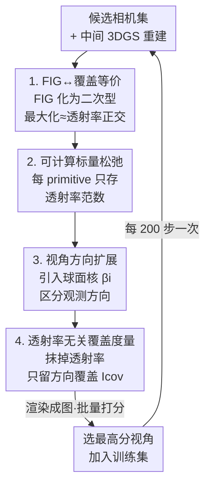

# Coverage Optimization for Camera View Selection

**会议**: CVPR 2026  
**论文**: [CVF Open Access](https://openaccess.thecvf.com/content/CVPR2026/html/Chen_Coverage_Optimization_for_Camera_View_Selection_CVPR_2026_paper.html)  
**代码**: 有（Nerfstudio 包，见项目主页；⚠️ 论文未给 GitHub 直链）  
**领域**: 3D视觉  
**关键词**: 主动视角选择, 辐射场重建, Fisher 信息增益, 几何覆盖, 3D Gaussian Splatting

## 一句话总结
本文从 Fisher 信息增益出发做一系列可解析的近似，证明"选最有信息量的下一视角"在数学上等价于"挑一个看到了被已有相机覆盖最差的几何的视角"，由此得到一个轻量、可视化、无需自定义 CUDA 核的覆盖度量 CONVERGE，在 15 个真实场景上重建质量稳定超过 FisherRF 与随机基线，且单次扫描比 FisherRF 快约 7 倍。

## 研究背景与动机
**领域现状**：辐射场（NeRF / 3DGS）重建质量高度依赖训练视角的质量。主动视角选择（active / next-best-view selection）就是要在重建过程中决定"下一个相机放哪"，让有限的拍摄预算换来最好的几何与外观重建。

**现有痛点**：现有方法分两派。启发式覆盖法简单但常常只比随机采样好一点；信息论法（FisherRF、Bayes' Rays、各种不确定性量化）数学根基扎实，但计算昂贵、依赖训练中快速变化的非平稳量（透射率 transmittance）、对训练噪声敏感，还往往需要自定义 CUDA 核。换句话说，原理派太重、启发派太糙。

**核心矛盾**：信息增益（information gain）和空间覆盖（spatial coverage）在以往工作里被当成两个**互相独立**的目标——要么算昂贵的信息量，要么算粗糙的覆盖，没人证明过它们其实是一回事。

**本文目标**：找一个既有信息论根基、又轻到能实时批量查询的视角选择准则；并把"信息增益"和"几何覆盖"统一在同一套推导里。

**切入角度**：作者注意到人类随手拍的数据集天然覆盖良好——说明存在某种简单规则在指导"好视角"，只是没被数学完整刻画。于是从第一性原理重推 Fisher 信息增益。

**核心 idea**：用一连串可控的近似把 Fisher 信息增益**化简成一个只依赖"每个 primitive 被看到的方向覆盖"的覆盖度量**，从而证明"最大化信息增益 ≈ 优先观测覆盖不足的几何"，并把它实现成一个可渲染成图、可实时批查的标量 metric。

## 方法详解

### 整体框架
CONVERGE 的核心不是一个网络，而是一条**逐步松弛的推导链**：把"加一个新视角能带来多少信息"这个昂贵的量，一步步近似成"这个新视角看到的几何，有多少是已有相机角度上没覆盖到的"。整条链分四步：(1) 把 Fisher 信息增益（FIG）写成关于透射率模式的二次型，证明最大化 FIG ≈ 让新观测的透射率模式与已有模式正交；(2) 把这个需要存整个巨大权重矩阵的目标，松弛成**每个 primitive 只存一个标量**的可计算 metric；(3) 把度量从"只看位置"扩展到"看视角方向"，让它能区分从不同角度看同一块几何；(4) 把噪声大、随训练剧烈变化的透射率项**整体抹掉**，只保留"视角方向覆盖"，得到最终的 transmittance-agnostic 覆盖度量 $I_\text{cov}$。这个 metric 可以像渲染颜色一样渲染成一张图、对所有候选相机批量打分，选出得分最高的视角加入训练集，每 200 步选一次。

### 关键设计

**1. FIG↔覆盖等价：把"信息增益最大"翻译成"透射率模式正交"**

这一步针对的痛点是：信息论方法虽然有根基，却没人说清"信息增益"到底偏好什么样的视角。作者把每个 primitive 的属性回归写成最小二乘 $\min_c \|W^{(K)}c - C\|_2^2$，其中权重矩阵 $W^{(K)}$ 装的是所有像素-primitive 对的透射率（termination probability）。用 Fisher 信息 $F(W)=\log|W^TW|$ 衡量解的确定性，则加一个新观测 $w$ 就是对 Gram 矩阵 $G=W^TW$ 做秩一更新，信息增益由矩阵行列式引理化为

$$\text{FIG}(w;W)=\log|G+ww^T|-\log|G|=\log(1+w^TG^{-1}w).$$

在单位范数假设下，最大化 FIG 等价于 $\arg\max_{\|w\|=1} w^TG^{-1}w = \arg\min_{\|w\|=1} w^TGw$（Rayleigh 商），再进一步等价于 $\arg\min_{w}\|W^{(K)}w\|_2$。这个式子非常可解释：我们希望新视角的透射率模式 $w$ 与所有已观测模式**正交**——也就是去看那些"已有相机没怎么观测过"的几何，从而把这些 primitive 的颜色不确定性压下去。这一步第一次把抽象的信息增益落到了"覆盖"这个直觉上。

**2. 可计算标量松弛：每个 primitive 只存一个范数**

第一步的目标虽美，但 $W^{(K)}$ 的行数等于训练集像素总数、列数等于 primitive 数，还随每次选视角不断增长，根本存不下。作者证明了一个关键松弛恒等式（凸包顶点处取等）：

$$\arg\min_{w\in S^{P-1}_+}\Big\|\sum_i W^{(K)}_{:,i}w_i\Big\|_2 = \arg\min_{w\in S^{P-1}_+}\sum_i w_i\,\|W^{(K)}_{:,i}\|_2,$$

右边只需要**每个 primitive 维护一个累计标量** $\|W^{(K)}_{:,i}\|_2^2$，每来一个新观测就 $+w_i^2$ 增量更新。更妙的是，右边那个"用透射率权重对 per-primitive 标量做线性组合"的形式，恰好就是 radiance 渲染方程的样子。于是 metric $I_\text{trans}(x_0,d)=\sum_i w_i(x_0,d)\|W^{(K)}_{:,i}\|_2$ 可以**像渲染颜色一样只在渲染管线里多接一个通道**算出来，还能渲染成图供人查看。计算和存储都从"整个矩阵"降到"每个高斯一个数"。

**3. 视角方向扩展：让覆盖度量分得清"从哪个角度看"**

前两步是视角方向无关的，只适合 matte 颜色或纯位置属性；但真实重建里同一块几何从不同方向看颜色不同，覆盖也该按方向算。作者给每个 primitive 假设一个视角相关颜色模型 $c_i(d)=\beta_i(d)r_i$，其中 $\beta_i\in S^{L-1}_+$ 是球面上一组 patch 的权重（由以 $d$ 为中心、随角度衰减的球面径向核决定），$r_i$ 是这些 patch 对应的颜色场。把颜色回归扩成颜色场回归，新设计矩阵 $\tilde W^{(K)}=W\cdot\text{blkdiag}(\beta_1,\dots,\beta_P)$，第二步的标量松弛可直接套用，得到视角相关的 metric

$$I_\text{view}(x_0,d)=\sum_i w_i(x_0,d)\sum_\ell \beta_i^\ell(d)\,\|[\tilde W^{(K)}]_i^\ell\|_2.$$

这样覆盖就不只看"这个 primitive 被看过没"，还看"被从哪些方向看过"，更贴近辐射场对视角依赖外观的需求。

**4. 透射率无关覆盖度量（CONVERGE）：抹掉噪声透射率，只留方向覆盖 + 探索/利用开关**

作者发现直接用前面带透射率的 metric 仍有两大隐患：透射率项算起来昂贵、且在训练中随高斯互相遮挡剧烈抖动，把度量和 3DGS 参数绑太死反而拖累重建（因为 3DGS 只是真实几何的代理）。于是这一步**把透射率影响整体抽象掉**：凡落在某相机视锥内的 primitive 权重一律视为相等（视锥外仍为 0）。在球面高斯核 $\beta(d;\mu,\kappa)=C\exp(\kappa d\cdot\mu)$ 下，训练相机方向 $d^i_c$ 与候选相机方向 $d^i_\text{test}$ 的耦合项 $\alpha^i_c=\beta_i(d^i_c)\cdot\beta_i^\text{test}$ 经一阶 Taylor 展开正比于 $1+d^i_c\cdot d^i_\text{test}$，最终得到覆盖度量

$$I_\text{cov}(x_0,d)=\sum_i w_i(x_0,d)\,\frac{1+\max_c d^i_c\cdot d}{2}.$$

直觉上，它偏爱**对自己看到的每个高斯，视角方向都与所有已有训练视角"夹角大"**的相机——也就是去补几何上从没被这样看过的角度。实现上不必存每个高斯的所有训练方向，只需在单位球上存一个离散布尔网格：哪个方向来过相机就把对应格子置 1，查询时把候选方向点乘所有网格方向、用布尔 mask 后取 max。此外，借助 metric 有界（$I_\text{cov}\in[0,1]$）这一点，可以用一个背景项 $b\in\{0,1\}$ 做 alpha 合成来自由偏向探索或利用：$b=1$ 奖励前景遮挡（偏利用），$b=0$ 惩罚之（偏探索）；实现里用混合策略——在非零 alpha mask 内平均、背景取 $b=0$，避免把视角浪费在天空等空区域。

### 损失函数 / 训练策略
方法本身不引入新损失，重建仍用标准 3DGS / NeRF 目标。流程上：场景初始用 10 个视角播种，之后每 200 个梯度步用 $I_\text{cov}$ 对候选池打分选 1 个新视角加入训练集、并从候选池移除，到 30K 步终止。全部在 Nerfstudio 框架内实现，不需要 Nerfstudio 与 gsplat 之外的任何自定义 CUDA 核。

## 实验关键数据

### 主实验
15 个真实场景（Tanks & Temples 3 个 + 全套 Mip-NeRF360 + 3 个手机自采），固定数据集下做 next-best-view，对比 Bayes' Rays、FisherRF、Random 与一个能看全量图的不可行 oracle 上界。30K 步图像指标（总体）：

| 方法 | PSNR↑ | SSIM↑ | LPIPS↓ |
|------|-------|-------|--------|
| Bayes' Rays | 15.75 | 0.38 | 0.69 |
| FisherRF | 21.04 | 0.68 | 0.25 |
| Random | 21.80 | 0.70 | 0.21 |
| **CONVERGE (本文)** | **22.12** | **0.71** | **0.20** |

值得注意的是 Random 在固定数据集上意外地强——因为人类自采数据天然覆盖好、随机也能继承这种分布偏置；FisherRF 反而明显落后随机。CONVERGE 在所有可行方法中最优，在 bonsai / counter 等场景仅用一半数据就逼近 oracle。

### 消融实验
两种更苛刻的设定：Sparse（仅 1 个初始视角）、Embodied（用迭代 kNN, K=5 模拟机器人连续部署、不能瞬移），30K 步全场景平均：

| 设定 | 方法 | PSNR↑ | SSIM↑ | LPIPS↓ |
|------|------|-------|-------|--------|
| All（上界） | Splatfacto | 24.83 | 0.79 | 0.16 |
| Embodied | Random | 22.48 | 0.71 | 0.23 |
| Embodied | FisherRF | 22.27 | 0.70 | 0.24 |
| Embodied | **CONVERGE** | **23.21** | **0.73** | **0.20** |
| Sparse | Random | 22.81 | 0.72 | 0.21 |
| Sparse | **CONVERGE** | 22.80 | 0.71 | 0.21 |
| Embodied+Sparse | Random | 20.89 | 0.65 | 0.32 |
| Embodied+Sparse | **CONVERGE** | **22.39** | **0.70** | **0.24** |

### 关键发现
- **场景越受限，CONVERGE 优势越大**：固定数据集上仅小胜随机（+0.32 PSNR），但 Embodied 设定下拉开差距，Embodied+Sparse 组合下领先随机约 1.5 PSNR——说明它真正适合机器人野外采集这类"不能瞬移、初始视角稀疏"的现实场景。
- **稀疏初始化是软肋**：仅 1 个初始视角时 CONVERGE 与随机持平（22.80 vs 22.81），因为早期几何/高斯位置不准会让覆盖排序失真。
- **计算效率碾压信息论基线**：扫一遍 >300 张图选最优视角平均仅 3.5 秒，FisherRF 需 23.9 秒、Bayes' Rays 需 37.1 秒；固定时间预算下 CONVERGE 能处理多得多的候选，选出的视角更优。
- 把透射率项保留（Table 9，⚠️ 正文未给具体数值）反而不如抹掉它稳定，印证"度量与 3DGS 参数绑太死有害"的判断。

## 亮点与洞察
- **把"信息增益"和"几何覆盖"在数学上焊死成一个目标**：以往这俩是两条路线，本文用 FIG 的二次型 + 正交性论证证明覆盖是信息增益的主导因子，给一直被当"糙启发"的覆盖法补上了理论后腰。
- **metric 可渲染成图**：因为最终形式与渲染方程同构，覆盖度量能像颜色一样 splat 成一张图，既能批量实时打分又能让人肉眼看出"哪块没覆盖好"，可解释性极强。
- **有界性换来探索/利用开关**：$I_\text{cov}\in[0,1]$ 让一个简单的背景项 $b$ 就能在 alpha 合成里调节偏探索还是偏利用，这种"免费"的旋钮很适合迁移到机器人主动建图。
- 整条"昂贵量 → 逐步松弛 → 每高斯一标量"的推导范式，可复用到其他"想要信息论目标但算不动"的主动感知任务。

## 局限与展望
- 作者承认：覆盖代理是 FIG 的下界、丢掉了透射率信息，在极端杂乱、透射率确实携带额外信息的场景可能不可靠（虽常用数据集未观察到）。
- **光照无关**：只看几何覆盖与累计可见性，不建模 shading / 光照方向 / 复杂 BRDF，对时变光照或强外观变化场景的视角选择可能次优。
- **依赖中间重建质量**：需要一个还算准的中间重建来估 per-primitive 可见性；极稀疏初始下早期几何不准会拖垮排序（实验里此时仅与随机持平）。
- Embodied 是仿真的，真实机器人受限轨迹上的在线规划、以及向更多辐射场骨干的扩展尚待验证。

## 相关工作与启发
- **vs FisherRF**: 同样源自 Fisher 信息，但 FisherRF 直接算候选位姿的 Fisher 信息、依赖梯度信息与透射率、慢且需自定义核；本文把它松弛成无透射率的覆盖度量，快约 7 倍且重建更好。
- **vs Bayes' Rays / 不确定性法**: 这些做事后不确定性估计来引导采视角，计算重且继承 NeRF↔3DGS 的性能差；本文直接用几何覆盖、与 3DGS 管线无缝且实时。
- **vs 纯覆盖启发（如 Xiao et al. 的均匀覆盖）**: 那些经验上发现"均匀覆盖胜过复杂不确定性"但缺理论；本文给覆盖法补上了"它就是 FIG 的近似"这一数学解释，把经验上升为原理。

## 评分
- 新颖性: ⭐⭐⭐⭐☆ 首次从 Fisher 信息严谨推出"信息增益≈几何覆盖"的等价，统一了两条历来分立的路线。
- 实验充分度: ⭐⭐⭐⭐☆ 15 真实场景 + 固定/稀疏/具身三设定 + 算时对比，但缺更多骨干与真实机器人验证。
- 写作质量: ⭐⭐⭐⭐☆ 推导四步层层递进、动机清晰，metric 可视化讲解直观。
- 价值: ⭐⭐⭐⭐☆ 轻量、即插即用、实时，对机器人主动建图实用性强。

<!-- RELATED:START -->

## 相关论文

- [\[CVPR 2026\] PRIMU: Uncertainty Estimation for Novel Views in Gaussian Splatting from Primitive-Based Representations of Error and Coverage](primu_uncertainty_estimation_for_novel_views_in_gaussian_splatting_from_primitiv.md)
- [\[CVPR 2026\] Intrinsic Geometry-Appearance Consistency Optimization for Sparse-View Gaussian Splatting](intrinsic_geometry-appearance_consistency_optimization_for_sparse-view_gaussian_.md)
- [\[CVPR 2026\] DirectFisheye-GS: Enabling Native Fisheye Input in Gaussian Splatting with Cross-View Joint Optimization](directfisheye-gs_enabling_native_fisheye_input_in_gaussian_splatting_with_cross-.md)
- [\[ECCV 2024\] View Selection for 3D Captioning via Diffusion Ranking](../../ECCV2024/3d_vision/view_selection_for_3d_captioning_via_diffusion_ranking.md)
- [\[CVPR 2026\] 4C4D: 4 Camera 4D Gaussian Splatting](4c4d_4_camera_4d_gaussian_splatting.md)

<!-- RELATED:END -->
