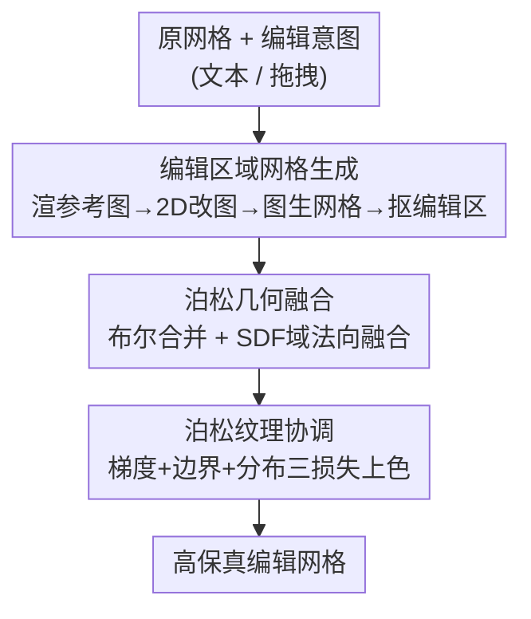

# CraftMesh: High-Fidelity Generative Mesh Manipulation via Poisson Seamless Fusion

**会议**: CVPR 2026  
**论文**: [CVF Open Access](https://openaccess.thecvf.com/content/CVPR2026/html/Hu_CraftMesh_High-Fidelity_Generative_Mesh_Manipulation_via_Poisson_Seamless_Fusion_CVPR_2026_paper.html)  
**代码**: 项目页 https://jameshu.org/CraftMesh （未见开源代码）  
**领域**: 3D视觉  
**关键词**: 网格编辑, 生成式3D, 泊松无缝融合, SDF表示, 纹理协调  

## 一句话总结
CraftMesh 把高保真网格编辑拆成"2D 图像编辑 → 图生网格 → 无缝融合"三段式流程，并在 SDF 域用泊松法向融合（几何）+ 泊松纹理协调（颜色）把生成的编辑区域无痕缝合进原网格，在复杂插入/删除/局部编辑任务上全面超越 SDS 类与多视图扩散类基线。

## 研究背景与动机
**领域现状**：3D 生成模型（Hunyuan3D、Trellis、Clay 等）已能从文本/图像产出高质量网格，但"可控的 3D 编辑"仍是开放问题——现有生成框架擅长从头重建，却很难对已有模型做局部、精细的修改。Mesh（显式三角网格）是专业 3D 流水线里最主流的表示，可针对它的生成式编辑研究却远少于神经场编辑。

**现有痛点**：现有生成式网格编辑分两派，各有硬伤。SDS 类（FocalDreamer、MagicClay）用 Score Distillation 优化几何，结构保持得还行，但缺多视图一致性，结果常过度简化或扭曲；MVD 类（Instant3dit、MVEdit、CMD）先合成多视图编辑再重建，却保不住原模型的几何与纹理。两者在复杂模型上都做不出高保真编辑。

**核心矛盾**：编辑要同时满足两个互相拉扯的目标——既要在编辑区域生成丰富细节（这需要强生成先验），又要让生成内容和原网格在几何边界与纹理上无缝衔接、不破坏无关部位。经典的 Poisson Mesh Editing 想解决缝合，但它在坐标域求解，要求两网格顶点一一对应（不现实），且边界处梯度不连续会产生伪影；直接在 3D 体素空间解泊松方程又是 $O(n^3)$ 复杂度，太贵。

**本文目标**：做一个能对复杂网格做插入/删除/局部编辑、同时保住原几何与纹理连通性的高保真编辑框架。

**切入角度**：与其硬训一个端到端 3D 编辑器，不如"分工"——让成熟的 2D 图像编辑模型负责"改什么"、让图生网格模型负责"造细节"，框架自己只解决最难的"怎么无缝缝合"。

**核心 idea**：把编辑重构成生成过程——先在渲染图上做 2D 编辑，再图生网格得到"编辑区域网格"，最后用 SDF 域的泊松无缝融合（几何 + 纹理）把它缝进原网格。

## 方法详解

### 整体框架
CraftMesh 的输入是一个原始网格 + 用户编辑意图（文本或拖拽箭头），输出是一个把编辑无痕融入的高保真网格。整条流水线分三段：① **编辑区域网格生成**——从原网格渲染参考图，用 2D 图像编辑模型（FLUX Kontext）按意图改图，再用图生网格模型（MeshyAI / Hunyuan3D / Trellis）把编辑后的图升成 3D，抠出编辑区域得到"编辑区域网格"$M_r$；② **泊松几何融合**——先对原网格 $M_o$ 与 $M_r$ 做布尔运算得到初始合并网格，再在 SDF/Mesh 混合表示上用泊松法向融合优化边界过渡；③ **泊松纹理协调**——给新生成几何补上与原网格调性一致、边界无缝的颜色。其中第②③段合称 **Geometry and Texture Fusion**，是本文真正的技术核心。

一个关键设计选择是：几何与纹理都在 SDF 域而非直接在离散网格上优化。神经 SDF 提供鲁棒收敛、可微渲染、解析梯度和天然连续性，让泊松融合能在隐式域里同时、相干地处理几何与纹理。

### 关键设计

**1. 图像编辑—网格生成—无缝融合三段式流水线：把"改什么"外包给成熟 2D/3D 模型**

针对"端到端 3D 编辑器既难训又做不出细节"的痛点，CraftMesh 不自己学编辑语义，而是借力分工。具体地：从原网格渲染出参考图，用户用任意 2D 图像编辑后端（FLUX Kontext、Qwen-Image、Gemini、甚至设计软件）按意图改图——这一步天然给了"哪里改、改成什么样"的控制，不需要像 FocalDreamer/MagicClay/Instant3dit 那样在 3D 里手工指定编辑位置；接着用 image-to-mesh 模型把编辑后的参考图升成"编辑参考网格"$M_e$，从中抠出编辑区域得到编辑区域网格 $M_r$。可选地，还能对编辑参考图再做一次抠图，单独喂给图生网格模型以更高保真地生成 $M_r$。这样做的价值是：把编辑可控性交给 2D 模型（用户友好、轻量），把细节生成交给 3D 模型（结构保真），框架本身只需专注最难的缝合，且对具体编辑/生成后端是 model-agnostic 的，换更强的模型即可涨点。

**2. 泊松几何融合：在 SDF 域用泊松法向混合消除布尔缝合的边界裂缝**

直接把 $M_o$ 与 $M_r$ 布尔合并（插入用 union、删除用 difference）会在过渡边界留下几何不连续。CraftMesh 先在交界处提取需要修复的区域：布尔运算产生交集顶点集 $V_{in}$，据此从合并网格 $M_t$ 与对齐后的编辑参考网格 $M_e$ 各取出邻域 $M_t^{in},\,M_e^{in}$（满足 $\min_{u\in V_{in}}\|u-v\|_2<\epsilon_0$），再取更小的优化子集 $M_t^{opt}$（阈值 $\epsilon_1<\epsilon_0$），把注意力集中在"刺眼的过渡带"。

修复不直接动网格顶点，而是优化一个与网格绑定的神经 SDF $S_t$——SDF 的变化通过移动顶点、分裂三角形、塌陷边传播到网格，区域外顶点冻结。核心机制是法向引导：渲染出 $M_t^{in}$ 的法向 $n_t$、SDF 渲染法向 $\hat n_t$、$M_e^{in}$ 的法向 $n_e$ 和优化掩码 $mask^{opt}$，用经典泊松图像编辑算子 $\Gamma(\cdot)$ 把两者混成目标法向 $n_p=\Gamma(n_t,n_e,mask^{opt})$——掩码内保留 $n_e$ 的细节、沿边界平滑过渡到 $n_t$。优化目标就是让 SDF 渲出的法向逼近这张混合法向：

$$\mathcal{L}_{\text{poisson}}=\sum_i\|\hat n_t^i-n_p^i\|_F^2$$

其中 $i$ 索引不同相机视角。妙处有二：一是把泊松方程从 3D 体素（$O(n^3)$）搬到 2D 法向图上解，复杂度降到 $O(kn^2)$，效率大涨而保真度相当；二是各视角的混合法向虽不严格多视图一致，但隐式 SDF 会自动把不一致"抹平"成一个相干的过渡几何。几何总损失再叠加平滑项与 Eikonal 约束：$\mathcal{L}_{\text{geo}}=\mathcal{L}_{\text{poisson}}+\lambda_1\mathcal{L}_{\text{smooth}}+\lambda_2\mathcal{L}_{\text{eik}}$。

**3. 泊松纹理协调：用梯度—边界—分布三损失让新区域颜色与原网格无缝同调**

融合后的新几何 $M_t^{new}$ 没有纹理，直接用纹理生成模型上色会出现色偏和边界断裂。CraftMesh 在隐式神经色场上设计了三项损失协同。其一 **梯度传播**：先冻存一份原始色场梯度做参考，约束当前色场梯度与之一致以保住高频纹理细节——$\mathcal{L}_{\text{grad}}=\text{MSE}\big(\sigma(\nabla C_{new}/\gamma),\,\sigma(\nabla C_{new}^{ori}/\gamma)\big)$，$\sigma$ 为 sigmoid、$\gamma$ 为梯度缩放常数。其二 **平滑过渡**：用距离加权的软边界损失抑制接缝，$\mathcal{L}_{\text{boundary}}=\sum_{p_i^{new}}w_i\|C_{new}(p_i^{new})-C_{pr}(p_i^{pr})\|_2^2$，其中 $p_i^{pr}$ 是保留几何上离 $p_i^{new}$ 最近的点，权重 $w_i=(1-\delta/\|p_i^{new}-p_i^{pr}\|_2)^2$ 随距离衰减，$\delta$ 控制有效边界宽度。

前两项本质就是泊松图像编辑的搬运，但作者发现纹理里的重复花纹会干扰梯度域颜色传播、导致颜色归一化失败（出现不协调色调）。于是加入第三项 **分布感知颜色对齐**：把新区域 $M_t^{new}$ 与保留区域 $M_t^{pr}$ 的颜色看作 RGB 空间的概率密度，用核密度估计 $\rho(q)=\frac{1}{N}\sum_i\exp(-\|q-r_i\|^2/2\sigma^2)$ 估出 $\rho^{new},\rho^{pr}$，再最小化二者差异 $\mathcal{L}_{\text{distribution}}=\frac{1}{N}\sum_i\|\rho^{new}(q_i)-\rho^{pr}(q_i)\|_2$，强制两侧颜色分布一致。纹理总损失 $\mathcal{L}_{\text{tex}}=\mathcal{L}_{\text{distribution}}+\theta_1\mathcal{L}_{\text{grad}}+\theta_2\mathcal{L}_{\text{boundary}}$。值得一提的是，这套公式不止能处理 albedo，还直接支持 PBR 材质。

### 损失函数 / 训练策略
几何与纹理两阶段分别优化：几何融合 $\mathcal{L}_{\text{geo}}$ 在单张 4090 上 1000 步约 5 分钟；纹理协调 $\mathcal{L}_{\text{tex}}$ 2000 步约 1 分钟。骨干沿用 MagicClay 的混合 SDF–Mesh 表示与隐式神经色场；2D 编辑用 FLUX Kontext、图生网格用 MeshyAI，但框架对这些组件 model-agnostic。

## 实验关键数据

### 主实验
评测集为 100 个复杂 3D 模型（取自 Objaverse-XL、Google Scanned Objects 与网络），每个配 3 条编辑指令，覆盖插入、删除、局部编辑。指标用 CLIPsim（编辑网格渲染图与目标文本的语义对齐）、CLIPdir（原图→编辑图的方向性 CLIP 相似度，衡量编辑有效性），以及无参考质量指标 NIQE（越低越好）、NIMA（越高越好）。

| 方法 | CLIPsim ↑ | CLIPdir ↑ | NIQE ↓ | NIMA ↑ |
|------|-----------|-----------|--------|--------|
| FocalDreamer (SDS) | 13.010 | 3.927 | 12.340 | 5.234 |
| MagicClay (SDS) | 15.043 | 5.994 | 7.344 | 5.334 |
| Instant3dit (MVD) | 14.108 | 4.326 | 7.390 | 5.288 |
| VoxHammer (Latent) | 17.366 | 10.482 | 8.291 | 5.307 |
| **Ours (MeshyAI)** | **20.801** | **18.479** | **4.710** | **5.928** |

CraftMesh 在全部 4 个指标上都是最好。最显著的是 CLIPdir 几乎翻倍（18.48 vs. 次优 10.48），说明编辑"方向"远更贴合意图；NIQE 也从基线最好 7.34 降到 4.71，感知质量大幅领先。定性上，基线在复杂任务（给鹿加翅膀、删火山、给狐狸九条尾巴）上做出粗糙几何、平淡且不一致的颜色，CraftMesh 则给出和谐结构、丰富细节与高保真颜色——例如删火山任务，MagicClay 留下畸形岩石、Instant3dit 替成草地还改坏了原网格，CraftMesh 则用与邻域相似的岩石无缝填补。

### 消融实验
基线为"仅对原网格与编辑区域网格做布尔运算"。

| 配置 | CLIPsim ↑ | CLIPdir ↑ | NIQE ↓ | NIMA ↑ |
|------|-----------|-----------|--------|--------|
| Baseline（仅布尔） | 17.723 | 10.348 | 5.802 | 5.073 |
| + 几何融合 | 20.502 | 11.979 | 5.774 | 5.290 |
| + 纹理协调 | 19.399 | 10.724 | 5.290 | 5.184 |
| Ours (Hunyuan3D 2.5) | 19.903 | 18.622 | 6.108 | 5.749 |
| Ours (Trellis) | 19.166 | 18.911 | 6.246 | 5.989 |
| **Ours (MeshyAI)** | **20.801** | 18.479 | **4.710** | 5.928 |

几何融合与纹理协调单独加都比基线涨，二者合起来最好。三个生成后端（Hunyuan3D 2.5 / Trellis / MeshyAI）下结果都稳定达到 SOTA 水平，证明涨点来自融合流水线本身而非某个特定生成骨干。纹理损失的逐项消融也佐证各项必要：去掉分布损失出现色调不协调、去掉梯度损失颜色变糊、去掉边界损失出现可见纹理断裂。

### 关键发现
- CLIPdir 从"加任一模块"的 ~12 跳到完整模型的 ~18.5，说明这一大跨步主要来自几何+纹理两阶段协同 + 完整三段式流水线，而非单个模块。
- 框架对生成后端不敏感（换 3 个图生网格模型都 SOTA），说明价值在"怎么缝"而非"谁来生成"，未来可随更强生成模型免费涨点。
- 框架可自然扩展到拖拽编辑：用 LightningDrag 做拖拽式图像编辑，再走"删除对应区域 → 用拖拽生成的编辑区域网格做插入"，即可实现开天使翅膀、抬猫爪等精细几何操控。

## 亮点与洞察
- **把 3D 编辑的难点降维到 2D 解泊松**：法向融合放到 2D 法向图上做，复杂度从 $O(n^3)$ 降到 $O(kn^2)$，还顺手用隐式 SDF 把多视图不一致抹平——"降维 + 隐式收敛"两手棋很巧。
- **分布感知颜色对齐补了泊松的短板**：作者点出纹理重复花纹会让经典泊松梯度传播失效，用 KDE 估计 RGB 分布再对齐，是对"梯度域颜色迁移"失败模式的精准补丁，可迁移到任何纹理/图像无缝拼接任务。
- **model-agnostic 的分工范式**：把"改什么/造细节/怎么缝"三件事解耦，编辑可控性、生成质量、缝合保真各由最擅长的模块负责，是一种很实用、可随上游模型迭代的工程哲学。

## 局限与展望
- 作者承认：框架依赖现成 2D/3D 生成模型，因而继承它们的局限——面对开放曲面、多层、含噪声的复杂网格时，保真度会受上游模型拖累。
- ⚠️ 评测仅用 CLIP 系 + 无参考质量指标，且评测集（100 模型 × 3 指令）规模有限、部分取自"internet"来源不完全可复现；缺少几何精度的硬指标（如 Chamfer/法向误差）与用户研究，纯感知指标对"几何是否真无缝"的刻画偏弱。
- 改进方向：上游换更强生成模型可直接涨点；对开放/带噪网格可探索更鲁棒的布尔与对齐前处理。

## 相关工作与启发
- **vs SDS 类（FocalDreamer / MagicClay）**：它们用 SDS 损失优化几何，结构保持尚可但缺多视图一致性、细节简化；CraftMesh 借 2D+3D 生成模型造细节、再泊松缝合，几何与纹理保真都更高，且无需在 3D 手工指定编辑位置。
- **vs MVD 类（Instant3dit / MVEdit / CMD）**：它们合成多视图编辑再重建，常保不住原模型几何纹理；CraftMesh 只生成"编辑区域"并无缝融入原网格，最大限度保留无关部位。
- **vs 经典 Poisson Mesh Editing / SeamlessNeRF / Gaussian Stitching**：经典网格泊松在坐标域求解、要顶点一一对应且边界梯度不连续；SeamlessNeRF/GaussianStitching 只能融合辐射场/高斯而非显式网格。CraftMesh 在 SDF 梯度域同时处理几何与纹理，专为显式网格设计。

## 评分
- 新颖性: ⭐⭐⭐⭐ 把"2D 编辑 + 图生网格 + SDF 域泊松融合"组装成一套针对显式网格的高保真编辑范式，分布感知颜色对齐是实打实的新补丁
- 实验充分度: ⭐⭐⭐ 多基线 + 多后端消融较完整，但评测集偏小、只用 CLIP/无参考指标、缺几何硬指标与用户研究
- 写作质量: ⭐⭐⭐⭐ 流水线与三损失讲得清晰，公式与图示到位
- 价值: ⭐⭐⭐⭐ 网格编辑是专业 3D 流水线刚需，model-agnostic 设计实用且能随上游模型迭代涨点

<!-- RELATED:START -->

## 相关论文

- [\[CVPR 2026\] TopoMesh: High-Fidelity Mesh Autoencoding via Topological Unification](topomesh_high-fidelity_mesh_autoencoding_via_topological_unification.md)
- [\[CVPR 2026\] HyperGaussians: High-Dimensional Gaussian Splatting for High-Fidelity Animatable Face Avatars](hypergaussians_high-dimensional_gaussian_splatting_for_high-fidelity_animatable_.md)
- [\[CVPR 2026\] High-Fidelity Mobile Avatars with Pruned Local Blendshapes](high-fidelity_mobile_avatars_with_pruned_local_blendshapes.md)
- [\[CVPR 2026\] Depth Peeling for High-Fidelity Gaussian-Enhanced Surfel Rendering](depth_peeling_for_high-fidelity_gaussian-enhanced_surfel_rendering.md)
- [\[CVPR 2026\] CustomTex: High-fidelity Indoor Scene Texturing via Multi-Reference Customization](customtex_high-fidelity_indoor_scene_texturing_via_multi-reference_customization.md)

<!-- RELATED:END -->
