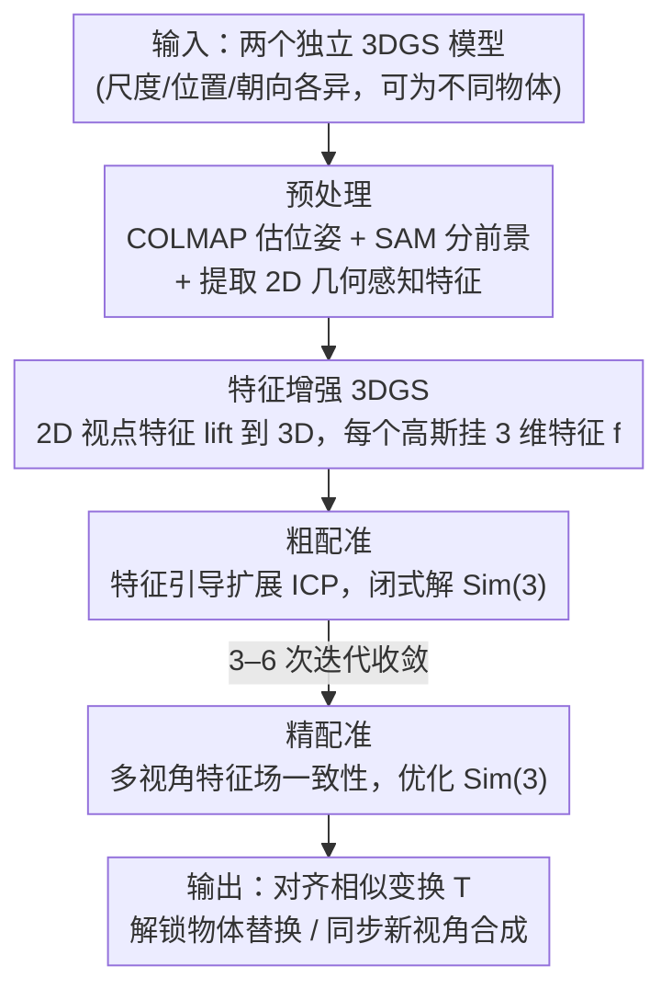

# Cross-Instance Gaussian Splatting Registration via Geometry-Aware Feature-Guided Alignment

**会议**: CVPR 2026  
**arXiv**: [2603.21936](https://arxiv.org/abs/2603.21936)  
**代码**: [https://bgu-cs-vil.github.io/GSA-project](https://bgu-cs-vil.github.io/GSA-project)  
**领域**: 3D 视觉 / 3D 配准  
**关键词**: 3D Gaussian Splatting, 跨实例配准, 相似变换, 几何感知特征, 逆辐射场

## 一句话总结
提出 GSA（Gaussian Splatting Alignment），首个实现跨实例类别级 3DGS 模型配准的方法，通过几何感知特征引导的粗配准（扩展 ICP 求解相似变换）和多视角特征一致性的精配准，在同物体和跨物体场景下均大幅超越现有方法。

## 研究背景与动机

**领域现状**：3D Gaussian Splatting（3DGS）已成为高保真新视角合成的强力表示。但对齐两个独立 3DGS 模型是一个开放挑战，现有方法如 GaussReg 依赖 ICP，仅能处理同一物体模型的配准。

**现有痛点**：(1) ICP 在初始化差（如 180° 旋转）时失败；(2) ICP 无法处理未知尺度，需要给定真实尺度；(3) 跨实例（不同物体）配准时几何差异导致最近点匹配收敛到错误对应关系。

**核心矛盾**：3DGS 模型由 SfM 生成，天然存在任意尺度、位置和朝向差异；不同物体还有形状和外观差异，使得传统几何方法完全失效。

**本文要解决**：如何在未知尺度下，将两个可能是不同物体（但同类别）的 3DGS 模型做相似变换（旋转+平移+缩放）对齐？

**切入角度**：(1) 用几何感知的视点引导特征替代纯几何信号做对应关系建立；(2) 将逆辐射场框架从单视角相机位姿估计推广到多视角场域-场域配准。

**核心 idea**：几何感知语义特征引导的扩展 ICP + 多视角特征场一致性优化 = 鲁棒的跨实例 3DGS 配准。

## 方法详解

### 整体框架
输入是两个独立训练、尺度/位置/朝向各异（甚至属于不同物体）的 3DGS 模型，目标是解出对齐二者的相似变换。流水线在常规预处理之外有三个核心阶段：**预处理**用 COLMAP 估计相机位姿、SAM 分割前景、并用 Mariotti 等人的方法提取 2D 几何感知特征；随后 (1) **特征增强 3DGS** 把这些 2D 特征 lift 到 3D、给每个高斯挂一个特征，让后续配准不再只靠几何；(2) **粗配准** 用特征引导的迭代绝对定向求解器估计 Sim(3) 相似变换；(3) **精配准** 用多视角特征场一致性优化进一步降低残差。

### 关键设计

**1. 特征增强 3DGS（Feature-augmented 3DGS）：给每个高斯挂一个几何感知特征，让配准不再只靠几何**

跨实例配准失效的根源是：不同物体几何形状不同，纯靠空间最近点找对应关系必然错。GSA 的第一步就是把语义信号嵌进 3DGS——为每个 Gaussian 额外学一个 3 维特征 $\mathbf{f} \in \mathbb{R}^3$，由 2D 视点引导的球面特征 "lift" 到 3D 得到。训练分两阶段解耦进行：先按常规优化颜色和几何，待结构收敛后冻结，再单独优化特征，目标是让渲染出的特征图 $F$ 逼近参考特征 $F^r$，总损失为 $\mathcal{L} = \mathcal{L}_{\text{rgb}} + \lambda_f \mathcal{L}_f$，其中 $\mathcal{L}_f = \|F - F^r\|_1$。这里特意选 Mariotti 等人的几何感知特征而非 DINOv2：后者虽然语义强，却缺乏 3D 几何意识，对左右对称部件会给出相同特征，存在空间歧义，用在配准上会把镜像位置配错——消融实验里换成 DINOv2 直接失败正是这个原因。

**2. 粗配准（Coarse Alignment）：把特征约束塞进 ICP，一次性解掉初始化、尺度、跨实例三个老问题**

有了特征，粗配准就把传统 ICP 改成"特征引导的迭代绝对定向求解器"，每轮交替三步。第一步建对应：对每个源点 $\mathbf{p}_i$，不再直接取空间最近点，而是先在目标里按特征相似性筛出候选集 $\mathcal{Q}_i = \{\mathbf{q}_j \mid \|\mathbf{f}_i - \mathbf{f}_j\| \leq \tau_f\}$，再在候选集内选空间最近点，特征先过滤、几何再定位。第二步闭式求解当前最优相似变换

$$\min_{T^{(k)} \in \mathbf{Sim(3)}} \sum_i \|T^{(k)}(\mathbf{p}_i^{(k)}) - \mathbf{q}_i^{(k)}\|_2^2$$

旋转和平移用 Kabsch-Umeyama 求、尺度用 Horn 求；第三步把 $T^{(k)}$ 应用到源点云，进入下一轮。特征过滤这一改动同时治好了 ICP 的三个老毛病：候选受语义约束，180° 反向初始化也不会乱配，所以初始化不再敏感；求解空间是 Sim(3) 而非 SE(3)，尺度作为未知量一起解出，不需要预先给定真实尺度；候选只在同语义部件里找，几何差异大的跨实例物体也能配对。整个过程 3–6 次迭代即收敛。

**3. 精配准（Fine Alignment）：用多视角特征场一致性，把 iNeRF 从"估相机位姿"推广到"配两个场"**

粗配准给出的 Sim(3) 已经很准，但仍有残差。精配准的思路是把单视角逆辐射场（iNeRF）那套"渲染对齐"推广到多视角场域配准：以粗配准结果为初值，固定一组视角 $C_k^*$，分别渲染变换后的源场和目标场的特征图，最小化它们的差异

$$\mathcal{L}_{\text{MV-FC}} = \sum_{k=1}^N \|\text{Rend}_f(T\mathcal{G}_1, C_k^*) - \text{Rend}_f(\mathcal{G}_2, C_k^*)\|_2^2$$

相比 iNeRF 有两处关键推广：一是优化变量从单视角相机位姿 SE(3) 升到跨场相似变换 Sim(3)，二是渲染对象从颜色换成特征。多视角约束让单视角下无法区分的尺度-深度歧义被消除（一个视角对不上就会被别的视角拉回来）；而用特征而非颜色渲染，是因为跨实例物体外观、纹理各异，颜色根本对不齐，但几何感知特征在同类别物体间是一致的——消融里精配准换回颜色渲染精度明显下降，正说明这一步对跨实例的必要性。

### 损失函数 / 训练策略
- 3DGS 构建：$\mathcal{L} = \mathcal{L}_{\text{rgb}} + \lambda_f \mathcal{L}_f$，$\lambda_f=1$，$\alpha=0.2$
- 粗配准：迭代最近点+闭式求解，$\tau_f=0.01$，最多 6 次迭代
- 精配准：多视角特征一致性，3 个多样化视角，60 次迭代优化，学习率 0.01

## 实验关键数据

### 主实验——同物体配准（Objaverse，15 物体）

| 方法 | 均需真实尺度? | Mean RRE (°) ↓ | 说明 |
|------|---------|----------|------|
| FGR | 是 | 很高 | 噪声数据下失败 |
| REGTR | 是 | 很高 | 假设刚体变换 |
| GaussReg | 是 | 较高 | 初始化敏感 |
| GSA (coarse only) | **否** | SOTA | 仅粗配准已超越所有方法 |
| GSA (coarse + fine) | **否** | **近乎完美** | 数量级提升 |

### 跨实例配准（ShapeNet，6 类别×10 对）

| 方法 | Mean RRE (°) ↓ | 说明 |
|------|---------------|------|
| FGR | 极高 | 完全失败 |
| REGTR | 极高 | 完全失败 |
| GaussReg | 极高 | 完全失败 |
| GSA | **最低** | 首个有效的跨实例方案 |

### 消融实验

| 配置 | RRE 影响 | 说明 |
|------|---------|------|
| 去掉特征引导（纯 ICP） | 粗配准 136.29°, 精配准 139.82° | 完全失败 |
| 用 DINOv2 特征替代 | 通常完全失败 | 空间歧义 |
| 精配准用颜色渲染替代特征渲染 | 显著精度下降 | 跨实例颜色不同 |
| 3 相似视角（vs 3 多样化视角） | 精度下降 | 视角多样性重要 |

### 关键发现
- 粗配准阶段已经达到 SOTA；精配准阶段进一步将误差降低到接近完美（同物体）
- 即使初始化包含 180° 旋转和 10× 尺度差异，GSA 仍能成功对齐
- 几何感知特征是成功的关键——DINOv2 等替代方案在配准任务中完全失败

## 亮点与洞察
- **首创类别级 3DGS 配准**：填补了跨实例对齐的空白，开启了物体替换、同步新视角合成等新应用
- **优雅的理论推导**：从 iNeRF 到场域-场域配准的推广过程逻辑严密，从 SE(3) 到 Sim(3)、单视角到多视角、颜色到特征的逐步扩展
- **实用性强**：粗配准 3 次迭代+精配准 60 次迭代即可完成，效率可接受

## 局限与展望
- 性能依赖于几何感知特征的质量，若特征不佳则对齐精度下降
- 仅在物体级别验证，场景级别（多物体复杂场景）的扩展未探索
- 精配准中多视角选择策略可进一步自动化（目前使用预定义视角）

## 相关工作与启发
- 与 GaussReg 的对比凸显了特征引导的重要性
- 逆辐射场框架（iNeRF、iComMa）到配准的推广思路有普遍意义
- 几何感知特征（Mariotti et al.）的选择对配准至关重要，这为 3D 特征学习提供了新应用场景

## 评分
- 新颖性: ⭐⭐⭐⭐⭐ 首创跨实例 3DGS 配准，理论推导优雅
- 实验充分度: ⭐⭐⭐⭐⭐ 合成+真实数据，同物体+跨实例，完整消融
- 写作质量: ⭐⭐⭐⭐⭐ 推导清晰，层层递进，可读性强
- 价值: ⭐⭐⭐⭐⭐ 开创性工作，解锁新应用方向

<!-- RELATED:START -->

## 相关论文

- [\[CVPR 2026\] Geometry-Aware Cross-Modal Graph Alignment for Referring Segmentation in 3D Gaussian Splatting](geometry-aware_cross-modal_graph_alignment_for_referring_segmentation_in_3d_gaus.md)
- [\[CVPR 2026\] Energy-GS: Image Energy-guided Pose Alignment Gaussian Splatting with redesigned pose gradient flow](energy-gs_image_energy-guided_pose_alignment_gaussian_splatting_with_redesigned_.md)
- [\[CVPR 2026\] ExtrinSplat: Decoupling Geometry and Semantics for Open-Vocabulary Understanding in 3D Gaussian Splatting](extrinsplat_decoupling_geometry_and_semantics_for_open-vocabulary_understanding_.md)
- [\[CVPR 2026\] PatchAlign3D: Local Feature Alignment for Dense 3D Shape Understanding](patchalign3d_local_feature_alignment_for_dense_3d_shape_understanding.md)
- [\[CVPR 2026\] EmoTaG: Emotion-Aware Talking Head Synthesis on Gaussian Splatting with Few-Shot Personalization](emotag_emotion-aware_talking_head_synthesis_on_gaussian_splatting_with_few-shot_.md)

<!-- RELATED:END -->
