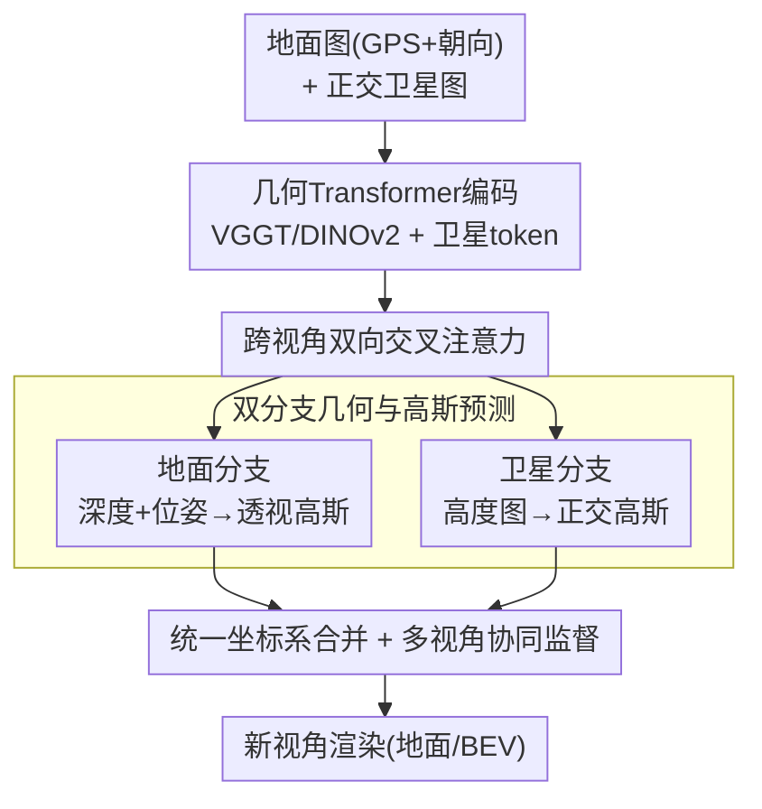

# Cross-View Splatter: Feed-Forward View Synthesis with Georeferenced Images

**会议**: CVPR 2026  
**arXiv**: [2605.19656](https://arxiv.org/abs/2605.19656)  
**代码**: https://nianticspatial.github.io/cross-view-splatter/ (有)  
**领域**: 3D视觉  
**关键词**: 前馈3D重建, 高斯splatting, 跨视角, 卫星影像, 新视角合成

## 一句话总结
针对室外场景地面图像难以大规模采集、覆盖率低的问题，本文提出 Cross-View Splatter：一个前馈网络，把带 GPS 的地面照片与公开地图服务的正交卫星图融合到统一 3D 坐标系，分别预测地面（透视）和卫星（正交）的像素对齐高斯，从而在稀疏输入下显著提升场景覆盖与外推能力。

## 研究背景与动机

**领域现状**：前馈 3D 重建（如 DUSt3R、VGGT）和前馈新视角合成（如 NoPoSplat、AnySplat）已能在几秒内、几乎不需要相机标定的情况下，从一张或多张图像回归像素对齐的高斯，渲染出新视角。这类方法快、且能泛化到稀疏输入。

**现有痛点**：这些方法**只在地面透视图像上训练和评估**。原因是主流 3D 基础模型的训练数据几乎全是带对齐深度的地面标定视图。但对城市级室外场景，地面影像采集耗时、难以规模化、处理成本高——覆盖率天然受限，稍微外推到没拍到的区域就崩。

**核心矛盾**：高质量重建需要良好的相机覆盖，而地面采集恰恰难以提供大范围覆盖。与此同时，卫星正交影像（鸟瞰，BEV）能清晰刻画道路、建筑轮廓等大尺度结构，且通过 Google Maps / Azure Maps / Esri 等地图服务以瓦片网页地图形式**免费、可查询**地获取——这是一个被现有前馈管线完全忽略的全局几何先验。

**本文目标**：让前馈高斯 splatting 同时吃地面图和正交卫星图，把卫星提供的全局结构先验注入重建，提升覆盖率和外推质量。

**切入角度**：作者的核心观察是——对地理定位过的地面采集，瓦片卫星图提供了超出街景观测范围的全局场景结构先验。但卫星图本身很棘手：分辨率粗、受天气/光照/季节影响，更关键的是**正交校正去掉了透视和视差**，使经典 MVS / SfM 无法从单张正交卫星图重建几何。于是必须用学习方式来"啃"卫星几何。

**核心 idea**：把"卫星→地面"几何关系建模为 **3DoF**（已知 GPS+heading 对齐），将卫星分支重新表述为**相对参考帧的高度图回归**问题，再把高度图按正交投影变成高斯；同时用**双向交叉注意力**让地面与卫星特征在统一特征空间里互相补全，最后两套高斯并到同一坐标系渲染。

## 方法详解

### 整体框架

给定一组带地理标签的地面图像 $(I_i^{\text{ground}})_{i=0}^{N}$（含 GPS 经纬度与朝向）和一张对应的正交卫星图 $I^{\text{sat}}$（已知空间分辨率 $r^{\text{sat}}$，单位"像素/米"），模型一次前向就在**共享坐标系**里吐出两套像素对齐的 3D 高斯：地面高斯 $\mathcal{G}^{\text{ground}}$ 和卫星高斯 $\mathcal{G}^{\text{sat}}$，合并后即可渲染任意新视角。坐标系以第一张地面图 $I_0^{\text{ground}}$ 为原点（单位位姿、零海拔），卫星图以该位置为中心、朝向与 $I_0^{\text{ground}}$ 对齐。

流程分四步：① 地面图用预训练 VGGT（DINOv2 编码成 patch token + camera/register token）做特征提取，卫星图也切成 patch token；② 在 VGGT 的交替注意力骨干里**注入双向交叉注意力** $\operatorname{Attn}_{\text{meta}}$，让地面与卫星 token 互换信息；③ 地面分支用 DPT 头回归深度、6DoF 位姿/内参，反投影得到透视高斯，卫星分支回归相对高度图，按正交投影转成卫星高斯；④ 两套高斯归一化到同一尺度后合并渲染。训练时额外用公开地形数据（DEM/lidar）监督高度图，但**推理只需卫星图 + 地面图**。

### 关键设计

**1. 跨视角双向交叉注意力：让地面与鸟瞰特征互相补全**

地面与卫星是两种截然不同的成像模型，直接把 VGGT 用在正交图上会失败——正交投影没有透视，没有 6DoF 位姿和内参，没有海拔就无法估深度。作者不强行把卫星塞进透视框架，而是在 VGGT 的交替注意力（frame attention + global attention）骨干里**额外插入**一组交叉注意力层 $\operatorname{Attn}_{\text{meta}}$，把卫星 token $t^{\text{sat}}$ 和地面 token $t^{\text{ground}}$ 双向耦合。它由两层残差交叉注意力级联而成：

$$\operatorname{Attn}_{\text{meta}}(t^{\text{sat}}, t^{\text{ground}}) = \mathcal{A}_2\big(t^{\text{sat}}, \mathcal{A}_1(t^{\text{ground}}, t^{\text{sat}}, t^{\text{sat}})\big)$$

其中 $\mathcal{A}(Q,K,V)$ 是多头注意力。第一层让地面 token 去 query 卫星 token（地面拿到全局 BEV 结构），第二层反过来让卫星 token 吸收地面信息，整套重复 $L=12$ 次。这样地面与卫星被编码进**相似的特征空间**，卫星的全局几何先验直接流进地面重建，地面的细节也帮卫星定位——这是覆盖率提升的根源，也是后面两套高斯能共享坐标系的前提

**2. 双分支高斯预测：地面透视 + 卫星高度图正交化**

融合后的 token 兵分两路。**地面分支**走标准前馈套路：DPT 深度头出深度 $d_j^{\text{ground}}$ 和置信度 $C_j^{\text{ground}}$，camera 头出 6DoF 位姿 $\bm{T}_i$ 和内参 $\bm{K}_i$，反投影得到高斯中心 $\bm{\mu}_j^{\text{ground}}=\operatorname{backproject}(d_j^{\text{ground}}, \hat{\bm{K}_j}, \hat{\bm{T}_j})$，再由另一个带图像 skip 连接（让颜色信息直达输出）的 DPT 头回归协方差、不透明度、球谐颜色。**卫星分支**是本文的关键转译——既然正交图无法估深度，就把它**重表述为相对 $I_0^{\text{ground}}$ 帧的高度图回归**：$h^{\text{sat}}, C^{\text{sat}} = \operatorname{DPT_{height}}(t^{\text{sat}})$，再借助已知分辨率 $r^{\text{sat}}$ 把高度图按正交投影模型直接变成高斯位置：

$$\bm{\mu}_j^{\text{sat}} = \Big(\tfrac{u}{r^{\text{sat}}},\ \tfrac{v}{r^{\text{sat}}},\ h^{\text{sat}}(u,v)\Big)^{\top}$$

其中 $u,v$ 是卫星像素坐标。置信度 $C^{\text{sat}}$ 很重要——地形真值常有噪声，置信度让网络对不可靠的高度监督打折。两套高斯都用同一套基于反投影深度的 per-batch $\ell_2$ 尺度归一化（高度图 $h^{\text{sat}}$ 和 $r^{\text{sat}}$ 也并入归一化），保证推理时所有预测落在同一归一化坐标系，可直接合并 $\mathcal{G}^{\text{combined}} = \mathcal{G}^{\text{ground}} \cup \mathcal{G}^{\text{sat}}$

**3. 多视角协同监督：用 BEV 渲染逼两套高斯互相对齐**

光分别监督两套高斯不够——它们必须在物理上对齐才能合并不穿帮。作者设计了一组互相牵制的渲染损失：地面高斯用置信度加权深度损失 $\mathcal{L}_{\text{depth}}$、深度一致性损失 $\mathcal{L}_{\text{const}}$（约束高斯渲染深度和预测深度一致，间接约束高斯大小）、以及 MSE+LPIPS 的 $\mathcal{L}_{\text{RGB}}^{\text{ground}}$。卫星高斯则**同时渲染到输入视角和插值新视角**做颜色监督 $\mathcal{L}_{\text{RGB}}^{\text{sat}}$（迫使卫星几何对新视角也成立，这是覆盖率收益的来源）。关键的协同项是把合并高斯渲染回**地面视角**的 $\mathcal{L}_{\text{RGB}}^{\text{combined}}$ 和渲染回**卫星 BEV 平面**的 $\mathcal{L}_{BEV}=\|I^{\text{sat}} - C^{\text{combined}}_{\text{3DGS}}\|$——后者要注意正交投影**不做**透视那种"协方差随逆深度缩放"，而是用 $r^{\text{sat}}$ 把归一化世界坐标直接投到卫星像素空间。此外天空区域用现成分割模型识别后，加 $\mathcal{L}_{\text{sky\_depth}}$（惩罚不合理的近距离深度）和 $\mathcal{L}_{\text{sky\_alpha}}$（逼天空高斯远且不透明），避免天空噪声深度污染重建。消融显示 $\mathcal{L}_{\text{RGB}}^{\text{sat}}$ 是涨点主力

**4. 地理参考数据策划：为正交视角造出 3D 监督信号**

跨视角设置没有现成训练数据——正交图既不能 MVS 也很难做特征匹配，缺 3D 监督。作者的解法是给已有地理定位地面数据集"补料"：用 Google/Azure/Esri 瓦片地图按地面 GPS 位置以 2 像素/米、$512\times512$ 查询正交卫星图，并从政府公开 lidar / 地质勘测 DEM 数据挖出地形高度，配成**卫星-高度图对**，给卫星分支提供高度回归的真值。训练数据混合了带卫星+地形的 Metropolis、VIGOR（全景切成 $90^\circ$ FoV）与纯地面的 MapFree、VKITTI2、DL3DV。作者还构建了**新基准**：手动把 Tanks and Temples 的 10 个室外场景和 DL3DV 的 40 个场景的 COLMAP 重建对齐缩放到卫星图，填补了"地理参考新视角合成"无 benchmark 的空白

### 损失函数 / 训练策略

总损失 = 地面项（$\mathcal{L}_{\text{depth}} + \mathcal{L}_{\text{cam}} + \mathcal{L}_{\text{const}} + \mathcal{L}_{\text{RGB}}^{\text{ground}}$）+ 卫星项（$\mathcal{L}_{\text{height}} + \mathcal{L}_{\text{RGB}}^{\text{sat}}$）+ 协同项（$\mathcal{L}_{\text{RGB}}^{\text{combined}} + \mathcal{L}_{BEV}$）+ 天空项 $\mathcal{L}_{\text{sky}}$。深度/高度损失用置信度加权（$-\alpha\log C$ 形式）。从 AnySplat 权重初始化，PyTorch + gsplat v1.5，2×A100 训练 4 天，batch 10，FlashAttention-v2 + 混合精度，输入分辨率 $518\times518$，卫星图和地形空间范围统一到 244 米。

## 实验关键数据

### 主实验

在自建的地理参考 Tanks and Temples（10 场景）稀疏视角合成上，Combined（地面+卫星）在各覆盖度下均最优，尤其单视角时优势巨大：

| 设置 | 方法 | PSNR↑ | SSIM↑ | LPIPS↓ |
|------|------|-------|-------|--------|
| 1 context | AnySplat | 7.48 | 0.3572 | 0.6482 |
| 1 context | Sat2Density† | 8.81 | 0.3557 | 0.8172 |
| 1 context | **Ours (Combined)** | **11.13** | **0.3764** | 0.6286 |
| 1 context | Ours (Ground) | 8.92 | 0.3621 | 0.6066 |
| 3 context | Splatfacto（逐场景优化5分钟+） | 11.72 | 0.2888 | 0.6267 |
| 3 context | AnySplat | 10.93 | 0.3775 | 0.5331 |
| 3 context | **Ours (Combined)** | **12.00** | **0.3855** | 0.5699 |
| 3 context | Ours (Ground) | 10.61 | 0.3763 | 0.5631 |

DL3DV（40 场景）结论一致——Combined 在 1/3 context 下分别 11.33 / 12.61，明显高于 AnySplat 的 8.37 / 10.88、Ground-only 的 9.00 / 10.65。注意整体 PSNR 偏低是因为输入-目标重叠极小（IoU ≈ 0.05–0.5），任务本身很难。成本体方法 MVSplat/DepthSplat 在单视角或小基线下几乎崩（PSNR 6–9），而卫星条件化模型更鲁棒。

### 消融实验

Metropolis 数据集（36 测试场景，2 输入 + 2 插值新视角），PSNR：

| 配置 | Ground | Terrain | Combined |
|------|--------|---------|----------|
| VGGT w/ 3DGS: $\mathcal{L}_{\text{cam}}+\mathcal{L}_{\text{depth}}+\mathcal{L}_{\text{RGB}}^{\text{ground}}$ | 15.26 | - | - |
| + $\mathcal{L}_{\text{const}}$ | 16.99 | - | - |
| + $\mathcal{L}_{\text{sky}}$ | 17.10 | - | - |
| w/ SAT: +$\mathcal{L}_{\text{RGB}}^{\text{combined}}$ | 16.99 | 5.24 | 17.17 |
| + $\mathcal{L}_{\text{RGB}}^{\text{ground}}$ | 16.61 | 5.36 | 16.87 |
| **+ $\mathcal{L}_{\text{RGB}}^{\text{sat}}$（完整）** | **17.59** | **12.25** | **18.63** |

### 关键发现
- **卫星头是涨点核心**：加入卫星分支后 Combined 比纯地面模型（17.10）提升到 18.63，且单独的卫星几何（Terrain）从 5.24 暴涨到 12.25——说明 $\mathcal{L}_{\text{RGB}}^{\text{sat}}$（把卫星高斯渲染到新视角监督）让 BEV 几何真正可用，覆盖了被遮挡和未观测区域。
- **低重叠时增益最大**：按 context-target IoU 分桶统计，卫星模型在所有桶都超过 baseline，但在 IoU ≤ 0.15 的低重叠区间增益最大，印证"卫星先验主要帮外推"。
- **一致性与天空正则是地面侧的稳定剂**：$\mathcal{L}_{\text{const}}$ 把 Ground PSNR 从 15.26 拉到 16.99，$\mathcal{L}_{\text{sky}}$ 再补到 17.10。

## 亮点与洞察
- **把"无法重建"的正交卫星图转译成可学的高度图回归**：正交投影丢了视差，经典 MVS 直接无解；本文用"已知 3DoF 对齐 + 相对参考帧高度图"绕过了位姿/内参/深度三大缺失，再用 $r^{\text{sat}}$ 一步把高度图正交投影成高斯，转译干净利落。
- **免费地图服务当几何先验**：不依赖难获取的多视角离轴卫星图，只用任何人都能查的瓦片正交图 + 设备自带 GPS/heading，工程落地门槛极低，这是相比 SkySplat/Horizon-GS 等需多视角卫星图方法的实质优势。
- **双向交叉注意力作为"特征空间对齐器"**的思路可迁移：任何"两种异构成像模型要进同一 3D 框架"的任务（如雷达+相机、红外+可见光）都能借鉴这种在预训练骨干里插 $\operatorname{Attn}_{\text{meta}}$、用渲染损失逼两套表示对齐的范式。
- **诚实地不幻觉**：与生成式卫星→地面方法（SatDreamer360 等）不同，前馈只合成地面/卫星可见区域，不编造未观测内容，几何更可信。

## 局限与展望
- **绝对精度仍低**：PSNR 普遍在 11–12（Tanks）、12–13（DL3DV），作者归因于任务本身低重叠；但这也说明在如此稀疏的设置下重建质量离实用还有距离。
- **强依赖 3DoF 对齐假设**：方法假定卫星-地面变换已知且 $I_0^{\text{ground}}$ 定义零海拔，GPS/heading 噪声、地形起伏导致的零海拔假设偏差未充分讨论；城市峡谷里 GPS 漂移可能直接破坏对齐。
- **卫星图质量与时效**：瓦片地图存在季节/光照/施工变化，与地面采集时间不一致时会引入纹理/几何冲突，论文未量化这种 domain gap 的影响。
- **数据许可限制复现**：Google/Azure 地图许可使作者只能托管附加数据、提供查询代码，完整训练集复现需自行拉取，门槛仍在。
- 改进方向：联合优化 3DoF 对齐（把对齐当可学变量）、引入时序一致性处理卫星-地面时间差、扩展到 UAV/倾斜航拍补充中间视角。

## 相关工作与启发
- **vs AnySplat / NoPoSplat**：两者都是用预训练 3D 基础模型（VGGT/DUSt3R）蒸馏先验的前馈高斯方法，但只吃地面图、覆盖率受限。本文以 AnySplat 初始化，加卫星分支后在所有覆盖度下都超过它（如 Tanks 3-view 12.00 vs 10.93），优势在跨视角覆盖；代价是需要卫星图和地形训练数据。
- **vs SkySplat / Horizon-GS / Skyfall-GS**：这些用卫星做城市级重建，但**依赖多视角离轴、非正交校正卫星图**，难获取且地图服务通常不提供。本文只用单张正交瓦片图，实用性更强。
- **vs Sat2Density（卫星→地面合成）**：Sat2Density 从单张卫星图预测 tri-plane 体渲染地面视角，但主要在美国乡村训练、泛化差（Tanks 1-view PSNR 8.81、LPIPS 0.8172 明显劣于本文）。本文用高斯表示且融合地面观测，深度更锐利、可栅格化到任意新视角。
- **vs 生成式卫星→地面（SatDreamer360/Streetscapes）**：它们用扩散模型幻觉未观测区域纹理，能补全但不保几何真实。本文走前馈、只渲可见区域，牺牲补全能力换取几何可信度。

## 评分
- 新颖性: ⭐⭐⭐⭐⭐ 首个同时为地面透视图和正交卫星图预测高斯的前馈方法，高度图回归+双向交叉注意力的转译很巧。
- 实验充分度: ⭐⭐⭐⭐ 两个新基准 + 多 baseline + 分层 IoU 分析 + 逐损失消融，较完整；但绝对 PSNR 偏低、缺对 GPS 噪声/卫星时效的鲁棒性分析。
- 写作质量: ⭐⭐⭐⭐ 动机清晰、坐标约定和公式交代到位，方法逻辑顺；部分细节（尺度归一化）推到附录。
- 价值: ⭐⭐⭐⭐⭐ 用免费地图服务突破地面采集覆盖瓶颈，工程落地门槛低，对城市级室外重建很有现实意义。

<!-- RELATED:START -->

## 相关论文

- [\[CVPR 2026\] EcoSplat: Efficiency-controllable Feed-forward 3D Gaussian Splatting from Multi-view Images](ecosplat_efficiency-controllable_feed-forward_3d_gaussian_splatting_from_multi-v.md)
- [\[CVPR 2026\] From Rays to Projections: Better Inputs for Feed-Forward View Synthesis](from_rays_to_projections_better_inputs_for_feed-forward_view_synthesis.md)
- [\[CVPR 2026\] Learning Compact 3D Representations from Feed-Forward Novel View Synthesis](learning_compact_3d_representations_from_feed-forward_novel_view_synthesis.md)
- [\[CVPR 2026\] Reliev3R: Relieving Feed-forward 3D Reconstruction from Multi-View Geometric Annotations](reliev3r_relieving_feed-forward_3d_reconstruction_from_multi-view_geometric_annot.md)
- [\[CVPR 2026\] Scaling View Synthesis Transformers (SVSM)](scaling_view_synthesis_transformers.md)

<!-- RELATED:END -->
