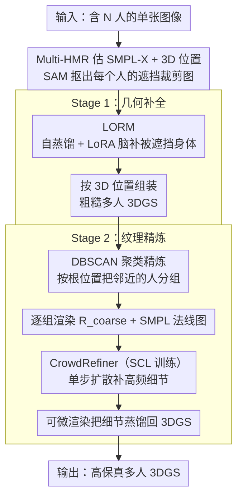

# CrowdGaussian: Reconstructing High-Fidelity 3D Gaussians for Human Crowd from a Single Image

**会议**: CVPR 2026  
**arXiv**: [2603.17779](https://arxiv.org/abs/2603.17779)  
**代码**: 无  
**领域**: 3D视觉  
**关键词**: 人体重建, 3D高斯泼溅, 遮挡恢复, 扩散模型精炼, 人群场景

## 一句话总结

CrowdGaussian 提出了从单张图像重建多人 3D 高斯泼溅表示的统一框架，通过自监督适配的大型遮挡人体重建模型（LORM）恢复被遮挡区域的完整几何，再通过自校准学习（SCL）训练的单步扩散精炼器（CrowdRefiner）提升纹理细节质量。

## 研究背景与动机

**领域现状**：单图 3D 人体重建近年取得显著进展，大型重建模型（LRM）利用 Transformer 和大规模数据集实现了从单图快速前馈重建。但现有方法几乎都只处理清晰、近距离的单人图像。

**现有痛点**：
   - **严重遮挡**：人群场景中人与人、人与物之间频繁遮挡，导致身体部位不完整。现有方法直接处理这类输入会产生透明空洞和不完整几何。
   - **低分辨率**：人群中每个个体的裁剪图分辨率很低，导致外观模糊、缺乏高频细节。
   - **多人场景的效率需求**：需要同时重建大量人体，逐个处理效率太低。

**核心矛盾**：现有的大型人体重建模型虽然有强大的 2D-to-3D 生成先验，但缺乏遮挡感知训练。直接送入遮挡输入，Transformer 无法整合不完整的视觉特征，导致输出破碎。而用有限的 3D 监督做微调往往放大单目歧义的几何偏差，反而损害预训练先验。

**本文目标**：(a) 如何从被严重遮挡的裁剪图恢复完整 3D 人体？(b) 如何从低分辨率输入恢复高频纹理细节？(c) 如何高效地同时处理多人场景？

**切入角度**：不做 3D 标注监督微调，而是用"自监督蒸馏"——让冻结的教师模型在完整图像上生成伪 GT，学生模型学习从遮挡输入恢复完整几何。

**核心idea**：两阶段框架——Stage 1 用自监督适配的 LORM 生成粗糙但完整的多人 3DGS，Stage 2 用 SCL 训练的 CrowdRefiner 精炼渲染结果并回蒸到 3DGS 中。

## 方法详解

### 整体框架

CrowdGaussian 要解决的是从一张挤满人的照片里，把每个人都重建成完整、高保真的 3D 高斯表示——而人群照片天生伴随严重遮挡和低分辨率。它的解法是把这个难题拆成两个阶段串起来：第一阶段先把"残缺的几何补全"，第二阶段再把"模糊的纹理补细"。

具体来说，输入是一张含 $N$ 个人的图像。Stage 1 先用 Multi-HMR 估出每个人的 SMPL-X 参数和 3D 位置，用 SAM 把每个人抠出来，再让 LORM 从这些被遮挡的裁剪图里逐个恢复出完整的单人 3DGS，最后按 3D 位置组装成一个粗糙但几何完整的多人场景。Stage 2 先用 DBSCAN 把空间邻近的人聚成组，对每组渲染出粗糙图交给 CrowdRefiner 做单步扩散精炼补高频细节，精炼后的图像再作为伪 GT，通过可微渲染把细节"蒸馏"回 3DGS。两阶段的共同点是都不依赖任何外部 3D 标注——几何靠预训练模型自蒸馏，纹理靠 2D 生成先验。

### 关键设计

**1. LORM：用自蒸馏教会重建模型"脑补"被挡住的身体**

人群里每个人都被遮挡得七零八落，而现成的大型人体重建模型（这里用 LHM-500M）从没见过遮挡输入，直接喂进去 Transformer 整合不了残缺特征，输出就会破碎透明。LORM 的做法是给这个预训练模型做一次"遮挡适配"，但关键是不能用 3D 标注去微调——单目重建本来就有深度歧义，硬监督只会放大几何偏差、毁掉预训练先验。于是它让模型自己当自己的老师：教师流是冻结的原模型，喂完整图像 $I_{\text{full}}$ 生成完整高斯 $\mathcal{G}_{\text{full}}$，从 $V$ 个新视角渲染出干净的伪 GT $R_{\text{clean}}^{(v)}$；学生流则对同一张图施加随机遮挡（Bézier 曲线加关键点椭圆模拟人/物遮挡）得到 $I_{\text{occ}}$，让 LORM 预测 3DGS 并渲染出粗糙视图 $R_{\text{coarse}}^{(v)}$。两者用一个纯 2D 的一致性损失对齐：

$$\mathcal{L}_{\text{self-distill}} = \sum_v \left( \lambda_{\text{rgb}} \|R_{\text{clean}}^{(v)} - R_{\text{coarse}}^{(v)}\|_2 + \lambda_{\text{ssim}} (1 - \text{SSIM}(R_{\text{clean}}^{(v)}, R_{\text{coarse}}^{(v)})) \right)$$

为了不破坏来之不易的预训练能力，它冻结 Sapiens 编码器（MAE 架构）和高斯解码器，只在中间的多模态身体-头部 Transformer（MBHT）里注入可训练的 LoRA 模块。这样编码和解码的视觉先验原封不动，LoRA 只负责调整注意力权重去"想象"被遮挡部位该长什么样。最终只用 1002 张正面图就完成了适配。

**2. CrowdRefiner：单步扩散把过度平滑的纹理补出高频**

LORM 解决了几何完整，但纹理还是糊的——重建模型分辨率有限，输出的皮肤、衣服细节过度平滑。CrowdRefiner 接手做纹理增强，它是一个基于 SD-Turbo 的单步扩散模型：输入粗糙 RGB 渲染 $R_{\text{coarse}}$，外加对应的 SMPL 法线图 $N$ 当几何先验。法线图经一个轻量 PoseNet 编码、RGB 经冻结 VAE 编码器编码，两路特征一起注入 UNet 引导生成，VAE 解码器则用 LoRA 适配微调。之所以让扩散模型出马，是因为它带着大规模 2D 图像的生成先验，能凭空补出 LORM 给不出的高频细节；而之所以坚持单步推理而非迭代采样，是为了在人群这种多个体场景下保住效率。

**3. 自校准学习（SCL）：教精炼器"好的地方别乱动"**

扩散精炼器有个通病：它会一视同仁地"增强"画面所有区域，结果连本来就重建得不错的脸都被改扭曲、长出伪影。SCL 用一个很朴素的办法治这个毛病——训练时随机混入两类样本对。一类是标准退化对 $(R_{\text{coarse}}, R_{\text{gt}})$，教模型从粗糙恢复到高质量；另一类是身份保持对 $(R_{\text{gt}}, R_{\text{gt}})$，输入和目标都是 GT，等于直白地告诉模型"这张已经够好了，原样输出就行"。只用退化对训练时模型会过度激进，混进身份保持样本后，它就学会了自适应判断：哪些区域真糊需要补，哪些区域（尤其面部）已经够好该保留。

**4. DBSCAN 聚类精炼：把空间邻近的人打包一起精炼**

人群里人数动辄几十，如果逐人渲染+精炼，计算成本扛不住。这一步用 DBSCAN 按每个人的根位置把个体聚成空间连贯的组，对每组一次性整体渲染和精炼，而不是一个一个过。聚类天然保证了被一起处理的人在空间上邻近，精炼后再用 L1 + SSIM 损失把结果蒸馏回各自的 3DGS，既省算力又维持了全局场景的一致性。

### 一个完整示例

设输入是一张三人合影，前排两人互相遮挡、后排一人被前排挡住下半身。Multi-HMR 先估出三套 SMPL-X 参数和各自的 3D 根位置，SAM 把三个人分别抠成三张裁剪图——每张都缺胳膊少腿。LORM 逐张处理：对后排那张缺下半身的裁剪图，它依靠 LoRA 适配后的 Transformer"脑补"出被挡住的腿和脚，输出一套完整但纹理偏糊的单人 3DGS；三个人的高斯按 3D 根位置摆回原场景，组成粗糙的多人 3DGS。接着 DBSCAN 发现前排两人空间相邻、归为一组，后排单独一组；对每组渲染出 $R_{\text{coarse}}$ 连同 SMPL 法线图喂给 CrowdRefiner，单步扩散把模糊的衣纹和面部补出高频细节——而 SCL 让它没有把本来就清晰的前排人脸改坏。最后这些精炼图作为伪 GT，通过可微渲染把细节回灌进每个人的 3DGS，得到三个高保真、可自由换视角的 3D 人体。

### 损失函数 / 训练策略

- **LORM 自蒸馏损失**: $\mathcal{L}_{\text{self-distill}} = \sum_v (\lambda_{\text{rgb}} \| \cdot \|_2 + \lambda_{\text{ssim}} (1 - \text{SSIM}))$，从 24 个固定视角渲染
- **CrowdRefiner 训练损失**: $\mathcal{L}_{\text{diff}} = \lambda_{L2}\mathcal{L}_{\text{L2}} + \lambda_{\text{lpips}}\mathcal{L}_{\text{LPIPS}} + \lambda_{\text{ssim}}\mathcal{L}_{\text{SSIM}} + \lambda_{\text{gram}}\mathcal{L}_{\text{Gram}}$
- **3DGS 优化损失**: $\mathcal{L}_{\text{optim}} = \|R_{\text{refined}} - R_{\text{coarse}}\|_1 + \lambda_{\text{ssim}}(1 - \text{SSIM})$
- LORM 训练数据：HuGe100K 中的 1002 张正面图像
- CrowdRefiner 训练数据：THuman2.1 的 114 个合成多人场景（91 训练/23 测试），每场景 126 个视角

## 实验关键数据

### 主实验

遮挡人体重建的定量比较（THuman2.1，随机遮挡 mask）：

| 方法 | PSNR ↑ | SSIM ↑ | LPIPS ↓ |
|------|--------|--------|---------|
| IDOL | 18.063 | 0.919 | 0.994 |
| LHM | 18.171 | 0.918 | 1.012 |
| LORM (Ours) | 18.566 | 0.923 | 0.956 |
| LORM + CrowdRefiner | **18.619** | **0.931** | **0.914** |

不同遮挡率下的鲁棒性（THuman2.1）：

| 方法 | 遮挡率 | PSNR ↑ | SSIM ↑ | LPIPS ↓ |
|------|--------|--------|--------|---------|
| IDOL | 20% | 18.196 | 0.921 | 0.978 |
| IDOL | 60% | 16.667 | 0.909 | 1.063 |
| LHM | 20% | 17.945 | 0.919 | 1.006 |
| LHM | 60% | 17.551 | 0.915 | 1.037 |
| **LORM** | **20%** | **18.428** | **0.923** | **0.947** |
| **LORM** | **60%** | **18.116** | **0.919** | **0.972** |

### 消融实验

CrowdRefiner 的 SCL 策略和几何条件输入消融：

| SCL | Normal Map | PSNR ↑ | SSIM ↑ | LPIPS ↓ |
|-----|-----------|--------|--------|---------|
| ✗ | ✗ | 20.013 | 0.888 | 0.141 |
| ✗ | ✓ | 20.130 | 0.892 | 0.138 |
| ✓ | ✗ | 20.382 | 0.896 | 0.129 |
| ✓ | ✓ | **20.790** | **0.901** | **0.122** |

### 关键发现

- **LORM 在大遮挡率下退化极小**：遮挡从 20% 增加到 60%，LORM 的 PSNR 仅下降 0.31（18.43→18.12），而 IDOL 下降 1.53（18.20→16.67），LHM 下降 0.39。LORM 的自监督适配有效地注入了遮挡处理能力。
- **SCL 是防止过度精炼的关键**：没有 SCL 时 PSNR 下降 0.77（20.79→20.01），定性上出现面部扭曲。SCL 中身份保持样本教会模型不要过度修改。
- **法线图条件可提升几何一致性**：增加 SMPL 法线图输入后 LPIPS 从 0.129 降至 0.122，为精炼器提供了明确的几何约束。
- **Mesh-based 方法在遮挡下全面失败**：PSHuman 和 SyncHuman 无法恢复被遮挡部分的几何，而基于 3DGS 的 IDOL 和 LHM 虽能输出某些结果但有透明伪影和扭曲纹理。

## 亮点与洞察

- **自监督适配策略绝妙**：利用预训练模型本身作为教师，通过合成遮挡+自蒸馏来学习遮挡恢复，不需要任何外部 3D 标注。这个范式可以迁移到任何需要让预训练模型适应新退化类型的场景——不改变模型的生成先验，只教它处理新的输入分布。
- **SCL 策略的直觉优雅**：在训练数据中混入"输入=输出"的身份保持样本，本质上是告诉模型"如果输入已经足够好，就不要改动"。这个简单的 trick 有效解决了生成式精炼中的过度修改问题。
- **从单人模型到多人场景的完整路径**：LORM + CrowdRefiner + DBSCAN 聚类构成了一个完整的、可扩展的多人 3D 重建方案，展示了如何基于单人模型构建多人系统。

## 局限与展望

- 依赖 off-the-shelf 的姿态估计和分割（Multi-HMR、SAM），初始化严重错误会传播到最终结果，尤其是手部重建挑战很大
- 在极低分辨率下精炼可能产生与真实不一致的幻觉细节（如特定 logo）
- 训练数据仅使用 THuman2.1 的 114 个合成场景，多样性有限
- 需要 SMPL-X 参数估计，对非标准体型或极端服装可能不适用
- 聚类策略使用 DBSCAN，在人群密度极高时可能将太多人聚为一组导致精炼分辨率不足

## 相关工作与启发

- **vs LHM**: 本文直接基于 LHM-500M 做适配。LHM 在遮挡输入下产生透明伪影，LORM 通过 LoRA + 自蒸馏解决了这个问题，且仅用 1002 张图像就足够。
- **vs CHROME**: CHROME 使用多视角扩散生成无遮挡图像，但合成视图间的不一致导致纹理损坏（尤其面部）。LORM 直接在 3DGS 空间做恢复，避免了多视图不一致的问题。
- **vs DIFIX/GSFix3D**: 通用场景 3DGS 精炼方法。CrowdRefiner 专注于人体场景，通过 SMPL 法线条件和 SCL 策略更好地保持身份和面部细节。

## 评分

- 新颖性: ⭐⭐⭐⭐ 自监督适配和 SCL 策略有创新性，但整体框架是模块化组合
- 实验充分度: ⭐⭐⭐⭐ 定量+定性覆盖充分，遮挡率梯度实验有说服力，但缺少更大规模的真实世界基准
- 写作质量: ⭐⭐⭐⭐ 结构清晰，pipeline 图表直观
- 价值: ⭐⭐⭐⭐ 填补了多人 3D 重建的空白，对 VR/远程会议等应用有直接价值

<!-- RELATED:START -->

## 相关论文

- [\[CVPR 2026\] Human Interaction-Aware 3D Reconstruction from a Single Image](human_interaction-aware_3d_reconstruction_from_a_single_image.md)
- [\[CVPR 2026\] HyperGaussians: High-Dimensional Gaussian Splatting for High-Fidelity Animatable Face Avatars](hypergaussians_high-dimensional_gaussian_splatting_for_high-fidelity_animatable_.md)
- [\[CVPR 2026\] TopoMesh: High-Fidelity Mesh Autoencoding via Topological Unification](topomesh_high-fidelity_mesh_autoencoding_via_topological_unification.md)
- [\[CVPR 2026\] Catalyst4D: High-Fidelity 3D-to-4D Scene Editing via Dynamic Propagation](catalyst4d_highfidelity_3dto4d_scene_editing_via_d.md)
- [\[CVPR 2026\] 3D Gaussian Splatting with Self-Constrained Priors for High Fidelity Surface Reconstruction](3d_gaussian_splatting_with_self-constrained_priors_for_high_fidelity_surface_rec.md)

<!-- RELATED:END -->
