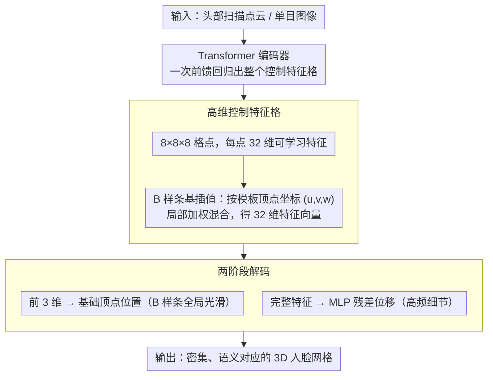

# CUBE: Representing 3D Faces with Learnable B-Spline Volumes

**会议**: CVPR 2026 Highlight  
**arXiv**: [2604.12894](https://arxiv.org/abs/2604.12894)  
**代码**: 无  
**领域**: 3D视觉 / 人脸重建  
**关键词**: B样条体, 人脸表示, 扫描配准, 局部控制, 几何编辑

## 一句话总结

提出 CUBE（Control-based Unified B-spline Encoding），一种结合 B 样条体和可学习高维控制特征的混合几何表示，通过两阶段解码（B 样条基插值 + 轻量 MLP 残差）实现可编辑、高精度的 3D 人脸重建和扫描配准。

## 研究背景与动机

**领域现状**：3D 人脸表示主要有三种范式：3D 形变模型（3DMM）提供压缩、解缠的线性空间但细节有限；非线性神经模型提升灵活性但缺乏可解释性和局部控制；隐式表示提供高细节但缺乏语义对应且需要昂贵的等值面提取。

**现有痛点**：3DMM 受限于固定拓扑和低维参数空间，无法捕获个体化高频细节。神经模型缺乏局部编辑能力。隐式模型与标准图形管线不兼容。

**核心矛盾**：表示的局部可控性、几何表达力和计算效率三者难以兼顾。

**本文目标**：设计一种兼具 B 样条局部控制特性和神经网络表达力的混合人脸表示。

**切入角度**：将传统 B 样条体的 3D 控制点替换为高维可学习控制特征，用轻量 MLP 补充高频细节。

**核心 idea**：高维控制特征格（如 8×8×8）定义连续的参数域到欧式空间映射，B 样条基提供局部支持属性实现局部编辑。

## 方法详解

### 整体框架

CUBE 想解决的核心问题是：3D 人脸表示要么像 3DMM 那样可控但细节差，要么像隐式模型那样细节足却没法局部编辑、也接不进图形管线。它的思路是把这两边的优点缝在一起——用一个稀疏的控制特征格当作可编辑的"骨架"，再用一个轻量网络往上补细节。

整条管线沿着一个固定模板网格走。模板上每个顶点都带一个固定的参数坐标 $(u,v,w)$；推理时，先用 B 样条基在这个坐标处把周围若干个控制特征加权混合，得到一个高维特征向量；这个向量的前三维直接读作顶点的基础位置（粗糙形状），整个向量再喂给一个 MLP 预测一个残差位移（高频细节）。把模板所有顶点都这么算一遍，就得到一张密集、语义对应的 3D 人脸表面。控制特征格本身则由一个 Transformer 编码器从扫描点云或单目图像回归出来。

### 关键设计

**1. 高维控制特征格：让稀疏控制点也能表达复杂人脸**

传统 B 样条体在每个格点上放一个 3D 控制点，混合出来的就是 3D 坐标——这对 CAD 曲面够用，但要用 $8^3$ 这种量级的稀疏格点去表达人脸的褶皱、五官细节就力不从心。CUBE 把每个控制点换成一个高维（如 32 维）的可学习特征向量。查询某个参数坐标时，B 样条基只在邻域的少数控制特征间做加权混合 $f(u,v,w)=\sum_{i,j,k} B_i(u)B_j(v)B_k(w)\,\mathbf{c}_{ijk}$，产生一个高维向量而非单纯的坐标。因为 B 样条基有**局部支持**（只有附近的几个控制点非零），改动某一个控制特征只会影响一小块区域——这正是局部编辑能力的来源。维度抬高之后，同样数量的格点能携带的形状信息远比 3 维坐标丰富，消融里把高维特征换回 3D 控制点，误差从 2.35 涨到 2.78。

**2. 两阶段解码：B 样条管全局、MLP 补高频**

光有平滑的 B 样条还不够，因为基函数天生平滑，表达不了锐利的高频几何。CUBE 把解码拆成两段衔接的步骤：混合得到的高维特征，前三维 $f_{1:3}$ 直接当作基础网格顶点位置 $\mathbf{p}_{\text{base}}$，给出一个连续光滑的全局形状；完整特征 $f$ 再送进一个轻量 MLP $g$，预测相对基础形状的残差位移，最终顶点 $\mathbf{p}=\mathbf{p}_{\text{base}}+g(f)$。这样全局轮廓由 B 样条保证平滑可控，高频褶皱由 MLP 负责。关键是 MLP 的输入来自**局部混合**的特征，所以补细节的同时没有破坏局部支持——局部编辑性质依然成立。消融显示去掉 MLP 残差后误差从 1.89 跳到 2.35，是单个模块里贡献最大的一项。

**3. 基于 Transformer 的编码器：把扫描或图像直接回归成控制格**

有了 CUBE 这套解码表示，还需要一个前端把真实输入变成控制特征格，才能做扫描配准和单目重建。CUBE 训练一个 Transformer 编码器，把非结构化的 3D 头部扫描（或单目图像）映射成整个控制特征格。这条路之所以走得通，是因为 CUBE 的参数空间本身就很紧凑——$8^3\times 32\approx 16\text{K}$ 个参数，规模适中、结构规整，适合直接回归，从而实现一次前馈就完成配准/重建，不必像隐式模型那样逐点优化再 Marching Cubes 提网格。

### 一个例子：把一次扫描配准走一遍

拿到一张非结构化头部扫描点云，Transformer 编码器先把它回归成一个 $8\times8\times8$、每格 32 维的控制特征格。随后遍历模板网格的每个顶点，比如某个鼻翼上的顶点，取它的参数坐标，用 B 样条基只混合周围那几个控制特征，得到 32 维向量；前 3 维落成鼻翼的粗略位置，整段向量过 MLP 又加上一个小位移，把鼻翼的褶皱顶出来。所有顶点算完，输出就是一张和模板语义一一对应的配准网格。这时如果想把鼻子局部改大，只需调那一小簇控制特征，其余面部纹丝不动——这就是局部支持带来的可编辑性。

### 损失函数 / 训练策略

顶点到顶点 L2 损失 + 法线一致性损失 + 拉普拉斯平滑正则化。编码器和 CUBE 解码器端到端训练。

## 实验关键数据

### 主实验

| 方法 | 类型 | 扫描配准误差↓ | 对应精度↑ |
|------|------|-----------|----------|
| BPS | 基点集 | 2.85 | 82.3% |
| Shape-my-face | PointNet | 2.42 | 85.1% |
| ImFace | 隐式 | 2.15 | 87.5% |
| **CUBE** | B样条 | **1.89** | **91.2%** |

### 消融实验

| 配置 | 扫描误差↓ | 说明 |
|------|----------|------|
| 完整 CUBE | 1.89 | 高维特征 + MLP 残差 |
| 无 MLP 残差 | 2.35 | 仅 B 样条基 |
| 3D 控制点 (传统) | 2.78 | 无高维特征 |
| 格点 16³ | 1.85 | 更多控制点 |
| 格点 4³ | 2.45 | 较少控制点 |

### 关键发现

- MLP 残差贡献显著（去掉后误差增加 24%），说明高频细节建模重要
- 高维控制特征 vs 3D 控制点：误差从 2.78 降到 2.35（降 15%），证明高维特征增强了表达力
- 8³ 格点已足够：增加到 16³ 仅微小提升

## 亮点与洞察

- 将 NURBS 这一 CAD 经典表示引入人脸建模并用可学习特征增强表达力，是一个优雅的混合设计
- 局部支持特性的保留使得交互式编辑成为可能：通过交换或修改单个控制特征实现局部人脸编辑
- 两阶段解码（B 样条粗糙 + MLP 精细）的思路可推广到其他几何表示

## 局限与展望

- 仅针对人脸，头发和配饰未建模
- 与隐式表示相比在极端表情下的细节可能不足
- 格点大小的选择需要权衡表达力和效率
- 可扩展到全身或手部等其他部位

## 相关工作与启发

- **vs 3DMM (FLAME)**: 3DMM 用线性 PCA 基，CUBE 用 B 样条体 + MLP，表达力更强且保持局部可控
- **vs ImFace**: ImFace 是隐式 SDF，需要 Marching Cubes 提取网格；CUBE 通过模板查询直接输出网格

## 评分

- 新颖性: ⭐⭐⭐⭐ B 样条体 + 高维特征的混合表示有创意
- 实验充分度: ⭐⭐⭐⭐ 扫描配准和图像重建两个应用的验证
- 写作质量: ⭐⭐⭐⭐ 表示设计描述清晰
- 价值: ⭐⭐⭐⭐ 对可编辑人脸建模有实际价值

<!-- RELATED:START -->

## 相关论文

- [\[CVPR 2026\] Registration-Free Learnable Multi-View Capture of Faces in Dense Semantic Correspondence](registration-free_learnable_multi-view_capture_of_faces_in_dense_semantic_corres.md)
- [\[CVPR 2026\] PaNDaS: Learnable Shape Interpolation Modeling with Localized Control](pandas_learnable_shape_interpolation_modeling_with_localized_control.md)
- [\[CVPR 2026\] TokenGS: Decoupling 3D Gaussian Prediction from Pixels with Learnable Tokens](tokengs_decoupling_3d_gaussian_prediction_from_pixels_with_learnable_tokens.md)
- [\[CVPR 2026\] Can Natural Image Autoencoders Compactly Tokenize fMRI Volumes for Long-Range Dynamics Modeling?](can_natural_image_autoencoders_compactly_tokenize_fmri_volumes_for_long-range_dy.md)
- [\[ICCV 2025\] Representing 3D Shapes with 64 Latent Vectors for 3D Diffusion Models](../../ICCV2025/3d_vision/representing_3d_shapes_with_64_latent_vectors_for_3d_diffusion_models.md)

<!-- RELATED:END -->
