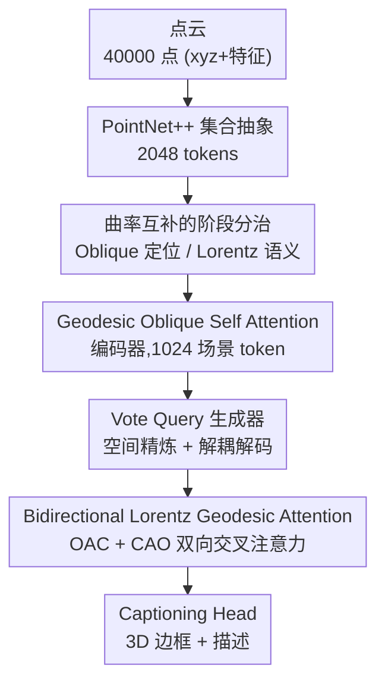

# Curvature-Aware Captioning: Leveraging Geodesic Attention for 3D Scene Understanding

**会议**: CVPR 2026  
**论文**: [CVF Open Access](https://openaccess.thecvf.com/content/CVPR2026/html/He_Curvature-Aware_Captioning_Leveraging_Geodesic_Attention_for_3D_Scene_Understanding_CVPR_2026_paper.html)  
**代码**: 无  
**领域**: 3D视觉  
**关键词**: 3D稠密描述, 测地注意力, Oblique流形, Lorentz双曲空间, 非欧几何  

## 一句话总结
针对 3D 稠密描述里"精确定位"和"层级语义"对几何空间需求相互冲突的问题，本文用分阶段的非欧测地注意力——编码端在 Oblique 流形上做定位、解码端在 Lorentz 双曲空间上建语义层级——把 Vote2Cap-DETR++ 升级为 CAC 框架，在 ScanRefer / Nr3D 上 CIDEr@0.5 刷新到 SOTA。

## 研究背景与动机
**领域现状**：3D 稠密描述（3D dense captioning）要在点云场景里同时做两件事——把每个物体框出来（定位）并生成一句描述它属性和空间关系的话（描述）。主流已从早期"先检测再描述"的串行 pipeline（误差会累积）转向端到端集合预测框架，代表作是 Vote2Cap-DETR++、BiCA 等基于 transformer 的方法，靠统一的注意力机制把视觉线索和语言上下文对齐。

**现有痛点**：这些方法不管是建局部物体特征还是全局场景上下文，全都跑在**欧氏嵌入空间**里。但作者指出，定位和语义对几何空间的"口味"其实是冲突的：局部物体线索（如表面几何）天然要求**平直的欧氏度量**才能保住细粒度细节；而全局上下文（如"桌子—椅子—房间"这种物体层级）的语义距离是**指数增长**的，天然适配**负曲率的双曲空间**。在单一欧氏空间里硬塞这两种需求，结果要么定位不准、要么描述零散肤浅。

**核心矛盾**：把"需要平直度量的定位"和"需要双曲层级的语义"压进同一个欧氏空间，本质是一个**Euclidean–hyperbolic 冲突**——欧氏空间表达不了指数级的语义层级，强行用双曲空间又会破坏定位回归所需的各向同性优化稳定性。

**切入角度**：与其在一个空间里折中，不如**按任务阶段分配几何空间**。作者注意到两类非欧流形恰好互补：Oblique 流形（列向量单位范数约束 $\|W_{:,i}\|_2=1$）能把拉长的特征轮廓掰成近球形的各向同性几何，让梯度下降路径接近线性、加速收敛并稳住边框回归；Lorentz 双曲面则用恒定负曲率天然编码指数增长的层级关系。

**核心 idea**：**分阶段流形投影**——编码/定位阶段把注意力放到 Oblique 流形上保证优化稳定，解码/描述阶段把双向上下文注意力扩展到 Lorentz 双曲空间上建模层级语义，用两个流形的"曲率互补"一举化解定位—语义冲突。

## 方法详解

### 整体框架
CAC 在 Vote2Cap-DETR++ 的解耦式"定位—描述"骨架上做几何升级：输入是 40,000 点的点云（含 xyz 坐标 + F 维特征），输出是每个物体的 3D 边框 + 一句描述。整条 pipeline 不变骨架、只换两处注意力所在的几何空间——编码器自注意力搬到 Oblique 流形（管定位稳定），解码器的双向交叉注意力搬到 Lorentz 双曲空间（管语义层级），中间的 Vote Query 生成器沿用 Vote2Cap-DETR++。

具体数据流：点云先经 PointNet++ 的 set-abstraction 层 token 化成 2,048 个 token（坐标 $p_{abs}\in\mathbb{R}^{2048\times3}$、特征 $f_{abs}\in\mathbb{R}^{2048\times256}$），送进**几何增强的 3DETR 编码器**（自注意力替换为 Geodesic Oblique Self Attention），下采样得到 1,024 个场景 token。Vote Query 生成器对场景 token 做空间精炼产生 vote query。双解码器分别产出 instance 和 context 特征，在 Lorentz 空间里做双向交叉注意力（OAC + CAO 两个模块），最后把 instance / OAC / CAO 三路特征拼接送进 captioning head 出描述。

### 关键设计

**1. 曲率互补的阶段分治：让定位和语义各回各的几何空间**

这是全文的总纲，直接针对"欧氏空间装不下两种相互冲突需求"的核心矛盾。作者不在单一空间里折中，而是按 pipeline 阶段切两个流形：编码/定位阶段用 Oblique 流形（曲率为正、各向同性），它的列单位范数约束把特征几何掰成近球形，优化路径接近线性、稳住边框回归；解码/描述阶段用 Lorentz 双曲面（曲率 $-c$），它的指数体积增长天然匹配语义层级的指数距离。论文从理论上论证两者"曲率互补"——一个负责 isotropic 优化稳定性、一个负责保层级关系，组合起来恰好覆盖了欧氏与双曲各自的盲区，从而解开 Euclidean–hyperbolic 冲突。消融里 CAC(O&H)（两空间齐用）相对 CAC(O)（只用 Oblique）在 SCST 下收敛更快、CIDEr 更高，正是这一互补性的实证。

**2. Geodesic Oblique Self Attention：用测地距离代替点积，让编码端定位更稳**

针对欧氏自注意力在稀疏点云上方向偏置大、优化不稳的问题，本设计把 3DETR 编码器的自注意力整体换到 Oblique 流形上。先把嵌入特征 $Q,K,V\in\mathbb{R}^{2048\times256}$ 按列做单位范数投影 $\bar P=\mathrm{Cat}(p_i/\|p_i\|)$ 投到流形上；注意力权重不再用 $QK^\top$ 点积，而是用流形上的**测地距离**

$$\mathrm{dist}(Q,K)=\sqrt{\sum_{i=1}^{n}\arccos^2\big((\mathrm{diag}(Q^\top K))_i\big)}$$

得到成对距离矩阵 $D\in\mathbb{R}^{2048\times2048}$，再用 $\hat v=\mathrm{softmax}(-D)\,V$ 聚合（距离越小权重越大）。为防止 $\arccos$ 在边界发散，对输入裁剪到 $[-1+\epsilon,1-\epsilon]$（$\epsilon=10^{-4}$）。这一步的价值在于 Oblique 流形的各向同性把"拉长的特征轮廓"变成近球形，去掉方向偏置后梯度下降接近线性，边框回归更稳、定位更准。

**3. Bidirectional Lorentz Geodesic Attention：在双曲空间里双向建模物体—上下文层级**

针对欧氏空间表达不了指数增长语义层级的问题，本设计把解码器的双向交叉注意力扩展到 Lorentz 双曲空间。特征先经指数映射从原点切空间投到双曲面：$x_{space}=\frac{\sinh(\sqrt c\|u\|)}{\sqrt c\|u\|}u$；注意力权重用双曲测地距离

$$G_{H_L}(x,y)=\frac{1}{\sqrt c}\cosh^{-1}\big(-c\langle x,y\rangle_L\big)$$

其中 $\langle x,y\rangle_L=x_{space}\cdot y_{space}-x_{time}\cdot y_{time}$ 是 Lorentzian 内积。算出距离 $D$ 后做温度缩放 softmax $A=\mathrm{softmax}(\exp(-D/\tau))$ 聚合，再用对数映射投回欧氏空间完成一个注意力循环；为保 $\cosh^{-1}$ 参数 $\ge 1$，输入裁剪到 $[1+\epsilon,\infty)$（$\epsilon=10^{-15}$）。这里是**双向**的：Object-aware Context（OAC）以 instance 特征做 Q、context 特征做 K/V；Context-aware Object（CAO）反过来以 context 做 Q、instance 做 K/V。双曲几何让"桌子⊃椅子⊃房间"这类指数级语义距离能被自然编码，描述因此更连贯、空间关系更准。

### 损失函数 / 训练策略
沿用 Vote2Cap-DETR++ 的解耦"定位—描述"范式，目标函数由四部分加权组成：$L_{vq}$ 监督点偏移到物体中心、$L_{set}$（含 3D GIoU、分类、中心/尺寸回归，权重 $\alpha_1{=}10,\alpha_2{=}1,\alpha_3{=}5,\alpha_4{=}1$）用匈牙利匹配精炼提案、$L_{cap}$ 联合 MLE+SCST 训练 caption、$L_{qr}$ 跨解码层迭代精炼 query 定位。整体目标 $L_{V2}=\beta_1 L_{vq}+\beta_2\sum_i L_{set}+\beta_3 L_{cap}+\beta_4\sum_{i\in\delta}L_{qr}$（$\beta_1{=}\beta_4{=}10,\beta_2{=}1,\beta_3{=}5$）。训练分三阶段：ScanNet 上预训练 1080 epoch（不含 caption 模块）→ ScanRefer/Nr3D 联合训练 720 epoch（MLE）→ SCST 微调 caption head 180 epoch（冻结检测器），单张 RTX4090 即可，显存约 12–18GB。

## 实验关键数据

### 主实验
ScanRefer 验证集（IoU=0.5，C=CIDEr，B-4=BLEU-4，M=METEOR，R=ROUGE-L）。CAC(O) 仅用 Oblique 编码，CAC(O&H) 两空间齐用：

| 方法 | 监督 | C@0.5 ↑ | B-4@0.5 | M@0.5 | R@0.5 |
|------|------|---------|---------|-------|-------|
| Vote2Cap-DETR | MLE | 61.81 | 34.46 | 26.22 | 54.40 |
| Vote2Cap-DETR++ | MLE | 67.58 | 37.05 | 26.89 | 55.64 |
| **CAC(O&H)** | MLE | **69.92** | 37.67 | 26.89 | 55.62 |
| Vote2Cap-DETR++ | SCST | 78.16 | 39.72 | 26.94 | 55.52 |
| **CAC(O&H)** | SCST | **80.35** | 39.95 | 26.94 | 55.66 |

Nr3D 验证集（IoU=0.5）——自由形式人工描述，更难：

| 方法 | 监督 | C@0.5 ↑ | B-4@0.5 | M@0.5 | R@0.5 |
|------|------|---------|---------|-------|-------|
| Vote2Cap-DETR++ | MLE | 47.08 | 27.70 | 25.44 | 55.22 |
| **CAC(O)** | MLE | **50.99** | 28.89 | 26.41 | 56.18 |
| Vote2Cap-DETR++ | SCST | 47.62 | 28.41 | 25.63 | 54.77 |
| **CAC(O&H)** | SCST | **52.78** | 29.78 | 26.13 | 55.94 |

作者口径为 ScanRefer ↑2.7% / Nr3D ↑4.6% CIDEr@0.5（含复现基线 Vote2Cap-DETR++$^R$ 的对照，与上表用原报告值直接相减略有出入，⚠️ 以原文为准）。

### 消融实验
与 BiCA 在同一条件（IoU=0.5）下对比，逐步验证两个测地注意力的增益：

| 配置 | 监督 | C@0.5 ↑ | 说明 |
|------|------|---------|------|
| BiCA$^R$ | MLE | 65.22 | 复现基线 |
| Vote2Cap-DETR++$^R$ | MLE | 66.06 | 复现基线 |
| CAC(O)$_{BiCA}$ | MLE | 67.07 | 套 BiCA 的 query 生成方式 |
| CAC(O) | MLE | 68.07 | 仅 Oblique 编码 |
| **CAC(O&H)** | MLE | **69.92** | 加上 Lorentz 解码 |
| CAC(O) | SCST | 79.09 | 仅 Oblique |
| **CAC(O&H)** | SCST | **80.35** | 完整模型 |

### 关键发现
- **两空间互补是主要增益来源**：从 CAC(O) 到 CAC(O&H)，MLE 下 CIDEr@0.5 从 68.07→69.92、SCST 下从 79.09→80.35，加 Lorentz 解码稳定带来约 1.3–1.9 的提升，且收敛更快（Fig.5 显示双空间比仅 Oblique 收敛更早）。
- **采用本文的 query 输入配置优于直接搬 BiCA**：CAC(O)$_{BiCA}$（67.07）< CAC(O)（68.07），说明 OAC/CAO 的 Q/K/V 配置（instance↔context 双向）比 BiCA 的独立 query 生成更有效，这也是作者把 BiCA 排除出 Table 1 主对比的原因。
- **稳健性好**：Nr3D 上跨 seed 0/333/777 测试，CAC(O&H)+SCST 在 seed 777 给出 51.18%±0.09%（C@0.5）等极窄置信区间，方差小、可复现。

## 亮点与洞察
- **把"几何空间"当成可按阶段分配的资源**：与其在单一空间里折中定位与语义，不如让定位走各向同性的 Oblique、语义走负曲率的 Lorentz——这种"曲率互补"的视角很容易迁移到其他"局部精度 vs 全局层级"并存的任务（如场景图生成、点云分割+关系推理）。
- **测地距离即注意力相似度**：两个注意力都用流形上的测地距离 $\mathrm{softmax}(-D)$ 替换点积，是一种"几何先验直接注入注意力"的轻量改法，骨架几乎不动，工程上易于嫁接到现有 DETR 系框架。
- **数值稳定细节落地**：对 $\arccos$（裁到 $[-1+\epsilon,1-\epsilon]$）和 $\cosh^{-1}$（裁到 $[1+\epsilon,\infty)$）分别做边界裁剪、双曲侧只经原点做指数/对数映射，这些是双曲深度学习实际能跑起来的关键 trick，值得复用。

## 局限与展望
- **改进幅度偏小且非全指标领先**：CIDEr 提升约 2–5 点，但 B-4/M/R 多数与 Vote2Cap-DETR++ 基本持平甚至互有胜负（如 ScanRefer SCST 下 R@0.5 仅 55.66 vs 55.52），几何改造主要受益于 CIDEr 一项。
- **方法强绑定 Vote2Cap-DETR++**：整套实验都建立在该骨架上，曲率互补思路在其他检测/描述架构上是否同样有效未验证。⚠️ 论文未开源代码，复现需自行实现两类测地注意力与裁剪细节。
- **超参/曲率敏感性未充分展开**：曲率 $c$、温度 $\tau$ 的选择只在正文一笔带过（细节推到 Appendix），双曲侧对这些超参通常很敏感，实际迁移时可能需要重新调。
- **可改进方向**：把分阶段流形从"硬切两段"做成可学习的、按 token 自适应选空间的软混合，或许能在不牺牲定位的前提下进一步提升描述多样性。

## 相关工作与启发
- **vs Vote2Cap-DETR++**：本文直接以它为骨架，区别在于把编码器自注意力换到 Oblique、解码器双向交叉注意力换到 Lorentz，用测地距离替点积；优势是定位稳定性 + 语义层级建模，劣势是改进集中在 CIDEr、其余指标提升有限。
- **vs BiCA**：BiCA 也做 instance↔context 双向注意力但全在欧氏空间，且用独立 query 生成；本文在双曲空间里做双向注意力并改了 Q/K/V 配置，消融显示 CAC(O) 即超过套用 BiCA 方式的变体，因此把 BiCA 从主对比中剔除。
- **vs 双曲点云方法（Hypformer / HypLiLoc / HECPG 等）**：这些工作把单一双曲空间用于分类/匹配/定位；本文的不同在于**不只用一个非欧空间**，而是 Oblique（正曲率各向同性）+ Lorentz（负曲率层级）双流形分阶段协同，专门为"定位—描述"这对冲突需求设计。

## 评分
- 新颖性: ⭐⭐⭐⭐ 把 Oblique + Lorentz 双流形按 pipeline 阶段分治、用测地距离改注意力，几何视角清晰且少见
- 实验充分度: ⭐⭐⭐⭐ 两数据集 + 多 seed 稳健性 + BiCA 同条件对比，但消融主要围绕两空间开合，曲率/温度敏感性留在附录
- 写作质量: ⭐⭐⭐ 几何动机和公式交代清楚，但正文与表格的提升口径略有出入、部分模块描述偏密
- 价值: ⭐⭐⭐⭐ 为 3D 视觉-语言任务提供了"分阶段流形学习"的可迁移范式，对具身 AI 场景理解有参考意义

<!-- RELATED:START -->

## 相关论文

- [\[CVPR 2026\] 3D-Aware Multi-Task Learning with Cross-View Correlations for Dense Scene Understanding](3d-aware_multi-task_learning_with_cross-view_correlations_for_dense_scene_unders.md)
- [\[CVPR 2026\] Towards Foundation Models for 3D Scene Understanding: Instance-Aware Self-Supervised Learning for Point Clouds](towards_foundation_models_for_3d_scene_understanding_instance-aware_self-supervi.md)
- [\[ICCV 2025\] ExCap3D: Expressive 3D Scene Understanding via Object Captioning with Varying Detail](../../ICCV2025/3d_vision/excap3d_expressive_3d_scene_understanding_via_object_captioning_with_varying_det.md)
- [\[CVPR 2026\] Lifting Unlabeled Internet-level Data for 3D Scene Understanding](lifting_unlabeled_internet-level_data_for_3d_scene_understanding.md)
- [\[CVPR 2026\] PointTPA: Dynamic Network Parameter Adaptation for 3D Scene Understanding](pointtpa_dynamic_network_parameter_adaptation_for_3d_scene_understanding.md)

<!-- RELATED:END -->
