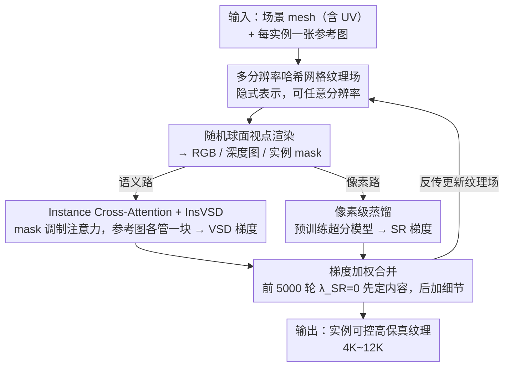

# CustomTex: High-fidelity Indoor Scene Texturing via Multi-Reference Customization

**会议**: CVPR 2026  
**arXiv**: [2603.19121](https://arxiv.org/abs/2603.19121)  
**代码**: [https://chenweilinx.github.io/CustomTex/](https://chenweilinx.github.io/CustomTex/)  
**领域**: 3D视觉  
**关键词**: 室内场景纹理, 多参考图像定制, 双蒸馏, VSD优化, 实例级控制

## 一句话总结
提出CustomTex框架，通过实例级的多参考图像驱动和双蒸馏训练策略（语义级VSD蒸馏+像素级超分蒸馏），实现3D室内场景的高保真、实例可控纹理生成，在语义一致性、纹理清晰度和减少"烘焙阴影"方面全面超越现有方法。

## 研究背景与动机
创建逼真的3D室内场景纹理是VR/AR、建筑可视化和电影制作的基石。**现有方法的痛点**：（1）**文字驱动方法**（SceneTex、TEXture等）语义模糊，无法传达精确视觉特征（如布料纹理、木纹、壁纸图案）；（2）即使用单张参考图做驱动也只能提供全局粗粒度控制；（3）纹理质量不足——模糊、伪影多，且扩散模型会学习训练数据的光照信息产生"烘焙阴影（baked-in shading）"，不适合不同光照渲染。

**核心矛盾**：扩散过程中语义控制和像素质量耦合——InstanceTex虽支持多文本实例级控制，但仍受文本精度和质量限制。**本文切入角度**：用多张参考图像（每个实例一张）替代文本，将"语义生成"和"像素增强"分离为两个独立蒸馏过程，在VSD框架下统一优化。

## 方法详解

### 整体框架
CustomTex 要解决的是"给定一个未纹理化的室内场景，怎么让每件家具都长成用户指定参考图那样、还干净清晰且不带烘焙阴影"。它不直接预测纹理像素，而是把一个隐式纹理场放进 VSD（Variational Score Distillation）优化循环里慢慢"雕"出来。输入是带 UV 展开的场景 mesh，加上每个实例各一张参考图。每轮迭代先从一个随机球面视点把当前纹理场渲成 RGB 图、深度图和实例 mask；接着两路蒸馏分别算梯度——语义这一路用 depth-to-image 扩散模型配合 Instance Cross-Attention 和 LoRA 给出 VSD 梯度，管"画的是不是参考图那个东西"；像素这一路用一个预训练超分模型给出 SR 梯度，管"画得够不够清晰"；最后两路梯度加权合并，反传更新隐式纹理场。整个过程把"生成什么"和"生成得多好"拆成两个互不干扰的信号源。

### 关键设计

**1. Instance Cross-Attention + InsVSD：让每个实例只对齐自己那张参考图**

文本驱动的老办法（SceneTex、TEXture）描述不出布料、木纹、壁纸这种精细视觉特征，单张全局参考图又只能粗粒度地影响整场。CustomTex 改用每实例一张参考图，并在注意力层面把它们"各管一块"。具体做法是用 IP-Adapter 抽出第 $i$ 个参考图的特征 $f^{ref}_i$，再用该实例的渲染 mask $m_i$ 在 feature 级别调制 cross-attention，把不同参考的贡献按区域加权汇总：

$$Z' = \frac{1}{N}\sum_{i=1}^N m_i \cdot \text{Softmax}\left(\frac{\mathbf{Q}\mathbf{K}_i^\top}{\sqrt{d_k}}\right)\mathbf{V}_i$$

这样第 $i$ 张参考图的信息只会流向画面上属于第 $i$ 个实例的像素，避免多张参考"串味"。纹理场的更新沿用 VSD 的交替优化：先冻结 LoRA、用 VSD 梯度 $\nabla_\theta\mathcal{L}_{\text{VSD}} = \mathbb{E}[\omega(t)(\epsilon_{\phi_d} - \epsilon_{\phi_{\text{LoRA}}})\frac{\partial\mathcal{T}}{\partial\theta}]$ 更新纹理参数 $\theta$，再冻结 $\theta$ 更新 LoRA $\phi$ 去拟合当前渲染分布。这里关键的取舍是 mask 加在哪一层——作者把它放在 feature 级而不是 noise 级，消融显示前者在物体边界处的光照明显更稳定，因为 feature 级调制能精确地把每张参考特征锚到对应实例区域，而不是事后在噪声上硬切。

**2. 像素级蒸馏：把超分做成梯度信号，而不是事后修一遍**

光有语义对齐还不够清晰——VSD 出来的纹理往往偏模糊、高频细节缺失。一个直觉做法是优化完再跑一遍超分（post-SR），但 UV 纹理是按 UV 展开排布的，没有自然图像那种语义结构，SR 模型直接对着 UV 图超分会失效。CustomTex 的解法是把预训练 SR 模型 $\phi_{SR}$ 也接进蒸馏循环，在每轮渲染出的自然视图上算一个 SR 梯度：

$$\nabla_\theta\mathcal{L}_{\text{SR}} = \mathbb{E}[\omega(t)(\epsilon_{\phi_{SR}} - \epsilon_{\phi_{\text{LoRA}}})\frac{\partial\mathcal{T}}{\partial\theta}]$$

它和语义梯度合成最终更新 $\nabla_\theta\mathcal{L} = \nabla_\theta\mathcal{L}_{\text{VSD}} + \lambda_{SR}\nabla_\theta\mathcal{L}_{\text{SR}}$。为了不让清晰度信号干扰早期的内容塑形，训练分两段：前 5000 次迭代 $\lambda_{SR}=0$ 只做语义蒸馏把"画什么"先定下来，之后 $\lambda_{SR}=1.2$ 才加入像素增强补细节。因为 SR 梯度始终作用在自然渲染视图上、再经渲染反传回纹理场，它绕开了"直接超分 UV 图"的难题，消融里集成式 SR 的 IQA（4.469）远高于 post-SR（2.959）。

**3. 多分辨率哈希网格纹理表示：用隐式场换任意分辨率与优化效率**

如果用固定分辨率的纹理贴图当被优化对象，分辨率写死、优化也慢。CustomTex 借 Instant-NGP 的多分辨率哈希网格做隐式纹理表示：UV 坐标先查多个尺度的网格、经 hash 映射取出各尺度特征并拼接，再过一个 Cross-Attention 解码器输出该点 RGB。因为是连续场，输出分辨率可在推理时任意指定，4K 纹理约 2.4 秒、12K 约 22 秒，比固定贴图既灵活又优化得更快。

### 损失函数 / 训练策略
最终更新由语义 VSD 梯度与像素 SR 梯度加权合成，交替优化纹理场 $\theta$ 和 LoRA $\phi$。时间步采用退火：前 5000 次 $t\sim U(0.02,0.98)$ 覆盖大噪声塑形整体，之后收窄到 $t\sim U(0.02,0.5)$ 精修细节。共 30000 次迭代、5000 个球面分布视点，纹理场学习率 0.001、LoRA 0.0001，单张 RTX A800 上约 48 小时。

## 实验关键数据

### 主实验
图像到纹理（10个3D-FRONT场景）：

| 方法 | CLIP-I↑ | CLIP-FID↓ | Q-Align IQA↑ | Q-Align IAA↑ |
|------|---------|-----------|-------------|-------------|
| **CustomTex** | **0.797** | **106.229** | **4.469** | **3.629** |
| SceneTex-IPA | 0.741 | 121.118 | 4.009 | 3.594 |
| Paint3D | 0.694 | 130.138 | 2.896 | 2.401 |
| HY3D-2.1 | 0.682 | 134.680 | 2.187 | 1.838 |

文本到纹理：

| 方法 | CLIP-T↑ | IS↑ | Q-Align IQA↑ |
|------|---------|-----|-------------|
| **CustomTex** | **0.766** | **3.311** | **4.252** |
| SceneTex | 0.639 | 3.009 | 3.824 |
| HY3D-2.1 | 0.734 | 2.381 | 2.774 |

### 消融实验

| 配置 | CLIP-I↑ | CLIP-FID↓ | Q-Align IQA↑ | 说明 |
|------|---------|-----------|-------------|------|
| post-SR | 0.746 | 114.612 | 2.959 | 后处理SR质量差 |
| w/o $\mathcal{L}_{SR}$ | 0.736 | 118.247 | 3.330 | 缺乏高频细节 |
| w/o multi-ref | 0.757 | 109.243 | 4.053 | 实例一致性下降+烘焙阴影 |
| w/o f-mask | 0.743 | 111.205 | 3.689 | 物体边界处光照不稳定 |
| **Full model** | **0.797** | **106.229** | **4.469** | 最优 |

### 关键发现
- **集成SR蒸馏 >> 后处理SR**：post-SR的IQA仅2.959 vs 完整模型4.469
- Feature-level mask比noise-level mask光照更稳定
- Multi-reference输入至关重要：拼接参考图导致无法区分实例
- 实例mask分解全局→局部生成是**减少烘焙阴影的关键**
- 用户研究（60人）中视觉质量和一致性评分均最高

## 亮点与洞察
- **"双蒸馏"解耦范式**：语义蒸馏负责"生成什么"，像素蒸馏负责"生成得多好"
- **Instance Cross-Attention精确对齐**：mask调制注意力实现参考图→实例区域的精准映射
- **减少烘焙阴影的洞察深刻**：实例mask分解全局为局部生成，阻止扩散模型跨图像形成统一光影
- 支持写实和艺术风格（Van Gogh、Cyberpunk）
- 推理高效：4K纹理仅2.4秒

## 局限与展望
- 训练耗时48小时（单GPU）
- 仅生成diffuse albedo纹理，不生成PBR材质（normal/roughness/metallic map）
- 依赖高质量UV展开
- 未来方向：加速训练、扩展到完整PBR材质生成

## 相关工作与启发
- 双蒸馏范式可推广到其他需同时保持语义正确和视觉质量的3D生成任务
- Instance Cross-Attention的设计可用于其他多实例/多区域条件化生成
- "SR集成到蒸馏vs后处理"的结论对SDS/VSD社区有参考价值
- GPT-4v生成参考图的text→image→texture管线提供新交互范式

## 评分
- 新颖性: ⭐⭐⭐⭐ 双蒸馏+Instance Cross-Attention组合方案有创新
- 实验充分度: ⭐⭐⭐⭐⭐ 定量+定性+用户研究+5组消融+闭源方法对比
- 写作质量: ⭐⭐⭐⭐ 结构清晰，消融分析深入，图表丰富
- 价值: ⭐⭐⭐⭐ 建立了实例级场景纹理定制新标杆，实用性强

<!-- RELATED:START -->

## 相关论文

- [\[CVPR 2026\] Catalyst4D: High-Fidelity 3D-to-4D Scene Editing via Dynamic Propagation](catalyst4d_highfidelity_3dto4d_scene_editing_via_d.md)
- [\[CVPR 2026\] HyperGaussians: High-Dimensional Gaussian Splatting for High-Fidelity Animatable Face Avatars](hypergaussians_high-dimensional_gaussian_splatting_for_high-fidelity_animatable_.md)
- [\[CVPR 2026\] High-Fidelity Mobile Avatars with Pruned Local Blendshapes](high-fidelity_mobile_avatars_with_pruned_local_blendshapes.md)
- [\[CVPR 2026\] TopoMesh: High-Fidelity Mesh Autoencoding via Topological Unification](topomesh_high-fidelity_mesh_autoencoding_via_topological_unification.md)
- [\[CVPR 2026\] Depth Peeling for High-Fidelity Gaussian-Enhanced Surfel Rendering](depth_peeling_for_high-fidelity_gaussian-enhanced_surfel_rendering.md)

<!-- RELATED:END -->
