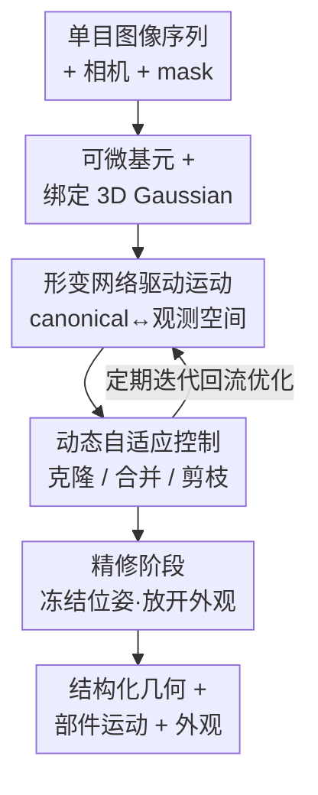

# D-Prism: Differentiable Primitives for Structured Dynamic Modeling

**会议**: CVPR 2026  
**arXiv**: [2604.17082](https://arxiv.org/abs/2604.17082)  
**代码**: https://zju3dv.github.io/d-prism/ (项目主页)  
**领域**: 3D视觉 / 动态重建  
**关键词**: 几何基元, 动态重建, 单目视频, 结构化建模, 3D Gaussian

## 一句话总结
D-Prism 把可微几何基元（superquadric）从静态场景拓展到动态域，用形变网络驱动基元做刚性运动、并给每个基元绑定 3D Gaussian 补外观，再配一套"克隆/合并/剪枝"的动态自适应控制，从单目视频里同时重建出**带部件分解**的结构化几何和精确的部件运动。

## 研究背景与动机
**领域现状**：从单目视频做动态重建，主流要么走 NVS 路线（NeRF / 4D 体素 / 形变 3DGS），只关心新视角渲染、给不出显式几何；要么走动态网格路线（如 DG-Mesh、Ub4D），把整个动态物体当成**一张连续的整体网格**来学。

**现有痛点**：整体网格表示有两个根本缺陷。一是没有**内在的部件分解**——它把多部件物体（魔方、可开合宝箱、铰接门）当成一坨连续曲面，无法表达"哪部分是哪部分"。二是在部件**接触/分离**这类拓扑变化时几何会退化，例如魔方某一面旋转时本应被建模成两个独立部件，整体网格根本处理不了。

**核心矛盾**：物体的"真实结构"往往只有在**运动中**才暴露（一个合上的箱子看着就是一个长方体，开盖后才显出两部件）。但能给出结构化分解的基元方法（cuboid / superquadric / 凸包）此前只在**静态**场景成功过，动态潜力无人探索；而把基元搬进动态场景，会让本就不稳的基元优化雪上加霜——单目动态下运动部件的观测更稀疏，静态方法那套"过于简单的自适应增删"无法在冗余和完整之间平衡，常导致建模质量退化甚至训练崩溃。

**本文目标**：第一个把结构化基元表示引入动态几何重建，要同时拿到 (1) 部件级结构化几何、(2) 精确的部件刚性运动、(3) 高质量外观，且保持帧间一致。

**核心 idea**：用"可微基元 + 形变网络驱动运动 + 绑定 3DGS 补外观 + 动态自适应控制管理基元集"这一套组合，把基元方法首次做进单目动态重建。

## 方法详解

### 整体框架
输入是一段标定好的单目图像序列 $I_{1:N}$（带时间戳、相机参数、物体 mask），输出是一组随时间运动的可微基元 $\mathcal{S}=\{P_1,\dots,P_K\}$，每个基元对应物体的一个刚性部件、并携带几何、运动与绑定的外观。整体可分四步串起来：先把每个基元参数化成可微的 superquadric 网格并在表面绑定 3D Gaussian（几何 + 外观各取所长）；再用一个形变网络把基元在**正则空间（canonical）↔ 观测空间**之间映射，从而控制它们的刚性运动；优化过程中用动态自适应控制（克隆 / 合并 / 剪枝）不断调整基元数量与分布，匹配物体真实的空间占据；主训练后再做一轮精修阶段，冻结基元正则位姿、放开绑定 Gaussian 的细节参数，进一步提升外观与几何质量。

### 关键设计

**1. 可微基元 + 绑定 3D Gaussian：几何用基元、外观用高斯，各取所长**

整体网格表达不了部件结构，而基元天生是"一物体 = 一组可解释零件"。每个基元 $P_i$ 用 superquadric 表示：基础形状是单位 icosphere，通过映射函数 $\mathcal{F}(\eta,\omega)$ 把球面顶点变换成目标形状——只靠两个形状参数 $\epsilon_1,\epsilon_2$ 和三个缩放参数 $s_1,s_2,s_3$ 就能表达长方体、椭球、圆柱等多种零件形态，参数连续因而整条表示可微。每个基元还带刚性运动参数：旋转 $R_i\in\mathbb{R}^6$（6D 旋转参数化，可与旋转矩阵互转）、平移 $T_i\in\mathbb{R}^3$、不透明度 $\alpha_i$，把基元从局部空间映到世界空间 $x_{\text{world}}=\text{rot}(R_i)x+T_i$。但纯 superquadric 只有粗糙外观，于是在基元**表面**绑定 3D Gaussian 补外观：初始化时按重心坐标在表面随机撒高斯中心，每个高斯的旋转 $R_v$ 由邻近三个固定高斯中心 $v_1,v_2,v_3$ 构造正交基（$r_1$ 对齐面法向），缩放 $S_v=\text{diag}(\tau_s,d_{\max},d_{\max})$ 中法向尺度 $\tau_s=1e{-8}$ 压成薄片贴在表面、面内尺度按到邻居的最大距离 $d_{\max}$ 覆盖局部三角片。主训练时高斯只优化 SH 外观系数、其余参数继承自宿主基元——几何归基元、外观归高斯，互不打架

**2. 基元形变网络：把"动起来"变成可微、可联合优化的映射**

直接给每个基元每帧学一个位姿变换会很不稳，尤其单目动态下运动部件观测稀疏。本文沿用动态重建里的形变网络思路，定义 $\mathcal{D}(\xi(T),\xi(t))=(\Delta T,\Delta R)$：输入是基元正则平移 $T$ 和时间戳 $t$ 的位置编码 $\xi$（投到高维傅里叶空间），输出该时刻的运动增量 $\Delta R\in\mathbb{R}^6,\Delta T\in\mathbb{R}^3$，形变后的基元写作 $P(T+\Delta T;R+\Delta R,\epsilon,s)$。一个关键假设是：既然每个基元固定对应物体某一部件，它的**形状和尺度随时间不变**，形变只更新运动参数——这把"部件做刚体运动"这一物理先验直接写进了表示，让运动学习更稳，也允许运动参数和其他基元参数**联合可微优化**。同时还配一个结构相同的**逆形变网络**，把观测空间的基元映回正则空间，保证两套空间里的基元一致（合并等操作后要用它回到 canonical）

**3. 动态基元自适应控制：克隆 / 合并 / 剪枝三件套对抗单目动态的不稳定**

静态方法那套简单的基元增删在动态场景里高度依赖初始化、极不稳定。本文借鉴 3DGS 的自适应思想，定制了一套每隔固定迭代（每 2k 步）执行的三操作。**克隆**：监控每个基元上 3D Gaussian 的梯度，若梯度超阈 $\tau_g=4e{-5}$ 的高斯比例超过 $\tau_p=0.15$，就标记克隆，让基元更好覆盖物体区域（尺度过大则先缩小再克隆）。**合并**：追求"用最少基元达到高完整度"，先算基元间在所有时刻平均的互重叠率，按"只向最高重叠邻居连边、且重叠超阈 $\tau_o$"构图，用连通分量分组；组内先剪掉体积小于组内最大体积 1/3 或与他人重叠超 80% 的基元，剩下的合成一个新基元（$T$ 取体积加权平均、其余属性取组内最大基元），再用逆网络映回正则空间。**剪枝**：删掉不透明度低于 $\tau_\alpha=0.3$ 的基元；并按体积排序，若相邻体积出现 $>10\times$ 的跳变，把跳变下界以下的全删。三者合力让基元集既不冗余也不缺件，显著提升对多样物体和运动模式的鲁棒性

### 损失函数 / 训练策略
总损失为 $\mathcal{L}=\mathcal{L}_{\text{gs}}+\mathcal{L}_{\text{mask}}+\lambda_{\text{over}}\mathcal{L}_{\text{over}}+\lambda_{\text{parsi}}\mathcal{L}_{\text{parsi}}+\lambda_{\text{vol}}\mathcal{L}_{\text{vol}}+\mathcal{L}_{\text{deform}}$。其中 $\mathcal{L}_{\text{gs}}$ 是 3DGS 渲染损失，$\mathcal{L}_{\text{mask}}$ 是基元网格光栅化 mask 与真值 mask 的差。沿用前作的 $\mathcal{L}_{\text{over}}$（防基元过度重叠）和 $\mathcal{L}_{\text{parsi}}$（压低冗余基元不透明度便于剪除）。$\mathcal{L}_{\text{vol}}=1/V$（$V$ 是 superquadric 体积的解析式，含 Gamma/Beta 函数）惩罚体积过小的基元，鼓励早期把基元长大、减少冗余。运动正则 $\mathcal{L}_{\text{deform}}=\lambda_{\text{smooth}}\mathcal{L}_{\text{smooth}}+\lambda_{\text{trans}}\mathcal{L}_{\text{trans}}+\lambda_{\text{back}}\mathcal{L}_{\text{back}}$：$\mathcal{L}_{\text{smooth}}$ 约束相邻帧运动增量平滑、防突变；$\mathcal{L}_{\text{trans}}$ 惩罚早期过大位移、防基元跑出边界；$\mathcal{L}_{\text{back}}$ 监督逆形变网络的前后向一致。训练用 Adam（lr=0.001，精修阶段 ×0.01），主训练与精修各跑 60k 迭代，单卡 NVIDIA 3090；损失权重 $\lambda_{\text{over}}=1,\lambda_{\text{parsi}}=0.1,\lambda_{\text{vol}}=0.05,\lambda_{\text{smooth}}=1,\lambda_{\text{trans}}=0.5,\lambda_{\text{back}}=0.01$。

## 实验关键数据

数据集为作者自建的 **Dynamic Primitive Dataset**（基于 PartNet-Mobility 用 SAPIEN 渲染的 6 个结构化物体：魔方、宝箱、门、钳子、折叠椅、墨镜，单目序列 + 每帧真值动态网格），并在 D-NeRF 数据集的类人案例上测通用性。

### 主实验
结构化运动跟踪精度（Tab.1，新提出的 metric，EPE 越低越好、$\delta_{3D}$ 越高越好），D-Prism 在大幅度长时运动上优势尤其明显：

| 物体 | 指标 | 本文 | DG-Mesh | MovingParts |
|------|------|------|---------|-------------|
| Rubik's Cube | EPE ↓ | **0.063** | 0.181 | 0.174 |
| Rubik's Cube | $\delta_{3D}^{.05}$ ↑ | **0.869** | 0.616 | 0.637 |
| Treasure Box | EPE ↓ | **0.006** | 0.069 | 0.168 |
| Treasure Box | $\delta_{3D}^{.05}$ ↑ | **0.998** | 0.672 | 0.243 |
| Door | EPE ↓ | **0.011** | 0.067 | 0.059 |
| Sunglasses | $\delta_{3D}^{.05}$ ↑ | **0.991** | 0.941 | 0.654 |

动态几何重建（Tab.2，CDd 单位 $10^{-3}$，越低越好）：D-Prism 虽以结构化表示牺牲了部分细节，几何精度仍领先：

| 物体 | 指标 | 本文 | DG-Mesh | Ub4D |
|------|------|------|---------|------|
| Rubik's Cube | CDd ↓ | **3.237** | 9.873 | 6.505 |
| Treasure Box | CDd ↓ | **1.848** | 4.737 | 9.732 |
| Door | CDd ↓ | **2.777** | 4.940 | 81.168 |
| Pliers | EMDd ↓ | **0.058** | 0.075 | 0.154 |

通用场景（D-NeRF 类人案例，Tab.3）：D-Prism 渲染质量略低于 DG-Mesh（如 Jumpingjacks PSNR 29.07 vs 31.77），但 LPIPS 反而更优（0.034 vs 0.045），且唯一能额外给出结构化几何表示。

### 消融实验
| 配置 | EPE ↓ | $\delta_{3D}^{.05}$ ↑ | CDd ↓ | 说明 |
|------|-------|-----------------------|-------|------|
| w/o deform（直接学每帧位姿） | 0.177 | 0.692 | 3.642 | 去掉形变网络，运动跟踪大幅退化 |
| w. deform（完整） | **0.063** | **0.877** | **3.237** | 形变网络显著提升运动建模 |

| 配置 | PSNR ↑ (Jumpingjacks) | PSNR ↑ (Mutant) | 说明 |
|------|----------------------|-----------------|------|
| w/o clone | 25.873 | 24.667 | 复杂细节区域缺基元，渲染变差 |
| w. clone | **29.069** | **26.518** | 克隆按需补基元，通用场景增益大 |

### 关键发现
- **形变网络是运动建模的命门**：相比直接给每基元每帧学位姿，形变网络把 Rubik's Cube 的 EPE 从 0.177 砍到 0.063（$\delta_{3D}^{.05}$ 0.692→0.877），且运动建准了几何也跟着变好。
- **合并阈值 $\tau_o$ 敏感、需折中**：$\tau_o$ 太高（如 1，只合全重叠）留下大量冗余基元；太低（如 0.3，30% 重叠即合）会把魔方退化成单个基元、过度简化躯干；论文推荐 $\tau_o=0.7\pm0.05$。该效果难量化，靠 Fig.5 可视化呈现。
- **克隆在结构化物体上不明显、在通用复杂场景下关键**：结构化物体初始基元够用，克隆增益小；但 D-NeRF 类人这种细节复杂的场景，缺克隆会让很多区域没合适基元、渲染明显下降（PSNR 掉 3+）。

## 亮点与洞察
- **"运动揭示结构"这一观察用得很巧**：合上的箱子是一个长方体、开盖才显两部件——作者直接把这个直觉做成方法论，用部件运动去**反推并恢复物体的真实结构**，这是整体网格路线根本做不到的。
- **几何/外观解耦绑定**：superquadric 管结构化几何、绑定 3DGS 管外观，且高斯被压成贴在基元表面的薄片（法向尺度 $1e{-8}$），让两种表示各司其职不互相拖累，是一个可复用的"结构基元 + 高斯外观"组合范式。
- **"部件刚体、形状不随时间变"的强先验**：让形变网络只需学运动增量 $(\Delta T,\Delta R)$、不碰形状尺度，既稳定又天然契合铰接/刚性物体，把物理先验直接编码进表示空间。
- **新 metric 补了评测空白**：以往只是把 CD/EMD 逐帧延伸，无法判断"预测部件是否和真值部件运动一致"；本文的 structured motion tracking accuracy（采点跟踪 + EPE/$\delta_{3D}$）直接量化运动建模质量，可迁移到其他动态部件评测。

## 局限与展望
- 作者承认：对**基元初始化敏感**，且难处理复杂拓扑（如环面 torus）以及稠密细长结构。
- 自己观察：依赖**给定的物体 mask 和运动范围**（初始化要数据集提供 bounded motion range），现实开放场景里这两者未必易得；数据集主体是合成的 PartNet-Mobility 物体，真实场景仅在补充材料里测，泛化性证据有限。
- 通用渲染质量（PSNR/SSIM）仍逊于 DG-Mesh，结构化是以损失细粒度几何细节为代价换来的，并非全面超越。
- 改进方向：作者计划扩展基元表达力、并通过训练学习基元间**层级化、骨架式**的关系；还设想用该方法评估生成视频的结构一致性，服务具身 AI / 世界模型。

## 相关工作与启发
- **vs DG-Mesh / Ub4D（动态网格）**：它们把动态物体建成一张整体网格，能做高逐帧精度但无部件分解、在接触/分离时几何退化；D-Prism 用结构化基元天然分部件，大运动（魔方面 360° 旋转、箱盖 180° 翻转）下运动与几何都稳得多，代价是细粒度几何细节略逊。
- **vs MovingParts / Shape of Motion / SP-GS（单目 NVS + 跟踪）**：这些只做新视角合成 + 运动跟踪、给不出显式结构化几何；D-Prism 在给出结构化几何的同时跟踪精度还更高。
- **vs DBW / PartGS / GaussianBlock（静态基元方法）**：前作把基元（含绑定高斯）只用在静态场景；D-Prism 是第一个把这套结构化表示拓展到动态域，并配套了形变网络与动态自适应控制来应对单目动态的稀疏观测与不稳定优化。

## 评分
- 新颖性: ⭐⭐⭐⭐⭐ 首个把可微结构化基元做进单目动态几何重建，"用运动揭示结构"切入角度新。
- 实验充分度: ⭐⭐⭐⭐ 自建数据集 + 新 metric + 多基线对比 + 消融齐全，但合并操作只能定性、真实场景仅在补充材料。
- 写作质量: ⭐⭐⭐⭐ 动机链条清晰、方法分层明确，公式与设计动机交代到位。
- 价值: ⭐⭐⭐⭐ 结构化 + 可编辑 + 可铰接（Blender 直接换运动），对场景编辑、具身 AI 有实用价值。

<!-- RELATED:START -->

## 相关论文

- [\[CVPR 2026\] UTrice: Unifying Primitives in Differentiable Ray Tracing and Rasterization via Triangles for Particle-Based 3D Scenes](utrice_unifying_primitives_in_differentiable_ray_tracing_and_rasterization_via_t.md)
- [\[CVPR 2026\] Differentiable Adaptive 4D Structured Illumination for Joint Capture of Shape and Reflectance](differentiable_adaptive_4d_structured_illumination_for_joint_capture_of_shape_an.md)
- [\[CVPR 2026\] 4D Primitive-Mâché: Glueing Primitives for Persistent 4D Scene Reconstruction](4d_primitive-mache_glueing_primitives_for_persistent_4d_scene_reconstruction.md)
- [\[NeurIPS 2025\] LinPrim: Linear Primitives for Differentiable Volumetric Rendering](../../NeurIPS2025/3d_vision/linprim_linear_primitives_for_differentiable_volumetric_rendering.md)
- [\[CVPR 2026\] EMGauss: Continuous Slice-to-3D Reconstruction via Dynamic Gaussian Modeling in Volume Electron Microscopy](emgauss_continuous_slice-to-3d_reconstruction_via_dynamic_gaussian_modeling_in_v.md)

<!-- RELATED:END -->
