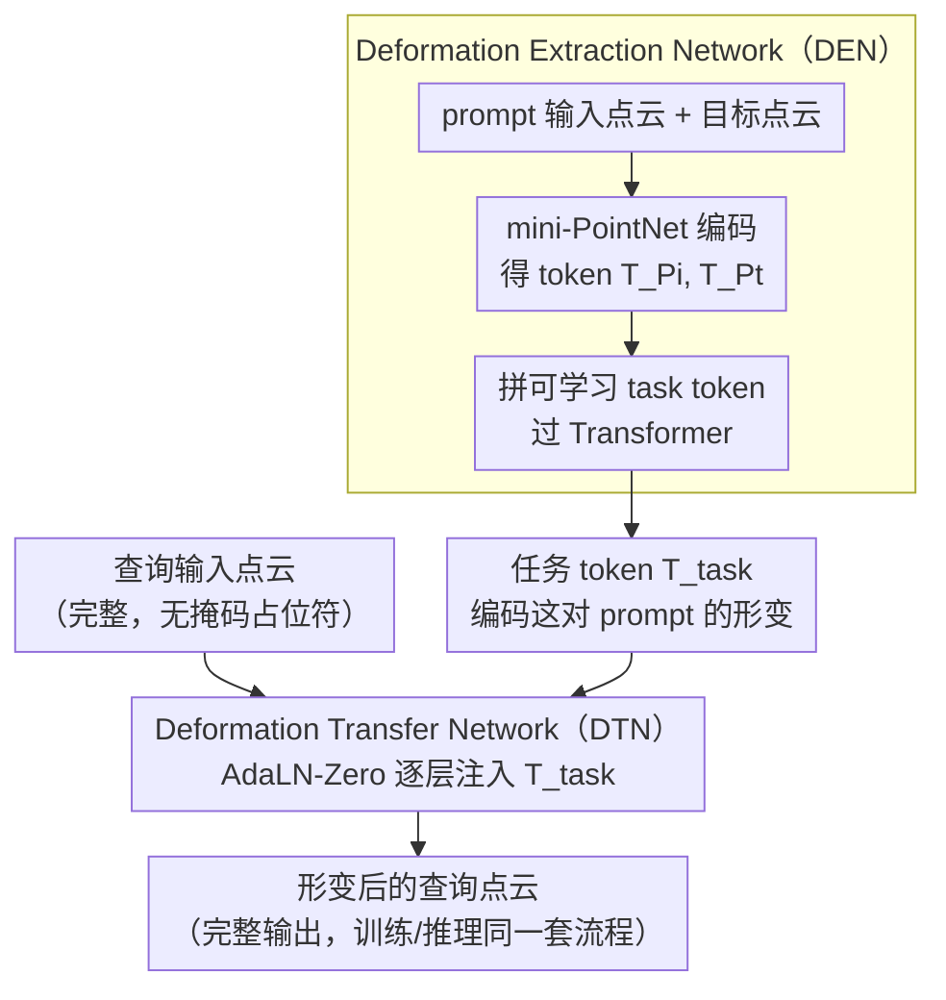

# Deformation-based In-Context Learning for Point Cloud Understanding

**会议**: CVPR 2026  
**arXiv**: [2604.02845](https://arxiv.org/abs/2604.02845)  
**代码**: [链接](https://github.com/linchengxing/DeformPIC)  
**领域**: 3D Vision  
**关键词**: 点云上下文学习, 形变网络, 几何推理, 掩码点建模, 多任务通用模型

## 一句话总结
提出 DeformPIC，将点云 In-Context Learning 从"掩码重建"范式重新定义为"形变迁移"范式，通过 Deformation Extraction Network 提取任务语义 + Deformation Transfer Network 迁移形变到查询点云，在重建/去噪/配准上分别降低 CD 1.6/1.8/4.7。

## 研究背景与动机
**领域现状**: 3D 点云 ICL 旨在通过少量示例让模型处理多种任务（重建、去噪、配准、分割）。当前方法（PIC, PIC++）基于 Masked Point Modeling (MPM)。

**现有痛点**: (1) **Geometry-free**: MPM 从无几何信息的掩码 token 预测目标点云，缺乏显式几何推理；(2) **训练-推理不匹配**: 训练时目标被部分掩码（可利用可见部分），推理时目标完全未知。

**核心矛盾**: 掩码 token 是抽象占位符，不编码几何对应关系，模型只能通过 self-attention 隐式推断空间结构。

**本文目标**: 让 ICL 具备显式的几何操作能力，并消除训练-推理目标的不一致。

**切入角度**: 将任务定义为"在 prompt 指导下对查询点云做形变"，形变天然保留几何连续性。

**核心 idea**: 从 prompt 对中提取任务特定的形变信息（DEN），再将其迁移应用到查询点云上（DTN）。

## 方法详解

### 整体框架
DeformPIC 想解决的是：点云 In-Context Learning 该怎么从一对 prompt（输入点云 → 目标点云）里读懂"这次要做什么任务"，再把这个任务原样套到查询点云上。它把整个过程拆成两步、两张网络来走。第一步由 Deformation Extraction Network（DEN）专门看 prompt：它读 prompt 的输入和目标，提炼出一个描述"这对点云之间发生了什么形变"的任务 token $\hat{T}_{\text{task}}$。第二步由 Deformation Transfer Network（DTN）接手：它拿着这个任务 token 当作"操作指令"，去调制一个 Transformer，让它对查询输入施加同样的形变，直接吐出形变后的点云。整条链路里没有任何掩码 token，输入输出都是完整点云，训练和推理走的是同一套流程。

### 关键设计

**1. Deformation Extraction Network：把"任务是什么"和"几何怎么算"拆开**

PIC/PIC++ 那一路把 prompt 和 query 拼在一起喂进同一个网络联合处理，但"从 prompt 里读出任务语义"和"对 query 做几何重建"其实是两件目标不同的事，混在一起反而互相牵扯。DeformPIC 把前者单独交给 DEN：用一个 mini-PointNet 分别把 prompt 的输入点云、目标点云编码成 token $T_{P_i}$、$T_{P_t}$，再拼上一个可学习的 task token，一起过 Transformer，输出提炼后的任务表示 $\hat{T}_{\text{task}} = \mathcal{E}([T_{\text{task}} \| T_{P_i} \| T_{P_t}])$。这样 DEN 只管回答"这对 prompt 体现了什么形变"，把几何重建留给下游，分工清晰也更高效。

**2. Deformation Transfer Network：用 AdaLN-Zero 把任务 token 逐层注入形变过程**

拿到任务 token 后，怎么让它真正"指挥"查询点云的形变？DTN 借用了 DiT 里的 AdaLN-Zero 条件化方式，把 $\hat{T}_{\text{task}}$ 注入 Transformer 的每一层：

$$h^{(l+1)} = h^{(l)} + \sigma^{(l)} \cdot \mathcal{A}[(1+\eta^{(l)}) \cdot \text{LN}(h^{(l)}) + \kappa^{(l)}]$$

其中缩放/偏移因子 $\sigma^{(l)}, \eta^{(l)}, \kappa^{(l)}$ 都是任务 token 经过一组零初始化的 MLP 现算出来的，逐层各不相同，因此能做到细粒度的、随深度变化的条件控制。零初始化意味着训练初期 $\sigma\approx0$，DTN 退化成一个无条件 Transformer，再慢慢学会用任务 token 去偏置形变——这让训练起步更稳，不会一开始就被随机的条件信号扰乱。

**3. 训练-推理一致性：彻底甩掉掩码，两端走同一条路**

MPM 范式有个根上的别扭：训练时目标点云被部分掩码，模型还能偷看可见的那部分；可推理时目标完全未知，于是训练和推理面对的输入根本不是一回事。DeformPIC 把任务重新定义成"对查询输入做形变"后，这个 mismatch 自然消失了——无论训练还是推理，DTN 接到的都是完整的查询输入点云，输出都是形变后的完整点云，全程没有掩码操作。形变本身又天然保持几何连续性，比从抽象掩码 token 凭空预测坐标更贴合 3D 数据的本质。

### 一个完整示例：把一对配准 prompt 套到查询上
以配准任务为例走一遍。给定一对 prompt：输入是一只姿态歪斜的飞机点云、目标是它摆正后的版本——这对点云之间的关系就是一次刚体旋转。DEN 先把这两片点云各编码成 token，连同 task token 过 Transformer，提炼出 $\hat{T}_{\text{task}}$，其中已经隐含了"该往哪个方向转多少"的形变信息。接着来一个全新的、同样歪斜的查询点云（比如一把椅子）。DTN 拿 $\hat{T}_{\text{task}}$ 算出每一层的 $\sigma/\eta/\kappa$，逐层调制查询 token 的更新，最终输出一片被"摆正"的椅子点云。整个过程查询从头到尾都是完整点云，没有任何掩码占位符，模型做的就是把 prompt 里学到的那次形变原样迁移过来。

### 损失函数 / 训练策略
- $L_2$ Chamfer Distance：$\mathcal{L} = \frac{1}{|\hat{R}|}\sum_{p \in \hat{R}} \min_{g \in R} \|p - g\|_2^2 + \frac{1}{|R|}\sum_{g \in R} \min_{p \in \hat{R}} \|g - p\|_2^2$
- AdamW + cosine decay，lr warmup 10 epochs，总训练 300 epochs，batch size 128

## 实验关键数据

### 主实验（ShapeNet In-Context Dataset, Chamfer Distance ×1000 ↓）

| 方法 | 重建 Avg | 去噪 Avg | 配准 Avg | 分割 mIoU↑ |
|------|---------|---------|---------|-----------|
| PIC-Cat | 4.3 | 5.3 | 14.1 | 79.0 |
| PIC-S-Cat | 6.9 | 6.5 | 24.1 | 83.8 |
| PIC-S-Sep | 5.1 | 12.0 | 6.7 | 83.7 |
| **DeformPIC** | **2.7** | **3.5** | **2.0** | **83.9** |

### 消融实验

| 对比 | 指标变化 | 说明 |
|------|---------|------|
| vs PIC-Cat (重建) | 4.3→2.7 (-1.6) | 形变优于掩码重建 |
| vs PIC-Cat (去噪) | 5.3→3.5 (-1.8) | 几何显式操作有效 |
| vs PIC-Cat (配准) | 14.1→2.0 (-12.1) | 配准本质是几何变换，形变天然匹配 |
| vs 任务特定 PCT | 2.6/2.2/6.3 vs 2.7/3.5/2.0 | ICL 在配准上远超任务特定模型 |

### 关键发现
- **配准任务提升最显著**(CD 14.1→2.0)，因为配准本质是刚体变换，形变范式天然匹配
- **分割性能保持 SOTA** (83.9 mIoU)，说明形变范式也能处理离散语义任务
- 在 ModelNet40 和 ScanObjectNN 跨域评估中同样取得 SOTA，泛化能力强
- 定性结果显示 DeformPIC 生成更完整、更精确的 3D 形状

## 亮点与洞察
- **范式转换**: 从"预测掩码内容"到"对输入做形变"，更符合 3D 数据的几何本质
- **训练-推理一致性**的重要性：消除 mismatch 后效果显著提升
- **解耦设计**（DEN 提取 + DTN 迁移）比联合处理更高效
- AdaLN-Zero 从 DiT 到点云 ICL 的成功技术迁移
- 配准任务的"天然匹配"：配准本质是几何变换，形变框架天然适配，CD 从 14.1 降至 2.0
- 在分割（离散语义任务）上也保持 SOTA，说明形变框架的通用性
- 跨域评估（ShapeNet→ModelNet40/ScanObjectNN）的强泛化能力验证了方法的稳健性

## 局限与展望
- 形变范式对部件分割等离散语义任务的适配不如连续几何任务自然
- 仅在合成数据集上做主要评估，真实世界点云上效果待验证
- 未探索更大规模的预训练
- DEN 和 DTN 使用独立编码器，共享编码可能进一步提升
- 单 prompt 对的信息可能不足，多 prompt 的 few-shot ICL 值得探索
- 形变幅度极大时（如从杯子变形为汽车）方法可能受限
- 训练 300 epochs 在大数据集上的扩展性有待验证

## 相关工作与启发
- 与 PIC/PIC++ 核心区别：掩码重建→形变迁移，联合→解耦
- Neural Deformation (FlowNet3D, Pixel2Mesh) 已证明形变策略的有效性
- AdaLN-Zero 来自 DiT，说明扩散模型中的条件化技术在其他领域同样有效
- DG-PIC、PCoTTA 使用迁移学习适配新场景，与 DeformPIC 正交互补

## 技术细节补充
- **点云采样**: 1024 点/对象，64 patches × 32 点/patch
- **Point Encoder**: mini-PointNet 将 point patches 映射为 tokens
- **AdaLN-Zero 初始化**: $W_1, W_2, W_3$ 零初始化，训练初期 DTN 等价于无条件 Transformer
- **5 个难度等级**: L1（轻微扰动）到 L5（高噪声/大角度旋转）
- **vs 任务特定模型**: 重建接近 (2.7 vs 2.5)，去噪有差距 (3.5 vs 2.2)，配准大幅超越 (2.0 vs 5.9)
- **端到端形变目标**: 直接预测形变后的点云坐标，避免位移场优化不稳定
- **训练配置**: AdamW，lr warmup 1e-6→1e-4 (10 epochs)，cosine decay，weight decay 0.05
- **对比方法**: 包括任务特定模型 (PointNet/DGCNN/PCT/ACT)、多任务模型、预训练多任务模型和 ICL 模型四大类
- **数据集规模**: 174,404 训练样本 + 43,050 测试样本，覆盖 4 任务 × 5 难度
- **单 GPU 训练**: NVIDIA TITAN RTX 24GB 即可完成全部训练

## 评分
- 新颖性: ⭐⭐⭐⭐⭐ 将点云 ICL 从掩码重建重新定义为形变迁移，范式创新
- 实验充分度: ⭐⭐⭐⭐ ShapeNet 全面 + 跨域评估，但真实世界场景有限
- 写作质量: ⭐⭐⭐⭐ 问题分析清晰，对比图直观
- 价值: ⭐⭐⭐⭐ 在点云 ICL 新兴方向上取得显著进步

<!-- RELATED:START -->

## 相关论文

- [\[CVPR 2026\] Mamba Learns in Context: Structure-Aware Domain Generalization for Multi-Task Point Cloud Understanding](mamba_learns_in_context_structure-aware_domain_generalization_for_multi-task_poi.md)
- [\[ECCV 2024\] DG-PIC: Domain Generalized Point-In-Context Learning for Point Cloud Understanding](../../ECCV2024/3d_vision/dg-pic_domain_generalized_point-in-context_learning_for_point_cloud_understandin.md)
- [\[CVPR 2026\] Adapting Point Cloud Analysis via Multimodal Bayesian Distribution Learning](adapting_point_cloud_analysis_via_multimodal_bayesian_distribution_learning.md)
- [\[CVPR 2026\] STS-Mixer: Spatio-Temporal-Spectral Mixer for 4D Point Cloud Video Understanding](sts_mixer_4d_point_cloud.md)
- [\[CVPR 2026\] PointINS: Instance-Aware Self-Supervised Learning for Point Clouds](pointins_instance-aware_self-supervised_learning_for_point_clouds.md)

<!-- RELATED:END -->
