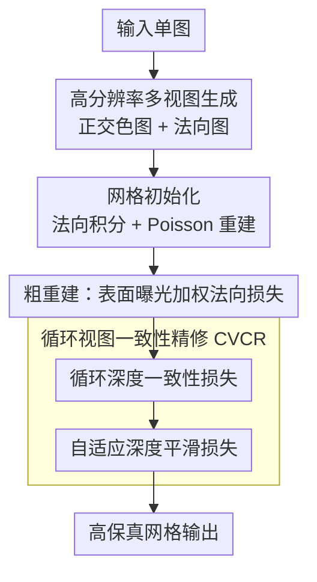

# Dehallu3D: Hallucination-Mitigated 3D Generation from a Single Image via Cyclic View Consistency Refinement

**会议**: CVPR 2026  
**论文**: [CVF Open Access](https://openaccess.thecvf.com/content/CVPR2026/html/Wang_Dehallu3D_Hallucination-Mitigated_3D_Generation_from_a_Single_Image_via_Cyclic_CVPR_2026_paper.html)  
**代码**: 无  
**领域**: 3D视觉  
**关键词**: 单图三维生成, 大重建模型幻觉, 网格优化, 深度一致性, 离群点度量

## 一句话总结
针对大重建模型把稀疏多视图"脑补"成离群结构（孔洞、突刺）这一幻觉问题，Dehallu3D 在单图到网格的重建流程后接一个即插即用的循环视图一致性精修模块（CVCR），用 360° 环绕的密集相邻视图深度一致性约束抹平离群点、同时用自适应平滑保留尖锐特征，并提出 ORM 指标专门量化离群程度，在 GSO 上几何与外观指标全面领先。

## 研究背景与动机

**领域现状**：从单张图生成 3D 内容是 AR/VR、3D 打印的关键能力。当前最受欢迎的范式不是直接用 SDS 蒸馏（DreamFusion 一类，慢且有 Janus 多面问题），也不是纯 3D 原生生成器（依赖模型硬学复杂结构、罕见物体易崩），而是 One-2-3-45 之后流行的"2D 扩散先生成多视图 → 多视图做 3D 重建"路线，质量和效率折中得最好。

**现有痛点**：这条范式有个被长期忽视的硬伤——大重建模型和别的大模型一样会"幻觉"。它从**稀疏**生成的多视图（通常只有四个正交视角）做重建，视角之间间隔大、不连续，模型就会在没有输入支撑的地方脑补出细节，表现为网格上的离群结构：奇怪的孔洞、突起、毛刺。这些离群点在 3D 打印里会直接导致成型失败，在游戏场景里会破坏沉浸感。

**核心矛盾**：幻觉的根源是**视角间的大间隙与不连续**。要消除离群点，自然想到"插值"——往稀疏视角之间塞密集中间视角、强制相邻视角间平滑过渡。但一旦过度强调跨视角一致性，又会把真实存在的尖锐几何特征（如尖刺、棱角）一起抹平，掉进 over-smoothing。所以真正的难点是：**既要用密集视角连续性消离群，又不能误伤尖锐特征**，二者是一对需要平衡的约束。

**本文目标 / 切入角度**：作者观察到一个物理事实——真实物体在 360° 环绕、相邻小角度视角下，其**深度图是连续一致的**；反过来，相邻视角间出现深度突变，往往就对应着网格上的离群点。于是把"消幻觉"转化为"强制相邻视角深度一致"，并配一个基于图像梯度的自适应平滑项来豁免尖锐区域。

**核心 idea**：用**循环视图一致性精修（CVCR）**——在密集环绕视角上约束相邻深度图一致来消除离群点，同时用图像梯度自适应地放松高梯度区的平滑惩罚来保住尖锐特征；并提出 **ORM** 指标第一次从"离群点"视角量化几何保真度。

## 方法详解

### 整体框架
Dehallu3D 是一个单图到网格的两阶段优化框架。输入一张图，先用现成的高分辨率多视图/法向生成器产出四个正交视角的彩色图与法向图，经 Poisson 重建得到一个拓扑大致正确的初始网格；随后进入两阶段优化：**(1) 粗重建**用可微渲染快速纠正全局拓扑，核心是一个"表面曝光加权法向损失"，让高可见度视角主导几何约束；**(2) CVCR 精修**是本文真正的贡献——它在 360° 环绕的密集视角上做循环深度一致性约束消离群，并用自适应深度平滑保细节。最后输出高保真网格。整个流程是 coarse-to-fine，CVCR 设计成即插即用，可挂到任意网格重建管线上、不挑初始化策略。

注意：ORM 是本文提出的**评测指标**（用于度量生成网格的离群程度），不在生成管线内，故不画进下面的流程图，单列为关键设计 4。

### 关键设计

**1. 表面曝光加权法向损失 $L_{SE}$：让高可见度视角主导粗重建**

粗重建阶段要快速把整体形状摆正，但四个正交视角对同一顶点的可观测性差别很大——某个视角里某顶点只露出很小一块投影面积，它提供的几何约束就不可靠，若一视同仁地融合各视角法向，低可见度视角的噪声会污染全局结构。$L_{SE}$ 的做法是按"投影面积"给每个视角对每个顶点的法向监督加权：

$$L_{SE} = \sum_{v\in V}\sum_{i}^{4} \epsilon_i^v \cdot \big\|N_v^R - N_i^v\big\|_2^2, \qquad \epsilon_i^v = m_i^v \cdot \frac{A_i^v}{\sum_j m_j^v A_j^v}$$

其中 $N_v^R$ 是渲染出的顶点 $v$ 法向，$N_i^v$ 是视角 $i$ 下的参考法向，$m_i^v\in\{0,1\}$ 是可见性掩码，$A_i^v$ 是顶点 $v$ 在视角 $i$ 下关联三角面的投影面积之和。投影面积大的视角通常对应网格核心区域、几何约束更强，权重 $\epsilon_i^v$ 就动态抬高它、压低低可见度视角。粗阶段总损失是 $L_{coarse}=L_{mask}+L_{normal}+L_{SE}$（前两项是常见的 alpha 掩码 MSE 与法向 MSE）。

**2. 循环深度一致性损失 $L_{DC}$：用 360° 环绕密集视角抹平离群**

这是消幻觉的主力。作者从"真实物体相邻小角度视角深度连续、深度突变即离群"的物理观察出发，把稀疏正交视角扩成一圈密集环绕视角，强制每个视角与其**循环相邻**视角的深度图对齐：

$$L_{DC} = \sum_{i=1}^{V}\Big[\,1 - \Delta\big(D_i^R,\, D_{i\bmod V+1}^R\big)\Big], \qquad \Delta(D_i^R,D_j^R)=\mathrm{SSIM}(D_i^R,D_j^R)\cdot \mathrm{CS}(D_i^R,D_j^R)$$

$V$ 是视角总数，设 $V=72$ 即相邻视角相差 $360^\circ/72=5^\circ$；$D_{i\bmod V+1}^R$ 是视角 $i$ 的循环下一邻居（最后一个绕回第一个，所以叫"循环"）。相似度 $\Delta(\cdot)$ 同时用 SSIM（结构对齐）和余弦相似度 CS（方向对齐），这样即便相邻深度图因角度偏移有像素级错位也仍鲁棒。与一般只在正交视角间做一致性的方法不同，CVCR 显式建模整圈相邻视角的循环关系，把稀疏视角间的断裂用密集中间视角补上、监督模型不去脑补离群结构。

**3. 自适应深度平滑损失 $L_{DS}$：放松尖锐区，避免一致性误伤细节**

光有 $L_{DC}$ 会过约束——它会把真实存在的尖锐特征（尖刺、棱角）也当成"不一致"抹平，导致 over-smoothing。$L_{DS}$ 用**彩色图像梯度**来自适应调节平滑强度：

$$L_{DS} = \sum_{i=1}^{V}\sum_{j,k} \big|\nabla D_i^{R(j,k)}\big|\cdot w_i^{j,k}, \qquad w_i^{j,k}=\exp\!\big(-\big\|\nabla I_i^{R(j,k)}\big\|_2\big)$$

$|\nabla D_i^{R(j,k)}|$ 是像素 $(j,k)$ 处深度梯度幅值（刻画深度变化强度），$\|\nabla I_i^{R(j,k)}\|_2$ 是同位置彩色图梯度幅值。关键在权重 $w_i^{j,k}$：彩色图梯度大的地方通常意味着真实的尖锐几何特征，此时 $w$ 被指数压小、平滑惩罚减弱，从而**保留**深度不连续；反之纹理平坦区 $w$ 大、平滑约束强，抹掉离群噪声。CVCR 精修阶段总损失为 $L_{CVCR}=L_{mask}+L_{normal}+\lambda_1 L_{DC}+\lambda_2 L_{DS}$。$L_{DC}$ 与 $L_{DS}$ 一收紧一豁免，正好对应"既要连续性消离群、又不能过平滑"的核心矛盾。

**4. ORM 离群风险度量：第一个从离群视角量化几何保真度的指标**

现有 CD、F-Score 等指标对"离群点"不敏感——少量离群结构对全局距离影响有限，却严重破坏可用性。作者借条件风险价值（CVaR）构造 ORM：先把网格转成点云，定义离群打分函数 $S(P)=S_l(P)+\lambda S_g(P)$，其中全局项 $S_g$ 取自一个 VAE 的重建损失，局部项 $S_l$ 用点的邻域密度比衡量：

$$S_l(P)=\frac{1}{P}\sum_{i=1}^{P}\frac{d_i^k}{\frac{1}{|N_i|}\sum_{p_j\in N_i} d_j^k}$$

$d_j^k$ 是点 $p_j$ 到其第 $k$ 近邻的距离，$k$ 距离越大密度越低、越可能是离群点。把每个点的 $S(P)$ 当作风险值，再取其分布的**尾部风险**（CVaR）作为该网格的最终 ORM。离群越多、尾部风险越高、ORM 越大，目标是生成低 ORM 的网格。⚠️ CVaR/VaR 的精确公式（式 8）与 $\lambda$ 取值以原文为准。

## 实验关键数据

数据集 GSO（Google Scanned Objects），物体统一在 Blender Cycles 下渲染为 512×512 输入，网格归一化到 $[-0.5,0.5]$ 包围盒。外观质量用 PSNR/SSIM/LPIPS/Clip-Sim，几何质量用 Chamfer Distance（CD）与 F-Score。全部实验在单张 RTX 4090 上完成。

### 主实验

与 6 个开源 SOTA（SF3D、Unique3D、CRM、InstantMesh、TripoSR、Wonder3D）对比，Dehallu3D 在外观+几何全部 6 个指标上都拿第一：

| 方法 | PSNR↑ | SSIM↑ | LPIPS↓ | Clip-Sim↑ | CD↓ | F-Score↑ |
|------|-------|-------|--------|-----------|-----|----------|
| Wonder3D | 20.4963 | 0.8908 | 0.1851 | 0.6970 | 0.02183 | 0.3580 |
| TripoSR | 20.5309 | 0.8897 | 0.1841 | 0.7146 | 0.02241 | 0.3847 |
| InstantMesh | 20.8954 | 0.8903 | 0.1749 | 0.7538 | 0.02198 | 0.4046 |
| CRM | 21.1265 | 0.8889 | 0.1720 | 0.7191 | 0.02163 | 0.3967 |
| Unique3D | 20.9795 | 0.8882 | 0.1742 | 0.7493 | 0.02175 | 0.4073 |
| SF3D | 21.3257 | 0.8912 | 0.1537 | 0.7463 | 0.02144 | 0.3765 |
| **Dehallu3D (Ours)** | **21.8407** | **0.8966** | **0.1453** | **0.7753** | **0.02023** | **0.4212** |

ORM 对比中（图 5）本文取得最低值，而 Unique3D 最高——与它在定量/定性实验里离群最严重一致，侧面验证了 ORM 与真实离群程度的一致性。

### 消融实验

逐项加 $L_{SE}/L_{DC}/L_{DS}$，三者全开为完整模型（表 2 节选）：

| $L_{SE}$ | $L_{DC}$ | $L_{DS}$ | PSNR↑ | CD↓ | F-Score↑ | 说明 |
|:---:|:---:|:---:|-------|-----|----------|------|
| ✗ | ✗ | ✗ | 16.8972 | 0.02572 | 0.3201 | 全去，最差 |
| ✓ | ✗ | ✗ | 17.6534 | 0.02449 | 0.3468 | 仅粗重建权重项 |
| ✗ | ✓ | ✗ | 20.9276 | 0.02217 | 0.3879 | 仅深度一致性，提升最大 |
| ✗ | ✗ | ✓ | 18.3124 | 0.02332 | 0.3545 | 仅平滑项 |
| ✗ | ✓ | ✓ | 21.1973 | 0.02114 | 0.4097 | CVCR 两项 |
| **✓** | **✓** | **✓** | **21.8407** | **0.02023** | **0.4212** | 完整模型 |

角度间隔消融（表 3）——CVCR 相邻视角夹角越密，质量越好但越慢：

| 角度间隔 | PSNR↑ | CD↓ | F-Score↑ | 耗时(s)↓ |
|---------|-------|-----|----------|---------|
| 3° | 21.8628 | 0.02030 | 0.4203 | 208.1 |
| **5°** | 21.8407 | 0.02023 | **0.4212** | 163.3 |
| 10° | 21.3687 | 0.02134 | 0.4118 | 129.5 |
| 15° | 20.8415 | 0.02221 | 0.3936 | 110.8 |

### 关键发现
- **$L_{DC}$（循环深度一致性）是贡献最大的单项**：单开它 PSNR 从 16.90 跳到 20.93、F-Score 从 0.32 到 0.39，远超单开 $L_{SE}$ 或 $L_{DS}$，印证"消离群"主要靠跨相邻视角的深度一致性约束。
- **$L_{DS}$ 单用反而不如 $L_{DC}$，但与 $L_{DC}$ 互补**：平滑项单开只到 18.31，但与 $L_{DC}$ 合用（21.20）比只用 $L_{DC}$（20.93）再涨，说明它的价值在于"保住尖锐特征不被一致性抹平"，是配角而非主力。
- **角度间隔是质量-效率旋钮**：3° 与 5° 质量几乎打平（F-Score 0.4203 vs 0.4212），但 3° 耗时多 27%（208s vs 163s），故作者选 5° 作为平衡点；间隔放到 15° 质量明显回落，验证"密集中间视角"确实是消离群的关键。

## 亮点与洞察
- **把"消幻觉"翻译成一条可优化的物理约束**：相邻小角度视角深度连续是真实物体的客观性质，作者直接把它写成损失，思路干净，比起"加更多 3D 先验"这类间接做法更对症。
- **一收一放的双损设计很巧**：$L_{DC}$ 强约束一致性、$L_{DS}$ 用图像梯度自适应豁免尖锐区，正好拆解了"消离群 vs 保细节"的 trade-off，且 $L_{DS}$ 的 $\exp(-\|\nabla I\|)$ 权重是个可复用的"边缘感知正则"trick。
- **ORM 填补了评测空白**：用 CVaR 尾部风险衡量离群，是 CD/F-Score 之外第一个专测离群的指标，可迁移到任何对局部异常敏感的点云/网格任务。
- **CVCR 即插即用**：不挑初始化、不挑重建管线，可作为现有单图转 3D 方法的后处理模块直接挂载。

## 局限与展望
- **推理偏慢**：5° 间隔下单物体 163s，密集渲染 72 个视角的优化开销不小；3° 更慢且收益边际，实时/批量场景受限。
- **依赖前置多视图生成器质量**：初始化和监督都来自现成 HR 多视图/法向生成器，若上游多视图本身严重不一致，CVCR 的"相邻一致性"假设可能被带偏。⚠️ 论文未充分讨论上游失败时的鲁棒性。
- **ORM 含可学习成分**：全局项 $S_g$ 取自一个 VAE 的重建损失，指标可比性可能依赖该 VAE 的训练分布；跨数据集做绝对数值比较时需谨慎。
- **仅在 GSO 上验证**：合成扫描物体相对干净，面对真实拍摄、强反光/透明物体的泛化性待考。

## 相关工作与启发
- **vs SDS 类（DreamFusion/Zero123）**：它们蒸馏 2D 扩散先验、有 Janus 多面问题且慢；本文走"多视图→重建"范式，不蒸馏、把问题定位在多视图不连续导致的离群，并直接在重建端修。
- **vs 3D 原生生成器（TripoSR/InstantMesh 等）**：原生生成器绕过多视图监督、但依赖模型硬学复杂结构，罕见物体易出细节缺失；本文保留多视图重建路线，用密集视角一致性补足其离群短板，实验中也全面超过这些 baseline。
- **vs 一般正交视图一致性方法**：本文的差别在"循环 + 密集 + 自适应平滑"——显式建模 360° 环绕相邻视角的循环关系，并用图像梯度豁免尖锐区，避免一致性约束把细节抹平。

## 评分
- 新颖性: ⭐⭐⭐⭐ 首次显式针对大重建模型的离群幻觉，循环深度一致性 + ORM 指标都是新东西。
- 实验充分度: ⭐⭐⭐⭐ 6 个 SOTA、外观+几何 6 指标全胜，损失/角度间隔消融到位；但仅 GSO 单数据集、缺真实场景。
- 写作质量: ⭐⭐⭐⭐ 动机—观察—方法链条清晰，公式完整；部分指标（ORM 的 VAE 全局项）细节略简。
- 价值: ⭐⭐⭐⭐ 即插即用模块 + 新评测指标对单图转 3D 社区实用，3D 打印/游戏资产落地价值明确。

<!-- RELATED:START -->

## 相关论文

- [\[CVPR 2026\] SmokeSVD: Smoke Reconstruction from A Single View via Progressive Novel View Synthesis and Refinement with Diffusion Models](smokesvd_smoke_reconstruction_from_a_single_view_via_progressive_novel_view_synt.md)
- [\[CVPR 2026\] Pano3DComposer: Feed-Forward Compositional 3D Scene Generation from Single Panoramic Image](pano3dcomposer_feed-forward_compositional_3d_scene_generation_from_single_panora.md)
- [\[CVPR 2026\] Text–Image Conditioned 3D Generation](text-image_conditioned_3d_generation.md)
- [\[CVPR 2026\] FISHuman: Fine-grained Single-image 3D Human Reconstruction via Multi-view 4D Remeshing](fishuman_fine-grained_single-image_3d_human_reconstruction_via_multi-view_4d_rem.md)
- [\[CVPR 2026\] VIAFormer: Voxel-Image Alignment Transformer for High-Fidelity Voxel Refinement](viaformer_voxel-image_alignment_transformer_for_high-fidelity_voxel_refinement.md)

<!-- RELATED:END -->
