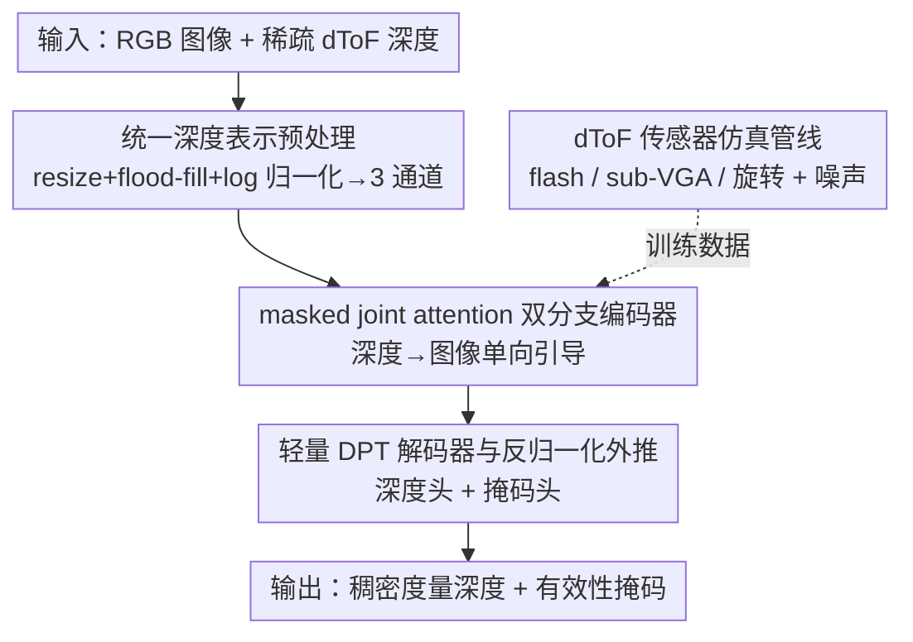

# Dense Metric Depth Completion from Sparse Direct Time-of-Flight Sensors

**会议**: CVPR 2026  
**论文**: [CVF Open Access](https://openaccess.thecvf.com/content/CVPR2026/html/Kim_Dense_Metric_Depth_Completion_from_Sparse_Direct_Time-of-Flight_Sensors_CVPR_2026_paper.html)  
**代码**: 作者承诺开源（论文与模型，附 project page），暂未给出仓库地址  
**领域**: 3D视觉  
**关键词**: 深度补全, dToF传感器, 度量深度, 零样本泛化, 跨模态融合  

## 一句话总结
针对直接飞行时间（dToF）传感器输出"极稀疏 + 低分辨率 + 噪声大"的深度图，本文用一个**深度引导双分支 ViT 编码器 + masked joint attention**，让稀疏深度单向地去引导 RGB 特征而不被 RGB 污染，再配一个轻量 DPT 解码器直接出稠密度量深度；训练完全靠一套覆盖 flash / 旋转 dToF 的仿真管线合成数据，最终在 6 个数据集、3 种真实 dToF 设备上零样本泛化，精度与之前 SOTA 相当或更好，但推理快 20×、显存省 10×。

## 研究背景与动机
**领域现状**：稠密度量深度是 VR/XR、机器人、3D 感知的刚需。单目深度基础模型（Depth Anything、MoGe 等）在野外泛化很强，但训练用的是 scale-invariant loss，只能给出相对深度，存在**尺度歧义**，在复杂真实场景里恢复不出稳定可靠的绝对度量深度。

**现有痛点**：常见补救办法是塞进稀疏 dToF 测量（LiDAR、低分辨率 ToF）来锚定真实尺度。但已有深度补全方法有两个硬伤：一是**绑死特定传感器**——为某一种采样模式（固定线数 LiDAR、固定分辨率 ToF）设计，换个设备、或者深度变得极稀疏 / 噪声大 / 采样不规则时性能就崩；二是**算得太重**——近期靠扩散（Marigold-DC）、迭代优化（OMNI-DC）、多阶段精修（PriorDA）冲精度的方法计算开销巨大，在移动端 / 实时场景没法用。

**核心矛盾**：现有方法把"稀疏深度当作辅助信号"、主要依赖预训练的单目编码器，没有真正建模 RGB 外观与几何测量之间**互补且互相约束**的结构。结果就是泛化性（跨设备、跨稀疏度）和效率（不靠重型精修）很难同时拿到。

**本文目标**：用**单个模型**覆盖各种稀疏 dToF 设备和极端稀疏 / 高噪声场景，且保持轻量。这分解为：(1) 怎么让稀疏深度真正"引导"图像特征而不是被淹没；(2) 怎么不靠扩散 / 迭代 / 多阶段精修也能出高质量稠密度量深度；(3) 配对训练数据极度稀缺，怎么解决。

**切入角度 + 核心 idea**：作者观察到，把两个模态简单拼接或用标准 cross-attention，会让不可靠的 RGB 线索反过来污染本来很准的稀疏深度。于是核心 idea 是——**用一个带方向掩码的 joint attention，只允许"深度 → 图像"的引导、屏蔽"图像 → 深度"的回流**，再用一套覆盖多种 dToF 形态的仿真管线把训练规模拉到百万级合成场景，从而训出一个 zero-shot 鲁棒的轻量模型。

## 方法详解

### 整体框架
输入是一张高分辨率 RGB 图 $I \in \mathbb{R}^{H\times W\times 3}$ 和一张稀疏深度图 $Z \in \mathbb{R}^{H\times W}$，目标是输出稠密度量深度 $\tilde{D} \in \mathbb{R}^{H\times W}$ 以及一张有效性掩码 $\tilde{M}$（标出天空 / 反光等不可靠区域）。整条管线分四步：先把异构的 dToF 深度**预处理成统一表示**并做 log 归一化；再用**双分支 ViT 编码器**分别编码 RGB 与稀疏深度，靠 **masked joint attention** 做受控融合；接着用**轻量 DPT 解码器**预测归一化深度和掩码，最后用预处理时记下的尺度参数**反归一化**还原度量深度。训练数据全部由一套 **dToF 仿真管线**合成。

### 关键设计

**1. 统一深度表示预处理：把五花八门的 dToF 深度对齐成 DINOv2 能吃的输入**

不同 dToF 设备分辨率、采样模式天差地别（点阵 / 低分辨率网格 / 线扫），直接喂网络没法泛化。本文先把传感器深度图和它的有效性掩码上采样到 RGB 分辨率，再用**最近邻插值 + flood-fill** 把缺失区域填成连续深度场（保留局部几何结构）；关键是**有效性掩码保持稀疏**，让网络能区分"真·传感器测量像素"和"插值填出来的像素"。

为了让深度分支也能复用 DINOv2 的预训练 ViT，作者把稀疏深度做了**对数归一化**，使其统计分布对齐 DINOv2 的 RGB 输入：

$$\alpha = \log(Z_{\max}) - \log(Z_{\min}), \quad \beta = \log(Z_{\min}), \quad \hat{Z} = (\log Z - \beta)/\alpha$$

其中 $Z_{\min}, Z_{\max}$ 是原始有效深度的最小 / 最大值。log 归一化能压缩大深度范围、稳定尺度变化，在噪声和离群点很多的仿真深度下依旧稳。归一化后把深度复制到前两个通道、第三通道放稀疏有效性掩码，凑成"三通道深度输入"（既给几何强度又给可靠性），再线性缩放到 $[-1,1]$。$\alpha, \beta$ 还会被记下来，供最后反归一化用。

**2. masked joint attention 双分支编码器：让深度单向引导图像、自己不被污染**

这是全文核心。编码器是两条并行的 ViT 分支（一条 RGB、一条归一化稀疏深度），但融合方式不是各管各、也不是标准 cross-attention，而是**带方向掩码的 joint attention**。具体做法是把图像 token 和深度 token 的查询 / 键 / 值先拼接起来联合计算：$Q=[Q_I; Q_Z]$，$K=[K_I; K_Z]$，$V=[V_I; V_Z]$，然后在注意力里乘一个方向掩码 $G$：

$$\text{Attention}(Q,K,V) = \text{softmax}\!\left(\frac{QK^{\top}\odot G}{\sqrt{d_k}}\right)V, \quad G=\begin{bmatrix} 1 & 1 \\ 0 & 1 \end{bmatrix}$$

掩码 $G$ 强制了**非对称信息流**：允许"深度 → 图像"注意（让准确的深度测量去引导、精修图像特征），但**屏蔽"图像 → 深度"注意**（防止不可靠的 RGB 线索倒灌污染稀疏深度表示）。这样既得到了 depth-aware 的图像嵌入，又保住了深度特征的纯净度——直击前面"现有方法让 RGB 污染稀疏深度"的痛点。

一个额外好处是：masked joint attention 的结构和原始 ViT 自注意力块几乎一致，整个编码器等价于两条同构 ViT 分支，于是**两条分支都能用 DINOv2 权重初始化**，把大规模预训练的视觉 / 几何先验注入进来，显著改善收敛和泛化。消融里这一掩码正是关键（见 Table 3）：去掉方向掩码、退化成普通 joint attention，平均 Rel 从 3.46 涨到 3.87。

**3. 轻量 DPT 解码器与反归一化外推：不靠重型精修直接出度量深度，还能超出传感器量程**

解码器沿用 DPT 架构，是两条轻量分支：一条预测单通道有效性掩码，一条预测稠密的**归一化深度** $\hat{D}$。为还原度量深度，用预处理时存下的 $\alpha, \beta$ 做反归一化：

$$\tilde{D} = \exp(\alpha \cdot \hat{D} + \beta)$$

巧妙之处在于 $\hat{D}$ **没有被约束在 $[0,1]$ 区间**，所以解码器可以把深度外推到原始传感器量程 $[Z_{\min}, Z_{\max}]$ 之外——在 dToF 完全没给测量的区域（远处、缺失返回）也能推出合理的度量深度。整条解码不需要扩散、不需要迭代优化、不需要多阶段精修，这正是它比 OMNI-DC / Marigold-DC / PriorDA 轻 1~2 个数量级的根本原因：表达力都压在了编码器的跨模态融合上，解码只做轻量重建。实现上解码器残差块特征维度被砍到 384/256/64/32/16 进一步提效。

**4. dToF 传感器仿真管线：合成百万级配对数据，喂出 zero-shot 鲁棒性**

真实"高分辨率 GT 深度 + dToF 测量"配对数据极少且多样性差，本文干脆从一大批大规模合成 RGB-D 数据集出发，**仿真出稀疏 dToF 深度**。它把设备分成两大家族并各自定制采样规则：(a) **flash dToF**——一次照亮全场景、由 SPAD 阵列分辨率决定的极稀疏点阵，随机采 64~10K 个点；还单独建模 **sub-VGA flash** 这种经板载后处理的低分辨率稠密图，用最近邻下采样保细结构、再随机腐蚀 / 膨胀边界、并用 Perlin 噪声给每个像素分配平滑变化的腐蚀半径，复现真实的边缘退化与软化。(b) **旋转 dToF**——按 Velodyne VLP-16/32 规格，随机采样水平 $0.33°$~$2°$、垂直 $0.1°$~$0.4°$、垂直视场 $-30°$~$30°$ 的射线方向，模拟线状扫描。

此外叠加一组**噪声增广**模拟真实退化：按深度幅值加高斯噪声、随机空间抖动、注入 0.2~1.0% 的离群点、以及 depth inpainting 增广（随机抠掉方块 / 边缘对齐区域 / Perlin 不规则掩码）来模拟遮挡和缺失返回。正是这套"传感器感知"的仿真，教会模型应对真实世界里高度不规则、设备相关的采样模式，是合成到真实迁移的关键。

### 损失函数 / 训练策略
总损失是四项等权之和：$\mathcal{L} = \mathcal{L}_1 + \mathcal{L}_g + \mathcal{L}_l + \mathcal{L}_m$。

- **深度加权 L1**：$\mathcal{L}_1 = \sum_{i\in\mathcal{M}} \frac{1}{d_i}|\tilde{d}_i - d_i|_1$，逆深度权重防止模型过拟合远端大深度值、强迫它在近端细结构区域估准。
- **全局 / 局部尺度不变损失**：L1 保度量正确但对几何形状不敏感，于是把预测和 GT 投影成 3D 点云，用 ROE solver 估全局尺度 $s$ 算 $\mathcal{L}_g$，再按图像分块、对每块估局部尺度 $s_j$ 算 $\mathcal{L}_l$，兼顾全局尺度一致与局部几何结构。
- **掩码损失**：$\mathcal{L}_m$ 用二元交叉熵训练有效性掩码头，识别天空 / 反光等无定义深度区域。

训练细节：编码器用 ViT-Small（DINOv2 初始化），取第 6、12 层中间特征喂 DPT 解码器；支持动态 token 数（RGB token 采样 [800,2000]，深度 token [800,1200] 以反映稀疏度）；AdamW，编码器 / 解码器学习率 $1\times10^{-5}$ / $1\times10^{-4}$，每 25k 迭代减半；前 50k 迭代低分辨率预热；最终在 8 卡 A100 上训 100k 迭代。

## 实验关键数据

> ⚠️ 本文主指标是相对误差 Rel $=\|\tilde{d}-d\|_1/d$（百分比，越低越好）和阈值精度 $\delta = \max(\tilde{d}/d, d/\tilde{d}) < 1.025$（越高越好），**并未报告 RMSE**；下表数值均为 Rel/δ，以原文 Table 1/3 为准。

### 主实验
零样本泛化：在真实传感器（KITTI-DC、ZJUL5）和模拟稀疏点（DDAD、DIODE、ETH3D、iBims-1）上对比，全部数据集均未参与训练。下表摘取代表性数据集与平均值 + 推理成本（A100）：

| 数据集 / 指标 | OMNI-DC | PromptDA(ViT-S) | PriorDA(ViT-B) | Marigold-DC | 本文(ViT-S) |
|--------------|---------|-----------------|----------------|-------------|-------------|
| KITTI-DC Rel↓ | **1.48** | 2.90 | 2.76 | 5.50 | 2.00 |
| ZJUL5 Rel↓ | 12.92 | 13.25 | 11.13 | 12.77 | **11.13** |
| ETH3D Rel↓ | 1.05 | 2.67 | 1.04 | 1.80 | **0.84** |
| **平均 Rel↓** | 3.77 | 5.09 | 3.99 | 6.11 | **3.46** |
| **平均 δ↑** | 79.0 | 66.3 | 74.5 | 59.1 | 77.9 |
| 推理时间↓ | 638 ms | 30 ms | 197 ms | 6470 ms | **34 ms** |
| 显存↓ | 3.49 GB | 0.40 GB | 1.62 GB | 5.71 GB | **0.44 GB** |

本文平均 Rel 最低（3.46），且在高分辨率 DSLR 的 ETH3D（2048×1365）和极低分辨率 dToF 的 ZJUL5（低至 8×8）上拿到最佳，说明在"深度比图像稀疏得多"时仍能准确重建度量深度。效率上比 OMNI-DC 快约 20×、省约 10× 显存，精度还相当或更好。

噪声鲁棒性（Table 2，Rel%，三种退化：空间偏移 spa. / 精度退化 deg. / 缺失孔洞 mis.，四数据集平均）：

| 方法 | spa. | deg. | mis. |
|------|------|------|------|
| OMNI-DC | 2.78 | 2.43 | 2.68 |
| PriorDA | 3.01 | 2.79 | 2.90 |
| Marigold-DC | 5.40 | 4.97 | 4.99 |
| **本文** | **2.12** | **2.02** | **2.23** |

三种退化下本文均最佳，说明对采集伪影的强韧性。

### 消融实验
架构消融（Table 3，平均 Rel / δ）：

| 配置 | Rel↓ | δ↑ | 说明 |
|------|------|------|------|
| Depth prompting | 4.07 | 73.6 | 仿 PromptDA，只在解码器 neck 注入深度 |
| Joint attention | 3.87 | 75.6 | 联合注意力但**无方向掩码** |
| Masked joint attention (Ours, ViT-S) | 3.46 | 77.9 | 完整模型 |
| Ours, ViT-B | 3.28 | 79.0 | 换更大骨干 |
| Ours, ViT-L | 3.07 | 80.1 | 最大骨干 |

### 关键发现
- **方向掩码是关键**：编码器级融合（joint attention 3.87）已胜过解码器级 depth prompting（4.07）；再加方向掩码（3.46）进一步提升——证明"屏蔽图像→深度回流"这一步实打实有用，不是花架子。
- **骨干可扩展**：ViT-S→B→L，Rel 3.46→3.28→3.07 单调下降，方法 size-agnostic；但作者特意主推 ViT-Small 强调效率——ViT-S 已经打过了用更大 ViT-B/L 的 PromptDA、PriorDA。
- **极端稀疏更占优**：在 100 个点的极稀疏区，本文精度最高，且随点数增加性能下降最小（Figure 6），说明对输入密度变化鲁棒。

## 亮点与洞察
- **"非对称信息流"是点睛之笔**：一个 $2\times2$ 的方向掩码 $G=[[1,1],[0,1]]$ 就把"让准的引导不准的、别让不准的污染准的"这条直觉编码进了注意力，简单到可以即插即用，迁移性极强——任何"一个模态可靠、另一个模态有噪声"的跨模态融合都能借鉴。
- **把表达力压进编码器、解码器尽量轻**：与"靠扩散 / 迭代 / 多阶段精修堆质量"的潮流反着来，证明只要编码端融合做得好，轻量 DPT 解码就够，换来 20× 速度优势——这是工程落地导向的清醒选择。
- **结构同构 = 免费的预训练初始化**：把融合层设计得和原始 ViT 自注意力块同构，于是深度分支也能直接吃 DINOv2 权重，几乎零成本地继承了大规模视觉先验。
- **仿真兜底数据稀缺**：完全不用真实 dToF 配对数据，纯合成训练却零样本泛化到 3 种真实设备，说明"把传感器物理特性建模进仿真"比"硬凑真实数据"更可扩展。

## 局限与展望
- 主指标只有 Rel 和 $\delta<1.025$，**未报告 RMSE / MAE 等绝对误差**，对"绝对几何精度到底多少毫米"读者难以直接判断（⚠️ 以原文为准）。
- 方向掩码假设"深度永远比 RGB 可靠"，但在 dToF 多径干扰、镜面 / 透明物体产生**错误深度**时这个假设可能反过来——此时屏蔽 RGB→深度回流是否还合理，论文未深究。
- 训练完全靠合成数据，仿真覆盖 flash / 旋转两大家族，但对仿真没建模到的新型传感器机制（如某些固态 LiDAR 扫描模式）泛化情况未知。
- 有效性掩码、尺度参数 $\alpha,\beta$ 都依赖预处理时的 $Z_{\min}/Z_{\max}$，当输入深度本身离群严重、min/max 估计被污染时，反归一化外推是否稳定值得进一步分析。

## 相关工作与启发
- **vs PromptDA / DepthPrompting**：它们把单目深度基础模型塞进补全管线、但在**解码器层**注入深度（depth prompting），且绑定特定传感器配置。本文在**编码器层**用 masked joint attention 融合，消融证明编码器级融合（3.46）显著优于解码器级 prompting（4.07），且单模型跨设备泛化。
- **vs Marigold-DC / DepthLab（扩散类）**：扩散方法泛化好但对噪声和极稀疏敏感、计算极重（Marigold-DC 6470 ms）。本文不用扩散，34 ms 出结果，噪声鲁棒性还更强。
- **vs OMNI-DC / OGNI-DC（迭代优化类）**：推理时迭代精修换鲁棒性但运行时开销大（OMNI-DC 638 ms / 3.49 GB）。本文一次前向，快 20× 省 10× 显存而精度相当或更好。
- **vs PriorDA（多阶段精修）**：粗对齐 + 细精修两阶段管线昂贵。本文靠强编码器 + 轻解码器一步到位。

## 评分
- 新颖性: ⭐⭐⭐⭐ 方向掩码 joint attention 简单但切中要害，仿真管线扎实；单点创新而非范式级突破
- 实验充分度: ⭐⭐⭐⭐⭐ 6 数据集 + 3 真实设备零样本，覆盖稀疏度 / 噪声 / 骨干多维消融，效率对比详实
- 写作质量: ⭐⭐⭐⭐ 方法清晰、图示到位；主指标缺 RMSE 略可惜
- 价值: ⭐⭐⭐⭐⭐ 轻量 + 跨设备 + 高精度，对 VR/XR、机器人、移动端 dToF 落地价值高

<!-- RELATED:START -->

## 相关论文

- [\[CVPR 2026\] The Midas Touch for Metric Depth](the_midas_touch_for_metric_depth.md)
- [\[CVPR 2026\] MD2E: Modeling Depth-to-Edge Cues for Monocular Metric Depth Estimation](md2e_modeling_depth-to-edge_cues_for_monocular_metric_depth_estimation.md)
- [\[CVPR 2026\] Radar-Guided Polynomial Fitting for Metric Depth Estimation](radar-guided_polynomial_fitting_for_metric_depth_estimation.md)
- [\[CVPR 2026\] Rethinking Dense Optical Flow without Test-Time Scaling](rethinking_dense_optical_flow_without_test-time_scaling.md)
- [\[CVPR 2026\] Zero-Shot Depth Completion with Vision-Language Model](zero-shot_depth_completion_with_vision-language_model.md)

<!-- RELATED:END -->
