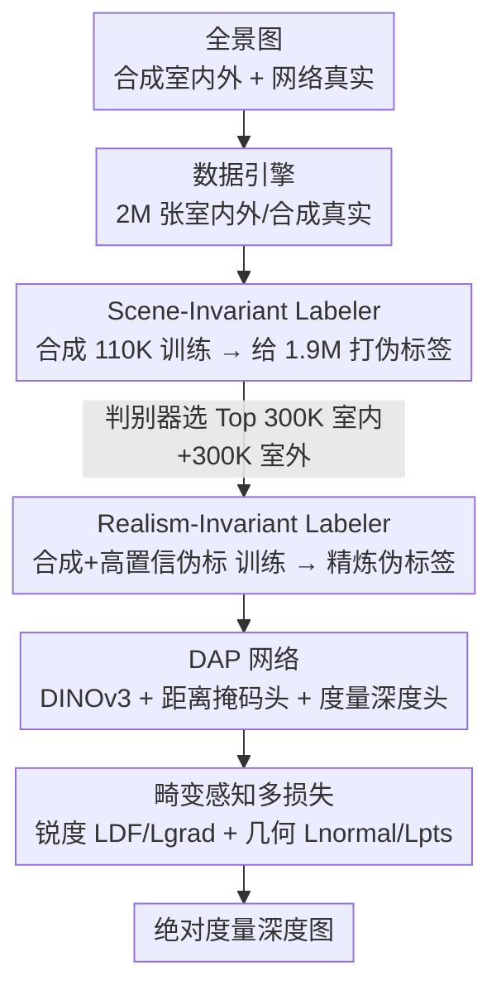

# Depth Any Panoramas: A Foundation Model for Panoramic Depth Estimation

**会议**: CVPR 2026  
**论文**: [CVF Open Access](https://openaccess.thecvf.com/content/CVPR2026/html/Lin_Depth_Any_Panoramas_A_Foundation_Model_for_Panoramic_Depth_Estimation_CVPR_2026_paper.html)  
**代码**: https://insta360-researchteam.github.io/DAP_website/ (项目页)  
**领域**: 3D视觉  
**关键词**: 全景深度估计, 度量深度, 基础模型, 伪标签, 等矩形畸变  

## 一句话总结
本文提出 DAP（Depth Any Panoramas），一个全景**度量**深度（metric depth）基础模型：用「数据闭环」思路把 2M 张室内外/合成真实全景图喂进一个三阶段伪标签蒸馏管线，再配上 DINOv3 骨干 + 即插即用的距离掩码头 + 一套畸变感知的几何/锐度损失，在 Stanford2D3D、Matterport3D、Deep360 等多个 benchmark 上实现零样本 SOTA，尤其在室外远景/天空区域给出稳定的绝对尺度预测。

## 研究背景与动机
**领域现状**：全景图覆盖完整的 360°×180° 视野，对机器人导航、避障等空间智能任务价值很大。现有全景深度方法分两类——一类是相对/尺度无关深度（PanDA、Depth Anywhere、DA2），另一类是统一度量深度框架（DAC、UniK3D）。

**现有痛点**：这两类方法都难以泛化到多样的真实场景，**尤其是室外**。根因在于全景深度数据「又少又窄」：采集和标注成本高，导致训练集规模小、域覆盖单一（要么只有室内、要么只有合成）。如表 1 所示，之前方法数据量最多 80 万张，且基本不含真实室外标注。

**核心矛盾**：要做泛化强的基础模型必须靠数据 scaling，但全景深度的真值（尤其室外远景的绝对尺度）几乎无法大规模标注——**「需要海量可靠真值」与「真值无法廉价获取」之间存在根本矛盾**。同时模型本身也要能消化这种规模、并处理等矩形投影（ERP）的非均匀畸变。

**本文目标**：拆成两个子问题——(1) 如何构建带可靠高质量真值的大规模数据集；(2) 如何设计能吃下这种数据规模、且跨视角几何一致的模型。

**切入角度**：作者采用「data-in-the-loop（数据闭环）」范式，从数据构建和框架设计两端同时发力：用模型自己产出的伪标签来补足缺失的真值，再用筛选过的高置信伪标签反哺训练。

**核心 idea**：用「三阶段渐进式伪标签蒸馏」把 1.9M 无标注全景图变成可训练监督，配合 DINOv3 骨干 + 距离掩码头 + 畸变感知损失，把全景度量深度做成一个跨室内外、跨合成真实的统一基础模型。

## 方法详解

### 整体框架
DAP 由三大组件构成：一个跨合成/真实域的**大规模数据引擎**（Sec 3.1）、一个把无标注数据榨干的**三阶段伪标签管线**（Sec 3.2）、以及一个几何一致的**网络设计 + 多损失优化**（Sec 3.3）。

输入是一张全景图（ERP 表示，训练分辨率 512×1024），输出是一张稠密的**绝对度量深度图**（米为单位，无需后处理对齐尺度）。中间的关键转化是：数据引擎先攒出约 2M 张图（90K 有标注 + 1.9M 无标注），三阶段管线用两个逐步增强的 Labeler 给无标注图打可靠伪标签，最后 DAP 在「全部标注 + 精炼伪标注」上联合训练。

### 关键设计

**1. 大规模数据引擎：用模拟器 + 生成模型 + 网络爬取凑出 2M 张全景图**

针对「全景深度数据又少又窄」的痛点，作者把四类来源拼成 DAP-2M。有标注侧：室内用 Structured3D（约 1.8 万张带真值），室外靠 UE5 的 AirSim360 模拟器渲染——模拟无人机中低空航迹飞过 New York City、SF City、Downtown West、City Park、Rome 五个代表性场景，拿到 90K 张像素对齐深度的全景帧（称 DAP-2M-Labeled），专门补足室外监督的稀缺。无标注侧：从网络收 25 万段全景视频抽帧、过滤掉地平线不合理的样本后得到 1.7M 张高质量图，再用 Qwen2-VL 自动分室内/室外（约 250K 室内 + 1.45M 室外）；由于真实室内全景仍偏少，又用 SOTA 全景生成模型 DiT360 补 200K 张室内图，合成 1.9M 的 DAP-2M-Unlabeled。最终规模约 2M，是之前方法的 2~3 倍，且**首次同时大规模覆盖室内/室外 × 合成/真实**四个象限。

**2. 三阶段渐进式伪标签管线：先学跨场景、再学跨真实感、最后蒸馏到 DAP**

针对「无标注图无法直接训练 + 合成与真实/室内与室外存在域差」，作者设计了逐级精炼的三阶段流程。**Stage 1（Scene-Invariant Labeler）**：在 20K 合成室内 + 90K 合成室外（都有准确度量真值）上训练第一个 Labeler，目标是学到跨室内外都成立的、物理 grounded 的深度线索，而不是过拟合到某种布局/光照，从而给真实图产出可靠初始伪标签。**Stage 2（Realism-Invariant Labeler）**：先训一个 PatchGAN 风格的深度质量判别器（把合成真值当 real、把 Stage-1 输出当 fake），让它学到「场景无关」的质量先验；再用 Stage-1 Labeler 给所有真实无标注图打标，用判别器排序后挑出 Top 300K 室内 + 300K 室外高置信样本，与合成数据混合训练第二个 Labeler——这一步让 Labeler 摆脱合成纹理/光照的束缚，对真实外观变化更鲁棒。**Stage 3（DAP Training）**：用 Realism-Invariant Labeler 精炼后的 1.9M 伪标签 + 之前的标注数据联合训练最终的 DAP 模型，把大规模半监督的收益沉淀进基础模型。这套「质量先验筛选 → 高置信子集再训练」的循环，正是 data-in-the-loop 的落点。

**3. 即插即用距离掩码头：用多个距离阈值掩码缓解深度分布不均**

针对全景场景跨度极大（室内几米到室外上百米）导致深度分布严重不均、远景/天空区域预测易崩的问题，作者在 DINOv3-Large 骨干上并联两个 task head：一个**度量深度头**预测稠密深度 $D$，一个**距离掩码头**输出二值掩码 $M$ 标记某距离阈值下的有效空间区域。掩码头提供 10m/20m/50m/100m 四个即插即用版本，可按场景尺度灵活切换。每个掩码头用加权 BCE + Dice 联合监督：

$$L_{mask} = \|M - M_{gt}\|^2 + 0.5\, L_{Dice}(M, M_{gt})$$

最终输出是 $M$ 与 $D$ 的逐元素相乘 $M \odot D$，从而把不可靠的远景预测过滤掉、保证结果在不同距离范围内物理有效且尺度一致。消融显示去掉掩码头会明显掉点（见表 6），100m 版本综合最优。

**4. 畸变感知的锐度 + 几何双路损失：补偿 ERP 非均匀像素并保证跨视角一致**

针对等矩形投影（ERP）在两极过采样、像素几何非均匀，以及单纯 SILog 难以恢复边缘细节与跨视角几何的问题，作者在 SILog 之外加了两组互补损失。**锐度侧**：$L_{DF}$（Dense Fidelity）先把深度图用正二十面体顶点的虚拟相机分解成 $N=12$ 个透视 patch（避开两极拉伸），在每个无畸变视图上算预测与真值的 Gram 相似度并取平均，$L_{DF} = \frac{1}{N}\sum_k \| D^{(k)}_{pred} D^{(k)\top}_{pred} - D^{(k)}_{gt} D^{(k)\top}_{gt}\|_F^2$，强化局部锐度；$L_{grad}$ 则用 Sobel 算子在 ERP 域取梯度幅值、对真值梯度阈值化得到边缘掩码 $M_E$，只在边缘区域算 SILog：$L_{grad} = L_{SILog}(M_E\odot D_{pred}, M_E\odot D_{gt})$，直接保边界不连续。**几何侧**：$L_{normal}$ 把深度转成表面法向并取 L1 距离，$L_{pts}$ 把深度投到球坐标得到 3D 点云再取 L1，二者强制跨视角几何一致。总目标乘上畸变图 $M_{distort}$ 来补偿两极过采样、平衡球面上的梯度贡献：

$$L_{total} = M_{distort}\odot\big(\lambda_1 L_{SILog} + \lambda_2 L_{DF} + \lambda_3 L_{grad} + \lambda_4 L_{normal} + \lambda_5 L_{pts} + \lambda_6 L_{mask}\big)$$

权重取 $\lambda_{1\sim6} = 1.0, 0.4, 5.0, 2.0, 2.0, 2.0$。

### 损失函数 / 训练策略
- 总损失即上式 $L_{total}$，骨干学习率 5e-6、解码器 5e-5，Adam 优化器。
- Scene-Invariant Labeler 用 UniK3D 预训练权重初始化；Realism-Invariant Labeler 与 DAP 同架构。
- 训练分辨率 512×1024，数据增强含 color jittering、水平平移、翻转；实验在 H20 GPU 上完成。

## 实验关键数据

### 主实验
三个 benchmark 的**零样本**度量深度对比（DAP 直接预测绝对尺度，无需后处理对齐；尺度无关方法需真值对齐尺度，仅作参考）：

| 数据集 | 指标 | DAP(本文) | DAC | UniK3D |
|--------|------|-----------|-----|--------|
| Stanford2D3D(室内) | AbsRel↓ / δ1↑ | **0.0921 / 0.9135** | 0.1366 / 0.8393 | 0.1795 / 0.7823 |
| Matterport3D(室内) | AbsRel↓ / δ1↑ | **0.1186 / 0.8518** | 0.1803 / 0.7203 | 0.2224 / 0.6634 |
| Deep360(室外) | AbsRel↓ / RMSE↓ / δ1↑ | **0.0659 / 5.224 / 0.9525** | 0.2611 / 8.371 / 0.6311 | 0.0885 / 6.148 / 0.9293 |

在作者新建的室外 benchmark DAP-Test（1,343 张高质量室外标注图）上提升更夸张：

| 方法 | AbsRel↓ | RMSE↓ | δ1↑ |
|------|---------|-------|-----|
| DAC | 0.3197 | 8.799 | 0.5193 |
| UniK3D | 0.2517 | 10.56 | 0.6086 |
| **DAP(本文)** | **0.0781** | **6.804** | **0.9370** |

AbsRel 从 0.2517 直接压到 0.0781，δ1 从 0.6086 升到 0.937，验证数据 scaling + 统一框架在室外的优势。

### 消融实验
组件消融（在 Stanford2D3D / Deep360 上逐步叠加）：

| 配置 | Stanford2D3D AbsRel↓ / δ1↑ | Deep360 AbsRel↓ / δ1↑ | 说明 |
|------|---------------------------|----------------------|------|
| baseline(仅 SILog) | 0.1166 / 0.8409 | 0.0942 / 0.8396 | 起点 |
| + 畸变图 | 0.1149 / 0.8440 | 0.0926 / 0.8423 | 稳定 ERP 畸变下的优化 |
| + 几何损失(Lnormal+Lpts) | 0.1112 / 0.8509 | 0.0880 / 0.8592 | 提升结构一致性 |
| + 锐度损失(LDF+Lgrad) **Full** | **0.1084 / 0.8576** | **0.0862 / 0.8719** | 完整模型最优 |

距离掩码头阈值消融（DAP-2M-Labeled / Deep360）：

| Mask 阈值(m) | DAP-2M-Labeled AbsRel↓ / δ1↑ | Deep360 AbsRel↓ / δ1↑ | 说明 |
|------|------------------------------|----------------------|------|
| 10 | 0.0801 / 0.9315 | 0.0934 / 0.8493 | 近景最强 |
| 20 | 0.0823 / 0.9164 | 0.0873 / 0.8668 | — |
| 50 | 0.0864 / 0.9104 | 0.0843 / 0.8594 | — |
| 100 | 0.0793 / 0.9353 | 0.0862 / 0.8719 | 综合最优 |
| ✗(去掉掩码) | 0.0832 / 0.9042 | 0.0938 / 0.8411 | 明显掉点 |

### 关键发现
- 四类损失逐级叠加每一步都涨点，其中**锐度损失（LDF+Lgrad）贡献边界与细节**、**几何损失（Lnormal+Lpts）贡献全局结构**，二者互补；畸变图单独带来小幅但稳定的提升。
- **距离掩码头不可省**：去掉后室内外都掉点，10m/20m 偏好近景、100m 综合最优，说明用距离阈值过滤不可靠远景能稳住训练。
- DAP 直接输出绝对尺度却能与「需真值对齐尺度」的尺度无关方法（如 DA2）打得有来有回，凸显大规模数据 scaling 对度量深度的价值。
- 室外/天空/远景是之前方法的重灾区（UniK3D 在远景常结构崩塌），DAP 在这些区域保持鲁棒的度量一致性。

## 亮点与洞察
- **data-in-the-loop 的工程化落地**：不是简单堆数据，而是「模拟器补室外 + 生成模型补室内 + 判别器筛高置信伪标签」三管齐下，把无法标注的真值用模型自产+筛选闭环补齐，思路可迁移到任何「真值贵、无标注多」的稠密预测任务。
- **判别器当质量先验做伪标签筛选**：用 PatchGAN 判别器学「场景无关的深度质量」来排序挑 Top 样本，比简单置信度阈值更鲁棒，是半监督蒸馏里值得复用的 trick。
- **即插即用距离掩码头**：把「不同尺度场景」显式解耦成多个阈值掩码，推理时按需切换，既缓解深度分布不均又给了部署灵活性。
- **正二十面体 12 视图分解算锐度损失**：用无畸变透视 patch 绕开 ERP 两极拉伸来监督细节，是处理全景畸变的巧妙手段。

## 局限与展望
- **强依赖伪标签质量**：整条管线的上限被 Scene-Invariant Labeler 的初始能力 + 判别器筛选准确度卡住，若初始 Labeler 在某类场景系统性偏差，错误会被放大进 DAP。⚠️ 论文未给出伪标签错误率的量化分析。
- **室外真值仍主要来自合成**：90K 有标注室外全来自 UE5 模拟器，真实室外的绝对尺度真值依旧稀缺，sim-to-real gap 是否完全消除存疑。
- **判别器、Stage-2 细节放在补充材料**：质量判别器的具体结构与训练细节正文未展开，复现门槛偏高。
- **改进方向**：可探索把伪标签筛选做成多轮迭代（而非固定三阶段）、或引入不确定性估计动态调整伪标签权重。

## 相关工作与启发
- **vs DAC（Depth Any Camera）**: DAC 用 ERP 统一各种成像几何 + 几何驱动增强做通用度量深度，但训练数据以透视图为主、真实室外覆盖弱；DAP 直接做原生全景的大规模数据引擎，在室外（Deep360/DAP-Test）大幅领先。
- **vs UniK3D**: UniK3D 用球坐标 + 谐波射线表示提升宽 FoV 泛化，在 Deep360 上表现不错，但泛化到多样真实室外时远景/天空易崩；DAP 靠数据 scaling + 距离掩码头在远景保持稳定。
- **vs DA2 / PanDA**: 这两类是相对/尺度无关方法，评测时需真值对齐尺度；DAP 是度量深度，直接出绝对尺度还能与之相当，体现度量基础模型的实用性。

## 评分
- 新颖性: ⭐⭐⭐⭐ data-in-the-loop 范式 + 三阶段伪标签管线在全景度量深度上是新的系统性方案，单个组件多为已有思路的组合
- 实验充分度: ⭐⭐⭐⭐ 多 benchmark 零样本 + 两套消融 + 自建 DAP-Test，较完整；伪标签质量缺量化分析
- 写作质量: ⭐⭐⭐⭐ 数据引擎与管线讲得清晰，判别器/Stage-2 细节下放补充材料
- 价值: ⭐⭐⭐⭐ 首个大规模室内外/合成真实统一的全景度量深度基础模型，对机器人导航/空间智能有实用价值

<!-- RELATED:START -->

## 相关论文

- [\[CVPR 2026\] VGGT-360: Geometry-Consistent Zero-Shot Panoramic Depth Estimation](vggt-360_geometry-consistent_zero-shot_panoramic_depth_estimation.md)
- [\[CVPR 2026\] UniDAC: Universal Metric Depth Estimation for Any Camera](unidac_universal_metric_depth_estimation_for_any_camera.md)
- [\[CVPR 2026\] SO(3)-Equivariant ViT-Adapter for Data-Efficient Zero-Shot Sim-to-Real Indoor Panoramic Depth Estimation](so3-equivariant_vit-adapter_for_data-efficient_zero-shot_sim-to-real_indoor_pano.md)
- [\[CVPR 2026\] Radar-Guided Polynomial Fitting for Metric Depth Estimation](radar-guided_polynomial_fitting_for_metric_depth_estimation.md)
- [\[CVPR 2026\] MD2E: Modeling Depth-to-Edge Cues for Monocular Metric Depth Estimation](md2e_modeling_depth-to-edge_cues_for_monocular_metric_depth_estimation.md)

<!-- RELATED:END -->
