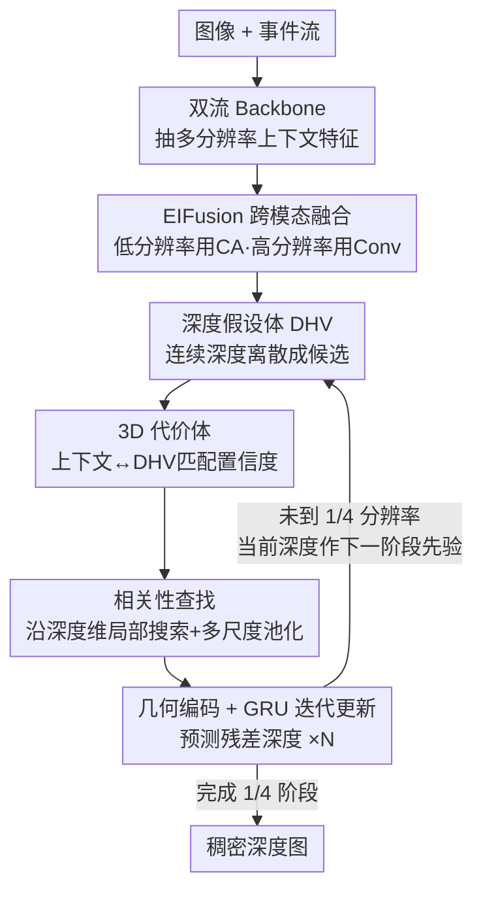

# Depth Hypothesis Guided Iterative Refinement for Event-Image Monocular Depth Estimation

**会议**: CVPR 2026  
**论文**: [CVF Open Access](https://openaccess.thecvf.com/content/CVPR2026/html/Liu_Depth_Hypothesis_Guided_Iterative_Refinement_for_Event-Image_Monocular_Depth_Estimation_CVPR_2026_paper.html)  
**代码**: 未公开  
**领域**: 3D视觉  
**关键词**: 事件相机, 单目深度估计, 深度假设体, 代价体, 迭代优化  

## 一句话总结
HypoDepth 把事件—图像单目深度估计从"直接回归连续深度"改成"在离散深度假设里做受约束的搜索"，靠一个轻量 3D 代价体 + GRU 迭代单元从低分辨率到高分辨率逐步精修残差深度，在 DSEC 和 MVSEC 上取得 SOTA，且 Tiny 版本能在受限设备上实时运行。

## 研究背景与动机
**领域现状**：事件相机有高时间分辨率和高动态范围，在高速运动、弱光这些图像相机失效的场景里仍能捕获场景变化，因此"事件 + 图像"互补做单目深度估计（MDE）很有前景。主流做法（RAMNet 用 RNN 对齐、UniCT 用自注意力、SRFNet/PCDepth 迭代精修特征融合）都把重心放在**优化上下文特征**，再用一个回归头直接吐出稠密深度。

**现有痛点**：单目深度本身是病态（ill-posed）问题——同一组特征可以对应无穷多深度解。直接对完整深度分布做回归是高度非线性的，难收敛，对预测噪声敏感。这些方法不管怎么把特征对齐、融合得更好，**最后那一步"特征 → 连续深度"的映射始终是个非线性硬骨头**，精修也只停在特征层，没有在深度空间里施加显式约束。

**核心矛盾**：把深度当成一个无界连续量去回归，解空间太大、太自由，病态性无法缓解；而光流/立体匹配领域早就证明，**把"回归"换成"在受限候选里搜索"能显著稳住优化**（RAFT 维护 2D/4D 代价体，迭代预测残差光流）。但光流/立体有显式视角对应可建代价体，单目深度没有第二视角，没法直接照搬。

**本文目标**：(1) 把病态的深度回归重述成一个受约束的深度搜索任务；(2) 在没有第二视角的单目设定下，构造一个能引导迭代精修的代价体；(3) 让这套机制足够轻量，能跨多分辨率运行并实时部署。

**切入角度**：作者的关键观察是——可以在"虚拟深度空间"里人为造出对应关系。把连续深度离散成一组候选深度值（深度假设），算每个像素的上下文特征和"该假设下的几何投影"之间的匹配置信度，就得到一个 3D 代价体，相当于把 RAFT 里"两帧之间的匹配"替换成"上下文特征 vs 深度假设之间的匹配"。

**核心 idea**：用一个离散的 **深度假设体（Depth Hypothesis Volume, DHV）** 把深度搜索空间约束在一组合理候选里，构造 3D 代价体做多尺度相关性查找，再用 GRU 迭代预测残差深度，实现 global-to-local 的逐级精修——即"用受约束的深度搜索代替无界深度回归来缓解病态性"。

## 方法详解

### 整体框架
给定一张图像 $I$ 和对应的事件流 $E$，目标是估计稠密深度图。HypoDepth 整体是个三段式 + 多分辨率迭代的 pipeline：图像和事件各自过 backbone 抽多分辨率上下文特征 → EIFusion 按分辨率自适应融合两模态 → 在 1/16、1/8、1/4 三个分辨率上依次跑迭代深度解码器，每个解码器内部用 DHV 构代价体、查找相关性、GRU 更新残差深度，由粗到细把深度从全局一致性精修到局部细节。1/16 阶段初始深度设为零，后面每个分辨率都拿上一阶段的深度当先验。

整套方法是"多分辨率串行 + 单分辨率内多轮迭代"的双层循环结构，各模块职责清晰，适合图文对照：

### 关键设计

**1. 深度假设体 DHV：把无界深度回归换成有界深度搜索**

这是全文的地基，直接针对"直接回归连续深度高度非线性、病态难收敛"这个痛点。做法是在每个像素上、于先验给出的深度上下界 $[d_{min}, d_{max}]$ 内**均匀采样 $D$ 个候选深度值** $\{\hat d_i\}_{i=0}^{D-1}$，把连续深度空间离散成一组结构化的"合理深度假设"。为了鲁棒性（沿用 RAMNet），网络预测的是归一化对数深度，所以候选值要先转成归一化 log 深度：

$$d_i = \frac{\log(\hat d_i) - \log(d_{min})}{\log(d_{max}) - \log(d_{min})}, \quad DHV = \{d_0, d_1, \dots, d_{D-1}\}$$

然后把 DHV 经线性投影嵌入到和上下文特征 $F_{ct}$ 同一特征空间：$F_{dhv} = \text{Embedding}(DHV)$，其中 $F_{dhv} \in \mathbb{R}^{c \times D}$ 表示"场景在每个特定深度假设下的几何投影"。这一步的妙处在于：把解空间从"整条实数轴"压成"$D$ 个候选"，天然抗噪——预测落到候选附近即可，不必精确命中一个连续值，从而把病态回归转成有先验约束的搜索，为后续残差优化提供稳定起点。

**2. 3D 代价体 + 多尺度相关性查找：在虚拟深度空间里造出"匹配"并跨距离取证**

单目没有第二视角，本设计解决"没有显式对应关系怎么建代价体"。作者先在上下文特征 $F_{ct}$ 和 DHV 嵌入 $F_{dhv}$ 之间做**双向交叉注意力**，让上下文特征感知不同深度假设下的几何、让 DHV 嵌入获得场景语义：

$$F'_{dhv} = F_{dhv} + \text{CA}(Q_{dhv}, K_{ct}, V_{ct}), \quad F'_{ct} = F_{ct} + \text{CA}(Q_{ct}, K_{dhv}, V_{dhv})$$

再用点积算两者相似度，得到 3D 代价体 $CV = \text{Sim}(F'_{ct}, F'_{dhv}) \in \mathbb{R}^{H \times W \times D}$——它沿深度维编码了"每个像素在各深度假设上的匹配置信度"。接着沿深度维池化构成代价体金字塔 $\{CV^1, CV^2, CV^3\}$（深度维分别为 $D, D/2, D/4$），同时覆盖近处和远处物体。查找时，第 $k$ 次迭代对每个像素 $P$，先用曼哈顿距离找出上一轮深度 $\psi_P^{k-1}$ 最接近的假设索引：

$$i^* = \arg\min_i |\psi_P^{k-1} - d_i|$$

以 $i^*$ 为中心、半径 $r$ 做局部搜索取相关性向量 $\text{Corr}(P) = \{CV_P(i^* + \Delta i) \mid \Delta i \in [-r, r]\} \in \mathbb{R}^{2r+1}$，多尺度的相关图拼成 $\text{Corr} \in \mathbb{R}^{3(2r+1) \times H \times W}$。因为深度维 $D \ll H \times W$，这个 3D 代价体很轻量，能在高分辨率上高效跑，这也是它比 RAFT 那种 4D 代价体省算力、能跨多分辨率精修的根因。

**3. 几何编码 + GRU 迭代残差更新：让搜索结果稳定收敛到精修深度**

代价体只给出"哪个深度假设匹配度高"，但 DHV 是离散的，缺乏空间一致性。本设计先用**几何编码器**：把多尺度相关性 $\text{Corr}$ 过两层卷积，与深度特征拼接，再注入融合后的上下文特征 $F_{ct}$ 提供场景结构信息，产出空间一致的几何表示。该特征送进**基于 GRU 的迭代单元**——GRU 的隐藏状态负责在多轮迭代间传递历史信息（消融证实换成卷积层会因缺隐藏状态而收敛变弱），预测头吐出残差深度 $\Delta\Psi$，更新 $\Psi^k = \Psi^{k-1} + \Delta\Psi$，再用 convex upsampling 上采样并映射回真实深度尺度：

$$\hat\Psi^k = d_{max}\exp\left(\log\tfrac{d_{max}}{d_{min}}(\Psi^k - 1)\right)$$

"残差 + 迭代"而非一次性回归全深度，配合 DHV 把每轮搜索范围逐步收窄，是它能稳定优化、避免误差累积的关键。

**4. 多分辨率自适应融合与由粗到细精修：兼顾全局一致与细节并控制开销**

由于深度维 $D \ll H \times W$，高分辨率下迭代仍高效，作者采用 1/16 → 1/8 → 1/4 的 coarse-to-fine 流程：低分辨率阶段强调全局一致性，高分辨率阶段恢复精细结构，并按粒度调整 DHV 的假设数 $D$（低分辨率小、高分辨率大，实测取 $(32, 64, 96)$）。上下文编码端的 **EIFusion** 也按分辨率分策略：1/16 和 1/8 用交叉注意力做全局语义对齐（先 concat+conv 做隐式对齐当 skip，再以 $F_I, F_E$ 互为 Q/K/V），1/4 这种侧重结构细节的高分辨率用更省的卷积融合（concat → conv → ReLU → BN + skip）。这套"按分辨率分配算力"的设计让多尺度表征和效率取得平衡。

### 损失函数 / 训练策略
沿用 RAFT 和 PCDepth，对 $K$ 步迭代预测 $\{\hat\Psi_i\}_{i=1}^K$ 用 SILog 损失监督，并按迭代加权（越靠后权重越大）：

$$L = \sum_{i=1}^K 0.8^{K-i}\,\alpha\sqrt{V(\delta_i)} - \lambda E(\delta_i), \quad \delta_i = \log(\hat\Psi_i) - \log(\Psi_{gt})$$

其中 $V(\cdot)$、$E(\cdot)$ 为方差和期望，$\alpha=10$、$\lambda=0.15$。event 用 voxel grid 表示（$B=3$ 个时间 bin），backbone 为微调的 Swin-T（双流不共享权重），每阶段迭代 8 次，查找半径 $r=8$，AdamW + one-cycle 调度；DSEC 训 60k 步、lr 2e-4、batch 16，MVSEC 从 EventScape 预训练模型微调 40k 步。

## 实验关键数据

### 主实验
DSEC 数据集（480×640 高分辨率、稠密事件），E 表示纯事件、E+I 表示事件+图像融合：

| 输入 | 方法 | δ1 ↑ | Abs Rel ↓ | RMSE ↓ | FLOPs(G) | Param(M) | 推理(ms) |
|------|------|------|-----------|--------|----------|----------|----------|
| E | DepthAnyEvent-R | 0.592 | 0.252 | 9.824 | 39 | 25.5 | 12.9 |
| E | **Ours-E-T**(Tiny) | 0.755 | 0.168 | 5.377 | **5** | **1.4** | 11.8 |
| E | **Ours-E-B** | 0.839 | **0.129** | 4.442 | 134 | 32.3 | 58.2 |
| E+I | PCDepth | 0.893 | 0.103 | 3.591 | 162 | 66.5 | 64.3 |
| E+I | **Ours-B** | **0.901** | **0.099** | **3.583** | 155 | 60.2 | 71.6 |

纯事件版相比 DepthAnyEvent-R 的 Abs Rel 改善约 49%（0.252 → 0.129，Ours-E-B）；Tiny 版仅 1.4M 参数、5G FLOPs 却把 Abs Rel 干到 0.168，远好于同量级方法，效率/精度平衡最佳。

MVSEC 数据集（outdoor day1 / night1，主指标 Abs Rel）：

| 输入 | 方法 | day1 Abs Rel ↓ | day1 δ1 ↑ | night1 Abs Rel ↓ | night1 δ1 ↑ |
|------|------|----------------|-----------|------------------|-------------|
| E | HMNet | 0.254 | 0.690 | 0.323 | 0.513 |
| E+I | PCDepth | 0.228 | 0.712 | 0.271 | 0.632 |
| E+I | **Ours-B** | **0.212** | 0.698 | **0.268** | 0.614 |

两个序列的主指标 Abs Rel 都取得 SOTA。另有零样本泛化实验（EventScape 预训练 → 直接迁移 DSEC/MVSEC），Ours-B 在所有场景 Abs Rel 均最优，复杂的 DSEC 上优势尤其明显。

### 消融实验
在 DSEC 上用缩小版 base 模型逐项消融：

| 配置 | δ1 ↑ | Abs Rel ↓ | RMSE ↓ | 说明 |
|------|------|-----------|--------|------|
| Full model | 0.885 | 0.105 | 3.857 | 完整模型 |
| W/o EIFusion | 0.877 | 0.110 | 3.885 | 换成简单 concat，互补性没用上、代价体匹配模糊 |
| W/o CA in decoder | 0.869 | 0.111 | 4.074 | 去掉 DHV↔上下文交叉注意力，语义/几何对应变弱 |
| W/o GRU | 0.858 | 0.115 | 4.234 | 换卷积层，无隐藏状态、迭代间信息不传递，收敛最弱 |
| W/o context in decoder | 0.876 | 0.112 | 3.921 | 只用相关性特征解码，缺场景上下文、空间一致性差 |
| W/o multi-scale lookup | 0.875 | 0.110 | 3.969 | 去多尺度池化，跨场景鲁棒性下降 |
| W/o DHV | 0.873 | 0.113 | 3.964 | 用上一轮连续深度替代离散 DHV，误差随迭代累积 |

迭代次数消融：2 / 4 / 8 次对应 Abs Rel 0.117 / 0.111 / 0.105，FLOPs 50 / 60 / 80G，呈递增收益（最终取 8 次）；DHV 假设数 $D$ 取 $(32,64,96)$ 时随迭代收敛到最低 Abs Rel。

### 关键发现
- **GRU 是迭代精修的命门**：去掉它掉点最多（Abs Rel 0.105 → 0.115），证明跨迭代隐藏状态的"历史先验传递"对收敛至关重要。
- **DHV 比连续深度更稳**：用上一轮连续深度替代离散假设会让粗预测误差随迭代累积，而 DHV 内的搜索提供了纠错能力，这是把回归改成搜索的核心收益。
- **效率来自轻量 3D 代价体**：因深度维 $D \ll H \times W$，多分辨率迭代算力可控；Tiny 版 1.4M 参数即可实时，适合受限设备。

## 亮点与洞察
- **把 RAFT 范式迁到没有第二视角的单目任务**：光流/立体靠真实视角对应建代价体，本文用"离散深度假设 + 上下文匹配"在虚拟深度空间里**人造对应关系**，这是最巧妙的一跳，思路可迁移到任何"病态连续回归 + 缺显式匹配"的任务。
- **"回归 → 受约束搜索"的重述**：离散化解空间天然抗噪，配合残差迭代逐步收窄范围，把高度非线性的病态回归稳住，比一味优化上下文特征更触及问题本质。
- **按分辨率分配算力的工程取舍**：低分辨率上交叉注意力做全局对齐、高分辨率上换便宜卷积、DHV 假设数随分辨率调整——一套兼顾精度和实时的实用设计。

## 局限与展望
- **依赖先验深度界 $[d_{min}, d_{max}]$**：DHV 候选采样依赖给定的深度上下界，⚠️ 若实际场景深度超出预设范围或界估计不准，离散候选可能覆盖不到真值，作者未充分讨论这一点的鲁棒性。
- **迭代带来的延迟**：base/PCDepth 这类在高分辨率多轮迭代的方法推理时间偏高（Ours-B 71.6ms），实时只能靠 Tiny 版换精度，存在 trade-off。
- **均匀采样可能非最优**：候选深度在 log 空间均匀采样，对极近/极远物体的分辨率分配未必最佳，可探索自适应/可学习的候选分布（类似 AdaBins 的思路）。
- 代码未公开，复现门槛较高。

## 相关工作与启发
- **vs RAFT**：RAFT 在两帧间维护 4D 代价体迭代预测残差光流，靠真实视角对应；本文用离散 DHV 在单图上模拟匹配、构造更轻的 3D 代价体，把同样的"代价体 + 迭代残差"范式带进单目深度，且 $D \ll H\times W$ 使其更省。
- **vs PCDepth / SRFNet**：它们也做迭代精修，但停留在**特征层融合**的优化，深度空间没有显式约束；本文在深度空间里做动态、显式的代价体搜索精修，故在 DSEC/MVSEC 全面超过 PCDepth，且把本文精修策略级联到 PCDepth（PCDepth-Ours）还能进一步涨点。
- **vs AdaBins**：AdaBins 用自适应可学习深度 bin 做细粒度回归，本文的 DHV 同样离散化深度，但目的不是分类回归而是构造匹配代价体做搜索式精修，两者在"离散深度"上殊途。

## 评分
- 新颖性: ⭐⭐⭐⭐⭐ 首个把"代价体 + 迭代残差"搜索范式引入事件—图像单目深度的框架，DHV 在无第二视角下人造匹配很有想法
- 实验充分度: ⭐⭐⭐⭐⭐ DSEC/MVSEC 双数据集 + 零样本泛化 + 三档模型效率分析 + 7 项组件消融，覆盖充分
- 写作质量: ⭐⭐⭐⭐ 动机递进清晰、公式完整，图示丰富；个别符号（如 DHV 假设数与分辨率映射）需对照原文
- 价值: ⭐⭐⭐⭐⭐ Tiny 版 1.4M 实时可部署，方法论对其他病态回归任务有迁移价值

<!-- RELATED:START -->

## 相关论文

- [\[CVPR 2026\] AIMDepth: Asymmetric Image-Event Mamba for Monocular Depth Estimation](aimdepth_asymmetric_image-event_mamba_for_monocular_depth_estimation.md)
- [\[CVPR 2026\] Iris: Integrating Language into Diffusion-based Monocular Depth Estimation](iris_integrating_language_into_diffusion-based_monocular_depth_estimation.md)
- [\[CVPR 2026\] Iris: Bringing Real-World Priors into Diffusion Model for Monocular Depth Estimation](iris_bringing_realworld_priors_into_diffusion_model_for_monocular_depth_estimation.md)
- [\[CVPR 2026\] MD2E: Modeling Depth-to-Edge Cues for Monocular Metric Depth Estimation](md2e_modeling_depth-to-edge_cues_for_monocular_metric_depth_estimation.md)
- [\[CVPR 2026\] IDESplat: Iterative Depth Probability Estimation for Generalizable 3D Gaussian Splatting](idesplat_iterative_depth_probability_estimation_for_generalizable_3d_gaussian_sp.md)

<!-- RELATED:END -->
