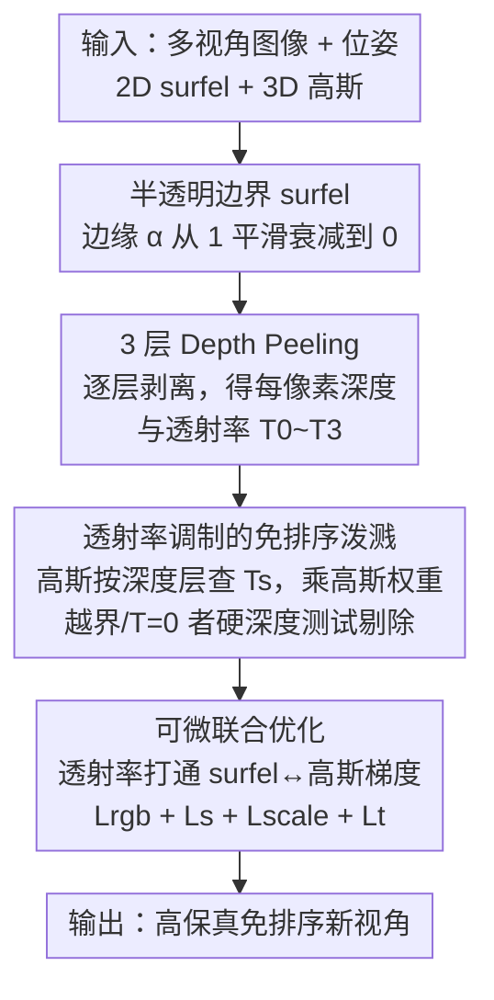

# Depth Peeling for High-Fidelity Gaussian-Enhanced Surfel Rendering

**会议**: CVPR 2026  
**论文**: [CVF Open Access](https://openaccess.thecvf.com/content/CVPR2026/html/Ye_Depth_Peeling_for_High-Fidelity_Gaussian-Enhanced_Surfel_Rendering_CVPR_2026_paper.html)  
**代码**: 未公开  
**领域**: 3D视觉  
**关键词**: 新视角合成, 高斯泼溅, Surfel, Depth Peeling, 免排序渲染  

## 一句话总结
针对 Gaussian-Enhanced Surfels（GES）因硬深度测试导致的边界走样和 surfel/高斯无法联合优化两大问题，本文提出 DP-GES：给 surfel 加上半透明边界、用 3 层 depth peeling 求出每像素的精确遮挡顺序，从而让 3D 高斯仍能免排序泼溅却得到正确的透射率调制——既消除走样与 popping，又打通了 surfel 与高斯的可微联合优化，在多个数据集上以 472 FPS 取得与 SOTA 持平或更优的画质。

## 研究背景与动机
**领域现状**：新视角合成的主流是 NeRF 和 3D Gaussian Splatting（3DGS）。两者都把场景表示成体辐射场，渲染时需要把体素样本/基元按由近到远的顺序做 alpha 混合。NeRF 靠逐点神经网络推理，太慢；3DGS 用基于 tile 的全局排序近似逐像素深度顺序来加速。

**现有痛点**：3DGS 的近似排序会在相机旋转时引入 popping（floater 因排序顺序突变而突然出现/消失）。后续工作要么走免排序路线（如 SortFreeGS）但出现严重的遮挡泄漏（occlusion leakage），要么靠 ray tracing 求精确顺序但代价高昂。Gaussian-Enhanced Surfels（GES）给出了一个折中：用一组**完全不透明的 surfel**（标准 z-buffer 渲染）建粗尺度几何与外观，再用**免排序泼溅**的高斯补细节，并用 surfel 深度缓冲做高斯剔除，从而同时拿到高帧率和视角一致性。

**核心矛盾**：GES 的两个根因都来自"surfel 完全不透明"这一设定。其一，虽然 MSAA 能平滑 surfel 本身的渲染，但加入高斯后，作用在高斯上的**硬深度测试**会把高斯的颜色/权重从 1 突然截断到 0——相当于透射率被生硬地 clamp，于是物体边界又出现走样。其二，完全不透明的 surfel 几何**本质上不可微**，且其颜色与高斯只是松散混合，导致 surfel 与高斯无法联合优化，重建质量次优。

**本文目标**：在保留 GES「免排序 + 视角一致」优势的前提下，(1) 消除边界走样、(2) 让 surfel 与高斯能端到端联合优化。

**切入角度**：作者把走样问题重新理解为"硬深度测试 = 透射率突变"，于是只要让透射率**平滑过渡**而不是 0/1 跳变，走样和不可微就能一并解决。要让透射率平滑，就得给 surfel 加半透明边界；而半透明就需要排序才能正确混合——这正好把经典的顺序无关透明（OIT）技术 depth peeling 引了进来。

**核心 idea**：给 surfel 加一圈半透明边界，用 **depth peeling 求每像素 3 层的精确深度顺序与透射率**，让高斯仍然免排序泼溅、但权重被对应深度层的透射率平滑调制——用"可微的透射率"同时治走样和打通联合优化。

## 方法详解

### 整体框架
DP-GES 的表示由两类基元组成：一组**带半透明边界的 2D 不透明 surfel** $\mathcal{S}=\{p_i,r_i,s_i,B_i\}_{i=1}^N$ 负责粗尺度几何与外观，一小撮**环绕在 surfel 周围的 3D 高斯** $\mathcal{G}=\{p_i,\sigma_i,r_i,s_i,B_i\}_{i=1}^M$ 负责精细外观细节（surfel 数量通常不到高斯的 10%）。最终图像是两者颜色的加权归一：$C=\frac{C_s+C_G}{W_s+W_G}$。

渲染分两趟（two passes）。第一趟用标准图形管线对 surfel 做 **3 层 depth peeling**，逐层"剥掉"最近可见层，得到 3 张深度图 $\{D_i^s\}_{i=1}^3$、颜色图和不透明度图，再按 3DGS 的合成方式 alpha 混合出 surfel 颜色 $C_s$ 和逐层透射率图 $\{T_i^s\}_{i=0}^3$（约定 $T_0^s=1$）。第二趟把 3D 高斯免排序泼溅到屏幕上：**每个高斯按自己中心深度落入哪一深度区间，去查对应层的透射率 $t_s$**，乘到自己的高斯权重上得到最终权重；超出第 3 层或透射率为 0 的高斯由硬件深度测试剔除。整套流程完全可微，初始化后对所有参数做联合优化。

### 关键设计

**1. 半透明边界 surfel：把硬深度测试软化成平滑透射率**

GES 走样的根因是 surfel 完全不透明、高斯被硬深度测试一刀切。本文给 surfel 在边缘加一圈环形的渐变不透明度：对局部坐标 XY 平面上的圆盘 surfel，点 $(x,y)$ 的不透明度定义为 $\alpha_i(x,y)=\min(1, w\,G(x,y))$，其中 $G(x,y)=\exp(-\frac{x^2+y^2}{2})$，$w$ 是所有 surfel 共享的固定调制常数。$w<1$ 时 surfel 整体半透明，$w=255$ 时退化为 GES 的完全不透明 surfel；论文取 $w=30$，使中心保持不透明（便于高斯剔除）、只在边界留一圈薄薄的半透明环。这一圈半透明让透射率在边界处**连续衰减**而非 0/1 跳变，于是高斯在 surfel 边界附近会平滑淡出而非被硬截断，从源头抑制走样（Fig. 3 对比清楚地展示了 GES 的硬截断与本文的软过渡）。

**2. 3 层 Depth Peeling：为半透明 surfel 求每像素精确遮挡顺序**

半透明 surfel 要正确混合就必须排序。作者用经典 OIT 的 depth peeling：每趟 pass 比较上一趟存的逐像素深度，"剥掉"最近一层，从而保证由近到远的正确 alpha 合成顺序。surfel 颜色和透射率按
$$C_s=\sum_{i=1}^{3} A_i^s\,T_{i-1}^s\,C_i^s + T_3^s\,C_b,\qquad T_i^s=\begin{cases}1,& i=0\\ \prod_{j=1}^{i}(1-A_j^s),& \text{otherwise}\end{cases}$$
合成，其中 $C_b$ 是背景色，可证 $W_s=\sum_{i=1}^3 A_i^s T_{i-1}^s + T_3^s=1$ 是常数。关键取舍是**只剥 3 层**：实验发现 3 层就足以避免背景色泄漏，2 层会因半透明区域叠加而漏背景、4 层画质几乎不再涨却显著掉帧（还会破坏 OpenGL 的 4-float 对齐打包、增加带宽）。由于 surfel 数量远小于高斯，3 层 peeling 本身几乎不增加开销。

**3. 透射率调制的免排序高斯泼溅：让高斯沿用 GES 的免排序、但权重被正确遮挡**

有了逐层透射率，高斯就不必排序了。第二趟把高斯免排序累加，逐像素的高斯颜色与权重为
$$C_G(\hat{x})=\sum_{i=1}^{K}\mathbb{1}_{dt}(\hat{x})\,c_i\alpha_i(\hat{x})\,t_s(\hat{x}),\quad W_G(\hat{x})=\sum_{i=1}^{K}\mathbb{1}_{dt}(\hat{x})\,\alpha_i(\hat{x})\,t_s(\hat{x})$$
其中每个高斯依据中心深度 $d_i$ 落入哪个深度区间，从 $\{D_i^s\}$ 查得透射率：$t_s=T_0^s$ 若 $d_i<D_1^s$，$=T_1^s$ 若 $D_1^s<d_i<D_2^s$，否则 $=T_2^s$（式 5）。指示函数 $\mathbb{1}_{dt}$ 做逐像素剔除：深度超过第 3 剥离层或透射率为 0 的高斯被丢弃（$\mathbb{1}_{dt}=\mathbb{1}(d_i<d_s(\hat{x})+\epsilon_s)$，$d_s$ 取该像素最近一层 $T_i^s=0$ 的剥离深度，若 3 层透射率都非零则默认取第 3 层深度 $D_3^s$）。这样**被部分遮挡的高斯会在 surfel 边界附近平滑淡出**，既消除走样又防止遮挡泄漏——拿到了免排序的速度，却没丢正确的遮挡。

**4. 透射率打通的可微联合优化：surfel 与高斯互相塑形**

GES 中 surfel 只在自己的阶段优化、联合阶段无法再被细化，导致出现"突出的 surfel"遮挡细节。DP-GES 中透射率把 surfel 和高斯连了起来，surfel 几何参数 $S_g=\{p_i,r_i,s_i\}$ 不仅直接从图像损失收到梯度 $\frac{\partial L}{\partial C}\frac{\partial C}{\partial C_s}\frac{\partial C_s}{\partial S_g}$，还能**经由透射率间接从高斯收到梯度** $\frac{\partial L}{\partial C}\frac{\partial C}{\partial C_G}\frac{\partial C_G}{\partial t_s}\frac{\partial t_s}{\partial S_g}$。损失为 $L=L_{rgb}+\lambda_1 L_s+\lambda_2 L_{scale}+\lambda_3 L_t$：$L_s=L_1(C_s,I_{gt})$ 让 surfel 拟合粗外观/几何；$L_{scale}=\frac{1}{N}\sum_i \exp(\frac{\tilde{s}_i^X+\tilde{s}_i^Y}{2})$ 惩罚过大 surfel、防止几何鲁棒性退化；$L_t=\frac{1}{HW}\sum_{\hat{x}}(1-T_3(\hat{x}))^2$ 抑制背景色泄漏。$L_t$ 的设计很巧——直觉上该加"鼓励 $T_3=0$"的项，但实验发现那样反而让半透明区在像素内堆叠、$T_3\neq0$ 概率升高；作者反其道而行，对 $T_3\neq0$ 的像素施压，迫使重叠的半透明部分相互推开、让该像素更可能被别的 surfel 不透明区覆盖，从而把 $T_3$ 驱向 0（少于 2 层 surfel 覆盖的像素则 mask 掉其梯度）。

### 损失函数 / 训练策略
总损失 $L=L_{rgb}+\lambda_1 L_s+\lambda_2 L_{scale}+\lambda_3 L_t$，取 $\lambda_1=0.01$、$\lambda_3=0.08$；$\lambda_2$ 在无界场景取 $5\times10^{-5}$、有界场景取 $1\times10^{-5}$。优化基于 PyTorch，并配套一个等价的 OpenGL 渲染器以充分利用标准图形管线做实时渲染；surfel 与高斯经快速初始化后做全可微联合优化（初始化/优化细节在附录）。

## 实验关键数据

实验在 RTX 4090 上进行，数据集沿用 3DGS 的设置：NeRF Synthetic（8 合成场景）、Mip-NeRF360（9 真实场景）、Deep Blending（2 场景）、Tanks & Temples（2 场景）。指标用 PSNR/SSIM/LPIPS 评画质，FPS 评速度，并按 StopThePop 用 $\overset{F}{LIP}_1$/$\overset{F}{LIP}_7$ 评短期/长期 popping。为公平比较，所有 MCMC 类方法的基元数都设为与 DP-GES 的 surfel+高斯总数相同。

### 主实验：画质对比（数据集平均）

| 数据集 | 指标 | Ours | GES | DBS | SSS | 3DGS |
|--------|------|------|------|------|------|------|
| Mip-NeRF360 | PSNR↑ | **28.11** | 27.38 | 28.10 | 27.78 | 27.43 |
| Mip-NeRF360 | LPIPS↓ | **0.196** | 0.208 | 0.210 | 0.203 | 0.214 |
| Deep Blending | PSNR↑ | **30.30** | 30.00 | 30.25 | 30.25 | 29.41 |
| Tanks & Temples | PSNR↑ | 24.61 | 23.95 | 24.52 | **24.70** | 23.62 |
| Tanks & Temples | LPIPS↓ | **0.162** | 0.181 | 0.166 | 0.166 | 0.183 |
| NeRF Synthetic | PSNR↑ | 34.13 | 33.37 | **34.34** | 33.63 | 33.31 |

DP-GES 在所有数据集上与 SOTA 持平或更优，**LPIPS（感知质量）几乎全面领先**，在远景细节、Bonsai 去 floater、Counter 高保真反射上尤其明显。

### 主实验：效率与视角一致性（Mip-NeRF360，1080p）

| 方法 | FPS↑ | 存储(MB)↓ | 训练(min)↓ | $\overset{F}{LIP}_1$↓ | $\overset{F}{LIP}_7$↓ |
|------|------|-----------|-----------|------|------|
| Ours | 472 | **156** | 40 | 0.0232 | 0.0431 |
| GES | **675** | 366 | 43 | 0.0229 | 0.0394 |
| DBS | 156 | 165 | 20 | 0.0297 | 0.0771 |
| SSS | 62 | 351 | 38 | 0.0300 | 0.0716 |
| 3DGS | 185 | 734 | 28 | 0.0250 | 0.0471 |

DP-GES 以 472 FPS 比 DBS/SSS 等高保真基线快 3 倍以上，且存储最省（156MB）。相对 GES 的小幅开销主要来自高斯渲染趟需从纹理缓冲取剥离深度/透射率、增加了带宽。$\overset{F}{LIP}$ 略高于 GES 是因 spherical Beta 带来更高频的视角相关效果（$\overset{F}{LIP}$ 用光流 warp 误差、无法区分视角变化与真 popping），并非一致性更差。

### 消融实验（Mip-NeRF360，1080p）

| 配置 | PSNR↑ | LPIPS↓ | FPS↑ | 说明 |
|------|-------|--------|------|------|
| Ours (full) | 28.11 | 0.196 | 472 | 完整模型 |
| Ours (base) | 27.72 | 0.197 | 480 | 退回 GES 的 SH 颜色 + densification |
| w/ 2 layers | 27.02 | 0.223 | 578 | 只剥 2 层 → 背景泄漏，掉点最多 |
| w/ 4 layers | 28.10 | 0.196 | 278 | 4 层画质几乎不涨却大幅掉帧 |
| w/o trans. grad | 27.82 | 0.206 | 477 | 切断透射率梯度路径 → 细节变糊 |
| w/o $L_s$ | 28.05 | 0.198 | 462 | 去几何对齐约束 |
| w/o $L_{scale}$ | 28.07 | 0.203 | 461 | 去尺度正则 → 色彩泄漏 |
| w/o $L_t$ | 27.86 | 0.209 | 475 | 去背景泄漏抑制 |

### 关键发现
- **剥离层数是质量/效率的关键平衡点**：2 层因半透明区叠加而漏背景，PSNR 暴跌到 27.02；4 层几乎不涨画质（28.10 vs 28.11）却把帧率从 472 砍到 278。3 层是甜点。
- **透射率梯度路径很重要**：切断它（w/o trans. grad）PSNR 掉到 27.82、细节变糊、出现 GES 式的突出小 surfel，证明 surfel 与高斯必须当作完全耦合的可微系统、而非"只让 surfel 可微"。
- **表示本身的增益与 densification 正交**：Ours (base) 退回 GES 的颜色与 densification 后仍达 27.72，超过 GES 与 AbsGS、接近 SSS，说明提升主要来自新表示+渲染模型，而非基元数量策略。
- **$L_t$ 的反直觉设计有效**：直接鼓励 $T_3=0$ 反而更糟，转而惩罚 $T_3\neq0$ 的像素迫使半透明区相互推开，才真正把 $T_3$ 驱向 0。

## 亮点与洞察
- **把"走样"重述为"透射率突变"**：这是全文最漂亮的一步——一旦把 GES 边界走样归因于硬深度测试等价于透射率被 clamp，"给 surfel 加半透明边界让透射率平滑"就成了顺理成章的解，且**顺带**把不可微问题一起解决了，一举两得。
- **用经典图形学 OIT 接住新问题**：depth peeling 是 20 年前的老技术，作者发现"半透明 surfel 需要排序"恰好可以用它求每像素精确顺序，再把剥离出的透射率反哺给免排序高斯，把"精确排序"和"免排序加速"两者的优点缝在一起，是很有迁移价值的思路。
- **"只剥 3 层"的工程直觉**：不追求物理精确的任意层数，而是结合 OpenGL 4-float 对齐与带宽实测把层数钉死在 3，体现了对图形管线底层的把握。
- **可迁移性**：半透明边界 + 透射率调制这套"软化硬深度测试"的做法，可推广到其他 surfel/混合表示的免排序渲染；spherical Beta、densification 等正交改进也能直接叠加进来。

## 局限与展望
- 作者承认：与 GES 类似，DP-GES 对**透明/半透明物体（如玻璃窗）**仍有伪影，因 surfel 主要是不透明的（不过比 GES 已明显改善）。
- surfel 不如 2DGS 的全半透明 surfel 灵活，需要额外初始化、训练时间相对较长。
- spherical Beta 增强视角相关效果的同时**增加过拟合风险**（DBS 中也观察到）。
- ⚠️ 代码似乎尚未公开（论文未给链接），复现需自行实现 OpenGL 渲染器与初始化策略，门槛不低。
- 个人观察：3 层层数是在当前数据集上调出的经验值，几何更复杂、半透明叠层更多的场景下 3 层是否仍够、$L_t$ 的"推开"策略是否还稳定，值得进一步验证。

## 相关工作与启发
- **vs GES**：本文的直接前身。GES 用完全不透明 surfel + 硬深度测试，导致边界走样且 surfel 不可微、不能联合优化；DP-GES 给 surfel 加半透明边界、用 depth peeling 求顺序，既消走样又打通可微联合优化，画质更高、存储更省（156 vs 366 MB），代价是略高带宽开销和稍慢于 GES 的帧率。
- **vs SortFreeGS（免排序 OIT 风格）**：完全免排序但有严重遮挡泄漏；DP-GES 用剥离深度做高斯剔除，在保持免排序的同时防住泄漏。
- **vs HTGS（只精排前几个高斯）**：只排前 16 个、其余近似为加权尾部，视觉上减 popping 但放大 floater（floater 占据前排深度、把深层高斯挤进低权尾部，优化中 floater 不断增大不透明度补偿）；DP-GES 没有这种"前排/尾部"近似，避免了该 floater 问题。
- **vs StopThePop / DRK（层次/缓存近似排序）**：近似排序无法彻底消 popping；DP-GES 走的是 surfel 精确剥离 + 高斯免排序的混合路线，从机制上规避了排序顺序突变。
- **vs 3DGRT / EVER（光线追踪精确排序）**：精确但太慢；DP-GES 以 472 FPS 在质量接近的同时快了一个量级。

## 评分
- 新颖性: ⭐⭐⭐⭐ 把"走样=透射率突变"的重述 + 用 depth peeling 接半透明 surfel 的组合很巧妙，但整体是 GES 的精细化改进而非全新范式。
- 实验充分度: ⭐⭐⭐⭐⭐ 4 个数据集、近 10 个 baseline、画质/效率/一致性/消融全面覆盖，关键取舍（层数、各 loss、梯度路径）都有消融支撑。
- 写作质量: ⭐⭐⭐⭐ 机制与公式交代清晰，$L_t$ 的反直觉设计解释到位；部分细节（初始化、$\epsilon_s$）压在附录。
- 价值: ⭐⭐⭐⭐ 实时高保真免排序渲染对实际应用价值高，156MB 存储 + 472 FPS 很有吸引力，惜代码未公开。

<!-- RELATED:START -->

## 相关论文

- [\[CVPR 2026\] HyperGaussians: High-Dimensional Gaussian Splatting for High-Fidelity Animatable Face Avatars](hypergaussians_high-dimensional_gaussian_splatting_for_high-fidelity_animatable_.md)
- [\[CVPR 2026\] 3D Gaussian Splatting with Self-Constrained Priors for High Fidelity Surface Reconstruction](3d_gaussian_splatting_with_self-constrained_priors_for_high_fidelity_surface_rec.md)
- [\[CVPR 2026\] Neural Gabor Splatting: Enhanced Gaussian Splatting with Neural Gabor for High-frequency Surface Reconstruction](neural_gabor_splatting.md)
- [\[CVPR 2026\] TopoMesh: High-Fidelity Mesh Autoencoding via Topological Unification](topomesh_high-fidelity_mesh_autoencoding_via_topological_unification.md)
- [\[CVPR 2026\] High-Fidelity Mobile Avatars with Pruned Local Blendshapes](high-fidelity_mobile_avatars_with_pruned_local_blendshapes.md)

<!-- RELATED:END -->
