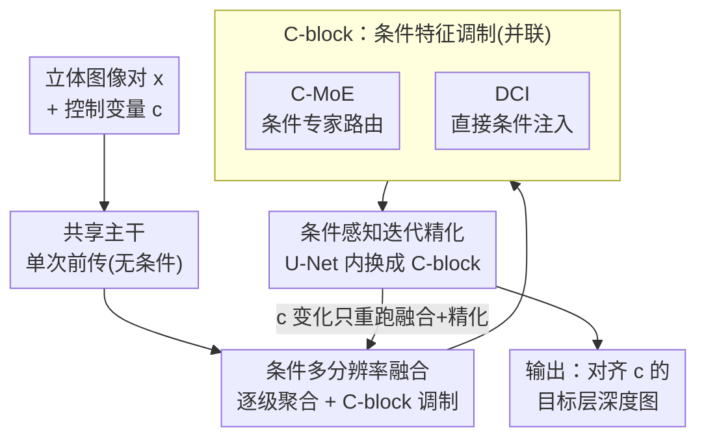

# DepthFocus: Controllable Depth Estimation for See-Through Scenes

**会议**: CVPR 2026  
**论文**: [CVF Open Access](https://openaccess.thecvf.com/content/CVPR2026/html/Min_DepthFocus_Controllable_Depth_Estimation_for_See-Through_Scenes_CVPR_2026_paper.html)  
**代码**: 无开源代码（仅项目页）  
**领域**: 3D视觉  
**关键词**: 立体深度估计, 可控深度估计, 透明/反射场景, 多层深度, 条件特征调制  

## 一句话总结
DepthFocus 把立体深度估计从"被动输出最近表面"重新定义为"由一个物理参考距离 $c$ 驱动的可控过程"，用一个可转向（steerable）的 ViT 通过条件 MoE + 条件注入两个模块动态调制特征，让网络像人眼对焦一样"逐层剥开"透明/反射遮挡，在标准单层基准和复杂多层场景上同时拿到 SOTA。

## 研究背景与动机
**领域现状**：单目和立体深度估计这十年进展很大，foundation 立体模型在非朗伯表面上也能拿到稳定的米制尺度。但主流范式有一个共同假设——**每个像素只有一个深度值**，输出一张锚定在"最近可见表面"的静态深度图。

**现有痛点**：真实世界并不是不透明的单层流形。透明隔断、玻璃、反射面、铁丝网会让同一像素叠加多个深度，形成分层结构。被动的单层模型直接丢掉了背景层的几何；而且歧义还和尺度/上下文有关——一道铁丝网近看是实心障碍、远看变成可穿透介质，造成像素级的严重不确定性。

**核心矛盾**：近期的多层工作大多是**在固定主干上加多头回归**（multi-head regression），并没有重新思考特征提取本身。用一套固定特征去同时编码多个重叠层，会把互相冲突的几何挤进有限容量的隐空间，形成**表征瓶颈**（representational bottleneck）：预测的深度往往收敛到几层的"平均值"，而不是干净地分离成不同表面。结果就是：要么只能恢复相对深度排序、要么牺牲了基本精度，连最近层都打不过单层 SOTA。

**本文目标**：在不牺牲标准不透明基准精度的前提下，统一地解决多层歧义——既要在普通场景拿 SOTA，又要能干净地分离透明/反射场景的多个层。

**切入角度**：作者类比人眼——人不是被动地拍下一组固定表面，而是**主动对焦**到感兴趣的深度平面。那么深度估计也应该是一个可"查询"的主动维度：给定一个物理参考距离，网络只重建对齐到那个距离的表面。

**核心 idea**：把深度估计写成一个受控函数 $f(x, c)$，标量控制变量 $c\in[0,1]$ 直接映射到物理视差范围；用条件 MoE 和直接条件注入两个模块，让网络**根据 $c$ 动态改变自己的计算路径**，选择性地提取目标深度层的特征——本质是一个可调的"自适应不透明度滤镜"。

## 方法详解

### 整体框架
DepthFocus 接收一对标定好的立体图像 $x$ 和一个标量控制变量 $c\in[0,1]$，输出一张"对齐到 $c$ 所指深度"的视差/深度图。整条流水线刻意设计成**重计算只跑一次**：一个无条件的高容量立体主干先做一次特征提取（这是最贵的一步，调 $c$ 时不重跑）；随后进入**条件多分辨率融合**阶段，把预存的多尺度特征逐级聚合，并用 C-block 按 $c$ 调制；最后进入**条件感知迭代精化**，在保持原 U-Net 收敛结构的同时让每轮残差更新也被 $c$ 调制。核心的可控性来自 C-block 内部并联的两个模块——条件 MoE（C-MoE）和直接条件注入（DCI）。

### 关键设计

**1. 条件化深度估计框架：把深度估计重写成由参考距离驱动的"选择"问题**

这是全文的范式转变。对像素 $(u,v)$，设其可能深度集合为 $\mathcal{Z}_{u,v}=\{z_1,\dots,z_n\}$（升序）。作者要求理想估计器 $f_{\text{ideal}}(x,c)$ 满足三条性质：① **不透明确定性**——对不透明区域 $S_o$，输出与 $c$ 无关（$f(x,c)_{u,v}=z_{u,v},\ \forall c$），保证标准场景不被控制变量扰动；② **透射区单调性**——对透射区 $S_t$，$c_a<c_b \Rightarrow f(x,c_a)_{u,v}\le f(x,c_b)_{u,v}$，即增大 $c$ 永远不会"退回"到更浅的层；③ **参考邻近 + 离散选择**——估计对齐到离参考平面 $d_{\text{ref}}(c)$ 最优的那个有效层：

$$f_{\text{ideal}}(x,c)_{u,v}=\operatorname*{argmin}_{z\in\mathcal{Z}_{u,v}}\mathcal{D}\big(z,\,d_{\text{ref}}(c)\big)$$

性质 ②③ 合起来要求 $f_{\text{ideal}}$ 对 $c$ 表现为**单调阶梯函数**：大多数区间内输出稳定，只在 $d_{\text{ref}}(c)$ 跨过层与层的决策边界时发生陡变。神经网络 $f_\theta$ 天然是连续逼近，框架的作用就是鼓励它去逼近这种离散跳变。这套形式化的价值在于：它把"同时回归所有层"这个病态目标，换成了"给定一个查询距离、确定性地挑一个层"，绕开了固定多头的表征瓶颈。

**2. C-MoE 条件专家路由：让不同深度层走不同的特征变换路径**

固定特征提取器的问题是用一套权重硬扛所有层。C-MoE 用一个条件混合专家结构破局：路由器 $R(x,c)$ 产生连续权重，把若干专家子网 $\{E_i\}$ 组合起来，

$$F(x,c)=\sum_{i=1}^{N} R(x,c)_i \cdot E_i(x)$$

关键是路由**显式地受 $c$ 驱动**——这和标准 MoE 由隐式数据统计做门控不同，这里是用物理控制变量去主动转向网络的计算焦点。专家数刻意保持很小（$N\le 3$），在保证表征多样性的同时控制开销。直觉上：不同 $c$ 激活不同专家组合，相当于为不同深度层准备了不同的"特征通道"，从而避免把冲突几何挤进同一隐空间。

**3. DCI 直接条件注入：用一个单项注意力把 $c$ 直接灌进特征流**

C-MoE 是隐式地"选路径"，DCI 则提供显式引导。它用一个单项（single-item）注意力块让特征 $x$ 和条件 $c$ 交互：

$$A(x,c)=\sigma(q_x\cdot k_c)\cdot v_c$$

其中 $\sigma$ 是 sigmoid，$(k_c,v_c)$ 是 $c$ 的可学习投影，$q_x$ 来自特征。输出 $A(x,c)$ 再过一层投影后加回特征流，保证注入的条件和高维特征对齐。和 C-MoE 并联放进 C-block（替换原本的 FFN）——一个负责"换路径"，一个负责"贴显式信号"，两路调制结果聚合后才改写主干特征，这样调 $c$ 时无需重跑重型主干。

**4. 条件感知监督：把抽象的 $c$ 锚定成可预测的物理深度**

光有可控架构不够，还得教会网络 $c$ 到底"对应多深"。作者把 $c$ 映射到参考视差：

$$d_{\text{ref}}(c)=(1-c)\cdot d_{\max}$$

$d_{\max}$ 是场景最大有效视差。在不同相机设置下训练，网络就学会把 $c$ 当成归一化的视锥坐标，实现米制精度的转向。**参考驱动的真值分配**是这条监督的灵魂：视差域里数值越小代表越远，于是对每个像素选"不超过 $d_{\text{ref}}$ 的最大视差"作为目标 $d^*$——

$$d^*=\begin{cases}\max\{d\in\mathcal{D}_{gt}\mid d\le d_{\text{ref}}(c)\} & \exists\,d\le d_{\text{ref}}(c)\\[2pt]\min\{\mathcal{D}_{gt}\} & \text{otherwise}\end{cases}$$

随着 $c$ 增大、$d_{\text{ref}}$ 朝背景缩小，训练目标会**阶梯式地切到下一个可用视差层**，从而把性质 ③ 的离散选择行为真正灌进网络。此外还挂了一个**辅助分割头**，鼓励主干编码材质语义（识别透射/反射区域），给条件模块提供消歧的语义线索。

### 损失函数 / 训练策略
基础模型 $C=192$ 用于消融，大模型 $C=384$ 用于刷榜。训练数据是 200 万对公开立体图 + 50 万对自建合成多层样本，配合"混合 $c$ 采样"策略；辅助分割损失在玻璃/镜面数据集上额外监督材质感知。合成数据用 Blender 程序化生成约 50 万对立体图（3577 个独立场景配置），每帧含对齐 RGB、逐层深度、视差和语义分割掩膜。

## 实验关键数据

### 主实验
**标准单层基准（Booster / Middlebury，EPE 与 Bad-x 越低越好）**：把模型设成"预测最近层"，DepthFocus 在两个基准都刷到 SOTA，且在 Booster 透射/反射子集上优势最大。值得注意的是它在相同训练数据下也胜过基线 S²M²(ft)，说明可控多层表征 + 语义集成提供了比单纯微调更好的归纳偏置。

| 模型 | Booster All EPE | Booster All Bad-4 | Booster 反/透 EPE | Booster 反/透 Bad-4 | Middlebury EPE |
|------|------|------|------|------|------|
| RAFTStereo | 7.11 | 21.79 | 14.30 | 48.25 | 1.27 |
| S²M² (ft) | 2.53 | 8.53 | 7.69 | 25.52 | — |
| FoundationStereo | 7.20 | 10.28 | 34.78 | 53.37 | 0.78 |
| **DepthFocus (nearest)** | **1.56** | **4.70** | **3.41** | **14.70** | **0.67** |

**多层合成基准（Bad-2/Bad-4，透射层）**：在叠加透射表面的高分辨率合成数据上，DepthFocus 全面碾压多层基线。固定多层架构（RAFT-4layer、ASGrasp）在透射层上几乎崩溃，而 DepthFocus 把透射 Layer 1 的 Bad-4 从两位数压到个位数。

| 模型 | 不透明 Bad-4 | 透射 L1 Bad-4 |
|------|------|------|
| S²M²-(ft) | 1.96 | 7.45 |
| RAFT-(4layer) | 17.16 | 57.09 |
| ASGrasp-(2layer)-ft | 7.52 | 36.86 |
| **DepthFocus-(nearest)** | **1.90** | **3.10** |

**真实双层基准（实验室亚克力板，60%/80% 透过率，Bad-4）**：这是最能说明问题的一组——缺乏窗框等语义线索时，依赖单目先验的基线（StereoAnywhere、FoundationStereo、S²M²-ft）在透射首层上 Bad-4≈99–100，几乎完全失败、默认退回背景深度；DepthFocus 在 80% 高透明度下仍能把首层 Bad-4 压到 7.33，干净地分离两层。

### 消融实验（合成基准，括号内为去掉该模块后的劣化）

| 配置 | 透射首层 Bad-2 | 透射末层 Bad-2 | 说明 |
|------|------|------|------|
| Full Model | 11.78 | 38.16 | 完整模型 |
| (−) C-MoE | 13.97 (+2.19) | 41.80 (+3.64) | 去条件专家路由，透射区掉点最明显之一 |
| (−) DCI | 14.75 (+2.97) | 41.39 (+3.23) | 去直接条件注入，首层劣化最大 |
| (−) Seg Loss | 13.15 (+1.37) | 37.70 (−0.46) | 合成集上差异小（训练/测试同分布），但对真实泛化有用 |
| (−) Data Curation | 15.59 (+3.81) | 40.61 (+2.45) | 去掉大规模单视差数据利用，全区域显著退化 |

### 关键发现
- **两个条件模块都有效，且在透射区增益最大**——这正是歧义最严重的地方；C-MoE 的增益略高于 DCI，二者并联互补。
- **数据策展（Data Curation）贡献最大**：去掉后透射首层 Bad-2 涨 +3.81，说明把 200 万对单视差公开数据有效纳入训练对整体性能是关键，数据规模仍是决定性因素。
- **分割损失在合成集上看似可有可无**（训练/测试同分布），但作者保留它是因为它显著改善真实世界未见场景的泛化——这也解释了为什么真实双层基准上 DepthFocus 没崩。
- **中间层（Layer 2/3）精度相对低**：弱匹配信号 + 重叠光传输让这些层连人类都难分辨，但相比多层基线仍有数倍误差下降。

## 亮点与洞察
- **"可控深度"这个范式本身是最大亮点**：把多层歧义从"同时回归全部层"（病态、易塌成平均值）改成"按参考距离选一层"（确定性、可单调扫描），从根上绕开了固定多头的表征瓶颈。这个 reframing 比具体模块更值钱。
- **单次主干 + 可调融合/精化的工程设计很聪明**：最贵的特征提取只跑一次，调 $c$ 时只重跑轻量的融合和精化，使"连续扫深度"在算力上可行——这是它能做到平滑 intent-driven 过渡的前提。
- **把 $c$ 显式锚定成 $d_{\text{ref}}=(1-c)d_{\max}$ + 参考驱动真值分配**，是让"控制变量"真正具备物理米制含义的关键 trick，可迁移到任何需要"标量条件↔物理量"对齐的可控生成/估计任务。
- **PCA 可视化揭示网络学成了"自适应不透明度滤镜"**：按目标焦距选择性调制特征透过率、强化目标层抑制其他层——给"可转向"提供了可解释证据。

## 局限与展望
- **中间层精度仍弱**：Layer 2/3 因弱匹配 + 重叠光传输而误差偏高（作者也承认），距离"任意层都精确"还有差距。
- **强依赖大规模合成数据**：50 万对 Blender 合成 + 200 万对公开立体图是性能基石，消融显示数据策展贡献最大；真实多层稠密标注极稀缺，sim-to-real 仍是隐忧。
- ⚠️ **评测协议引入了后处理**：多层对比时把连续输出在 30 个 $c$ 区间上采样 + mean-shift 聚类成离散层，作者强调这只是评测协议、不属于推理过程——横向比较 4layer 数字时需注意这一 caveat。
- **仅在立体（双目）语境实例化**：框架本身是通用的条件化估计，但论文只在立体上落地以保证米制尺度，单目/多视角下的可控性未验证。
- 改进方向：把可转向机制接入下游主动感知（机械臂"对焦"抓取被遮挡物）、用更强的真实多层标注缩小中间层差距。

## 相关工作与启发
- **vs LayeredFlow / RAFT-(4layer)**：它们用光流式分组的多头扩展恢复多层，真值稀疏且点状，依赖固定特征 → 表征瓶颈；DepthFocus 用条件调制动态换特征路径，在 LayeredFlow 验证集上各层误差数倍下降。
- **vs ASGrasp**：ASGrasp 是面向抓取的双层专用架构，和 object-centric 双层拓扑强耦合、难扩展到复杂场景；DepthFocus 是通用的参考引导框架，可连续选任意层。
- **vs 单目相对多层方法（Wen et al. / Xu et al.）**：它们靠相对排序或图像 prompting 调制高频成分，缺乏量化精度且无米制尺度；DepthFocus 用物理参考视差驱动，给出米制、可量化的可控深度。
- **vs 标准 MoE / DiT 条件**：标准 MoE 由隐式数据统计门控、DiT 用标量全局调制；DepthFocus 的不同在于用**物理控制变量**显式转向计算焦点，赋予条件以可解释的深度语义。

## 评分
- 新颖性: ⭐⭐⭐⭐⭐ 把深度估计重定义为参考距离驱动的可控选择问题，范式级创新
- 实验充分度: ⭐⭐⭐⭐⭐ 标准/合成/真实双层/LayeredFlow 四类基准 + 完整消融，且自建数据集
- 写作质量: ⭐⭐⭐⭐ 形式化（三性质 + 阶梯函数）清晰，但部分实现细节推给补充材料
- 价值: ⭐⭐⭐⭐⭐ 透明/反射场景是机器人与自动驾驶的真实痛点，主动 3D 感知方向有想象空间

<!-- RELATED:START -->

## 相关论文

- [\[CVPR 2026\] Seeing Depth Through Frequency and Motion: A Progressive Training Paradigm for Monocular Depth Estimation](seeing_depth_through_frequency_and_motion_a_progressive_training_paradigm_for_mo.md)
- [\[CVPR 2026\] PrITTI: Primitive-based Generation of Controllable and Editable 3D Semantic Urban Scenes](pritti_primitive-based_generation_of_controllable_and_editable_3d_semantic_urban.md)
- [\[CVPR 2026\] Depth Any Panoramas: A Foundation Model for Panoramic Depth Estimation](depth_any_panoramas_a_foundation_model_for_panoramic_depth_estimation.md)
- [\[CVPR 2026\] MD2E: Modeling Depth-to-Edge Cues for Monocular Metric Depth Estimation](md2e_modeling_depth-to-edge_cues_for_monocular_metric_depth_estimation.md)
- [\[CVPR 2026\] SCE-Depth: A Spherical Compound Eye Framework for Wide FOV Depth Estimation](sce-depth_a_spherical_compound_eye_framework_for_wide_fov_depth_estimation.md)

<!-- RELATED:END -->
