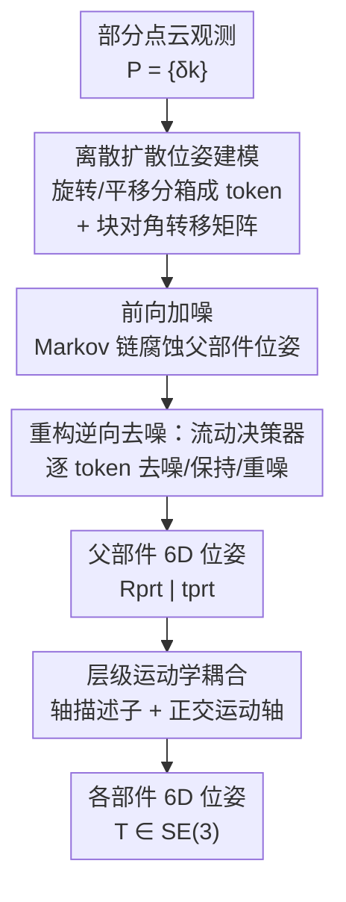

# DICArt: Advancing Category-level Articulated Object Pose Estimation in Discrete State-Spaces

**会议**: CVPR 2026  
**论文**: [CVF Open Access](https://openaccess.thecvf.com/content/CVPR2026/html/Zhang_DICArt_Advancing_Category-level_Articulated_Object_Pose_Estimation_in_Discrete_State-Spaces_CVPR_2026_paper.html)  
**代码**: [项目主页](https://sites.google.com/view/dicartpub)（仅项目页，暂未见开源代码）  
**领域**: 3D视觉  
**关键词**: 铰接物体位姿估计, 类别级6D位姿, 离散扩散, 运动学约束, 具身智能

## 一句话总结
DICArt 把铰接物体的类别级 6D 位姿估计重新建模成**条件离散扩散**过程——先把旋转/平移离散成 token，再用一个"流动决策器"逐步去噪、并按父子部件的运动学层级耦合估计各部件位姿，在合成、半合成与真实机械臂数据上都显著优于现有方法。

## 研究背景与动机
**领域现状**：类别级 6D 位姿估计要在只给定部分点云观测的情况下，预测一个**未见过实例**的 3D 旋转与平移。对刚体已有 NOCS、CASS 等成熟方案；而铰接物体（笔记本、眼镜、抽屉、机械臂等）由多个刚性部件通过关节连接，是机器人操作、跟踪、场景理解的核心，但研究明显滞后。

**现有痛点**：当前主流做法把位姿当成**连续空间的回归**。这带来两个具体问题：① 连续域上要在巨大、复杂的搜索空间里做穷举式搜索才能估准，而输入点云本身是**离散且非均匀采样**的——离散空间输入对连续位姿输出，存在根本的映射错配（mapping mismatch），限制了精度；② 铰接位姿方法普遍采用 **part-wise（逐部件独立估计）** 思路，忽略了关节施加的运动学约束，且当大部件遮挡小活动部件（自遮挡）时鲁棒性很差。

**核心矛盾**：连续回归的搜索空间太大、又和离散点云输入对不上；而逐部件独立建模丢掉了铰接结构里"子部件运动被关节锁死"这一强先验。

**本文目标**：(1) 把巨大的连续搜索空间换成一个**预先配置好的离散状态空间**，让生成过程天然落在物理合理的位姿区间；(2) 显式注入运动学结构，缓解自遮挡。

**核心 idea**：用**离散扩散**代替连续回归来求位姿——把每个部件的旋转/平移离散成 token 序列，通过学习到的逆扩散过程从噪声逐步恢复 GT 位姿；再叠加一个**层级运动学耦合**机制，把子部件位姿约束到关节定义的轨迹上。

## 方法详解

### 整体框架
输入是 K 个刚性部件的部分点云观测 $P=\{\delta_k\}_{k=1}^{K}$，输出是每个部件的 6D 位姿 $T=\{R^{(k)}, t^{(k)}\}_{k=1}^{K}\in SE(3)$。DICArt 把这件事写成条件生成 $p_\theta(T\mid P)$。

具体流程分三段串行：① **位姿离散化 + 前向加噪**——先把旋转矩阵转成三个欧拉角、平移转成三轴坐标，各自均匀分箱（bin）成 $[1,K]$ 的整数，于是每个位姿元素变成 6 个离散 token $e_i=\{l_i,m_i,n_i,x_i,y_i,z_i\}$；前向过程沿固定 Markov 链把 GT token 序列逐步腐蚀成噪声。② **重构的逆向去噪**——从纯噪声出发，用"流动决策器"逐 token 决定是去噪、保持还是重新加噪，恢复出**父部件**的 6D 位姿。③ **层级运动学耦合**——以父部件为运动参考系，用 MLP 预测每个**子部件**的关节轴描述子与运动轴，按旋转/平移关节的运动学规则反推子部件位姿，最终拼出整物体的铰接位姿。

### 关键设计

**1. 离散扩散位姿建模：把连续回归换成预配置离散状态空间里的去噪**

针对"连续搜索空间过大 + 离散点云对连续位姿的映射错配"这一痛点，DICArt 不再回归连续位姿，而是把 6D 位姿离散成 token、当作**条件离散扩散**来生成。旋转矩阵拆成三个独立欧拉角并在 $[0°,360°)$ 周期域上分箱，平移三轴各自分箱，于是位姿序列里出现两类语义不同的 token：旋转相关 $\{l,m,n\}$ 与平移相关 $\{x,y,z\}$。前向腐蚀写成 $q(x_t\mid x_{t-1})=x_t Q_t x_{t-1}$，逆向用学到的后验 $p_\theta(x_{t-1}\mid x_t)$ 从噪声恢复。

这里有两个关键的转移矩阵设计。其一是**块对角约束**：直接套用普通离散扩散会让 token 在去噪时乱窜——旋转 token 可能被错误转成平移 token，破坏位姿的结构完整性。作者据此把转移矩阵限制成块对角，只允许**同语义类别内部**转移：

$$Q^{pose}_t = \begin{pmatrix} Q^{rot}_t & \\ & Q^{tsl}_t \end{pmatrix}$$

其二是**平滑分类**：位姿分箱不同于普通类别分类（相邻 bin 在几何上是连续的），作者把状态空间从 $K$ 扩到 $K+1$，引入一个特殊 `[MASK]` token，让 $Q_t\in\mathbb{R}^{(K+1)\times(K+1)}$ 同时编码 $K$ 个量化位姿类与一个动态掩码态，使逆向过程能更灵活地纠正不确定 token。这样生成被约束在物理合理的离散位姿空间内，比连续穷举更稳。

**2. 重构逆向过程与流动决策器：让强耦合的位姿 token 同步收敛**

把旋转拆成三个欧拉角后，它们语义相关却又彼此独立，传统离散扩散难以让它们**同步去噪**：有的 token 在 $t<T$ 时就提前收敛到真值、有的还停在高噪态，这种**异步收敛**破坏 token 间语义一致性、拉低精度。DICArt 重写逆向过程，核心是一个**灵活流动决策器（flexible flow decider）**，让每个 token 在每一步都能在"去噪 / 保持 / 重新加噪"之间自适应选择。

机制上，逆向转移以 $x_t$ 是否等于 $x_0$ 分情况：

$$q(x_{t-1}\mid x_t, x_0)=\begin{cases}\lambda^{(1)}_{t-1}x_t+(1-\lambda^{(1)}_{t-1})x_T, & x_t=x_0\\ \lambda^{(2)}_{t-1}x_0+(1-\lambda^{(2)}_{t-1})q_{noise}(x_t), & x_t\neq x_0\end{cases}$$

当 token 已无噪（$x_t=x_0$）就倾向保持或回注噪声；当仍含噪（$x_t\neq x_0$）就朝 $x_0$ 去噪或保持噪声态。系数 $\lambda^{(1)},\lambda^{(2)}$ 由 $\alpha_{t-1},\beta_{t-1}$ 映射而来，终态 $x_T$ 对应 `[MASK]` 噪声分布。作者再引入一串二值流动指示子 $\{v_{t-1}\}$（由 Gumbel-Softmax 采样），把上式统一成一个可微的增广采样路径，逆向转移通过对 $v_{t-1}$ 求期望（边缘化）得到 $q(x_{t-1}\mid x_t,x_0)=\mathbb{E}_{v_{t-1}\sim GS(\lambda_{t-1})}[\cdot]$。直观说，这给了去噪一个"温柔且自适应"的节奏，避免某些 token 激进早收敛，换来更稳的位姿预测。

**3. 层级运动学耦合：用父子部件 + 关节轴先验压缩搜索空间、对抗自遮挡**

针对"逐部件独立估计忽略运动学约束、自遮挡下崩坏"的痛点，DICArt 把铰接物体按运动学分成两类部件：**父部件**（整个结构的运动参考，可在 3D 自由运动，通常只有一个，如柜体主体）与**子部件**（运动严格依附父部件和关节，被关节方向/轨迹锁死，如柜门、抽屉）。位姿不再各算各的，而是表示成一种**耦合状态**——这比直接回归每个刚体的 6D 位姿更易学，且即便子部件可见点很少，有限可见性也足以推出耦合状态，从而显著提升被遮挡部件的精度。

关节轴分两类、各有描述子：**旋转关节**参数化为 $\phi_r=(u_r, q_r)$，$u_r$ 是关节轴单位方向、$q_r$ 是旋转中心（如笔记本铰链）；**平移关节**参数化为 $\phi_p=(u_p)$，只给滑动方向（如抽屉）。模型用两个独立 MLP 分别预测：① **轴描述子**——确定关节方向 $u$，并映射到子部件对齐方向 $a^{(k)}$（约束其平行于 $u$）以保证几何一致性；② **运动轴 $b^{(k)}$**——施加**正交约束**强制 $b^{(k)}\perp a^{(k)}$，让预测的运动轨迹严格符合铰接物理规律。父部件位姿 + 轴描述子一起经空间运动学推理，恢复出各部件最终 6D 位姿。

## 实验关键数据

### 主实验

ArtImage 合成数据集上对比四个 SOTA（A-NCSH / GenPose / OP-Align / ShapePose），下表摘几个代表类别（旋转误差越低越好，单位 °）：

| 类别 | 指标 | A-NCSH | GenPose | ShapePose | DICArt |
|------|------|--------|---------|-----------|--------|
| Laptop | 部件旋转误差(°) | 5.3, 5.4 | 5.3, 6.1 | 5.0, 4.6 | **3.2, 3.9** |
| Eyeglasses | 平移误差(m) | 0.049,0.313,0.324 | 0.063,0.113,0.301 | 0.049,0.106,0.108 | **0.041,0.091,0.083** |
| Dishwasher | 部件旋转误差(°) | 4.0, 4.8 | 6.1, 6.3 | 3.9, 4.3 | **2.9, 3.7** |
| Scissors | 部件旋转误差(°) | 2.0, 2.9 | 4.1, 3.5 | 2.3, 2.9 | **1.7, 2.2** |

半合成 ReArtMix（对比 ReArtNet）与真实 7 部件 RobotArm（对比 A-NCSH）上，DICArt 同样全面领先——RobotArm 上平均旋转误差从 A-NCSH 的各部件 7.8~23.5° 降到 1.6~15.1°（平均约 8.2°），且越靠末端（自遮挡/累积误差越重）优势越明显：

| 数据集 | 设置 | 基线 | DICArt |
|--------|------|------|--------|
| ReArtMix · Drawer | 旋转误差(°) | 3.4, 3.9 | **1.5, 1.6** |
| ReArtMix · Box | 平移误差(m) | 0.026, 0.031 | **0.009, 0.010** |
| RobotArm · Part1/7 旋转(°) | 单部件 | 7.8 / 23.5 | **1.6 / 15.1** |

### 消融实验

全部在 Drawer 类别上做（表 2）：

| 配置 | 旋转误差(°) | 平移误差(m) | 说明 |
|------|-----------|-----------|------|
| 连续扩散（替换为 GenPose 式连续过程） | 3.1 | 0.143 | 离散→连续，掉点明显 |
| **离散扩散（本文）** | **1.7** | **0.072** | 验证离散状态空间更有效 |
| w/o 重构去噪 | 4.0 | 0.128 | 去掉流动决策器，旋转误差翻倍多 |
| **w/ 重构去噪** | **1.7** | **0.072** | 流动决策器是精度关键 |

自遮挡鲁棒性（按可见点比例分三档）：可见率 0–40% / 40–80% / 80–100% 下旋转误差仅 1.8 / 1.9 / 1.9°，几乎不随遮挡加重而退化；平移误差从 0.089 缓升到 0.107m，即便极端遮挡仍可用。

### 关键发现
- **离散 vs 连续是最大增益来源之一**：把扩散过程从连续换成离散，Drawer 旋转误差 3.1°→1.7°、平移 0.143→0.072m，直接验证了"预配置离散状态空间更好搜"的核心论点。
- **重构去噪（流动决策器）几乎决定成败**：去掉后旋转误差 4.0°、加上后 1.7°，说明同步收敛对强耦合的欧拉角 token 至关重要。
- **运动学耦合带来遮挡鲁棒性**：旋转误差在遮挡 0→100% 下基本平稳（1.8→1.9°），印证耦合状态表示能从有限可见性推出被遮挡部件位姿。

## 亮点与洞察
- **把"位姿回归"重写成"离散 token 去噪"**：用扩散的迭代精化天然把生成约束在物理合理的离散位姿空间内，绕开了连续域穷举搜索，且与离散点云输入在"离散性"上对齐——这个视角迁移性很强，刚体/手部/关节位姿都可借鉴。
- **块对角转移矩阵**是个简单却到位的 trick：用结构约束防止旋转 token 与平移 token 互窜，保住位姿语义完整性，几乎零额外成本。
- **流动决策器解决"异步收敛"**：把"每个 token 该去噪还是该重噪"做成可微的 Gumbel-Softmax 二值门控，是对离散扩散逆向过程的通用改进，不限于位姿任务。
- **耦合状态对抗自遮挡**：不独立估子部件，而是把它锁到父部件+关节轴上，把"看不全也能算准"变成结构性保证，对真实机械臂这种深层级铰接特别有价值。

## 局限与展望
- 论文未公开完整代码（仅项目页），复现成本较高。⚠️ 以原文/项目页为准。
- **依赖部件分割/对应已知**：方法建立在"已知 K 个刚性部件及父子层级"之上，若部件数未知或层级歧义（多父部件、闭环关节）如何处理，文中未讨论。
- **扩散步数较多**（T=100），逆向迭代对实时机器人操作可能偏慢，论文未报告推理延迟。
- **分箱粒度的精度上限**：旋转/平移都被量化（bin size 360），理论精度受分箱分辨率约束；更细的箱会增大状态空间，存在精度-效率权衡，文中未做敏感性分析。

## 相关工作与启发
- **vs GenPose（连续扩散）**：两者都用扩散建位姿，但 GenPose 在连续 canonical 空间去噪，DICArt 在离散 token 空间去噪；消融里把 DICArt 退化成连续过程后掉点明显，支持"离散更好搜"的主张。
- **vs A-NCSH / ReArtNet（part-wise 铰接位姿）**：它们逐部件独立估计、忽略关节约束，自遮挡下崩坏；DICArt 用层级运动学耦合把子部件锁到关节轴，遮挡鲁棒性和真实场景精度都更高。
- **vs D3PM 系离散扩散**：DICArt 借鉴 D3PM 的结构化离散腐蚀与 `[MASK]` 扩展，但针对位姿 token 的异构性（旋转/平移）新增了块对角转移与流动决策器，是面向位姿任务的定制化改造。

## 评分
- 新颖性: ⭐⭐⭐⭐⭐ 首次把类别级铰接位姿估计建模为条件离散扩散，块对角矩阵+流动决策器+运动学耦合三件套组合新颖
- 实验充分度: ⭐⭐⭐⭐ 合成/半合成/真实三类数据全覆盖、消融到位，但缺推理速度与分箱粒度敏感性分析
- 写作质量: ⭐⭐⭐⭐ 动机清晰、公式完整，但逆向过程的 Gumbel-Softmax 增广推导较密、初读需反复对照
- 价值: ⭐⭐⭐⭐ 为具身/机器人操作提供了鲁棒的铰接 6D 位姿新范式，遮挡场景实用性强

<!-- RELATED:START -->

## 相关论文

- [\[CVPR 2026\] SCAPO: Self-Supervised Category-Level Articulated Pose Estimation from a Single 3D Observation](scapo_self-supervised_category-level_articulated_pose_estimation_from_a_single_3.md)
- [\[CVPR 2026\] SE(3)-Equivariance with Geometric and Topological Guidance for Category-Level Object Pose Estimation](se3-equivariance_with_geometric_and_topological_guidance_for_category-level_obje.md)
- [\[CVPR 2026\] ComPose: A Unified Completion-Pose Framework for Robust Category-Level Object Pose Estimation](compose_a_unified_completion-pose_framework_for_robust_category-level_object_pos.md)
- [\[CVPR 2026\] Exploring 6D Object Pose Estimation with Deformation](exploring_6d_object_pose_estimation_with_deformation.md)
- [\[CVPR 2026\] PartDiffuser: Part-wise 3D Mesh Generation via Discrete Diffusion](partdiffuser_part-wise_3d_mesh_generation_via_discrete_diffusion.md)

<!-- RELATED:END -->
