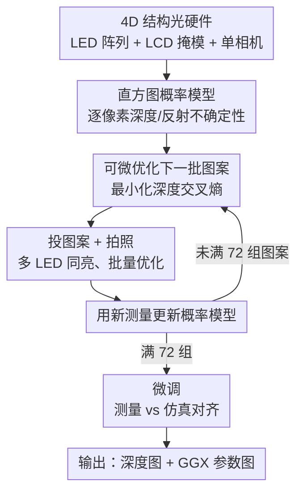

# Differentiable Adaptive 4D Structured Illumination for Joint Capture of Shape and Reflectance

**会议**: CVPR2026  
**arXiv**: [2605.06214](https://arxiv.org/abs/2605.06214)  
**代码**: 待确认  
**领域**: 3D视觉 / 外观采集（structured light / SVBRDF）  
**关键词**: 4D 结构光, 可微采集, 自适应照明, 深度不确定性, GGX SVBRDF

## 一句话总结
用一套统一的"空间-角度 4D 结构光"硬件（LED 阵列 + LCD 掩模 + 单相机），在采集过程中**可微地实时优化下一组光/掩模图案**，以最小化逐像素深度不确定性，从而在单视角下高效联合重建物体的形状（深度图）和反射率（GGX SVBRDF），曝光时间最多降低 100×、总采集时间缩短 2×。

## 研究背景与动机
**领域现状**：主动结构光是高质量采集几何或反射率的主流手段——投空间图案做三角测量得到形状，投角度图案（光照复用）卷积 BRDF 得到外观。最近 Xu 等人 [43] 首次提出统一空间-角度的 **4D 结构光**，用一个 LED 阵列 + 一块 LCD 掩模把这两类照明压进同一套紧凑硬件里。

**现有痛点**：[43] 虽然硬件上能同时采空间和角度信息，但效率很差——扫一个视角要 **24 分钟**，绝大部分时间花在几何采集上，且每次只点亮**一个 LED**，单灯功率有限导致单次曝光长达 20s。更关键的是，它的照明图案是**离线预优化**的，对具体某个待数字化物体并非最优。

**核心矛盾**：照明图案要么"通用但低效"（预优化、单灯、慢），要么"高效但需自适应"。预优化图案无法针对当前物体的形状/材质把采集预算花在"最不确定"的地方，于是大量曝光被浪费在已经确定的区域。

**本文目标**：(1) 让多个 LED 同时点亮以缩短曝光；(2) 让照明图案在采集中**随物体在线自适应**，把测量集中到深度最难判别的像素上；(3) 一次采集同时拿到形状和反射率。

**切入角度**：把"下一组该投什么图案"建模成一个**可微优化**问题——只要能把"图案 → 测量 → 不确定性"这条链可微地连起来，就能用梯度直接求解最有信息量的下一组图案。作者进一步观察到：反射率即使用很少的变光照片也能可靠恢复，所以把优化目标**只聚焦在更难的深度不确定性**上，反射率作为副产品顺带得到。

**核心 idea**：用一个直方图概率模型量化每个像素的深度/反射不确定性，再**可微地把"下一组光/掩模图案"连到"降低深度不确定性"的损失上**，边采边优化，最后微调出深度图 + GGX 参数图。

## 方法详解

### 整体框架
整个 pipeline 分两阶段。**阶段一（可微自适应采集）**：对每个有效像素建立基于直方图的深度/反射概率模型，量化当前不确定性；然后**可微优化下一批光/掩模图案**使总深度不确定性最小，投出图案、拍照、用新测量更新概率模型，循环直到投满 72 组图案。**阶段二（微调）**：以阶段一的深度/反射估计为初值，最小化"物理测量 vs 仿真测量"的差异，联合细化深度图和 GGX 反射率参数图。最终输出一张深度图和若干存 GGX BRDF 参数的纹理图。

支撑这条链的是一个**前向成像模型**（Eq. 1）：像素 $k$ 在第 $j$ 组图案下的测量 $I_{j,k}=\sum_l f_{k,l}\,F\,L_j(l)\,\Psi(-\omega^i_k)\int_A L(\mathbf{x}_l)M_j(\mathbf{x}_l\leftrightarrow\mathbf{x}_k)\,dA$，把 LED 强度 $L_j(l)$、掩模值 $M_j$、BRDF $f_{k,l}$、形状因子 $F$ 全部可微地耦合起来——这正是后续能对图案求梯度的基础。

### 关键设计

**1. 直方图概率模型：把"我对这个像素有多确定"变成可优化的量**

要自适应采集，先得有一个量化"还有多不确定"的标尺。作者为每个有效像素的深度和每个 BRDF 参数各建一个**基于直方图的概率质量函数**，并假设各参数相互独立。以深度为例：先用相机光线与有效体积（$15\text{cm}^3$ 立方体）求交确定深度范围 $[z_{\min},z_{\max}]$，再均匀切成 $n_{\text{bin}}=100$ 个 bin；每个 bin 存"落在该 bin 内的所有随机候选中、ZNCC 分数最高的那个"——ZNCC 在物理测量和 Eq. 1 仿真测量之间计算，是深度采集常用度量。反射参数的模型同理，只是范围取自 OpenSVBRDF [28] 的统计、并用 $\mathcal{L}_1$ 距离的倒数代替 ZNCC（外观重建常用 $\mathcal{L}_1$）。更新用蒙特卡洛：每轮采 $n_{\text{sample}}=600$ 个候选，算分后写回对应 bin 取最高分，再归一化成概率分布。随着自适应照明下测量增多，分布会逐渐**向真值收敛**（更尖锐 = 更确定）

**2. 可微优化下一批图案：让梯度告诉硬件"接下来照哪里最有信息量"**

有了不确定性度量，关键是把"下一组图案"直接连到"降不确定性"的损失上。作者把深度估计当成**多分类问题**：从当前概率分布采若干候选，每个候选自成一类，逐像素的不确定性写成交叉熵 $-\sum_{a,b}y_{a,b}\log(\hat y_{a,b})$，其中预测似然 $\hat y_{a,b}=\dfrac{e^{\mathrm{ZNCC}(\{I_{j,a}\},\{I_{j,b}\})}}{\sum_b e^{\mathrm{ZNCC}(\{I_{j,a}\},\{I_{j,b}\})}}$ 由"现有 + 下一组图案"下的仿真测量算出。直觉上，这个损失鼓励**不同候选在待优化图案下产生尽量可区分的测量**——也就是去投那些最能把"还分不清的几个深度"拉开的图案。由于 Eq. 1 全程可微，直接对下一组光/掩模图案做梯度下降即可。为物理可实现，图案像素过 sigmoid 限到 $[0,1]$；掩模像素先乘一个大标量（$10^8$）再过 sigmoid，逼近二值 0/1。注意损失**只针对深度不确定性**、不显式管反射——因为反射用少量变光照片就能可靠恢复，把算力都留给更难的深度

**3. 多 LED 同亮 + 批量图案优化：把单灯长曝光的低效一次性抹平**

[43] 每次只点一个 LED、单次曝光 20s，是效率瓶颈的根源。本文允许**多个 LED 同时点亮**形成复用照明，单次曝光降到 0.2s，曝光时间最多缩短 **100×**。同时为摊薄优化开销，每次**批量优化 $n_{\text{batch}}=3$ 组图案**而非一组。另一个加速点是候选剪枝：发现并非每个候选都同等重要——ZNCC 远低于当前最优的候选几乎不可能是解，而深度和最优解极接近的候选超出了 LCD 分辨率、无法用图案区分；因此实际只取 **top $n_{\text{peak}}=3$** 个峰值 ZNCC 的候选参与交叉熵（用带自适应阈值的局部极大滤波做峰值检测），既不漏掉好解又加速收敛

**4. 两步微调：用神经隐变量重参数化绕开 GGX 难优化**

自适应采集只给出直方图级别的粗估计，需要微调到高质量。第一步**初始化**：把每个直方图的 bin 再细分成 5 份，取最高分 bin、在其范围内均匀采样作为深度/GGX 参数初值。第二步**联合微调**：最小化物理测量与 Eq. 1 仿真测量之差，同时细化深度和反射。由于直接优化原生 GGX 参数很困难 [43]，作者把 BRDF **重参数化为 16 维神经隐向量 + 5 个 MLP**，每个 MLP 把隐向量映射到一个 GGX 参数，便于可微优化；微调前为每像素预计算一个能近似初值的隐向量。分辨率上采集时用 $127\times64$ 低分辨率算图案，微调时从低分辨率逐步上采到原始分辨率（约 $1024\times1024$）

### 损失函数 / 训练策略
- **采集阶段损失**：所有有效像素深度交叉熵（Eq. 3）之和，只优化深度不确定性。
- **微调阶段损失**：物理测量与仿真测量（Eq. 1）的差异，联合优化深度 + GGX 隐向量。
- 优化器 Adam，学习率 $10^{-3}$，权重衰减 $10^{-6}$，PyTorch 实现。
- 终止条件：投满 72 组（$3\times24$）光/掩模图案（其他终止条件也可用）。

## 实验关键数据

实验在 10 个真实物体上单视角采集，最大尺寸 9–15cm，外观从漫反射主导的黏土/木头/塑料到高镜面金属漆/蜡涂层。单张曝光 0.2s、仅用 LDR 输入；硬件为 RTX 3090。自适应采集约 **10 分钟**（绝大部分是图案优化，总曝光仅 **15 秒**），联合微调约 2 小时。几何质量用 RMSE、inlier 占比（绝对深度误差 < 3mm）、inlier 内 RMSE 衡量，真值由商用 3D 扫描仪获得。

### 主实验（几何，部分物体节选自 Fig. 6）

| 物体 | 方法 | 全图 RMSE | inlier RMSE (占比) |
|------|------|-----------|--------------------|
| Pig | 本文(自适应) | **3.75mm** | 0.31mm (97%) |
| Pig | 本文(非自适应) | 4.68mm | 0.47mm (94%) |
| Pig | Xu et al. [43] | 12.12mm | 0.60mm (81%) |
| Pig | MPS [16] | 66.39mm | 1.13mm (60%) |
| Rabbit | 本文(自适应) | **2.26mm** | 0.28mm (99%) |
| Rabbit | Xu et al. [43] | 4.21mm | 0.52mm (94%) |
| Rabbit | MPS [16] | 8.99mm | 1.04mm (95%) |
| Hedgehog | 本文(自适应) | **7.30mm** | 0.50mm (91%) |
| Hedgehog | Xu et al. [43] | 11.66mm | 0.61mm (82%) |
| Hedgehog | MPS [16] | 44.05mm | 1.32mm (77%) |

反射率方面（Fig. 6 后三列，novel-light 重照渲染 vs 真实照片）本文与 [43] 相当并贴近照片，如 Pig SSIM=0.96 / LPIPS=0.036 / PSNR=34.03，Rabbit SSIM=0.95 / LPIPS=0.043 / PSNR=31.81——印证"反射率可作为副产品高质量恢复"的设计假设。

### 消融实验

| 消融维度 | 配置 | 全图 RMSE | inlier RMSE (占比) | 结论 |
|----------|------|-----------|--------------------|------|
| 自适应 vs 固定 | 自适应 (Pig) | 3.75mm | 0.31mm (97%) | 自适应显著优于预训练固定 72 图案 |
| 自适应 vs 固定 | 非自适应 (Pig) | 4.68mm | 0.47mm (94%) | |
| 图案数 | 36 / 54 / 72 | 4.95 / 4.94 / 4.78mm | 93/93/94% | 图案越多深度越准 |
| 采样数 $n_{\text{sample}}$ | 100 / 300 / 600 | 1.87 / 1.79 / 1.75mm | 98.6/98.7/99.1% | 蒙特卡洛样本越多越准、算力越高 |
| 批大小 $n_{\text{batch}}$ | 2 / 3 / 6 | 3.57 / 3.54 / 3.59mm | 97.9/98.3/97.6% | 同总采集时间下 3 为最优折中 |
| 峰值数 $n_{\text{peak}}$ | 2 / 3 / 6 | 2.40 / 2.30 / 2.40mm | 97.4/97.9/96.9% | 3 在漏解与收敛速度间最优 |
| bin 数 $n_{\text{bin}}$ | 50 / 75 / 100 | 7.58 / 7.53 / 7.30mm | 90.2/90.3/91.0% | 更细 bin 更准、更费算力 |
| 算图分辨率 | 512×256 / 254×128 / 127×64 | 4.20 / 4.17 / 3.71mm | 94.4/94.5/93.3% | 低分辨率算图案兼顾精度与性能 |

另有 Fig. 7：相比 [43] 单灯，多 LED 能从不同方向补光、减少阴影区，结果更完整（单灯左/右角点亮时 RMSE 高达 22–33mm、inlier 占比掉到 41–64%）。

### 关键发现
- **自适应是核心增益**：同为 72 图案，自适应比固定图案在 Pig 上 RMSE 从 4.68mm 降到 3.75mm；相比上一代 [43] 的 12.12mm 是数量级改善。
- **效率提升来自多灯 + 短曝光**：总曝光仅 15 秒（[43] 单次就 20s），曝光最多省 100×、总采集时间省 2×。
- **反射率"白嫖"假设成立**：仅优化深度不确定性，反射率仍能达到与 [43] 相当的 PSNR/SSIM。
- 超参 $n_{\text{batch}}=3$、$n_{\text{peak}}=3$ 均是"折中型"最优，过大过小都掉点或变慢。

## 亮点与洞察
- **把"采集策略"变成一个可微优化问题**：以往自适应采集多靠启发式（从预定义集合选图案、最大化信息增益），本文直接对连续的高维光/掩模图案做梯度下降，是真正的端到端可微采集——这种"前向成像可微 → 反传到照明参数"的范式可迁移到其他主动传感任务。
- **只优化难的、白送容易的**：洞察到"反射率好恢复、深度难"，于是损失只盯深度，反射率顺带出——这种"把算力投到瓶颈维度"的取舍很务实。
- **掩模二值化的小技巧**：乘 $10^8$ 再过 sigmoid 把连续变量挤成 0/1，既保持可微又满足 LCD 物理上只能透/不透的约束，是个可复用的可微离散化 trick。
- **候选剪枝有物理依据**：剔除"分不开（超 LCD 分辨率）"和"几乎不可能（ZNCC 太低）"两类候选，把交叉熵集中在真正待判别的峰上，既省算力又稳。

## 局限与展望
- **不建模间接光**：深度不确定性优化未考虑物体间/物体内的二次反射，强互反射场景可能受限（作者承认）。
- **表征能力有限**：深度图 + 参数化 GGX BRDF 对复杂材质/半透明/各向异性表达力不足；作者展望结合 Gaussian Splatting 等支持高质量重照的表征。
- **单视角**：聚焦单视角高质量重建，完整 3D 物体扫描留给正交技术——拼接多视角仍需额外工作。
- **微调慢**：联合微调约 2 小时，虽可并行化但仍是端到端落地的时间成本；采集 10 分钟里大部分耗在图案优化而非曝光，优化速度是后续可压缩点。
- 展望把该思路用于手持设备的自由扫描，配微型化的空间-角度结构光。

## 相关工作与启发
- **vs Xu et al. [43]（最接近的 4D 结构光）**：两者共享同款 LED+LCD 单相机硬件，但 [43] 是"先当投影仪采几何、再当 lightstage 采外观"的两段式、单灯、预优化 2D 图案；本文是**首个 4D 空间-角度的学习式复用**，多灯同亮 + 在线自适应 + 同时采形状反射，效率（曝光 100×、总时间 2×）和质量（RMSE 数量级下降）都更优。
- **vs MPS [16]（传统空间结构光）**：MPS 用固定频带相移图案做几何，本文在所有对比物体上 RMSE 大幅领先（如 Pig 3.75mm vs 66.39mm），且 MPS 不采反射率。
- **vs 自适应采集类方法（[35] 从预定义集选图案 / [23][12] 外观采集的视图/光向规划 / [26] 元学习优化采样）**：这些多为离散选择或针对单一模态，本文用**连续可微**的方式联合优化高维结构光、且同时覆盖形状与反射率。
- **vs 固定图案分治反射重建 [29]**：[29] 用固定照明学分治策略，本文照明本身在线自适应。

## 评分
- 新颖性: ⭐⭐⭐⭐⭐ 首个 4D 空间-角度学习式复用 + 可微在线自适应采集，范式有原创性
- 实验充分度: ⭐⭐⭐⭐ 10 个真实物体、与 SOTA 几何/反射对比 + 7 组超参消融，扎实；但物体数偏少、缺多视角验证
- 写作质量: ⭐⭐⭐⭐ 成像模型与优化推导清晰，但部分细节（隐向量重参数化、校准）外包给 [43] 和补充材料
- 价值: ⭐⭐⭐⭐ 把主动采集做成可微优化的思路对硬件感知/计算成像有较强迁移价值，落地仍受微调耗时与单视角限制

<!-- RELATED:START -->

## 相关论文

- [\[CVPR 2026\] D-Prism: Differentiable Primitives for Structured Dynamic Modeling](d-prism_differentiable_primitives_for_structured_dynamic_modeling.md)
- [\[CVPR 2026\] Unified Primitive Proxies for Structured Shape Completion](unified_primitive_proxies_for_structured_shape_completion.md)
- [\[CVPR 2026\] MoCapAnything: Unified 3D Motion Capture for Arbitrary Skeletons from Monocular Videos](mocapanything_unified_3d_motion_capture_for_arbitrary_skeletons_from_monocular_v.md)
- [\[CVPR 2026\] VENI: Variational Encoder for Natural Illumination](veni_variational_encoder_for_natural_illumination.md)
- [\[CVPR 2026\] LangField4D: Learning Identity-Adaptive and Spatio-Temporal Continuous 4D Language Fields for Dynamic Scenes](langfield4d_learning_identity-adaptive_and_spatio-temporal_continuous_4d_languag.md)

<!-- RELATED:END -->
