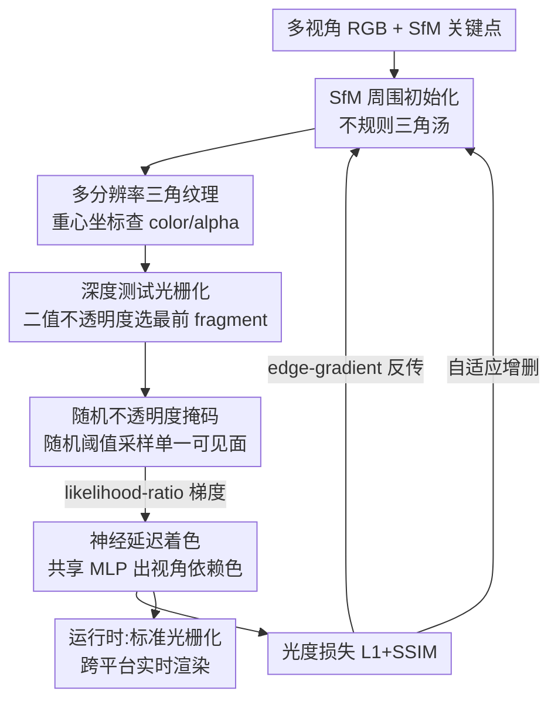

# DiffSoup: Direct Differentiable Rasterization of Triangle Soup for Extreme Radiance Field Simplification

**会议**: CVPR 2026  
**论文**: [CVF Open Access](https://openaccess.thecvf.com/content/CVPR2026/html/Tojo_DiffSoup_Direct_Differentiable_Rasterization_of_Triangle_Soup_for_Extreme_Radiance_CVPR_2026_paper.html)  
**代码**: https://github.com/kenjitojo/diffsoup  
**领域**: 3D视觉  
**关键词**: 辐射场简化, 可微光栅化, 三角面片汤, 随机不透明度掩码, 跨平台渲染  

## 一句话总结
DiffSoup 把辐射场表示成不到 2 万个带神经纹理、二值不透明度的不规则三角面片（triangle soup），并提出"随机不透明度掩码"让不透明三角光栅化直接可微，从而用标准深度测试管线在笔记本和手机上实时渲染，质量超过同等图元预算的 3DGS / 三角 splatting。

## 研究背景与动机
**领域现状**：从多视角 RGB 重建辐射场，主流是 NeRF 的体渲染和 3DGS 的点基元 splatting。它们视觉质量很高，但代价是动辄百万级图元，且渲染依赖透明度混合 + 深度排序，强烈绑定专用 GPU。

**现有痛点**：要把内容塞进手机、VR 头显、网页传输这类受限平台，必须把图元数压低几个数量级（"极端简化"）。但现有路线在低预算下都失灵：3DGS 没有控制最终图元数的机制、低预算下细节和边界糊掉；TriangleSplatting 用无纹理三角，低多边形下表达力不足；TexturedGaussians 加了纹理但仍画不出干净锐利的边界；MobileNeRF 虽能转成 mesh，却不直接对最终不透明 mesh 求导，而是先训一个 NeRF 再转换，导致面数失控（常 >15 万面）且高频细节丢失。

**核心矛盾**：传统图形管线只擅长渲染"带纹理的不透明三角"，但不透明三角恰恰最难训练——它完全遮挡背后表面、在轮廓处产生不连续的颜色跳变，梯度传不下去。于是大家退而用 mollifier（把光栅化抹平成软光栅）来换可微性，但抹平会压制高频外观细节，还要小心调度模糊强度。这就是"可微"与"保细节/保锐利"之间的死结。

**本文目标**：定义并解决"极端辐射场简化"问题——用一小撮（典型 <2 万）带紧凑神经纹理、二值不透明度的不透明三角，直接重建出能塞进传统实时渲染管线的场景。

**切入角度**：作者借鉴隐式曲面重建里的"随机曲面"思想（Zhang et al.），把空间每一点看成以其不透明度为概率出现的无穷小不透明面。这个思想能让二值不透明度自然收敛、且精确复现不透明渲染的像素色，无需 mollifier。问题是它建立在连续空间采样上，和"显式图元 + 深度排序"的离散光栅化天生不兼容。

**核心 idea**：把"随机曲面过程"搬进标准深度测试光栅化管线——给每个 fragment 注入一个随机阈值来挑选可见面（随机不透明度掩码），让像素色变成随机变量，用 likelihood-ratio 梯度恒等式得到对二值不透明度的无偏、免排序梯度；再扩展 edge-gradient 处理纹理不透明度引入的隐式遮挡边界，从而对不透明三角汤"直接可微"。

## 方法详解

### 整体框架
输入是多视角 RGB 图像，输出是一个带神经纹理、二值不透明度的不规则三角面片集合，可被标准深度测试光栅化器直接渲染。整条管线分两套逻辑：**运行时**纯粹是"带二值不透明度的不透明三角光栅化 + 一个共享 MLP 做延迟着色"，跑在标准顶点/片元 shader 上；**训练时**额外引入随机不透明度掩码和 edge-gradient，把这个本质离散的光栅化过程变成可微，从而用光度损失反传去优化顶点位置、神经纹理、不透明度。

具体地：三角内的颜色/不透明度由重心坐标查"多分辨率三角纹理"得到（多个网格分辨率叠加做超参数化以稳住优化）；光栅化产出高维特征图，逐像素送进一个轻量共享 MLP 输出最终带视角依赖的颜色；不透明度则作为标量纹理独立存储、不进网络。训练从 SfM 关键点周围随机初始化三角，用随机不透明度掩码求不透明度梯度、用 edge-gradient 求顶点运动梯度，并周期性地细分过大边、剪除低覆盖三角以严格控制图元预算。

### 关键设计

**1. 随机不透明度掩码：把"随机曲面"搬进离散光栅化，让二值不透明度免排序可微**

这是全文的核心，针对"不透明三角的二值不透明度无法直接求梯度"的死结。标准对象序光栅化不会给出逐像素深度排序的 fragment，所以随机曲面那套基于连续采样的辐射场损失没法直接用。作者把不透明度的阈值从固定的 0.5 换成一个独立均匀采样的随机阈值 $\tau_f \sim U[0,1]$，选中的最前可见 fragment 变成 $f^*_\tau = \arg\min_{f:\,\alpha(b_f)>\tau_f} D_f$，得到的像素色 $\hat{C}_\tau = C_{f^*_\tau}(b_{f^*_\tau})$ 成了随机变量：不透明度高的 fragment 更可能过阈值、被选中。关键恒等式是——某 fragment $f$ 被选为最前面的概率，恰好等于体渲染混合权重 $p(f;\theta)=w_f$，其中 $w_f=\bar\alpha_f\,\alpha_f$、$\bar\alpha_i=\prod_{j=1}^{i-1}(1-\alpha_j)$ 是累计透过率，而这个 $\arg\min$ 用 z-buffer 就能算、**不需要对 fragment 排序**。于是辐射场损失写成期望

$$\mathcal{L}_{\exp} = \mathbb{E}_{p(f;\theta)}\big[L_1(\hat{C})\big].$$

把光栅化看成离散随机过程后，可用 likelihood-ratio 梯度恒等式得到无偏梯度：

$$\partial_\theta \mathbb{E}_{p(f;\theta)}[L_1(\hat{C})] = \mathbb{E}_{p}[\partial_\theta L_1(\hat{C})] + \mathbb{E}_{p}\big[L_1(\hat{C})\,\partial_\theta \log p(f;\theta)\big].$$

第一项是采样 fragment 精确颜色的常规损失梯度；第二项把"对不透明度的梯度"用像素色损失加权传播，score 项化简成只依赖于自身与被采样 fragment 的局部表达式：对 $f'=f$ 为 $1/\alpha_f$，对深度更前的遮挡者（$D_{f'}<D_f$）为 $-1/(1-\alpha_{f'})$，更靠后的 fragment 不产生梯度。这样每个 fragment 的不透明度梯度只看采样面和它自己，是个完全跑在深度测试光栅化器内部的、免排序高效梯度估计器。相比 MobileNeRF 用 straight-through estimator 近似二值梯度（几何优化不稳、还要预训 NeRF），它有理论保证、能直接收敛到二值不透明度并精确复现不透明渲染色。

**2. edge-gradient 处理隐式遮挡边界：给"纹理挖出来的"亚三角轮廓补上运动梯度**

随机不透明度掩码只解决了不透明度的梯度，没解决"三角顶点该往哪挪"的运动梯度。传统可微光栅化的 edge-gradient 靠"相邻像素三角 ID 变化"来检测可见性边界，但 DiffSoup 里二值不透明度纹理会在三角**内部**挖出可见性不连续（亚三角轮廓），这些边界不改变三角 ID、因此被漏检。作者的做法是：在随机中间图像上，对所有水平和垂直相邻像素对都计算 edge-gradient 表达式，把 edge-gradient 自然推广到这种由不透明度诱导的隐式边界。在训练迭代上做平均后，就得到与"收敛后二值不透明度形成的有效亚三角轮廓"对齐的、稳定的运动梯度，从而准确优化三角几何与摆放。

**3. 多分辨率三角纹理 + 神经延迟着色：在极小图元下塞进高频细节与视角依赖外观**

低预算下细节全靠纹理，所以纹理的参数化方式直接决定上限。普通做法是把三角汤摊到 2D 纹理 atlas 上，但 atlas 会把不相关的三角在纹理空间里排到一起，破坏"多分辨率优化"。作者改用无 atlas 的"mesh color"思路并扩展成可学习特征：在递归细分的三角网格顶点上放可学习特征，第 $R$ 级有 $(2^{R-1}+1)(2^R+1)$ 个特征顶点，查询时在所含微三角内做重心插值。训练时把低分辨率网格 $R_{\min}\dots R_{\max-1}$ 全部累加到最细网格上做超参数化（稳住优化），过 sigmoid 限到 $[0,1]$；训练完只保留最细一层、存成 8-bit PNG，运行时只查一层。颜色侧用神经延迟着色：每个三角携带 $N_{\text{feat}}=7$ 维特征向量，光栅化成逐像素特征图后，一个共享轻量 MLP 拼上视角方向输出最终色，从而无需球谐就能建模视角依赖，且不增加纹理存储；不透明度作为标量纹理留在网络外（因为随机不透明度掩码要对所有 fragment 算不透明度、只有"赢家"的颜色参与求导，这样存取更高效）。

**4. 自适应图元控制 + 由粗到细优化：严格卡死预算的同时维持均匀细节**

要在"重建保真"和"紧凑预算"间硬卡一个目标面数，需要动态增删三角。作者周期性（每 100 次迭代）地：对视空间边长超过图像高度某比例（实验取 $1/5$）的边做细分，逼近视空间边长均匀、用满纹理分辨率；同时按训练视角上的像素覆盖率从低到高剪除三角，直到达到目标预算。边分裂的视空间边长在随机抽的 20 个训练视角上算以省开销。纹理则由粗到细：前 5000 步用 $R_{\min}=R_{\max}=3$（仅顶点特征），后 5000 步切到 $R_{\min}=2,R_{\max}=5$，几何和颜色收敛都更稳。

### 损失函数 / 训练策略
光度目标是 L1 与 SSIM 的加权和 $\lambda L_1 + (1-\lambda)\mathcal{L}_{\text{SSIM}}$，$\lambda=0.8$（跟随 3DGS），损失在随机渲染上评估（对应期望损失式）。初始化时三分之二目标点用最远点采样（FPS）取自 SfM 点、三分之一均匀随机，三角半径设为平均最近邻距离的 1/4。顶点位置用 VectorAdam、其余参数用 Adam，训练 10000 次迭代，每步并行算 4 个视角的梯度。

## 实验关键数据

### 主实验
在 MipNeRF360 真实数据集上，所有方法严格统一为 15K 图元做新视角合成对比：

| 方法 | PSNR ↑ | SSIM ↑ | LPIPS ↓ | 图元数 |
|------|--------|--------|---------|--------|
| 3DGS | 23.72 | 0.664 | 0.420 | 15K |
| TriangleSplatting | 22.81 | 0.634 | 0.430 | 15K |
| TexturedGaussians | 24.80 | 0.697 | 0.270 | 15K |
| **DiffSoup (ours)** | 24.76 | **0.748** | **0.204** | 15K |

PSNR 与 TexGS 基本持平（24.76 vs 24.80），但 SSIM、LPIPS 明显领先——印证作者主张："随机不透明度掩码把图元不透明度推向二值，能画出全场最锐利的边界和最保细节的视图"。3DGS 在低预算下确实吃亏（无法控制最终图元数，需子采样 SfM 点 + 关闭自适应稠密化来强卡预算）。

合成场景上与 MobileNeRF 对比（PSNR，DiffSoup 统一 15K 面，MobileNeRF 面数远高）：

| 方法 | NeRF-Synthetic SHIP | CHAIR | Shelly KHADY | KITTEN | 面数 ↓ |
|------|------|------|------|------|------|
| MobileNeRF | 26.06 | 31.02 | 26.22 | 30.05 | 159K–275K |
| MobileNeRF + QEM 抽取 | 8.44 | 16.34 | 11.21 | 14.42 | 15K |
| Ours w/ QEM 初始化 | **26.68** | **32.11** | 26.55 | **31.23** | 15K |
| Ours w/ 随机初始化 | 25.29 | 31.71 | **26.67** | 30.68 | 15K |

MobileNeRF 直接用 QEM 抽取到 15K 面会彻底崩（PSNR 掉到个位数/十几），因为它网格是栅格对齐拓扑、不利于标准简化算法；而 DiffSoup 在仅 15K 面下大多数场景 PSNR 反而略高于满面数 MobileNeRF，且用 QEM 低质 mesh 初始化训练平均仅 8 分 40 秒（MobileNeRF 重训 >6 小时）。

### 渲染效率
MipNeRF360 上 RTX 4090 的渲染帧率（图元数全统一，因其主导深度排序开销）：

| 方法 | Full | 1/2 | 1/4 | 参数量 |
|------|------|------|------|--------|
| 3DGS | 115 | 482 | 1.32K | 88.5K |
| TriangleSplatting | 88.8 | 370 | 1.00K | 88.5K |
| TexturedGaussians | 16.8 | 49.1 | 94.8 | 15.1M |
| **Ours (CUDA)** | **1.96K** | **6.11K** | **13.7K** | 6.75M |
| Ours (laptop) | 146 | 447 | 879 | 6.75M |

硬件加速的不透明三角光栅化比 CUDA 版 3DGS 快约一个数量级（消除了透明度处理和深度排序），且同一 shader 直接在 MacBook 上跑出 146 FPS，与桌面 GPU 上的 3DGS 相当——这正是"塞进标准图形管线"的回报。

### 消融实验
| 配置 | 现象 | 说明 |
|------|------|------|
| Full model | 锐利边界 + 干净几何 | 完整模型 |
| w/o 不透明度学习 | 无法表达亚三角边界 | 三角内细节边界丢失（图 7a） |
| w/o 多分辨率纹理 | 几何更噪（颜色优化不稳） | 为清晰对比同时关掉由粗到细（图 7b） |

### 关键发现
- **不透明度学习是表达高频细节的关键**：去掉它，三角内部的亚三角边界完全画不出来——这正是 DiffSoup 能用极少图元保细节的根本来源。
- **图元数 vs 纹理细节的权衡**：TexGS 用了 170× 于 3DGS 的可调参数却只慢约 10×，说明"靠纹理加细节"比"靠加图元加细节"在渲染上划算得多——这是 DiffSoup 走"少图元 + 重纹理"路线的实证依据。
- **初始化质量影响明显但鲁棒**：QEM 初始化普遍优于随机初始化，但即便随机初始化也能逼近，说明随机不透明度掩码提供的梯度足够稳。

## 亮点与洞察
- **把概率换元用到极致**：核心洞察是"fragment 被选为最前面的概率恰等于体渲染混合权重 $w_f=\bar\alpha_f\alpha_f$"，于是一次免排序的 z-buffer 采样就等价采样了整条光线的体渲染权重，把连续体渲染和离散光栅化在概率意义上对齐——这是全文最"啊哈"的地方。
- **likelihood-ratio 让离散操作可微**：对"本质离散、含 argmin/深度测试"的渲染，不去抹平成软光栅，而是把它当采样器、用 score-function 估计梯度，思路可迁移到其他含离散选择的可微渲染/图形问题。
- **运行时与训练时彻底解耦**：所有随机性、edge-gradient 只活在训练；运行时就是最朴素的"不透明三角 + 二值 alpha 纹理 + 一个小 MLP"，因此能无缝跑在游戏/移动/Web 的标准管线上——这是它真正能跨平台落地的工程根因。

## 局限与展望
- 作者承认：不透明、单层着色模型难以表达透明物体和细薄结构（头发、毛发），这些更适合体渲染图元。
- 每个像素的颜色由单一图元决定（而非多图元混合），因此在抗锯齿和质量上还追不上 SOTA 体渲染管线（如 AdaptiveShells）；如何在保留渲染效率的同时给细薄结构做高质量抗锯齿是重要方向。
- ⚠️ 自适应控制里"边长超过图像高度 1/5 就细分""每 100 次迭代增删""抽 20 视角算边长"等阈值偏经验，跨场景的鲁棒性和对最终预算的敏感性论文未充分展开（以原文为准）。

## 相关工作与启发
- **vs 3DGS**：都做实时辐射场，但 3DGS 是半透明点 splatting、需深度排序且无法控制最终图元数，低预算下细节糊；DiffSoup 是不透明三角、免排序、严格卡预算，低预算下边界更锐、渲染快约一个数量级。
- **vs MobileNeRF**：MobileNeRF 先训 NeRF 再转 mesh、不直接对最终不透明 mesh 求导，面数失控（>15 万）且标准简化（QEM）会崩；DiffSoup 直接对不透明三角汤可微优化，15K 面就反超且训练快几十倍。
- **vs 软光栅化 / mollifier 方法**：软光栅靠抹平边缘换可微，会压制高频细节、需调度模糊强度；DiffSoup 用随机不透明度掩码保持精确不透明渲染色，无需 mollifier 或预训练。
- **vs Zhang et al. 随机曲面 / StochasticSplats**：随机曲面在连续空间采样隐式场、与离散光栅化不兼容且缺图元运动梯度；StochasticSplats 用随机微分优化 3DGS 的**半透明**外观；DiffSoup 把随机曲面过程改造进单层深度测试光栅化、专门针对**全不透明**三角，并补上 edge-gradient 的运动梯度。

## 评分
- 新颖性: ⭐⭐⭐⭐⭐ 把随机曲面过程改造进离散深度测试光栅化、用 likelihood-ratio 得到免排序的二值不透明度梯度，是对可微光栅化的本质性新解法。
- 实验充分度: ⭐⭐⭐⭐ 真实+合成数据、效率、消融、跨平台齐全，但消融偏定性（多为可视化），缺更细的图元预算扫描曲线。
- 写作质量: ⭐⭐⭐⭐⭐ 概率推导清晰、与体渲染权重的等价关系交代到位，图文对照好懂。
- 价值: ⭐⭐⭐⭐⭐ 直击"极端简化 + 跨平台实时"的真实落地痛点，能在手机/笔记本上跑出竞争力，工程意义大。

<!-- RELATED:START -->

## 相关论文

- [\[CVPR 2026\] UTrice: Unifying Primitives in Differentiable Ray Tracing and Rasterization via Triangles for Particle-Based 3D Scenes](utrice_unifying_primitives_in_differentiable_ray_tracing_and_rasterization_via_t.md)
- [\[ECCV 2024\] Mesh2NeRF: Direct Mesh Supervision for Neural Radiance Field Representation and Generation](../../ECCV2024/3d_vision/mesh2nerf_direct_mesh_supervision_for_neural_radiance_field_representation_and_g.md)
- [\[CVPR 2025\] Sparse Voxels Rasterization: Real-time High-fidelity Radiance Field Rendering](../../CVPR2025/3d_vision/sparse_voxels_rasterization_real-time_high-fidelity_radiance_field_rendering.md)
- [\[CVPR 2026\] Learning Differentiable Hierarchies in 3D Gaussian Splatting](learning_differentiable_hierarchies_in_3d_gaussian_splatting.md)
- [\[CVPR 2026\] D-Prism: Differentiable Primitives for Structured Dynamic Modeling](d-prism_differentiable_primitives_for_structured_dynamic_modeling.md)

<!-- RELATED:END -->
