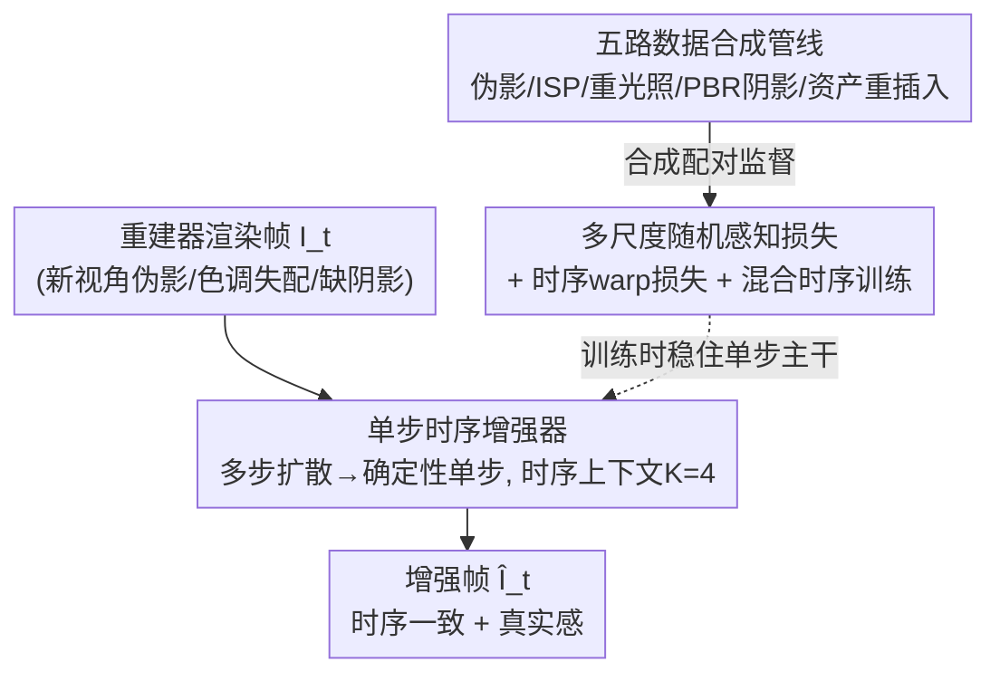

# DiffusionHarmonizer: Bridging Neural Reconstruction and Photorealistic Simulation with Online Diffusion Enhancer

**会议**: CVPR 2026  
**论文**: [CVF Open Access](https://openaccess.thecvf.com/content/CVPR2026/html/Zhang_DiffusionHarmonizer_Bridging_Neural_Reconstruction_and_Photorealistic_Simulation_with_Online_Diffusion_CVPR_2026_paper.html)  
**代码**: 未公开  
**领域**: 3D视觉 / 扩散模型 / 神经重建仿真  
**关键词**: 神经重建, 在线仿真, 单步扩散, 时序一致性, 阴影合成, 数据合成管线

## 一句话总结
把一个预训练的多步图像扩散模型改造成「单步、确定性、带时序条件」的增强器，配上一条专门合成「带伪影渲染↔真实照片」配对的五路数据管线，在线把 NeRF / 3DGS 重建出来的、满是伪影和光影失配的仿真帧，实时修成时序连贯、真实感高的画面——用户研究里 84.28% 的人更偏好它。

## 研究背景与动机
**领域现状**：自动驾驶 / 机器人的闭环仿真越来越依赖「神经重建」——用 NeRF、3D Gaussian Splatting 直接从真实传感器数据里恢复出可编辑的 3D 场景，把场景拆成静态背景 + 一批可移动的前景资产（车、人），就能自动、可扩展地生成各种驾驶场景。

**现有痛点**：这套流程有两个顽疾。一是**新视角伪影**——在远离训练轨迹的视角下，重建结果会出现模糊、空洞、鬼影、错误几何；移动前景资产时也一样。二是**插入物伪影**——把前景物体（合成资产或别处重建来的物体）插进场景时，常常出现色调不匹配、缺投影阴影、光照失配，合成图一眼假。

**核心矛盾**：想用生成模型当「渲染后增强器」来救场，但现成模型都不满足**在线仿真**的硬约束。视频扩散模型时序好但太慢、单张 H100 上跑不动在线（WAN V2V 一帧要 2827ms）；图像编辑模型快但逐帧独立、会闪烁，而且都不擅长建模投影阴影、还容易篡改本来重建得好的区域、破坏几何——这对要求物理可信的仿真是致命的。

**本文目标**：做一个在线、单 GPU 可跑的增强器，同时干三件事：①修新视角重建伪影；②协调前景/背景外观；③为插入物合成真实阴影；而且要**保住场景几何与结构不被乱改**，还要**时序连贯**。

**切入角度**：作者的关键观察是——预训练图像扩散模型里已经藏着强大的图像翻译先验，没必要重训；难点其实在两处：(1) 怎么把「多步去噪」的扩散模型压成「单步确定性」还不崩；(2) 上哪儿找「带伪影渲染↔干净真实图」的配对监督（现实世界根本没有这种成对数据）。

**核心 idea**：用「单步时序条件增强器 + 五路合成配对数据 + 针对单步训练的稳定化损失」三件套，把多步图像扩散一次性改造成实时仿真谐调器。

## 方法详解

### 整体框架
DiffusionHarmonizer 把谐调（harmonization）当成一个 image-to-image 翻译任务：给定时刻 $t$ 一帧带退化的渲染帧 $I_t$，输出一帧改进帧 $\hat{I}_t$，公式为 $\hat{I}_t = D_\phi\big(F_\theta\big(E_\eta(I_t)\big)\big)$，其中潜空间编码器 $E_\eta$ 和解码器 $D_\phi$ 用预训练扩散模型的、**冻结不动**，只微调扩散主干 $F_\theta$。

整体上它有两条线：**离线训练侧**靠一条「五路数据合成管线」凭空造出大量配对监督（带伪影/失配的输入 ↔ 真实干净目标），覆盖伪影、ISP 色差、光照、阴影、资产插入五类视觉因素；**在线推理侧**则是把多步扩散主干 $F_\theta$ 改造成单步确定性增强器，并喂入前 $K$ 帧已增强结果作时序上下文，逐帧流式输出。训练时用「多尺度随机感知损失 + 时序 warp 损失 + 混合时序训练」把单步模型稳住、并压住因「多步预训练 vs 单步推理」失配而冒出来的棋盘格伪影。

### 关键设计

**1. 单步时序条件增强器：把多步扩散压成确定性单步、还要不闪**

针对的痛点是「视频扩散慢、图像扩散闪」这对两难。标准扩散里主干 $F_\theta$ 是个在多个时间步、随机噪声潜变量上工作的去噪器，条件里编码了噪声水平/扩散时间。作者把它**重新用途化为确定性单步增强器**：直接把干净潜变量 $E_\eta(I_t)$ 喂进网络、**不注入任何噪声**，并把时间步和文本条件 token 在训练和推理时都固定成常量「null」。这样得到一个从输入潜变量到增强潜变量的稳定确定性映射，逐帧结构一致性更好，一次前向就出结果（212ms/帧，比图像编辑基线快 ≥1.8×、比视频编辑基线快 10×）。

为解决「单帧独立会闪」，再给主干加**时序条件**：设上下文长度 $K=4$，时刻 $t$ 把当前退化帧和最多前 $K$ 帧**已增强**结果一起编码 $Z_t = \big(E_\eta(I_t), E_\eta(\hat{I}_{t-1}), \dots, E_\eta(\hat{I}_{t-K})\big)$，喂进带「时序注意力与空间注意力交替」的主干（仿视频扩散结构）。开头几帧不足 $K$ 时只用已有帧。这让模型在有利时利用历史上下文、又保住逐帧结构、防止漂移。

**2. 多尺度随机感知损失：单步化的「解毒剂」，压住棋盘格伪影**

这是让单步方案能落地的关键。把一个多步预训练模型当单步用，会产生**噪声轨迹失配**（noise-trajectory mismatch）：原模型在完整扩散轨迹上训练，而微调时只在干净潜变量上跑一次；直接当确定性单步模型微调，常冒出棋盘格高频伪影。作者的解法是在**随机采样的不同尺寸方块 patch** 上算感知损失：随机采边长 $k \in [128, 512]$、随机位置的方块对 $\hat{P}^{(k)}_t$ 与 $P^{(k)}_{gt}$，定义

$$\mathcal{L}_{perc} = \mathbb{E}_k\Big[\sum_l \lambda_l \big\| \phi_l(\hat{P}^{(k)}_t) - \phi_l(P^{(k)}_{gt}) \big\|_2^2\Big]$$

其中 $\phi_l(\cdot)$ 是 VGG 第 $l$ 层特征、$\lambda_l$ 是逐层权重。随机多尺度 patch 会让 patch 边界相对网络感受野不断扰动，从而**放大高频不一致、抑制周期性混叠**，实验中显著压住了轨迹失配带来的棋盘格。消融里：去掉感知监督会过度平滑，用普通 LPIPS 又会产生高频伪影，只有这个多尺度版本两头都兼顾。

**3. 五路数据合成管线：凭空造出五类配对监督**

针对「现实世界没有带伪影渲染↔干净真实图的配对数据」这个根本缺口。管线由五条互补的流组成，每条专攻一个视觉因素：

- **新视角伪影修正**：沿用 DIFIX3D+ 的四种退化（稀疏重建、循环重建、交叉参照、刻意欠拟合）造出带模糊/空洞/鬼影/错误几何的帧，与其干净渲染配对，监督伪影修正。
- **ISP 修改**：模拟不同设备 ISP 导致的前景/背景色调失配——对原图 $I_{orig}$ 用重采样的 ISP 参数（色调映射、曝光、白平衡等）渲出 $I_{ISP}$，再用 SAM2 得到的前景掩码 $M$ 合成 $I_{mix} = M \odot I_{ISP} + (1-M) \odot I_{orig}$，以 $I_{mix}$ 为输入、$I_{orig}$ 为目标学前景/背景色调谐调。
- **重光照**：用重光照扩散模型只对前景物体在随机光照下重渲，故意造出局部光照与全局不一致的输入，监督模型消解光照不一致。
- **基于物理的阴影仿真（PBR Shadow）**：用物理渲染器在随机环境贴图/光源配置下渲合成场景，生成「有阴影/无阴影」配对，提供像素级的投影阴影监督。
- **资产重插入**：用 3DGUT 重建静态背景、抽出动态前景物体，再把前景**不带阴影**地插回背景，得到「逼真但缺阴影/未谐调」的合成图，与含正确阴影的原序列配对——比纯 PBR 数据更贴近真实统计、缩小域差。

这五路合在一起，凑齐了在有限真实监督下训练在线谐调器所需的互补信号。

**4. 时序 warp 损失 + 混合时序训练：把帧间连续性焊死、又不过度依赖邻帧**

光有时序条件还不够稳，作者再加一项基于光流的 warp 损失：用 RAFT 估相邻真值帧 $I^{gt}_{t-1}, I^{gt}_t$ 间的光流 $F_{t \to t-1}$，把 $t-1$ 的增强帧 warp 到 $t$，只在有效对应像素集合 $\Omega$ 上约束一致：

$$\mathcal{L}_{temp} = \frac{1}{|\Omega|}\sum_{x \in \Omega}\big\| \hat{I}_t(x) - \mathrm{Warp}(\hat{I}_{t-1}, F_{t\to t-1})(x) \big\|^2$$

这项之所以算得动，正是单步公式的红利——每帧只需一次前向就拿到 RGB 输出来监督，不必像多步扩散那样在整条去噪轨迹上回传、爆显存。总损失为 $\mathcal{L}_{total} = \lambda_{l2}\mathcal{L}_{l2} + \lambda_{perc}\mathcal{L}_{perc} + \lambda_{temp}\mathcal{L}_{temp}$，其中 $\mathcal{L}_{l2}$ 是逐像素损失，$\lambda_{temp}=1$（时序 batch）或 $0$（非时序 batch）。配套的**混合时序训练**应对数据里既有短视频又有单图（如单图重光照难造时序变体）：先在配对图像上预训练学好逐帧增强，再交替跑时序/非时序 batch，防止模型过度依赖邻帧、在时序条件弱/有噪/缺失时更鲁棒。

### 损失函数 / 训练策略
模型基于 Cosmos 0.6B 文生图扩散模型（主干 0.6B + VAE tokenizer 0.14B），训练时冻结 VAE、只微调扩散主干。先做 10k 次非时序预训练，再加 4k 次时序训练；分辨率 $1024 \times 576$、bf16 精度，$\lambda_{l2}=1$、$\lambda_{perc}=1$。

## 实验关键数据

### 主实验
在新轨迹仿真（域内，内部驾驶集 13 个 holdout 场景）和物体插入仿真（域外，公开 Waymo 68 场景）上，对比通用图像/视频编辑基线。感知质量（FID/FVD 越低越好）、结构保真（DINO-Struct 越高越好）、时序一致（VBench++ 越高越好）：

| 数据集 | 指标 | 本文 | 次优基线 | 说明 |
|--------|------|------|----------|------|
| 新轨迹（域内） | FID↓ | **120.23** | 134.98 (WAN V2V) | 感知最佳 |
| 新轨迹（域内） | DINO-Struct↑ | **0.9215** | 0.8289 (WAN V2V) | 结构保真大幅领先 |
| 物体插入（域外） | FID↓ | **101.27** | 104.42 (WAN V2V) | 域外仍最佳 |
| 物体插入（域外） | 时序一致↑ | 0.9670 | 0.9675 (WAN V2V) | 与视频扩散持平 |
| 推理速度 | ms/帧↓ | **212** | 398 (SDEdit) / 2827 (WAN V2V) | 比视频编辑快 10× |

在有真值标签的 holdout 集（重光照/PBR 阴影/ISP 修改）上，GT 相关指标全面碾压：

| Holdout 集 | 指标 | 本文 | 次优基线 |
|--------|------|------|----------|
| 重光照 | PSNR↑ | **23.93** | 15.35 (IP2P) |
| PBR 阴影 | PSNR↑ | **26.31** | 16.46 (IP2P) |
| ISP 修改 | PSNR↑ | **28.10** | 17.46 (SDEdit) |
| ISP 修改 | LPIPS↓ | **0.0020** | 0.0105 (IP2P) |

与专用视频谐调方法（VHTT、Ke et al.）在 ISP 子集对比，本文在 PSNR（28.58 vs 25.98/20.96）、FID（42.03 vs 61.51/46.23）等全面更优（但其单步速度 212ms 慢于这两个轻量基线的 10/63ms）。用户研究 45 名评估者：本文相对 SDEdit/IP2P/WAN V2V 的偏好率分别为 **84.28% / 90.10% / 90.11%**，VLM 评估也一致偏好本文。

### 消融实验
| 配置 | 关键指标 | 说明 |
|------|---------|------|
| Full Model（域内时序一致） | 0.9827 | 完整模型 |
| w/o 时序损失 $\mathcal{L}_{temp}$ | 0.9806 | 去掉 warp 损失，一致性下降 |
| w/o 时序模块 | 0.9714 | 去掉时序条件，掉得更多（域外 0.9670→0.9502） |
| w/o 感知损失 | — | 输出过度平滑 |
| 用普通 LPIPS 替多尺度 | — | 冒出高频/棋盘格伪影 |

数据源消融（域外 FID，Full=101.27）：去掉任一数据流都掉点，去掉**伪影修正**流掉得最多（FID 105.29、FVD 476.82），其次是 ISP 修改（104.63）、PBR 阴影（104.28），印证五路数据各有不可替代的贡献。

### 关键发现
- **时序模块比时序损失更关键**：去掉时序模块（0.9714）比去掉时序损失（0.9806）掉得明显更多，说明把历史帧编码进主干这个结构改动是时序一致的主力。
- **多尺度随机 patch 是单步化成败的关键**：普通 LPIPS 会留高频伪影、无感知监督会过平滑，只有随机多尺度 patch 同时压住棋盘格又保住细节。
- **五路数据缺一不可、伪影流最重要**：所有数据流去掉都掉点，伪影修正流的缺失代价最大——呼应了该方法定位「在线仿真谐调」而非单纯前景谐调（这正是它相对 VHTT/Ke et al. 的差异化价值）。

## 亮点与洞察
- **「单步化」反过来成了时序损失的红利**：把多步扩散压成单步本来是为了提速，但它顺带让 warp 时序损失变得可算（每帧一次前向即得 RGB，不必在多步轨迹上回传爆显存）——一个设计同时解决速度和监督两个问题，很巧。
- **冻结 VAE、null 化时间步/文本条件**：不重训、不引噪、把扩散的随机性彻底关掉，换来确定性映射和结构保真（DINO-Struct 0.92 远超基线），这套「把扩散当确定性翻译器」的改造很可复用。
- **数据合成是核心竞争力**：在「没有真实配对监督」的设定下，五路合成管线把 ISP 失配、光照、阴影、伪影、插入物分门别类各造一路监督，等于把一个难学的复合任务拆成五个可控的合成子任务——这个「按视觉因素拆数据流」的思路可迁移到任何缺配对数据的图像翻译任务。

## 局限与展望
- **作者承认**：纯 PBR 阴影数据与真实统计有域差，所以才补了「资产重插入」流来缩小 gap——说明合成数据的真实性仍是瓶颈。
- **速度并非全面领先**⚠️：相对视频扩散快 10×，但相对轻量谐调基线（Ke et al. 10ms、VHTT 63ms）其 212ms 反而更慢；「在线」是相对视频扩散而言，极端实时场景下单步扩散仍偏重。
- **评测以驾驶场景为主**：作者称方法 domain-agnostic，但定量实验几乎都在自动驾驶数据上，跨域（室内、机器人操作）的泛化只是声称、未充分验证。
- **依赖一串外部模型**：SAM2 掩码、重光照扩散模型、PBR 渲染器、3DGUT、RAFT 光流都是合成管线的前置组件，复现成本和误差累积都不低。

## 相关工作与启发
- **vs DIFIX3D+**：本文直接复用了它的四种退化造伪影数据，但 DIFIX3D+ 主要做「生成新视角再 lift 回 3D / 渲染时去伪影」，本文把单步增强器扩展到**在线、带时序、还管阴影/光照/插入物谐调**的更全面任务。
- **vs VHTT / Ke et al.（专用视频谐调）**：它们只调前景外观、不修重建伪影、也不合成物理阴影，因此不适用于神经仿真管线；本文一统三件事，且阴影合成是它们做不到的差异点。
- **vs Wan-Video V2V（视频扩散编辑）**：时序一致它强（0.9675），但慢 13×（2827ms）、且会幻觉出不一致内容、过度编辑本应不动的区域；本文以单步换来 10× 提速 + 更好的结构保真（DINO-Struct 0.91 vs 0.82）。

## 评分
- 新颖性: ⭐⭐⭐⭐ 「多步扩散→单步确定性时序增强器」+「按视觉因素拆五路合成数据」的组合切中在线仿真痛点，但单点技术多为已有组件的巧妙拼装。
- 实验充分度: ⭐⭐⭐⭐ 三类评测设定 + 多基线 + 用户研究/VLM 评估 + 数据流与时序双重消融，较扎实；跨域泛化和代码开源欠缺。
- 写作质量: ⭐⭐⭐⭐ 问题动机清晰、方法与数据管线讲得有条理，图表充分。
- 价值: ⭐⭐⭐⭐ 直击自动驾驶/机器人闭环仿真的真实感落地问题，单 GPU 在线可跑，工程价值高。

<!-- RELATED:START -->

## 相关论文

- [\[CVPR 2026\] Sparse-View Localization via Online Neural 3D Regression](sparse-view_localization_via_online_neural_3d_regression.md)
- [\[CVPR 2026\] FluidGaussian: Propagating Simulation-Based Uncertainty Toward Functionally-Intelligent 3D Reconstruction](fluidgaussian_propagating_simulation-based_uncertainty_toward_functionally-intel.md)
- [\[CVPR 2026\] Online3R: Online Learning for Consistent Sequential Reconstruction Based on Geometry Foundation Model](online3r_online_learning_for_consistent_sequential_reconstruction_based_on_geome.md)
- [\[CVPR 2026\] GenSplat: Bridging the Generalization Gap in 3DGS Language Comprehension](gensplat_bridging_the_generalization_gap_in_3dgs_language_comprehension.md)
- [\[CVPR 2026\] ReWeaver: Towards Simulation-Ready and Topology-Accurate Garment Reconstruction](reweaver_towards_simulation-ready_and_topology-accurate_garment_reconstruction.md)

<!-- RELATED:END -->
