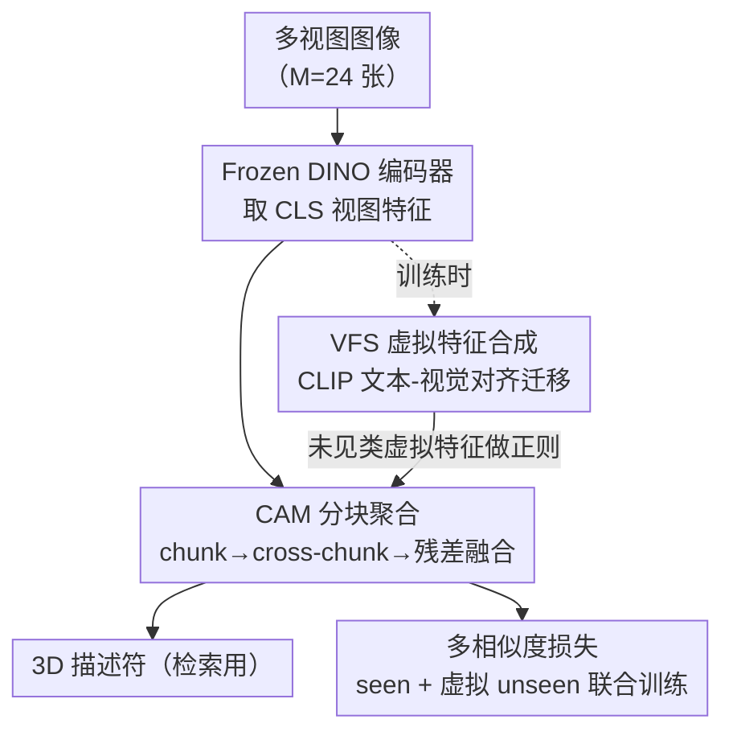

# DINO Eats CLIP: Adapting Beyond Knowns for Open-set 3D Object Retrieval

**会议**: CVPR 2026  
**arXiv**: [2604.19432](https://arxiv.org/abs/2604.19432)  
**代码**: 待确认  
**领域**: 3D视觉 / 多视图检索  
**关键词**: 开集 3D 物体检索, DINO 自监督, 多视图聚合, CLIP 语义迁移, 虚拟特征正则

## 一句话总结
把开集 3D 物体检索（open-set 3DOR）的视图编码器从 CLIP 换成自监督的 DINO，再用一个"分块聚合"的轻量 adapter（CAM）整合多视图局部关系、用 CLIP 文本-视觉对齐合成未见类虚拟特征（VFS）做正则，仅靠单模态视觉特征就在 4 个标准 benchmark 上全面超过依赖图文双模态的 CLIP 方法。

## 研究背景与动机
**领域现状**：3D 物体检索（3DOR）传统上是闭集设定——训练和测试共享同一标签空间。但真实场景要求模型对训练时没见过的类别也能给出可判别的表示，于是研究重心转向开集 3DOR：只用少量 seen 类别的 3D 物体训练，却要泛化到完全不重叠的 unseen 类别。主流做法是把多视图图像喂进视觉基础模型，最常见的是适配 CLIP 编码器来构建 view-based 3D 描述符。

**现有痛点**：CLIP 的全局图文对齐让它泛化能力强，但代价是**细粒度不足**——它学的是图像-文本的全局语义对齐，难以捕捉视图之间细微的结构差异（比如 OS-ESB-core 里的机械零件，靠的就是辨别高亏格结构的微小差异）。同时，已有 CLIP 方法（CLIP-AdaM、DAC）推理时还要依赖文本模态甚至 MLLM 生成的描述，既不够 scalable 也不够高效。另一条路 HGM2R 把点云/体素/视图多模态都堆进来，但需要一堆 modality-specific backbone，框架笨重。

**核心矛盾**：开集 3DOR 的根本困难是**数据稀缺导致的过拟合**——seen 类别只有寥寥几个，模型很容易过拟合到 seen 类的"平均视图模式"，对 unseen 类毫无判别力。而 CLIP 的细粒度短板恰好限制了视图特征的上限。

**本文目标**：(1) 找一个比 CLIP 更能捕捉局部细节的视图编码器；(2) 设计一个不会过拟合到 seen 类平均模式的多视图聚合方式；(3) 在没有任何 unseen 数据的情况下显式缓解对 known 类别的偏置。

**切入角度**：作者观察到自监督的 DINO 天生就能同时捕捉视图里的局部细节和全局结构，是比 CLIP 更鲁棒、更适合泛化的视图特征源。一个有意思的发现：**仅仅对 frozen DINO 的多视图特征做 mean-pooling，零样本就已经超过所有 CLIP 方法**（见 Table 1）。但直接 fine-tune 适配又会严重过拟合到 seen 类视图模式。

**核心 idea**：用 DINO 当主干"吃掉"CLIP 的视图编码角色（DINO Eats CLIP），但把 CLIP 留作连接 seen/unseen 语义的"桥"——用分块 adapter 防止池化过拟合，用 CLIP 图文对齐合成 unseen 虚拟特征做正则。

## 方法详解

### 整体框架
DEC 的输入是一个 3D 物体投影出的 $M$ 张多视图图像（实验里 $M=24$），输出是一个紧凑的 view-based 3D 描述符，用于检索。整条 pipeline 分两块：**主路**用 frozen DINO 提取每张视图的 `[CLS]` 全局特征，再经 CAM adapter 把这些视图特征分块聚合成一个 $d$ 维描述符；**正则旁路**（VFS，仅训练时启用）借 CLIP 的图文对齐空间，为 unseen 类别合成虚拟视觉特征，逼着 CAM 去区分这些虚拟的 unseen 类，从而不过拟合 seen 类。两路通过同一个端到端 metric learning 损失联合训练，推理时只跑主路、VFS 零额外开销。

### 关键设计

**1. DINO 替代 CLIP：用自监督编码器换掉图文对齐的视图主干**

痛点是 CLIP 的全局图文对齐牺牲了细粒度，限制了视图特征上限。作者直接换成 frozen DINO（实测 DINOv2/DINOv3 的 B/L 多个变体），取每张视图的 $d$ 维 `[CLS]` token 作为全局视图特征 $\mathbf{f}_m = \mathcal{F}_\text{frozen}(\mathbf{I}_m)$。理由有二：DINO 是自监督预训练、提供 category-agnostic 的鲁棒特征，同时编码全局与局部线索，这对泛化到新类至关重要；且预实验显示它的零样本 3DOR 表现就强于 CLIP。这个换法不是简单替换——它把"细粒度局部结构"这件 CLIP 做不好的事直接交给了更擅长的模型，是整个方法成立的地基。Table 1 里那个 mean-pooling DINO baseline 零样本碾压一切 CLIP 方法，就是这个判断的最直接证据

**2. CAM 分块聚合：用 divide-and-conquer 的局部聚合替代直接池化，防止过拟合视图平均模式**

直接对多视图特征做 mean-pooling 会丢掉视图间的局部关系，且 fine-tune 时容易过拟合到 seen 类的"显著视图"。CAM（Chunking and Adapting Module）把聚合拆成三步循序渐进。**第一步局部分块聚合**：把视图特征序列 $[\mathbf{f}_1,\dots,\mathbf{f}_M]$ 切成 $K$ 个不重叠的 chunk，每块 $k_w=\lceil M/K\rceil$ 个连续视图，用一个共享线性层（实现为 1D 卷积，kernel=stride=3 的 CBR 块 = Conv1D + BN + ReLU）并行聚合，得到 chunk 特征 $[\mathbf{g}_1,\dots,\mathbf{g}_K]=\mathtt{CBR}([\mathbf{f}_1,\dots,\mathbf{f}_M])$，捕捉 chunk 内的局部相关与组合模式。**第二步跨块整合**：对 chunk 特征做无参数的 1D pooling，捕捉更长程的视图依赖；堆叠多个 CBR + Pool 块逐步扩大感受野，最终收敛成一个紧凑的全局表示 $\mathbf{g}_\text{adpt}$。**第三步加权残差融合**：为保留预训练知识又吸收新适配的知识，$\mathbf{g}_\text{final}=\lambda\cdot\mathbf{f}_\text{gap}+(1-\lambda)\cdot\mathbf{g}_\text{adpt}$，其中 $\mathbf{f}_\text{gap}$ 是对原始 DINO 特征做 global average pooling 的结果，$\lambda$ 平衡"保留的预训练先验"与"CAM 学到的新知识"。这种由近及远的分块挖掘，比一步到位的全局池化更能产出可判别又泛化的描述符——消融里把三层 MLP adapter 换成 CAM，mAP 直接 +2.94%

**3. VFS 虚拟特征合成：借 CLIP 图文对齐，把未见类"凭空造"出来做正则**

即便有 CAM，没见过 unseen 数据仍会过拟合 known 类。直接合成 unseen 虚拟特征又卡在数据稀缺。作者的关键洞察是：CLIP 在 web 级图文对上对比训练，其**文本空间里类别间的语义关系，会等距地保留到视觉空间**（论文 Eq.7 给了点积层面的证明）。基于此，VFS 把"seen→unseen 的语义方向"从文本模态迁移到视觉模态来造虚拟特征。具体地：先用预定义词表（如 ImageNet 1k 类）滤掉与 seen 重叠的标签、子采样出 $E$ 个 unseen 概念 $\mathcal{Y}_\text{new}$；对每张视图用 CLIP 视觉编码器得 $\overline{\mathbf{f}}_m^i$，对每个类别用 CLIP 文本编码器把 prompt "a photo of $y$" 编成文本嵌入。然后在 CLIP 视觉空间里，把一个 seen 类特征沿"指向 unseen 类的语义方向"平移，再经轻量 MLP $\psi$ 投影到 DINO 空间：
$$\overline{\mathbf{v}}^u_m=\psi\big[\overline{\mathbf{f}}_m^i+\epsilon\cdot\mathtt{LN}(\overline{\mathbf{y}}^u-\overline{\mathbf{y}}^i)\big]$$
其中 $\overline{\mathbf{y}}^u-\overline{\mathbf{y}}^i$ 是指向 unseen 类的语义方向，$\epsilon$ 是可学习缩放权重。最后再做一次加权残差融合 $\mathbf{v}^u_m=\alpha\cdot\overline{\mathbf{v}}^u_m+\beta\cdot\mathbf{f}^i_m$ 稳定训练（$\alpha,\beta$ 可学习）。这些虚拟 unseen 特征作为正则项，逼 CAM 去区分不同 unseen 类，从而摆脱对 known 类模式的过度依赖。理论分析（Eq.8）还借 Lipschitz 性质证明合成特征被界定在 $\psi(\mathbb{E}[\overline{\mathbf{f}}_m|y^u])$ 附近、误差不超过 $L\cdot\sigma^2$。值得注意的是 VFS 只在训练用，推理零开销

### 损失函数 / 训练策略
训练用 multi-similarity loss [41]，把正样本拉近、负样本推远，让 seen 和合成的 unseen 类都形成紧凑且良好分离的簇。推理时直接用 CAM 输出当 3D 描述符做检索。实现细节：24 视图 / $256\times256$，CBR 块 kernel=3 stride=3、Pool1D kernel=3；VFS 用 CLIP ViT-B/16；SGD（momentum 0.9，weight decay $5\times10^{-4}$），adapter 学习率 $1\times10^{-3}$、VFS 初始 $1\times10^{-4}$；每个 mini-batch 8 样本来自 2 类（每类 4 实例），训练 70 epoch，第 20、40 epoch 学习率 ×0.1；unseen 词表用 ImageNet。全部实验单张 RTX 4090。

## 实验关键数据

### 主实验
在 4 个标准开集 3DOR benchmark（OS-ESB/NTU/MN40/ABO-core）上评测 mAP↑ / NDCG↑ / ANMRR↓。下表摘取 mAP（%），对比当前 SOTA 的 CLIP 方法 DAC，DEC 仅用单模态视觉特征（I.）即超过用图文双模态（I.,T.）的 DAC：

| 设定 | 方法（主干） | 模态 | OS-ESB | OS-NTU | OS-MN40 | OS-ABO |
|------|------|------|------|------|------|------|
| 零样本 | CLIP-AdaM (ViT-L/14) | I.,T. | 54.69 | 57.28 | 55.01 | 57.29 |
| 零样本 | **DEC baseline (DINOv3 ViT-L/16)** | I. | 61.44 | 66.34 | 68.18 | 67.02 |
| 开集 | DAC (CLIP ViT-B/32) | I.,T. | 58.70 | 59.21 | 62.40 | 66.10 |
| 开集 | **DEC (DINOv2 ViT-B/14)** | I. | 61.82 | 61.56 | 67.62 | 65.04 |
| 开集 | DAC (CLIP ViT-L/14) | I.,T. | 57.80 | 65.83 | 68.98 | 70.74 |
| 开集 | **DEC (DINOv3 ViT-L/16)** | I. | 62.75 | 67.75 | 72.15 | 70.96 |

DEC (DINOv2 ViT-B/14) 相比 DAC (CLIP ViT-B/32) 在 mAP 上 OS-ESB +3.12%、OS-NTU +2.35%、OS-MN40 +5.22%；换 DINOv3 ViT-L/16 后继续涨，OS-MN40 达 72.15%（DAC ViT-L/14 为 68.98%）。**最惊人的是零样本 baseline**：DINOv3 ViT-L/16 仅 mean-pooling 就在 OS-MN40 拿到 68.18% mAP，超过所有需要训练的开集方法。

### 消融实验
组件消融（OS-MN40-core，DINOv2 ViT-B/14，指标 mAP / NDCG / ANMRR）：

| 配置 | mAP↑ | NDCG↑ | ANMRR↓ | 说明 |
|------|------|------|------|------|
| MLP baseline（mean-pool + 三层 MLP） | 63.49 | 75.02 | 38.86 | 起点 |
| + CAM | 66.43 | 76.80 | 37.95 | mAP +2.94、NDCG +1.78、ANMRR -0.91 |
| + CAM + VFS（Full） | 67.62 | 77.67 | 34.95 | 再 +1.19 mAP、ANMRR 再降 3.00 |

其他关键消融：

| 分析 | 关键结果 | 结论 |
|------|---------|------|
| Adapter 对比 | CLIP-Adaptor 64.35 / CLIP-AdaM 64.46 / **CAM 66.43** mAP | CAM 的局部 chunk 聚合优于全局池化型 adapter |
| CBR chunk size | 1→63.62 / **3→67.62** / 5→64.91 / 7→65.72 mAP | chunk=3 感受野最合适，过大削弱局部判别 |
| 融合权重 $\lambda$ | $\lambda{=}0.4$ 时 mAP 峰值 | 适度融合最好，过大会过拟合适配空间、丢 DINO 几何先验 |
| VFS 概念数 $E$ 选择 | RANDOM $E$ 随 $E$ 增长在 40 饱和；TOP $E$ 小 $E$ 时更好但很快引入冗余 | 随机采样靠语义多样性当正则，泛化更稳 |

跨数据集（OS-MN40→OS-ABO）：DEC (ViT-L/16) mAP 69.12%、NDCG 60.44%，与用 MLLM 文本的 DAC (ViT-L/14) 69.86% 几乎持平，但 DEC 纯视觉。

### 关键发现
- **VFS 主要降的是 ANMRR**：从 37.95 一步降到 34.95（-3.00），说明合成 unseen 虚拟特征对"检索排序质量"的提升比对 mAP 更显著，正则确实在改善 unseen 类的判别边界。
- **chunk size 极敏感**：1（退化成逐视图）和 7（块太大）都明显掉点，sweet spot 在 3——印证 CAM 的价值在"恰到好处的局部感受野"。
- **随机采 unseen 概念比"选最相似的"更好**：TOP $E$ 看似语义更一致，但很快堆进冗余近义概念阻碍学习；随机采样的随机语义多样性反而是更好的正则。

## 亮点与洞察
- **"DINO 零样本就超 CLIP 训练版"是全文最 aha 的发现**：它说明开集 3DOR 长期被 CLIP 的图文对齐范式带偏了，真正缺的是细粒度局部特征而非更强的语义对齐——一个 mean-pooling 就掀了桌子。
- **CLIP 不当编码器、改当"语义桥"是巧妙的角色重定位**：别人把 CLIP 当主干，本文只取它"文本语义关系等距映射到视觉空间"这一条性质来造虚拟样本，避开了 CLIP 细粒度差的短板、只吃它泛化好的长处，"DINO Eats CLIP"名副其实。
- **VFS 的"沿语义方向平移 + 投影"造数据范式可迁移**：任何缺 unseen/OOD 数据又有图文对齐模型可用的任务（开集识别、零样本检索），都能借这套"文本差分→视觉差分→目标空间投影"凭空合成正则样本，且推理零开销。
- **CAM 用 1D 卷积实现分块**：把"分块聚合"等价成 kernel=stride=$k_w$ 的 Conv1D，工程上极简、几乎无额外参数，却比专门设计的 CLIP adapter 更强。

## 局限与展望
- **依赖外部词表质量**：VFS 的 unseen 概念来自 ImageNet 1k，若目标域类别与该词表语义覆盖差距大，迁移的语义方向可能失真；论文未讨论换词表的鲁棒性。
- **理论假设较强**：Eq.7/8 的等距保持、Lipschitz 映射存在性都是理想化假设，CLIP 视觉-文本对齐在长尾/细粒度概念上的实际偏差未被量化。
- **跨数据集仍略逊带 MLLM 的 DAC**：OS-MN40→OS-ABO 上 mAP 69.12 vs 69.86，说明纯视觉在极端域偏移时还差一口气，引入轻量语义引导或许能补。
- **仅在多视图渲染设定下验证**：24 视图、固定投影方案，对真实点云/部分视图缺失等更脏的输入是否成立未知。

## 相关工作与启发
- **vs HGM2R [9]**：HGM2R 堆点云/体素/视图多模态 + modality-specific backbone 来缓解数据稀缺，框架重、难扩展；DEC 只用单模态多视图 + frozen DINO，更轻更快，且 mAP 全面超过它。
- **vs CLIP-AdaM [17] / DAC [44]**：二者都以 CLIP 为编码主干、推理依赖文本（DAC 还要 MLLM 生成描述）；DEC 把主干换成 DINO、CLIP 退居训练期的语义桥，推理纯视觉单模态，scalable 且更准。
- **vs OOD 虚拟特征合成（VOS 类 [6]）**：传统 OOD 把所有 unseen 混成一个"unknown"，无法满足开集 3DOR 需要 sample↔语义类别显式关联的需求；DEC 借 CLIP 文本关系为**每个具体 unseen 类**合成可区分的虚拟特征。
- **vs APLGOS [52] / SHIP [43]**：它们用 CLIP 文本编码器训生成模型（如 VAE）合成虚拟 prompt，3D 域因数据稀缺难训；DEC 不训生成器，直接用图文对齐做语义方向平移，绕开了数据稀缺。

## 评分
- 新颖性: ⭐⭐⭐⭐⭐ "DINO 换 CLIP + CLIP 当语义桥造虚拟特征"是对开集 3DOR 主流范式的有力反转，VFS 的语义迁移合成有理论支撑。
- 实验充分度: ⭐⭐⭐⭐ 4 个 benchmark × 4 个 DINO 变体 + 组件/adapter/chunk/λ/E/跨数据集多维消融，扎实；但只在单一渲染设定、未测真实脏输入。
- 写作质量: ⭐⭐⭐⭐ 动机递进清晰、理论分析到位；个别公式排版与笔误（如 Figure 编号）略影响阅读。
- 价值: ⭐⭐⭐⭐⭐ 用更简单的单模态方案刷新 SOTA，"虚拟特征语义迁移"范式对一切缺 unseen 数据的开集任务都有借鉴价值。

<!-- RELATED:START -->

## 相关论文

- [\[ICCV 2025\] Describe, Adapt and Combine: Empowering CLIP Encoders for Open-set 3D Object Retrieval](../../ICCV2025/3d_vision/describe_adapt_and_combine_empowering_clip_encoders_for_open-set_3d_object_retri.md)
- [\[CVPR 2026\] SceneMaker: Open-set 3D Scene Generation with Decoupled De-occlusion and Pose Estimation Model](scenemaker_open-set_3d_scene_generation_with_decoupled_de-occlusion_and_pose_est.md)
- [\[CVPR 2026\] BEA-GS: BEyond RAdiance Supervision in 3DGS for Precise Object Extraction](bea-gs_beyond_radiance_supervision_in_3dgs_for_precise_object_extraction.md)
- [\[AAAI 2026\] CLIPPan: Adapting CLIP as A Supervisor for Unsupervised Pansharpening](../../AAAI2026/3d_vision/clippan_adapting_clip_as_a_supervisor_for_unsupervised_pansharpening.md)
- [\[CVPR 2026\] Beyond Geometry: Artistic Disparity Synthesis for Immersive 2D-to-3D](beyond_geometry_artistic_disparity_synthesis_for_immersive_2d-to-3d.md)

<!-- RELATED:END -->
