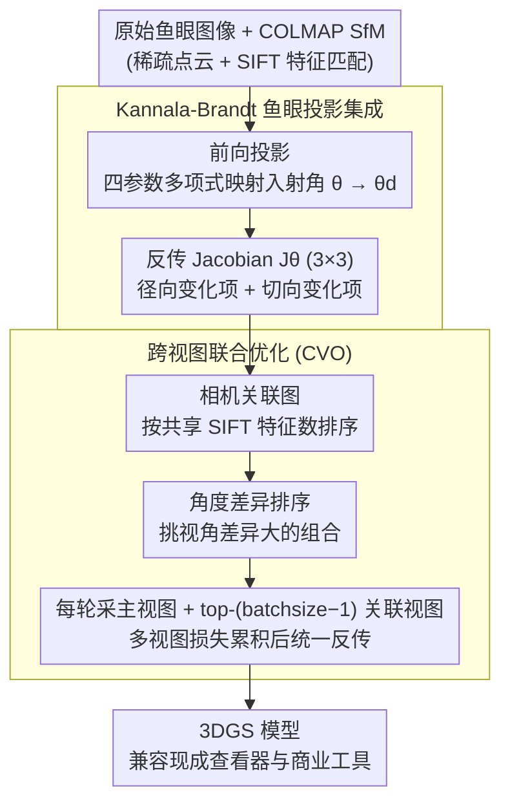

# DirectFisheye-GS: Enabling Native Fisheye Input in Gaussian Splatting with Cross-View Joint Optimization

**会议**: CVPR 2026  
**arXiv**: [2604.00648](https://arxiv.org/abs/2604.00648)  
**代码**: 无  
**领域**: 3D Vision / Novel View Synthesis  
**关键词**: 3D高斯溅射, 鱼眼相机, 跨视图联合优化, 新视图合成, Kannala-Brandt模型

## 一句话总结

将 Kannala-Brandt 鱼眼投影模型原生集成到 3DGS 流程中，并提出基于特征重叠的跨视图联合优化策略，避免了预去畸变带来的信息损失，在多个公开数据集上达到或超越 SOTA。

## 研究背景与动机

3D 高斯溅射（3DGS）在新视图合成领域取得了突破性进展，但其核心依赖针孔相机模型的光栅化渲染，无法直接处理鱼眼相机的非线性畸变图像。鱼眼相机因其超广视角（>90°，常见 120°-180°）在自动驾驶、机器人、VR/AR 等场景中广泛使用。

现有方案的两大痛点：

**预去畸变的信息损失**：将鱼眼图像转为针孔图像时，边缘区域被裁剪或拉伸插值，导致高频细节被稀释。3DGS 容易过拟合这些低频区域，产生模糊和浮动伪影

**单视图优化的几何不一致**：即使正确建模了鱼眼投影，3DGS 原始的单视图随机采样优化策略忽略了不同视图间同一高斯的相关性。边缘畸变最严重的区域尤其容易出现过大/过长的高斯体，导致重建质量下降

现有鱼眼3DGS方法的局限：
- **Fisheye-GS**：仍需预处理为等距投影，无法直接使用原始鱼眼图像
- **3DGUT**：使用 Unscented Transform 近似投影，仅用7个sigma点，强畸变区域精度不足；且破坏了 3DGS 的全显式架构
- **Self-Cali-GS**：通过神经网络学习形变场，收敛慢且损失高频细节

## 方法详解

### 整体框架

DirectFisheye-GS 要解决的是「3DGS 天生只认针孔相机、碰到鱼眼图就抓瞎」这件事。它的做法分两步：先把鱼眼镜头的真实投影规律写进 3DGS 的前向渲染和反向梯度里，让每个高斯都按鱼眼的方式被投到像素上；再在训练时换掉原始 3DGS「一次只看一张图」的随机采样，改成一次看一组相关视图，强迫同一个高斯在多张图里保持一致。前者保证「投得对」，后者保证「优化得稳」，两者缺一边缘区域就会崩。

### 关键设计

**1. Kannala-Brandt 鱼眼投影集成：把镜头畸变直接写进渲染，而不是先把图掰直**

常规做法是先把鱼眼图去畸变成针孔图再喂给 3DGS，但去畸变会裁掉或拉伸边缘像素，高频细节被稀释，3DGS 反而去过拟合那些被抹平的低频区域，留下模糊和浮动伪影。这篇论文索性不去畸变，把鱼眼真正的投影曲线建进渲染里。具体地，给定相机坐标系下的 3D 点 $\mu_{cam} = (x_c, y_c, z_c)^T$，先算它相对光轴的入射角 $\theta$，再用四参数多项式把入射角映射到实际成像角：$\theta_d = \theta + k_1\theta^3 + k_2\theta^5 + k_3\theta^7 + k_4\theta^9$——这就是 Kannala-Brandt 模型，多项式阶数足够高，能贴合 120°-180° 强广角下的非线性畸变，而不像等距投影那样在边缘失真。光有前向投影还不够，3DGS 要靠反传梯度更新高斯，所以论文还把这条投影链路的 Jacobian $\mathbf{J}_\theta \in \mathbb{R}^{3\times3}$ 完整推了出来，它由径向变化项（与 $\theta_d'$ 相关）和切向变化项（与 $\theta_d/d$ 相关）两部分组成。这样做的好处是整条管线仍是纯解析、纯光栅化的，没有引入神经网络或采样近似，训练出来的高斯还能直接被现成的 3DGS 查看器和商业工具打开。

**2. 跨视图联合优化（CVO）：让同一个高斯被多张相关视图一起约束，而不是各看各的**

即使投影建对了，3DGS 原始的「每轮随机抽一张图、只用这张图的损失更新」策略仍有隐患：它默认各视图相互独立，忽略了同一个高斯其实出现在多张图里。在畸变最重的图像边缘，缺乏交叉约束的高斯会被拉成又大又长的形状，重建质量塌方。CVO 的思路是给每次迭代凑一组「看到同一片区域、但视角又不太一样」的视图。它复用 COLMAP 跑 SfM 时已经算好的特征匹配，先按相邻相机共享的 SIFT 特征点数量排序，建出一张相机关联图（特征重叠多 = 大概率看着同一批高斯）；再对关联图里每对相机算姿态角度差并按降序排，挑出视角差异大的组合。训练时每轮采一个主视图，加上 top-(batchsize-1) 个关联相机，把这一组的损失累积起来再统一反传。特征重叠保证这些视图确实在约束同一批高斯，角度差异保证约束来自不同方向，两者一夹，边缘高斯的形状和颜色就被钉成跨视图一致。这套策略不挑相机模型，针孔管线也能用，而且因为关联信息全来自 SfM 既有结果，几乎没有额外开销。

### 损失函数 / 训练策略

- 损失函数沿用 3DGS 标准设置：$L_k = L_1(I_k, \hat{I}_k) + \text{SSIM}(I_k, \hat{I}_k)$
- 多视图损失累积：$L_{total} = \sum_{k} L_k$，然后统一反向传播更新高斯参数
- Batchsize 默认设为 2（主视图 + 1个关联视图）
- 所有实验在单张 NVIDIA A100 80GB 上完成

## 实验关键数据

### 主实验

**FisheyeNeRF 数据集**（6个物体级小场景，训练视图）：

| 方法 | SSIM ↑ | PSNR ↑ | LPIPS ↓ |
|------|--------|--------|---------|
| 3DGS (直接鱼眼输入) | 0.6124 | 18.85 | 0.5228 |
| 3DGS* (去畸变) | 0.8240 | 25.54 | 0.2431 |
| Fisheye-GS | 0.8183 | 25.18 | 0.2658 |
| 3DGUT | 0.8020 | 25.28 | 0.3290 |
| Self-Cali-GS | 0.7460 | 24.01 | 0.4507 |
| **Ours** | **0.8284** | **26.25** | **0.2295** |

**Scannet++ 数据集**（6个中等规模室内场景，测试视图）——方法在所有基线中该数据集也是最优或次优。

**Den-SOFT 数据集**（大规模户外场景）——在Ruziniu等户外场景上显著优于其他方法，因为户外光照变化大、细节丰富。

### 消融实验

| 配置 | 说明 |
|------|------|
| 原始3DGS + 鱼眼 | 完全失败，SSIM仅0.61 |
| 3DGS + 去畸变 | 可接受但丢失边缘信息 |
| 鱼眼投影模型 alone | 有效但边缘仍有浮动伪影 |
| 鱼眼投影 + CVO | 边缘伪影显著减少，全局光照一致性提升 |

### 关键发现

- 即使正确建模了鱼眼相机，单视图优化仍会在图像边缘产生浮动高斯——**跨视图约束是必要的**
- CVO策略不仅适用于鱼眼相机，同样可以改善传统针孔相机管道的重建质量
- 3DGUT 在室内场景与本文性能接近，但在户外无界场景中差距明显——其光照建模过强导致不连续伪影
- Fisheye-GS 在图像边缘质量急剧下降，因为其等距投影模型过于简化
- 去畸变后再训练的方案虽然可行，但本文方法在所有指标上均优于或持平，证明了直接输入的优势

## 亮点与洞察

1. **工程完整性极高**：不仅推导了鱼眼投影的 Jacobian（Eq.7 完整 3×3 矩阵），还保持了与原始 3DGS 查看器的完全兼容，这在实际部署中价值巨大
2. **CVO 的通用性**：跨视图联合优化策略基于 SfM 已有的特征匹配信息，无额外计算成本，且对任何相机模型通用
3. **问题定位精准**：清晰指出"即使相机模型正确，优化不充分也会导致极端高斯形状"，并从几何+光度一致性两个层面来解决
4. **高效实用**：batchsize=2 即可生效，训练成本增加极小

## 局限与展望

1. CVO 中 batchsize 固定为 2，更大的 batch 是否能进一步提升尚未充分探索
2. 依赖 COLMAP 提供特征匹配作为关联图的基础——如果 SfM 质量差，CVO 的效果可能受限
3. 仅在 Kannala-Brandt 模型上验证，对其他非线性相机模型（如全景相机）的扩展性有待验证
4. 论文未讨论训练时间与原始 3DGS 的对比（虽然提到 batchsize=2 增加了渲染量）

## 相关工作与启发

- **MVGS**：最早探索多视图训练的工作，但随机采样视图子集，缺乏几何关联性
- **3DGUT**：通过 Unscented Transform 处理非线性投影，代表了另一种思路（采样近似 vs 解析推导）
- **Scaffold-GS / Compact3DGS**：优化 3DGS 数据结构和内存的工作，与本文方法正交
- 启示：3DGS 的单视图优化范式本身就有缺陷，跨视图一致性约束应成为标配

## 评分

- 新颖性: ⭐⭐⭐⭐ — 鱼眼投影集成是工程创新，CVO策略有方法贡献
- 实验充分度: ⭐⭐⭐⭐⭐ — 三个数据集、全面对比、训练/测试视图分析
- 写作质量: ⭐⭐⭐⭐ — 结构清晰，问题定义精准
- 价值: ⭐⭐⭐⭐ — 对VR/AR和自动驾驶场景的直接适用性高

<!-- RELATED:START -->

## 相关论文

- [\[CVPR 2026\] DropAnSH-GS: Dropping Anchor and Spherical Harmonics for Sparse-view Gaussian Splatting](dropping_anchor_and_spherical_harmonics_for_sparse-view_gaussian_splatting.md)
- [\[CVPR 2026\] PixARMesh: Autoregressive Mesh-Native Single-View Scene Reconstruction](pixarmesh_autoregressive_mesh-native_single-view_scene_reconstruction.md)
- [\[CVPR 2026\] Learning Multi-View Spatial Reasoning from Cross-View Relations](learning_multi-view_spatial_reasoning_from_cross-view_relations.md)
- [\[CVPR 2026\] NG-GS: NeRF-Guided 3D Gaussian Splatting Segmentation](ng_gs_nerf_guided_3d_gaussian_splatting_segmentation.md)
- [\[CVPR 2026\] Cross-Instance Gaussian Splatting Registration via Geometry-Aware Feature-Guided Alignment](cross-instance_gaussian_splatting_registration_via_geometry-aware_feature-guided.md)

<!-- RELATED:END -->
