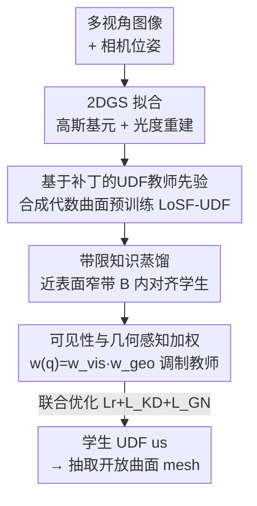

# Distilling Unsigned Distance Function for Surface Reconstruction from 3D Gaussian Splatting

**会议**: CVPR 2026  
**论文**: [CVF Open Access](https://openaccess.thecvf.com/content/CVPR2026/html/Li_Distilling_Unsigned_Distance_Function_for_Surface_Reconstruction_from_3D_Gaussian_CVPR_2026_paper.html)  
**代码**: 无  
**领域**: 3D视觉  
**关键词**: 无符号距离场, 3D高斯泼溅, 知识蒸馏, 开放曲面重建, 表面先验  

## 一句话总结
把一个在合成代数曲面上预训练好的"局部补丁 UDF 教师"蒸馏进 3DGS 优化里的轻量学生 UDF，通过近表面带限蒸馏 + 可见性/几何置信加权，从多视角图像中稳定重建出带边界、薄结构的开放曲面，在 DF3D / DTU 上把 Chamfer Distance 刷到 SOTA。

## 研究背景与动机

**领域现状**：从多视角图像重建表面，主流是学一个隐式距离场再抽 mesh。带符号距离场（SDF）配合可微体渲染（NeuS、Neuralangelo）已经能把闭合水密曲面重建得很精细；近年又把 3D 高斯泼溅（3DGS）这种显式、可实时光栅化的表示拿来和隐式表面建模结合，效率大幅提升。

**现有痛点**：SDF 靠"内/外"符号划分来编码，天生假设曲面封闭水密，对带边界、孔洞、薄片、残缺扫描的形状（比如衣服的吊带、开口）束手无策。无符号距离场（UDF）丢掉全局符号、直接表示到曲面的无符号距离，能天然表达开放几何，但从多视角图像学 UDF 比学 SDF 难得多：① 没有真值曲面可监督，只能靠间接、对遮挡/光照敏感的多视角光度一致性；② UDF 的梯度**恰好在曲面上无定义**，使得 eikonal、法向对齐这类依赖"近表面梯度光滑"的正则项失效。

**核心矛盾**：现有 UDF 方法（NeRF 系慢、3DGS 系如 GaussianUDF）大多在缺真值的情况下用**梯度先验**来约束 UDF，可真值曲面上的梯度本就 ill-defined——这种错配会产生有噪声、有偏的梯度，导致训练不稳、过度平滑、丢失高频细节。GaussianUDF 还缺少显式的局部几何推理、依赖全局优化、收敛慢。

**本文目标**：在 3DGS 框架内学一个准确、几何一致的开放曲面 UDF，既要稳定训练，又要保住高频细节。

**切入角度**：与其在没有真值时硬用不可靠的梯度先验，不如换一个**有真值**的监督源——合成代数曲面有闭式距离表达式，能提供精确的 UDF 真值；在它上面预训练一个局部补丁 UDF 预测器，它是 scene-agnostic、与具体物体无关的，可以当作可靠"教师"。

**核心 idea**：把这个在合成代数曲面上训好的补丁式 UDF 教师**蒸馏**进一个随 3DGS 一起优化的轻量学生 UDF，用"真几何监督"代替"不可靠梯度先验"，并在近表面窄带内做带限蒸馏、配可见性/几何置信加权来过滤教师里不靠谱的监督。

## 方法详解

### 整体框架

给定一组带相机位姿的 RGB 图像，方法同时优化一组高斯基元 $\{g_i\}_{i=1}^{I}$ 和一个学生 UDF $u_s$。整体是"先把场景几何/外观用 2DGS 拟合好，再在高斯表示上蒸馏 UDF"的流程：一个**冻结的局部形状教师** $u_t$（LoSF-UDF，预训练于合成代数曲面）在近表面窄带内给出可靠的 UDF 监督；学生 $u_s$ 在这个带内被蒸馏对齐；一个置信权重 $w(q)$ 把教师变成"软先验"，在渲染证据或局部几何不可靠处自动衰减教师影响；最后用联合损失把光度重建、UDF 蒸馏、几何法向正则一起优化。注意教师需要"查询点 + 局部补丁"才能预测，而蒸馏后的学生只需单个查询 $u_s(q)=f_s(q)$ 就能推断 UDF，因此能无缝兼容标准 3DGS 管线。

### 关键设计

**1. 基于补丁的 UDF 教师先验：用有闭式真值的合成曲面换掉不可靠的梯度监督**

痛点直接来自"没有真值曲面 + 曲面上梯度无定义"。作者的做法是绕开"在场景里硬学梯度先验"，转而在**合成代数曲面**上预训练一个补丁式 UDF 教师 $f_t$（采用 LoSF-UDF，因其抗噪、擅长局部特征表示）。UDF 本身定义为 $f(q)=\inf_{p\in M}\lVert p-q\rVert$，即查询点 $q$ 到曲面 $M$ 最近点的无符号距离。教师 $f_t(q\mid P)$ 接收查询点 $q=(x,y,z)$ 并以其 $K$ 近邻点云构成的局部补丁 $P$ 为条件，预测无符号距离。这些合成曲面带尖锐特征，由

$$z = 1 - h\cdot g(x,y)$$

生成（$h$ 控制 patch 锐度），其中 $g(x,y)$ 对褶皱（crease）取 $\frac{\lvert ax-y\rvert}{\sqrt{1+a^2}}$、对尖点（cusp）取 $\sqrt{x^2+y^2}$、对角点（corner）取 $\max(\lvert x\rvert,\lvert y\rvert)$、对 v-saddle 取 $(\lvert x\rvert+\lvert y\rvert)\cdot(\frac{\lvert x\rvert}{x}\cdot\frac{\lvert y\rvert}{y})$（$a$ 控制褶皱方向，⚠️ 公式以原文为准）。把这套先验注入 3DGS 时，对高斯中心 $\{c_i\}$ 周围采样的查询 $q$，用当前高斯的 $K$ 近邻构补丁 $P_i$、查教师得先验值 $u_t(q)=f_t(q\mid P)$ 来正则学生。关键收益是：教师被**真几何真值**而非纯光度线索监督，targets 更准、泛化更好；局部补丁条件能保住全局监督会抹平的高频细节。

**2. 带限知识蒸馏：只在近表面窄带里对齐，并消掉教师的全局尺度漂移**

针对"梯度先验在曲面上不稳"，作者不在全空间蒸馏，而是利用"3D 高斯中心都近似落在曲面上"这一简化假设，沿高斯法向 $n_i$ 定义近表面窄带 $B=\bigcup_i\{c_i+t\,n_i\mid t\in[-\tau,\tau]\}$，让训练样本落在高斯中心两侧。蒸馏损失为

$$L_{KD}=\mathbb{E}_{q\in B}\big[\,w(q)\,\ell\big(u_s(q),\,a\,u_t(q)+b\big)\big]$$

其中 $\ell$ 是带小 hinge 容差的 SmoothL1，$w(q)\in[0,1]$ 是置信度。一个关键点是 $u_t'(q)=a\,u_t(q)+b$ 这个**逐场景仿射校准**：教师的绝对尺度/偏移会跨场景漂移，作者通过

$$(a,b)=\arg\min_{a>0,b}\sum_{q\in B}w(q)\big(u_s(q)-a\,u_t(q)-b\big)^2$$

求出 $(a,b)$（对梯度视作常数），在保持距离序关系的同时去掉场景级 scale/offset 失配，几乎不引入偏置。实践上先把 2DGS 拟好场景，再在带内优化学生。"带限 + 仿射校准"正是它比直接全局蒸馏稳、且能恢复高频的原因：把几何复杂度限制在每个 patch 内，先验也能在相似结构间复用。

**3. 可见性与几何感知加权：让 render-aware 证据来决定教师该不该信**

点训练出来的教师有强局部形状线索，但缺乏渲染感知——在 3DGS 里轮廓、深度、光度残差才主导监督，二者在遮挡或弱约束区可能冲突。作者用一个置信权重 $w(q)=\mathrm{clip}\big(w_{vis}(q)\,w_{geo}(q),\,\varepsilon,1\big)$ 来调制教师（$\varepsilon\in[10^{-3},10^{-2}]$ 防零权重）。**可见性因子** $w_{vis}$ 压制跨视图遮挡/不一致的像素：把 3D 点 $q$ 用源视图深度 $z_s$ 重投影回参考视图得 $p_r'=\pi(q,z_s)$、测重投影误差 $\phi(p_r)=\lVert p_r-p_r'\rVert_2$，再令 $w_{vis}(q)=\mathbb{1}[\lVert p_r-p_r'\rVert_2<1]\exp(-\lVert p_r-p_r'\rVert_2)$，即误差小给高权、遮挡/错位则强烈降权或丢弃（实践对随机 $N{=}3$ 个源视图取均值）。**几何因子** $w_{geo}$ 只在教师与学生的局部微分几何一致时才放行：对归一化梯度 $\hat g_t,\hat g_s$ 用 sign-invariant 余弦

$$w_{geo}(q)=\exp\Big(-\tfrac{1-\lvert\hat g_t(q)\cdot\hat g_s(q)\rvert}{\tau_{grad}}\Big)$$

（$\tau_{grad}$ 取 0.5 左右）——梯度方向吻合则 $w_{geo}\approx1$，分歧则衰减到 0，相当于一种 importance-weighted 蒸馏，把教师不靠谱的点自动调小。

**4. 联合优化：把光度、蒸馏、法向正则一起 ramp-up**

完整目标为

$$L=(1-\lambda_1)L_r+\lambda_1 L_{ssim}+\lambda_2 L_{Far}+\lambda_3 L_{KD}+\lambda_4 L_{GN}$$

其中 $L_r$ 是 2DGS 的重建损失、$L_{ssim}$ 是 SSIM 项、$L_{Far}$ 沿用 GaussianUDF。额外的几何法向项 $L_{GN}=\sum_k w_k(1-\lvert\hat g_s(k)\cdot n_k\rvert)$ 惩罚"对某像素贡献大、但法向与该像素法向不一致"的高斯（$w_k$ 是高斯在该像素的贡献权重，$n_k$ 是深度图算出的像素法向）。训练上先单独训 2DGS $T_{warm}$（约 9000）次迭代，再逐步 ramp up $\lambda_2,\lambda_3,\lambda_4$，避免早期过度正则——这步顺序很关键，先有靠谱的高斯几何，蒸馏与法向约束才有意义。

## 实验关键数据

### 主实验

DF3D（DeepFashion3D，12 件服装、每件 72 视角、含薄吊带/开口/大平面）上的 Chamfer Distance（CD，×10⁻³，越低越好）与耗时对比（节选关键基线）：

| 方法 | 类型 | DF3D Mean CD↓ | 耗时 |
|------|------|---------------|------|
| 2DGS | SDF/高斯 | 3.81 | 6min |
| GOF | SDF/高斯 | 2.49 | 47min |
| NeuralUDF | UDF/NeRF | 2.15 | 8.6h |
| VRPrior | UDF | 1.71 | 9.2h |
| GaussianUDF | UDF/高斯 | 1.60 | 1.6h |
| **本文** | UDF/高斯 | **1.49** | 1.8h |

DTU（15 个标准多视角场景、带真值几何）上的 Mean CD（×10⁻³）：

| 方法 | 类型 | DTU Mean CD↓ |
|------|------|--------------|
| NeuS | SDF/NeRF | 0.84 |
| 2DGS | SDF/高斯 | 0.83 |
| G2SDF | SDF/高斯 | 0.64 |
| GaussianUDF | UDF/高斯 | 0.68 |
| VRPrior | UDF | 0.91 |
| **本文** | UDF/高斯 | **0.60** |

本文在两个数据集上都拿到最低平均 CD。值得注意的是 UDF 学习本就比 SDF 难（符号歧义、开放边界处梯度不稳），但本文的 UDF 框架反而**匹配甚至超过了专为水密几何设计的 SDF 方法**（如 G2SDF 0.64、NeuS 0.84），且耗时（1.8h）远低于 NeRF 系 UDF（8–9h），仅略高于 GaussianUDF。

### 消融实验

DTU 上从 2DGS（带 $L_{Far}$）baseline 逐步叠加组件（CD↓）：

| 配置 | CD↓ | 说明 |
|------|-----|------|
| Baseline | 0.99 | 2DGS + $L_{Far}$ |
| + UDF 蒸馏 | 0.83 | 加带限蒸馏（教师近表面监督） |
| + 加权 | 0.71 | 再加可见性/几何置信加权 |
| Full Model | 0.60 | 再加几何法向正则 $L_{GN}$ |

### 关键发现
- **带限蒸馏是第一推动力**：从 0.99→0.83，仅靠冻结 LoSF-UDF 教师在近表面提供稳定的局部距离 target，就已显著提升——印证"真几何监督优于不可靠梯度先验"。
- **置信加权与法向正则各自再贡献一截**：0.83→0.71→0.60，加权让表面更干净、floater 更少，$L_{GN}$ 让 mesh 在细节区更平滑锐利，三个组件可叠加、无明显冲突。
- **场景适配性**：定性上本文在 DF3D 薄结构/弱纹理区比 2DGS（缺面、碎片）、GOF（薄结构周围重影）、GaussianUDF（过平滑丢细节）都更完整、拓扑更忠实、高频细节更锐。

## 亮点与洞察
- **"换监督源"而非"修正则"**：UDF 难学的根因是曲面上梯度无定义，作者没在梯度正则上继续打补丁，而是从合成代数曲面（有闭式距离真值）预训一个 scene-agnostic 教师来提供可信 target——这是把问题从"无监督硬学"转成"有监督蒸馏"的关键转身。
- **逐场景仿射校准很巧**：教师跨场景有 scale/offset 漂移，用闭式最小二乘解 $(a,b)$、且对梯度视作常数，既消全局漂移又保距离序关系，几乎零偏置，是一个低成本但关键的工程细节。
- **render-aware 与 point-based 的对齐**：用重投影误差（可见性）+ sign-invariant 梯度余弦（几何）做置信门控，本质是让"点训练的教师"只在"渲染证据支持"的地方说话，这种"两套证据相互裁决"的思路可迁移到任何"预训练先验 + 场景内优化"的蒸馏框架。
- **教师重、学生轻的解耦**：教师要补丁才能预测，蒸馏后学生单查询即可，既保住先验质量又兼容标准 3DGS 单点查询管线。

## 局限与展望
- 作者承认：方法假设**合理的多视角覆盖 + 准确相机标定**，在极稀疏视角或强位姿误差下性能会退化。
- 自己的观察：核心假设"所有高斯中心都落在/极近曲面"是把蒸馏限制在窄带的前提，对噪声大、高斯漂浮严重的场景，窄带 $B$ 的定义可能不准；$\tau$ 还需按数据集手调（DF3D 0.01 / DTU 0.02）。
- 教师在合成代数曲面（crease/cusp/corner/v-saddle 四类局部基元）上训练，对训练分布外的复杂局部几何，先验质量与泛化是潜在风险。
- 展望：作者计划扩展到稀疏视角、动态场景，并引入语义先验增强结构一致性与重建完整度。

## 相关工作与启发
- **vs GaussianUDF**：同样在 3DGS 上学 UDF，但 GaussianUDF 用全局 UDF + 梯度先验、缺局部几何推理、收敛慢、易过平滑；本文用局部补丁教师的带限蒸馏替代梯度先验，DF3D 1.60→1.49、DTU 0.68→0.60，且保住高频细节。
- **vs SDF-based 高斯方法（GOF / G2SDF / 2DGS）**：它们偏向水密曲面、对开放边界/薄结构有结构性偏差；本文用 UDF 直接表达开放几何，在 DTU 上仍超过这些 SDF 方法，说明 render-aware 的 UDF 先验已能弥补"无符号更难学"的劣势。
- **vs NeRF 系 UDF（NeuralUDF / 2S-UDF / VRPrior）**：精度相近或更优，但 NeRF 系需密集采样/体积分、耗时 8–9h；本文借显式高斯 + 轻量学生 UDF，1.8h 即可，效率显著占优。

## 评分
- 新颖性: ⭐⭐⭐⭐ 把"合成代数曲面预训练教师 + 带限蒸馏 + render-aware 加权"组合进 3DGS UDF 学习，思路清晰且切中 UDF 无真值/梯度无定义的痛点。
- 实验充分度: ⭐⭐⭐⭐ DF3D + DTU 双数据集、SDF/UDF 多基线、逐组件消融齐全；但缺稀疏视角等鲁棒性定量分析与超参敏感性。
- 写作质量: ⭐⭐⭐⭐ 动机—方法—实验逻辑顺畅，公式给得清楚；个别合成曲面公式表述略需对照原文。
- 价值: ⭐⭐⭐⭐ 开放曲面重建（服装、薄壳、残缺扫描）实用价值高，蒸馏 + 置信门控的范式可迁移。

<!-- RELATED:START -->

## 相关论文

- [\[CVPR 2026\] Hermite Radial Basis Function for Surface Reconstruction via Differentiable Rendering](hermite_radial_basis_function_for_surface_reconstruction_via_differentiable_rend.md)
- [\[CVPR 2025\] GaussianUDF: Inferring Unsigned Distance Functions through 3D Gaussian Splatting](../../CVPR2025/3d_vision/gaussianudf_inferring_unsigned_distance_functions_through_3d_gaussian_splatting.md)
- [\[CVPR 2026\] 3D Gaussian Splatting with Self-Constrained Priors for High Fidelity Surface Reconstruction](3d_gaussian_splatting_with_self-constrained_priors_for_high_fidelity_surface_rec.md)
- [\[CVPR 2026\] Neural Gabor Splatting: Enhanced Gaussian Splatting with Neural Gabor for High-frequency Surface Reconstruction](neural_gabor_splatting.md)
- [\[CVPR 2026\] Uni3R: Unified 3D Reconstruction and Semantic Understanding via Generalizable Gaussian Splatting from Unposed Multi-View Images](uni3r_unified_3d_reconstruction_and_semantic_understanding_via_generalizable_gau.md)

<!-- RELATED:END -->
