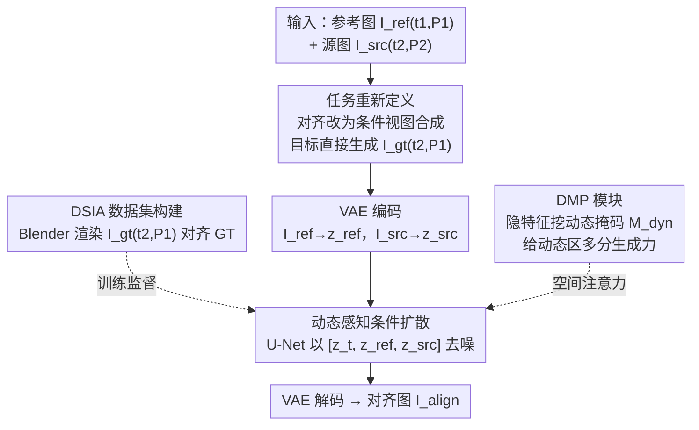

# DMAligner: Enhancing Image Alignment via Diffusion Model Based View Synthesis

**会议**: CVPR2026  
**arXiv**: [2602.23022](https://arxiv.org/abs/2602.23022)  
**代码**: [boomluo02/DMAligner](https://github.com/boomluo02/DMAligner)  
**领域**: 3D视觉  
**关键词**: image alignment, diffusion model, view synthesis, dynamic scenes, occlusion handling

## 一句话总结

提出 DMAligner，将图像对齐问题从传统的光流 warp 范式转化为"对齐导向的视图合成"任务，利用条件扩散模型直接生成对齐后的完整图像，配合专门构建的 DSIA 合成数据集和动态感知掩码模块（DMP），有效避免了 warp 方法固有的 ghosting 和遮挡伪影，在多个基准上全面超越现有方法。

## 背景与动机

图像对齐（Image Alignment）是计算机视觉中的基础任务，目标是将不同视角或不同时刻拍摄的两幅图像对齐到统一的坐标系中。它在视频稳定、全景拼接、超分辨率、多帧去噪等应用中至关重要。

传统图像对齐方法的流程通常包括：

1. **光流估计**：计算像素级的运动场（optical flow），如 RAFT、FlowFormer 等
2. **图像 warp**：利用估计的光流对源图像进行反向变换，生成对齐结果
3. **后处理**：融合或修补 warp 后的伪影

这一范式存在两个根本性问题：

- **遮挡区域无法处理**：当目标视角中的某些区域在源图像中被遮挡时，光流无法提供有效的对应关系，warp 后产生空洞或 ghosting 伪影
- **动态物体干扰**：场景中运动物体改变了几何关系，导致光流估计不准确，warp 结果在动态区域出现严重的重影

核心动机：**能否绕过"估计光流→warp"的间接范式，直接生成对齐后的完整图像？** 受扩散模型在图像生成方面的强大能力启发，作者提出将对齐问题重新定义为条件图像生成问题。

## 核心问题

- 传统 warp-based 对齐方法在遮挡和动态区域不可避免地产生 ghosting 伪影
- 生成式方法需要大量高质量训练数据——现有数据集缺少面向对齐任务的配对标注（时间 t2 + 相机位姿 P1 的 ground truth 图像）
- 扩散模型需要学会区分动态前景与静态背景，以正确处理场景中的运动物体

## 方法详解

### 整体框架

DMAligner 要解决的是传统"光流估计→warp"对齐范式在遮挡和动态区域必然产生空洞与 ghosting 的痼疾。它的总思路是彻底换范式：不再去 warp，而是把对齐重新定义成一个条件视图合成任务，用扩散模型直接生成对齐后的完整图像。围绕这一范式，论文有四个相互衔接的贡献：重定义任务、用 Blender 造出真实世界拍不到的对齐 GT 数据集 DSIA、训练一个以双图为条件的扩散模型来生成对齐结果，并在其中嵌入 DMP 掩码模块专门处理动态区域。整条生成链路（编码 → 条件去噪 → 解码）端到端，没有任何光流估计。

### 关键设计

**1. 任务重新定义：把对齐从 warp 改成条件视图合成**

warp 范式的死穴在于遇到源图里被遮挡的区域就没有对应关系可用。DMAligner 换了个提法：传统做法是把源图 $I_{src}$（时间 $t_2$、相机 $P_2$）warp 到参考图 $I_{ref}$（时间 $t_1$、相机 $P_1$）的坐标系；DMAligner 则直接生成目标图像 $I_{gt}$（时间 $t_2$、相机 $P_1$）——保留 $t_2$ 时刻的场景内容，但从 $P_1$ 视角观察。这本质上是一个条件视图合成问题，遮挡区域由生成模型天然补全，从根上绕开了 warp 的空洞。

**2. DSIA 数据集构建：用渲染引擎造出真实拍不到的对齐 GT**

生成式方法要训练，但 $I_{gt}$（$t_2$ 时刻却从 $P_1$ 视角）这种配对在真实世界根本无法采集。作者用 Blender 构建 DSIA（Dynamic Scene Image Alignment）合成数据集来解这个死结：25 种人物角色 + 100+ 种物体模型 + 多种相机运动轨迹，角色行走、跑步、挥手，物体平移、旋转；对每个场景分别渲染 $I_{ref}(t_1, P_1)$、$I_{src}(t_2, P_2)$ 和 $I_{gt}(t_2, P_1)$，相机运动覆盖前移、后移、左移、右移、旋转等类型，共 1033 个场景、30K+ 高质量图像对。消融显示去掉 DSIA 预训练 PSNR 会从 27.43 跌到 24.87，可见这套数据对学到对齐先验至关重要。

**3. 动态感知条件扩散训练：以双图为条件直接生成对齐图**

在 Latent Diffusion Model 框架上做条件生成。编码阶段把参考图 $I_{ref}$ 和源图 $I_{src}$ 分别经 VAE 编码到潜空间得 $z_{ref}$、$z_{src}$；前向扩散对 GT 潜表示 $z_{gt}$ 逐步加噪：

$$z_t = \sqrt{\bar{\alpha}_t} z_{gt} + \sqrt{1 - \bar{\alpha}_t} \epsilon, \quad \epsilon \sim \mathcal{N}(0, I)$$

条件去噪阶段，U-Net 以拼接的 $[z_t, z_{ref}, z_{src}]$ 为输入预测噪声：

$$\mathcal{L} = \mathbb{E}_{z_{gt}, \epsilon, t} \left[ \| \epsilon - \epsilon_\theta(z_t, t, z_{ref}, z_{src}) \|_2^2 \right]$$

两幅条件图一个给几何参考、一个给 $t_2$ 时刻的内容，让网络学会"换视角但保内容"。

**4. DMP 模块：从隐特征里挖动态掩码，给动态区多分生成力**

动态物体改变了几何，需要让模型显式区分动态前景和静态背景、对两者区别对待。DMP（Dynamics-aware Mask Producing）从 U-Net decoder 的多尺度中间特征 $F_{mid}$ 出发，用轻量卷积头预测二值掩码 $M_{dyn}$，再用它对去噪过程施加空间注意力——动态区域分配更多生成能力，静态区域主要靠几何变换；掩码的监督用光流不一致性作为伪标签：

$$\mathcal{L}_{mask} = \text{BCE}(M_{dyn}, M_{pseudo})$$

这样无需额外的动态检测模块就即插即用地增强了对动态场景的处理，消融显示去掉 DMP 后 PSNR 从 27.43 降到 26.15。

### 一个完整示例

给定一对输入——参考图 $I_{ref}$ 和源图 $I_{src}$：两图先经 VAE 编码进潜空间得 $z_{ref}$、$z_{src}$；从纯高斯噪声出发，以这两者为条件执行 DDIM 多步去噪，过程中 DMP 模块持续提供动态感知引导，让运动物体所在区域获得更强的生成；去噪收敛后再经 VAE 解码，得到最终对齐图像 $I_{align}$。整条链路端到端，没有任何光流估计，也就没有光流误差的级联传播。

## 实验关键数据

### DSIA 测试集

| 方法 | PSNR↑ | SSIM↑ | LPIPS↓ |
|------|-------|-------|--------|
| RAFT + Warp | 22.31 | 0.782 | 0.189 |
| FlowFormer + Warp | 23.15 | 0.801 | 0.172 |
| LoFTR + Warp | 21.87 | 0.764 | 0.203 |
| **DMAligner** | **27.43** | **0.893** | **0.078** |

在合成数据集上 PSNR 提升 4+ dB，LPIPS 降低约 50%。

### MPI Sintel 评估

| 方法 | 遮挡区域 PSNR↑ | 动态区域 PSNR↑ |
|------|---------------|---------------|
| RAFT + Warp | 18.7 | 17.2 |
| **DMAligner** | **23.1** | **22.6** |

在遮挡和动态区域的优势尤为显著，验证了生成式方法在这些困难区域的本质优势。

### DAVIS 视频序列

在真实动态视频上的定性评估表明：DMAligner 生成的对齐结果没有 ghosting 伪影，即使在大运动和严重遮挡的情况下也能产生视觉上自然的结果。

### 消融实验

- **去掉 DMP 模块**：PSNR 从 27.43 降至 26.15（-1.28），证明动态感知引导的有效性
- **去掉 DSIA 数据预训练**：PSNR 降至 24.87，说明合成数据对学习对齐先验至关重要
- **仅用静态场景训练**：动态区域 PSNR 大幅下降 3.2 dB，验证动态场景数据的必要性

## 亮点

- **范式转换**：从"光流估计→warp"的间接范式转向"条件生成"的直接范式，从根本上避免了遮挡和 ghosting 问题
- **DSIA 数据集设计精巧**：利用 Blender 渲染 $I_{gt}(t_2, P_1)$ 这种真实世界无法采集的 GT，巧妙解决了训练数据问题
- **DMP 模块轻量有效**：从隐特征中提取动态掩码，无需额外的动态检测模块，即插即用地增强扩散模型对动态场景的处理能力
- **无需光流估计**：端到端地完成图像对齐，避免了光流估计误差的级联传播

## 局限与展望

- 基于扩散模型的生成方式推理速度较慢，DDIM 采样仍需多步迭代，实时性不足
- DSIA 合成数据集的域差距（domain gap）可能限制真实场景的泛化能力
- 30K+ 的训练数据规模相对有限，场景多样性（25 角色 + 100 物体）可进一步扩展
- 未探索在大分辨率（如 4K）图像上的对齐效果和效率
- 与 NeRF/3DGS 等神经场景表示结合的可能性未被探索

## 与相关工作的对比

| 维度 | 传统 warp 方法 | 深度 homography | DMAligner |
|------|--------------|----------------|-----------|
| 核心操作 | 光流估计→像素 warp | 学习全局变换矩阵 | 条件扩散生成 |
| 遮挡处理 | 无法处理，产生空洞 | 依赖 inpainting 后处理 | 生成式天然填充 |
| 动态物体 | ghosting 严重 | 假设静态场景 | DMP 显式建模 |
| 训练数据 | 无需训练 / 光流 GT | 图像对 + 变换矩阵 | DSIA 合成数据 |
| 推理速度 | 快（单次前向） | 快（单次前向） | 较慢（多步去噪） |

核心差异在于 DMAligner 将对齐重新定义为生成问题，用扩散模型的生成能力弥补了 warp 方法在遮挡/动态区域的固有缺陷。

## 启发与关联

- "将 X 问题转化为条件生成问题"的思路具有通用性，可推广到其他存在遮挡困难的视觉任务（如立体匹配中的遮挡区域、视频修复等）
- DSIA 数据集的构建思路——用渲染引擎生成真实世界无法采集的 GT——可借鉴到其他需要特殊标注的任务
- DMP 模块的"从隐特征中挖掘辅助信息"的设计思路，类似于 DiffRefiner 中的 FGSIM，均在生成过程融入语义理解
- 后续可探索蒸馏或 consistency model 加速推理，使生成式对齐方法达到实时性

## 评分

- 新颖性: 8/10 — 将对齐问题重新建模为视图合成，范式转换清晰且合理
- 实验充分度: 7/10 — 合成和真实数据均有评估，但缺少与更多最新生成式方法的对比
- 写作质量: 8/10 — 问题定义清晰，方法阐述流畅，DSIA 数据集构建描述详尽
- 价值: 7/10 — 提供了对齐问题的新思路，但推理效率限制了即时应用前景

<!-- RELATED:START -->

## 相关论文

- [\[CVPR 2026\] PR-IQA: Partial-Reference Image Quality Assessment for Diffusion-Based Novel View Synthesis](pr-iqa_partial-reference_image_quality_assessment_for_diffusion-based_novel_view.md)
- [\[CVPR 2026\] Landscape-Awareness for Geometric View Diffusion Model](landscape-awareness_for_geometric_view_diffusion_model.md)
- [\[CVPR 2026\] SmokeSVD: Smoke Reconstruction from A Single View via Progressive Novel View Synthesis and Refinement with Diffusion Models](smokesvd_smoke_reconstruction_from_a_single_view_via_progressive_novel_view_synt.md)
- [\[CVPR 2026\] Splatent: Splatting Diffusion Latents for Novel View Synthesis](splatent_splatting_diffusion_latents_for_novel_view_synthesis.md)
- [\[AAAI 2026\] 3D-Free Meets 3D Priors: Novel View Synthesis from a Single Image with Pretrained Diffusion Guidance](../../AAAI2026/3d_vision/3d-free_meets_3d_priors_novel_view_synthesis_from_a_single_image_with_pretrained.md)

<!-- RELATED:END -->
