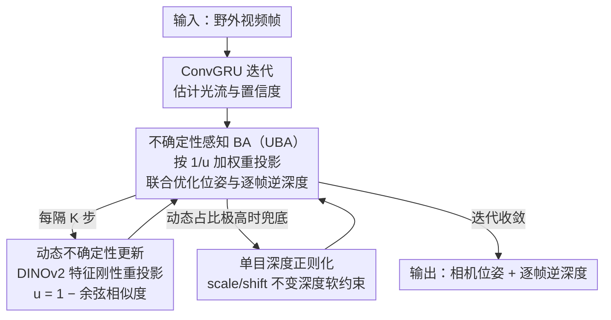

# DROID-W: DROID-SLAM in the Wild

**会议**: CVPR2026  
**arXiv**: [2603.19076](https://arxiv.org/abs/2603.19076)  
**代码**: [MoyangLi00/DROID-W](https://github.com/MoyangLi00/DROID-W.git)  
**领域**: 3D视觉  
**关键词**: SLAM, dynamic scenes, uncertainty estimation, bundle adjustment, DINOv2

## 一句话总结

提出 DROID-W，通过将不确定性估计引入可微分 Bundle Adjustment（Uncertainty-aware BA），结合 DINOv2 特征驱动的动态不确定性更新机制和单目深度正则化，使 DROID-SLAM 在高度动态的野外（in-the-wild）场景中实现鲁棒的相机位姿估计和场景重建，约 10 FPS 实时运行。

## 背景与动机

视觉 SLAM（Simultaneous Localization and Mapping）是机器人、AR/VR 和自动驾驶的核心技术，目标是从连续视频帧中同时估计相机位姿和构建场景三维结构。

DROID-SLAM 作为当前最优的深度学习 SLAM 系统之一，其核心优势在于可微分的 Dense Bundle Adjustment (DBA) 层，通过端到端训练实现了出色的精度。然而，DROID-SLAM 和几乎所有经典 SLAM 方法都建立在一个关键假设之上：

**静态世界假设**：场景中所有可观测点在不同时间帧之间是静态的，其三维位置不随时间变化。

这一假设在真实的"野外"（in-the-wild）场景中严重不成立：

1. **行人和车辆**：城市场景中大量运动物体破坏几何一致性
2. **风吹树叶、流水**：自然环境中的非刚性运动无处不在
3. **YouTube 视频**：互联网视频充满各种动态元素，传统 SLAM 无法处理

现有应对动态场景的方法主要分为两类：

- **基于语义分割的方法**：预先检测和屏蔽"可能运动"的物体类别（如行人、车辆），但依赖预定义的动态类别先验，无法处理意外运动的物体
- **基于 neural implicit map 的方法**（如 RoDynRF、DynaMoN）：用 NeRF 联合建模静态和动态区域，精度高但计算代价极大，无法实时运行

核心动机：**能否在不依赖预定义动态先验的情况下，让 BA 自适应地降低动态区域的影响？** 作者观察到，如果能为每个像素分配一个不确定性权重——动态区域高不确定性、静态区域低不确定性——那么 BA 的优化过程自然会"忽略"动态像素的贡献。

## 核心问题

- 动态物体违反静态世界假设，导致 BA 的重投影残差在动态区域产生大量 outlier，严重干扰位姿估计
- 预定义语义先验无法覆盖所有动态类别，且"可能运动的类别"并不总是在运动
- Neural implicit 方法虽能处理动态场景，但计算成本过高，无法实时部署

## 方法详解

### 整体框架

DROID-W 要解决的核心问题是：DROID-SLAM 的可微分稠密 Bundle Adjustment（BA）建立在静态世界假设上，野外视频里的行人、车辆、晃动的树叶会在重投影残差里制造大量 outlier，把位姿估计带偏。它的思路不是去"检测并屏蔽"动态物体，而是给每个像素一个不确定性权重，让 BA 在优化时自动"看轻"那些不可信的像素。

整条流水线沿用 DROID-SLAM 的骨架：ConvGRU 迭代估计光流与置信度，DBA 层联合优化相机位姿和逐帧逆深度。DROID-W 在此之上插入三件事——把逐像素不确定性写进 BA 的加权项（UBA），用 DINOv2 语义特征每隔若干步重新估计这个不确定性（动态不确定性更新），再用单目深度先验在极端动态场景里兜底。三者在 BA 迭代中交替进行直到收敛，约 10 FPS 实时运行。

### 关键设计

**1. 不确定性感知的 Bundle Adjustment（UBA）：让动态像素在优化里自动降权**

标准 DBA 通过最小化加权重投影误差联合优化相机位姿 $\{G_i\}$ 和逆深度 $\{d_i\}$：$E = \sum_{(i,j)} \| p_{ij}^* - \Pi_c(G_{ij} \cdot \Pi_c^{-1}(p_i, d_i)) \|_{\Sigma_{ij}}^2$，其中 $p_{ij}^*$ 是相关性查找得到的对应点，$\Sigma_{ij}$ 是预测置信度。痛点在于动态像素的残差很大，会污染整个最小二乘解。

UBA 的做法是给每个像素再乘一个可优化的不确定性 $u_{ij}$，目标变成

$$E_{UBA} = \sum_{(i,j) \in \mathcal{E}} \frac{1}{u_{ij}} \| p_{ij}^* - \Pi_c(G_{ij} \cdot \Pi_c^{-1}(p_i, d_i)) \|_{\Sigma_{ij}}^2 + \log u_{ij}$$

$u_{ij}$ 越大，该像素对误差的贡献越小，等于自动降权；而 $\log u_{ij}$ 正则项防止不确定性膨胀到无穷这一平凡解。$u_{ij}$ 和位姿、深度一起参与 BA 迭代联合更新，因此"哪些像素该被忽略"是优化出来的，而非预先指定的。

**2. 基于 DINOv2 的动态不确定性更新：不靠语义类别先验也能找出动态区域**

UBA 里的 $u_{ij}$ 从哪来？传统做法是预定义"行人/车辆"等可能运动的类别并屏蔽，但训练时没见过的动态物体就漏了。DROID-W 改用一个几何一致性检验：对每帧用预训练 DINOv2 提取稠密特征图 $F_i \in \mathbb{R}^{H \times W \times C}$，再借当前 BA 的位姿和深度做刚性重投影，把帧 $i$ 的像素 $p$ 投到帧 $j$ 的位置 $p_{ij}$，比较两处特征的余弦相似度 $s_{ij}(p) = \frac{F_i(p) \cdot F_j(p_{ij})}{\|F_i(p)\| \cdot \|F_j(p_{ij})\|}$，并令 $u_{ij}(p) = 1 - s_{ij}(p)$。

直觉很干净：静态区域刚性重投影后特征高度一致，$s_{ij}\to 1$、$u_{ij}\to 0$；动态区域因为物体已经动了，刚性重投影指向了错误位置，特征对不上，$s_{ij}$ 低、$u_{ij}$ 高。用 DINOv2 而非原始像素的好处是语义特征对光照和轻微视角变化鲁棒——静态区域的相似度不会被光照打散，动态区域的几何不一致反而被放大。消融里 DINOv2 > DINO > CLIP > ResNet50，印证了这一点。

**3. 单目深度正则化：极端动态场景下给 BA 兜底**

当场景 80%+ 区域都在动时，大量像素被标成高不确定性，BA 可用的约束骤减、优化容易发散。DROID-W 加入单目深度先验作为软约束 $E_{depth} = \lambda \sum_i \| d_i - d_i^{mono} \|^2$，其中 $d_i^{mono}$ 由预训练单目深度模型（如 DPT/ZoeDepth）给出；因为单目深度没有绝对尺度，这里用的是 scale- 和 shift-invariant 形式。它不参与动态判断，只在静态约束不够时提供额外的几何锚点，消融显示去掉它会让极高动态占比场景偶尔发散。

### 一个完整示例

以一段街景视频为例：ConvGRU 先按 DROID-SLAM 流程初始化光流和置信度，BA 给出一组初始位姿和逐帧逆深度。每隔 $K$ 步，动态不确定性更新用当前位姿做刚性重投影——背景建筑的 DINOv2 特征对得很准，$u\approx 0$；而画面里走动的行人重投影到了错误位置，特征余弦相似度低，$u$ 被推高。下一轮 UBA 优化时，行人像素的权重 $1/u$ 几乎被压没，位姿主要由静态建筑约束；若这一帧恰好动态占比极高，单目深度正则化补上额外约束防止发散。如此交替直到收敛，最终在高动态 TUM 序列上 ATE 从 DROID-SLAM 的 28.3cm 降到 2.1cm。

## 实验关键数据

### TUM RGB-D Dynamic 序列

| 方法 | ATE RMSE (cm)↓ | 动态占比 |
|------|----------------|---------|
| ORB-SLAM3 | 36.5 | 高 |
| DROID-SLAM | 28.3 | 高 |
| DynaSLAM | 3.8 | 高 |
| **DROID-W** | **2.1** | **高** |

在高动态 TUM 序列（如 walking 系列）中 ATE 降低到 2.1cm，相比原始 DROID-SLAM 提升 13× 以上。

### DROID-W Dataset（野外数据）

作者构建了专门的评估数据集，包含多样户外动态场景（街道行人、骑行者、跑步者等）以及 YouTube 视频片段。定性评估显示：

- DROID-SLAM 在动态场景中轨迹严重漂移
- DROID-W 保持稳定的轨迹估计，相机路径与真值高度吻合

### KITTI Dynamic 场景

| 方法 | 翻译误差↓ | 旋转误差↓ |
|------|----------|----------|
| DROID-SLAM | 失败/漂移 | 失败/漂移 |
| **DROID-W** | **显著改善** | **显著改善** |

在 KITTI 中车辆密集的序列上，DROID-SLAM 频繁失败，DROID-W 持续稳定跟踪。

### 消融实验

- **去掉 UBA（仅保留标准 BA）**：ATE 大幅上升，退化为 DROID-SLAM 的表现
- **去掉 DINOv2 特征（用原始像素相似度）**：不确定性估计不够鲁棒，ATE 上升约 40%
- **去掉 Monocular Depth Regularization**：在极高动态占比场景中 BA 偶尔发散
- **不同基础模型**：DINOv2 > DINO > CLIP > ResNet50 特征，验证 DINOv2 的语义鲁棒性

### 运行效率

- 约 10 FPS 实时运行
- 相比 neural implicit 方法（如 RoDynRF 约 0.1 FPS），速度快 100×
- DINOv2 特征提取可通过缓存和降采样优化，额外开销约 15%

## 亮点

- **优雅的不确定性建模**：将动态检测问题转化为不确定性权重，无缝融入已有 BA 框架，无需修改底层优化器架构
- **不依赖预定义动态先验**：通过特征相似度自适应检测动态区域，可处理任何类型的运动物体（包括训练时未见过的类别）
- **利用视觉基础模型**：DINOv2 的强语义特征使动态检测在光照变化、纹理不足等困难条件下仍然鲁棒
- **实时性保持**：~10 FPS 的运行速度使其具备实际部署价值，远超 neural implicit 方案
- **最小化修改**：在 DROID-SLAM 基础上仅增加了不确定性模块，改动量小、通用性强

## 局限与展望

- DINOv2 模型本身的计算开销不可忽略，在嵌入式设备上部署有挑战
- 对于静态背景几乎完全被遮挡的极端场景（如车内拍摄且窗外全是运动物体），单目深度正则化的约束力有限
- 未与最新的 3D Gaussian Splatting 动态场景方法（如 DynGaussian）进行对比
- 不确定性更新频率（每 $K$ 步）是超参数，不同场景的最优值可能不同
- 仅在单目场景验证，未探索双目或 RGB-D 输入的扩展

## 与相关工作的对比

| 维度 | DROID-SLAM | DynaSLAM | RoDynRF | DROID-W |
|------|-----------|----------|---------|---------|
| 动态处理 | 无 | 语义分割屏蔽 | Neural implicit | 不确定性加权 |
| 动态先验 | 无 | 需要（预定义类别） | 无 | 无 |
| 实时性 | ~15 FPS | ~5 FPS | ~0.1 FPS | ~10 FPS |
| 场景重建 | 稀疏/半稠密 | 稀疏 | 稠密 | 稀疏/半稠密 |
| 鲁棒性 | 动态失败 | 已知类别 OK | 通用 | 通用 |

DROID-W 在"通用动态鲁棒性"和"实时性"之间取得了最好的平衡，是工程实用性与学术新颖性兼具的方案。

## 启发与关联

- 不确定性加权的思路是通用的"鲁棒估计"技巧，可迁移到光流估计、立体匹配、SfM 等所有基于 BA/最小二乘的视觉几何任务
- DINOv2 特征作为"万能语义描述子"的使用方式令人印象深刻，后续可探索将其用于 loop closure detection、place recognition 等 SLAM 子模块
- 与 DMAligner 形成有趣对比：两者都面对"动态场景"挑战，但 DMAligner 用生成式方法"绕过"问题，DROID-W 用不确定性加权"容忍"问题——思路完全不同但各有优势
- 后续可探索将不确定性估计与 3DGS 动态重建结合，实现动态场景的实时高质量重建

## 评分

- 新颖性: 7/10 — 不确定性加权 BA 本身不新，但与 DINOv2 特征的结合以及在 DROID-SLAM 上的无缝集成是实用的创新
- 实验充分度: 8/10 — 多数据集评估 + 详细消融 + 自建野外数据集，但缺少与部分最新方法的定量对比
- 写作质量: 8/10 — 问题动机清晰，方法描述简洁，实验组织合理
- 价值: 8/10 — 直接提升经典 SLAM 系统的动态鲁棒性，工程部署价值高，10 FPS 实时性是一大卖点

<!-- RELATED:START -->

## 相关论文

- [\[CVPR 2026\] ODGS-SLAM: Omnidirectional Gaussian Splatting SLAM](odgs-slam_omnidirectional_gaussian_splatting_slam.md)
- [\[CVPR 2026\] AERGS-SLAM: Auto-Exposure-Robust Stereo 3D Gaussian Splatting SLAM](aergs-slam_auto-exposure-robust_stereo_3d_gaussian_splatting_slam.md)
- [\[CVPR 2026\] Unblur-SLAM: Dense Neural SLAM for Blurry Inputs](unblur-slam_dense_neural_slam_for_blurry_inputs.md)
- [\[CVPR 2026\] VarSplat: Uncertainty-aware 3D Gaussian Splatting for Robust RGB-D SLAM](varsplat_uncertainty-aware_3d_gaussian_splatting_for_robust_rgb-d_slam.md)
- [\[CVPR 2026\] Scene Grounding In the Wild](scene_grounding_in_the_wild.md)

<!-- RELATED:END -->
