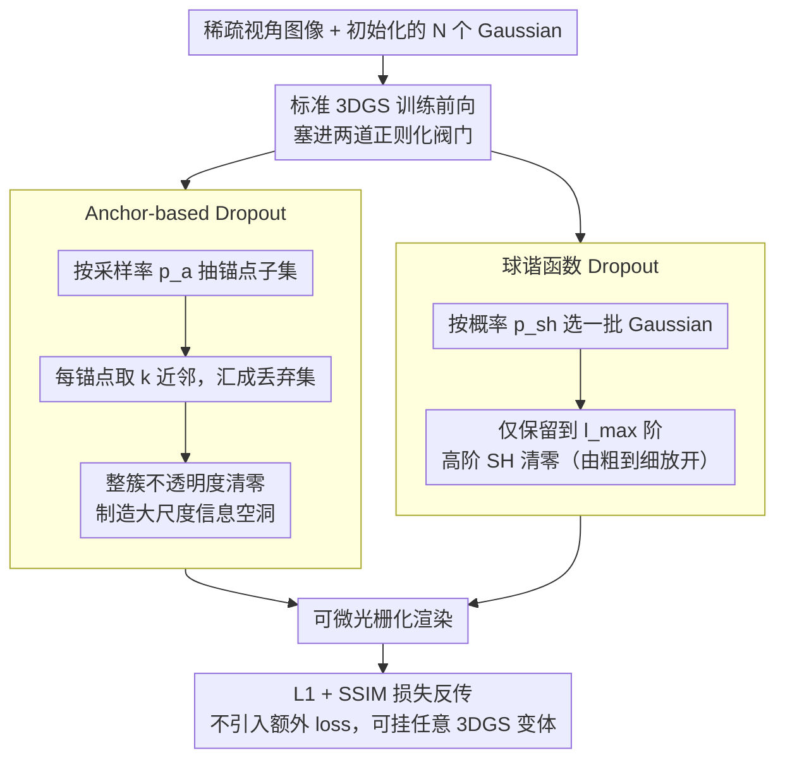

<!-- 由 src/gen_stubs.py 自动生成 -->
# DropAnSH-GS: Dropping Anchor and Spherical Harmonics for Sparse-view Gaussian Splatting

**会议**: CVPR 2026  
**arXiv**: [2602.20933](https://arxiv.org/abs/2602.20933)  
**代码**: [项目页](https://sk-fun.fun/DropAnSH-GS)  
**领域**: 3D视觉  
**关键词**: 3D Gaussian Splatting, 稀疏视角, Dropout正则化, 球谐函数, 新视角合成

## 一句话总结

针对 3DGS 在稀疏视角下的过拟合问题，提出 DropAnSH-GS：用 Anchor-based Dropout（丢弃锚点及其邻域的 Gaussian 簇）替代独立随机 Dropout 来破坏局部冗余补偿效应，同时引入球谐函数（SH）Dropout 抑制高阶 SH 过拟合并支持训练后无损压缩。

## 研究背景与动机

3D Gaussian Splatting (3DGS) 通过大量显式 Gaussian 函数表征 3D 场景，在密集视角输入下取得了渲染速度和视觉质量的出色平衡。然而在稀疏视角设置下（如仅 3 个训练视角），严重的过拟合导致伪影、模糊和几何失真。

**现有解决方案的局限**：受深度学习中 Dropout 技术启发，DropGaussian 和 DropoutGS 在训练时随机将部分 Gaussian 的不透明度设为 0。但本文发现了两个关键问题：

**问题1——邻域补偿效应（Neighbor Compensation Effect）**：3DGS 用大量重叠 Gaussian 协作渲染，在局部区域 Gaussian 具有高度相似的不透明度和颜色属性（通过 Moran's I 指标验证，空间自相关性与距离成反比）。当随机丢弃一个 Gaussian 时，其渲染贡献被邻居 Gaussian 轻松补偿，像素颜色变化 $\Delta C$ 微乎其微，反向传播的梯度信号很弱，正则化效果被严重削弱。

**问题2——高阶 SH 过拟合**：现有 Dropout 方法只操作不透明度，忽略了球谐函数系数。实验表明（Figure 3），在密集视角下增加 SH 阶数能提升性能，但在稀疏视角下，高阶 SH 反而导致性能下降和模型膨胀，是另一个过拟合源。

**核心 idea**：要让 Dropout 真正起作用，需要丢弃整簇空间相关的 Gaussian（而非单个），制造更大规模的"信息空洞"，迫使模型学习更鲁棒的全局表示。

## 方法详解

### 整体框架

DropAnSH-GS 要解决的是 3DGS 在稀疏视角下严重过拟合的问题，但它不改网络、不改损失，只在标准 3DGS 训练管线的前向传播里塞进两道正则化阀门。第一道是 Anchor-based Dropout：选一批锚点 Gaussian，连同它们的空间邻域整簇丢掉，从根上掐断"丢一个被邻居补一个"的补偿效应；第二道是球谐函数（SH）Dropout：随机把一批 Gaussian 的高阶球谐系数清零，压制颜色维度上的过拟合。两者都只在前向时临时改写不透明度与 SH，反传照常，所以可以无缝挂到任何 3DGS 变体上。

### 关键设计

**1. Anchor-based Dropout：丢整簇而非单点，制造大尺度的"信息空洞"**

随机丢单个 Gaussian 之所以正则化无力，是因为它的渲染贡献立刻被周围属性几乎相同的邻居补上，像素颜色几乎不变、回传梯度极弱。本文的破局思路是连片丢弃：先以采样率 $p_a$ 从全部 $N$ 个 Gaussian $\mathcal{G}$ 中随机抽出锚点子集 $\mathcal{A}$，再对每个锚点在欧氏空间里取 $k$ 个最近邻，把所有锚点连同邻域汇成丢弃集 $\mathcal{D}$，统一用二值 mask 把这一簇的不透明度清零：

$$\hat{\alpha}_i = \alpha_i \cdot m_i, \quad m_i = \begin{cases} 0 & G_i \in \mathcal{D} \\ 1 & \text{otherwise} \end{cases}$$

一次性挖掉一整簇空间相关的 Gaussian，相当于在场景里捅出一个邻居无法就近填补的大洞，优化只能调用更远距离的上下文来重建该区域，从而被迫学到更鲁棒的全局表示。这里有个关键的节奏控制：锚点采样率 $p_a$ 不是定值，而是从 0 线性爬升到 0.02——训练初期几乎不丢，等几何结构站稳后再逐步加压，避免破坏早期的几何初始化；邻域大小固定 $k=10$。$p_a$ 是全方法最敏感的旋钮，一旦调到 0.04，PSNR 会骤降到 19.97。kNN 搜索用 CUDA 实现，整套机制带来的训练开销不到 2.8%。

**2. 球谐函数 Dropout：按阶丢弃高阶 SH，既抗过拟合又顺带压缩模型**

现有 Dropout 只动不透明度，漏掉了另一个过拟合源——稀疏视角下高阶球谐反而拖累性能、还让模型膨胀。这里把 Dropout 搬到颜色上：Gaussian 的颜色由多阶 SH 系数 $\mathbf{c} = [\mathbf{c}^{(0)}, \mathbf{c}^{(1)}, \dots, \mathbf{c}^{(L)}]$ 表示，以概率 $p_{sh}=0.2$ 选一批 Gaussian，只保留到最大阶数 $l_{\max}$、把更高阶整段清零：

$$\tilde{\mathbf{c}} = [\mathbf{c}^{(0)}, \dots, \mathbf{c}^{(l_{\max})}, \mathbf{0}, \dots, \mathbf{0}]$$

而且 $l_{\max}$ 随训练逐步放开（2000 次迭代放到 0 阶、4000 次到 1 阶、6000 次到 2 阶），形成由粗到细的外观学习。这样做收两份红利：一是直接压住颜色过拟合；二是逼模型把外观信息优先塞进低阶 SH，于是训练完可以直接截掉高阶系数做无损压缩，不必重训。注意是"按阶丢"而非"随机丢系数"，因为前者保住了 SH 的层级结构（消融里 Blender 上 25.50 vs 25.12 PSNR）。

### 损失函数 / 训练策略

标准 3DGS 损失，不额外修改：
$$\mathcal{L} = \mathcal{L}_{\text{L1}}(\hat{C}, C_{gt}) + \lambda \mathcal{L}_{\text{SSIM}}(\hat{C}, C_{gt})$$

关键：DropAnSH-GS 是纯正则化策略，仅通过修改前向传播中的不透明度和 SH 来施加隐式约束，不引入额外的显式loss项。

## 实验关键数据

### 主实验

| 数据集 (视角数) | 指标 | DropAnSH-GS | DropGaussian | 3DGS | 提升 vs DropGaussian |
|--------|------|-------------|-------------|------|------|
| LLFF (3-view) | PSNR↑ | **20.68** | 20.33 | 19.17 | +0.35 |
| LLFF (3-view) | SSIM↑ | **0.724** | 0.709 | 0.646 | +0.015 |
| LLFF (3-view) | LPIPS↓ | **0.194** | 0.201 | 0.268 | -0.007 |
| MipNeRF-360 (12-view) | PSNR↑ | **19.95** | 19.66 | 18.58 | +0.29 |
| Blender (8-view) | PSNR↑ | **25.50** | 25.17 | 22.13 | +0.33 |

### 消融实验

| 配置 | PSNR | SSIM | LPIPS | 说明 |
|------|------|------|-------|------|
| 无 Dropout（3DGS） | 19.17 | 0.646 | 0.268 | 基线 |
| 仅 Drop Anchor | 20.47 | 0.713 | 0.200 | 锚点Dropout贡献 +1.30 PSNR |
| 仅 Drop SH | 19.59 | 0.641 | 0.247 | SH Dropout 单独也有效 |
| Drop Anchor + Drop SH | **20.68** | **0.724** | **0.194** | 二者互补 |

### 关键发现

- **模型压缩**：仅保留 0 阶 SH（SH0）即超过原始 3DGS 性能，模型大小仅为 25%。MipNeRF-360 上：SH0=33.8MB (PSNR 19.71) vs 3DGS=143.4MB (PSNR 18.58)
- **兼容性强**：将 DropAnSH-GS 插入其他 3DGS 变体均有提升——FSGS +0.29 PSNR, CoR-GS +0.38, DNGaussian +0.59, Scaffold-GS +1.22
- **训练效率**：相比 3DGS 仅增加 <2.8% 训练时间（LLFF: 760s vs 742s）
- "按阶丢弃 SH" 比"随机丢弃 SH 系数"效果更好（Blender: 25.50 vs 25.12 PSNR），因为保持了 SH 的层级结构

## 亮点与洞察

- **问题分析深入**：通过 Moran's I 定量度量 Gaussian 间的空间自相关性来论证邻域补偿效应，比直觉论证更有说服力
- **方法极简但有效**：不修改损失函数、不引入额外网络，仅改变训练时的随机 mask 策略
- **训练后压缩**：SH Dropout 带来的副产品——无需重训练即可截断高阶 SH，在性能和模型大小之间灵活权衡
- 从"为什么 Dropout 在 3DGS 中效果弱"出发做研究，问题驱动型，思路值得学习

## 局限与展望

- kNN 搜索在 Gaussian 数量极大时可能成为瓶颈，尽管已用 CUDA 加速
- 锚点采样率 $p_a$ 和邻域大小 $k$ 需要调参，超参敏感性分析显示性能对 $p_a$ 较敏感（0.04 时 PSNR 骤降至 19.97）
- 方法是通用正则化策略，但没有利用任何 3D 先验或预训练模型，这是可以进一步改进的方向
- 仅在稀疏视角场景验证，在其他退化条件（少量 pose 噪声等）下的效果未知

## 相关工作与启发

- DropGaussian 和 DropoutGS 开创了在 3DGS 中使用 Dropout 的先河，但忽略了 Gaussian 的空间冗余特性
- 与深度学习中的 Spatial Dropout / DropBlock 有类似思想：丢弃空间连续区域比丢弃独立单元效果更好
- CoR-GS 用两个 3DGS 互相约束来正则化，而本文是单模型正则化，更简洁
- SH 截断用于模型压缩的思路可以推广到其他使用 SH 的场景表示

## 评分

- **新颖性**: ⭐⭐⭐⭐ 从 Gaussian 空间冗余角度重新审视 Dropout 的 insight 新颖，方法简洁
- **实验充分度**: ⭐⭐⭐⭐⭐ 3 个数据集、多种视角数、丰富消融、兼容性验证、超参分析
- **写作质量**: ⭐⭐⭐⭐ Pilot study 的分析很扎实，图表清晰
- **价值**: ⭐⭐⭐⭐ 方法简单实用、即插即用，对 3DGS 社区有直接价值

<!-- RELATED:START -->

## 相关论文

- [\[CVPR 2026\] SV-GS: Sparse View 4D Reconstruction with Skeleton-Driven Gaussian Splatting](sv-gs_sparse_view_4d_reconstruction_with_skeleton-driven_gaussian_splatting.md)
- [\[CVPR 2026\] Efficient Hybrid SE(3)-Equivariant Visuomotor Flow Policy via Spherical Harmonics](efficient_hybrid_se3-equivariant_visuomotor_flow_policy_via_spherical_harmonics_.md)
- [\[ECCV 2024\] CoR-GS: Sparse-View 3D Gaussian Splatting via Co-Regularization](../../ECCV2024/3d_vision/cor-gs_sparse-view_3d_gaussian_splatting_via_co-regularization.md)
- [\[CVPR 2026\] TWINGS: Thin Plate Splines Warp-aligned Initialization for Sparse-View Gaussian Splatting](twings_thin_plate_splines_warp-aligned_initialization_for_sparse-view_gaussian_s.md)
- [\[ECCV 2024\] MVSplat: Efficient 3D Gaussian Splatting from Sparse Multi-View Images](../../ECCV2024/3d_vision/mvsplat_efficient_3d_gaussian_splatting_from_sparse_multi-view_images.md)

<!-- RELATED:END -->
