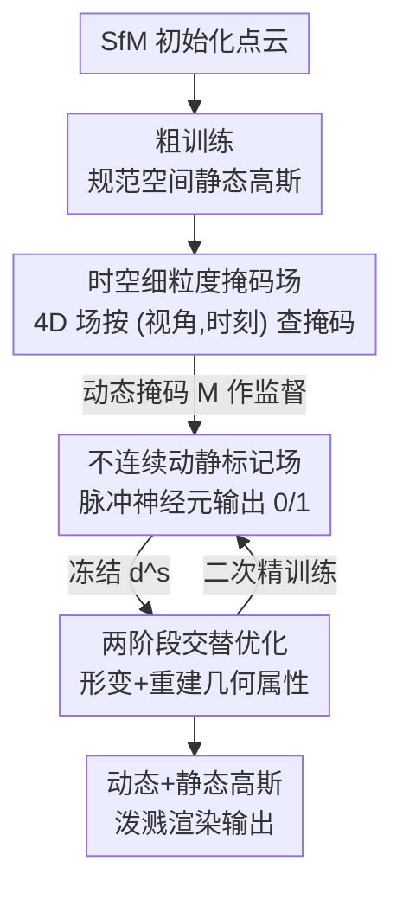

# Dynamic-Static Decomposition for Novel View Synthesis of Dynamic Scenes with Spiking Neurons

**会议**: CVPR 2026  
**论文**: [CVF Open Access](https://openaccess.thecvf.com/content/CVPR2026/html/Dai_Dynamic-Static_Decomposition_for_Novel_View_Synthesis_of_Dynamic_Scenes_with_CVPR_2026_paper.html)  
**代码**: https://zju-bmi-lab.github.io/SpikeMaskGS-homepage （项目主页）  
**领域**: 3D视觉 / 动态场景新视角合成  
**关键词**: 动静分解, 3D高斯泼溅, 脉冲神经元, 4D掩码场, 侧视图评测  

## 一句话总结
针对动态场景 3DGS 动静分解中"掩码先验不准"和"标签表示不当"两大痛点，本文用一个 4D 时空细粒度掩码场提供监督、再用脉冲神经元把动静标签直接优化成离散的 0/1，从而精确地把高斯分到动态/静态两类，在精细运动、运动边界和侧视图上都拿到 SOTA 渲染质量且保持实时帧率。

## 研究背景与动机
**领域现状**：动态场景的新视角合成（NVS）近年靠 3D Gaussian Splatting（3DGS）做到了高效且逼真。但若把场景里所有高斯都当作动态去建模，会带来巨大显存、慢渲染和严重过拟合。于是主流做法转向**动静分解**：给每个高斯打一个"动态/静态"标签，静态高斯只建一次、动态高斯才跟时间形变，从而兼顾效率和精度。

**现有痛点**：分解质量完全取决于"标签分得准不准"，而现有流水线在两个环节都出问题。其一，**掩码先验不准**——一类方法用预训练分割模型逐视图生成掩码，忽略多视图一致性，空间上粗糙；另一类对所有时刻共用同一份先验，忽略时间变化，容易把动态区域过度分割。其二，**标签表示不当**——现有方法给高斯一个连续浮点属性 $d^c\in\mathbb{R}$ 表示"它是动态的概率"，优化完再用固定阈值后处理离散化。问题在于运动物体边界附近的高斯，概率天然落在中间值，对阈值极其敏感、极易误分。

**核心矛盾**：两个问题叠加，导致动态高斯被错误地用来表示静态区域、反之亦然。模型于是在输入视图上"将错就错"地过拟合这些误分区域，一旦换到与训练视角差异大的**侧视图**，几何重建的不真实就暴露出来，画质骤降。

**本文目标**：把"动静标签的赋值"做准，具体拆成两个子问题——(1) 造一份时空都细粒度的掩码监督；(2) 让标签在优化时就是离散的，去掉后处理这道带不确定性的工序。

**切入角度**：作者注意到，掩码不该是一堆离散的 2D 图，而应是一个能按"视角+时刻"查询的连续 4D 场；标签也不该是"先连续优化再阈值砍"，而该用一种**天生输出离散值**的机制——脉冲神经元发放的脉冲恰好是 0/1。

**核心 idea**：用 **4D 掩码场**生成时空细粒度的动静监督，再用**脉冲神经元**把动静标记场直接优化成离散标签，端到端地实现高斯的精确动静赋值。

## 方法详解

### 整体框架
输入是一组同步多视角视频，目标是基于动静分解重建一个动态 3D 高斯场以支持高质量 NVS。每个高斯在几何属性 $\mathcal{G}_{geo}=\{\mu,q,s,\sigma,c\}$ 之外，额外带一个动静属性 $d^s$，于是 $\mathcal{G}_i=\{\mu_i,q_i,s_i,\sigma_i,c_i,d^s_i\}$，而形变只作用于几何项 $\Delta\mathcal{G}_i=\{\Delta\mu_i,\Delta q_i,\Delta s_i,\Delta\sigma_i,0,0\}$。

整个流程分两步走：先 SfM 初始化点云并做**粗训练**得到规范空间下的静态高斯；再进入**精训练**，由一个**时空细粒度掩码场**产出动静掩码作为监督，去引导一个**不连续动静标记场**（脉冲神经元实现）把每个高斯的标签优化成 0/1；标签定下来后，动态高斯过形变模块、与静态高斯合并后泼溅渲染。关键在于：标签优化和几何重建**交替进行、互相冻结**，避免两者互相干扰。

### 关键设计

**1. 时空细粒度掩码场：把离散 2D 掩码升级成可按视角-时刻查询的 4D 场**

针对"掩码先验不准"——逐视图分割缺多视图一致性、单一时刻先验缺时间变化——本文构造一个 4D 掩码场 $\mathcal{F}$，对任意视角 $v$、时刻 $t$ 都能生成专属的 2D 动静掩码 $M^{v,t}=\mathcal{F}(v,t)$。它怎么得到监督？作者借鉴"用静态 3D 高斯去重建动态场景、看哪里重建不好就是动态"的思路：先算渲染残差 $r(v,t)=\|I_{v,t}-I^{gt}_{v,t}\|_1$，残差低于阈值 $\tau_r$ 的像素标为静态，得到粗掩码 $M^{i,j}_{coarse}(v,t)=r^{i,j}(v,t)\le\tau_r$。

但训练早期，欠优化的高频静态区域也会有大残差，容易被误判成动态。作者利用"动态区域在空间上具有结构平滑性"这一特性，用 $3\times3$ 盒滤波 $\mathcal{B}$ 对粗掩码做扩散：$M^{i,j}_{diffuse}(v,t)=\big(M^{i,j}_{coarse}(v,t)\circledast\mathcal{B}_{3\times3}\big)\ge\tau_\circledast$，即只有当邻域大多数像素都是静态时才确认该像素静态，从而把零散的高频误报滤掉。再结合按逐像素颜色强度时间标准差算出的时序掩码 $M^{i,j}_{temp}(v)$，三者合成逐像素细粒度静态掩码 $M^{i,j}_{fine}(v,t)$。掩码场本身用如下损失训练，鼓励静态/动态像素的残差差异拉大：

$$\mathcal{L}_{\mathcal{F}}^{v,t}=\sum_{i,j}M^{i,j}_{fine}(v,t)\odot r(v,t)^{i,j}.$$

查询时取 $M_{fine}(v,t)$ 反转得到动态掩码 $M^{v,t}$，去监督标记场。相比"一堆 2D 掩码图"，4D 形式天然建模了细粒度的空间与时间分布，能抓住手指这类精细运动。

**2. 不连续动静标记场：用脉冲神经元让标签在优化时就是 0/1，去掉后处理不确定性**

针对"标签表示不当"——连续属性 $d^c$ 优化、再用阈值后处理离散化，造成优化目标与最终离散标签之间存在分布鸿沟、且对阈值敏感——本文不再优化连续概率，而是显式建模一个二值化的动静标记场。核心是一个可训练的二值映射 $d^s=\mathcal{S}(d^c)$，$d^s\in\{0,1\}$，1 为动态、0 为静态。

二值映射用脉冲神经元实现：采用积分发放（IF）模型，把输入累积进膜电位，超过阈值 $V_{th}$ 就发放一个脉冲。脉冲输出天然是二值的，正好匹配需求。简化成单时间步后，前向就是一个 Heaviside 阶跃 $d^s=H(d^c-V_{th})$（$V_{th}$ 设为 0）。前向时用 alpha-blending 把每个高斯的离散标签 $d^s$ 渲染成逐像素动态图 $\hat{M}=\sum_{i\in N}d^s_i\alpha_i\prod_{j=1}^{i-1}(1-\alpha_i)$，再用它和目标掩码 $M$ 比对监督。由于 $H(\cdot)$ 不可导，反向时用反正切函数作梯度替代（surrogate）：

$$\frac{\partial d^s_i}{\partial d^c_i}=\frac{\beta}{2\left(1+\left(\frac{\pi}{2}\beta d^c_i\right)^2\right)},$$

其中 $\beta$ 是替代梯度的超参。这样梯度经由替代函数回传更新 $d^c$，训练稳定。和 STE、Gumbel-Softmax 这类离散方法相比，作者指出它们对 Heaviside 用了不准的替代梯度（$y=1$）导致优化错误；而这里的反正切替代更贴合，因此边界区域分得更干净、画质更高。

**3. 两阶段交替优化框架：标签与几何互相冻结，避免动静分离与重建相互污染**

动静分离（更新 $d^s$）和几何重建（更新 $\mathcal{G}_{geo}$）若同时进行会互相干扰，所以作者把训练拆成"粗静态初始化 + 精动态精修"两阶段，并在精训练内部做属性解耦。粗训练只在多视角首帧上做静态重建，拿到规范空间里准确的高斯（此阶段关闭动态与动静属性，约 5000 次迭代）。精训练是两步走的交替：先优化动静标记场强制 $d^s$ 的离散赋值，此时其余属性全部冻结、只动 $d^s$；再反过来冻结 $d^s$、只优化几何属性 $\mathcal{G}_{geo}$ 做动态重建。

这个"精训练"两步被执行两遍——第一遍用在粗训练输出的高斯上，第二遍在第一遍精训练跑满 5000 次迭代后再来一轮（标记场优化分别 1000 / 5000 次，重建分别 5000 / 5000 次）。这种解耦保证了"先把标签判准、再在固定标签下精修几何"的清晰职责分工，是把前两个模块真正落到稳定训练里的关键。

### 损失函数 / 训练策略
重建阶段（粗、精都用）采用标准渲染损失 $\mathcal{L}_{render}=(1-\lambda)\mathcal{L}_1+\lambda\mathcal{L}_{SSIM}$。标记场优化阶段直接监督离散标签 $d^s$，最小化预测动态图 $\hat{M}$ 与 4D 掩码场目标 $M$ 的差异，用二元交叉熵：

$$\mathcal{L}_{mask}=-M\cdot\log(\hat{M})-(1-M)\cdot\log(1-\hat{M}).$$

实现上首帧点云由 SfM 生成，供 4D 掩码场与粗训练共用；掩码场超参 $\tau_r=\mathrm{PERCENTILE}(r,0.7)$、$\tau_\circledast=0.5$；全部实验在单张 RTX 3090 上完成。

## 实验关键数据

作者特别提出了一个**侧视图评测设置**（Side View Setting）：以往 N3DV、MeetRoom 把测试视角放在训练视角范围中心附近，过拟合不易暴露；本文把测试视角放到训练视角的外围边缘，拉大训练-测试视角差异，更能区分"真几何重建"与"过拟合"。评测指标为 PSNR、LPIPS、FPS 及优化时间，数据集为 N3DV、MeetRoom（标准 + 侧视图两种）和 VRU（视角已均匀采样，无需额外侧视图设置）。

### 主实验
侧视图设置下 N3DV / MeetRoom 的对比（PSNR↑、LPIPS↓、FPS↑）：

| 方法 | N3DV PSNR | N3DV LPIPS | N3DV FPS | MeetRoom PSNR | MeetRoom LPIPS | MeetRoom FPS |
|------|-----------|------------|----------|---------------|----------------|--------------|
| 4DGS | 26.19 | 0.0753 | 37 | 26.27 | 0.0649 | 43 |
| 3DGStream | 25.55 | 0.0740 | 230 | 25.68 | 0.0916 | 201 |
| Ex4DGS | 26.10 | 0.0667 | 94 | 25.10 | 0.0764 | 129 |
| Swift4D | 25.80 | 0.0619 | 124 | 25.16 | 0.0676 | 101 |
| **本文** | **26.30** | **0.0615** | 137 | **26.64** | **0.0626** | 154 |

复杂运动的 VRU 数据集上提升更明显（每 20 帧训练/测试一次）：

| 方法 | PSNR↑ | LPIPS↓ | FPS↑ |
|------|-------|--------|------|
| 4DGS | 27.87 | 0.191 | 12 |
| Swift4D | 29.03 | 0.187 | 77 |
| **本文** | **29.43** | **0.170** | 77 |

侧视图下其他方法因过拟合明显掉点，本文泛化更好；由于动静标签更准、冗余动态高斯更少，本文还拿到更高 FPS。

### 消融实验
在 N3DV 的 cut beef 场景（侧视图设置）逐组件消融，SN 指脉冲神经元：

| 配置 | PSNR↑ | LPIPS↓ | FPS↑ | 说明 |
|------|-------|--------|------|------|
| w/o 4D Mask Field & SN | 25.23 | 0.0699 | 95 | 两个模块都去掉 |
| w/o 4D Mask Field | 25.50 | 0.0661 | 129 | 缺时空细粒度掩码，过拟合 |
| w/o SN (Variant A) | 25.91 | 0.0757 | 126 | 标记场退回 Swift4D 实现 |
| w/o SN (Variant B) | 25.93 | 0.0701 | 106 | 标记场退回 sigmoid+阈值 |
| **Full model** | **26.39** | **0.0656** | 140 | 完整模型 |

### 关键发现
- **两个模块都有效且互补**：去掉 4D 掩码场 PSNR 从 26.39 掉到 25.50；把脉冲神经元换成连续 sigmoid+阈值（Variant B）或 Swift4D 式实现（Variant A）也只有 25.9 上下，说明"离散标签直接优化"确实带来额外增益。
- **离散优化方式之间也有差距**：作者把脉冲神经元和 STE、Gumbel-Softmax 对比，后两者对 Heaviside 用了不准的替代梯度（$y=1$），优化方向错误，侧视图重建明显劣于反正切替代。
- **效率随准确度一起涨**：分解更准 → 冗余动态高斯更少 → FPS 更高，画质和速度在本方法里不是 trade-off 而是同向提升。
- **侧视图设置揭示过拟合**：标准设置下各方法差距不大，一旦换到侧视图，旧方法集体掉点，本文优势才显出来，这也佐证了"误分导致过拟合"这一动机判断。

## 亮点与洞察
- **把"离散标签"问题对接到脉冲神经元，思路很巧**：动静标签本质就是 0/1，而脉冲神经元发放的脉冲天然二值，用单时间步 IF + 反正切替代梯度，就把"优化时连续、推理时离散"的鸿沟直接抹掉了，省掉了阈值后处理这道脆弱工序。这种"用神经形态计算的离散性匹配任务的离散性"的迁移很值得借鉴。
- **4D 掩码场 + 残差扩散滤波**：用静态高斯重建残差找动态区域是已知思路，但盒滤波扩散来区分"欠优化高频静态"和"真动态"是个简洁有效的小 trick——利用动态区域空间平滑性这一先验，避免早期训练误把静态细节当动态。
- **侧视图评测设置本身是一项贡献**：它把"过拟合输入视图"这个长期被中心测试视角掩盖的问题暴露出来，对动态 NVS 社区的评测范式有纠偏价值，其他动态重建工作也可直接复用。

## 局限与展望
- **作者承认的局限**：方法依赖清晰输入来建准掩码先验；训练视图间若存在颜色差异，会破坏时空一致性，导致掩码先验不准、画质下降。
- **自己发现的局限**：消融只在单个 cut beef 场景上做，逐组件结论的普适性还需更多场景验证；⚠️ 标准设置下的完整定量结果被放到补充材料，正文无法直接核对方法在非侧视图下相对旧方法的提升幅度。
- **改进思路**：可考虑把颜色一致性建模进掩码场（如显式估计曝光/白平衡差异），缓解多视频颜色不一致带来的先验退化；脉冲神经元目前是单时间步，引入多时间步是否能对边界不确定性建模得更细，值得一探。

## 相关工作与启发
- **vs Swift4D**：Swift4D 对所有时刻共用同一份掩码先验、且用连续标签 + 阈值后处理；本文用按视角-时刻查询的 4D 掩码场补上时空粒度，用脉冲神经元把标签做成离散，侧视图 PSNR 与 LPIPS 全面更优。
- **vs Ex4DGS / 3DGStream**：它们同样做动静分解但标签表示仍是连续属性 + 后处理，边界区域误分明显；本文在边界区域和精细运动上更干净，且 FPS 不落下风。
- **vs STE / Gumbel-Softmax（离散优化）**：同为离散标签优化，但它们的替代梯度不贴合 Heaviside，本文反正切替代梯度优化更准，侧视图渲染更好——说明在这个问题上"用什么替代梯度"比"是否离散"更关键。

## 评分
- 新颖性: ⭐⭐⭐⭐ 把脉冲神经元的离散发放迁移到动静标签优化是个新颖且自洽的角度，4D 掩码场与侧视图评测也都有新意。
- 实验充分度: ⭐⭐⭐⭐ 三个真实数据集 + 侧视图设置 + 离散优化方法对比较充分，但消融场景偏少、标准设置结果挪到了补充材料。
- 写作质量: ⭐⭐⭐⭐ 痛点（掩码不准 / 标签不当）与方法（掩码场 / 标记场）一一对应，图示清晰，逻辑顺畅。
- 价值: ⭐⭐⭐⭐ 同时提升画质与速度、并贡献了能揭示过拟合的侧视图评测范式，对动态 NVS 实用价值较高。

<!-- RELATED:START -->

## 相关论文

- [\[CVPR 2026\] RF4D: Neural Radar Fields for Novel View Synthesis in Outdoor Dynamic Scenes](rf4dneural_radar_fields_for_novel_view_synthesis_in_outdoor_dynamic_scenes.md)
- [\[CVPR 2026\] MoVieS: Motion-Aware 4D Dynamic View Synthesis in One Second](movies_motion-aware_4d_dynamic_view_synthesis_in_one_second.md)
- [\[ICLR 2026\] Dynamic Novel View Synthesis in High Dynamic Range](../../ICLR2026/3d_vision/dynamic_novel_view_synthesis_in_high_dynamic_range.md)
- [\[CVPR 2026\] PhysGaia: A Physics-Aware Benchmark with Multi-Body Interactions for Dynamic Novel View Synthesis](physgaia_a_physics-aware_benchmark_with_multi-body_interactions_for_dynamic_nove.md)
- [\[CVPR 2026\] Splatent: Splatting Diffusion Latents for Novel View Synthesis](splatent_splatting_diffusion_latents_for_novel_view_synthesis.md)

<!-- RELATED:END -->
