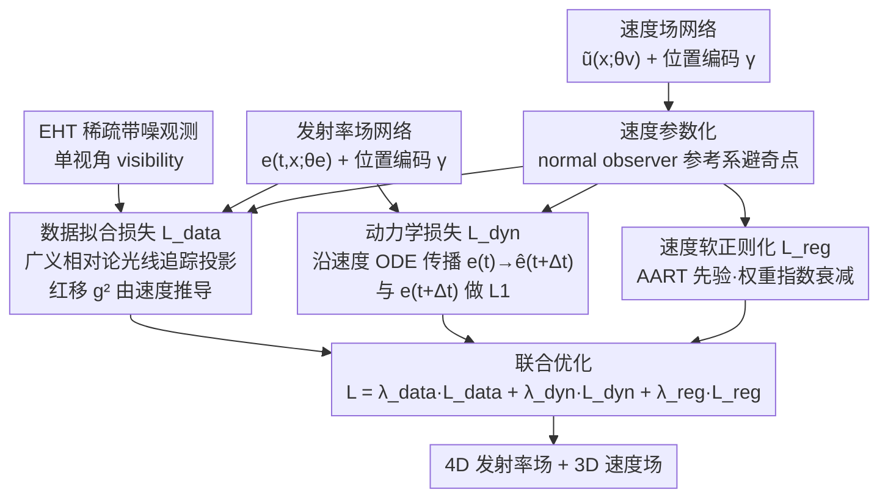

<!-- 由 src/gen_stubs.py 自动生成 -->
# Dynamic Black-hole Emission Tomography with Physics-informed Neural Fields

**会议**: CVPR2026  
**arXiv**: [2602.08029](https://arxiv.org/abs/2602.08029)  
**代码**: 未开源  
**领域**: 3D视觉 / 计算成像 / 科学成像  
**关键词**: 黑洞成像, 神经辐射场, 物理信息约束, 4D层析成像, 事件视界望远镜

## 一句话总结

提出 PI-DEF，利用物理信息约束的坐标神经网络同时重建黑洞附近气体的 4D（时间+3D）发射率场和 3D 速度场，在稀疏 EHT 测量下显著优于硬约束 Keplerian 动力学的 BH-NeRF。

## 背景与动机

1. **静态成像已成功，动态3D成像是下一前沿**：EHT 已成功拍摄 M87\* 和 Sgr A\* 的静态2D图像，但静态图像是3D发射率的复杂2D投影，无法揭示动态3D环境的物理本质
2. **极度欠定的逆问题**：EHT 只能从单一视角观测，且测量高度稀疏且受噪声污染，4D层析重建是严重病态问题
3. **动态源使问题更困难**：辐射气体随时间运动、出现和消失，无法简单聚合跨时间测量来提高重建质量
4. **前向模型部分未知**：光传播依赖于黑洞附近未知的流体动力学，测量前向模型不完全已知
5. **BH-NeRF 假设过强**：先前唯一方法 BH-NeRF 假设 Keplerian 动力学，但在靠近黑洞处，强引力和电磁活动使流体动力学偏离 Keplerian 模型，且无法处理新出现的辐射
6. **科学意义重大**：恢复黑洞附近动态3D发射率场可揭示宇宙未见部分，有助于检验广义相对论并推断黑洞自旋等物理参数

## 方法详解

### 整体框架

PI-DEF 要解决的是一个极端病态的逆问题：事件视界望远镜（EHT）只能从单一视角、稀疏且带噪地观测黑洞附近的辐射气体，而目标是重建它随时间变化的 4D（时间 + 3D）发射率场，外加 3D 速度场。先前唯一的方法 BH-NeRF 假设气体严格遵守 Keplerian 动力学，但在强引力区这个假设站不住，且无法处理观测窗口内新出现的辐射。

PI-DEF 的做法是用两个坐标神经网络分别表示 4D 发射率场 $e(t, \mathbf{x}; \theta_e)$ 和 3D 速度场 $\tilde{u}^i(\mathbf{x}; \theta_v)$，都用位置编码 $\gamma$ 提升高频表达力，再通过三项损失把两个场联合优化到既拟合观测、又满足流体连续性、还受软物理先验约束的状态。总损失为 $\mathcal{L} = \lambda_{\text{data}}\mathcal{L}_{\text{data}} + \lambda_{\text{dyn}}\mathcal{L}_{\text{dyn}} + \lambda_{\text{reg}}\mathcal{L}_{\text{reg}}$，关键在于物理模型只作为可衰减的软正则化注入，而非硬约束。

### 关键设计

**1. 数据拟合损失：用广义相对论光线追踪把两个场钉到观测上**

这一项负责把重建结果对齐真实测量。它将发射率场通过广义相对论测地线光线追踪投影到图像平面，模拟 EHT 的 visibility 测量，与观测做高斯似然拟合。巧妙之处在于投影里的红移因子 $g^2$ 由速度场推导，所以单个 $\mathcal{L}_{\text{data}}$ 同时约束了发射率网络和速度网络——速度估错了，红移就错，拟合就差。测地线由 kgeo 库计算，测量由 eht-imaging 库模拟。

**2. 动力学损失：用速度场把不同时刻的发射率串成物理一致的演化**

这是核心创新，针对的是"动态源使跨时间测量无法简单聚合"的难题。它把发射率场 $e(t)$ 沿速度网络预测的速度经 ODE 求解器传播 $\Delta t$ 得到 $\hat{e}(t+\Delta t)$，再与发射率网络直接预测的 $e(t+\Delta t)$ 做 L1 比较，强制两个网络在时间上自洽——发射率怎么流动必须和速度场说的一致。为防止"一团模糊"也能骗过这个损失，比较前先用高斯核模糊。它本质上是把流体连续性写成了可微的一致性约束。

**3. 指数衰减的速度软正则化：先信物理先验，后信数据**

极端欠定下速度几乎无法纯靠数据恢复，但硬套理论模型又会重蹈 BH-NeRF 的覆辙。PI-DEF 取折中：以 AART 速度模型（含亚开普勒速度和径向坠落，由 $(\beta_\phi, \beta_r, \xi)$ 控制）作为软先验，对估计速度做 L2 正则 $\mathcal{L}_{\text{reg}}$，但正则权重随训练指数衰减（$\lambda_{\text{init}}=10^6 \to \lambda_{\text{final}}=10$）。早期靠先验把速度引导到合理范围，后期放手让数据驱动，因此即使先验与真实动力学不完全匹配，也能被数据纠偏。

**4. 数值稳定的速度参数化：避开事件视界附近的奇点**

速度若直接在四速度框架里估计，会遇到 $u^t$ 未定义的数值问题，PI-DEF 改在数值稳定的 normal observer 参考系下估计。此外发射率场是显式时间依赖的，能捕获观测窗口内新出现的辐射——这正是只建模初始场加固定传播的 BH-NeRF 做不到的。消融显示速度网络仅用半径 $r$、$(r,\theta)$ 或 $(x,y,z)$ 参数化都能给出合理结果，说明轴对称约束并非必要。

## 实验关键数据

### 发射率重建精度（5个随机测试场景，ngEHT 测量）

| 方法 | PSNR (dB) ↑ | MSE (×10⁻⁵) ↓ |
|------|-------------|----------------|
| **PI-DEF (Ours)** | **37.3 ± 2.3** | **2.3 ± 0.2** |
| 4D-MLP | 35.4 ± 0.5 | 3.8 ± 0.4 |
| BH-NeRF | 34.0 ± 1.9 | 4.9 ± 0.8 |

- PI-DEF 即使在速度先验不匹配（假设纯亚开普勒无径向坠落）的情况下，仍显著优于 BH-NeRF 和纯数据驱动的 4D-MLP
- BH-NeRF 因硬 Keplerian 约束在黑洞附近严重失效

### 消融实验与分析

- **测量稀疏度**：ngEHT（23台望远镜）比 EHT 2025（12台）和 EHT 2017（8台）显著提升重建质量，EHT 2025 对 2017 改善有限
- **速度恢复**：在高发射率密度区域（>65th 百分位），PI-DEF 的径向和方位角速度恢复与真实值吻合良好，即使初始假设不匹配。低发射率区域速度恢复不受约束
- **速度网络参数化**：仅依赖半径 $r$、$(r,\theta)$ 和 $(x,y,z)$ 三种参数化均能获得合理结果，轴对称约束非必要
- **真实噪声**：在 Sgr A\* 真实总通量（~2.3 Jy）的逼真高斯噪声下仍可工作
- **大气噪声**：使用 closure phase 和振幅替代复 visibility 可应对大气相位误差，但重建精度有所下降
- **自旋推断**：数据拟合损失对假设的黑洞自旋敏感，正确自旋 $a=0.2$ 时损失最低，证明 PI-DEF 可用于推断物理参数

## 亮点

- **软约束 vs 硬约束**：将物理速度模型作为指数衰减的软正则化而非硬约束，兼顾了先验引导和对建模误差的鲁棒性，这一设计优雅且通用
- **双场联合重建**：同时恢复 4D 发射率场和 3D 速度场，动力学损失在两者之间建立物理一致性约束
- **科学价值突出**：首次在靠近黑洞（非远距离flare）的区域实现动态3D重建，并展示了自旋推断的可能性
- **计算机视觉驱动基础物理**：将 NeRF 范式与广义相对论测地线追踪结合，是 CV 技术推动天体物理前沿的典范

## 局限与展望

- 仅在模拟数据上验证，尚未应用于真实 EHT 数据
- 忽略了气体以相对论速度运动时光有限速度传播效应（slow-light effect）
- 忽略吸收和散射对光强的衰减
- 黑洞极近处（事件视界附近）因红移因子 $g^2\to 0$，发射率贡献极小，速度恢复困难
- 当前未联合优化黑洞自旋和倾角，仅做了自旋的网格搜索概念验证
- 高斯 splat 由于无法处理 hotspot 的出现和消失而被排除，但其效率优势可能在未来通过动态点管理解决

## 与相关工作的对比

| 方法 | 时间建模 | 速度约束 | 新发射体 | 代表性 |
|------|---------|---------|---------|--------|
| BH-NeRF | 初始场 + Keplerian传播 | 硬约束（Keplerian） | ✗ | ECCV 2022 |
| 4D-MLP | 4D坐标网络 | 无约束 | ✓ | Baseline |
| **PI-DEF** | **4D坐标网络** | **软约束（AART衰减正则化）** | **✓** | **本文** |

与 NeRF 动态场景方法的区别：PI-DEF 处理的是弯曲光路（广义相对论测地线）+ 单视角 + 动态源的极端设置，而非线性光线追踪 + 多视角的标准场景。

## 评分

- 新颖性: ⭐⭐⭐⭐⭐ — 首次将物理信息软约束引入黑洞4D层析成像，双场联合重建和衰减正则化设计新颖
- 实验充分度: ⭐⭐⭐⭐ — 模拟实验全面（稀疏度、噪声、自旋推断、消融），但缺少真实数据验证
- 写作质量: ⭐⭐⭐⭐⭐ — 物理背景和方法阐述清晰，图表精美，适合非天体物理背景读者
- 价值: ⭐⭐⭐⭐⭐ — CV 技术推动基础物理的标杆工作，对 EHT 科学有直接应用前景

<!-- RELATED:START -->

## 相关论文

- [\[CVPR 2026\] Evidential Neural Radiance Fields](evidential_neural_radiance_fields.md)
- [\[ICLR 2026\] Learning Physics-Grounded 4D Dynamics with Neural Gaussian Force Fields](../../ICLR2026/3d_vision/learning_physics-grounded_4d_dynamics_with_neural_gaussian_force_fields.md)
- [\[CVPR 2026\] RF4D: Neural Radar Fields for Novel View Synthesis in Outdoor Dynamic Scenes](rf4dneural_radar_fields_for_novel_view_synthesis_in_outdoor_dynamic_scenes.md)
- [\[CVPR 2025\] PBR-NeRF: Inverse Rendering with Physics-Based Neural Fields](../../CVPR2025/3d_vision/pbr-nerf_inverse_rendering_with_physics-based_neural_fields.md)
- [\[ICLR 2026\] DiffWind: Physics-Informed Differentiable Modeling of Wind-Driven Object Dynamics](../../ICLR2026/3d_vision/diffwind_physics-informed_differentiable_modeling_of_wind-driven_object_dynamics.md)

<!-- RELATED:END -->
