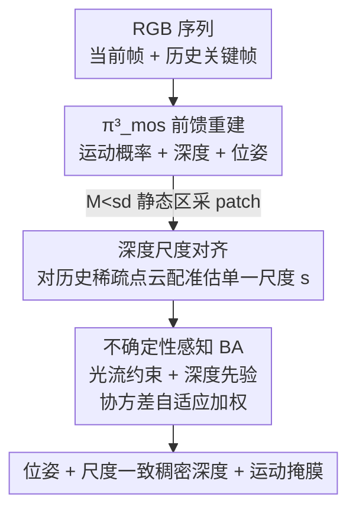

# Dynamic Visual SLAM using a General 3D Prior

**会议**: CVPR 2026  
**论文**: [CVF Open Access](https://openaccess.thecvf.com/content/CVPR2026/html/Zhong_Dynamic_Visual_SLAM_using_a_General_3D_Prior_CVPR_2026_paper.html)  
**代码**: https://github.com/PRBonn/Pi3MOS-SLAM  
**领域**: 3D视觉  
**关键词**: 动态SLAM, 前馈重建模型, 运动物体分割, 单目位姿估计, 尺度对齐  

## 一句话总结
把经典的 patch-based 光流 SLAM（DPV-SLAM）和前馈三维重建大模型（π³）紧耦合：用前馈模型预测的运动掩膜剔除动态像素、用它的深度先验稳住 bundle adjustment，并通过和 SLAM 稀疏点云做尺度对齐解决前馈模型的跨 batch 尺度漂移，从而在动态场景下同时得到准确位姿、干净的运动分割和尺度一致的稠密深度。

## 研究背景与动机

**领域现状**：单目视觉里程计 / SLAM 经过几十年发展，主流是几何方法（特征点或光流 + bundle adjustment），近年开始混入学习组件。另一条线是前馈重建模型（DUSt3R、VGGT、π³ 等），一次前向就能从一组 RGB 直接回归稠密结构和相机位姿，靠大规模多视角训练学到了很强的几何先验。

**现有痛点**：几何 SLAM 几乎都默认场景是静态的，把运动物体当 outlier 处理，在动态城市/室内场景里会因为错误的数据关联导致位姿崩坏；而且为了实时只做稀疏重建，几何细节有限、单目下缺先验时鲁棒性差。前馈模型虽然对动态场景更鲁棒，但离线多视角版本（VGGT、π³）显存和延迟随视角数暴涨，没法在线用；增量版本（CUT3R 等）虽然常数显存，但长序列上轨迹漂移严重，稳定性远不如经典 SLAM。两类方法各有死穴。

**核心矛盾**：几何 SLAM 准但不抗动态、缺先验；前馈大模型抗动态、有先验但长序列会漂、且尺度只在单个 batch 内一致（同一帧换一组邻居输入，预测出的深度尺度就变了）。两者的强项恰好互补，但简单拼接（比如直接信前馈位姿）会把漂移和尺度不一致也一起继承过来。

**本文目标**：构建一个在线单目 SLAM，在动态环境里同时输出（1）准确相机位姿、（2）尺度一致的稠密深度、（3）精确的运动物体掩膜。

**切入角度**：作者注意到一个有意思的现象——大规模训练的前馈重建模型其实已经隐含了区分动态/静态的能力（因为重建这个更基础的任务逼着它理解场景运动）。于是不必从头训一个分割器，只要轻量地把这个潜在能力"激活"出来，再让几何 SLAM 来兜住前馈模型不擅长的长序列稳定性和绝对尺度。

**核心 idea**：在 π³ 上加一个运动分割头得到 π³_mos，用它的运动掩膜 + 深度先验喂给 patch-based bundle adjustment；同时用 SLAM 维护的稀疏点云反过来给前馈深度做跨 batch 尺度对齐，最后用一个基于位姿协方差的不确定性权重自适应地决定信几何还是信先验。

## 方法详解

### 整体框架
系统建在单目 SLAM 框架 DPV-SLAM 之上，新增前馈重建模型 π³_mos。输入是动态环境下的 RGB 图像序列 $I=\{I_i\in\mathbb{R}^{H\times W\times3}\}_{i=1}^N$，在线输出每帧位姿 $T_i\in SE(3)$ 和尺度一致的稠密深度 $D_i$。

每来一帧 $i$，先和一组选出的历史关键帧打包，一起送进 π³_mos，得到当前帧的逐像素运动概率 $M_i$ 和深度图 $D_i$。用阈值 $s_d$ 把 $M_i<s_d$ 的像素判为静态区域，**只在静态背景上随机采样 K 个 patch** 去和历史帧算光流，建立帧间几何约束——这样后续位姿优化天然不受运动物体干扰。接着把当前预测深度 $D_i$ 和此前已优化 patch 形成的稀疏点云做尺度对齐，解决 π³_mos 的跨 batch 尺度模糊。最后把对齐后的深度先验和光流约束一起塞进滑动窗口，用一个不确定性感知的 bundle adjustment 联合优化相机位姿和 patch 深度。

### 关键设计

**1. π³_mos：把运动分割当作前馈重建的"副产物"激活出来**

针对的是"动态 SLAM 需要分割运动物体，但单独训分割器又难泛化、跨类别"的痛点。作者不另起炉灶，而是直接在 π³ 上扩一个运动分割（MOS）头：给一组图像，先用 DINOv2 把每张图 patch 化成 token，再过多层交替的"帧内 self-attention + 全局 self-attention"做跨图信息融合，最后三个轻量解码头分别回归相对位姿、深度图和逐像素运动概率：

$$\pi^3_{\text{mos}}(\mathcal{I})=\big(T_i,\,D_i,\,C_i,\,M_i\big)_{i=1}^N$$

其中 $C_i$ 是深度置信度、$M_i\in[0,1]^{H\times W}$ 是运动概率。训练时**冻结原 π³ 权重、只训新加的 MOS 头**，用简单的二分类交叉熵监督，在 Kubric / Dynamic Replica / Virtual KITTI 2 / HOI4D 上各采几万到二十几万张图、8 卡 A40 训 48 小时即可。之所以有效，是因为大规模重建训练已经让模型隐含理解了"哪些区域在动"，MOS 头只是把这个潜在表征读出来；相比 DUSt3R 系（只吃图像对、靠光流判动）缺乏多视角空间上下文，π³_mos 是多视角输入 + DINOv2 语义特征，分割质量和鲁棒性都明显更强。

**2. 跨 batch 深度尺度对齐：用 SLAM 稀疏点云当尺度锚**

针对前馈模型一个隐蔽但致命的问题：同一个 batch 内深度尺度一致，但换 batch 就变——同一帧配不同邻居送进 π³_mos，预测尺度会飘，没法直接增量拼接成一致的三维重建。作者的做法是：选 $N-1$ 个尺度已确定且彼此一致的历史关键帧，和当前帧一起送 π³_mos 拿到各帧深度 $D_i$ 和置信度 $C_i$；在每个历史 patch $P^i_k$ 的中心采出前馈预测的逆深度 $\hat d^i_k$ 和置信度 $c^i_k$，然后只估一个标量尺度 $s$ 把前馈逆深度对齐到 SLAM 已优化的 patch 逆深度 $d^i_k$：

$$s^*=\arg\min_s\sum_{i=1}^{N-1}\sum_{k=1}^{K}c^i_k\,\rho\!\left(d^i_k-s\,\hat d^i_k\right)$$

$\rho(\cdot)$ 是 Huber 损失，初值用比值 $d_k/\hat d_k$ 的加权中位数（权重来自置信度），比直接取均值更抗 outlier。最后用 $s^*$ 缩放当前帧深度 $D_N$。关键点在于：参与估尺度的 patch **全部来自静态区域**（已被设计 1 的掩膜筛过），所以尺度估计不会被运动物体污染，长序列上能保持尺度一致。

**3. 不确定性感知 BA：用位姿协方差自适应决定信几何还是信先验**

针对的是"相机平移不足时光流约束很弱、patch 深度极不确定，纯几何 BA 解不准"的场景。作者在原 patch-based BA 的重投影损失 $\mathcal{L}_{\text{BA}}$（式 1）外，加一项深度先验损失把 π³_mos 的深度拉进来：

$$\mathcal{L}=\mathcal{L}_{\text{BA}}+\sum_{f=1}^{F}w_f\sum_{k=1}^{K}\left\|d_k-s_f\hat d^f_k\right\|^2$$

但盲目信先验会在几何本来就准的帧上反而拉低精度，所以权重 $w_f$ 必须自适应。作者借鉴 MegaSaM，用状态估计的不确定性来调权：高不确定时调大 $w_f$ 稳住优化，低不确定时调小、回归纯 BA。不确定性怎么量化？从式 (2) 的法方程出发，逆深度的边缘协方差为

$$\Sigma_d=C^{-1}+C^{-1}E^\top\Sigma_T E\,C^{-1},\qquad \Sigma_T=\big(B-EC^{-1}E^\top\big)^{-1}$$

其中 $\Sigma_T$ 是相机位姿协方差（Schur 补求逆，可用 Cholesky 高效算）。单个逆深度方差取 $\Sigma_d$ 对角元，转成尺度无关的相对标准差 $\sigma^{\text{rel}}_{z_j}=\sigma_{d_j}/d_j$，再取每帧的中位数 $\sigma^{\text{rel}}_{z,\text{med}}$ 经 sigmoid 映射成权重：

$$w_f=1/\big(1+\exp(-\alpha(\sigma^{\text{rel}}_{z,\text{med}}-\beta))\big)$$

$\alpha,\beta$ 控制陡峭度和偏移。此外，尺度估计（设计 2）时也会剔除相对标准差超过阈值 $t_\sigma$ 的点，进一步稳住尺度。这个设计让深度先验"该出手时才出手"，是消融里把 ATE 从 2.52 压到 2.20 的关键。

## 实验关键数据

### 主实验

相机跟踪精度（ATE RMSE ↓，cm），Bonn RGB-D 动态数据集（单目方法对比）：

| 方法 | Balloon | Crowd | Person | Moving2 | Avg. |
|------|---------|-------|--------|---------|------|
| DROID-SLAM | 7.5 | 5.2 | 4.3 | 4.0 | 4.91 |
| MonST3R | 5.4 | 5.4 | 11.9 | 7.4 | 7.3 |
| MegaSaM | 3.7 | 1.6 | 4.1 | 3.4 | 3.51 |
| WildGS-SLAM | 2.8 | 1.5 | 3.1 | 2.2 | 2.36 |
| **Ours** | **2.6** | **1.3** | 3.2 | **1.9** | **2.20** |

在快速运动、视角重叠少的 Sintel 上优势进一步拉开（ATE/RTE/RRE）：

| 方法 | ATE↓ | RTE↓ | RRE↓ |
|------|------|------|------|
| DPVO | 11.5 | 7.2 | 1.98 |
| MonST3R | 7.8 | 3.8 | 0.49 |
| BA-Track | 3.4 | 2.3 | 0.12 |
| WildGS-SLAM | 18.2 | 9.4 | 1.57 |
| **Ours** | **1.9** | **1.0** | **0.11** |

WildGS-SLAM 在小范围室内（Bonn/Wild-SLAM）和本文接近，但它依赖大量重叠视角找干扰物，相机一快、重叠一少（Sintel）就严重退化，本文则全程稳定。运动物体分割上（DAVIS-16/17，JM/JR），π³_mos 不做任何后处理就把最强基线 Easi3R 大幅甩开：DAVIS-17 JM 70.6 vs 56.5、JR 81.3 vs 68.6。

### 消融实验

Bonn / Wild-SLAM 上逐组件消融（ATE RMSE ↓，cm）：

| 配置 | Moving mask | Depth prior | Uncert. BA | Bonn | Wild |
|------|:--:|:--:|:--:|------|------|
| (a) | ✗ | ✗ | ✗ | 4.82 | 1.23 |
| (b) | ✗ | ✓ | ✓ | 3.91 | 3.78 |
| (c) | ✓ | ✗ | ✗ | 2.67 | 0.98 |
| (d) | ✓ | ✓ | ✗ | 2.52 | 0.82 |
| (e) | ✓ | ✓ | ✓ | **2.20** | **0.42** |

视频深度估计（Sintel/Bonn，Abs Rel↓ / δ<1.25↑）：本文在所有**在线**方法里 Bonn 取得最好（0.054 / 0.985），Sintel 的 Abs Rel（0.287）也是在线最低，逼近离线 π³（0.233/0.049），而离线方法要把整段序列当一个 batch、显存代价巨大。

### 关键发现
- **运动掩膜是地基**：去掉 mask 的 (a)(b) 精度暴跌；尤其 (b) 在没 mask 时还硬塞深度先验，Wild 上反而从 1.23 恶化到 3.78——因为不确定的动态 patch 留在优化窗口里会把先验"教坏"。说明先验必须建立在干净静态区之上。
- **只用 mask 就已经很强**：(c) 单靠 π³_mos 的掩膜，Bonn 2.67 / Wild 0.98 已超过多数基线，印证"激活前馈模型潜在分割能力"这条路有效。
- **不确定性加权是临门一脚**：从固定权重 (d) 到自适应 (e)，Bonn 2.52→2.20、Wild 0.82→0.42，提升明显，验证了"该信先验时才信"的价值。
- **跨数据集稳定性**：本文是少数在室内慢速（Bonn/Wild）和室外快速大运动（Sintel）都拿第一的方法，鲁棒性来自几何+先验的互补，而非单押一边。

## 亮点与洞察
- **"更基础的任务训好了，难子问题自然涌现"**：作者最 aha 的论点是——当大规模学习把"场景重建"这个更根本的任务做好，运动分割这种传统难题会作为副产物自然冒出来，只需极少额外训练就能激活。这是个可迁移的方法论视角。
- **尺度对齐的方向选得巧**：不是去信前馈模型的绝对尺度，而是反过来用几何 SLAM 维护的稀疏点云当尺度锚去校前馈深度，既保住了几何 SLAM 的长序列尺度一致性，又拿到了前馈模型的稠密先验。
- **协方差驱动的自适应权重可复用**：从 BA 法方程的 Schur 补直接推出位姿/深度协方差，转成尺度无关的相对标准差再 sigmoid 成权重，这套"用优化器自身的不确定性来调先验权重"的机制可迁移到任何"几何优化 + 学习先验"融合的场景。
- **只训一个头的低成本扩展**：冻结 π³、只训 MOS 头，意味着任何强前馈重建底座都能低成本长出运动分割能力。

## 局限与展望
- **依赖前馈底座的能力上限**：π³_mos 的分割和深度质量受 π³ 本身约束，遇到训练分布外的极端动态/非刚性运动可能失效（作者主要在室内 + Sintel 动画上验证）。
- **关键帧选择与历史帧打包策略**：跨 batch 尺度对齐依赖"选哪些历史关键帧"，论文把超参放在附录，⚠️ 关键帧选择对长序列漂移的影响、对快速运动下历史重叠不足的鲁棒性，正文未充分展开。
- **掩膜阈值 $s_d$ 与不确定性超参 $\alpha,\beta,t_\sigma$ 的敏感性**：这些阈值/超参的选取对结果应有影响，但文中未给敏感性分析。
- **改进思路**：可探索 mask 阈值的在线自适应、把尺度对齐做成可微以端到端联合训练、或在更大规模真实户外动态数据上验证泛化。

## 相关工作与启发
- **vs WildGS-SLAM**：都做动态场景分割，但 WildGS-SLAM 基于 NeRF/高斯 + DINOv2 在线训 MLP 分割干扰物，需要多次观测初始化、依赖大量重叠视角，快速运动下退化；本文用前馈模型一次前向就出掩膜，无需在线训练，对快速运动和低重叠（Sintel）更鲁棒。
- **vs MegaSaM**：MegaSaM 在 DROID-SLAM 上训网络预测运动概率，是离线、高显存方法，长序列受限于显存只能分段对齐导致不稳；本文是在线、常数显存，且把先验通过不确定性加权 BA 而非直接替换的方式融入。
- **vs LEAP-VO / BA-Track**：它们靠长时点轨迹区分动静点，动态物体占主导或复杂非刚性运动时点轨迹不可靠；本文用稠密运动概率掩膜，对大面积/非刚性运动更稳。
- **vs MonST3R / CUT3R 等纯前馈增量重建**：它们长序列漂移、缺绝对尺度一致性；本文用几何 BA 兜住稳定性、用稀疏点云锚住尺度，拿到了离线级别的深度一致性同时保持在线。

## 评分
- 新颖性: ⭐⭐⭐⭐⭐ "激活前馈模型潜在分割能力 + 几何 SLAM 锚尺度"的紧耦合视角新颖且有方法论价值
- 实验充分度: ⭐⭐⭐⭐⭐ 覆盖分割/跟踪/深度三任务、五个数据集、清晰的逐组件消融
- 写作质量: ⭐⭐⭐⭐ 动机和机制讲得清楚，关键帧选择与超参敏感性放附录略显单薄
- 价值: ⭐⭐⭐⭐⭐ 动态 SLAM 三任务全面 SOTA、在线常数显存、代码开源，落地价值高

<!-- RELATED:START -->

## 相关论文

- [\[CVPR 2026\] Flow4DGS-SLAM: Optical Flow-Guided 4D Gaussian Splatting SLAM](flow4dgs-slam_optical_flow-guided_4d_gaussian_splatting_slam.md)
- [\[CVPR 2026\] ODGS-SLAM: Omnidirectional Gaussian Splatting SLAM](odgs-slam_omnidirectional_gaussian_splatting_slam.md)
- [\[CVPR 2026\] AERGS-SLAM: Auto-Exposure-Robust Stereo 3D Gaussian Splatting SLAM](aergs-slam_auto-exposure-robust_stereo_3d_gaussian_splatting_slam.md)
- [\[CVPR 2026\] Unblur-SLAM: Dense Neural SLAM for Blurry Inputs](unblur-slam_dense_neural_slam_for_blurry_inputs.md)
- [\[CVPR 2026\] SCE-SLAM: Scale-Consistent Monocular SLAM via Scene Coordinate Embeddings](sce-slam_scale-consistent_monocular_slam_via_scene_coordinate_embeddings.md)

<!-- RELATED:END -->
