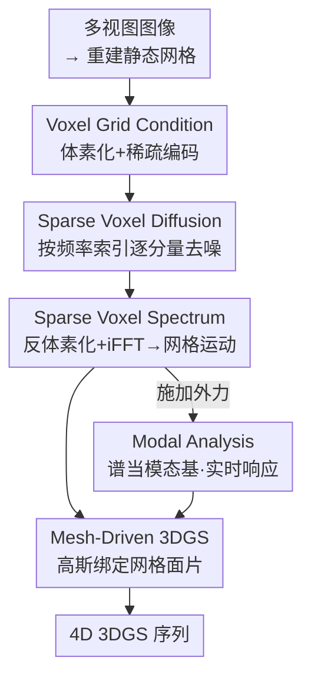

# DynamicTree: Interactive Real Tree Animation via Sparse Voxel Spectrum

**会议**: CVPR 2026  
**论文**: [CVF Open Access](https://openaccess.thecvf.com/content/CVPR2026/html/Li_DynamicTree_Interactive_Real_Tree_Animation_via_Sparse_Voxel_Spectrum_CVPR_2026_paper.html)  
**代码**: 项目主页 https://dynamictree-dev.github.io/DynamicTree.github.io/ （代码待确认）  
**领域**: 3D视觉  
**关键词**: 树木动画, 3D高斯泼溅, 稀疏体素谱, 模态分析, 4D生成  

## 一句话总结
把真实扫描的 3DGS 树的运动压缩成一组"稀疏体素 + 频域谱"，用前馈扩散一次性生成长时网格运动再驱动高斯，既避免了 4D 生成方法的时空不一致、又比 MPM 物理仿真快百倍，还能用这套谱当模态基做约 18ms/帧的实时拖拽交互。

## 研究背景与动机

**领域现状**：把静态重建（NeRF / 3DGS）变成可动、可交互的场景，是 VR / 游戏 / 世界模拟的刚需。树作为自然景观的核心元素，会随风摇摆、被拖拽时回弹，对沉浸感影响很大。给 3DGS 树做动画目前有两条路：一是 **4D 生成**（4DGen、SV4D 等），用视频扩散模型（VDM）的 2D 运动先验去优化 4D 表示；二是 **物理仿真**（PhysGaussian、PhysFlow 等），把 3DGS 耦合进 MPM 物质点法求解器。

**现有痛点**：4D 生成依赖 2D 先验，生成的运动往往时空不一致、细结构出现伪影，树这种枝叶繁多的复杂结构尤其容易"崩"，而且每个场景都要重新优化、很慢。物理仿真这边，MPM 求解为了好调参常假设整棵树材质均匀，导致全局动得协调、但枝叶级的局部弹性细节被压平；更要命的是计算极贵（PhysFlow 约 15600 ms/帧），实时根本无望。传统树动画方法（Windy-Tree 等）则只能跑人工搭好的合成树模型，迁不到真实扫描树上。

**核心矛盾**：一棵重建出来的 3DGS 树通常有几十万个高斯，直接逐高斯、逐帧预测长时运动，在显存和训练数据上都不可承受；同时训练数据是合成树、测试目标是真实扫描树，二者之间有 synthetic-to-real gap。要"又快又一致又能交互"，就必须先有一个**既紧凑又对扫描噪声鲁棒**的 3D 运动表示。

**核心 idea**：用**稀疏体素谱（sparse voxel spectrum）**表示树的运动——先把网格运动按体素聚合（一个体素内所有顶点共享位移）压掉空间冗余，再沿时间做 FFT、只保留前 K 个低频分量压掉时间冗余；然后训练一个前馈的稀疏体素扩散模型直接生成这套谱。这套谱不仅能重建长时网格运动，还能当作**模态基**用于外力下的实时模态分析交互。

## 方法详解

### 整体框架

给定一棵静态树的多视图图像，目标是输出一段形变后的 3DGS 序列 $G=\{G^t\}_{t=0}^{T}$，即预测每个高斯随时间的位置/旋转/尺度增量 $D_g$。作者把它建模成**条件生成**而非逐场景优化，并拆成两阶段流水线：

1. **频域里生成网格运动**：从多视图重建网格 → 体素化得到稀疏体素栅格作为条件 → 稀疏体素扩散模型逐频率分量生成稀疏体素谱 $S$ → 反体素化 + 逆 FFT 还原出稠密网格运动 $D_m$；
2. **把运动迁移到 3DGS**：把高斯基元绑定到网格面片上，网格一动，绑定其上的高斯随之形变，得到 $D_g$。

此外，生成出来的谱可以直接复用为模态基，配合模态分析在外力（如拖拽）下做实时响应，不需要重新跑求解器。

### 关键设计

**1. 稀疏体素谱表示：用「空间体素 + 时间频域」双重压缩长时运动**

这是全文的命门，针对的就是"几十万高斯、逐帧预测扛不住"的痛点。作者分两层压缩。空间上，观察到树的运动有空间稀疏性（同一片叶子/同一段枝条上的顶点运动相似），于是把网格运动 $D_m\in\mathbb{R}^{3\times N}$ 聚合到稀疏体素 $D_v\in\mathbb{R}^{3\times n}$，**一个体素内所有顶点共享同一位移**，$n$ 通常比顶点数 $N$ 小一个数量级；相比 [57] 那种全局只用 20 个稀疏运动基的做法，体素粒度保留了枝叶级细节。时间上，受 Generative-Dynamics 启发，把每个体素的运动沿时间做 FFT 得到复频域表示 $\hat{D}_v\in\mathbb{C}^{3\times n\times T}$；树这种准周期运动主要由前 $K$ 个低频分量决定，因此只保留 $\hat{D}^{(K)}_v\in\mathbb{C}^{3\times n\times K}$（$K=16$）就能近乎无损地重建整段运动。最终的谱表示写成 $S=\{s_i\in\mathbb{R}^{6\times n}\mid i=1,...,K\}$，这里维度 6 对应 $x,y,z$ 三个方向的实部与虚部。网格运动通过下式还原：

$$D_m = \text{Dev}(\text{iFFT}(S))$$

其中 iFFT 是沿时间维的逆 FFT，$\text{Dev}(\cdot)$ 是把稀疏体素位移播回稠密网格顶点的反体素化。这个表示一举三得：压掉空间+时间冗余、把不规则网格采样统一成规整体素结构（缓解 synthetic-to-real gap）、还天然适配后面的模态分析。

**2. 体素栅格条件 + 稀疏体素扩散：从零训一个前馈生成器**

有了紧凑表示，第二步是怎么生成它。为缩小合成→真实的域差，作者不直接拿图像当条件，而是先用现成方法 [18] 从多视图重建网格 $M=(V,F)$，再体素化成稀疏体素栅格 $G$ 作为条件输入；体素化把"真实顶点更吵、合成顶点更干净"的差异在一定程度上抹平。由于没有可借用的预训练基座，扩散模型基于 XCube 的稀疏 U-Net **从头训练**：先用若干稀疏卷积块把 $G$ 编码成几何条件 $g\in\mathbb{R}^{d\times n}$；生成时**逐频率分量**地去噪——把频率索引和 $g$ 同时作为条件，每个频率分量单独生成。具体地，去噪从纯高斯噪声出发、迭代 $L$ 步，每步把 $g$ 与含噪 latent $s_l$ 拼接，并通过 scale/shift 把频率嵌入注入到 U-Net 的每个 ResBlock。这样模型一次前馈就能吐出整套谱，相比逐场景优化的 4D 生成快了百倍以上。

**3. 局部谱平滑损失 + 两阶段训练：把"物理合理"约束进频域**

只用扩散损失 $L_{DM}$（公式 2，标准的噪声预测 $\|\epsilon-\epsilon_\theta(s_l;l,g,f)\|^2$）会出问题：任务欠约束，某些枝条的运动会发散、出现几何飞散。作者借用 Sorkine & Alexa 的物理先验（相邻点倾向于一起动），提出 **Local Spectrum Smoothness (LSS) 损失**，直接在频域上惩罚邻域点谱参数的差异，并按空间距离加权：

$$L_{\text{LSS}} = \frac{1}{N}\sum_{i=1}^{N}\sum_{j\in\mathcal{N}(i)} e^{-\alpha d_{ij}}\left(\|\text{Re}_i-\text{Re}_j\| + \lambda\|\text{Im}_i-\text{Im}_j\|\right)$$

其中 $\mathcal{N}(i)$ 是 $i$ 的 $\kappa$ 近邻，$d_{ij}$ 是欧氏距离，$\lambda$ 控制虚部权重。但一上来就把 $L_{DM}$ 和 $L_{LSS}$ 一起训会不稳定，于是采用**两阶段训练**：先只用 $L_{DM}$ 训一段（论文里前 40000 步），再引入 $L_{LSS}$ 继续精修（再训 30000 步）。消融显示这个"先放后收"的顺序对消除飞散、提升泛化至关重要——直接联合训只能缓解、不能根除。

**4. 网格绑定 3DGS + 模态分析交互：一套谱同时干"生成"和"实时交互"两件事**

生成出谱之后要落到高斯上。先反体素化（同一体素内顶点赋同一谱）+ 逆 FFT 得到时域网格运动 $D_m$，再按 GaMeS 的做法把高斯**重参数化绑定到网格面片**：对每个三角面 $f_j=\{v_1,v_2,v_3\}$，用三个顶点位置参数化其上高斯的均值 $\mu=\alpha_1 V_1+\alpha_2 V_2+\alpha_3 V_3$、旋转 $r$ 与尺度 $s$（$\alpha$ 可学）。网格一形变，绑定的高斯就跟着动，于是 $D_g$ 直接由 $D_m$ 算出。更妙的是交互：把整棵树的网格顶点建模成质量-弹簧-阻尼系统，运动方程 $M\ddot{d}+C\dot{d}+Kd=f(t)$ 投影到模态空间后解耦成 $|P|$ 个独立的二阶方程 $m_i\ddot{q}_i+c_i\dot{q}_i+k_iq_i=f_i$，用显式欧拉积分求解，再叠加模态形状重建物理空间响应：

$$D(t)=\sum_{k=1}^{K}\phi_k\cdot q^k(t)$$

关键在于——**第 3 节算出来的网格运动谱可以直接当作模态形状 $\phi$**（已有工作证明粒子运动轨迹的谱可视为模态基），所以外力交互不必另起炉灶，复用同一套谱即可。整套交互约 18ms/帧（模态分析 13ms + 高斯形变 2.57ms + 渲染 2.65ms），相比 MPM 求解动辄上千毫秒，做到了真正实时。

### 损失函数 / 训练策略
- 主损失：扩散噪声预测 $L_{DM}$（公式 2）+ 局部谱平滑 $L_{LSS}$（公式 3，$\alpha=\lambda=0.5$，5 近邻）。
- 两阶段：前 40000 步只用 $L_{DM}$，后 30000 步加入 $L_{LSS}$。
- 配置：8× RTX 4090 训 3.5 天，batch 48；谱分辨率 $128^3$，编码器输入分辨率 $512^3$，条件维度 $d=128$；每面绑 5 个高斯；AdamW，初始 lr $1\times10^{-4}$、每 20000 步减半；推理用 DDIM 100 步。

## 实验关键数据

测试集为 13 棵真实扫描树。指标用 CLIP ViT-B/32 算 CLIP-I（每帧 vs 输入视图，衡量真实感）和 CLIP-T（相邻帧间，衡量时序连贯），均越低越好；另做双盲用户研究，从运动真实性 MA、运动复杂度 MC、3D 结构一致性 SC、视觉质量 VQ 四维让用户选最佳（可多选）。

### 主实验

3D 动画对比（上半）+ 交互仿真对比（下半）：

| 任务 | 方法 | CLIP-I↓ | CLIP-T↓ | Overall(用户)↑ | 仿真时间(ms/帧) |
|------|------|---------|---------|----------------|------------------|
| 3D动画 | 4DGen | 0.0103 | 0.0094 | 1.7% | - |
| 3D动画 | SV4D 2.0 | 0.0081 | 0.0057 | 3.7% | - |
| 3D动画 | **Ours** | **0.0052** | **0.0021** | **94.6%** | - |
| 交互仿真 | PhysGaussian | 0.0061 | 0.0087 | 20.2% | 1,800 |
| 交互仿真 | PhysFlow | 0.0047 | 0.0025 | 31.9% | 15,600 |
| 交互仿真 | **Ours** | **0.0038** | **0.0017** | **47.9%** | **18.22** |

3D 动画上全面碾压两个 4D 生成基线（用户研究 Overall 94.6% vs ≤3.7%）；交互仿真上 CLIP 指标最优，速度比 PhysGaussian 快约 100×、比 PhysFlow 快约 850×。注意交互的用户研究里 SC（结构一致性）这维本文 29.8% 略低于 PhysGaussian 的 36.2%（见局限），但 VQ 65.9% 大幅领先。

与传统树动画方法（Weber [58]，用其干净 3D 模型而非扫描树以示公平）的对比：

| 方法 | MA↑ | MC↑ | SC↑ | VQ↑ | Overall↑ |
|------|-----|-----|-----|-----|----------|
| Weber [58] | 48.57% | 37.14% | 45.71% | 34.29% | 42.14% |
| **Ours** | **51.43%** | **62.86%** | **54.29%** | **65.71%** | **57.86%** |

即便对方用干净输入，本文在运动复杂度和视觉质量上仍明显更优，且本文能直接处理带扫描误差的真实树而无需大量人工预处理。

### 消融实验

谱分辨率消融（8× RTX 4090，随分辨率升高减小 batch）：

| 分辨率 | Batch | 训练时长 | CLIP-I↓ |
|--------|-------|----------|---------|
| $32^3$ | 192 | 27h | 0.0097 |
| $64^3$ | 96 | 43h | 0.0069 |
| $128^3$ | 48 | 85h | **0.0039** |
| $256^3$ | 24 | 156h | 0.0037 |
| $512^3$ | 12 | 261h | 0.0056 |

CLIP-I 随分辨率先降后升：超过 128 后提升变得边际，而训练成本继续暴涨；$512^3$ 反而变差。作者解释这正是 synthetic-to-real gap 的体现——分辨率过高时体素栅格接近点云，而真实网格顶点比合成的更吵，域差被放大；$128^3$ 让一个体素内的多个噪声点共享同一运动，相当于空间平滑，反而帮着桥接域差。故选 $128^3$。

### 关键发现
- **训练策略影响最大**：只用 $L_{DM}$ 会几何飞散/发散，联合训只能缓解，唯有"先 $L_{DM}$ 后 $L_{LSS}$"的两阶段策略才能根除并显著提升泛化（图 5）。
- **分辨率不是越高越好**：$128^3$ 是性能/成本/域差三者的甜点，$512^3$ 因过度接近点云、放大真实顶点噪声而退化——一个很反直觉但被实验印证的发现。
- **速度优势来自范式而非工程**：交互 18ms/帧主要靠"谱即模态基"复用，省掉了 MPM 那种逐步物理求解。

## 亮点与洞察
- **一份表示打两份工**：稀疏体素谱既是生成目标、又能直接当模态分析的模态基 $\phi$，于是"生成长时运动"和"外力下实时交互"共用同一套数学对象，省掉了交互侧的重新求解——这是把生成和仿真缝在一起的关键巧思。
- **体素化的双重红利**：既压缩了运动维度，又因"一个体素内噪声点共享运动"天然做了空间平滑，顺手缓解了 synthetic-to-real gap，这一点在分辨率消融里被量化验证，很有说服力。
- **频域低频截断 + 物理先验**：用 16 个低频分量表长时准周期运动、再用 LSS 损失把"邻域一起动"的物理直觉约束进频域，把生成问题的欠约束性拉回来，思路可迁移到其他准周期 4D 内容（旗帜、水草、布料风动等）。

## 局限与展望
- 作者承认：模态分析本质是**全局线性近似**，全局共享振动模式，可能让空间上相距很远的区域出现同步运动（这也解释了交互用户研究里 SC 这维偏低）。
- 网格驱动 3DGS 形变在**大形变区域**偶有伪影，可通过给该区域面片绑更多高斯缓解。
- 数据集 4DTree 主要覆盖摇摆这类常见沉浸式运动，**大尺度形变样本少**；作者计划扩充大形变数据。
- ⚠️ 自己的观察：评测高度依赖 CLIP 距离和用户研究，缺乏与真实物理（如真实风洞/运捕）的客观误差对比；CLIP-I/T 数值都很小（千分位级），不同方法间差距是否在感知意义上显著，值得保留一分谨慎。

## 相关工作与启发
- **vs 4D 生成（4DGen / SV4D 2.0）**：它们用 VDM 的 2D 运动先验逐场景优化 4D，复杂树结构上易时空不一致、出伪影甚至不收敛；本文直接在 3D 空间学运动先验、前馈生成，结构一致性与速度都碾压。
- **vs 物理仿真（PhysGaussian / PhysFlow）**：它们用 MPM 求解、为简化常假设材质均匀，压平枝叶级局部弹性且计算极贵（1800~15600 ms/帧）；本文用谱+模态分析做到 18ms/帧的实时，且枝叶能各自呈现不同弹性运动。
- **vs Generative-Dynamics / ModalNeRF**：本文把"低频谱 + 模态基"的图像/NeRF 思路扩到 **3D 体素**，并配上稀疏体素扩散和 LSS 物理约束，专门解决真实扫描 3D 树的长时运动与交互。
- **vs 传统树动画（Weber / Windy-Tree）**：它们依赖人工搭建的合成物理树、预处理繁重；本文的体素表示对扫描误差更鲁棒，可直接动真实扫描树。

## 评分
- 新颖性: ⭐⭐⭐⭐⭐ 稀疏体素谱"一份表示同时支撑前馈生成与模态交互"是真正的范式级巧思，且首个能动真实扫描 3DGS 树的框架。
- 实验充分度: ⭐⭐⭐⭐ 覆盖 13 棵真实树、对比 4D 生成/物理仿真/传统三类基线 + 分辨率与训练策略消融；略欠客观物理误差指标。
- 写作质量: ⭐⭐⭐⭐ 动机—表示—生成—交互的逻辑链清晰，公式与流程图到位；部分符号（如 $L_D$ vs $L_{DM}$）小有不一致。
- 价值: ⭐⭐⭐⭐⭐ VR/游戏/世界模拟里"可交互真实树"的强需求，百倍加速 + 实时交互 + 配套 8.5k 规模 4DTree 数据集，落地与后续研究价值都高。

<!-- RELATED:START -->

## 相关论文

- [\[CVPR 2026\] MeshWeaver: Sparse-Voxel-Guided Surface Weaving for Autoregressive Mesh Generation](meshweaver_sparse-voxel-guided_surface_weaving_for_autoregressive_mesh_generatio.md)
- [\[CVPR 2026\] VIAFormer: Voxel-Image Alignment Transformer for High-Fidelity Voxel Refinement](viaformer_voxel-image_alignment_transformer_for_high-fidelity_voxel_refinement.md)
- [\[CVPR 2026\] RigMo: Unifying Rig and Motion Learning for Generative Animation](rigmo_unifying_rig_and_motion_learning_for_generative_animation.md)
- [\[CVPR 2026\] Tracking-Guided 4D Generation: Foundation-Tracker Motion Priors for 3D Model Animation](tracking-guided_4d_generation_foundation-tracker_motion_priors_for_3d_model_anim.md)
- [\[CVPR 2026\] Human Geometry Distribution for 3D Animation Generation](human_geometry_distribution_for_3d_animation_generation.md)

<!-- RELATED:END -->
