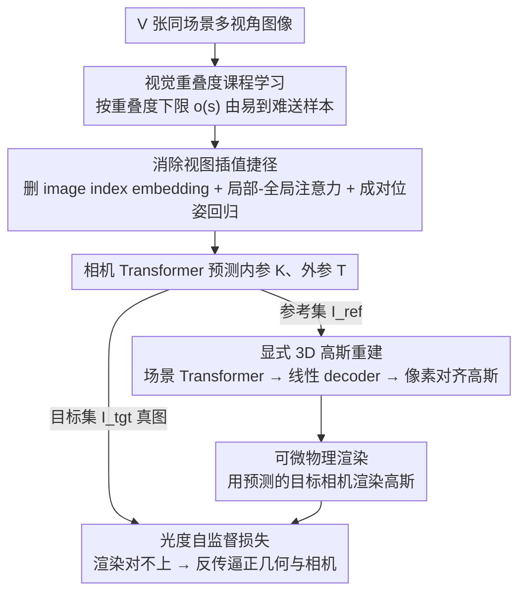

# E-RayZer: Self-supervised 3D Reconstruction as Spatial Visual Pre-training

**会议**: CVPR 2026  
**arXiv**: [2512.10950](https://arxiv.org/abs/2512.10950)  
**代码**: [qitaozhao.github.io/E-RayZer](https://qitaozhao.github.io/E-RayZer)  
**领域**: 3D视觉  
**关键词**: 自监督预训练, 3D高斯泼溅, 多视角重建, 位姿估计, 视觉表征学习

## 一句话总结

E-RayZer是首个真正自监督的前馈式3D高斯重建模型，用显式3D高斯替代RayZer的隐式潜空间场景表示，配合基于视觉重叠度的课程学习策略，在零3D标注条件下学到几何接地的3D感知表征，位姿估计上碾压RayZer（RPA@5°从≈0提升至90.8），下游3D任务frozen-backbone probing大幅领先DINOv3/CroCo v2等主流预训练模型，甚至比肩有监督VGGT。

## 研究背景与动机

自监督预训练在文本、2D图像和视频领域驱动了foundation model的快速进步，但从多视角图像中学习3D感知表征这一方向仍然严重缺失。当前主流3D视觉模型依赖SfM系统（如COLMAP）的伪标签进行全监督训练，本质上低效、不精确且不可扩展。

前驱工作RayZer尝试通过潜空间视角合成实现自监督3D学习，但存在根本性缺陷：其相机估计、隐式场景重建和Transformer渲染三个模块在潜空间中联合学习，缺乏3D归纳偏置，导致模型可以通过视频插值等"捷径"（shortcut solution）获得高质量合成，而其位姿空间既不可解释也不具有物理意义。具体证据是RayZer在位姿估计精度上几乎为零（RPA@5°≈0），说明它并非真正理解3D几何。

核心洞察：3D归纳偏置对于3D表征学习仍然必要，但必须以保持学习可扩展性的方式引入。E-RayZer的方案是用显式3D高斯替代隐式表示，通过物理渲染约束迫使模型必须理解真实3D几何，同时设计fine-grained课程学习策略解决显式3D带来的训练收敛困难。

## 方法详解

### 整体框架

E-RayZer 要解决的是「在零 3D 标注下学到真正理解几何的 3D 表征」。它接收 V 张同一场景的多视角图像，整条 pipeline 的逻辑是：先猜相机、再在参考视角上摆出一组 3D 高斯、最后把这些高斯渲染到目标视角与真实图像对账——渲染对不上，就反过来逼模型把相机和几何都学对。关键在于这里的渲染是物理的，不是学出来的，所以模型没法靠"画得像"蒙混过关。

落到三步：多视角 Transformer $f_\theta^{\text{cam}}$ 先预测所有图像的内参 K 和外参 T；把图像分成参考集 $\mathcal{I}_{\text{ref}}$ 与目标集 $\mathcal{I}_{\text{tgt}}$，从参考视角预测像素对齐的 3D 高斯 $\mathcal{G}$；再用自己预测出的目标视角相机参数把这些高斯渲染出来，与真实目标图像算光度损失。每个训练序列取 10 张图，5 张当参考、5 张当目标，全程不碰任何 3D 标注。

### 关键设计

**1. 显式 3D 高斯重建：用物理可渲染的几何替代 RayZer 的隐式潜空间**

RayZer 把相机、场景、渲染三个模块一股脑丢进潜空间联合训练，整个过程没有任何 3D 归纳偏置，于是模型可以靠视频插值这种捷径合成出漂亮画面，却完全不理解几何。E-RayZer 把场景表示从"隐式潜变量"换成"显式 3D 高斯"：先用场景 Transformer $f_{\psi'}^{\text{scene}}$ 把已带位姿的参考视角编码成跨视角聚合的 latent tokens $\mathbf{s}_{\text{ref}}$，再用一个单层线性 decoder $f_\omega^{\text{gauss}}$ 把每个像素 token 解码成一组高斯参数——射线距离 $d_i$、方向四元数 $\mathbf{q}_i$、球谐系数 $\mathbf{C}_i$、缩放 $\mathbf{s}_i$、透明度 $\alpha_i$。这些高斯像素对齐、可直接走闭式可微渲染（作者改了 gsplat，让梯度能反传到内参 K）。因为渲染是物理过程而非可学习模块，模型想让渲染结果对得上真图，就只能把真实 3D 几何摆对，插值捷径自然失效。顺带还省掉了 RayZer 的 Transformer 渲染器 $f_\phi^{\text{rend}}$，注意力复杂度也从 $\mathcal{O}((K_{\text{ref}}hw + n_z)^2)$ 降到 $\mathcal{O}((K_{\text{ref}}hw)^2)$。

**2. 消除视图插值捷径：堵死模型靠帧序号"作弊"的后门**

光换显式几何还不够——只要模型还能拿到帧序线索，它仍可能退回插值。RayZer 的位姿空间之所以不可解释，根因正是它的 image index embedding 给了模型"这是第几帧"的强提示。E-RayZer 用三招把这条后门焊死：其一，彻底删掉 image index embeddings，这是插值捷径的主因；其二，换成 VGGT 风格的局部-全局交替注意力 Transformer，局部注意力的边界天然界定了"图像—相机"的归属，不必再靠序号；其三，位姿改用成对回归，把 canonical view 与 target view 的相机 token 拼接起来直接回归相对位姿，于是也不用再区分各种 camera / register token。没了帧序号，模型拿不到任何"时间顺序"线索，只能老老实实从几何推相机，位姿空间也因此从不可解释变成物理可解释。

**3. 基于视觉重叠度的课程学习：用统一的难度尺度让显式 3D 训得起来，也对齐异构数据源**

显式 3D 从头训练很容易不收敛——直接硬训近乎崩溃，RPA@5° 只有 2.1%；而 RayZer 用固定帧间隔当难度近似又太粗，同样的帧间隔在不同序列里对应的视觉重叠可能天差地别，也没法自适应到来源各异的数据集。E-RayZer 改用"视觉重叠度"做统一难度尺度：给每个训练序列预计算一条重叠度剖面 $O_u(\Delta t)$（均匀采样帧三元组、取平均成对重叠度），训练时把重叠度下限按进度 $s$ 线性衰减，

$$o(s) = s \cdot o_{\min} + (1-s) \cdot o_{\max}$$

从高重叠的易样本逐步过渡到低重叠的难样本。重叠度有两种算法——语义重叠（DINOv2 余弦相似度，纯无监督）和几何重叠（UFM 共视性，需 3D 标注），实验里两者几乎打平。视觉重叠是个跨数据源都通用的难度量，比帧间隔精确得多，也能自动适配不同分布；先易后难给了显式 3D 优化一个稳定的起点。而语义重叠能和几何重叠平手，说明连这一步课程都不必依赖 3D 标注。

### 损失函数 / 训练策略

- **光度自监督损失**：$\mathcal{L} = \sum \text{MSE}(I, \hat{I}) + \lambda \cdot \text{Percep}(I, \hat{I})$，Percep为感知损失
- **架构参数**：patch size 16，图像分辨率256，相机和场景Transformer各8层（每层1个global attention + 1个frame attention），特征维度768，12个注意力头
- **训练设置**：8×A100 GPU，全局batch 192（每卡24），共152K迭代（约198小时）
- **学习率**：3K步线性预热至4e-4，余弦衰退至0
- **课程推进**：前86K步线性推进，几何重叠从1.0→0.5，语义重叠从1.0→0.75
- **优化器**：AdamW（β₁=0.9, β₂=0.95），梯度裁剪1.0，梯度范数>5.0时跳过该步
- **7数据集混合采样比**：DL3DV 1.0, CO3Dv2 0.25, RE10K 0.5, MVImgNet 0.25, ARKitScenes 0.5, WildRGB-D 0.25, ACID 0.5

## 实验关键数据

### 主实验：位姿估计与新视角合成（Tab.1）

与自监督/半监督方法对比。E-RayZer和RayZer为完全自监督从头训练，SPFSplat以有监督MASt3R初始化。

| 方法 | 训练数据 | WildRGB-D PSNR↑ | WildRGB-D @5°↑ | WildRGB-D @15°↑ | DL3DV @5°↑ | DL3DV @15°↑ |
|------|---------|-----------------|----------------|-----------------|------------|-------------|
| SPFSplat | RE10K+extra | 16.7 | 31.5 | 58.0 | 19.5 | 40.6 |
| E-RayZer | RE10K | 21.0 | 40.3 | 89.4 | 21.2 | 55.0 |
| RayZer | DL3DV | 25.9 | 0.0 | 0.2 | 0.0 | 0.6 |
| E-RayZer | DL3DV | 24.3 | 84.5 | 98.4 | 72.0 | 88.4 |
| RayZer | 7数据集 | 26.7 | 0.2 | 9.3 | 0.0 | 1.9 |
| **E-RayZer** | **7数据集** | **24.9** | **90.8** | **98.6** | **59.9** | **82.9** |

E-RayZer在位姿估计上碾压RayZer（从≈0%提升到60-90%），同时NVS质量接近（PSNR略低2dB，因为RayZer过拟合于插值而非真3D）。

### 与有监督VGGT对比（Tab.2，DL3DV训练）

| 方法 | 监督 | DL3DV @5° | RE10K @5° | WildRGB-D @5° | BlendedMVS @5° | NAVI @5° | ScanNet++ @5° |
|------|------|-----------|-----------|---------------|----------------|----------|---------------|
| E-RayZer | 自监督 | 72.0 | 83.0 | 51.1 | 22.9 | 20.7 | 7.7 |
| VGGT* | 有监督 | 79.6 | 80.4 | 32.5 | 17.0 | 14.3 | 6.7 |
| VGGT*+E-RayZer init | 有监督 | **87.3** | **85.3** | **56.2** | **29.2** | **26.9** | **14.3** |

自监督E-RayZer在多个OOD数据集上超越有监督VGGT*（尤其是RPA@5°严格指标），且E-RayZer初始化的VGGT*全面最优。

### 下游任务Probing（Tab.3，Frozen-backbone）

| 预训练方法 | ScanNet++ AbsRel↓ | ScanNet++ δ<1.25↑ | ScanNet++ @5°↑ | BlendedMVS AbsRel↓ | BlendedMVS @5°↑ |
|-----------|-------------------|-------------------|----------------|---------------------|-----------------|
| DINOv2 | 0.193 | 74.9 | 0.8 | 0.366 | 1.1 |
| DINOv3 | 0.201 | 73.2 | 0.4 | 0.397 | 1.2 |
| CroCo v2 | 0.203 | 73.0 | 1.4 | 0.412 | 1.6 |
| VideoMAE V2 | 0.175 | 76.3 | 0.1 | 0.371 | 1.0 |
| RayZer | 0.161 | 79.3 | 4.7 | 0.351 | 16.7 |
| **E-RayZer** | **0.116** | **87.1** | **13.8** | **0.245** | **26.5** |

E-RayZer在frozen-backbone设置下大幅领先所有基线，深度估计AbsRel比DINOv2低40%（0.116 vs 0.193），位姿@5°高17倍（13.8 vs 0.8），证明其特征确实具有强3D空间感知能力。

### 消融实验：课程学习策略（Tab.6，7数据集）

| 课程策略 | PSNR↑ | RPA@5°↑ | RPA@15°↑ | RPA@30°↑ |
|---------|-------|---------|----------|----------|
| 无课程 | 15.9 | 2.1 | 21.6 | 40.7 |
| 帧间隔课程 | 19.1 | 43.8 | 72.1 | 82.9 |
| 语义重叠课程 | 19.7 | 58.7 | 81.0 | 89.8 |
| 几何重叠课程 | 19.7 | 59.9 | 82.9 | 90.2 |

无课程训练近乎崩溃（RPA@5°仅2.1%），帧间隔课程有效但精度不足，视觉重叠课程在所有指标上显著最优。两种重叠度变体表现接近，说明无监督的语义重叠即可替代需要3D标注的几何重叠。

### 关键发现

- **自监督与有监督互补**：E-RayZer初始化VGGT*后性能全面提升（Tab.2最后一行），说明二者学到的知识高度互补，即使在同一数据上训练
- **数据多样性 > 数据量**：DL3DV（高质量）单独训练优于RE10K，7数据集混合训练泛化最佳；object-centric数据集需降采样比
- **显式3D的代价**：NVS质量略低于RayZer（PSNR低≈2dB），但这恰好说明RayZer过拟合于视频插值而非真3D理解
- **Flow任务上略弱于RayZer**：Tab.4显示E-RayZer在pairwise flow估计上EPE 1.254 vs RayZer 1.105，隐式表示对低层运动估计有天然优势

## 亮点与洞察

- 从"自监督视角合成"到"自监督3D重建"是一个范式转变，显式几何约束消除了捷径解，使位姿空间从不可解释变为几何接地
- 课程学习策略设计精巧：用视觉重叠度作为跨数据源的统一难度度量，自动适配异构数据分布，比手工指定帧间隔优雅且可扩展
- 自监督E-RayZer在严格指标（RPA@5°）上超越部分有监督模型，说明大规模自监督本身就能产生几何接地的3D理解——数据多样性和质量才是可扩展性的真正驱动力
- gsplat修改支持对内参K的梯度反传是一个关键工程贡献，使得整个pipeline端到端可微

## 局限与展望

- 仅支持静态场景，限制了可用训练数据规模——扩展到动态场景以利用通用视频是最重要的未来方向
- 课程策略假设连续视频帧有较均匀的相机运动，对稀疏图像或剧烈视角变化可能效果下降
- NVS质量略低于隐式方法RayZer，在需要高质量渲染的场景中可能不如
- 目前仅验证了ViT-Base规模，更大模型的scaling behavior有待探索

## 相关工作与启发

- **vs VGGT**（有监督3D）：E-RayZer证明自监督在几何理解上可与有监督比肩，且两种范式互补——自监督预训练+有监督微调可能是最优策略
- **vs DINOv3/CroCo v2**（2D预训练）：frozen-backbone probing差距巨大，说明2D视觉特征缺乏真正的3D空间感知能力
- **vs SPFSplat**（半监督3DGS）：即使SPFSplat使用MASt3R初始化（14数据集有监督），E-RayZer仍全面超越，证明了从头自监督学习的潜力
- 显式3D + 物理渲染作为自监督信号的框架具有通用性，可推广到其他3D感知任务

## 评分

- 新颖性: ⭐⭐⭐⭐⭐ 首个真正自监督的前馈3D高斯重建，从隐式到显式的范式突破
- 实验充分度: ⭐⭐⭐⭐⭐ 9个评测数据集、多任务（NVS/位姿/深度/光流）、消融全面、含与VGGT公平对比和scaling分析
- 写作质量: ⭐⭐⭐⭐ 逻辑清晰，motivation从RayZer缺陷自然引出，课程学习的动机图效果好
- 价值: ⭐⭐⭐⭐⭐ 建立了3D视觉自监督预训练新范式，自监督预训练+有监督微调的互补性具有重大启示

<!-- RELATED:START -->

## 相关论文

- [\[ECCV 2024\] Formula-Supervised Visual-Geometric Pre-training (FSVGP)](../../ECCV2024/3d_vision/formula-supervised_visual-geometric_pre-training.md)
- [\[CVPR 2026\] From None to All: Self-Supervised 3D Reconstruction via Novel View Synthesis](from_none_to_all_self-supervised_3d_reconstruction_via_novel_view_synthesis.md)
- [\[CVPR 2026\] ULF-Loc: Unbiased Landmark Feature for Robust Visual Localization with 3D Gaussian Splatting](ulf-loc_unbiased_landmark_feature_for_robust_visual_localization_with_3d_gaussia.md)
- [\[CVPR 2026\] 3D sans 3D Scans: Scalable Pre-training from Video-Generated Point Clouds](3d_sans_3d_scans_scalable_pre-training_from_video-generated_point_clouds.md)
- [\[CVPR 2026\] Regularizing INR with Diffusion Prior for Self-Supervised 3D Reconstruction of Neutron Computed Tomography Data](regularizing_inr_with_diffusion_prior_self-supervised_3d_reconstruction_of_neutr.md)

<!-- RELATED:END -->
