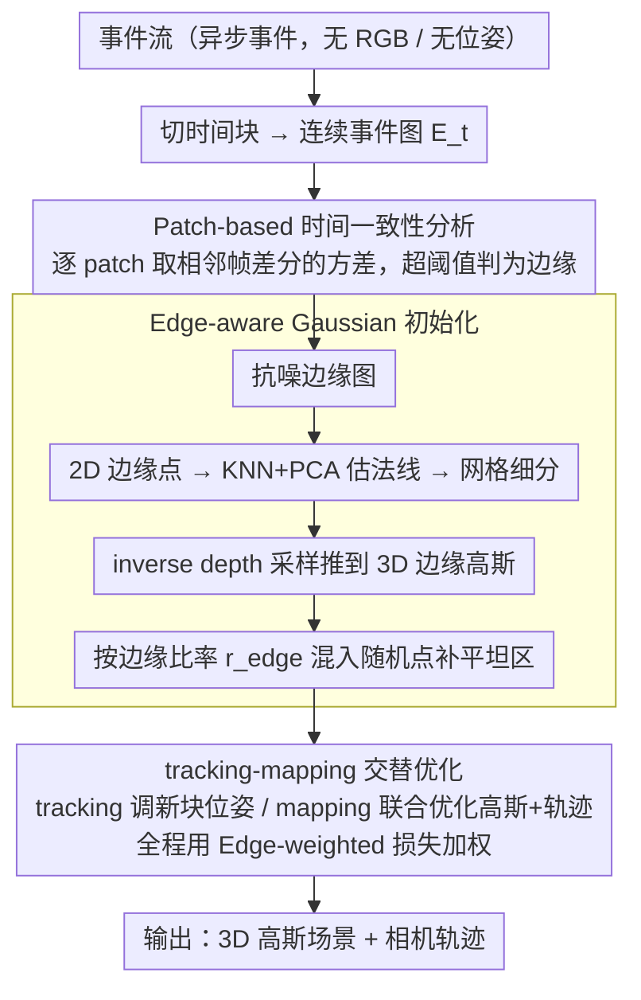

# E2EGS: Event-to-Edge Gaussian Splatting for Pose-Free 3D Reconstruction

**会议**: CVPR 2026  
**arXiv**: [2603.14684](https://arxiv.org/abs/2603.14684)  
**代码**: 待确认  
**领域**: 3D视觉  
**关键词**: 事件相机, 3D高斯溅射, 边缘检测, 无位姿重建, 视觉里程计

## 一句话总结

提出 E2EGS，一个完全基于事件流的无位姿 3D 重建框架：通过 patch-based 时间一致性分析从事件流中提取抗噪边缘图，利用边缘信息指导高斯初始化和加权损失优化，在无需深度模型或 RGB 输入的情况下实现了高质量的轨迹估计和 3D 重建。

## 研究背景与动机

NeRF 和 3D Gaussian Splatting (3DGS) 推动了新视角合成的巨大进步，但它们本质上依赖高质量 RGB 图像和精确相机位姿。在快速运动或光照恶劣的真实场景中，RGB 图像质量退化严重，限制了这些方法的鲁棒性。

**事件相机的优势**：事件相机以异步方式捕捉像素级亮度变化，具有极高的时间分辨率和宽动态范围，天然适合处理运动模糊和极端光照。更重要的是，事件相机在边缘和纹理边界处产生密集响应，为场景几何提供了丰富的结构信息。

**现有方法的局限**：

**需要已知位姿的方法**（EventSplat, Ev-GS, Event3DGS 等）：依赖 SfM 或 GT 位姿，在位姿不可用的场景中无法使用

**IncEventGS**（当前唯一的 pose-free 方法）：采用 SLAM 框架联合优化位姿和 3D 高斯，但严重依赖预训练深度估计模型 Marigold 做初始化。**核心问题**：深度模型从初始帧估计，当相机移动到初始覆盖范围之外的新区域时，深度估计退化→轨迹漂移→重建质量崩溃

**核心矛盾**：pose-free event-based 3D 重建需要可靠的几何先验来引导优化，但现有方法要么依赖外部深度模型（泛化性差），要么完全随机初始化（优化容易陷入局部最优）。

**本文切入角度**：事件相机天然编码了边缘信息——相机运动时，边缘区域产生时间一致的密集事件，而非边缘区域只产生稀疏噪声。这种时空特征差异可以用来提取鲁棒的边缘图，为高斯初始化和位姿优化提供几何约束，完全不需要深度模型或 RGB 辅助。

**核心 idea**：用事件流中内蕴的边缘信息替代深度模型，实现完全自主的 pose-free event-based 3D 重建。

## 方法详解

### 整体框架

E2EGS 要解决的是一个纯事件流、无位姿的 3D 重建问题：输入只有事件相机吐出的异步事件流，输出是 3D 高斯场景和一整条相机轨迹，中间不借助任何 RGB 图像和深度模型。它沿用 3DGS 作场景表示、沿用 IncEventGS 的 tracking-mapping 交替优化骨架，把事件流切成时间块、每块绑定一段连续轨迹，监督信号来自最小化测量事件图 $E_t(\mathbf{x})$ 与合成事件图 $\hat{E}_t(\mathbf{x}) = \log \hat{I}_{t+\Delta t}(\mathbf{x}) - \log \hat{I}_t(\mathbf{x})$ 的差异。

真正把它和 IncEventGS 区分开的是一条「边缘」主线，贯穿三步：先从连续事件图里提取一张抗噪边缘图，再沿这些边缘把 3D 高斯撒下去，最后在 tracking 和 bundle adjustment 的全程都按边缘给重建损失加权。原本 IncEventGS 靠深度模型 Marigold 提供的几何先验，在这里被「事件流自带的边缘」整条替换掉。

### 关键设计

**1. Patch-based 时间一致性分析：从噪声事件流里免训练地抠出边缘**

IncEventGS 之所以会在相机走到未见区域时崩溃，根子在于它的几何先验来自一个外部深度模型，而 E2EGS 想要的是一个不依赖任何学习、纯靠事件统计就能算出来的先验。它的观察很物理：相机一动，真实边缘处在连续几帧里都会激发空间上结构一致的密集事件（方差大），而非边缘的平坦区域只有零散随机噪声（方差小）——这个方差差异本身就是一个天然的边缘判别器。具体做法是把 $T$ 帧连续事件图 $\{E_t\}_{t=1}^T$ 切成 $p \times p$ 的重叠 patch，对每个 patch 位置 $P_{x,y}$ 先算相邻帧的时间差分 $D_t(P_{x,y}) = |G_\sigma * E_t(P_{x,y}) - G_\sigma * E_{t-1}(P_{x,y})|$（高斯窗口 $G_\sigma$ 平滑掉过尖的跳变），再取所有相邻帧对里方差的最大值

$$C(P_{x,y}) = \max_{t} \text{Var}\big(D_t(P_{x,y})\big),$$

方差超过阈值 $\tau$ 的 patch 就判为边缘。这个思路脱胎于对比度最大化框架，但绕开了它那一步昂贵的轨迹估计。它还自带一个纠错性质：时间差分会同时吃进前一帧 $E_{t-1}$ 和当前帧 $E_t$，所以一条「估错位置」的边缘会因为和当前观测对不上而在下一步被自然淘汰，不会一直留着拖累优化。

**2. Edge-aware Gaussian 初始化：沿边缘撒点，把深度模型的活儿接过来**

边缘图算好之后，它直接顶替深度模型来决定高斯初始位置。先从边缘图里取出 2D 边缘点集 $\mathcal{P}$，用 KNN + PCA 估出每个点的边缘法线方向，再按法线一致性做递归网格细分，得到一组 2D 边缘高斯 $\mathcal{G}_\text{edge}$；接着沿每个边缘高斯的视线方向，用 inverse depth sampling 把它推到 3D：

$$d = \frac{1}{\tfrac{1}{d_\max} + u\big(\tfrac{1}{d_\min} - \tfrac{1}{d_\max}\big)},\quad u \sim \mathcal{U}(0,1).$$

选 inverse depth 而不是均匀采样是有几何道理的：它在远处放更多采样点，而远处的点在相机旋转时会产生更大的像素位移，对旋转运动更「可观测」，从而帮到位姿估计。光有边缘点还不够覆盖无纹理区域，所以又引入一个边缘比率 $r_\text{edge} \in [0,1]$ 来调配比例——$N_\text{edge} = \lfloor r_\text{edge} \cdot N_\text{total} \rfloor$ 个高斯沿边缘初始化，剩下的 $N_\text{random}$ 个随机撒开补上平坦区域，边缘的几何约束和随机点的覆盖度因此互补。

**3. Edge-weighted 损失函数：让优化盯住信息量最大的边界，别被噪声带偏**

最后这条边缘信息还要管到优化阶段。事件相机在非边缘区域只产生稀疏噪声，如果用逐像素均权的损失，这些噪声事件会和真正的边缘事件等权地参与，喂给优化一堆不可靠的梯度。E2EGS 因此给重建损失按边缘加权

$$\mathcal{L}_\text{edge} = \frac{1}{|\Omega|} \sum_{\mathbf{x} \in \Omega} w(\mathbf{x}) \cdot \|\hat{E}(\mathbf{x}) - E(\mathbf{x})\|^2,\quad w(\mathbf{x}) = 1 + \beta \cdot M(\mathbf{x}),$$

其中 $M(\mathbf{x})$ 是边缘掩码、$\beta$ 控制对边缘的强调程度，再和一项 D-SSIM 结构损失组合成 $\mathcal{L}_\text{total} = (1-\lambda)\,\mathcal{L}_\text{edge} + \lambda\,\mathcal{L}_\text{dssim}$。这相当于一种轻量的注意力：把优化的力气压在几何显著、约束更鲁棒的边界上，即便事件有噪声也不容易退化。这套加权在初始化、tracking、bundle adjustment 三个阶段一路用到底。

### 损失函数 / 训练策略

整个系统在 tracking 和 mapping 之间交替：tracking 阶段冻住高斯参数、只优化新 chunk 的位姿；mapping 阶段在一个滑动窗口内联合优化高斯参数和轨迹。总损失就是上面的 $\mathcal{L}_\text{total}$（边缘加权重建损失 + D-SSIM）。

## 实验关键数据

### 主实验（新视角合成 - Replica 数据集）

| 方法 | 深度依赖 | 位姿依赖 | room0 PSNR↑ | office0 PSNR↑ | office3 PSNR↑ |
|------|---------|---------|-------------|---------------|---------------|
| EvGGS | ✗ | 已知 | 17.57 | 14.34 | 15.51 |
| Event-3DGS* | ✗ | E2VID+COLMAP | 22.27 | 15.97 | 17.82 |
| IncEventGS | Marigold | ✗ | 23.54 | 26.53 | 19.21 |
| IncEventGS† | ✗ | ✗ | 19.81 | 27.72 | 20.04 |
| **E2EGS** | **✗** | **✗** | **23.86** | **28.01** | **20.75** |

### 主实验（轨迹精度 - ATE RMSE cm）

| 方法 | room0 | room2 | office0 | TUM-VIE 1d | TUM-VIE 3d | TUM-VIE 6dof |
|------|-------|-------|---------|-----------|-----------|-------------|
| DEVO | 0.271 | 0.381 | 0.287 | 0.23 | 1.00 | 1.82 |
| IncEventGS | 0.051 | 0.071 | 0.085 | 2.19 | 1.62 | 0.70 |
| IncEventGS† | 6.817 | 0.446 | 0.698 | 2.58 | 4.48 | 8.24 |
| **E2EGS** | **0.049** | **0.065** | **0.078** | **1.12** | **0.65** | **0.58** |

关键对比：IncEventGS† 在 TUM-VIE desk2 上 ATE 高达 96.59cm（灾难性失败），E2EGS 仅 0.40cm。

### 消融实验

| 配置 | Edge loss | Edge init | Depth init | ATE (cm) |
|------|-----------|-----------|------------|----------|
| IncEventGS | ✗ | ✗ | ✓ | 0.37 |
| IncEventGS† | ✗ | ✗ | ✗ | 6.62 |
| w/ Edge loss only | ✓ | ✗ | ✗ | 0.50 |
| w/ Edge init only | ✗ | ✓ | ✗ | 0.29 |
| **E2EGS (full)** | **✓** | **✓** | **✗** | **0.28** |

Edge ratio $r_\text{edge}$ 消融：$r_\text{edge} = 0.0$ → ATE 5.68cm；$r_\text{edge} \in [0.1, 0.3]$ → ATE ~0.40cm（最优）；$r_\text{edge} = 1.0$ → ATE 11.93cm（过度强调边缘导致表面覆盖不足）。

### 关键发现

- **Edge init 贡献 > Edge loss**：单独加 edge init 已将 ATE 从 6.62 降到 0.29，优于 depth-based 的 0.37；单独加 edge loss 降到 0.50。两者结合最优（0.28）
- **长序列鲁棒性**：随序列长度增加，IncEventGS（依赖深度）的 ATE 急剧上升（深度越来越不可靠），E2EGS 保持稳定低误差（边缘是局部特征，不受序列长度影响）
- **无深度 vs 有深度**：E2EGS 在不用任何深度模型的情况下，合成数据上超越 IncEventGS（有深度），真实数据上大幅超越
- **边缘比例需平衡**：过低（0.0）缺几何约束导致漂移，过高（0.7-1.0）覆盖不足导致非边缘区域损失主导误优化

## 亮点与洞察

- **Training-free 边缘检测**设计巧妙：不用任何学习就从事件流的时空统计特性中提取边缘，利用的是事件相机最本质的物理特性（运动+边缘→一致事件），简洁且有效
- **完全摆脱深度模型**是一个重要的范式转变：IncEventGS 的 depth model 在 unseen 区域退化是根本性缺陷，E2EGS 用边缘替代深度作为几何先验，不受观测范围限制
- **Inverse depth sampling** 的几何直觉值得借鉴：远处点对旋转更敏感→在远处多采样→提升旋转估计的可观测性。这个 insight 可迁移到其他需要深度初始化的 SLAM 系统
- **边缘加权损失**本质上是一种注意力机制：让优化聚焦于信息量最丰富的像素，而非被噪声像素的梯度淹没

## 局限与展望

- 边缘提取策略偏保守（prioritize reliability over completeness），在弱几何结构区域（如大面积无纹理墙面）可能提取不到足够边缘
- 事件相机在无纹理平面区域天然产生稀疏响应，限制了这些区域的高斯质量（作者承认）
- 边缘比例 $r_\text{edge}$ 需手动调参，自适应方案值得探索
- 仅在室内数据集上验证，户外大规模场景（如自动驾驶）的表现未知
- 没有与最新的学习式事件视觉里程计方法（如 RAMP-VO 融合事件+图像）做端到端对比

## 相关工作与启发

- **vs IncEventGS**：同为 pose-free event-based 3DGS，但 IncEventGS 依赖 Marigold 深度模型初始化，长序列/新区域退化严重；E2EGS 用边缘替代深度，根本上解决了泛化问题
- **vs DEVO**：DEVO 是学习式事件视觉里程计，轨迹精度好但不做 3D 重建；E2EGS 统一了轨迹估计和场景重建
- **vs 对比度最大化（CMax-SLAM）**：CMax 通过最大化 warped 事件图的锐度估计运动，计算昂贵；E2EGS 直接从时间一致性提取边缘，更高效
- 启示：事件相机的物理特性本身蕴含了丰富的几何线索，不必依赖预训练视觉模型，回归传感器本质可能是更鲁棒的路径

## 评分

- **新颖性**: ⭐⭐⭐⭐ 用边缘替代深度模型做 event-based 3DGS 的几何先验，idea 清晰有效
- **实验充分度**: ⭐⭐⭐⭐ 合成+真实数据集、组件消融、参数消融完整，但缺乏户外大场景评估
- **写作质量**: ⭐⭐⭐⭐ 问题动机讲得清楚，方法描述条理分明，图表设计直观
- **价值**: ⭐⭐⭐⭐ 首次实现完全无外部依赖的 pose-free event-based 3D 重建，拓展了事件相机应用的自主性边界

<!-- RELATED:START -->

## 相关论文

- [\[CVPR 2025\] IncEventGS: Pose-Free Gaussian Splatting from a Single Event Camera](../../CVPR2025/3d_vision/inceventgs_pose-free_gaussian_splatting_from_a_single_event_camera.md)
- [\[CVPR 2025\] SelfSplat: Pose-Free and 3D Prior-Free Generalizable 3D Gaussian Splatting](../../CVPR2025/3d_vision/selfsplat_pose-free_and_3d_prior-free_generalizable_3d_gaussian_splatting.md)
- [\[CVPR 2026\] Global-Aware Edge Prioritization for Pose Graph Initialization](global-aware_edge_prioritization_for_pose_graph_initialization.md)
- [\[NeurIPS 2025\] OnlineSplatter: Pose-Free Online 3D Reconstruction for Free-Moving Objects](../../NeurIPS2025/3d_vision/onlinesplatter_pose-free_online_3d_reconstruction_for_free-moving_objects.md)
- [\[CVPR 2026\] InstantHDR: Single-forward Gaussian Splatting for High Dynamic Range 3D Reconstruction](instanthdr_singleforward_gaussian_splatting_for_hi.md)

<!-- RELATED:END -->
