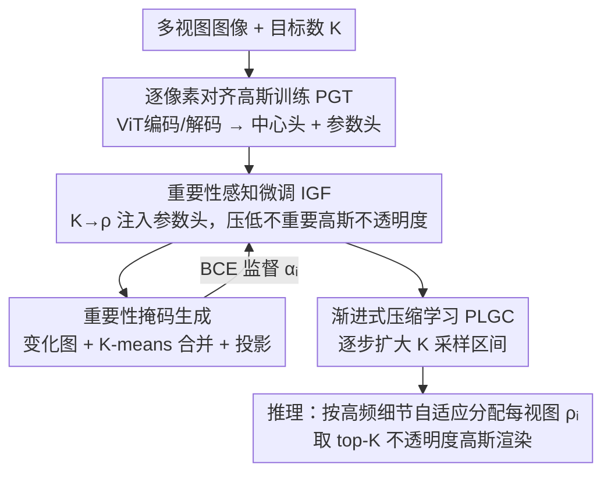

# EcoSplat: Efficiency-controllable Feed-forward 3D Gaussian Splatting from Multi-view Images

**会议**: CVPR 2026  
**论文**: [CVF Open Access](https://openaccess.thecvf.com/content/CVPR2026/html/Bui_EcoSplat_Efficiency-controllable_Feed-forward_3D_Gaussian_Splatting_from_Multi-view_Images_CVPR_2026_paper.html)  
**代码**: [项目页](https://kaist-viclab.github.io/ecosplat-site/)（代码待发布）  
**领域**: 3D视觉  
**关键词**: 前馈式3DGS, 新视角合成, 高斯数量可控, 重要性排序, 多视图重建  

## 一句话总结
EcoSplat 是首个"数量可控"的前馈式 3D 高斯泼溅框架：推理时给定任意目标基元数 K，它就能一次前馈地从多视图图像里挑出最重要的 K 个高斯来渲染，在 RE10K 24 视图、压到 5% 基元的极端约束下仍拿到 24.7 PSNR，远超只能靠阈值剪枝的现有前馈方法。

## 研究背景与动机
**领域现状**：前馈式 3DGS（PixelSplat、MVSplat、DepthSplat、NoPoSplat、SPFSplat 等）的主流做法是"逐像素对齐"——把每张输入图的每个像素反投影成一个 3D 高斯，再把所有视图的高斯并起来表示场景。这样一次前馈就能重建，省掉了原始 3DGS 那种逐场景几分钟到几小时的优化。

**现有痛点**：逐像素对齐意味着基元总数随输入视图数和图像分辨率**线性增长**。密集视图（如 24 视图、256×256）下动辄上百万个高斯，对手机、AR/VR 头显这类端侧设备很不友好。更关键的是，这些方法**对输出高斯数量没有任何显式控制**——你没法说"我只要 5 万个高斯"。

**核心矛盾**：实际部署里，重建在服务器端做一次，渲染要分发给一堆算力/带宽各异的端侧设备，因此"按需控制基元数"是刚需。但现有省内存方案（AnySplat 的可微体素化、GGN 的图聚合、Zpressor 的关键帧聚类、Long-LRM 的不透明度剪枝）都是**基于阈值**的——体素大小、相似度阈值、不透明度阈值，这些超参对场景敏感，剪出来的基元数**因场景而异、不稳定**，导致延迟/显存/带宽都不可预测，质量-效率权衡很差。

**本文目标**：让一个前馈模型在推理时**精确满足任意给定的目标基元数 K**，同时在这个预算下把渲染质量做到最优。

**切入角度**：与其事后剪枝，不如让模型**在训练时就学会"按预算排序高斯重要性"**——把 K 作为条件信号注入，让模型主动压低不重要高斯的不透明度，这样推理时直接保留不透明度最高的 K 个（top-K）即可。

**核心 idea**：用"以目标数 K 为条件、训练模型学会重要性感知的不透明度抑制"代替"事后阈值剪枝"，从而实现前馈、可控、稳定的高斯压缩。

## 方法详解

### 整体框架
给定一个场景的 N 张多视图图像 $\{I_i\}_{i=1}^N$ 和目标高斯数 $K$，EcoSplat 要前馈地输出一组 $K$ 个 3D 高斯基元 $G=\{G_k\}_{k=1}^K$，使渲染质量最大化。做法是**逐视图地给高斯排序、选出最有信息量的子集**，让被选基元总数恰好满足 $K$。

整条管线分两阶段训练 + 一套推理流程。**第一阶段 PGT** 先训出一个标准的逐像素对齐前馈 3DGS（ViT 编码器 → 多视图 ViT 解码器跨视图聚合 → 高斯中心头 $F_\mu$ + 高斯参数头 $F_\nu$），保证基础重建可靠。**第二阶段 IGF** 冻结编码器/解码器和中心头 $F_\mu$，只微调参数头 $F_\nu$：把 $K$ 换算成保留比例 $\rho_i=K/(NHW)$，编码成重要性嵌入注入 $F_\nu$，再用一个"重要性掩码"当 pseudo-GT、配重要性感知不透明度损失 $L_\text{io}$，逼模型压低不重要高斯的不透明度。为了让模型对**一大段** $K$ 都稳健，训练用 PLGC 策略逐步扩大 $K$ 的采样范围。推理时按各视图细节量自适应分配每视图基元数，最后取 top-K 不透明度的高斯渲染。

### 关键设计

**1. 重要性感知微调 IGF：把目标数 K 变成可学的"压缩条件"**

这是 EcoSplat 区别于一切阈值剪枝的核心。痛点是：逐像素对齐高斯数量固定且无法按预算缩放，事后剪枝又会因为"每个高斯绑死一个像素"而剪出空洞。IGF 的做法是把目标基元数 $K$ 折算成保留比例 $\rho_i=\frac{K}{NHW}$，广播成 $H\times W$ 张量后过一层浅 CNN，得到可学的重要性嵌入 $R_i\in\mathbb{R}^{H\times W\times C}$，注入参数头 $F_\nu$ 的中间特征，让它输出**随 $K$ 自适应调整**的高斯参数：

$$\{[\tilde\alpha_{i,j};\tilde\Sigma_{i,j};\tilde c_{i,j}]\}_{j=1}^{HW}=F_\nu\big(\{Z_i^{(\ell)}\}_{\ell=1}^m,\ \psi(I_i),\ R_i\big)$$

其中 $\psi(I_i)$ 是浅 CNN 提的低层特征。监督来自重要性感知不透明度损失 $L_\text{io}$：用 BCE 让预测不透明度 $\tilde\alpha_{i,j}$ 去拟合一张重要性掩码 $\Omega_i$，
$$L_\text{io}=\lambda_\text{io}\cdot\frac{1}{NHW}\sum_{i=1}^N\sum_{j=1}^{HW}L_\text{BCE}(\Omega_{i,j},\ \tilde\alpha_{i,j})$$
同时只用不透明度 top-K 的高斯做可微渲染算 $L_{K\text{-render}}$（MSE + 0.05·LPIPS），总损失 $L=L_\text{io}+L_{K\text{-render}}$。这样训练完，模型把"哪些高斯重要"直接编码进了不透明度，推理时取 top-K 即可，不需要任何场景相关的阈值。注意 IGF 里编码器/解码器和中心头 $F_\mu$ 全部冻结——几何中心已经由 PGT 学好，IGF 只负责学"重要性 + 参数微调"。消融里去掉 IGF 直接在 5% 预算下暴跌 18 dB，是全文掉点最狠的一项。

**2. 重要性掩码生成：用"图像复杂度 + 几何复杂度"造伪标签**

$L_\text{io}$ 需要一张 pseudo-GT 掩码 $\Omega_i$ 来定义"哪些高斯该留"，本设计就是无监督地构造它，分三步。① **二值变化图**：在每个像素同时度量光度复杂度和几何复杂度——光度变化 $g_{\text{photo},i}=\sqrt{\|\nabla_x I_i\|_2^2+\|\nabla_y I_i\|_2^2}$（图像梯度幅值），几何变化 $g_{\text{geo},i}$ 用预测深度算法线图 $n_i$ 后再取其梯度幅值；两者取平均得 $g_i$，再按分位数阈值 $\epsilon_i=Q_{\rho_i}(\{g_{i,j}\})$ 二值化成 $g'_i$（高变化像素=1）。② **重要高斯收集**：高变化像素对应的高斯 $\mathcal G_i^\text{high}$ 全保留以保细节；低变化集 $\mathcal G_i^\text{low}$ 则把图像切 $4\times4$ patch、取每块左上像素的高斯当聚类中心，做**单步 K-means** 合并冗余得到紧凑集 $\mathcal G_i^c$，最终 $\mathcal G_i^\Omega=\mathcal G_i^\text{high}\cup\mathcal G_i^c$。③ **投影**：把 $\mathcal G_i^\Omega$ 里所有高斯的 3D 中心投影回第 $i$ 张图像平面，被命中的像素置 1，得到二值掩码 $\Omega_i$。这套伪标签巧在它把"细节区保独立高斯、平坦区合并"的直觉量化成了可监督的目标，且分位数阈值直接挂钩当前的 $\rho_i$，使掩码自动随预算松紧。

**3. 渐进式高斯压缩学习 PLGC：让模型对一整段 K 都稳健**

如果训练时直接在整个范围里随机采 $K$，作者发现训练会不稳定。PLGC 改成**逐步扩大采样区间** $[K_\text{min},K_\text{max}]$：上界固定 $K_\text{max}=0.95\cdot NHW$，下界从 $0.85\cdot NHW$ 按训练迭代退火到 $0.05\cdot NHW$，
$$K_\text{min}=\max\big(0.85-\lambda_\text{decay}\lfloor t/S\rfloor,\ 0.05\big)\cdot NHW$$
每步从 $[K_\text{min},K_\text{max}]$ 里随机采 $K$。直观上模型先学温和压缩、再逐渐适应激进压缩（5% 这种极端预算），既保证训练稳定又覆盖宽广的 $K$ 区间。消融显示去掉 PLGC 在 5% 下掉到 21.49 PSNR（满配 24.72），优化不稳、参数调整失效、输出扭曲。

**4. 推理期按视图细节量自适应分配基元**

训练时所有视图共用同一个 $\rho_i$，但推理时不同视图的信息量差很多：细节多的视图该多分高斯。本设计据此**按视图重要性重新分配** $\rho_i$。先量化每张图的细节量：仿 MoBGS 定义高频得分 $\eta_i$——对 $I_i$ 做 2D DFT 并中心化得 $\tilde{\mathcal F}(I_i)$，$\eta_i=1-\frac{\sum_{\xi\in\Lambda}E_i(\xi)}{\sum_\xi E_i(\xi)}$（$\Lambda$ 是中心低频方形区，$E_i=|\tilde{\mathcal F}(I_i)|$），即高频能量占比。再用带温度 $T$ 的 softmax 放大视图间差异得视图重要性因子 $\kappa_i=N\cdot\Psi_i,\ \Psi_i=\frac{e^{\eta_i/T}}{\sum_q e^{\eta_q/T}}$，最后令 $\rho_i=\kappa_i\rho$（$\rho=K/(NHW)$）。由于 $\kappa_i$ 经 softmax 归一并乘了 $N$，所有视图 $\rho_i$ 的平均恰好等于 $\rho$，**总数仍精确满足 K**，只是把预算往细节多的视图倾斜，换取更高的整体质量。

### 损失函数 / 训练策略
- **PGT 阶段**：渲染损失 $L_\text{render}=\frac{1}{N^\text{tgt}}\sum_p L_\text{MSE}+0.05\cdot L_\text{LPIPS}$，用全部逐像素高斯渲染目标视图。
- **IGF 阶段**：$L=L_\text{io}+L_{K\text{-render}}$，其中 $L_{K\text{-render}}$ 只用 top-K 高斯渲染；冻结编码器/解码器与中心头 $F_\mu$，仅微调参数头 $F_\nu$。
- 训练数据 RE10K（约 1000 万帧），256×256，沿用 NoPoSplat 评测协议。

## 实验关键数据

### 主实验
在 RE10K 24 输入视图、把基元压到总数（$NHW$）的 5%/10%/40%/70% 下对比（PSNR↑/SSIM↑/LPIPS↓）：

| 方法 | 5% PSNR | 5% LPIPS | 10% PSNR | 40% PSNR | 70% PSNR |
|------|---------|----------|----------|----------|----------|
| AnySplat（体素化） | 8.08 | 0.593 | 10.37 | 19.66 | 21.85 |
| WorldMirror（体素化） | 8.09 | 0.632 | 10.20 | 19.66 | 22.11 |
| SPFSplat + LightGaussian 剪枝 | 7.44 | 0.624 | 8.23 | 11.77 | 15.32 |
| GGN（图聚合，<15% 无法配置） | N/A | N/A | N/A | 15.86 | 15.71 |
| **EcoSplat（本文）** | **24.72** | **0.183** | **25.00** | **25.11** | **25.00** |

差异极其悬殊：体素类方法在 40% 就有伪影、5%/10% 直接崩溃（PSNR 仅 8 左右），逐像素方法 + 事后剪枝因为"剪一个高斯=戳一个空洞"也崩。EcoSplat 在 5%→70% 全程几乎平稳（24.7~25.1），证明显式数量控制的鲁棒性。

多视图设置（16/20/24 视图，对比基元数 #GS）：

| 方法 | 24 视图 PSNR | 24 视图 LPIPS | #GS |
|------|--------------|---------------|-----|
| MVSplat | 14.86 | 0.440 | 1573K |
| DepthSplat | 19.18 | 0.286 | 1573K |
| NoPoSplat | 20.70 | 0.252 | 1573K |
| SPFSplat | 24.74 | 0.145 | 1573K |
| GGN | 15.80 | 0.408 | 512K |
| AnySplat | 21.90 | 0.173 | 1259K |
| WorldMirror | 22.16 | 0.193 | 1020K |
| **Ours 5%** | 24.72 | 0.183 | **78K** |
| **Ours 40%** | **25.11** | 0.164 | 629K |

关键对比：相比最紧凑的 GGN（512K），EcoSplat 5% 只用 78K（约 1/7）却 PSNR 高 +9 dB、LPIPS 低 2 倍多；相比 AnySplat/WorldMirror，质量高 2.5–3.5 dB 且基元少 10 倍以上。跨数据集（RE10K 训→ACID 测，24 视图）Ours40% 拿 24.02 PSNR / 629K，仅比 SPFSplat 低 0.38 dB 但基元只用其 40%。

### 消融实验
RE10K 24 视图：

| 配置 | 5% PSNR | 5% LPIPS | 40% PSNR | 说明 |
|------|---------|----------|----------|------|
| w/o PGT | 22.93 | 0.221 | 23.70 | 跳过第一阶段，5% 掉 ~1.8 dB、有伪影 |
| w/o IGF | 6.45 | 0.651 | 14.02 | 去掉重要性微调，退化成普通逐像素法，暴跌 18 dB |
| w/o $L_\text{io}$ | 20.58 | 0.289 | 23.81 | top-K 分配失当，几何欠重建 |
| w/o PLGC | 21.49 | 0.280 | 23.84 | 训练不稳、输出扭曲 |
| **Full** | **24.72** | **0.183** | **25.11** | 完整模型 |

### 关键发现
- **IGF 是命脉**：去掉后 5% 预算暴跌 18+ dB，说明"按 K 学重要性"才是数量可控的关键，纯逐像素+剪枝走不通。
- **$L_\text{io}$ 与 PLGC 在激进压缩（5%）下尤为重要**：两者各掉 ~3–4 dB，温和压缩（40%）下影响小很多——它们主要保证"极端预算"的稳健。
- **不透明度分布可视化**：$K$=70% 时保留大量高不透明度高斯，$K$=5% 时绝大多数被压向低不透明度区，只剩一小撮结构/光度最关键的子集维持高不透明度，直观印证模型学到了鲁棒的重要性排序。

## 亮点与洞察
- **把"事后剪枝"翻译成"训练期学排序"**：核心洞察是逐像素高斯的"高斯绑死像素"特性让事后剪枝必然戳洞，而把 K 注入训练、用不透明度承载重要性，就能让 top-K 选择天然无洞——这个"用不透明度当可学排序信号"的思路可迁移到任何需要按预算压缩的显式表示。
- **伪标签的造法很省事**：重要性掩码完全用图像梯度 + 法线梯度 + K-means 无监督造出，不需要额外标注或预训练显著性模型，且分位数阈值直接挂钩预算 $\rho_i$，自动随松紧伸缩。
- **推理期 DFT 高频分配**：用频域高频能量占比 + softmax 把固定预算往细节多的视图倾斜，且数学上保证总数仍精确等于 K，是个轻量又优雅的"质量再分配"trick。

## 局限与展望
- **跨域略逊像素对齐 SOTA**：ACID 上 Ours40% 比 SPFSplat 低 0.38 dB（虽只用 40% 基元），说明在追求绝对画质而非预算受限时，压缩仍有代价。
- ⚠️ **依赖 PGT 学好的几何**：IGF 冻结中心头 $F_\mu$，若第一阶段几何（深度/法线）不准，重要性掩码里的几何变化项也会偏，可能误判重要区域——论文未单独分析这一耦合。
- **超参仍存在**：PLGC 的退火率 $\lambda_\text{decay}$、衰减间隔 $S$、softmax 温度 $T$、低频方形区边长 $s$ 等需要调，虽不像体素大小那样直接决定基元数，但对训练稳定性和分配质量有影响。
- **改进方向**：可探索让中心头也参与 IGF 的轻量自适应，或把重要性排序从"逐视图 top-K"升级为"跨视图全局预算分配"，进一步压低冗余。

## 相关工作与启发
- **vs AnySplat / WorldMirror（可微体素化）**: 它们靠体素大小聚合高斯，体素尺寸是敏感超参、剪出的基元数因场景而异且 5%/10% 直接崩；EcoSplat 用 K 条件 + 不透明度排序做到精确数量控制，极端预算下质量高 16 dB 以上。
- **vs GGN（图聚合剪枝）**: GGN 用图建模视图间高斯关系再池化剪枝，但鲁棒性不足、且无法配置 <15% 的基元数；EcoSplat 能一路压到 5% 且基元少 7 倍、PSNR 高 9 dB。
- **vs LightGaussian / PUP 3D-GS（逐场景剪枝）**: 它们对优化好的逐场景 3DGS 剪枝效果尚可，但套到逐像素前馈高斯上会因"高斯绑像素"戳出空洞而崩——凸显前馈场景需要专门设计的可控压缩，而非搬用逐场景剪枝。
- **vs SPFSplat / MVSplat / NoPoSplat（逐像素前馈）**: 这些是 EcoSplat 的基座类方法，质量高但基元数固定不可控（24 视图固定 1573K）；EcoSplat 在它们之上加可控压缩，用 5%~40% 基元逼近甚至超过其质量。

## 评分
- 新颖性: ⭐⭐⭐⭐⭐ 首个数量可控的前馈式 3DGS，把"事后剪枝"重构为"训练期学重要性排序"，问题设定和解法都新。
- 实验充分度: ⭐⭐⭐⭐ 覆盖多预算/多视图/跨域 + 4 项消融，但 FPS、显存等效率数字放在补充材料，正文偏渲染质量。
- 写作质量: ⭐⭐⭐⭐ 两阶段 + 三步掩码 + 推理分配讲得清晰，公式完整；部分符号（如 $\kappa_i$ 与 $\rho$ 的耦合）需细读图表才好理解。
- 价值: ⭐⭐⭐⭐⭐ 直击端侧/流式部署的真实痛点，可控基元数对带宽/显存受限设备很实用，思路也易迁移到其他显式表示压缩。

<!-- RELATED:START -->

## 相关论文

- [\[CVPR 2026\] Cross-View Splatter: Feed-Forward View Synthesis with Georeferenced Images](cross-view_splatter_feed-forward_view_synthesis_with_georeferenced_images.md)
- [\[CVPR 2026\] Z-Order Transformer for Feed-Forward Gaussian Splatting](z-order_transformer_for_feed-forward_gaussian_splatting.md)
- [\[CVPR 2026\] AnchorSplat: Feed-Forward 3D Gaussian Splatting with 3D Geometric Priors](anchorsplat_feed-forward_3d_gaussian_splatting_with_3d_geometric_priors.md)
- [\[CVPR 2026\] BRepGaussian: CAD Reconstruction from Multi-View Images with Gaussian Splatting](brepgaussian_cad_reconstruction_from_multi-view_images_with_gaussian_splatting.md)
- [\[CVPR 2026\] Reliev3R: Relieving Feed-forward 3D Reconstruction from Multi-View Geometric Annotations](reliev3r_relieving_feed-forward_3d_reconstruction_from_multi-view_geometric_annot.md)

<!-- RELATED:END -->
