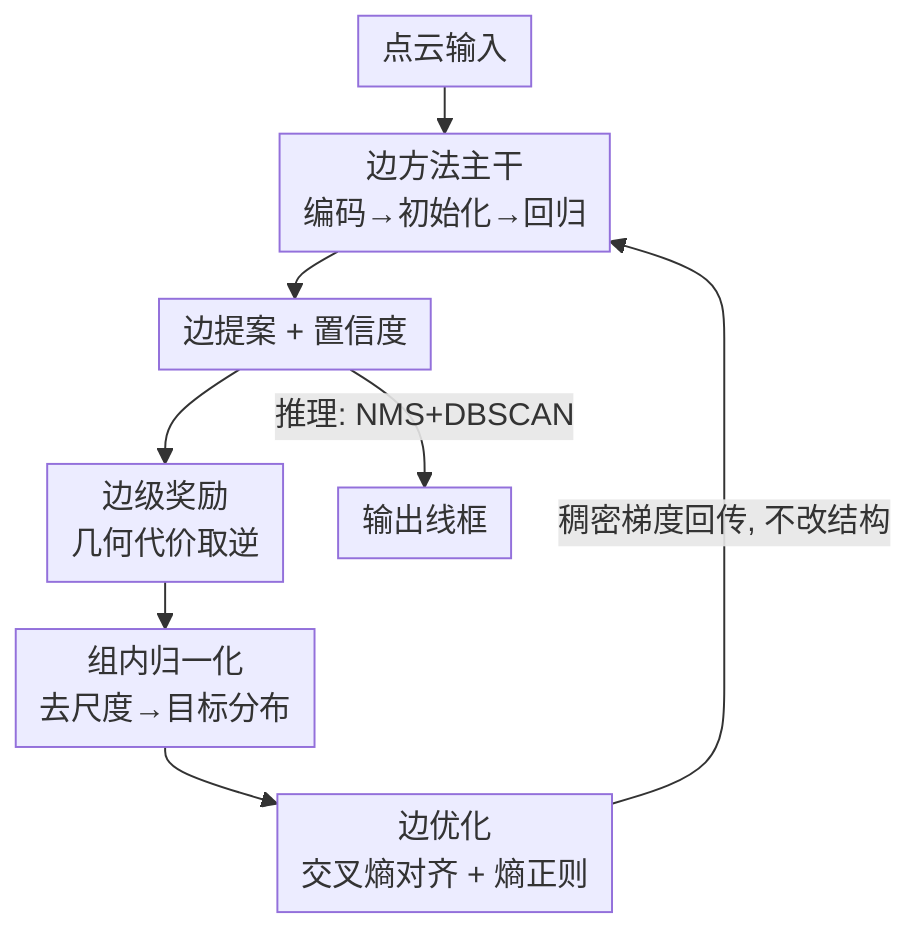

# Edges Compete for Trust: Group Relative Edge Optimization for Building Reconstruction from Point Clouds

**会议**: CVPR 2026  
**论文**: [CVF Open Access](https://openaccess.thecvf.com/content/CVPR2026/html/Liu_Edges_Compete_for_Trust_Group_Relative_Edge_Optimization_for_Building_CVPR_2026_paper.html)  
**代码**: 无（论文未公开）  
**领域**: 3D视觉  
**关键词**: 建筑线框重建, 点云, 群组相对优化, 稠密监督, 强化学习式训练  

## 一句话总结
针对边方法靠匈牙利一对一匹配只给少数边梯度、绝大多数边提案"无人管"的问题，本文把 GRPO 的"组内相对优势"思想搬到线框重建里，提出 GREO：给每条边按几何对齐质量算一个连续奖励、组内归一化后转成目标置信度分布，用交叉熵 + 熵正则对所有边做稠密判别式监督，作为即插即用训练策略让 PBWR / EdgeDiff 在 Building3D 上刷到 SOTA 且推理零开销。

## 研究背景与动机
**领域现状**：建筑线框重建要从点云里抽出由顶点和边组成的紧凑 3D 线框（wireframe），相比网格、点云、隐式场，线框在存储效率、几何可解释性、显式拓扑上都有优势，还能直接转成 CAD 供智慧城市 / 自动驾驶 / AR-VR 使用。主流分两派：顶点派（先定位关键顶点再推连边，对顶点定位误差极敏感）和边派（直接从可学习 embedding 回归参数化边集，绕开显式顶点检测，代表作 PBWR、EdgeDiff，是当前更强的范式）。

**现有痛点**：边派训练时网络会生成大量边提案，再用匈牙利算法和真值建立**一对一**对应，只对匹配上的边算几何/置信度损失。这带来本质上的**稀疏监督**——只有少数被匹配的边收到有效梯度，绝大多数未匹配提案被一刀切当成负样本、梯度近乎为零，长期处于"欠优化"状态。

**核心矛盾**：稀疏监督有两个致命问题。其一，大部分边提案训练全程没被好好优化；其二，监督完全无视未匹配边之间的几何差异——有的边其实已经很接近真值、有的离得很远，却挨同样的惩罚。传统监督只在乎"绝对对错"，不在乎"相对质量好坏"，学习效率被严重削弱。

**切入角度**：作者注意到强化学习里的 GRPO——它对每个 query 采样多个候选输出，用组内奖励分布算优势函数，靠"组内相对比较"产生稠密且有判别力的信号。边重建天生也是"多候选"任务（一次生成几十上百条边提案），和 GRPO 处理的多候选优化范式高度契合。

**核心 idea**：把"组内相对优势"搬进线框重建——不再只让匈牙利匹配把梯度喂给少数边，而是给**每一条**边按几何对齐质量算奖励、组内归一化成目标置信度分布，让所有边"为置信度而竞争"，高质量边置信度被抬高、低质量边被压低，从而把稀疏监督变成稠密判别式监督。注意线框重建是确定性结构化预测，不像生成式语言模型，所以不能照搬 GRPO 的策略梯度，需要重新设计成一个监督式对齐目标。

## 方法详解

### 整体框架
GREO 不改动任何网络结构，是挂在现有边方法训练流程下面的一个**即插即用监督模块**。上半部分是标准边重建 pipeline：点云经特征编码器编码 → 初始化固定数量的边实体（edge entity）→ 经 Transformer 解码器与点特征做 cross-attention 回归出边参数（中点、方向、长度）和置信度 → 得到一批边提案 → 推理时用置信度 NMS + DBSCAN 聚类合并邻近端点输出线框。原始训练只对匈牙利匹配上的边算损失（稀疏监督）。

GREO 接在"边提案"和"真值线框"之间，**仅训练时生效、推理零开销**：它对每条边提案算几何代价 → 转成连续的边级奖励 → 组内归一化去掉尺度差异 → softmax 成目标置信度分布 → 用交叉熵把网络预测的置信度往这个目标分布对齐，再加熵正则防止置信度坍缩。整套 GREO 损失和原 baseline 损失联合优化。

### 关键设计

**1. 边级奖励：用几何对齐质量给每条边发一个连续分**

痛点是匈牙利匹配只承认"一对一"的胜者、其余边全判死刑且不分好坏。GREO 反其道而行，给**每一条**预测边 $e_i$ 都算一个奖励，奖励高低由它和真值边的几何对齐质量决定，且是"可验证"的——直接由几何一致性算出来，不需要额外标注或奖励模型。具体先定义预测边 $e_i$ 与真值边 $g_j$ 的复合匹配代价：

$$C_{i,j} = \lambda_1 H_d(e_i, g_j) + \lambda_2\big(1 - \cos(e_i, g_j)\big) + \lambda_3\, d_{\text{center}}(e_i, g_j)$$

三项分别管位置、方向、中心：$H_d$ 是 Hausdorff 距离衡量位置偏差，$1-\cos$ 项衡量朝向失配，$d_{\text{center}}$ 是两边中点的 L1 距离做轻量几何一致性代理（权重 $\lambda_1{=}2.0,\lambda_2{=}1.0,\lambda_3{=}1.0$）。然后对每条预测边取它对所有真值边的**最小代价**作为最佳几何匹配，奖励就是代价的"逆"：

$$\gamma_i = \min_j C_{i,j}, \qquad r_i = 1 - \gamma_i$$

这样越贴近真值的边奖励越高，奖励同时编码了位置接近度、朝向一致性和尺度一致性。关键在于它给了**所有**边一个有区分度的标量，而不是非黑即白的正负标签。

**2. 组内归一化 + 目标分布：把绝对奖励变成"组内相对排名"**

原始奖励 $r_i$ 因为尺度、几何、噪声差异而方差很大，直接用会让优化不稳。借鉴 GRPO 的组归一化思想，GREO 在**每个样本内部**（一栋建筑的所有边提案构成一组）对奖励做标准化：

$$z_i = \frac{r_i - \mu_r}{\sigma_r + \epsilon}$$

其中 $\mu_r,\sigma_r$ 是该样本内所有边奖励的均值和标准差。这一步是 GREO 的灵魂——把优化目标从"绝对奖励"切换到"相对奖励"，每条边只需要超过它所在组的相对基线就能获得正向信号，从而天然产生稠密、判别式的梯度。归一化后再用带温度 $\kappa$ 的 softmax 转成目标置信度分布：

$$q_i = \operatorname{softmax}(\kappa z_i)$$

$\kappa$（默认 3.0）控制分布锐度，越大越突出高奖励边。$q_i$ 表达的是"组内每条边理应有多高置信度"的相对排名，把匹配式训练的稀疏性彻底化解。

**3. 边优化 + 熵正则：交叉熵对齐分布，再防止置信度坍缩**

有了目标分布 $q_i$，怎么把它灌给网络？GREO 把网络预测的置信度 $\pi_i$（经 softmax 归一化）和目标分布做**交叉熵最小化**：

$$\mathcal{L}_{\mathrm{CE}} = -\sum_i q_i \log \pi_i$$

它强制预测置信度的"分布级排名"和几何质量一致——几何准的边置信度被抬、不可靠的被压。相比一对一二分图监督，它提供更密的梯度和更平滑的优化。但只有交叉熵会有个副作用：训练早期容易让置信度过度集中（over-confidence / 坍缩到少数边）。所以再加一个熵正则项保持分布"探索性"：

$$\mathcal{L}_{\mathrm{entropy}} = \eta \sum_i \pi_i \log \pi_i$$

$\eta$（默认 0.01）做平衡，缓解早期置信度极化、维持探索多样性。最终 GREO 目标是两者之和，并和 baseline 原损失联合优化：

$$\mathcal{L}_{\mathrm{GREO}} = \mathcal{L}_{\mathrm{CE}} + \mathcal{L}_{\mathrm{entropy}}$$

⚠️ 熵正则项写成 $\eta\sum_i \pi_i \log \pi_i$（即 $-\eta H(\pi)$ 形式），符号细节以原文公式 (10) 为准；作者意图是用它阻止置信度过度集中、维持优化稳定。

### 损失函数 / 训练策略
GREO 完全不引入新参数、不改网络结构，仅在训练阶段附加 $\mathcal{L}_{\mathrm{GREO}}$，与原 baseline（PBWR / EdgeDiff）的几何 + 置信度损失联合优化；与两者集成时直接沿用它们的默认训练配置。单张 NVIDIA A6000、PyTorch 实现。超参：$\kappa{=}3.0$、$\eta{=}0.01$、奖励权重 $\lambda_1{=}2.0,\lambda_2{=}\lambda_3{=}1.0$。推理阶段 GREO 不参与，因此零额外开销。

## 实验关键数据

### 主实验
数据集为大规模真实线框重建基准 Building3D，含 Entry-Level（5,698 训练 / 583 测试，几何较简单）与 Tallinn（32,618 训练 / 3,472 测试，复杂城市场景）两个子集。评测用 8 个指标：WED（线框编辑距离，↓）、ACO（平均角点偏移，↓）、角点/边的精度召回 F1（CP/CR/CF1、EP/ER/EF1，↑）。GREO 挂到 PBWR 和 EdgeDiff 两个边方法上验证即插即用效果。

| 子集 | 方法 | WED ↓ | CF1 ↑ | EP ↑ | ER ↑ | EF1 ↑ |
|------|------|-------|-------|------|------|------|
| Entry | EdgeDiff (CVPR25) | 0.115 | 0.91 | 0.95 | 0.82 | 0.88 |
| Entry | **EdgeDiff+GREO** | **0.108** | **0.93** | 0.95 | **0.85** | **0.89** |
| Tallinn | PBWR (CVPR24) | 0.271 | 0.80 | 0.91 | 0.65 | 0.76 |
| Tallinn | **PBWR+GREO** | **0.250** | **0.83** | **0.92** | **0.69** | **0.78** |
| Tallinn | EdgeDiff (CVPR25) | 0.255 | 0.84 | 0.92 | 0.70 | 0.79 |
| Tallinn | **EdgeDiff+GREO** | **0.225** | **0.86** | 0.92 | **0.75** | **0.82** |

Entry-Level 因几何简单，提升较温和（EdgeDiff WED 0.115→0.108）；复杂的 Tallinn 上增益显著：PBWR+GREO 角点/边召回各 +4%、F1 分别 +3% / +2%；EdgeDiff+GREO 召回 +2% / +5%、F1 +2% / +3%。相比顶点派 BWFormer（Tallinn WED 0.238），EdgeDiff+GREO 拿到更低的 WED 0.225 和更优的边精度/召回/F1（BWFormer 仅靠显式顶点检测在 CF1 上略高，但边一致性才是重建保真度的关键指标）。

### 消融实验
在 Tallinn 子集上拆解 GREO 两个组件，以及奖励里三个几何项（基于 EdgeDiff）：

| 配置 | WED ↓ | CR ↑ | CF1 ↑ | ER ↑ | EF1 ↑ |
|------|-------|------|-------|------|------|
| EdgeDiff baseline | 0.255 | 0.74 | 0.84 | 0.70 | 0.79 |
| + $\mathcal{L}_{\mathrm{CE}}$（奖励监督） | 0.242 | 0.75 | 0.85 | 0.73 | 0.81 |
| + $\mathcal{L}_{\mathrm{CE}}$ + $\mathcal{L}_{\mathrm{entropy}}$（完整 GREO） | **0.225** | 0.76 | 0.86 | 0.75 | 0.82 |

| Hausdorff | Cosine | Center | WED ↓ | ER ↑ | EF1 ↑ |
|:--:|:--:|:--:|------|------|------|
| - | - | - | 0.255 | 0.70 | 0.79 |
| ✓ | - | - | 0.247 | 0.71 | 0.80 |
| - | ✓ | - | 0.243 | 0.73 | 0.81 |
| - | - | ✓ | 0.246 | 0.73 | 0.81 |
| ✓ | ✓ | - | 0.237 | 0.74 | 0.82 |
| ✓ | ✓ | ✓ | **0.225** | **0.75** | 0.82 |

### 关键发现
- **奖励监督单独就有效**：只加 $\mathcal{L}_{\mathrm{CE}}$（把几何度量转成组归一化奖励）就让 WED 从 0.255 降到 0.242，说明组内相对排名确实给所有边提供了有判别力的稠密监督，缓解了一对一匹配的稀疏性。
- **熵正则进一步稳训练**：再加 $\mathcal{L}_{\mathrm{entropy}}$ 把 WED 推到 0.225，主要靠防止置信度极化、提升召回；两者缺一不可。
- **三个几何项互补**：Hausdorff 管粗定位但缺方向/尺度感知，cosine 和 center 各自带来朝向与空间接近度增益，Hausdorff+cosine 有协同效应，三项全开效果最好（WED 0.225）。
- **复杂场景收益更大**：Tallinn（复杂城市）比 Entry-Level（简单几何）提升明显得多——稠密监督在"边多、几何多变"时才真正发挥价值。

## 亮点与洞察
- **把 RL 的"组内相对优势"翻译成确定性结构化预测的监督目标**：没有照搬 GRPO 的策略梯度/PPO 框架，而是抽出它的精髓——组内归一化的相对奖励——重塑成一个交叉熵分布对齐目标，这是适配"线框重建是确定性预测"的关键再设计。
- **"让边互相竞争置信度"这个视角很巧**：标题 Edges Compete for Trust 一语中的——稀疏监督的本质问题是"大多数边无人评判"，GREO 用组内归一化把它变成一场所有边参与的相对排名竞赛，高质量边自然胜出。
- **即插即用 + 推理零开销**：纯训练期的损失改造、不动结构不加参数，这种"白拿"的 SOTA 提升在工程上极有吸引力，可直接套到任何生成多候选边提案的边方法上。
- **可迁移性强**：凡是"网络生成大量候选、但只有少数被一对一匹配监督"的结构化预测任务（如检测、CAD 结构生成、其他基于 query 的回归），都能借鉴这套"几何代价→组内相对奖励→分布对齐"的稠密监督范式。

## 局限与展望
- 奖励完全由几何代价（Hausdorff + cosine + center）定义，对几何对齐之外的**拓扑正确性**（连通性、闭合性）没有显式约束——⚠️ 论文未单独评估拓扑层面的失败模式。
- 引入了 $\kappa$、$\eta$、$\lambda_{1,2,3}$ 等多个超参，正文只给默认值、敏感性分析放在补充材料，实际换数据集时调参成本未知。
- 仅在 Building3D（建筑/城市点云）上验证；对其他线框结构（室内 CAD、家具、机械件）是否同样有效未测。
- 熵正则项符号方向（公式 10）从缓存文本看略有歧义，需对照原文 PDF 确认其确为"防止置信度过度集中"的方向。

## 相关工作与启发
- **vs 匈牙利一对一匹配（PBWR / EdgeDiff 原训练）**：它们只给匹配上的少数边有效梯度、其余边一刀切当负样本且不分好坏；GREO 给所有边发连续奖励并做组内相对排名，把稀疏监督变成稠密判别式监督，且作为附加损失与原损失共存、不替换匹配。
- **vs GRPO（语言模型 RL 微调）**：GRPO 是策略梯度、需采样多输出并用 clip + KL 约束更新策略；GREO 面向确定性结构化预测，去掉策略梯度，只保留"组内归一化相对优势"并改写成交叉熵分布对齐，本质是监督式而非强化式更新。
- **vs Visual-RFT 等视觉 GRPO**：Visual-RFT 把 GRPO 用到目标检测、以 IoU 奖励候选框；GREO 是首个把组相对优化用到结构化 3D 线框回归的工作，奖励由 Hausdorff/cosine/center 复合几何代价定义。
- **vs 顶点派（Point2Roof / BWFormer）**：顶点派先检测顶点再连边、对顶点定位误差敏感且易漏边；GREO 所在的边派直接回归边集，配合稠密监督在边一致性（重建保真度关键指标）上更优。

## 评分
- 新颖性: ⭐⭐⭐⭐⭐ 首个把 GRPO 式组内相对优化迁移到确定性结构化线框重建，并重塑为分布对齐监督，视角新且自洽。
- 实验充分度: ⭐⭐⭐⭐ 在 Building3D 两子集、两个 baseline 上验证，组件与奖励项消融完整；但仅单数据集、拓扑指标缺位。
- 写作质量: ⭐⭐⭐⭐⭐ 动机—机制—公式链条清晰，标题点睛，图文对照到位。
- 价值: ⭐⭐⭐⭐⭐ 即插即用、推理零开销、刷到 SOTA，工程落地性强且范式可迁移。

<!-- RELATED:START -->

## 相关论文

- [\[CVPR 2026\] Vista4D: Video Reshooting with 4D Point Clouds](vista4d_video_reshooting_with_4d_point_clouds.md)
- [\[CVPR 2026\] GaussianGrow: Geometry-aware Gaussian Growing from 3D Point Clouds with Text Guidance](gaussiangrow_geometry-aware_gaussian_growing_from_3d_point_clouds_with_text_guid.md)
- [\[CVPR 2026\] E2EGS: Event-to-Edge Gaussian Splatting for Pose-Free 3D Reconstruction](e2egs_event-to-edge_gaussian_splatting_for_pose-free_3d_reconstruction.md)
- [\[CVPR 2026\] PointINS: Instance-Aware Self-Supervised Learning for Point Clouds](pointins_instance-aware_self-supervised_learning_for_point_clouds.md)
- [\[CVPR 2026\] Ghosts in the Point Clouds: De-glaring LiDAR in the Transient Domain](ghosts_in_the_point_clouds_de-glaring_lidar_in_the_transient_domain.md)

<!-- RELATED:END -->
