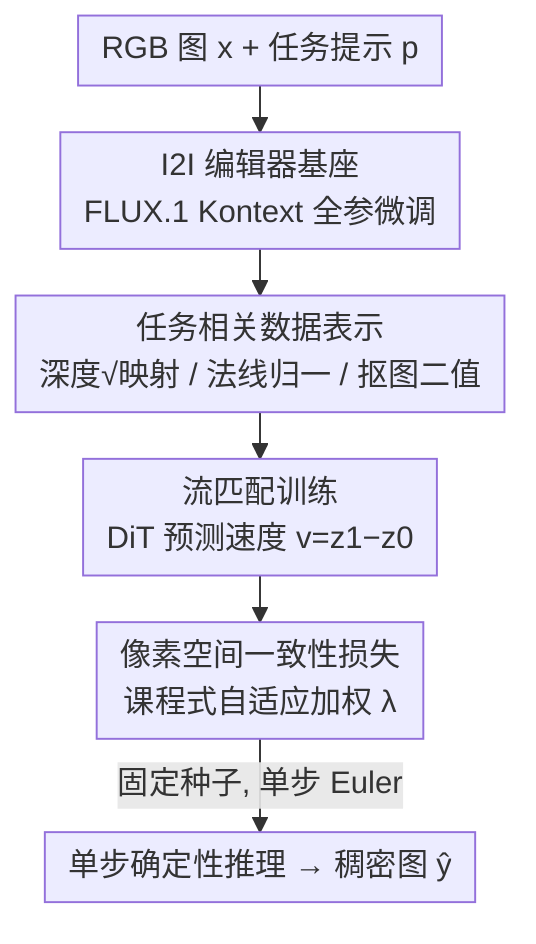

# Edit2Perceive: Image Editing Diffusion Models Are Strong Dense Perceivers

**会议**: CVPR 2026  
**论文**: [CVF Open Access](https://openaccess.thecvf.com/content/CVPR2026/html/Shi_Edit2Perceive_Image_Editing_Diffusion_Models_Are_Strong_Dense_Perceivers_CVPR_2026_paper.html)  
**代码**: https://github.com/showlab/Edit2Perceive  
**领域**: 3D视觉 / 扩散模型  
**关键词**: 单目深度估计, 表面法线估计, 交互式抠图, 图像编辑扩散, 流匹配单步推理

## 一句话总结
作者发现"图像编辑（I2I）扩散模型"天生就是确定性的图到图映射，比通常用的"文生图（T2I）"模型更适合做稠密感知，于是把 FLUX.1 Kontext 编辑器全参微调成统一的深度/法线/抠图感知器，配上像素空间一致性损失和理论最优的平方根深度映射，仅用 7 万多张训练图就在三个任务上单步推理打到 SOTA。

## 研究背景与动机
**领域现状**：单目深度、表面法线、交互式抠图这类稠密感知任务，近年的主流路线是借用大规模扩散模型的视觉先验——典型如 Marigold、GeoWizard、Lotus、E2E-FT，它们都是把 Stable Diffusion 这种**文生图（T2I）**扩散模型微调成深度/法线估计器，用很少的标注数据就能拿到不错的泛化。

**现有痛点**：作者指出这条路存在一个被忽视的**表征错配（representation mismatch）**。T2I 模型的预训练目标是"根据一段文本凭空合成多样的视觉内容"，本质是 concept→pixel 的语义组合，擅长想象、却不擅长推理一张已有图像内部的结构关系。而稠密感知恰恰相反：它要求确定性的、几何感知的逐像素预测，把同一张输入唯一地映射到深度/法线/alpha。用一个被训练去"随机生成"的模型去干"确定性还原"的活，先天目标就拧着。

**核心矛盾**：稠密感知需要的是"解析输入图像的结构（物体、表面、相互关系）"这种结构化先验，而 T2I 预训练并不显式逼模型去学这个；图到图编辑（I2I）模型却必须先把输入图解析成结构化场景表示，才能做出语义连贯的编辑——这正是感知任务想要的先验。

**本文目标 / 切入角度**：与其继续在 T2I 上打补丁，不如换地基——用 **I2I 编辑扩散模型**（FLUX.1 Kontext）当稠密感知的基座，把稠密感知重新表述成"把 RGB 图编辑成深度图/法线图/抠图"的条件编辑任务。

**核心 idea**：换基座（T2I→I2I 编辑器）+ 把随机生成路径压成确定性单步路径 + 用像素级一致性损失和理论最优归一化补上几何保真度，让一个编辑器变成统一的稠密感知器。

## 方法详解

### 整体框架
Edit2Perceive 建立在 FLUX.1 Kontext 之上——一个基于 DiT、用流匹配（flow matching）训练的编辑模型，它通过把文本 token、条件图像 token、目标 token 直接序列拼接来统一生成与编辑。作者把稠密感知形式化成一个**条件扩散编辑**问题：给定输入 RGB 图 $x \in \mathbb{R}^{H\times W\times 3}$ 和文本提示 $p$（如 "Transform to depth map while maintaining original composition"），预测目标稠密图 $y \in \mathbb{R}^{H\times W\times 3}$。

流程在预训练 VAE 的隐空间里跑：条件图 $x$ 编码成 $c_x$、目标图 $y$ 编码成目标隐 $z_1$、文本编码成 $c_p$。训练时在 $z_0\sim\mathcal{N}(0,I)$ 与 $z_1$ 之间用 Rectified Flow 连一条直线 $z_t=(1-t)z_0+tz_1$，恒定速度为 $v=z_1-z_0$；把含噪目标 token 与 $c_x, c_p$ 拼接喂进 DiT，让它预测这个速度 $v_\theta$。除了隐空间的流匹配损失，作者额外加一条**像素空间一致性损失**把几何保真度拉回来。推理时利用流匹配的确定性，用**单步 Euler** 直接从 $z_0$ 一跳到 $\hat z_1$，再 VAE 解码出稠密图，几乎不需要多步去噪。

### 关键设计

**1. I2I 编辑扩散当基座：换地基而非打补丁**

这是全文的中心论点，针对的就是上面说的"表征错配"。作者没有发明新网络，而是论证并实证：把基座从 T2I（FLUX.1）换成同架构的 I2I 编辑器（FLUX.1 Kontext），稠密感知性能会大幅跃升。原因是 I2I 编辑器的预训练目标"根据指令对已有图做语义连贯的修改"，隐含逼模型把输入解析成结构化场景表示（物体/表面/相互关系），天然带几何结构先验；而 T2I 只学了 concept→pixel 的语义组合。为坐实这点，作者做了严格的对照：给 T2I 模型也套上一模一样的 I2I 式微调管线（同样 token 拼接条件图+目标图），让两者唯一差异只剩预训练带来的先验。结果 I2I 全面碾压——最基础配置下深度任务在 NYUv2/KITTI 上 AbsRel 相对改善 25%/27%。注意力图可视化也显示：I2I 在第 1 个 epoch 就能抓出清晰物体边界，T2I 到第 3 个 epoch 还是散的。

**2. 像素空间一致性损失：把隐空间监督拉回像素级几何**

流匹配损失 $L_{FM}=\mathbb{E}\,\lVert v_\theta(\text{concat}(z_t,c_x,c_p),t)-v\rVert_2^2$ 只在隐空间监督速度，对 VAE 解码后的最终像素没有直接约束，隐空间的小误差解码后会被放大成模糊或结构伪影。作者因此在解码预测 $\hat y$ 与真值 $y$ 之间直接加一条**逐任务定制**的一致性损失 $L_{Cons}$：深度用尺度-平移不变 L1（先最小二乘对齐 $\hat y_{align}=s\hat y+t$ 再算 $\mathbb{E}[|y-\hat y_{align}|]$）；法线用基于 atan2 的角度误差 $\mathbb{E}[\text{atan2}(|y\times\hat y|, y\cdot\hat y)]$——它与 arccos 等价但在向量近共线时不会梯度爆炸；抠图则对未知过渡区 $U$ 和已知前景/背景区 $K$ 分别算 L1 以抠出边缘细节。两损失加权合并 $L=L_{FM}+\lambda L_{Cons}$，且 $\lambda$ 走**课程**：第一个 epoch 设 0 先让模型吃透扩散先验，之后按 $\lambda=\frac{\text{sg}(|L_{FM}|)}{\text{sg}(|L_{Cons}|)+\epsilon}\cdot\max(0,\frac{\text{step}}{N_{step}}-1)$ 线性增大（sg 为停梯度，$\epsilon=0.001$），逐渐把重心转向像素一致性。消融显示它对越弱的基座增益越大（T2I 上 AbsRel 降 1.0–1.4，I2I 上仅降 0.3–0.4），更像精修而非纠错。

**3. 平方根深度映射：从第一性原理推出的最优归一化**

深度图是单通道、长尾分布，要塞进编辑器要求的三通道 BF16、$[-1,1]$ 输入，直接线性归一化会让近处细节产生严重量化误差。作者把"找一个非线性映射 $g(y)$ 使量化引起的相对误差最小"形式化成对相对误差在深度范围上的积分最小化（式 10），再用 Cauchy-Schwarz 不等式证明当 $g'(y)\propto 1/\sqrt{y}$ 时积分取极小，于是最优映射就是 $g(y)=\sqrt{y}$。映射后再做基于百分位（p2/p98）的鲁棒线性归一化到 $[-1,1]$ 并复制到三通道。理论很漂亮地预测了实验：在深度范围大的室外 KITTI 上，sqrt 比均匀归一化的 AbsRel 改善（−1.4 到 −3.0）远大于室内 NYUv2（−0.4 到 −0.5），理论估算的改善量（NYUv2 ≈0.26、KITTI ≈0.6）与实测高度吻合。法线只需单位化 $y/\lVert y\rVert_2$，抠图则二值化后线性映到 $[-1,1]$。

**4. 单步确定性推理：把生成路径压成一跳**

稠密感知是高度确定性的任务，不像生成需要多步采样的多样性。作者借流匹配的直线轨迹，把训练与推理都**固定随机种子**保证输入-输出唯一可复现，推理时直接用单步 Euler 积分 $\hat z_1=z_0+v_\theta(\text{concat}(z_0,c_x,c_p),t{=}0)$ 一跳到目标隐，再解码。流匹配一般单步会失败，但因任务确定性强，这里单步已能打到有竞争力的结果；消融还发现性能在约 4 步达峰、再增步反而因过度平滑略降——印证稠密感知不需要久煮。这一步同时把推理 FLOPs 压得比其他生成式方法低（57T vs Marigold v1.1 的 105T、GeoWizard 的 780T）。

## 实验关键数据

三个任务全部 zero-shot 评测（除抠图的 AM-2k 外均为零样本泛化），单步推理、训练数据量远小于对手。

### 主实验（深度估计，AbsRel↓ / δ1↑，%）

| 数据集 | 指标 | Edit2Perceive | 次优 | 说明 |
|--------|------|---------------|------|------|
| NYU | AbsRel↓ | 4.4 | 4.5 (DAv2) | 仅用 74K 图超过用 62.6M 图的 DepthAnything V2 |
| ETH3D | AbsRel↓ | 4.3 | 5.9 (Lotus-G) | 相对次优降约 27% |
| Scannet | AbsRel↓ | 4.9 | 5.5 (Lotus-D) | 相对次优降约 11% |
| KITTI | δ1↑ | 94.5 | 94.6 (DAv2) | 接近判别式 SOTA |
| 平均排名 | AvgRank↓ | **1.5** | 2.9 (Lotus-D) | 五个 benchmark 综合第一 |

法线估计平均排名 1.4（NYU/Scannet/iBims-1/DIODE 全部第一或并列最优），交互式抠图平均排名 1.2（AIM-500/P3M-500-NP/AM-2k 上 MSE/MAD/SAD 等指标全面最低）。

### 消融实验（深度，NYUv2 / KITTI AbsRel↓）

| ID | 基座 | LCons | 深度映射 | NYU | KITTI |
|----|------|-------|----------|-----|-------|
| 1 | FLUX.1 (T2I) | ✗ | Uni | 6.8 | 13.2 |
| 4 | FLUX.1 (T2I) | ✓ | Sqrt | 5.3 | 8.4 |
| 5 | Kontext (I2I) | ✗ | Uni | 5.1 | 9.6 |
| 7 | Kontext (I2I) | ✗ | Sqrt | 4.7 | 8.2 |
| 8 | Kontext (I2I) | ✓ | Sqrt | **4.4** | **7.9** |

### 关键发现
- **基座是最大变量**：同配置下 I2I 全面压过 T2I（ID 5 vs 1，KITTI 13.2→9.6），证明结构化先验来自预训练目标而非架构。
- **一致性损失是即插即用精修件**：基座越弱增益越大（T2I 降 1.0–1.4，I2I 降 0.3–0.4），对法线/抠图这类边缘敏感任务尤为关键。
- **平方根映射验证理论**：深度范围越大改善越多（KITTI ≫ NYUv2），实测与积分误差理论预测高度一致。
- **数据效率惊人**：仅 ~74K 训练图就超过 62.6M 图的 DepthAnything V2，约为判别式方法 1/100 的数据量。

## 亮点与洞察
- **"换基座"这个观察本身最值钱**：大家都在 T2I 上卷采样和损失，作者一句"编辑模型天生是 I2I 一致映射"就把地基换对了，而且用同管线对照实验把"是先验不是架构"钉死，说服力很强。
- **理论最优归一化是教科书式的第一性原理**：把"量化误差最小"写成积分、用 Cauchy-Schwarz 解出 $g(y)=\sqrt{y}$，再用 KITTI/NYUv2 的不同深度范围反验理论预测值——这种"理论先行、实验对账"的写法很优雅，可迁移到任何要把长尾标签塞进固定精度通道的场景。
- **atan2 替 arccos 的小 trick**：法线角度损失用 atan2(叉积模, 点积) 在近共线处避免梯度爆炸，是可直接搬走的稳定性 trick。
- **单步确定性把生成式做成"快且省"**：固定种子 + 单步 Euler，既复现又把 FLOPs 压到生成式对手的一半甚至更低。

## 局限与展望
- 作者承认相比判别式模型（MoGe、UniDepth），本方法在推理速度和绝对精度上仍有差距，主打的是数据效率与统一性。⚠️ 论文未直接给出与判别式 SOTA 的精度差具体数值，以原文图 7 为准。
- 三任务各自单独训练、单 H200 各约 1.5 天，并非真正"一模通吃"的单权重多任务模型；统一的是框架而非一套参数。
- 像素一致性损失需逐任务手工定制（深度/法线/抠图各一套公式），换新任务仍要设计对应损失。
- 改进方向：把三任务并入单一权重的真·统一感知器；探索把"编辑器即感知器"扩展到光流、分割等更多稠密任务。

## 相关工作与启发
- **vs Marigold / GeoWizard / Lotus / E2E-FT**：它们都在 T2I（Stable Diffusion）基座上微调并改进采样/单步推理；本文论证 T2I 存在表征错配，改用 I2I 编辑器基座，同等数据下大幅领先。
- **vs FE2E（并发工作）**：FE2E 同样基于编辑扩散，但走确定性零噪去噪 + 恒速训练 + 对数深度归一化；本文强调几何保真度，用像素一致性损失 + 理论推导的平方根深度映射，并保留高斯噪声以更好利用编辑器的生成先验。
- **vs SDMatte / MAM / SMat（抠图扩散）**：它们用扩散先验改进边缘细节但仍基于 T2I 思路；本文把抠图纳入同一 I2I 编辑感知框架，平均排名 1.2 超过全部抠图专用方法。

## 评分
- 新颖性: ⭐⭐⭐⭐⭐ "I2I 编辑器更适合稠密感知"的洞察简单却反直觉，且配理论最优归一化，立得住。
- 实验充分度: ⭐⭐⭐⭐⭐ 三任务全 zero-shot SOTA + 同管线 T2I/I2I 严格对照 + 理论与实验对账，证据链完整。
- 写作质量: ⭐⭐⭐⭐ 论点清晰、理论推导漂亮；个别公式（式 9/10）需查附录才完全清楚。
- 价值: ⭐⭐⭐⭐⭐ 给"扩散模型做感知"换了更对的地基，数据效率高、推理省，可迁移到更多稠密任务。

<!-- RELATED:START -->

## 相关论文

- [\[CVPR 2026\] VDFE: Difference-Aware 3D Scene Editing with Non-Intrusive Video Diffusion Priors for Multi-View Consistency and Efficiency](vdfe_difference-aware_3d_scene_editing_with_non-intrusive_video_diffusion_priors.md)
- [\[CVPR 2026\] FE2E: From Editor to Dense Geometry Estimator](from_editor_to_dense_geometry_estimator.md)
- [\[CVPR 2025\] Kiss3DGen: Repurposing Image Diffusion Models for 3D Asset Generation](../../CVPR2025/3d_vision/kiss3dgen_repurposing_image_diffusion_models_for_3d_asset_generation.md)
- [\[CVPR 2026\] PR-IQA: Partial-Reference Image Quality Assessment for Diffusion-Based Novel View Synthesis](pr-iqa_partial-reference_image_quality_assessment_for_diffusion-based_novel_view.md)
- [\[CVPR 2026\] StableMTL: Repurposing Latent Diffusion Models for Multi-Task Learning from Partially Annotated Synthetic Datasets](stablemtl_repurposing_latent_diffusion_models_for_multi-task_learning_from_parti.md)

<!-- RELATED:END -->
