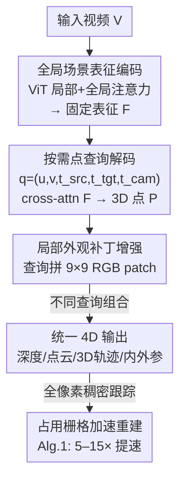

# Efficiently Reconstructing Dynamic Scenes One D4RT at a Time

**会议**: CVPR 2026  
**论文**: [CVF Open Access](https://openaccess.thecvf.com/content/CVPR2026/html/Zhang_Efficiently_Reconstructing_Dynamic_Scenes_One_D4RT_at_a_Time_CVPR_2026_paper.html)  
**代码**: 项目页 https://d4rt-paper.github.io/ （未见开源代码，⚠️ 以官方为准）  
**领域**: 3D视觉  
**关键词**: 动态4D重建, 点轨迹跟踪, 前馈Transformer, 按需查询解码, 相机位姿估计

## 一句话总结
D4RT 用一个统一的 encoder-decoder Transformer，把视频先编码成一份固定的全局场景表征，再用「独立查询任意时空点的 3D 位置」这一个解码接口同时拿到深度、点云、3D 点轨迹和相机内外参，在动态 4D 重建与跟踪上全面刷新 SOTA，且速度比 VGGT 快约 9×、比 MegaSaM 快约两个数量级。

## 研究背景与动机
**领域现状**：从单段视频里恢复动态场景的几何与运动（即「4D 重建」），是计算机视觉的一个硬骨头。近期主流走的是前馈路线：DUSt3R 证明 Transformer 能直接从无位姿、无标定的图像对回归 3D，VGGT 把它从图像对扩展到任意帧数的全局注意力。

**现有痛点**：这些方法把 4D 重建拆成了一堆「各管一段」的子任务。MegaSaM 要靠一拼盘的现成模型分别估单目深度、度量深度、运动分割，再用昂贵的测试时优化把这些信号缝到几何一致；VGGT 这类则为深度、位姿、点云各开一个专用解码头。更要命的是，这两类方法都给不出**动态区域**的对应关系。SpatialTrackerV2 虽然能处理动态，但它是多阶段、靠迭代精修，推理很慢，而且只能从单帧出发跟踪点，遮挡区域会留下空洞。

**核心矛盾**：以往的解码方式是「逐帧、稠密」的——要么每帧每像素都解码（计算量爆炸），要么为每个任务维护独立解码器（架构臃肿、还互相不一致）。这种「一次性把所有东西、所有地方、所有时刻都解出来」的刚性范式，天生不适配一个会动的世界。

**本文目标**：用一个单阶段、单解码器的统一架构，同时支持静态与动态场景下的深度、点云、3D 轨迹、相机内外参，并且要又快又准。

**切入角度**：把范式从「碎片化的帧级稠密解码」换成「高效的按需查询」——先把整段视频压成一份全局表征，之后想知道哪个点的 3D 位置，就单独去查它。

**核心 idea**：一个查询 = 「某源帧某 2D 点，在某目标时刻、从某相机视角看的 3D 位置」，每个查询彼此独立地去 cross-attend 全局表征；任务的差异只是查询参数的不同组合，从而把所有 4D 任务统一进同一个解码接口。

## 方法详解

### 整体框架
D4RT 是一个受 Scene Representation Transformer 启发的 encoder-decoder 前馈模型。给定视频 $V \in \mathbb{R}^{T \times H \times W \times 3}$，重型 encoder $E$ 先把它编码成一份**全局场景表征** $F = E(V) \in \mathbb{R}^{N \times C}$，这份表征要捕捉整段视频跨帧的稠密对应、时间流动及其对场景的影响。$F$ 一旦算出就**全程固定**；第二阶段由一个轻量 decoder $D$ 反复地从大量查询里 cross-attend 进 $F$。

一个查询定义为 $q = (u, v, t_{\text{src}}, t_{\text{tgt}}, t_{\text{cam}})$：$(u,v)\in[0,1]^2$ 是源帧 $t_{\text{src}}$ 上某 2D 点的归一化坐标，$t_{\text{tgt}}$ 指定要把这个点看到哪个**目标时刻**的状态，$t_{\text{cam}}$ 指定用哪一帧的相机坐标系作为参考。每个查询**完全独立**地与 $F$ 交互，输出该点的 3D 位置 $P = D(q, F) \in \mathbb{R}^3$。三个时间索引互不绑定，把「空间」和「时间」彻底解耦。

整段流程是「视频 → 编码 → 全局表征 → 独立查询 → 3D 点 → 组合成各类 4D 输出」：

### 关键设计

**1. 按需点查询解码：把所有 4D 任务塞进一个解码接口**

这是全文的核心创新，直接针对「逐帧稠密解码太贵、多任务多解码头太乱」的痛点。decoder 不再一次性吐出整帧的稠密预测，而是把每个时空点当成一个可独立提问的查询：固定源点 $(u,v,t_{\text{src}})$、让 $t_{\text{tgt}}=t_{\text{cam}}$ 扫过 $\{1\dots T\}$，就得到这个点的 **3D 点轨迹**；让 $(u,v)$ 扫满整帧网格、$t_{\text{cam}}$ 固定，就得到**点云**；再约束 $t_{\text{src}}=t_{\text{tgt}}=t_{\text{cam}}$ 并只取输出的 Z 分量，就是**深度图**。换句话说，任务的区别只在于查询参数取笛卡尔积的方式不同（见原文 Tab.1），同一套权重、同一个接口覆盖全部。

相机参数也由查询导出而非另设回归头。要算第 $i,j$ 两帧的相对位姿，就在 $(h,w)$ 粗网格上采一批源点，分别构造 $q_i=(u,v,i,i,i)$ 与 $q_j=(u,v,i,i,j)$——两组解码出的是「同一批 3D 点在不同参考系下的坐标」，于是只需求它们之间的刚性变换，用 Umeyama 算法解一个 $3\times3$ 的 SVD 即可。内参则在假设针孔模型、主点 $(0.5,0.5)$ 下，由解码出的 3D 点 $(p_x,p_y,p_z)$ 闭式求焦距：

$$f_x = p_z (u - 0.5)/p_x, \qquad f_y = p_z (v - 0.5)/p_y$$

对 $k$ 个估计取中位数以求稳健。点云重建直接在共享参考系 $t_{\text{cam}}$ 下预测所有像素的 3D 位置，省掉了用噪声相机估计做坐标变换这一步。

**2. 轻量独立解码器：用「不让查询互相说话」换来可扩展与全局一致**

decoder 是个小的 cross-attention Transformer，每个查询 token 先由 $(u,v)$ 的 Fourier 特征 + $t_{\text{src}}/t_{\text{tgt}}/t_{\text{cam}}$ 三个可学习的离散时间嵌入相加构成，再独立地 cross-attend $F$，最后过一个简单的学习投影映射到 $P$。关键设计决策是：**查询之间绝不做 self-attention**。这有两层好处：训练时每段视频只需解码一小撮精选点做监督，显存和算力开销都很省；推理时查询天然可并行，所以 D4RT 在多个任务上比现有方法快得多。作者还给出了一个反直觉的实证——早期实验里一旦让查询间相互注意，推理性能会**大幅下降**，因为模型会过拟合训练时的查询分布，带来 train-test 分布偏移。于是空间与时间一致性不是靠重型耦合解码（如 DPT、CoTracker）硬凑出来的，而是被「逼」进了 encoder：正因为 decoder 又稀疏又轻，encoder 必须把全局一致信息隐式编码进 $F$。

**3. 局部 RGB 外观补丁：给查询补低层线索，换来子像素级锐利**

只有 $(u,v)$ 坐标 + 时间嵌入的查询，定位偏粗。作者在查询里额外拼上以 $(u,v)$ 为中心的 $9\times9$ 像素 RGB 补丁嵌入，带来「dramatic」的性能提升。原因有二：(i) 局部外观帮查询和编码的时空特征建立更可靠的对应；(ii) 这些补丁提供低层线索，帮模型把物体从背景里分割出来，从而得到边界更锐、细粒度更高的深度（消融 Tab.7 与可视化 Fig.6 都印证了这点）。

**4. 占用栅格加速的全像素稠密跟踪：把 $O(T^2HW)$ 的暴力查询砍掉大头**

正因为 decoder 稀疏又轻，D4RT 能去做一件别人做不了的事——为视频里**所有**像素（含动态）算稠密对应，从而拼出无遮挡空洞、无稀疏伪影的完整 4D 重建。但若朴素地为每个像素的每条轨迹都查询，复杂度是 $O(T^2HW)$，绝大多数查询其实冗余。Alg.1 用一个占用栅格 $G\in\{0,1\}^{T\times H\times W}$ 利用时空冗余：只从「未访问」像素发起新轨迹，每条贯穿全视频的轨迹会把它可见经过的所有时空像素标记为已访问，从而跳过重复。实测随运动复杂度自适应地带来 5–15× 提速。这是 D4RT 独占的能力——纯重建方法给不出动态对应、稠密帧级解码方法仍困在朴素的昂贵路径、重型稀疏解码器又有过高的单查询成本。

### 损失函数 / 训练策略
模型在 Kauldron 中端到端训练，对一批 $N$ 个采样查询的加权损失求和。主监督是对归一化 3D 点位置的 L1 loss：预测与真值点集各自按其平均深度归一化，再经 $\text{sign}(x)\cdot\log(1+|x|)$ 变换以抑制远点对损失的主导。辅助监督包括：图像空间 2D 坐标的 L1、3D 表面法向的余弦相似度、目标点可见性的二元交叉熵、点运动向量的 L1；并加一项置信度惩罚 $-\log(c)$，其中 $c$ 进一步加权 3D 点误差。所有损失仅在有真值监督处生效。训练用 ViT-g（40 层、时空 patch $2\times16\times16$）作 encoder（1B 参数）+ 8 层 cross-attention decoder（144M 参数），在 48 帧、$256\times256$ 的片段上训 500k 步，每段解码 2048 个（在特定区域过采样的）随机查询，64 块 TPU、约 2 天完成。encoder 用公开的 VideoMAEv2 权重初始化，这一步对成功至关重要。

## 实验关键数据

### 主实验
4D 重建与跟踪（TAPVid-3D，世界坐标系 3D 跟踪，APD3D 越高越好，⚠️ 部分子集数值以原文 Tab.4 为准）：

| 数据集 (World 3D track) | 指标 | D4RT | SpatialTrackerV2 | CoTracker3+VGGT |
|--------|------|------|------|------|
| DriveTrack | AJ | **0.304** | 0.195 | 0.245 |
| ADT | AJ | **0.307** | 0.303 | 0.175 |
| PStudio | AJ | **0.372** | 0.175 | 0.215 |

点云 / 视频深度（L1、AbsRel 越低越好，Tab.5）：

| 任务/数据集 | 指标 | D4RT | ε3 | SpatialTrackerV2 | VGGT |
|--------|------|------|------|------|------|
| 点云 Sintel | L1 | **0.768** | 1.139 | 1.375 | 1.582 |
| 点云 ScanNet | L1 | **0.028** | 0.030 | 0.036 | 0.063 |
| 深度 Sintel | AbsRel (S) | **0.171** | 0.241 | 0.209 | 0.318 |

相机位姿（Tab.6，ATE/RPE 越低越好，Pose AUC 越高越好）：

| 数据集 | 指标 | D4RT | ε3 | MegaSaM |
|--------|------|------|------|------|
| Sintel | ATE | **0.065** | 0.086 | 0.074 |
| ScanNet | ATE | **0.014** | 0.015 | 0.029 |
| Re10K | Pose AUC@30 | **83.5** | 78.7 | 71.0 |

效率（Tab.3，单 A100 上给定 FPS 下能产出的全视频 3D 轨迹数，越多越好）：在 1 FPS 目标下 D4RT 可产 40,180 条，而 SpatialTrackerV2 仅 2,290、DELTA 5,770，整体比对手快 18–300×；位姿估计可达 200+ FPS，比 VGGT 快约 9×、比 MegaSaM 快约 100×。

### 消融实验
| 配置 | Sintel 深度 AbsRel(S) | Sintel 位姿 ATE | 说明 |
|------|------|------|------|
| D4RT (ViT-L 默认) | 0.302 | 0.091 | 完整模型 |
| w/o local patch | 0.366 | 0.173 | 去掉局部 RGB 补丁，深度与位姿同时显著变差 |
| w/o 2D position loss | +0.071 | +0.002 | 去掉后深度掉最多 |
| w/o confidence loss | +0.002 | +0.126 | 去掉后位姿崩坏（ATE 暴涨） |
| ViT-B → ViT-g (encoder) | 0.319 → 0.191 | — | backbone 越大，深度与 RPE-R 越好 |

### 关键发现
- **局部 RGB 补丁是性价比最高的设计**：仅给查询拼一个 $9\times9$ 补丁，Sintel 深度 AbsRel(S) 从 0.366 降到 0.302、ATE 从 0.173 降到 0.091，还显著锐化了物体边界。
- **辅助损失各司其职、存在轻微 trade-off**：2D 位置与法向损失主要拉深度，置信度损失对位姿至关重要（去掉后 ATE +0.126、RPE-R +0.115），位移损失则全面带来小幅提升。
- **不让查询互相注意反而更好**：开启查询间 self-attention 会因 train-test 查询分布偏移导致推理大幅掉点，这把「全局一致性」的负担成功转嫁给了 encoder。
- **能力随 encoder 单调扩展**：ViT-B→ViT-g 时深度 AbsRel(S) 从 0.319 一路降到 0.191，说明该接口设计不构成扩展瓶颈。

## 亮点与洞察
- **把「任务多样性」收敛成「查询参数多样性」**：深度/点云/轨迹/内外参不再各有解码头，而是同一个 $D(q,F)$ 在不同 $(u,v,t_{\text{src}},t_{\text{tgt}},t_{\text{cam}})$ 组合下的特例——这个统一接口的抽象非常漂亮，也是它又快又通用的根源。
- **相机参数「免费」从点查询里闭式导出**：位姿靠两组同点不同参考系的查询 + Umeyama SVD，内参靠针孔几何闭式求焦距，省掉专门的位姿回归头，还顺带说明了「点查询」表征有多够用。
- **「让模型变笨一点反而更稳」的反直觉**：刻意禁止查询交互，把一致性逼进 encoder，既省算力又躲开分布偏移——这种「用架构约束代替重型耦合」的思路可迁移到其它需要稠密预测但又怕过拟合查询分布的任务。
- **占用栅格做稠密跟踪**：把 $O(T^2HW)$ 的暴力查询用「已访问标记」剪到自适应 5–15× 提速，是个干净的工程 trick，凡是「轨迹会重复经过同一时空格」的稠密预测都能借用。

## 局限与展望
- 论文主打高效与统一，但训练成本本身不低（1B encoder、64 TPU、约 2 天），且依赖 VideoMAEv2 预训练初始化与含内部数据的训练混合——虽然作者另做了「仅公开数据」变体仍保持 SOTA（见附录），但完整复现门槛偏高。
- 内参闭式推导假设针孔模型、主点固定在 $(0.5,0.5)$；带畸变的相机（如鱼眼）需在初始估计上再加一步非线性精修，⚠️ 这部分鲁棒性以原文与附录为准。
- 评测以合成/受控数据（Sintel、ScanNet、TAPVid-3D 子集）为主，in-the-wild 仅有定性展示（Fig.5），真实长视频、剧烈运动下的失败模式缺乏定量刻画。
- 「禁止查询交互」虽避免了分布偏移，但也意味着一致性完全压在 $F$ 上；当场景超出 encoder 表征容量（极长视频、超多动态实体）时，是否仍能保持全局一致，值得进一步验证。

## 相关工作与启发
- **vs MegaSaM**：MegaSaM 用一拼盘现成模型分别估深度/分割，再靠测试时优化缝几何一致；D4RT 单阶段前馈、单解码器直接出全部 4D 输出，位姿吞吐高出约两个数量级，且能给动态对应。
- **vs VGGT**：VGGT 把 DUSt3R 扩到全局注意力，但为各任务开独立解码头、给不出动态区域对应；D4RT 用统一查询接口覆盖全部任务，位姿估计约快 9×、精度更高。
- **vs SpatialTrackerV2**：STv2 能处理动态但是多阶段、靠迭代精修、只能从单帧起跟踪（留遮挡空洞）；D4RT 单阶段、可从任意帧查询任意时空点，唯一能重建含全部像素的完整 4D 表征，跟踪吞吐快 18–300×。
- **vs St4RTrack / DPM**：二者沿用 DUSt3R 的「成对」范式，无法整体处理视频；D4RT 以全局表征一次性承载整段视频上下文。

## 评分
- 新颖性: ⭐⭐⭐⭐⭐ 「按需时空点查询统一全部 4D 任务 + 刻意禁止查询交互」是真正换范式的设计。
- 实验充分度: ⭐⭐⭐⭐⭐ 覆盖 4D 跟踪/点云/深度/位姿/效率多维评测，外加 backbone、辅助损失、局部补丁等系统消融。
- 写作质量: ⭐⭐⭐⭐ 结构清晰、动机层层递进，统一接口的表述很有说服力；部分关键能力（畸变相机、仅公开数据）下放到附录略影响自洽阅读。
- 价值: ⭐⭐⭐⭐⭐ 又快又准又统一，为下一代 4D 感知提供了一个简洁可扩展的接口范式。

<!-- RELATED:START -->

## 相关论文

- [\[CVPR 2026\] MotionScale: Reconstructing Appearance, Geometry, and Motion of Dynamic Scenes with Scalable 4D Gaussian Splatting](motionscale_reconstructing_appearance_geometry_and_motion_of_dynamic_scenes_with.md)
- [\[CVPR 2026\] Inferring Compositional 4D Scenes without Ever Seeing One](inferring_compositional_4d_scenes_without_ever_seeing_one.md)
- [\[CVPR 2026\] Space-Time Forecasting of Dynamic Scenes with Motion-aware Gaussian Grouping](space-time_forecasting_of_dynamic_scenes_with_motion-aware_gaussian_grouping.md)
- [\[CVPR 2026\] FunREC: Reconstructing Functional 3D Scenes from Egocentric Interaction Videos](funrec_reconstructing_functional_3d_scenes_from_egocentric_interaction_videos.md)
- [\[CVPR 2026\] Dynamic-Static Decomposition for Novel View Synthesis of Dynamic Scenes with Spiking Neurons](dynamic-static_decomposition_for_novel_view_synthesis_of_dynamic_scenes_with_spi.md)

<!-- RELATED:END -->
